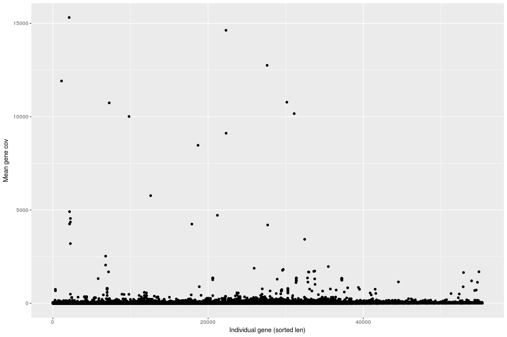
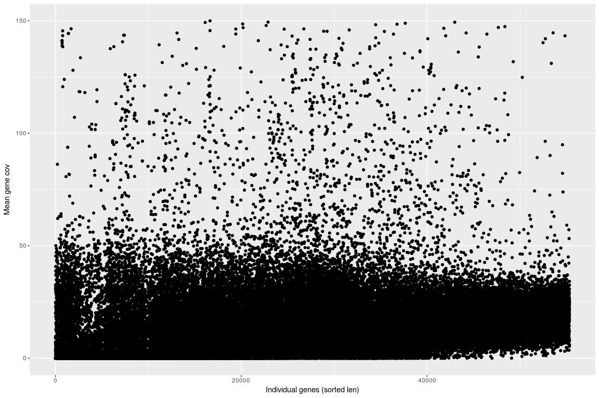
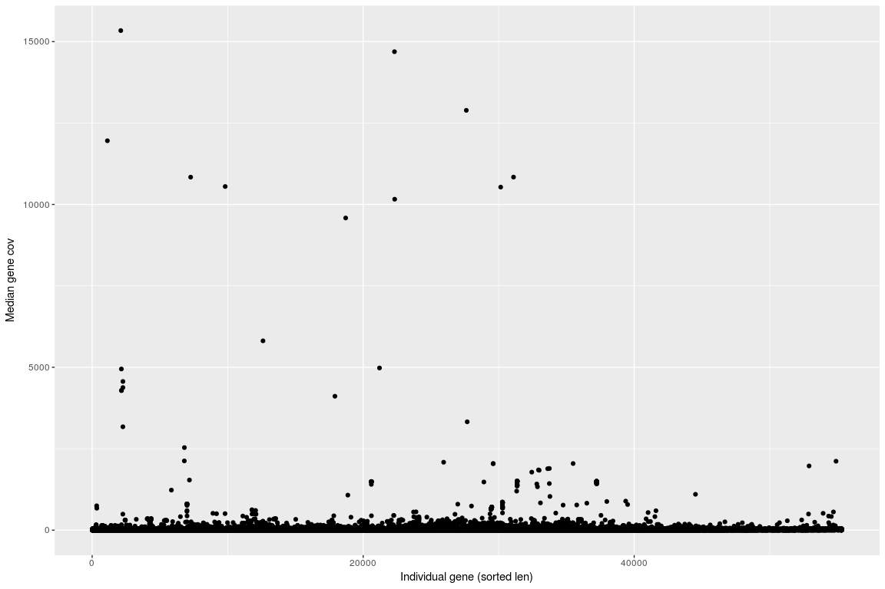
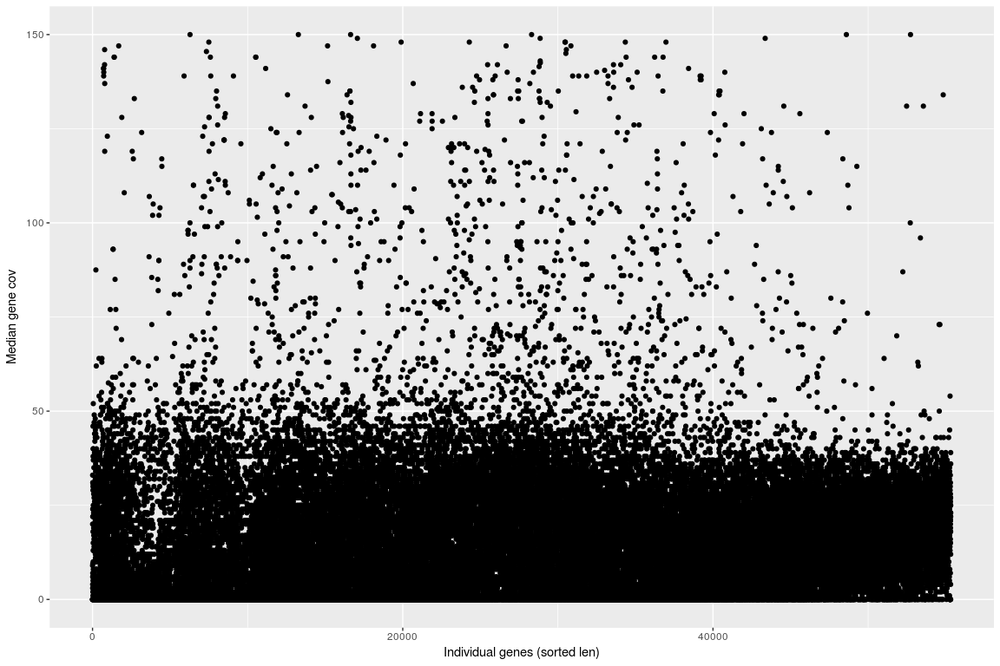
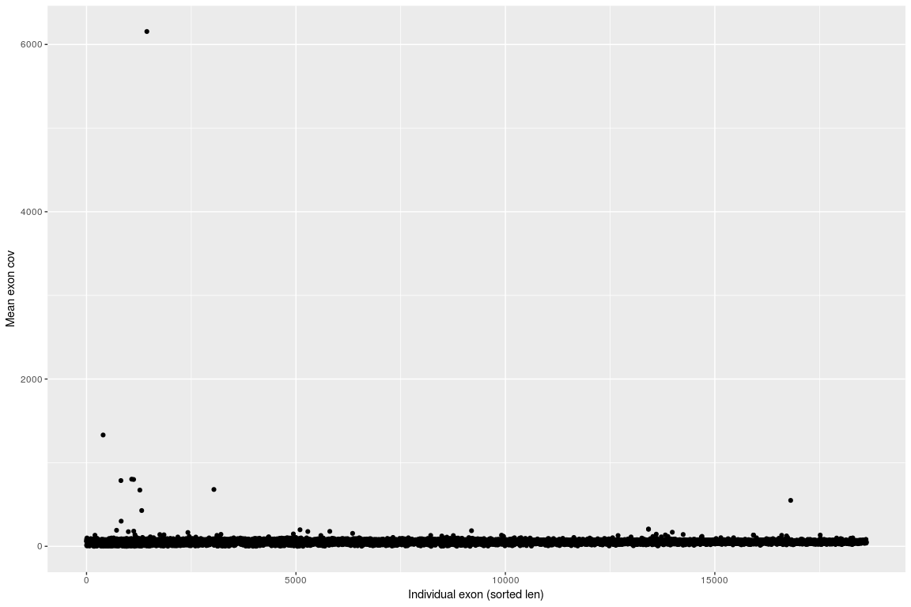
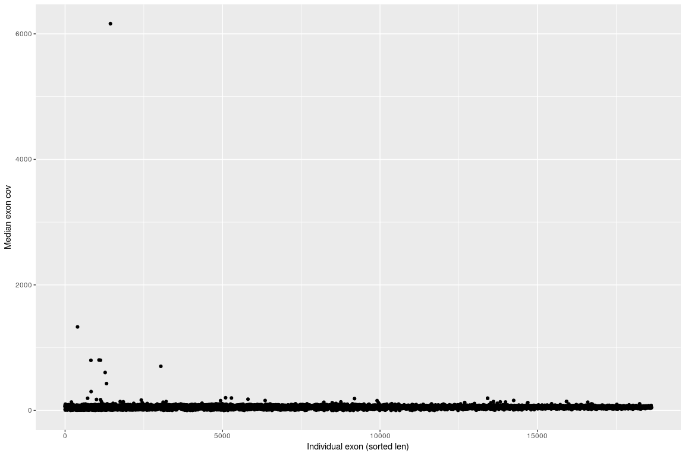
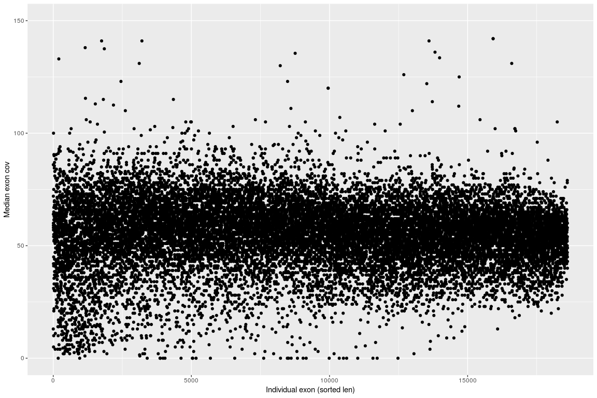

Statistics binning - coverage
================

Load dataset
------------

``` r
PerBaseCov <- read.table(gzfile("/projects/btl/kgagalova/PHD_projects2/GeneDuplicationTool/data/GenomeAnnotation/Kollector/Spruce/WS77111/ExonsCovselGCATKollectorSortForR.gff.gz"), header=FALSE)

head(PerBaseCov)
```

    ##                                   V1   V2 V3            V4
    ## 1 17731:cdhit-output-4_5=iteration.1 1827 87 1827_1946exon
    ## 2 17731:cdhit-output-4_5=iteration.1 1828 87 1827_1946exon
    ## 3 17731:cdhit-output-4_5=iteration.1 1829 87 1827_1946exon
    ## 4 17731:cdhit-output-4_5=iteration.1 1830 88 1827_1946exon
    ## 5 17731:cdhit-output-4_5=iteration.1 1831 88 1827_1946exon
    ## 6 17731:cdhit-output-4_5=iteration.1 1832 89 1827_1946exon
    ##                                                                         V5
    ## 1 GQ0047_F08.1clone=GQ0047_F08cluster=GQ0047_F08status=completegb=BT100854
    ## 2 GQ0047_F08.1clone=GQ0047_F08cluster=GQ0047_F08status=completegb=BT100854
    ## 3 GQ0047_F08.1clone=GQ0047_F08cluster=GQ0047_F08status=completegb=BT100854
    ## 4 GQ0047_F08.1clone=GQ0047_F08cluster=GQ0047_F08status=completegb=BT100854
    ## 5 GQ0047_F08.1clone=GQ0047_F08cluster=GQ0047_F08status=completegb=BT100854
    ## 6 GQ0047_F08.1clone=GQ0047_F08cluster=GQ0047_F08status=completegb=BT100854

``` r
colNams = c("contig","pos","cove","exon","gene")
colnames(PerBaseCov) = colNams

PerBaseCov$exon = as.factor(PerBaseCov$exon)
PerBaseCov$gene = as.factor(PerBaseCov$gene)
```

Including Plots
---------------

``` r
library(plyr)
library(ggplot2)

r1 = ddply(PerBaseCov,~gene,summarize,mean=mean(cove),sd=sd(cove),len=length(cove),med=median(cove))
r1<-r1[with(r1, order(len)),]
r1$pos = 1:nrow(r1)

r1exons = ddply(PerBaseCov, gene~exon,summarize,mean=mean(cove),sd=sd(cove),len=length(cove),med=median(cove))
r1exons<-r1exons[with(r1exons, order(len)),]
r1exons$pos = 1:nrow(r1exons)

#######Plot
pd <- position_dodge(0.1)
ggplot(r1, aes(pos,mean)) + geom_point() + ylab("Mean gene cov") + xlab("Individual gene (sorted len)")
```



``` r
ggplot(r1,aes(pos,mean)) + geom_point() + scale_y_continuous(limits = c(0, 150)) + ylab("Mean gene cov") + xlab("Individual gene (sorted len)")
```



``` r
ggplot(r1, aes(pos,med)) + geom_point() + ylab("Median gene cov") + xlab("Indivisual gene (sorted len)")
```



``` r
ggplot(r1,aes(pos,med)) + geom_point() + scale_y_continuous(limits = c(0, 150)) + ylab("Median gene cov") + xlab("Individual gene (sorted len)")
```



``` r
summary(r1$len)
```

    ##    Min. 1st Qu.  Median    Mean 3rd Qu.    Max. 
    ##     117     918    1250    1300    1601    4948

``` r
summary(r1$mean)
```

    ##    Min. 1st Qu.  Median    Mean 3rd Qu.    Max. 
    ##   16.89   47.58   55.02   53.94   60.70  291.00

``` r
summary(r1$med)
```

    ##    Min. 1st Qu.  Median    Mean 3rd Qu.    Max. 
    ##   14.00   48.00   55.00   53.77   61.00  183.00

``` r
summary(r1$sd)
```

    ##    Min. 1st Qu.  Median    Mean 3rd Qu.    Max. 
    ##    2.18    8.86   11.19   12.55   13.93 1306.10

``` r
#######Plot

ggplot(r1exons, aes(pos,mean)) + geom_point() + ylab("Mean exon cov") + xlab("Individual exon (sorted len)")
```



``` r
ggplot(r1exons,aes(pos,mean)) + geom_point() + scale_y_continuous(limits = c(0, 150)) + ylab("Mean exon cov") + xlab("Individual exon (sorted len)")
```


``` r
ggplot(r1exons, aes(pos,med)) + geom_point() + ylab("Median exon cov") + xlab("Individual exon (sorted len)")
```



``` r
ggplot(r1exons,aes(pos,med)) + geom_point() + scale_y_continuous(limits = c(0, 150)) + ylab("Median exon cov") + xlab("Individual exon (sorted len)")
```



``` r
summary(r1exons$len)
```

    ##    Min. 1st Qu.  Median    Mean 3rd Qu.    Max. 
    ##     1.0    97.0   212.0   341.3   478.0  4159.0

``` r
summary(r1exons$mean)
```

    ##     Min.  1st Qu.   Median     Mean  3rd Qu.     Max. 
    ##    0.038   46.915   56.171   55.767   64.352 6154.811

``` r
summary(r1exons$med)
```

    ##    Min. 1st Qu.  Median    Mean 3rd Qu.    Max. 
    ##    0.00   47.00   56.00   55.76   64.25 6162.00

``` r
summary(r1exons$sd)
```

    ##     Min.  1st Qu.   Median     Mean  3rd Qu.     Max.     NA's 
    ##    0.000    3.041    5.298    6.395    8.394 1821.138       20
