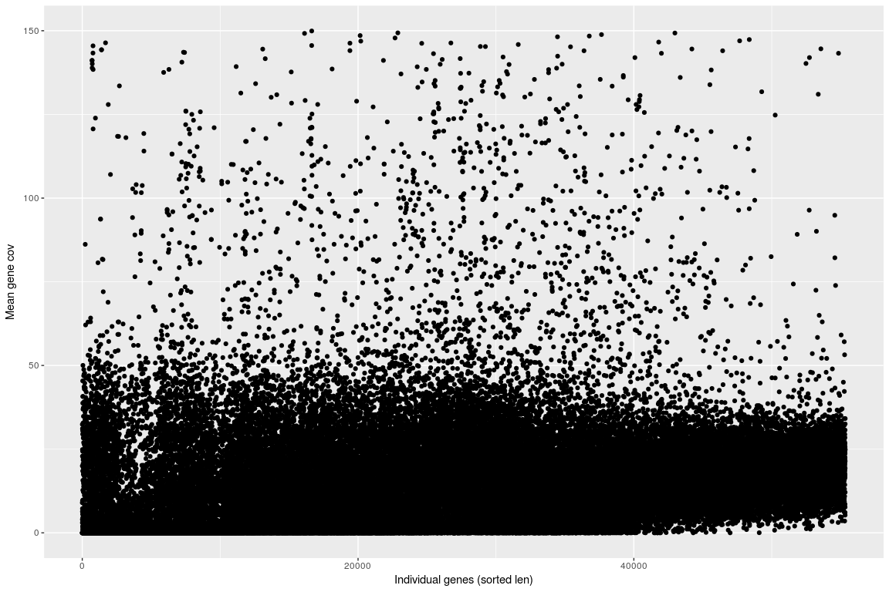

Human sample - WGS genes coverage with mrsFast
================

Load datasets
-------------

``` r
PerBaseCovGenes <- read.table(gzfile("/projects/btl/kgagalova/PHD_projects2/GeneDuplicationTool/data/GenomeAnnotation/WholeGenome/H.sapiens/Homo_sapiens.GRCh38.90_NA12878_S1_LallforRgenes.bed.gz"), header=FALSE)

head(PerBaseCovGenes)
```

    ##   V1                      V2  V3 V4              V5              V6
    ## 1  7 127588345_127588565exon 100  0 ENST00000000233 ENSG00000004059
    ## 2  7 127588345_127588565exon  10  0 ENST00000000233 ENSG00000004059
    ## 3  7 127588345_127588565exon 101  0 ENST00000000233 ENSG00000004059
    ## 4  7 127588345_127588565exon 102  0 ENST00000000233 ENSG00000004059
    ## 5  7 127588345_127588565exon 103  0 ENST00000000233 ENSG00000004059
    ## 6  7 127588345_127588565exon 104  0 ENST00000000233 ENSG00000004059

``` r
colNams = c("contig","exon","pos_exon","cov","trans","gene")
colnames(PerBaseCovGenes) = colNams
#colnames(ensembl90genes_trans) = c("gene","trans")

PerBaseCovGenes$exon = as.factor(PerBaseCovGenes$exon)
PerBaseCovGenes$gene = as.factor(PerBaseCovGenes$gene)
```

Including Plots
---------------

``` r
library(plyr)
library(ggplot2)

r1 = ddply(PerBaseCovGenes,~trans,summarize,mean=mean(cov),sd=sd(cov),len=length(cov),med=median(cov))
r1<-r1[with(r1, order(len)),]
r1$pos = 1:nrow(r1)

r2 = ddply(PerBaseCovGenes,~gene,summarize,mean=mean(cov),sd=sd(cov),len=length(cov),med=median(cov))
r2 = r2[with(r2, order(len)),]
r2$pos = 1:nrow(r2)

r1exons = ddply(PerBaseCovGenes, gene~exon,summarize,mean=mean(cov),sd=sd(cov),len=length(cov),med=median(cov))
r1exons<-r1exons[with(r1exons, order(len)),]
r1exons$pos = 1:nrow(r1exons)

#######Plot
pd <- position_dodge(0.1)
ggplot(r2, aes(pos,mean)) + geom_point() + ylab("Mean gene cov") + xlab("Individual gene (sorted len)")
```


``` r
ggplot(r2,aes(pos,mean)) + geom_point() + scale_y_continuous(limits = c(0, 150)) + ylab("Mean gene cov") + xlab("Individual genes (sorted len)")
```



``` r
ggplot(r2, aes(pos,med)) + geom_point() + ylab("Median gene cov") + xlab("Individual gene (sorted len)")
```


``` r
ggplot(r2,aes(pos,med)) + geom_point() + scale_y_continuous(limits = c(0, 150)) + ylab("Median gene cov") + xlab("Individual genes (sorted len)")
```


``` r
ggplot(r1, aes(pos,mean)) + geom_point() + ylab("Mean gene cov") + xlab("Indivisual gene (sorted len)")
```


``` r
ggplot(r1,aes(pos,mean)) + geom_point() + scale_y_continuous(limits = c(0, 150)) + ylab("Mean transcripts cov") + xlab("Individual transcript (sorted len)")
```


``` r
ggplot(r1, aes(pos,med)) + geom_point() + ylab("Median gene cov") + xlab("Indivisual gene (sorted len)")
```


``` r
ggplot(r1,aes(pos,med)) + geom_point() + scale_y_continuous(limits = c(0, 150)) + ylab("Median transcripts cov") + xlab("Individual transcript (sorted len)")
```


Total reads: *322,378,998* (pairs)
Read length: *250* (pe reads)
Average coverage: LN / G
(250 \* 2) \* 322,378,998 / 3,300,000,000 = 48.84X
