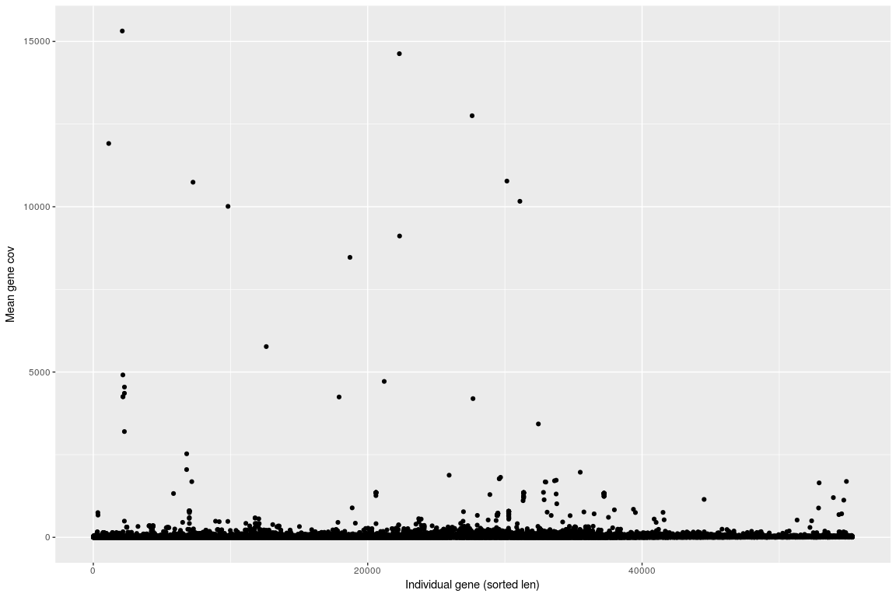

SHuman sample - WGS genes coverage with BBmap
================

Load datasets
-------------

``` r
PerBaseCovGenes <- read.table(gzfile("//projects/btl/kgagalova/PHD_projects2/GeneDuplicationTool/data/GenomeAnnotation/SelectedGenesAllGenenome/H.sapiens/BBmap/Homo_sapiens.GRCh38.90.genesFlanking_NA12878_s175forR.bed.gz"), header=FALSE)

head(PerBaseCovGenes)
```

    ##                       V1          V2 V3 V4                V5
    ## 1 10:100042092-100081977 101_481exon  1 28 ENST00000370418.7
    ## 2 10:100042092-100081977 101_481exon  2 28 ENST00000370418.7
    ## 3 10:100042092-100081977 101_481exon  3 28 ENST00000370418.7
    ## 4 10:100042092-100081977 101_481exon  4 28 ENST00000370418.7
    ## 5 10:100042092-100081977 101_481exon  5 28 ENST00000370418.7
    ## 6 10:100042092-100081977 101_481exon  6 28 ENST00000370418.7
    ##                   V6
    ## 1 ENSG00000120054.11
    ## 2 ENSG00000120054.11
    ## 3 ENSG00000120054.11
    ## 4 ENSG00000120054.11
    ## 5 ENSG00000120054.11
    ## 6 ENSG00000120054.11

``` r
colNams = c("contig","exon","pos_exon","cov","trans","gene")
colnames(PerBaseCovGenes) = colNams

PerBaseCovGenes$exon = as.factor(PerBaseCovGenes$exon)
PerBaseCovGenes$gene = as.factor(PerBaseCovGenes$gene)
```

Including Plots
---------------

``` r
library(plyr)
library(ggplot2)

r1 = ddply(PerBaseCovGenes,~trans,summarize,mean=mean(cov),sd=sd(cov),len=length(cov),med=median(cov))
r1<-r1[with(r1, order(len)),]
r1$pos = 1:nrow(r1)

r2 = ddply(PerBaseCovGenes,~gene,summarize,mean=mean(cov),sd=sd(cov),len=length(cov),med=median(cov))
r2 = r2[with(r2, order(len)),]
r2$pos = 1:nrow(r2)

r1exons = ddply(PerBaseCovGenes, gene~exon,summarize,mean=mean(cov),sd=sd(cov),len=length(cov),med=median(cov))
r1exons<-r1exons[with(r1exons, order(len)),]
r1exons$pos = 1:nrow(r1exons)

#######Plot
pd <- position_dodge(0.1)
ggplot(r2, aes(pos,mean)) + geom_point() + ylab("Mean gene cov") + xlab("Individual gene (sorted len)")
```



``` r
ggplot(r2,aes(pos,mean)) + geom_point() + scale_y_continuous(limits = c(0, 150)) + ylab("Mean gene cov") + xlab("Individual genes (sorted len)")
```


``` r
ggplot(r1, aes(pos,med)) + geom_point() + ylab("Median gene cov") + xlab("Indivisual gene (sorted len)")
```


``` r
ggplot(r1,aes(pos,med)) + geom_point() + scale_y_continuous(limits = c(0, 150)) + ylab("Median transcripts cov") + xlab("Individual transcript (sorted len)")
```


