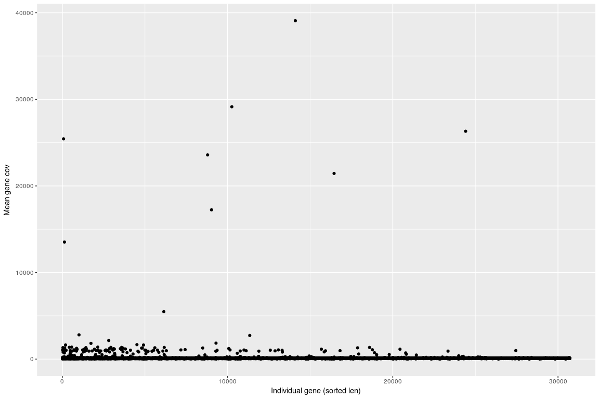
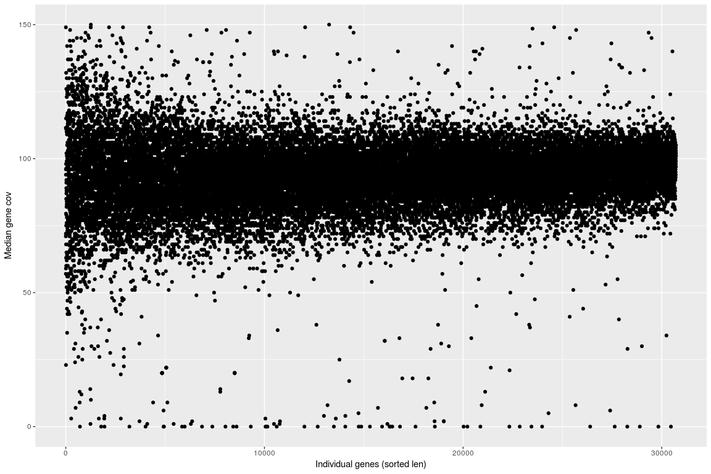
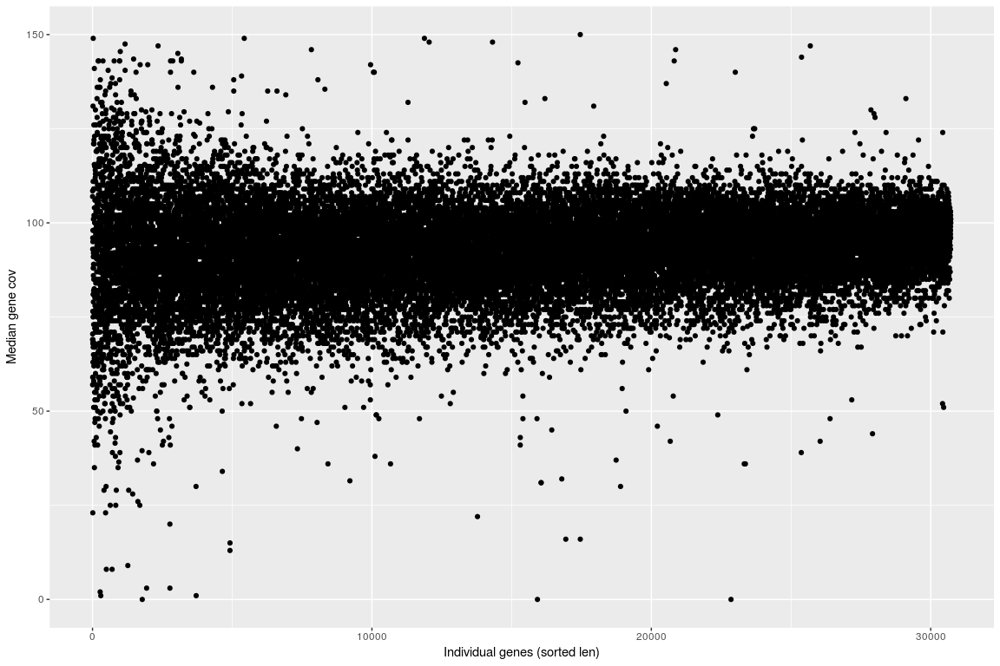
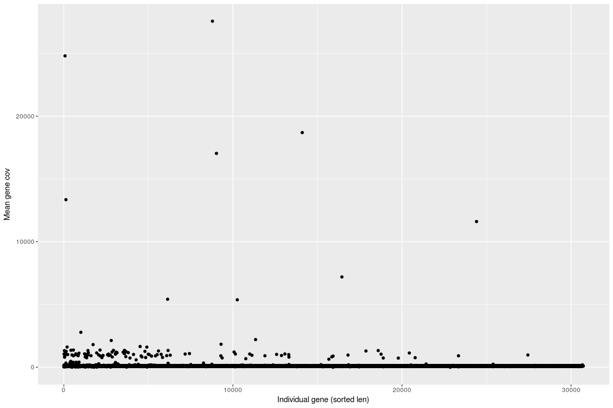
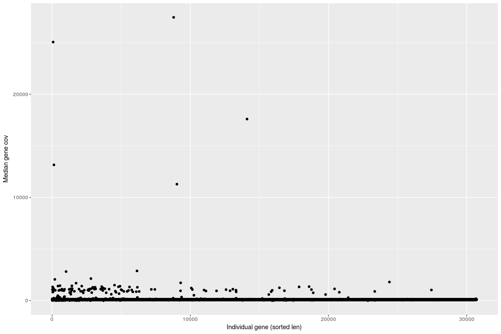
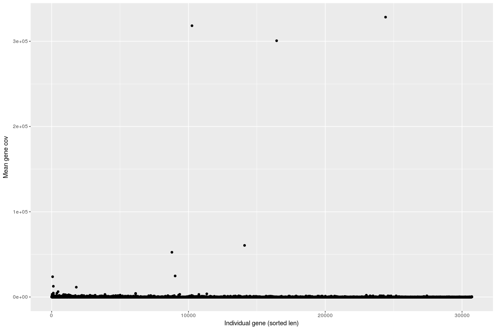
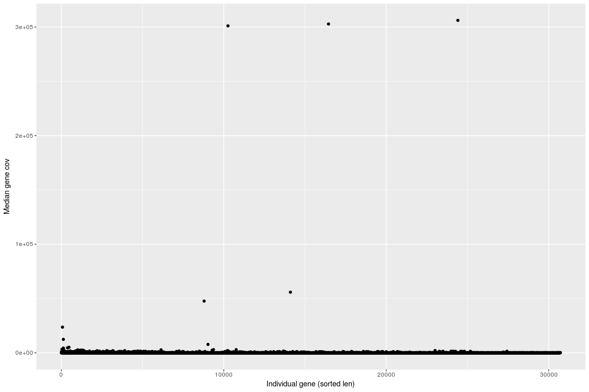
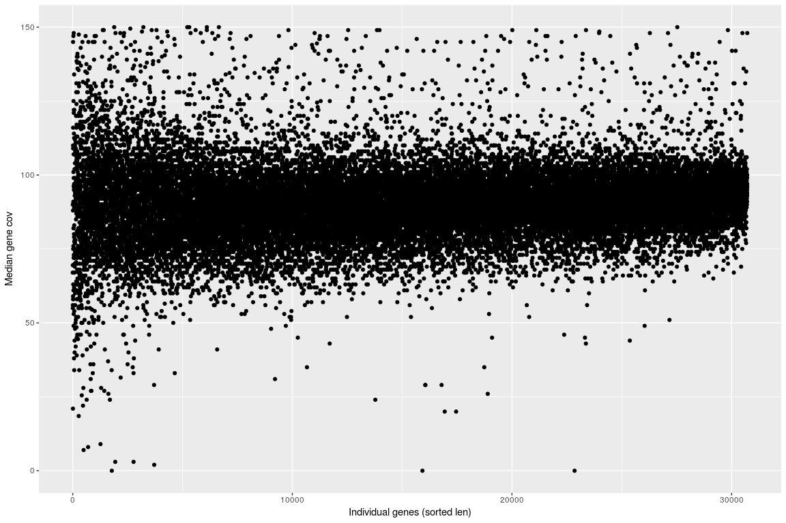

Comparison of Coverage across 3 aligners - per gene only coding regions
================

BBT
---

``` r
PerBaseCovBBT <- read.table(gzfile("/projects/btl_scratch/kgagalova/PipelineCNV/ProofOfConcept/GenomeAnnotationsMasked/A.thaliana/BBmap/GCA_000001735.2_TAIR10.1exonsForR.bed.gz"), header=FALSE)

head(PerBaseCovBBT)
```

    ##           V1            V2 V3  V4     V5   V6
    ## 1 CP002684.1 exon3631_3913  1 112 NAC001 rna0
    ## 2 CP002684.1 exon3631_3913  2 112 NAC001 rna0
    ## 3 CP002684.1 exon3631_3913  3 112 NAC001 rna0
    ## 4 CP002684.1 exon3631_3913  4 113 NAC001 rna0
    ## 5 CP002684.1 exon3631_3913  5 113 NAC001 rna0
    ## 6 CP002684.1 exon3631_3913  6 113 NAC001 rna0

``` r
colNams = c("contig","exon","pos_exon","cov","gene","trans")
colnames(PerBaseCovBBT) = colNams

PerBaseCovBBT$exon = as.factor(PerBaseCovBBT$exon)
PerBaseCovBBT$gene = as.factor(PerBaseCovBBT$gene)
```

Plot coverage per gene

``` r
library(plyr)
library(ggplot2)

r2BBT = ddply(PerBaseCovBBT,~gene,summarize,mean=mean(cov),sd=sd(cov),len=length(cov),med=median(cov))
r2BBT = r2BBT[with(r2BBT, order(len)),]
r2BBT$pos = 1:nrow(r2BBT)

#######Plot
pd <- position_dodge(0.1)
ggplot(r2BBT, aes(pos,mean)) + geom_point() + ylab("Mean gene cov") + xlab("Individual gene (sorted len)")
```



``` r
ggplot(r2BBT,aes(pos,mean)) + geom_point() + scale_y_continuous(limits = c(0, 150)) + ylab("Mean gene cov") + xlab("Individual genes (sorted len)")
```


``` r
ggplot(r2BBT, aes(pos,med)) + geom_point() + ylab("Median gene cov") + xlab("Individual gene (sorted len)")
```


``` r
ggplot(r2BBT,aes(pos,med)) + geom_point() + scale_y_continuous(limits = c(0, 150)) + ylab("Median gene cov") + xlab("Individual genes (sorted len)")
```



``` r
summary(r2BBT$mean)
```

    ##     Min.  1st Qu.   Median     Mean  3rd Qu.     Max. 
    ##     0.00    87.92    94.43   104.85   100.47 39082.45

Minimap2
--------

``` r
PerBaseCovMnmp <- read.table(gzfile("/projects/btl_scratch/kgagalova/PipelineCNV/ProofOfConcept/GenomeAnnotationsMasked/A.thaliana/Minimap2/GCA_000001735.2_TAIR10.1exonsForR.bed.gz"), header=FALSE)

head(PerBaseCovMnmp)
```

    ##           V1            V2 V3  V4     V5   V6
    ## 1 CP002684.1 exon3631_3913  1 112 NAC001 rna0
    ## 2 CP002684.1 exon3631_3913  2 112 NAC001 rna0
    ## 3 CP002684.1 exon3631_3913  3 112 NAC001 rna0
    ## 4 CP002684.1 exon3631_3913  4 113 NAC001 rna0
    ## 5 CP002684.1 exon3631_3913  5 113 NAC001 rna0
    ## 6 CP002684.1 exon3631_3913  6 113 NAC001 rna0

``` r
colNams = c("contig","exon","pos_exon","cov","gene","trans")
colnames(PerBaseCovMnmp) = colNams

PerBaseCovMnmp$exon = as.factor(PerBaseCovMnmp$exon)
PerBaseCovMnmp$gene = as.factor(PerBaseCovMnmp$gene)
```

Plot coverage per gene

``` r
r2Mnmp = ddply(PerBaseCovMnmp,~gene,summarize,mean=mean(cov),sd=sd(cov),len=length(cov),med=median(cov))
r2Mnmp = r2Mnmp[with(r2Mnmp, order(len)),]
r2Mnmp$pos = 1:nrow(r2Mnmp)

#######Plot
pd <- position_dodge(0.1)
ggplot(r2Mnmp, aes(pos,mean)) + geom_point() + ylab("Mean gene cov") + xlab("Individual gene (sorted len)")
```


``` r
ggplot(r2Mnmp,aes(pos,mean)) + geom_point() + scale_y_continuous(limits = c(0, 150)) + ylab("Mean gene cov") + xlab("Individual genes (sorted len)")
```


``` r
ggplot(r2Mnmp, aes(pos,med)) + geom_point() + ylab("Median gene cov") + xlab("Individual gene (sorted len)")
```


``` r
ggplot(r2Mnmp,aes(pos,med)) + geom_point() + scale_y_continuous(limits = c(0, 150)) + ylab("Median gene cov") + xlab("Individual genes (sorted len)")
```


``` r
summary(r2Mnmp$mean)
```

    ##     Min.  1st Qu.   Median     Mean  3rd Qu.     Max. 
    ##     0.00    87.92    94.43   104.85   100.47 39082.45

BWA
---

``` r
PerBaseCovBwa <- read.table(gzfile("/projects/btl_scratch/kgagalova/PipelineCNV/ProofOfConcept/GenomeAnnotationsMasked/A.thaliana/BWA/GCA_000001735.2_TAIR10.1exonsForR.bed.gz"), header=FALSE)

head(PerBaseCovBwa)
```

    ##           V1            V2 V3  V4     V5   V6
    ## 1 CP002684.1 exon3631_3913  1 112 NAC001 rna0
    ## 2 CP002684.1 exon3631_3913  2 112 NAC001 rna0
    ## 3 CP002684.1 exon3631_3913  3 112 NAC001 rna0
    ## 4 CP002684.1 exon3631_3913  4 113 NAC001 rna0
    ## 5 CP002684.1 exon3631_3913  5 113 NAC001 rna0
    ## 6 CP002684.1 exon3631_3913  6 113 NAC001 rna0

``` r
colNams = c("contig","exon","pos_exon","cov","gene","trans")
colnames(PerBaseCovBwa) = colNams

PerBaseCovBwa$exon = as.factor(PerBaseCovBwa$exon)
PerBaseCovBwa$gene = as.factor(PerBaseCovBwa$gene)
```

Plot coverage per gene

``` r
r2Bwa = ddply(PerBaseCovBwa,~gene,summarize,mean=mean(cov),sd=sd(cov),len=length(cov),med=median(cov))
r2Bwa = r2Bwa[with(r2Bwa, order(len)),]
r2Bwa$pos = 1:nrow(r2Bwa)

#######Plot
pd <- position_dodge(0.1)
ggplot(r2Bwa, aes(pos,mean)) + geom_point() + ylab("Mean gene cov") + xlab("Individual gene (sorted len)")
```


``` r
ggplot(r2Bwa,aes(pos,mean)) + geom_point() + scale_y_continuous(limits = c(0, 150)) + ylab("Mean gene cov") + xlab("Individual genes (sorted len)")
```


``` r
ggplot(r2Bwa, aes(pos,med)) + geom_point() + ylab("Median gene cov") + xlab("Individual gene (sorted len)")
```


``` r
ggplot(r2Bwa,aes(pos,med)) + geom_point() + scale_y_continuous(limits = c(0, 150)) + ylab("Median gene cov") + xlab("Individual genes (sorted len)")
```



``` r
summary(r2Bwa$mean)
```

    ##      Min.   1st Qu.    Median      Mean   3rd Qu.      Max. 
    ##     0.066    87.016    93.412   100.625    99.263 27560.328

BWA -a option
-------------

``` r
PerBaseCovBwaa <- read.table(gzfile("/projects/btl_scratch/kgagalova/PipelineCNV/ProofOfConcept/GenomeAnnotationsMasked/A.thaliana/BWAa/GCA_000001735.2_TAIR10.1exonsForRBwaa.bed.gz"), header=FALSE)

head(PerBaseCovBwaa)
```

    ##           V1            V2 V3  V4     V5   V6
    ## 1 CP002684.1 exon3631_3913  1 112 NAC001 rna0
    ## 2 CP002684.1 exon3631_3913  2 112 NAC001 rna0
    ## 3 CP002684.1 exon3631_3913  3 112 NAC001 rna0
    ## 4 CP002684.1 exon3631_3913  4 113 NAC001 rna0
    ## 5 CP002684.1 exon3631_3913  5 113 NAC001 rna0
    ## 6 CP002684.1 exon3631_3913  6 113 NAC001 rna0

``` r
colNams = c("contig","exon","pos_exon","cov","gene","trans")
colnames(PerBaseCovBwaa) = colNams

PerBaseCovBwaa$exon = as.factor(PerBaseCovBwaa$exon)
PerBaseCovBwaa$gene = as.factor(PerBaseCovBwaa$gene)
```

Plot coverage per gene

``` r
r2Bwaa = ddply(PerBaseCovBwaa,~gene,summarize,mean=mean(cov),sd=sd(cov),len=length(cov),med=median(cov))
r2Bwaa = r2Bwaa[with(r2Bwaa, order(len)),]
r2Bwaa$pos = 1:nrow(r2Bwaa)

#######Plot
pd <- position_dodge(0.1)
ggplot(r2Bwaa, aes(pos,mean)) + geom_point() + ylab("Mean gene cov") + xlab("Individual gene (sorted len)")
```



``` r
ggplot(r2Bwaa,aes(pos,mean)) + geom_point() + scale_y_continuous(limits = c(0, 150)) + ylab("Mean gene cov") + xlab("Individual genes (sorted len)")
```


``` r
ggplot(r2Bwaa, aes(pos,med)) + geom_point() + ylab("Median gene cov") + xlab("Individual gene (sorted len)")
```



``` r
ggplot(r2Bwaa,aes(pos,med)) + geom_point() + scale_y_continuous(limits = c(0, 150)) + ylab("Median gene cov") + xlab("Individual genes (sorted len)")
```


``` r
summary(r2Bwaa$mean)
```

    ##      Min.   1st Qu.    Median      Mean   3rd Qu.      Max. 
    ##     0.066    87.020    93.421   100.640    99.265 27563.280

MrsFast - single end reads
--------------------------

``` r
PerBaseCovMrF <- read.table(gzfile("/projects/btl_scratch/kgagalova/PipelineCNV/ProofOfConcept/GenomeAnnotationsMasked/A.thaliana/mrFastSi/GCA_000001735.2_TAIR10.1exonsForR.bed.gz"), header=FALSE)

head(PerBaseCovMrF)
```

    ##           V1            V2 V3  V4     V5   V6
    ## 1 CP002684.1 exon3631_3913  1 102 NAC001 rna0
    ## 2 CP002684.1 exon3631_3913  2 102 NAC001 rna0
    ## 3 CP002684.1 exon3631_3913  3 102 NAC001 rna0
    ## 4 CP002684.1 exon3631_3913  4 103 NAC001 rna0
    ## 5 CP002684.1 exon3631_3913  5 103 NAC001 rna0
    ## 6 CP002684.1 exon3631_3913  6 103 NAC001 rna0

``` r
colNams = c("contig","exon","pos_exon","cov","gene","trans")
colnames(PerBaseCovMrF) = colNams

PerBaseCovMrF$exon = as.factor(PerBaseCovMrF$exon)
PerBaseCovMrF$gene = as.factor(PerBaseCovMrF$gene)
```

Plot coverage per gene

``` r
r2MrF = ddply(PerBaseCovMrF,~gene,summarize,mean=mean(cov),sd=sd(cov),len=length(cov),med=median(cov))
r2MrF = r2MrF[with(r2MrF, order(len)),]
r2MrF$pos = 1:nrow(r2MrF)

#######Plot
pd <- position_dodge(0.1)
ggplot(r2MrF, aes(pos,mean)) + geom_point() + ylab("Mean gene cov") + xlab("Individual gene (sorted len)")
```



``` r
ggplot(r2MrF,aes(pos,mean)) + geom_point() + scale_y_continuous(limits = c(0, 150)) + ylab("Mean gene cov") + xlab("Individual genes (sorted len)")
```


``` r
ggplot(r2MrF, aes(pos,med)) + geom_point() + ylab("Median gene cov") + xlab("Individual gene (sorted len)")
```



``` r
ggplot(r2MrF,aes(pos,med)) + geom_point() + scale_y_continuous(limits = c(0, 150)) + ylab("Median gene cov") + xlab("Individual genes (sorted len)")
```



``` r
summary(r2MrF$mean)
```

    ##     Min.  1st Qu.   Median     Mean  3rd Qu.     Max. 
    ##      0.1     84.4     91.1    144.8     97.8 328320.3

``` r
save.image("/projects/btl_scratch/kgagalova/PipelineCNV/ProofOfConcept/GenomeAnnotationsMasked/A.thaliana/RenvAnalysis/CompareBBTminimapBWA.RData")
```
