Aalysis of RPKM options
================

CDS only no filtering
---------------------

``` r
library(reshape)
library( dplyr )
library( ggplot2 )
library( tidyr )
library( data.table )
library(plyr)

rpkm_cds <- read.delim("/projects/btl_scratch/kgagalova/PipelineCNV/ProofOfConcept/GenomeAnnotationsMasked/A.thaliana/BWA/CDS_rpkm/TestRuns/GCA_000001735.2_TAIR10.1_genomicMasked_75Sorted.rpkm_cds1.bed", header=FALSE)
names(rpkm_cds) = c("chrom","start","stop","rpkm","rna","araport_id")
rpkm_cds$araport_id = as.character(rpkm_cds$araport_id)
rpkm_listIds = unique(rpkm_cds[,c("rna","araport_id")])

rpkm_cds$len = rpkm_cds$stop - rpkm_cds$start
rpkm_cdslen = ddply(rpkm_cds,~rna,summarize,sum(len))
names(rpkm_cdslen) = c("rna","sum_len")

rpkm_mrnacds = ddply(rpkm_cds,~rna,summarize,sd=sd(rpkm),mean=mean(rpkm),med=median(rpkm))
rpkm_mrnacds = rpkm_mrnacds[with(rpkm_mrnacds,order(med,decreasing=T)),]

rpkm_mrna1cds = merge(rpkm_mrnacds,rpkm_cdslen,by="rna")
rpkm_mrna1cds = merge(rpkm_mrna1cds,rpkm_listIds,by="rna")
rpkm_mrna1cds[is.na(rpkm_mrna1cds)] <- 0
rpkm_mrna1cds[rpkm_mrna1cds==""]  <- NA

##import list BUSCOs
BUSCOs <- read.table("/projects/btl_scratch/kgagalova/PipelineCNV/ProofOfConcept/GenomeAnnotationsMasked/A.thaliana/BWA/odb9v1_ArabidopsisBUSCOs_araportIds.tab", quote="\"", comment.char="")
BUSCOs$busco = rep("busco",nrow(BUSCOs))

rpkm_mrna2cds =merge(rpkm_mrna1cds,BUSCOs,by.x="araport_id",by.y="V1",all=T)
rpkm_mrna3cds =subset(rpkm_mrna2cds,araport_id != "NA")
rpkm_mrna3cds[is.na(rpkm_mrna3cds)] <- 0

rpkm_mrna3cds$sum_len = as.numeric(rpkm_mrna3cds$sum_len)

rpkm_mrna3cds= rpkm_mrna3cds[with(rpkm_mrna3cds,order(sum_len,decreasing=T)),]

summary(rpkm_mrna3cds$med)
```

    ##    Min. 1st Qu.  Median    Mean 3rd Qu.    Max. 
    ##       0   15742   19806   21964   24171 6401500

``` r
tapply(rpkm_mrna3cds$med, rpkm_mrna3cds$busco, summary)
```

    ## $`0`
    ##    Min. 1st Qu.  Median    Mean 3rd Qu.    Max. 
    ##       0   15660   19663   21966   24028 6401500 
    ## 
    ## $busco
    ##    Min. 1st Qu.  Median    Mean 3rd Qu.    Max. 
    ##    9004   17635   21976   21934   25375  229366

Plot the data
-------------

``` r
ggplot(rpkm_mrna3cds, aes(sum_len,med,color=busco)) + geom_point(alpha=0.3) + 
         ylab("Median transcript RPKM") + xlab("Individual transcripts (sorted len)") + scale_colour_manual(values = c("red", "black")) + facet_grid(  ~ busco  )
```


``` r
ggplot(rpkm_mrna3cds, aes(sum_len,med,color=busco)) + geom_point(alpha=0.3) + 
         ylab("Median transcript RPKM") + xlab("Individual transcripts (sorted len)") + 
         scale_y_continuous(limits = c(0, 40000)) + scale_colour_manual(values = c("red", "black")) + facet_grid(  ~ busco  )
```

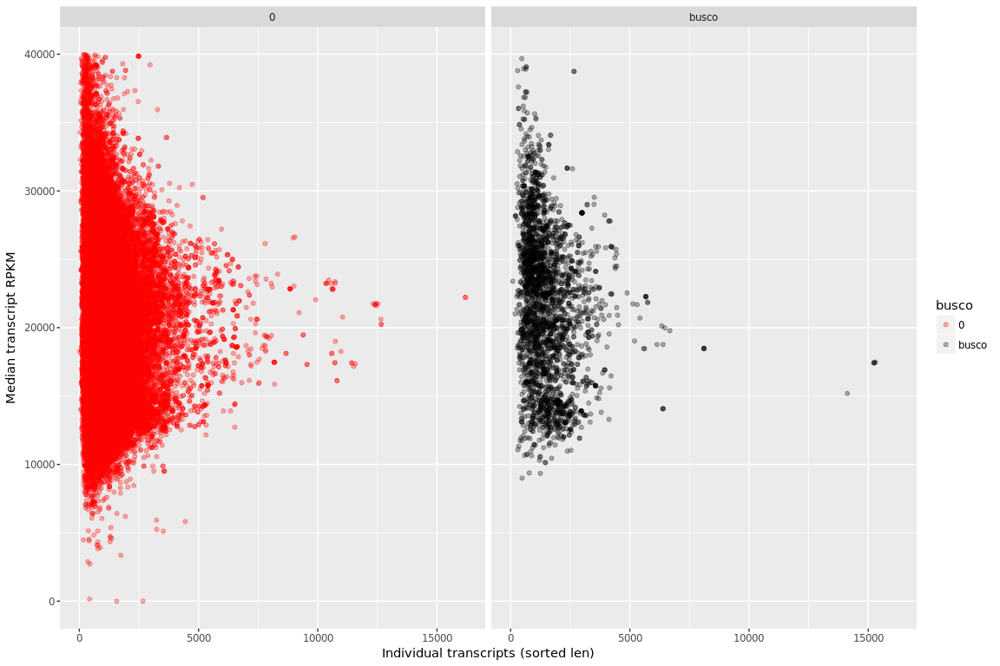

CDS with MAPQ of 60 filtering
-----------------------------

``` r
rpkm_MAPQ <- read.delim("/projects/btl_scratch/kgagalova/PipelineCNV/ProofOfConcept/GenomeAnnotationsMasked/A.thaliana/BWA/CDS_rpkm/TestRuns/GCA_000001735.2_TAIR10.1_genomicMasked_75Sorted.rpkm_cdsMAPQ1.bed", header=FALSE)
names(rpkm_MAPQ) = c("chrom","start","stop","rpkm","rna","araport_id")
rpkm_MAPQ$araport_id = as.character(rpkm_MAPQ$araport_id)
rpkm_listIds = unique(rpkm_MAPQ[,c("rna","araport_id")])

rpkm_MAPQ$len = rpkm_MAPQ$stop - rpkm_MAPQ$start
rpkm_MAPQlen = ddply(rpkm_MAPQ,~rna,summarize,sum(len))
names(rpkm_MAPQlen) = c("rna","sum_len")

rpkm_mrnaMAPQ = ddply(rpkm_MAPQ,~rna,summarize,sd=sd(rpkm),mean=mean(rpkm),med=median(rpkm))
rpkm_mrnaMAPQ = rpkm_mrnaMAPQ[with(rpkm_mrnaMAPQ,order(med,decreasing=T)),]

rpkm_mrna1MAPQ = merge(rpkm_mrnaMAPQ,rpkm_MAPQlen,by="rna")
rpkm_mrna1MAPQ = merge(rpkm_mrna1MAPQ,rpkm_listIds,by="rna")
rpkm_mrna1MAPQ[is.na(rpkm_mrna1MAPQ)] <- 0
rpkm_mrna1MAPQ[rpkm_mrna1MAPQ==""]  <- NA

rpkm_mrna2MAPQ =merge(rpkm_mrna1MAPQ,BUSCOs,by.x="araport_id",by.y="V1",all=T)
rpkm_mrna3MAPQ =subset(rpkm_mrna2MAPQ,araport_id != "NA")
rpkm_mrna3MAPQ[is.na(rpkm_mrna3MAPQ)] <- 0

rpkm_mrna3MAPQ$sum_len = as.numeric(rpkm_mrna3MAPQ$sum_len)

rpkm_mrna3MAPQ= rpkm_mrna3MAPQ[with(rpkm_mrna3MAPQ,order(sum_len,decreasing=T)),]

summary(rpkm_mrna3MAPQ$med)
```

    ##    Min. 1st Qu.  Median    Mean 3rd Qu.    Max. 
    ##       0   15496   19628   21371   24028 6401500

``` r
tapply(rpkm_mrna3MAPQ$med, rpkm_mrna3MAPQ$busco, summary)
```

    ## $`0`
    ##    Min. 1st Qu.  Median    Mean 3rd Qu.    Max. 
    ##       0   15399   19481   21338   23869 6401500 
    ## 
    ## $busco
    ##    Min. 1st Qu.  Median    Mean 3rd Qu.    Max. 
    ##       0   17510   21926   21877   25372  229360

Plot the data
-------------

``` r
ggplot(rpkm_mrna3MAPQ, aes(sum_len,med,color=busco)) + geom_point(alpha=0.3) + 
         ylab("Median transcript RPKM") + xlab("Individual transcripts (sorted len)") + scale_colour_manual(values = c("red", "black")) + facet_grid(  ~ busco  )
```


``` r
ggplot(rpkm_mrna3MAPQ, aes(sum_len,med,color=busco)) + geom_point(alpha=0.3) + 
         ylab("Median transcript RPKM") + xlab("Individual transcripts (sorted len)") + 
         scale_y_continuous(limits = c(0, 40000)) + scale_colour_manual(values = c("red", "black")) + facet_grid(  ~ busco  )
```


CDS with paired properly reads
------------------------------

``` r
rpkm_cdspe <- read.delim("/projects/btl_scratch/kgagalova/PipelineCNV/ProofOfConcept/GenomeAnnotationsMasked/A.thaliana/BWA/CDS_rpkm/TestRuns/GCA_000001735.2_TAIR10.1_genomicMasked_75Sorted.rpkm_cdsp1.bed", header=FALSE)
names(rpkm_cdspe) = c("chrom","start","stop","rpkm","rna","araport_id")
rpkm_cdspe$araport_id = as.character(rpkm_cdspe$araport_id)
rpkm_listIds = unique(rpkm_cdspe[,c("rna","araport_id")])

rpkm_cdspe$len = rpkm_cdspe$stop - rpkm_cdspe$start
rpkm_cdspelen = ddply(rpkm_cdspe,~rna,summarize,sum(len))
names(rpkm_cdspelen) = c("rna","sum_len")

rpkm_mrnacdspe = ddply(rpkm_cdspe,~rna,summarize,sd=sd(rpkm),mean=mean(rpkm),med=median(rpkm))
rpkm_mrnacdspe = rpkm_mrnacdspe[with(rpkm_mrnacdspe,order(med,decreasing=T)),]

rpkm_mrna1cdspe = merge(rpkm_mrnacdspe,rpkm_cdspelen,by="rna")
rpkm_mrna1cdspe = merge(rpkm_mrna1cdspe,rpkm_listIds,by="rna")
rpkm_mrna1cdspe[is.na(rpkm_mrna1cdspe)] <- 0
rpkm_mrna1cdspe[rpkm_mrna1cdspe==""]  <- NA

rpkm_mrna2cdspe =merge(rpkm_mrna1cdspe,BUSCOs,by.x="araport_id",by.y="V1",all=T)
rpkm_mrna3cdspe =subset(rpkm_mrna2cdspe,araport_id != "NA")
rpkm_mrna3cdspe[is.na(rpkm_mrna3cdspe)] <- 0

rpkm_mrna3cdspe$sum_len = as.numeric(rpkm_mrna3cdspe$sum_len)

rpkm_mrna3cdspe= rpkm_mrna3cdspe[with(rpkm_mrna3cdspe,order(sum_len,decreasing=T)),]

summary(rpkm_mrna3cdspe$med)
```

    ##    Min. 1st Qu.  Median    Mean 3rd Qu.    Max. 
    ##       0   15737   19803   21960   24166 6401110

``` r
tapply(rpkm_mrna3cdspe$med, rpkm_mrna3cdspe$busco, summary)
```

    ## $`0`
    ##    Min. 1st Qu.  Median    Mean 3rd Qu.    Max. 
    ##       0   15660   19662   21962   24028 6401110 
    ## 
    ## $busco
    ##    Min. 1st Qu.  Median    Mean 3rd Qu.    Max. 
    ##    9004   17635   21976   21932   25375  229366

Plot the data
-------------

``` r
ggplot(rpkm_mrna3cdspe, aes(sum_len,med,color=busco)) + geom_point(alpha=0.3) + 
         ylab("Median transcript RPKM") + xlab("Individual transcripts (sorted len)") + scale_colour_manual(values = c("red", "black")) + facet_grid(  ~ busco  )
```


``` r
ggplot(rpkm_mrna3cdspe, aes(sum_len,med,color=busco)) + geom_point(alpha=0.3) + 
         ylab("Median transcript RPKM") + xlab("Individual transcripts (sorted len)") + 
         scale_y_continuous(limits = c(0, 40000)) + scale_colour_manual(values = c("red", "black")) + facet_grid(  ~ busco  )
```


CDS with MAPQ of 60 and paired properly reads
---------------------------------------------

``` r
rpkm_cdspeMAPQ <- read.delim("/projects/btl_scratch/kgagalova/PipelineCNV/ProofOfConcept/GenomeAnnotationsMasked/A.thaliana/BWA/CDS_rpkm/TestRuns/GCA_000001735.2_TAIR10.1_genomicMasked_75Sorted.rpkm_cdsMAPQp1.bed", header=FALSE)
names(rpkm_cdspeMAPQ) = c("chrom","start","stop","rpkm","rna","araport_id")
rpkm_cdspeMAPQ$araport_id = as.character(rpkm_cdspeMAPQ$araport_id)
rpkm_listIds = unique(rpkm_cdspeMAPQ[,c("rna","araport_id")])

rpkm_cdspeMAPQ$len = rpkm_cdspeMAPQ$stop - rpkm_cdspeMAPQ$start
rpkm_cdspeMAPQlen = ddply(rpkm_cdspeMAPQ,~rna,summarize,sum(len))
names(rpkm_cdspeMAPQlen) = c("rna","sum_len")

rpkm_mrnacdspeMAPQ = ddply(rpkm_cdspeMAPQ,~rna,summarize,sd=sd(rpkm),mean=mean(rpkm),med=median(rpkm))
rpkm_mrnacdspeMAPQ = rpkm_mrnacdspeMAPQ[with(rpkm_mrnacdspeMAPQ,order(med,decreasing=T)),]

rpkm_mrna1cdspeMAPQ = merge(rpkm_mrnacdspeMAPQ,rpkm_cdspeMAPQlen,by="rna")
rpkm_mrna1cdspeMAPQ = merge(rpkm_mrna1cdspeMAPQ,rpkm_listIds,by="rna")
rpkm_mrna1cdspeMAPQ[is.na(rpkm_mrna1cdspeMAPQ)] <- 0
rpkm_mrna1cdspeMAPQ[rpkm_mrna1cdspeMAPQ==""]  <- NA

rpkm_mrna2cdspeMAPQ =merge(rpkm_mrna1cdspeMAPQ,BUSCOs,by.x="araport_id",by.y="V1",all=T)
rpkm_mrna3cdspeMAPQ =subset(rpkm_mrna2cdspeMAPQ,araport_id != "NA")
rpkm_mrna3cdspeMAPQ[is.na(rpkm_mrna3cdspeMAPQ)] <- 0

rpkm_mrna3cdspeMAPQ$sum_len = as.numeric(rpkm_mrna3cdspeMAPQ$sum_len)

rpkm_mrna3cdspeMAPQ= rpkm_mrna3cdspeMAPQ[with(rpkm_mrna3cdspeMAPQ,order(sum_len,decreasing=T)),]

summary(rpkm_mrna3cdspeMAPQ$med)
```

    ##    Min. 1st Qu.  Median    Mean 3rd Qu.    Max. 
    ##       0   15495   19626   21368   24028 6401110

``` r
tapply(rpkm_mrna3cdspeMAPQ$med, rpkm_mrna3cdspeMAPQ$busco, summary)
```

    ## $`0`
    ##    Min. 1st Qu.  Median    Mean 3rd Qu.    Max. 
    ##       0   15399   19480   21335   23868 6401110 
    ## 
    ## $busco
    ##    Min. 1st Qu.  Median    Mean 3rd Qu.    Max. 
    ##       0   17510   21926   21875   25372  229360

Plot the data
-------------

``` r
ggplot(rpkm_mrna3cdspeMAPQ, aes(sum_len,med,color=busco)) + geom_point(alpha=0.3) + 
         ylab("Median transcript RPKM") + xlab("Individual transcripts (sorted len)") + scale_colour_manual(values = c("red", "black")) + facet_grid(  ~ busco  )
```

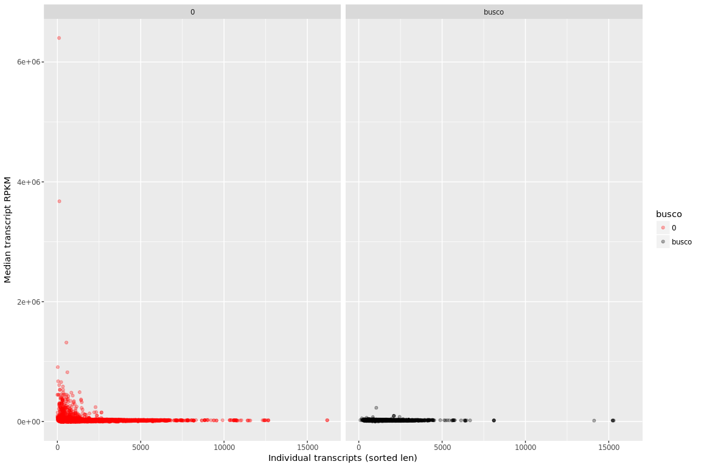

``` r
ggplot(rpkm_mrna3cdspeMAPQ, aes(sum_len,med,color=busco)) + geom_point(alpha=0.3) + 
         ylab("Median transcript RPKM") + xlab("Individual transcripts (sorted len)") + 
         scale_y_continuous(limits = c(0, 40000)) + scale_colour_manual(values = c("red", "black")) + facet_grid(  ~ busco  )
```

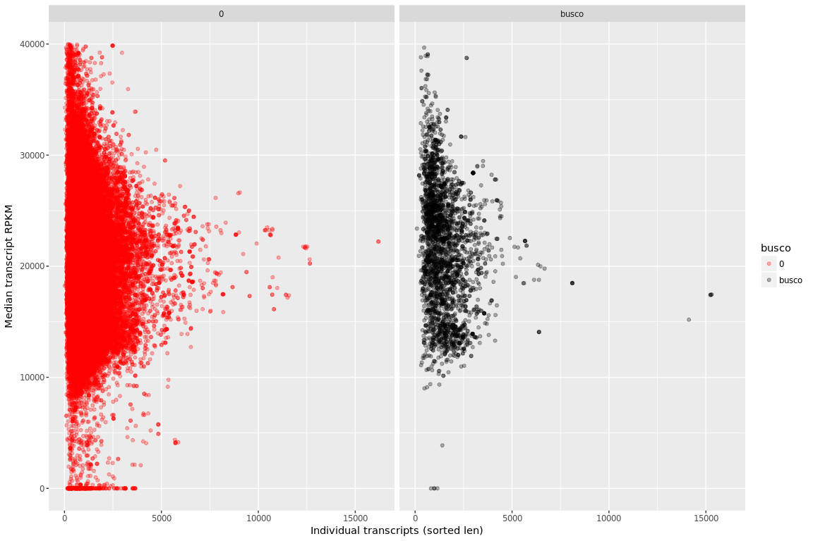

CDS with fraction 40%
---------------------

``` r
rpkm_cdsfr <- read.delim("/projects/btl_scratch/kgagalova/PipelineCNV/ProofOfConcept/GenomeAnnotationsMasked/A.thaliana/BWA/CDS_rpkm/TestRuns/GCA_000001735.2_TAIR10.1_genomicMasked_75Sorted.rpkm_cdsf1.bed", header=FALSE)
names(rpkm_cdsfr) = c("chrom","start","stop","rpkm","rna","araport_id")
rpkm_cdsfr$araport_id = as.character(rpkm_cdsfr$araport_id)
rpkm_listIds = unique(rpkm_cdsfr[,c("rna","araport_id")])

rpkm_cdsfr$len = rpkm_cdsfr$stop - rpkm_cdsfr$start
rpkm_cdsfrlen = ddply(rpkm_cdsfr,~rna,summarize,sum(len))
names(rpkm_cdsfrlen) = c("rna","sum_len")

rpkm_mrnacdsfr = ddply(rpkm_cdsfr,~rna,summarize,sd=sd(rpkm),mean=mean(rpkm),med=median(rpkm))
rpkm_mrnacdsfr = rpkm_mrnacdsfr[with(rpkm_mrnacdsfr,order(med,decreasing=T)),]

rpkm_mrna1cdsfr = merge(rpkm_mrnacdsfr,rpkm_cdsfrlen,by="rna")
rpkm_mrna1cdsfr = merge(rpkm_mrna1cdsfr,rpkm_listIds,by="rna")
rpkm_mrna1cdsfr[is.na(rpkm_mrna1cdsfr)] <- 0
rpkm_mrna1cdsfr[rpkm_mrna1cdsfr==""]  <- NA

rpkm_mrna2cdsfr =merge(rpkm_mrna1cdsfr,BUSCOs,by.x="araport_id",by.y="V1",all=T)
rpkm_mrna3cdsfr =subset(rpkm_mrna2cdsfr,araport_id != "NA")
rpkm_mrna3cdsfr[is.na(rpkm_mrna3cdsfr)] <- 0

rpkm_mrna3cdsfr$sum_len = as.numeric(rpkm_mrna3cdsfr$sum_len)

rpkm_mrna3cdsfr= rpkm_mrna3cdsfr[with(rpkm_mrna3cdsfr,order(sum_len,decreasing=T)),]

summary(rpkm_mrna3cdsfr$med)
```

    ##    Min. 1st Qu.  Median    Mean 3rd Qu.    Max. 
    ##       0       0    9848   10185   14359 3778490

``` r
tapply(rpkm_mrna3cdsfr$med, rpkm_mrna3cdsfr$busco, summary)
```

    ## $`0`
    ##    Min. 1st Qu.  Median    Mean 3rd Qu.    Max. 
    ##       0       0    9703   10134   14235 3778490 
    ## 
    ## $busco
    ##    Min. 1st Qu.  Median    Mean 3rd Qu.    Max. 
    ##       0    6507   11985   10966   15612  221200

Plot the data
-------------

``` r
ggplot(rpkm_mrna3cdsfr, aes(sum_len,med,color=busco)) + geom_point(alpha=0.3) + 
         ylab("Median transcript RPKM") + xlab("Individual transcripts (sorted len)") + scale_colour_manual(values = c("red", "black")) + facet_grid(  ~ busco  )
```

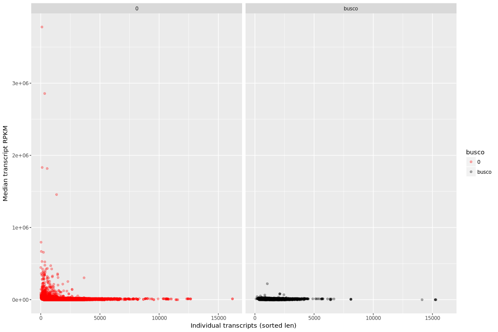

``` r
ggplot(rpkm_mrna3cdsfr, aes(sum_len,med,color=busco)) + geom_point(alpha=0.3) + 
         ylab("Median transcript RPKM") + xlab("Individual transcripts (sorted len)") + 
         scale_y_continuous(limits = c(0, 40000)) + scale_colour_manual(values = c("red", "black")) + facet_grid(  ~ busco  )
```

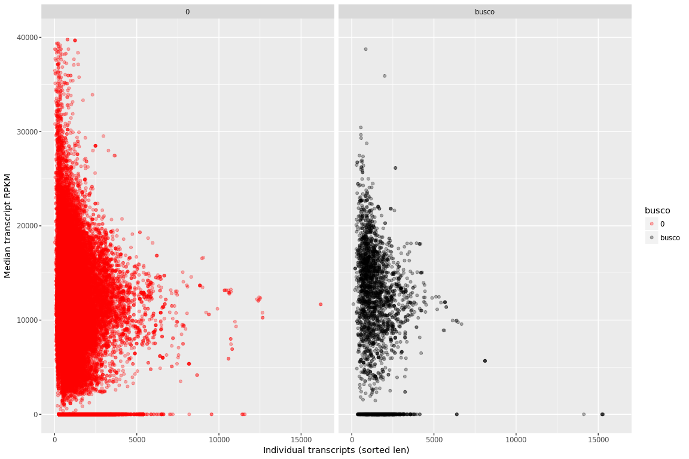

CDS with fraction 40%, for both CDS and reads
---------------------------------------------

``` r
rpkm_cdsfrec <- read.delim("/projects/btl_scratch/kgagalova/PipelineCNV/ProofOfConcept/GenomeAnnotationsMasked/A.thaliana/BWA/CDS_rpkm/TestRuns/GCA_000001735.2_TAIR10.1_genomicMasked_75Sorted.rpkm_cdsfr1.bed", header=FALSE)
names(rpkm_cdsfrec) = c("chrom","start","stop","rpkm","rna","araport_id")
rpkm_cdsfrec$araport_id = as.character(rpkm_cdsfrec$araport_id)
rpkm_listIds = unique(rpkm_cdsfrec[,c("rna","araport_id")])

rpkm_cdsfrec$len = rpkm_cdsfrec$stop - rpkm_cdsfrec$start
rpkm_cdsfreclen = ddply(rpkm_cdsfrec,~rna,summarize,sum(len))
names(rpkm_cdsfreclen) = c("rna","sum_len")

rpkm_mrnacdsfrec = ddply(rpkm_cdsfrec,~rna,summarize,sd=sd(rpkm),mean=mean(rpkm),med=median(rpkm))
rpkm_mrnacdsfrec = rpkm_mrnacdsfrec[with(rpkm_mrnacdsfrec,order(med,decreasing=T)),]

rpkm_mrna1cdsfrec = merge(rpkm_mrnacdsfrec,rpkm_cdsfreclen,by="rna")
rpkm_mrna1cdsfrec = merge(rpkm_mrna1cdsfrec,rpkm_listIds,by="rna")
rpkm_mrna1cdsfrec[is.na(rpkm_mrna1cdsfrec)] <- 0
rpkm_mrna1cdsfrec[rpkm_mrna1cdsfrec==""]  <- NA

rpkm_mrna2cdsfrec =merge(rpkm_mrna1cdsfrec,BUSCOs,by.x="araport_id",by.y="V1",all=T)
rpkm_mrna3cdsfrec =subset(rpkm_mrna2cdsfrec,araport_id != "NA")
rpkm_mrna3cdsfrec[is.na(rpkm_mrna3cdsfrec)] <- 0

rpkm_mrna3cdsfrec$sum_len = as.numeric(rpkm_mrna3cdsfrec$sum_len)

rpkm_mrna3cdsfrec= rpkm_mrna3cdsfrec[with(rpkm_mrna3cdsfrec,order(sum_len,decreasing=T)),]

summary(rpkm_mrna3cdsfrec$med)
```

    ##    Min. 1st Qu.  Median    Mean 3rd Qu.    Max. 
    ##       0       0    8640    7832   12420 3778490

``` r
tapply(rpkm_mrna3cdsfrec$med, rpkm_mrna3cdsfrec$busco, summary)
```

    ## $`0`
    ##    Min. 1st Qu.  Median    Mean 3rd Qu.    Max. 
    ##       0       0    8433    7741   12313 3778490 
    ## 
    ## $busco
    ##    Min. 1st Qu.  Median    Mean 3rd Qu.    Max. 
    ##       0    5410   11068    9242   13542   20882

``` r
ggplot(rpkm_mrna3cdsfrec, aes(sum_len,med,color=busco)) + geom_point(alpha=0.3) + 
         ylab("Median transcript RPKM") + xlab("Individual transcripts (sorted len)") + scale_colour_manual(values = c("red", "black")) + facet_grid(  ~ busco  )
```

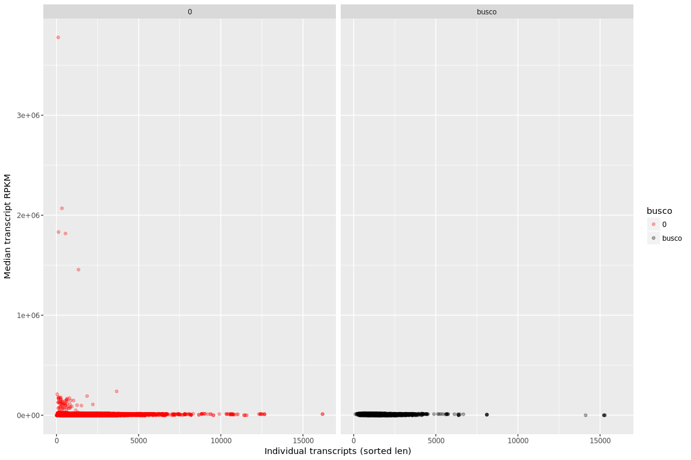

``` r
ggplot(rpkm_mrna3cdsfrec, aes(sum_len,med,color=busco)) + geom_point(alpha=0.3) + 
         ylab("Median transcript RPKM") + xlab("Individual transcripts (sorted len)") + 
         scale_y_continuous(limits = c(0, 40000)) + scale_colour_manual(values = c("red", "black")) + facet_grid(  ~ busco  )
```

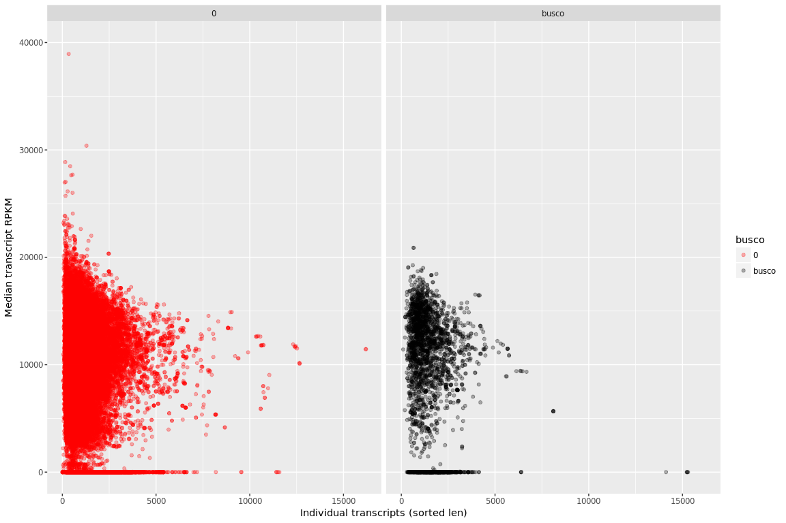

Gene level - use segmentation approach, no filtering
----------------------------------------------------

``` r
rpkm_gene <- read.delim("/projects/btl_scratch/kgagalova/PipelineCNV/ProofOfConcept/GenomeAnnotationsMasked/A.thaliana/BWA/Genes_rpkm/TestRuns/GCA_000001735.2_TAIR10.1_genomicMasked_75Sorted.rpkm_genes1.bed", header=FALSE)
names(rpkm_gene) = c("chrom","start","stop","rpkm","rna","araport_id")
rpkm_gene$araport_id = as.character(rpkm_gene$araport_id)
rpkm_listIds = unique(rpkm_gene[,c("araport_id")])
rpkm_gene1 = subset(rpkm_gene,araport_id != "")

rpkm_gene1$len = rpkm_gene1$stop - rpkm_gene1$start
rpkm_genelen = ddply(rpkm_gene1,~araport_id,summarize,sum(len))
names(rpkm_genelen) = c("gene","sum_len")

rpkm_gene1 = ddply(rpkm_gene1,~araport_id,summarize,sd=sd(rpkm),mean=mean(rpkm),med=median(rpkm))
rpkm_gene1 = rpkm_gene1[with(rpkm_gene1,order(med,decreasing=T)),]

rpkm_gene2 = merge(rpkm_gene1,rpkm_genelen,by.x="araport_id",by.y="gene")
#rpkm_gene2 = merge(rpkm_mrna2,rpkm_listIds,by="araport_id")
rpkm_gene2[is.na(rpkm_gene2)] <- 0
rpkm_gene2[rpkm_gene2 ==""]  <- NA

rpkm_gene3 =merge(rpkm_gene2,BUSCOs,by.x="araport_id",by.y="V1",all=T)
rpkm_gene3 =subset(rpkm_gene3,araport_id != "NA")
rpkm_gene3[is.na(rpkm_gene3)] <- 0

rpkm_gene3$sum_len = as.numeric(rpkm_gene3$sum_len)

rpkm_gene3 = rpkm_gene3[with(rpkm_gene3,order(sum_len,decreasing=T)),]

summary(rpkm_gene3$med)
```

    ##    Min. 1st Qu.  Median    Mean 3rd Qu.    Max. 
    ##       0   11451   12749   12864   13640 2839015

``` r
tapply(rpkm_gene3$med, rpkm_gene3$busco, summary)
```

    ## $`0`
    ##    Min. 1st Qu.  Median    Mean 3rd Qu.    Max. 
    ##       0   11386   12710   12858   13614 2839015 
    ## 
    ## $busco
    ##    Min. 1st Qu.  Median    Mean 3rd Qu.    Max. 
    ##       0   12478   13233   12963   13918   20628

``` r
ggplot(rpkm_gene3, aes(sum_len,med,color=busco)) + geom_point(alpha=0.3) + 
         ylab("Median gene RPKM") + xlab("Individual genes (sorted len)") + scale_colour_manual(values = c("red", "black")) + facet_grid(  ~ busco  )
```

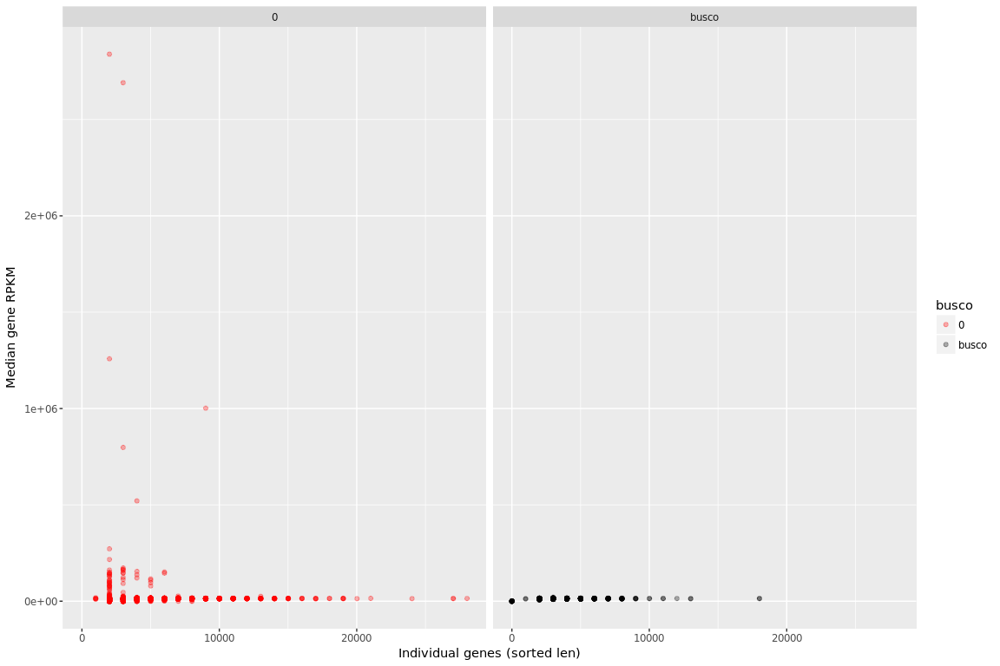

``` r
ggplot(rpkm_gene3, aes(sum_len,med,color=busco)) + geom_point(alpha=0.3) + 
         ylab("Median gene RPKM") + xlab("Individual genes (sorted len)") + 
         scale_y_continuous(limits = c(0, 40000)) + scale_colour_manual(values = c("red", "black")) + facet_grid(  ~ busco  )
```

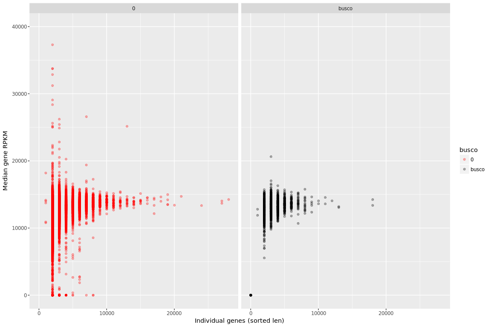

Gene level - use segmentation approach, MAPQ &gt; 60
----------------------------------------------------

``` r
rpkm_geneMAPQ <- read.delim("/projects/btl_scratch/kgagalova/PipelineCNV/ProofOfConcept/GenomeAnnotationsMasked/A.thaliana/BWA/Genes_rpkm/TestRuns/GCA_000001735.2_TAIR10.1_genomicMasked_75Sorted.rpkm_genesMAPQ1.bed", header=FALSE)
names(rpkm_geneMAPQ) = c("chrom","start","stop","rpkm","rna","araport_id")
rpkm_geneMAPQ$araport_id = as.character(rpkm_geneMAPQ$araport_id)
rpkm_listIds = unique(rpkm_geneMAPQ[,c("araport_id")])
rpkm_geneMAPQ1 = subset(rpkm_geneMAPQ,araport_id != "")

rpkm_geneMAPQ1$len = rpkm_geneMAPQ1$stop - rpkm_geneMAPQ1$start
rpkm_geneMAPQlen = ddply(rpkm_geneMAPQ1,~araport_id,summarize,sum(len))
names(rpkm_geneMAPQlen) = c("gene","sum_len")

rpkm_geneMAPQ1 = ddply(rpkm_geneMAPQ1,~araport_id,summarize,sd=sd(rpkm),mean=mean(rpkm),med=median(rpkm))
rpkm_geneMAPQ1 = rpkm_geneMAPQ1[with(rpkm_geneMAPQ1,order(med,decreasing=T)),]

rpkm_geneMAPQ2 = merge(rpkm_geneMAPQ1,rpkm_geneMAPQlen,by.x="araport_id",by.y="gene")
#rpkm_geneMAPQ2 = merge(rpkm_mrna2,rpkm_listIds,by="araport_id")
rpkm_geneMAPQ2[is.na(rpkm_geneMAPQ2)] <- 0
rpkm_geneMAPQ2[rpkm_geneMAPQ2 ==""]  <- NA

rpkm_geneMAPQ3 =merge(rpkm_geneMAPQ2,BUSCOs,by.x="araport_id",by.y="V1",all=T)
rpkm_geneMAPQ3 =subset(rpkm_geneMAPQ3,araport_id != "NA")
rpkm_geneMAPQ3[is.na(rpkm_geneMAPQ3)] <- 0

rpkm_geneMAPQ3$sum_len = as.numeric(rpkm_geneMAPQ3$sum_len)

rpkm_geneMAPQ3 = rpkm_geneMAPQ3[with(rpkm_geneMAPQ3,order(sum_len,decreasing=T)),]

summary(rpkm_geneMAPQ3$med)
```

    ##    Min. 1st Qu.  Median    Mean 3rd Qu.    Max. 
    ##       0   11302   12671   12302   13588  573112

``` r
tapply(rpkm_geneMAPQ3$med, rpkm_geneMAPQ3$busco, summary)
```

    ## $`0`
    ##    Min. 1st Qu.  Median    Mean 3rd Qu.    Max. 
    ##       0   11218   12620   12261   13556  573112 
    ## 
    ## $busco
    ##    Min. 1st Qu.  Median    Mean 3rd Qu.    Max. 
    ##       0   12452   13214   12933   13905   20628

``` r
ggplot(rpkm_geneMAPQ3, aes(sum_len,med,color=busco)) + geom_point(alpha=0.3) + 
         ylab("Median gene RPKM") + xlab("Individual genes (sorted len)") + scale_colour_manual(values = c("red", "black")) + facet_grid(  ~ busco  )
```

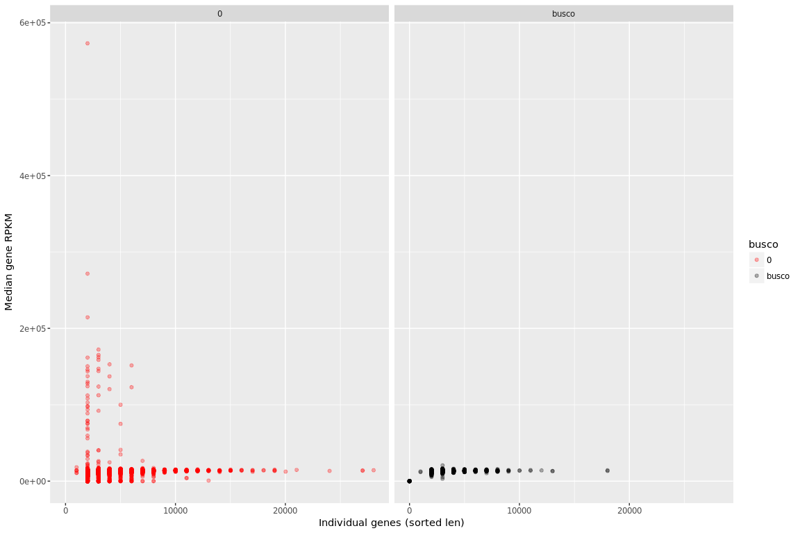

``` r
ggplot(rpkm_geneMAPQ3, aes(sum_len,med,color=busco)) + geom_point(alpha=0.3) + 
         ylab("Median gene RPKM") + xlab("Individual genes (sorted len)") + 
         scale_y_continuous(limits = c(0, 40000)) + scale_colour_manual(values = c("red", "black")) + facet_grid(  ~ busco  )
```

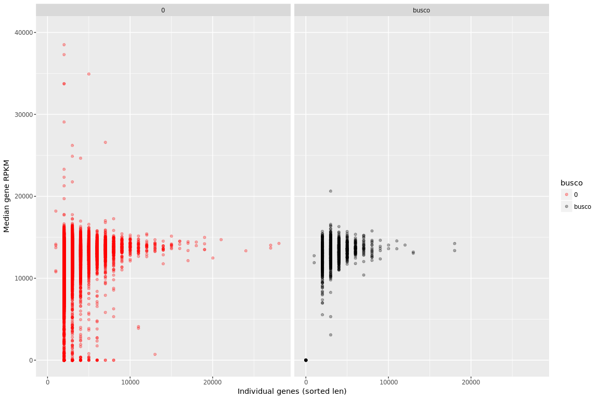
