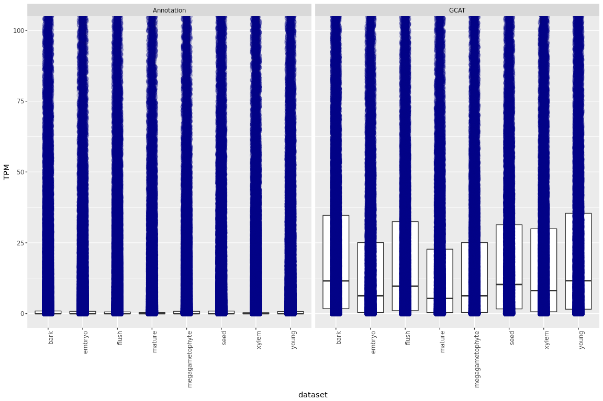

Compare RNAseq gene expression
================

Load the data sets
------------------

``` r
library( dplyr )
library( ggplot2 )
library( tidyr )
library( data.table )

dataPath="/projects/spruceup_scratch/pglauca/WS77111/annotation/genome-annotation/Maker/TestGCATs/PG29transcriptome/Ranalysis"
allFiles <- list.files( path = dataPath, pattern = ".sf", full.names = TRUE )
l <- lapply( allFiles, function( fn ){
  d <- read.table( fn, header = T );
  d$fileName <- fn;
  d
  } );
d <- bind_rows( l );
dim(d)
```

    ## [1] 1098784       6

``` r
d$dataset = sapply(strsplit(sapply(strsplit(d$fileName,"/"),"[[",12),"_"),"[[",1)
d$sample = gsub(".sf","",sapply(strsplit(sapply(strsplit(d$fileName,"/"),"[[",12),"\\."),"[[",2))

colnames(d)[c(1:5)] = c("Name","Length","EffectiveLength","TPM","NumReads")
```

``` r
ggplot(d, aes(y=TPM,x=dataset)) +
      geom_boxplot(outlier.size=NA) +
      facet_grid(~ sample) + 
      geom_jitter(position=position_jitter(width=0.1,height=0),
        alpha=0.2,
        size=3,
        colour="darkblue") +
      theme(axis.text.x = element_text(angle = 90, hjust = 1))
```


``` r
ggplot(d, aes(y=TPM,x=dataset)) +
      geom_boxplot(outlier.size=NA) +
      facet_grid(~ sample) + 
      coord_cartesian(ylim = c(0, 100)) + 
      geom_jitter(position=position_jitter(width=0.1,height=0),
        alpha=0.2,
        size=3,
        colour="darkblue") + 
      theme(axis.text.x = element_text(angle = 90, hjust = 1))
```



``` r
ggplot(d, aes(y=TPM,x=dataset)) +
      geom_boxplot(outlier.size=NA) +
      facet_grid(~ sample) + 
      coord_cartesian(ylim = c(0, 200)) +
      theme(axis.text.x = element_text(angle = 90, hjust = 1))
```


``` r
equalZero = subset(d,d$TPM == 0)

#check how many are equal to zero in GCAT and annotation
equalZeroAnn = subset(equalZero,equalZero$dataset == "Annotation" )
equalZeroGCAT = subset(equalZero,equalZero$dataset == "GCAT" )

#check how many transcripts are expressed with zero TPM in each tissue
apply(table(equalZeroAnn[,c("Name","sample")]), 2, sum)
```

    ## integer(0)

``` r
apply(table(equalZeroGCAT[,c("Name","sample")]), 2, sum)
```

    ## integer(0)

``` r
#check how many transcript are expressed with zero TPM in all the tissues
length(which(apply(table(equalZeroAnn[,c("Name","sample")]), 1, sum) == 6))
```

    ## [1] 0

``` r
length(which(apply(table(equalZeroGCAT[,c("Name","sample")]), 1, sum) == 6))
```

    ## [1] 0

``` r
#sum the number of reads
readsPG29map = aggregate(d$NumReads, by=list(Sample=d$sample,dataset=d$dataset), FUN=sum)
readsPG29map
```

    ##        Sample         dataset        x
    ## 1  Annotation            bark 57373441
    ## 2        GCAT            bark 64378638
    ## 3  Annotation          embryo 27441362
    ## 4        GCAT          embryo 34436523
    ## 5  Annotation           flush 73846735
    ## 6        GCAT           flush 81723177
    ## 7  Annotation          mature 57787918
    ## 8        GCAT          mature 69404950
    ## 9  Annotation megagametophyte 27441362
    ## 10       GCAT megagametophyte 34436523
    ## 11 Annotation            seed 57758498
    ## 12       GCAT            seed 65351872
    ## 13 Annotation           xylem 40828750
    ## 14       GCAT           xylem 52947784
    ## 15 Annotation           young 48853857
    ## 16       GCAT           young 55543839

``` r
#normalize by number of reads
readsPG29 = read.table("/projects/spruceup_scratch/pglauca/WS77111/annotation/genome-annotation/Maker/TestGCATs/PG29transcriptome/CountReads/all.reads.out",header=F)

readsPG29sum = aggregate(readsPG29$V2, by=list(Sample=readsPG29$V3), FUN=sum)
readsPG29sum
```

    ##             Sample         x
    ## 1             bark 216379828
    ## 2           embryo 175806264
    ## 3       flush_buds 246839706
    ## 4    mature_needle 221581864
    ## 5  megagametophyte 175806264
    ## 6 seed_germination 202748392
    ## 7            xylem 197610988
    ## 8       young_buds 174109436

``` r
reads2div = readsPG29sum[rep(seq_len(nrow(readsPG29sum)), each=2),]

readsPG29map$perc = readsPG29map$x /reads2div$x
readsPG29map
```

    ##        Sample         dataset        x      perc
    ## 1  Annotation            bark 57373441 0.2651515
    ## 2        GCAT            bark 64378638 0.2975261
    ## 3  Annotation          embryo 27441362 0.1560886
    ## 4        GCAT          embryo 34436523 0.1958777
    ## 5  Annotation           flush 73846735 0.2991688
    ## 6        GCAT           flush 81723177 0.3310779
    ## 7  Annotation          mature 57787918 0.2607971
    ## 8        GCAT          mature 69404950 0.3132249
    ## 9  Annotation megagametophyte 27441362 0.1560886
    ## 10       GCAT megagametophyte 34436523 0.1958777
    ## 11 Annotation            seed 57758498 0.2848777
    ## 12       GCAT            seed 65351872 0.3223299
    ## 13 Annotation           xylem 40828750 0.2066117
    ## 14       GCAT           xylem 52947784 0.2679395
    ## 15 Annotation           young 48853857 0.2805928
    ## 16       GCAT           young 55543839 0.3190168

Same analysis on FB3 425
------------------------

``` r
dataPath="/projects/spruceup_scratch/psitchensis/Q903/annotation/genome-annotation/Maker/TestcDNA/Q903transcriptome/Ranalysis"
allFiles <- list.files( path = dataPath, pattern = ".sf", full.names = TRUE )
l <- lapply( allFiles, function( fn ){
  d <- read.table( fn, header = T );
  d$fileName <- fn;
  d
  } );
d <- bind_rows( l );
dim(d)
```

    ## [1] 529224      6

``` r
d$dataset = sapply(strsplit(sapply(strsplit(d$fileName,"/"),"[[",12),"\\."),"[[",1)
d$sample = gsub("_quant","",sapply(strsplit(sapply(strsplit(d$fileName,"/"),"[[",12),"\\."),"[[",2))

colnames(d)[c(1:5)] = c("Name","Length","EffectiveLength","TPM","NumReads")
```

``` r
ggplot(d, aes(y=TPM,x=dataset)) +
       geom_boxplot(outlier.size=NA) +
       facet_grid(~ sample) + 
       geom_jitter(position=position_jitter(width=0.1,height=0),
                alpha=0.2,
                size=3,
                colour="darkblue") + 
       theme(axis.text.x = element_text(angle = 90, hjust = 1))
```


``` r
ggplot(d, aes(y=TPM,x=dataset)) +
       geom_boxplot(outlier.size=NA) +
       facet_grid(~ sample) + 
       coord_cartesian(ylim = c(0, 50)) +
       geom_jitter(position=position_jitter(width=0.1,height=0),
                alpha=0.2,
                size=3,
                colour="darkblue") +
       theme(axis.text.x = element_text(angle = 90, hjust = 1))
```


``` r
 ggplot(d, aes(y=TPM,x=dataset)) +
     geom_boxplot(outlier.size=NA) +
       facet_grid(~ sample) + 
       coord_cartesian(ylim = c(0, 100)) + 
       theme(axis.text.x = element_text(angle = 90, hjust = 1))
```


``` r
equalZero = subset(d,d$TPM == 0)
 
#check how many are equal to zero in GCAT and annotation
equalZeroAnn = subset(equalZero,equalZero$dataset == "AllTrans" )
equalZerocDNA = subset(equalZero,equalZero$dataset == "cDNA" )

#check how many transcripts are expressed with zero TPM in each tissue
apply(table(equalZeroAnn[,c("Name","sample")]), 2, sum)
```

    ##    C1    C2    C3    C4 
    ## 76572 82105 81384 80237

``` r
apply(table(equalZerocDNA[,c("Name","sample")]), 2, sum)
```

    ##   C1   C2   C3   C4 
    ## 1218 1304 1356 1199

``` r
#check how many transcript are expressed with zero TPM in all the tissues
length(which(apply(table(equalZeroAnn[,c("Name","sample")]), 1, sum) == 4))
```

    ## [1] 68831

``` r
length(which(apply(table(equalZerocDNA[,c("Name","sample")]), 1, sum) == 4))
```

    ## [1] 818

``` r
readsQ903map = aggregate(d$NumReads, by=list(Sample=d$dataset,d$sample), FUN=sum)
readsQ903map
```

    ##     Sample Group.2        x
    ## 1 AllTrans      C1 29406689
    ## 2     cDNA      C1 27783151
    ## 3 AllTrans      C2 26314212
    ## 4     cDNA      C2 26877586
    ## 5 AllTrans      C3 23378625
    ## 6     cDNA      C3 24810628
    ## 7 AllTrans      C4 29294966
    ## 8     cDNA      C4 27229070

``` r
#normalize by number of reads
readsQ903 = read.table("/projects/spruceup_scratch/psitchensis/Q903/annotation/genome-annotation/Maker/TestcDNA/Q903transcriptome/CountReads/all_reads.counts.txt",header=F)

readsQ903sum = aggregate(readsQ903$V2, by=list(Sample=readsQ903$V3), FUN=sum)
readsQ903sum
```

    ##   Sample        x
    ## 1     C1 95010162
    ## 2     C2 92031548
    ## 3     C3 90579534
    ## 4     C4 87828222

``` r
reads2div = readsQ903sum[rep(seq_len(nrow(readsQ903sum)), each=2),]

readsQ903map$perc = readsQ903map$x /reads2div$x
readsQ903map
```

    ##     Sample Group.2        x      perc
    ## 1 AllTrans      C1 29406689 0.3095110
    ## 2     cDNA      C1 27783151 0.2924229
    ## 3 AllTrans      C2 26314212 0.2859260
    ## 4     cDNA      C2 26877586 0.2920475
    ## 5 AllTrans      C3 23378625 0.2581005
    ## 6     cDNA      C3 24810628 0.2739099
    ## 7 AllTrans      C4 29294966 0.3335484
    ## 8     cDNA      C4 27229070 0.3100264

Analysis of transcriptome assembly - PG29
-----------------------------------------

``` r
dataPath="/projects/spruceup_scratch/pglauca/WS77111/annotation/genome-annotation/Maker/TestGCATs/PG29transcriptome/AssembledTranscripts/Ranalysis"
allFiles <- list.files( path = dataPath, pattern = ".sf", full.names = TRUE )
l <- lapply( allFiles, function( fn ){
  d <- read.table( fn, header = T );
  d$fileName <- fn;
  d
  } );
d <- bind_rows( l );
dim(d)
```

    ## [1] 7950768       6

``` r
d$sample = gsub("_quant","",sapply(strsplit(sapply(strsplit(d$fileName,"/"),"[[",13),"\\."),"[[",1))

colnames(d)[c(1:5)] = c("Name","Length","EffectiveLength","TPM","NumReads")

readsPG29map = aggregate(d$NumReads, by=list(Sample=d$sample), FUN=sum)

readsPG29map$perc = readsPG29map$x/readsPG29sum$x
readsPG29map
```

    ##             Sample         x      perc
    ## 1             bark  82354942 0.3806036
    ## 2           embryo  66558678 0.3785910
    ## 3        flush_bud 102530279 0.4153719
    ## 4    mature_needle  87700180 0.3957913
    ## 5  megagametophyte  66558678 0.3785910
    ## 6 seed_germination  81956393 0.4042271
    ## 7            xylem  69490661 0.3516538
    ## 8       young_buds  70158224 0.4029547

Analysis of transcriptome assembly - Q903
-----------------------------------------

``` r
dataPath="/projects/spruceup_scratch/psitchensis/Q903/annotation/genome-annotation/Maker/TestcDNA/Q903transcriptome/AssembledTranscripts/Ranalysis"
allFiles <- list.files( path = dataPath, pattern = ".sf", full.names = TRUE )
l <- lapply( allFiles, function( fn ){
  d <- read.table( fn, header = T );
  d$fileName <- fn;
  d
  } );
d <- bind_rows( l );
dim(d)
```

    ## [1] 671344      6

``` r
d$sample = gsub("_quant","",sapply(strsplit(sapply(strsplit(d$fileName,"/"),"[[",13),"\\."),"[[",1))

colnames(d)[c(1:5)] = c("Name","Length","EffectiveLength","TPM","NumReads")

readsQ903map = aggregate(d$NumReads, by=list(Sample=d$sample), FUN=sum)

readsQ903map$perc = readsQ903map$x/readsQ903sum$x
readsQ903map
```

    ##   Sample        x      perc
    ## 1     C1 41983473 0.4418840
    ## 2     C2 40602866 0.4411842
    ## 3     C3 40469342 0.4467824
    ## 4     C4 38985204 0.4438801
