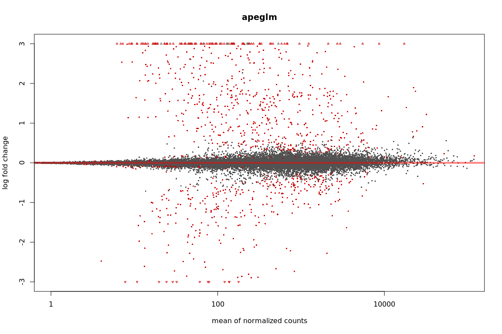

DE analysis - Weevil experiments in H898 and Q903
================

H898
====

Import counts
-------------

The option tximport imports the salmon results in R, can also optionally aggregate the counts for genes. If this has been done before, as in our case, use `txOut = FALSE` when calling import function.

``` r
library("tximport")
library("readr")
library("tximportData")

samplesH898 <- read.table("/projects/btl/kgagalova/PHD_projects2/SpruceUp/DifferentialExpression/data/Weevil/samplesH898.txt", header = FALSE)
tx2gene <- read.table("/projects/spruceup_scratch/dev/SprucePaper2018/H898vsQ903sitka/GetDiffTrans/Cdhit/CdhitOnStarting/PostProcessing/SelectCDSonly/Chopstitch/Complete/geneMapTop5_nonNorm.tsv",header = F)

dir="/projects/spruceup_scratch/dev/SprucePaper2018/H898vsQ903sitka/DE/Salmon/Weevil/H898/quants/all_samples"
allFiles <- list.files( path = dir, pattern = ".sf", full.names = TRUE )
names(allFiles) = samplesH898$V1

txi.salmon <- tximport(allFiles, type = "salmon",tx2gene = NULL, txOut=TRUE)
head(txi.salmon$counts)
```

    ##          H898C1    H898C2  H898C3     H898C4    H898G1     H898G2  H898G3
    ## 16953    1.0000    0.0000    0.00    1.00000    0.0000    0.00000   0.000
    ## 15194    7.0000    6.0000    0.00    5.71474   14.0000    2.00000  17.000
    ## 10472    3.0000    1.0000    3.00    2.00000    3.0000    2.00000   1.000
    ## 23091    7.2177   11.0966    0.00   14.30360   15.9342    2.66159   0.000
    ## 17326 1170.6000 1064.0500 1121.19 1041.39000 1001.3900 1077.41000 646.411
    ## 21044    0.0000    0.0000    2.00    0.00000    0.0000    1.00000   0.000
    ##        H898G4
    ## 16953   0.000
    ## 15194   8.000
    ## 10472   0.000
    ## 23091   0.000
    ## 17326 729.749
    ## 21044   0.000

DE analysis
-----------

Check this reference for more details: `https://bioconductor.org/packages/release/bioc/vignettes/DESeq2/inst/doc/DESeq2.html` `https://bioconductor.org/packages/release/bioc/vignettes/DESeq2/inst/doc/DESeq2.html#theory-behind-deseq2`

``` r
library("DESeq2")
library("ashr")

sampleTable <- data.frame(condition = samplesH898$V2)
rownames(sampleTable) <- colnames(txi.salmon$counts)
ddsTxiH898 <- DESeqDataSetFromTximport(txi.salmon,
                                   colData = sampleTable,
                                   design = ~ condition)
ddsH898 <- DESeq(ddsTxiH898)
resH898 <- results(ddsH898)

resultsNames(ddsH898)
```

    ## [1] "Intercept"                    "condition_Gallery_vs_Control"

``` r
mcols(resH898)$description
```

    ## [1] "mean of normalized counts for all samples"           
    ## [2] "log2 fold change (MLE): condition Gallery vs Control"
    ## [3] "standard error: condition Gallery vs Control"        
    ## [4] "Wald statistic: condition Gallery vs Control"        
    ## [5] "Wald test p-value: condition Gallery vs Control"     
    ## [6] "BH adjusted p-values"

``` r
#check order condistions, Control should be the base
ddsH898$condition
```

    ## [1] Control Control Control Control Gallery Gallery Gallery Gallery
    ## Levels: Control Gallery

``` r
resH898
```

    ## log2 fold change (MLE): condition Gallery vs Control 
    ## Wald test p-value: condition Gallery vs Control 
    ## DataFrame with 22843 rows and 6 columns
    ##          baseMean log2FoldChange     lfcSE       stat     pvalue      padj
    ##         <numeric>      <numeric> <numeric>  <numeric>  <numeric> <numeric>
    ## 16953   0.2091352    -1.10164765 3.5295973 -0.3121171  0.7549515        NA
    ## 15194   7.8372592     1.44105456 0.9523888  1.5130948  0.1302556 0.4472152
    ## 10472   1.7146558    -0.38595911 1.1700623 -0.3298620  0.7415042        NA
    ## 23091   5.7741572    -0.71196562 1.6235644 -0.4385201  0.6610093 0.8650187
    ## 17326 971.8248598    -0.04983059 0.1825030 -0.2730398  0.7848227 0.9252487
    ## ...           ...            ...       ...        ...        ...       ...
    ## 21787     0.00000             NA        NA         NA         NA        NA
    ## 20519    34.40195     -0.8845886 0.3883387 -2.2778791 0.02273378 0.2010855
    ## 15711  6143.08471      0.4410730 0.1782388  2.4746192 0.01333783 0.1539596
    ## 16148    47.83467      0.1719365 0.4039649  0.4256223 0.67038309 0.8692049
    ## 42        0.00000             NA        NA         NA         NA        NA

``` r
resLFCH898 <- lfcShrink(ddsH898, coef="condition_Gallery_vs_Control", type="apeglm")
resLFCH898
```

    ## log2 fold change (MAP): condition Gallery vs Control 
    ## Wald test p-value: condition Gallery vs Control 
    ## DataFrame with 22843 rows and 5 columns
    ##          baseMean log2FoldChange     lfcSE     pvalue      padj
    ##         <numeric>      <numeric> <numeric>  <numeric> <numeric>
    ## 16953   0.2091352   -0.003665212 0.1409725  0.7549515        NA
    ## 15194   7.8372592    0.030490382 0.1444750  0.1302556 0.4472152
    ## 10472   1.7146558   -0.005626980 0.1400802  0.7415042        NA
    ## 23091   5.7741572   -0.005249788 0.1405869  0.6610093 0.8650187
    ## 17326 971.8248598   -0.018580624 0.1124726  0.7848227 0.9252487
    ## ...           ...            ...       ...        ...       ...
    ## 21787     0.00000             NA        NA         NA        NA
    ## 20519    34.40195    -0.15197343 0.2587707 0.02273378 0.2010855
    ## 15711  6143.08471     0.29315409 0.1978511 0.01333783 0.1539596
    ## 16148    47.83467     0.01888167 0.1347076 0.67038309 0.8692049
    ## 42        0.00000             NA        NA         NA        NA

``` r
#order by p-values
resOrderedH898 <- resH898[order(resH898$pvalue),]
summary(resH898)
```

    ## 
    ## out of 22060 with nonzero total read count
    ## adjusted p-value < 0.1
    ## LFC > 0 (up)     : 719, 3.3% 
    ## LFC < 0 (down)   : 420, 1.9% 
    ## outliers [1]     : 94, 0.43% 
    ## low counts [2]   : 2135, 9.7% 
    ## (mean count < 2)
    ## [1] see 'cooksCutoff' argument of ?results
    ## [2] see 'independentFiltering' argument of ?results

``` r
sum(resH898$padj < 0.1, na.rm=TRUE)
```

    ## [1] 1139

``` r
#show the differentially expressed
res05H898 <- results(ddsH898, alpha=0.05)
summary(res05H898)
```

    ## 
    ## out of 22060 with nonzero total read count
    ## adjusted p-value < 0.05
    ## LFC > 0 (up)     : 407, 1.8% 
    ## LFC < 0 (down)   : 243, 1.1% 
    ## outliers [1]     : 94, 0.43% 
    ## low counts [2]   : 2561, 12% 
    ## (mean count < 4)
    ## [1] see 'cooksCutoff' argument of ?results
    ## [2] see 'independentFiltering' argument of ?results

``` r
sum(res05H898$padj < 0.05, na.rm=TRUE)
```

    ## [1] 650

``` r
#plots
plotMA(res05H898, ylim=c(-2,2))
```


``` r
plotMA(resLFCH898, ylim=c(-2,2))
```


``` r
# because we are interested in treated vs untreated, we set 'coef=2'
resNormH898 <- lfcShrink(ddsH898, coef=2, type="normal")
resAshH898 <- lfcShrink(ddsH898, coef=2, type="ashr")

xlim <- c(1,1e5); 
ylim <- c(-3,3)
plotMA(resLFCH898, xlim=xlim, ylim=ylim, main="apeglm")
```



``` r
plotMA(resNormH898, xlim=xlim, ylim=ylim, main="normal")
```


``` r
plotMA(resAshH898, xlim=xlim, ylim=ylim, main="ashr")
```


``` r
#plot counts
plotCounts(ddsH898, gene=which.min(resH898$padj), intgroup="condition")
```


``` r
setwd("/projects/btl/kgagalova/PHD_projects2/SpruceUp/DifferentialExpression/data/Weevil")
write.csv(as.data.frame(resOrderedH898), file="H898_controlVSgallery.csv")

##########Check values with foldchange 1.5 and p-value 0.05
#lfcThreshold is 1.5 fold change
#resH898log2_1.5 <- results(ddsH898,altHypothesis="greaterAbs",lfcThreshold=0.58,alpha=0.05)
#summary(resH898log2_1.5)
#write.csv(as.data.frame(resOrderedH898), file="H898_controlVSgalleryLog15.csv")
```

Q903
====

Import counts
-------------

``` r
samplesQ903 <- read.table("/projects/btl/kgagalova/PHD_projects2/SpruceUp/DifferentialExpression/data/Weevil/samplesQ903.txt", header = FALSE)

dir="/projects/spruceup_scratch/dev/SprucePaper2018/H898vsQ903sitka/DE/Salmon/Weevil/Q903/quants/all_samples"
allFiles <- list.files( path = dir, pattern = ".sf", full.names = TRUE )
names(allFiles) = samplesQ903$V1

txi.salmon <- tximport(allFiles, type = "salmon",tx2gene = NULL, txOut=TRUE)
head(txi.salmon$counts) 
```

    ##           Q903C1    Q903C2    Q903C3    Q903C4  Q903G1   Q903G2   Q903G3
    ## 16953   3.798070   5.13366   2.85471   7.54795   0.000   0.0000   1.0000
    ## 15194  32.075300  20.00000  22.92870  44.00000   8.000  71.9521  34.7777
    ## 10472   3.000000   1.00000   1.00000   7.00000   1.000   3.0000   0.0000
    ## 23091   0.988192   6.27044   1.61979  21.88150   0.000   0.0000   0.0000
    ## 17326 818.026000 823.78400 530.02000 839.97500 435.007 611.8230 547.0530
    ## 21044   1.000000   7.00000   0.00000   0.00000   2.000   0.0000   0.0000
    ##           Q903G4
    ## 16953   2.000000
    ## 15194  20.000000
    ## 10472   0.000000
    ## 23091   0.919337
    ## 17326 384.158000
    ## 21044   1.000000

``` r
sampleTable <- data.frame(condition = samplesQ903$V2)
rownames(sampleTable) <- colnames(txi.salmon$counts)
ddsTxiQ903 <- DESeqDataSetFromTximport(txi.salmon,
                                   colData = sampleTable,
                                   design = ~ condition)
ddsQ903 <- DESeq(ddsTxiQ903)
resQ903 <- results(ddsQ903)
resultsNames(ddsQ903)
```

    ## [1] "Intercept"                    "condition_Gallery_vs_Control"

``` r
#check order condistions, Control should be the base
ddsQ903$condition
```

    ## [1] Control Control Control Control Gallery Gallery Gallery Gallery
    ## Levels: Control Gallery

``` r
resQ903
```

    ## log2 fold change (MLE): condition Gallery vs Control 
    ## Wald test p-value: condition Gallery vs Control 
    ## DataFrame with 22843 rows and 6 columns
    ##         baseMean log2FoldChange     lfcSE       stat       pvalue
    ##        <numeric>      <numeric> <numeric>  <numeric>    <numeric>
    ## 16953   2.496887   -2.069543605 1.2177767 -1.6994442   0.08923552
    ## 15194  31.381829    0.728626672 0.5899342  1.2350982   0.21679395
    ## 10472   1.637597   -1.044780610 1.4438583 -0.7236033   0.46930932
    ## 23091   3.096377   -3.986656162 1.6645339 -2.3950586   0.01661771
    ## 17326 606.879258   -0.005359715 0.2150915 -0.0249183   0.98012013
    ## ...          ...            ...       ...        ...          ...
    ## 21787   12.38066     -6.0348341 1.1694030 -5.1606111 2.461450e-07
    ## 20519   24.30423     -0.5013396 0.5043388 -0.9940534 3.201969e-01
    ## 15711 5049.76714      0.8420544 0.2596216  3.2433917 1.181157e-03
    ## 16148   62.63878      1.6375865 0.5910876  2.7704634 5.597660e-03
    ## 42       0.00000             NA        NA         NA           NA
    ##               padj
    ##          <numeric>
    ## 16953   0.17643951
    ## 15194   0.34600547
    ## 10472   0.60860204
    ## 23091   0.04606152
    ## 17326   0.98744526
    ## ...            ...
    ## 21787 2.775877e-06
    ## 20519 4.624166e-01
    ## 15711 4.913730e-03
    ## 16148 1.848227e-02
    ## 42              NA

``` r
resLFCQ903 <- lfcShrink(ddsQ903, coef="condition_Gallery_vs_Control", type="apeglm")
resLFCQ903
```

    ## log2 fold change (MAP): condition Gallery vs Control 
    ## Wald test p-value: condition Gallery vs Control 
    ## DataFrame with 22843 rows and 5 columns
    ##         baseMean log2FoldChange     lfcSE       pvalue         padj
    ##        <numeric>      <numeric> <numeric>    <numeric>    <numeric>
    ## 16953   2.496887   -1.068810318 1.0553961   0.08923552   0.17643951
    ## 15194  31.381829    0.556011370 0.5326098   0.21679395   0.34600547
    ## 10472   1.637597   -0.349880290 0.8559008   0.46930932   0.60860204
    ## 23091   3.096377   -2.026706179 2.2216429   0.01661771   0.04606152
    ## 17326 606.879258   -0.004508678 0.2100822   0.98012013   0.98744526
    ## ...          ...            ...       ...          ...          ...
    ## 21787   12.38066     -5.6301645 1.3818091 2.461450e-07 2.775877e-06
    ## 20519   24.30423     -0.4014450 0.4586479 3.201969e-01 4.624166e-01
    ## 15711 5049.76714      0.8005434 0.2562608 1.181157e-03 4.913730e-03
    ## 16148   62.63878      1.3858086 0.5932027 5.597660e-03 1.848227e-02
    ## 42       0.00000             NA        NA           NA           NA

``` r
#order by p-values
resOrderedQ903 <- resQ903[order(resQ903$pvalue),]
summary(resQ903)
```

    ## 
    ## out of 22125 with nonzero total read count
    ## adjusted p-value < 0.1
    ## LFC > 0 (up)     : 4304, 19% 
    ## LFC < 0 (down)   : 4415, 20% 
    ## outliers [1]     : 248, 1.1% 
    ## low counts [2]   : 1713, 7.7% 
    ## (mean count < 1)
    ## [1] see 'cooksCutoff' argument of ?results
    ## [2] see 'independentFiltering' argument of ?results

``` r
sum(resQ903$padj < 0.1, na.rm=TRUE)
```

    ## [1] 8719

``` r
#show the differentially expressed
resQ903_05 <- results(ddsQ903, alpha=0.05)
summary(resQ903_05)
```

    ## 
    ## out of 22125 with nonzero total read count
    ## adjusted p-value < 0.05
    ## LFC > 0 (up)     : 3602, 16% 
    ## LFC < 0 (down)   : 3792, 17% 
    ## outliers [1]     : 248, 1.1% 
    ## low counts [2]   : 1713, 7.7% 
    ## (mean count < 1)
    ## [1] see 'cooksCutoff' argument of ?results
    ## [2] see 'independentFiltering' argument of ?results

``` r
sum(resQ903_05$padj < 0.05, na.rm=TRUE)
```

    ## [1] 7394

``` r
#plots
plotMA(resQ903_05, ylim=c(-2,2))
```


``` r
plotMA(resLFCQ903, ylim=c(-2,2))
```


``` r
# because we are interested in treated vs untreated, we set 'coef=2'
resNormQ903 <- lfcShrink(ddsQ903, coef=2, type="normal")
resAshQ903 <- lfcShrink(ddsQ903, coef=2, type="ashr")

xlim <- c(1,1e5); 
ylim <- c(-3,3)
plotMA(resLFCQ903, xlim=xlim, ylim=ylim, main="apeglm")
```


``` r
plotMA(resNormQ903, xlim=xlim, ylim=ylim, main="normal")
```


``` r
plotMA(resAshQ903, xlim=xlim, ylim=ylim, main="ashr")
```


``` r
#plot counts
plotCounts(ddsQ903, gene=which.min(resQ903$padj), intgroup="condition")
```


``` r
setwd("/projects/btl/kgagalova/PHD_projects2/SpruceUp/DifferentialExpression/data/Weevil")
write.csv(as.data.frame(resOrderedQ903), file="Q903_controlVSgallery.csv")

#resQ903log2_1.5 <- results(ddsQ903,altHypothesis="greaterAbs",lfcThreshold=0.58,alpha=0.05)
#summary(resQ903log2_1.5)
#write.csv(as.data.frame(resOrderedQ903), file="Q903_controlVSgalleryLog15.csv")
```
