DE analysis - Weevil experiments in H898 and Q903 all transcripts
================

H898
====

Import counts
-------------

The option tximport imports the salmon results in R, can also optionally aggregate the counts for genes. If this has been done before, as in our case, use `txOut = FALSE` when calling import function.

``` r
library("tximport")
library("readr")
library("tximportData")

samplesH898 <- read.table("/projects/btl/kgagalova/PHD_projects2/SpruceUp/DifferentialExpression/data/Weevil/samplesH898.txt", header = FALSE)
tx2gene <- read.table("/projects/spruceup_scratch/dev/SprucePaper2018/H898vsQ903sitka/GetDiffTrans/Cdhit/CdhitOnStarting/PostProcessing/SelectCDSonly/Chopstitch/Complete/geneMapTop5_nonNorm.tsv",header = F)

dir="/projects/spruceup_scratch/dev/SprucePaper2018/H898vsQ903sitka/DE/Salmon/Weevil/H898/quants/all_samples"
allFiles <- list.files( path = dir, pattern = "quant.genesAll*", full.names = TRUE )
names(allFiles) = samplesH898$V1

txi.salmon <- tximport(allFiles, type = "salmon",tx2gene = NULL, txOut=TRUE)
head(txi.salmon$counts)
```

    ##                             H898C1    H898C2    H898C3    H898C4  H898G1
    ## H898sccortE1.L.32095      38.41850 12.851600   9.59728  16.56870 31.1682
    ## H898wpvwound01.U.2100708 116.76200  0.001257 150.81600 140.49700  0.0000
    ## H898wpvwound01.U.2007951   9.84089  5.052470   8.66656   5.07849 33.2422
    ## H898wpvwound01.U.1918887   5.00000  0.000000   0.00000   2.00000  1.0000
    ## H898wpvwound01.U.1499000   0.00000  6.000000   0.00000  10.45150  0.0000
    ## H898wpvwound01.U.1475441   0.00000  4.000000   1.00000   0.00000  0.0000
    ##                           H898G2    H898G3  H898G4
    ## H898sccortE1.L.32095     14.2326  30.84050  12.000
    ## H898wpvwound01.U.2100708 20.1914 176.45000 196.502
    ## H898wpvwound01.U.2007951 14.0000   0.00000   0.000
    ## H898wpvwound01.U.1918887  0.0000   2.00000   0.000
    ## H898wpvwound01.U.1499000  0.0000   1.97645   0.000
    ## H898wpvwound01.U.1475441  0.0000   0.00000   0.000

DE analysis
-----------

Check this reference for more details: `https://bioconductor.org/packages/release/bioc/vignettes/DESeq2/inst/doc/DESeq2.html` `https://bioconductor.org/packages/release/bioc/vignettes/DESeq2/inst/doc/DESeq2.html#theory-behind-deseq2`

``` r
library("DESeq2")
library("ashr")

sampleTable <- data.frame(condition = samplesH898$V2)
rownames(sampleTable) <- colnames(txi.salmon$counts)
ddsTxiH898 <- DESeqDataSetFromTximport(txi.salmon,
                                   colData = sampleTable,
                                   design = ~ condition)
ddsH898 <- DESeq(ddsTxiH898)
resH898 <- results(ddsH898)

resultsNames(ddsH898)
```

    ## [1] "Intercept"                    "condition_Gallery_vs_Control"

``` r
mcols(resH898)$description
```

    ## [1] "mean of normalized counts for all samples"           
    ## [2] "log2 fold change (MLE): condition Gallery vs Control"
    ## [3] "standard error: condition Gallery vs Control"        
    ## [4] "Wald statistic: condition Gallery vs Control"        
    ## [5] "Wald test p-value: condition Gallery vs Control"     
    ## [6] "BH adjusted p-values"

``` r
#check order condistions, Control should be the base
ddsH898$condition
```

    ## [1] Control Control Control Control Gallery Gallery Gallery Gallery
    ## Levels: Control Gallery

``` r
resH898
```

    ## log2 fold change (MLE): condition Gallery vs Control 
    ## Wald test p-value: condition Gallery vs Control 
    ## DataFrame with 138261 rows and 6 columns
    ##                            baseMean log2FoldChange     lfcSE       stat
    ##                           <numeric>      <numeric> <numeric>  <numeric>
    ## H898sccortE1.L.32095      20.373147      0.4962526 0.5728786  0.8662439
    ## H898wpvwound01.U.2100708 108.511316      0.4816402 1.5786888  0.3050888
    ## H898wpvwound01.U.2007951   8.835873      0.8183390 1.3508844  0.6057802
    ## H898wpvwound01.U.1918887   1.123554     -0.8549302 2.2990696 -0.3718592
    ## H898wpvwound01.U.1499000   2.135636     -2.6563252 2.6373433 -1.0071974
    ## ...                             ...            ...       ...        ...
    ## H898wpvwoundE0.L.280845    1.371053     -3.7445306 3.4085751  -1.098562
    ## H898wpvcontrolE1.L.54838   6.217301     -1.4003517 1.0283698  -1.361720
    ## H898wpvwoundE1.L.57319     8.138308      2.9692686 1.6831066   1.764160
    ## H898wpvcontrolE1.L.55107  24.712370     -0.2095601 0.4477349  -0.468045
    ## H898wpvcontrolE1.L.55617  11.762302     -2.0638624 0.8319935  -2.480623
    ##                              pvalue      padj
    ##                           <numeric> <numeric>
    ## H898sccortE1.L.32095      0.3863564 0.7915784
    ## H898wpvwound01.U.2100708  0.7602985 0.9476680
    ## H898wpvwound01.U.2007951  0.5446607 0.8695847
    ## H898wpvwound01.U.1918887  0.7099977        NA
    ## H898wpvwound01.U.1499000  0.3138399        NA
    ## ...                             ...       ...
    ## H898wpvwoundE0.L.280845  0.27195921        NA
    ## H898wpvcontrolE1.L.54838 0.17328627 0.5953881
    ## H898wpvwoundE1.L.57319   0.07770511 0.4219003
    ## H898wpvcontrolE1.L.55107 0.63975244 0.9077309
    ## H898wpvcontrolE1.L.55617 0.01311529 0.1691577

``` r
resLFCH898 <- lfcShrink(ddsH898, coef="condition_Gallery_vs_Control", type="apeglm")
resLFCH898
```

    ## log2 fold change (MAP): condition Gallery vs Control 
    ## Wald test p-value: condition Gallery vs Control 
    ## DataFrame with 138261 rows and 5 columns
    ##                            baseMean log2FoldChange     lfcSE     pvalue
    ##                           <numeric>      <numeric> <numeric>  <numeric>
    ## H898sccortE1.L.32095      20.373147    0.063957093 0.2135121  0.3863564
    ## H898wpvwound01.U.2100708 108.511316    0.009103851 0.2136309  0.7602985
    ## H898wpvwound01.U.2007951   8.835873    0.020229650 0.2141228  0.5446607
    ## H898wpvwound01.U.1918887   1.123554   -0.007402439 0.2145657  0.7099977
    ## H898wpvwound01.U.1499000   2.135636   -0.015291459 0.2156729  0.3138399
    ## ...                             ...            ...       ...        ...
    ## H898wpvwoundE0.L.280845    1.371053    -0.01188727 0.2157157 0.27195921
    ## H898wpvcontrolE1.L.54838   6.217301    -0.05882360 0.2227134 0.17328627
    ## H898wpvwoundE1.L.57319     8.138308     0.03946569 0.2198242 0.07770511
    ## H898wpvcontrolE1.L.55107  24.712370    -0.03962680 0.1980991 0.63975244
    ## H898wpvcontrolE1.L.55617  11.762302    -0.15008114 0.2915787 0.01311529
    ##                               padj
    ##                          <numeric>
    ## H898sccortE1.L.32095     0.7915784
    ## H898wpvwound01.U.2100708 0.9476680
    ## H898wpvwound01.U.2007951 0.8695847
    ## H898wpvwound01.U.1918887        NA
    ## H898wpvwound01.U.1499000        NA
    ## ...                            ...
    ## H898wpvwoundE0.L.280845         NA
    ## H898wpvcontrolE1.L.54838 0.5953881
    ## H898wpvwoundE1.L.57319   0.4219003
    ## H898wpvcontrolE1.L.55107 0.9077309
    ## H898wpvcontrolE1.L.55617 0.1691577

``` r
#order by p-values
resOrderedH898 <- resH898[order(resH898$pvalue),]
summary(resH898)
```

    ## 
    ## out of 119322 with nonzero total read count
    ## adjusted p-value < 0.1
    ## LFC > 0 (up)     : 1949, 1.6% 
    ## LFC < 0 (down)   : 1450, 1.2% 
    ## outliers [1]     : 1990, 1.7% 
    ## low counts [2]   : 55023, 46% 
    ## (mean count < 4)
    ## [1] see 'cooksCutoff' argument of ?results
    ## [2] see 'independentFiltering' argument of ?results

``` r
sum(resH898$padj < 0.1, na.rm=TRUE)
```

    ## [1] 3399

``` r
#show the differentially expressed
res05H898 <- results(ddsH898, alpha=0.05)
summary(res05H898)
```

    ## 
    ## out of 119322 with nonzero total read count
    ## adjusted p-value < 0.05
    ## LFC > 0 (up)     : 1267, 1.1% 
    ## LFC < 0 (down)   : 898, 0.75% 
    ## outliers [1]     : 1990, 1.7% 
    ## low counts [2]   : 57280, 48% 
    ## (mean count < 4)
    ## [1] see 'cooksCutoff' argument of ?results
    ## [2] see 'independentFiltering' argument of ?results

``` r
sum(res05H898$padj < 0.05, na.rm=TRUE)
```

    ## [1] 2165

``` r
#plots
plotMA(res05H898, ylim=c(-2,2))
```

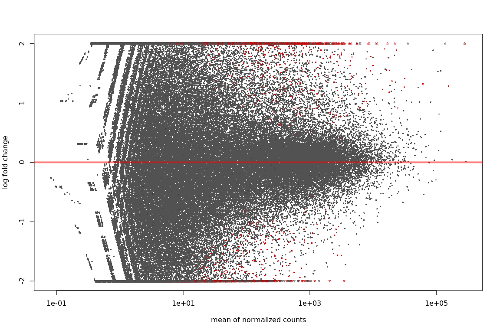

``` r
plotMA(resLFCH898, ylim=c(-2,2))
```

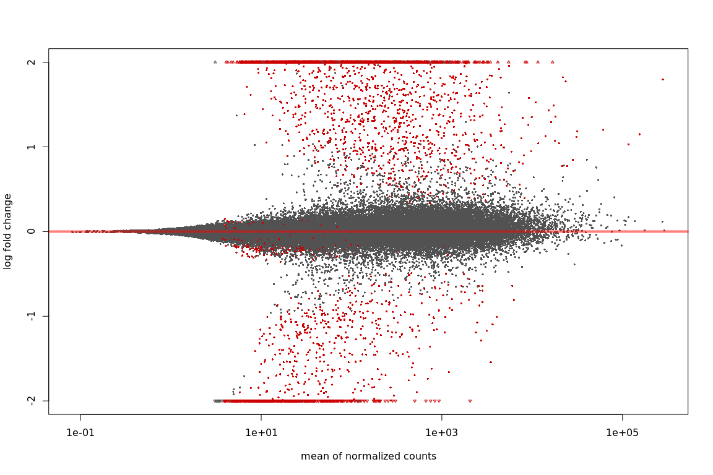

``` r
# because we are interested in treated vs untreated, we set 'coef=2'
resNormH898 <- lfcShrink(ddsH898, coef=2, type="normal")
resAshH898 <- lfcShrink(ddsH898, coef=2, type="ashr")
```

    ## Squarem-1
    ## Objective fn: 30634.6
    ## Objective fn: 28958.5  Extrapolation: 0  Steplength: 1
    ## Objective fn: 26113.7  Extrapolation: 1  Steplength: 4
    ## Objective fn: 25727  Extrapolation: 1  Steplength: 2.59325
    ## Objective fn: 25238.1  Extrapolation: 1  Steplength: 16
    ## Objective fn: 25120.1  Extrapolation: 1  Steplength: 3.03938
    ## Objective fn: 25098.9  Extrapolation: 1  Steplength: 4.85122
    ## Objective fn: 25087.1  Extrapolation: 1  Steplength: 5.02597
    ## Objective fn: 25065.5  Extrapolation: 1  Steplength: 3.46649
    ## Objective fn: 25061.7  Extrapolation: 0  Steplength: 1
    ## Objective fn: 25059.4  Extrapolation: 0  Steplength: 1
    ## Objective fn: 25057.4  Extrapolation: 0  Steplength: 1
    ## Objective fn: 25035.8  Extrapolation: 1  Steplength: 16
    ## Objective fn: 25034.5  Extrapolation: 0  Steplength: 1
    ## Objective fn: 25033.6  Extrapolation: 0  Steplength: 1
    ## Objective fn: 25032.9  Extrapolation: 0  Steplength: 1
    ## Objective fn: 25032.2  Extrapolation: 0  Steplength: 1
    ## Objective fn: 25031.7  Extrapolation: 1  Steplength: 49.4727
    ## Objective fn: 25021.7  Extrapolation: 0  Steplength: 1
    ## Objective fn: 25019.3  Extrapolation: 0  Steplength: 1
    ## Objective fn: 25018.4  Extrapolation: 1  Steplength: 7.99788
    ## Objective fn: 25016.4  Extrapolation: 1  Steplength: 2.86039
    ## Objective fn: 25016.3  Extrapolation: 0  Steplength: 1
    ## Objective fn: 25015  Extrapolation: 1  Steplength: 16
    ## Objective fn: 25014.8  Extrapolation: 0  Steplength: 1
    ## Objective fn: 25014.6  Extrapolation: 0  Steplength: 1
    ## Objective fn: 25013.6  Extrapolation: 1  Steplength: 16
    ## Objective fn: 25013.2  Extrapolation: 0  Steplength: 1
    ## Objective fn: 25013  Extrapolation: 0  Steplength: 1
    ## Objective fn: 25012.8  Extrapolation: 0  Steplength: 1
    ## Objective fn: 25012.7  Extrapolation: 0  Steplength: 1
    ## Objective fn: 25012.6  Extrapolation: 0  Steplength: 1
    ## Objective fn: 25011.4  Extrapolation: 1  Steplength: 16
    ## Objective fn: 25011.2  Extrapolation: 0  Steplength: 1
    ## Objective fn: 25011.1  Extrapolation: 0  Steplength: 1
    ## Objective fn: 25011  Extrapolation: 0  Steplength: 1
    ## Objective fn: 25010.9  Extrapolation: 0  Steplength: 1
    ## Objective fn: 25009.7  Extrapolation: 1  Steplength: 16
    ## Objective fn: 25009.6  Extrapolation: 0  Steplength: 1
    ## Objective fn: 25009.5  Extrapolation: 0  Steplength: 1
    ## Objective fn: 25009.4  Extrapolation: 0  Steplength: 1
    ## Objective fn: 25008.4  Extrapolation: 1  Steplength: 16
    ## Objective fn: 25009.1  Extrapolation: 1  Steplength: 25.7272
    ## Objective fn: 25007.9  Extrapolation: 0  Steplength: 1
    ## Objective fn: 25006.8  Extrapolation: 1  Steplength: 7.5042
    ## Objective fn: 25006  Extrapolation: 1  Steplength: 2.98476
    ## Objective fn: 25005.9  Extrapolation: 0  Steplength: 1
    ## Objective fn: 25005.3  Extrapolation: 1  Steplength: 16
    ## Objective fn: 25005.2  Extrapolation: 0  Steplength: 1
    ## Objective fn: 25005.1  Extrapolation: 0  Steplength: 1
    ## Objective fn: 25005  Extrapolation: 0  Steplength: 1
    ## Objective fn: 25005  Extrapolation: 0  Steplength: 1
    ## Objective fn: 25004.4  Extrapolation: 1  Steplength: 16
    ## Objective fn: 25004.3  Extrapolation: 0  Steplength: 1
    ## Objective fn: 25004.2  Extrapolation: 0  Steplength: 1
    ## Objective fn: 25004.2  Extrapolation: 0  Steplength: 1
    ## Objective fn: 25005.1  Extrapolation: 1  Steplength: 64
    ## Objective fn: 25002.9  Extrapolation: 1  Steplength: 6.48284
    ## Objective fn: 25002  Extrapolation: 1  Steplength: 1.99295
    ## Objective fn: 25001.9  Extrapolation: 0  Steplength: 1
    ## Objective fn: 25001.8  Extrapolation: 0  Steplength: 1
    ## Objective fn: 25001.8  Extrapolation: 0  Steplength: 1
    ## Objective fn: 25001.8  Extrapolation: 0  Steplength: 1
    ## Objective fn: 25001.7  Extrapolation: 0  Steplength: 1
    ## Objective fn: 25001.7  Extrapolation: 0  Steplength: 1
    ## Objective fn: 25001.6  Extrapolation: 1  Steplength: 64
    ## Objective fn: 25000  Extrapolation: 1  Steplength: 4.8153
    ## Objective fn: 24999.7  Extrapolation: 1  Steplength: 12.7533
    ## Objective fn: 24999.5  Extrapolation: 1  Steplength: 6.7048
    ## Objective fn: 24999.3  Extrapolation: 1  Steplength: 5.84768
    ## Objective fn: 24999.1  Extrapolation: 1  Steplength: 7.14983
    ## Objective fn: 24998.9  Extrapolation: 1  Steplength: 5.58624
    ## Objective fn: 24998.7  Extrapolation: 1  Steplength: 7.6752
    ## Objective fn: 24998.5  Extrapolation: 1  Steplength: 5.22964
    ## Objective fn: 24998.4  Extrapolation: 1  Steplength: 8.59002
    ## Objective fn: 24998.1  Extrapolation: 1  Steplength: 4.78016
    ## Objective fn: 24998  Extrapolation: 1  Steplength: 10.2791
    ## Objective fn: 24997.7  Extrapolation: 1  Steplength: 4.27041
    ## Objective fn: 24997.6  Extrapolation: 1  Steplength: 13.6936
    ## Objective fn: 24997.1  Extrapolation: 1  Steplength: 3.76939
    ## Objective fn: 24997.8  Extrapolation: 1  Steplength: 21.8568
    ## Objective fn: 24996.3  Extrapolation: 1  Steplength: 3.36008
    ## Objective fn: 24996.3  Extrapolation: 0  Steplength: 1
    ## Objective fn: 24996.2  Extrapolation: 0  Steplength: 1
    ## Objective fn: 24996.2  Extrapolation: 0  Steplength: 1
    ## Objective fn: 24994.1  Extrapolation: 1  Steplength: 64
    ## Objective fn: 24993.8  Extrapolation: 1  Steplength: 5.67824
    ## Objective fn: 24993.6  Extrapolation: 1  Steplength: 7.35082
    ## Objective fn: 24993.3  Extrapolation: 1  Steplength: 5.50169
    ## Objective fn: 24993.1  Extrapolation: 1  Steplength: 7.86938
    ## Objective fn: 24992.7  Extrapolation: 1  Steplength: 5.17425
    ## Objective fn: 24992.5  Extrapolation: 1  Steplength: 8.74347
    ## Objective fn: 24992.1  Extrapolation: 1  Steplength: 4.77013
    ## Objective fn: 24992  Extrapolation: 1  Steplength: 10.3009
    ## Objective fn: 24991.5  Extrapolation: 1  Steplength: 4.30754
    ## Objective fn: 24991.7  Extrapolation: 1  Steplength: 13.3794
    ## Objective fn: 24990.7  Extrapolation: 1  Steplength: 3.83228
    ## Objective fn: 24990.6  Extrapolation: 0  Steplength: 1
    ## Objective fn: 24990.6  Extrapolation: 0  Steplength: 1
    ## Objective fn: 24990.6  Extrapolation: 0  Steplength: 1
    ## Objective fn: 24990.5  Extrapolation: 0  Steplength: 1
    ## Objective fn: 24987.9  Extrapolation: 1  Steplength: 64
    ## Objective fn: 24987.4  Extrapolation: 1  Steplength: 4.86827
    ## Objective fn: 24987.3  Extrapolation: 1  Steplength: 9.60617
    ## Objective fn: 24986.7  Extrapolation: 1  Steplength: 4.48038
    ## Objective fn: 24987  Extrapolation: 1  Steplength: 12.1208
    ## Objective fn: 24985.8  Extrapolation: 1  Steplength: 3.96786
    ## Objective fn: 24985.8  Extrapolation: 0  Steplength: 1
    ## Objective fn: 24985.7  Extrapolation: 0  Steplength: 1
    ## Objective fn: 24985.7  Extrapolation: 0  Steplength: 1
    ## Objective fn: 24985.6  Extrapolation: 0  Steplength: 1
    ## Objective fn: 24985.6  Extrapolation: 0  Steplength: 1
    ## Objective fn: 24982.5  Extrapolation: 1  Steplength: 64
    ## Objective fn: 24982.2  Extrapolation: 1  Steplength: 6.91481
    ## Objective fn: 24981.8  Extrapolation: 1  Steplength: 5.87821
    ## Objective fn: 24981.6  Extrapolation: 1  Steplength: 7.12454
    ## Objective fn: 24981.1  Extrapolation: 1  Steplength: 5.62975
    ## Objective fn: 24980.9  Extrapolation: 1  Steplength: 7.61042
    ## Objective fn: 24980.4  Extrapolation: 1  Steplength: 5.27896
    ## Objective fn: 24980.3  Extrapolation: 1  Steplength: 8.49955
    ## Objective fn: 24979.6  Extrapolation: 1  Steplength: 4.81246
    ## Objective fn: 24980  Extrapolation: 1  Steplength: 10.2863
    ## Objective fn: 24978.8  Extrapolation: 1  Steplength: 4.25084
    ## Objective fn: 24978.8  Extrapolation: 0  Steplength: 1
    ## Objective fn: 24978.7  Extrapolation: 0  Steplength: 1
    ## Objective fn: 24978.7  Extrapolation: 0  Steplength: 1
    ## Objective fn: 24978.6  Extrapolation: 0  Steplength: 1
    ## Objective fn: 24978.6  Extrapolation: 0  Steplength: 1
    ## Objective fn: 24975.8  Extrapolation: 1  Steplength: 64
    ## Objective fn: 24975.3  Extrapolation: 1  Steplength: 5.68418
    ## Objective fn: 24975.2  Extrapolation: 1  Steplength: 7.45508
    ## Objective fn: 24974.6  Extrapolation: 1  Steplength: 5.34662
    ## Objective fn: 24974.7  Extrapolation: 1  Steplength: 8.32749
    ## Objective fn: 24973.9  Extrapolation: 1  Steplength: 4.84855
    ## Objective fn: 24974.4  Extrapolation: 1  Steplength: 10.1849
    ## Objective fn: 24973.2  Extrapolation: 1  Steplength: 4.2335
    ## Objective fn: 24973.2  Extrapolation: 0  Steplength: 1
    ## Objective fn: 24973.1  Extrapolation: 0  Steplength: 1
    ## Objective fn: 24973.1  Extrapolation: 0  Steplength: 1
    ## Objective fn: 24973  Extrapolation: 0  Steplength: 1
    ## Objective fn: 24973  Extrapolation: 0  Steplength: 1
    ## Objective fn: 24970.5  Extrapolation: 1  Steplength: 64
    ## Objective fn: 24970.1  Extrapolation: 1  Steplength: 5.62
    ## Objective fn: 24970  Extrapolation: 1  Steplength: 7.5889
    ## Objective fn: 24969.5  Extrapolation: 1  Steplength: 5.2233
    ## Objective fn: 24969.6  Extrapolation: 1  Steplength: 8.72014
    ## Objective fn: 24968.8  Extrapolation: 1  Steplength: 4.64443
    ## Objective fn: 24969.7  Extrapolation: 1  Steplength: 11.3823
    ## Objective fn: 24968.2  Extrapolation: 1  Steplength: 3.96495
    ## Objective fn: 24968.1  Extrapolation: 0  Steplength: 1
    ## Objective fn: 24968.1  Extrapolation: 0  Steplength: 1
    ## Objective fn: 24968.1  Extrapolation: 0  Steplength: 1
    ## Objective fn: 24968  Extrapolation: 0  Steplength: 1
    ## Objective fn: 24968  Extrapolation: 0  Steplength: 1
    ## Objective fn: 24965.7  Extrapolation: 1  Steplength: 64
    ## Objective fn: 24965.5  Extrapolation: 1  Steplength: 6.55747
    ## Objective fn: 24965.3  Extrapolation: 1  Steplength: 6.1753
    ## Objective fn: 24965.1  Extrapolation: 1  Steplength: 6.60094
    ## Objective fn: 24964.8  Extrapolation: 1  Steplength: 6.0454
    ## Objective fn: 24964.6  Extrapolation: 1  Steplength: 6.80452
    ## Objective fn: 24964.3  Extrapolation: 1  Steplength: 5.82708
    ## Objective fn: 24964.2  Extrapolation: 1  Steplength: 7.19512
    ## Objective fn: 24963.8  Extrapolation: 1  Steplength: 5.47498
    ## Objective fn: 24963.9  Extrapolation: 1  Steplength: 7.9902
    ## Objective fn: 24963.4  Extrapolation: 1  Steplength: 4.94852
    ## Objective fn: 24963.7  Extrapolation: 1  Steplength: 9.78869
    ## Objective fn: 24962.9  Extrapolation: 1  Steplength: 4.26321
    ## Objective fn: 24962.8  Extrapolation: 0  Steplength: 1
    ## Objective fn: 24962.8  Extrapolation: 0  Steplength: 1
    ## Objective fn: 24962.8  Extrapolation: 0  Steplength: 1
    ## Objective fn: 24962.7  Extrapolation: 0  Steplength: 1
    ## Objective fn: 24962.7  Extrapolation: 0  Steplength: 1
    ## Objective fn: 24961  Extrapolation: 1  Steplength: 64
    ## Objective fn: 24960.7  Extrapolation: 1  Steplength: 5.38631
    ## Objective fn: 24960.7  Extrapolation: 1  Steplength: 8.17283
    ## Objective fn: 24960.3  Extrapolation: 1  Steplength: 4.84313
    ## Objective fn: 24960.6  Extrapolation: 1  Steplength: 10.3141
    ## Objective fn: 24959.8  Extrapolation: 1  Steplength: 4.11998
    ## Objective fn: 24959.8  Extrapolation: 0  Steplength: 1
    ## Objective fn: 24959.8  Extrapolation: 0  Steplength: 1
    ## Objective fn: 24959.7  Extrapolation: 0  Steplength: 1
    ## Objective fn: 24959.7  Extrapolation: 0  Steplength: 1
    ## Objective fn: 24959.7  Extrapolation: 0  Steplength: 1
    ## Objective fn: 24958.2  Extrapolation: 1  Steplength: 64
    ## Objective fn: 24958  Extrapolation: 1  Steplength: 5.83803
    ## Objective fn: 24957.9  Extrapolation: 1  Steplength: 7.19712
    ## Objective fn: 24957.6  Extrapolation: 1  Steplength: 5.4539
    ## Objective fn: 24957.6  Extrapolation: 1  Steplength: 8.08576
    ## Objective fn: 24957.3  Extrapolation: 1  Steplength: 4.86886
    ## Objective fn: 24957.6  Extrapolation: 1  Steplength: 10.263
    ## Objective fn: 24956.9  Extrapolation: 1  Steplength: 4.11064
    ## Objective fn: 24956.8  Extrapolation: 0  Steplength: 1
    ## Objective fn: 24956.8  Extrapolation: 0  Steplength: 1
    ## Objective fn: 24956.8  Extrapolation: 0  Steplength: 1
    ## Objective fn: 24956.8  Extrapolation: 0  Steplength: 1
    ## Objective fn: 24956.8  Extrapolation: 0  Steplength: 1
    ## Objective fn: 24955.4  Extrapolation: 1  Steplength: 64
    ## Objective fn: 24955.3  Extrapolation: 1  Steplength: 5.94578
    ## Objective fn: 24955.2  Extrapolation: 1  Steplength: 7.03712
    ## Objective fn: 24955  Extrapolation: 1  Steplength: 5.58143
    ## Objective fn: 24955  Extrapolation: 1  Steplength: 7.80343
    ## Objective fn: 24954.6  Extrapolation: 1  Steplength: 5.00748
    ## Objective fn: 24954.9  Extrapolation: 1  Steplength: 9.73313
    ## Objective fn: 24954.3  Extrapolation: 1  Steplength: 4.21232
    ## Objective fn: 24954.3  Extrapolation: 0  Steplength: 1
    ## Objective fn: 24954.3  Extrapolation: 0  Steplength: 1
    ## Objective fn: 24954.3  Extrapolation: 0  Steplength: 1
    ## Objective fn: 24954.2  Extrapolation: 0  Steplength: 1
    ## Objective fn: 24954.2  Extrapolation: 0  Steplength: 1
    ## Objective fn: 24953.1  Extrapolation: 1  Steplength: 64
    ## Objective fn: 24952.9  Extrapolation: 1  Steplength: 5.68344
    ## Objective fn: 24952.9  Extrapolation: 1  Steplength: 7.61452
    ## Objective fn: 24952.6  Extrapolation: 1  Steplength: 5.10825
    ## Objective fn: 24952.8  Extrapolation: 1  Steplength: 9.41504
    ## Objective fn: 24952.3  Extrapolation: 1  Steplength: 4.27219
    ## Objective fn: 24952.3  Extrapolation: 0  Steplength: 1
    ## Objective fn: 24952.3  Extrapolation: 0  Steplength: 1
    ## Objective fn: 24952.2  Extrapolation: 0  Steplength: 1
    ## Objective fn: 24952.2  Extrapolation: 0  Steplength: 1
    ## Objective fn: 24952.2  Extrapolation: 0  Steplength: 1
    ## Objective fn: 24951.2  Extrapolation: 1  Steplength: 64
    ## Objective fn: 24951  Extrapolation: 1  Steplength: 5.55327
    ## Objective fn: 24951  Extrapolation: 1  Steplength: 7.99191
    ## Objective fn: 24950.7  Extrapolation: 1  Steplength: 4.84717
    ## Objective fn: 24951.2  Extrapolation: 1  Steplength: 10.8138
    ## Objective fn: 24950.4  Extrapolation: 1  Steplength: 3.89817
    ## Objective fn: 24950.4  Extrapolation: 0  Steplength: 1
    ## Objective fn: 24950.4  Extrapolation: 0  Steplength: 1
    ## Objective fn: 24950.4  Extrapolation: 0  Steplength: 1
    ## Objective fn: 24950.4  Extrapolation: 0  Steplength: 1
    ## Objective fn: 24949.7  Extrapolation: 1  Steplength: 64
    ## Objective fn: 24949.2  Extrapolation: 1  Steplength: 4.45842
    ## Objective fn: 24949.2  Extrapolation: 0  Steplength: 1
    ## Objective fn: 24949.2  Extrapolation: 0  Steplength: 1
    ## Objective fn: 24949.2  Extrapolation: 0  Steplength: 1
    ## Objective fn: 24949.1  Extrapolation: 0  Steplength: 1
    ## Objective fn: 24949.1  Extrapolation: 0  Steplength: 1
    ## Objective fn: 24948.3  Extrapolation: 1  Steplength: 64
    ## Objective fn: 24948  Extrapolation: 1  Steplength: 5.0543
    ## Objective fn: 24948.4  Extrapolation: 1  Steplength: 9.7372
    ## Objective fn: 24947.8  Extrapolation: 1  Steplength: 4.10792
    ## Objective fn: 24947.8  Extrapolation: 0  Steplength: 1
    ## Objective fn: 24947.8  Extrapolation: 0  Steplength: 1
    ## Objective fn: 24947.7  Extrapolation: 0  Steplength: 1
    ## Objective fn: 24947.7  Extrapolation: 0  Steplength: 1
    ## Objective fn: 24947.7  Extrapolation: 0  Steplength: 1
    ## Objective fn: 24946.8  Extrapolation: 1  Steplength: 64
    ## Objective fn: 24946.7  Extrapolation: 1  Steplength: 6.22076
    ## Objective fn: 24946.6  Extrapolation: 1  Steplength: 6.66595
    ## Objective fn: 24946.5  Extrapolation: 1  Steplength: 5.92795
    ## Objective fn: 24946.5  Extrapolation: 1  Steplength: 7.14362
    ## Objective fn: 24946.3  Extrapolation: 1  Steplength: 5.40796
    ## Objective fn: 24946.4  Extrapolation: 1  Steplength: 8.55271
    ## Objective fn: 24946  Extrapolation: 1  Steplength: 4.48287
    ## Objective fn: 24946  Extrapolation: 0  Steplength: 1
    ## Objective fn: 24946  Extrapolation: 0  Steplength: 1
    ## Objective fn: 24946  Extrapolation: 0  Steplength: 1
    ## Objective fn: 24946  Extrapolation: 0  Steplength: 1
    ## Objective fn: 24945.9  Extrapolation: 0  Steplength: 1
    ## Objective fn: 24945.2  Extrapolation: 1  Steplength: 64
    ## Objective fn: 24945  Extrapolation: 1  Steplength: 5.01132
    ## Objective fn: 24945.4  Extrapolation: 1  Steplength: 10.2188
    ## Objective fn: 24944.7  Extrapolation: 1  Steplength: 3.92641
    ## Objective fn: 24944.7  Extrapolation: 0  Steplength: 1
    ## Objective fn: 24944.7  Extrapolation: 0  Steplength: 1
    ## Objective fn: 24944.7  Extrapolation: 0  Steplength: 1
    ## Objective fn: 24944.7  Extrapolation: 0  Steplength: 1
    ## Objective fn: 24944.2  Extrapolation: 1  Steplength: 64
    ## Objective fn: 24943.8  Extrapolation: 1  Steplength: 4.3449
    ## Objective fn: 24943.7  Extrapolation: 0  Steplength: 1
    ## Objective fn: 24943.7  Extrapolation: 0  Steplength: 1
    ## Objective fn: 24943.7  Extrapolation: 0  Steplength: 1
    ## Objective fn: 24943.7  Extrapolation: 0  Steplength: 1
    ## Objective fn: 24943.7  Extrapolation: 0  Steplength: 1
    ## Objective fn: 24943  Extrapolation: 1  Steplength: 64
    ## Objective fn: 24942.8  Extrapolation: 1  Steplength: 5.25288
    ## Objective fn: 24943  Extrapolation: 1  Steplength: 9.18648
    ## Objective fn: 24942.6  Extrapolation: 1  Steplength: 4.19209
    ## Objective fn: 24942.6  Extrapolation: 0  Steplength: 1
    ## Objective fn: 24942.6  Extrapolation: 0  Steplength: 1
    ## Objective fn: 24942.5  Extrapolation: 0  Steplength: 1
    ## Objective fn: 24942.5  Extrapolation: 0  Steplength: 1
    ## Objective fn: 24942.5  Extrapolation: 0  Steplength: 1
    ## Objective fn: 24941.8  Extrapolation: 1  Steplength: 64
    ## Objective fn: 24941.7  Extrapolation: 1  Steplength: 5.80679
    ## Objective fn: 24941.7  Extrapolation: 1  Steplength: 7.50501
    ## Objective fn: 24941.5  Extrapolation: 1  Steplength: 5.04802
    ## Objective fn: 24941.9  Extrapolation: 1  Steplength: 10.1556
    ## Objective fn: 24941.3  Extrapolation: 1  Steplength: 3.89041
    ## Objective fn: 24941.3  Extrapolation: 0  Steplength: 1
    ## Objective fn: 24941.3  Extrapolation: 0  Steplength: 1
    ## Objective fn: 24941.3  Extrapolation: 0  Steplength: 1
    ## Objective fn: 24941.3  Extrapolation: 0  Steplength: 1
    ## Objective fn: 24940.8  Extrapolation: 1  Steplength: 64
    ## Objective fn: 24940.5  Extrapolation: 1  Steplength: 4.37178
    ## Objective fn: 24940.5  Extrapolation: 0  Steplength: 1
    ## Objective fn: 24940.5  Extrapolation: 0  Steplength: 1
    ## Objective fn: 24940.4  Extrapolation: 0  Steplength: 1
    ## Objective fn: 24940.4  Extrapolation: 0  Steplength: 1
    ## Objective fn: 24940.4  Extrapolation: 0  Steplength: 1
    ## Objective fn: 24939.9  Extrapolation: 1  Steplength: 64
    ## Objective fn: 24939.7  Extrapolation: 1  Steplength: 5.11715
    ## Objective fn: 24939.9  Extrapolation: 1  Steplength: 9.75368
    ## Objective fn: 24939.5  Extrapolation: 1  Steplength: 3.98801
    ## Objective fn: 24939.5  Extrapolation: 0  Steplength: 1
    ## Objective fn: 24939.5  Extrapolation: 0  Steplength: 1
    ## Objective fn: 24939.5  Extrapolation: 0  Steplength: 1
    ## Objective fn: 24939.5  Extrapolation: 0  Steplength: 1
    ## Objective fn: 24939.1  Extrapolation: 1  Steplength: 64
    ## Objective fn: 24938.8  Extrapolation: 1  Steplength: 4.08217
    ## Objective fn: 24938.8  Extrapolation: 0  Steplength: 1
    ## Objective fn: 24938.8  Extrapolation: 0  Steplength: 1
    ## Objective fn: 24938.8  Extrapolation: 0  Steplength: 1
    ## Objective fn: 24938.8  Extrapolation: 0  Steplength: 1
    ## Objective fn: 24938.8  Extrapolation: 0  Steplength: 1
    ## Objective fn: 24938.2  Extrapolation: 1  Steplength: 64
    ## Objective fn: 24938.1  Extrapolation: 1  Steplength: 5.93829
    ## Objective fn: 24938.1  Extrapolation: 1  Steplength: 7.3037
    ## Objective fn: 24938  Extrapolation: 1  Steplength: 5.19055
    ## Objective fn: 24938.1  Extrapolation: 1  Steplength: 9.43757
    ## Objective fn: 24937.9  Extrapolation: 1  Steplength: 4.06536
    ## Objective fn: 24937.8  Extrapolation: 0  Steplength: 1
    ## Objective fn: 24937.8  Extrapolation: 0  Steplength: 1
    ## Objective fn: 24937.8  Extrapolation: 0  Steplength: 1
    ## Objective fn: 24937.8  Extrapolation: 0  Steplength: 1
    ## Objective fn: 24937.5  Extrapolation: 1  Steplength: 64
    ## Objective fn: 24937.2  Extrapolation: 1  Steplength: 3.89955
    ## Objective fn: 24937.2  Extrapolation: 0  Steplength: 1
    ## Objective fn: 24937.2  Extrapolation: 0  Steplength: 1
    ## Objective fn: 24937.2  Extrapolation: 0  Steplength: 1
    ## Objective fn: 24937.2  Extrapolation: 0  Steplength: 1
    ## Objective fn: 24936.9  Extrapolation: 1  Steplength: 64
    ## Objective fn: 24936.7  Extrapolation: 1  Steplength: 4.27924
    ## Objective fn: 24937.2  Extrapolation: 1  Steplength: 14.9481
    ## Objective fn: 24936.5  Extrapolation: 1  Steplength: 3.36024
    ## Objective fn: 24936.5  Extrapolation: 0  Steplength: 1
    ## Objective fn: 24936.5  Extrapolation: 0  Steplength: 1
    ## Objective fn: 24936.5  Extrapolation: 0  Steplength: 1
    ## Objective fn: 24936.1  Extrapolation: 1  Steplength: 64
    ## Objective fn: 24936  Extrapolation: 1  Steplength: 4.99713
    ## Objective fn: 24936.1  Extrapolation: 1  Steplength: 9.90129
    ## Objective fn: 24935.9  Extrapolation: 1  Steplength: 3.98301
    ## Objective fn: 24935.9  Extrapolation: 0  Steplength: 1
    ## Objective fn: 24935.9  Extrapolation: 0  Steplength: 1
    ## Objective fn: 24935.9  Extrapolation: 0  Steplength: 1
    ## Objective fn: 24935.9  Extrapolation: 0  Steplength: 1
    ## Objective fn: 24935.6  Extrapolation: 1  Steplength: 64
    ## Objective fn: 24935.5  Extrapolation: 1  Steplength: 4.02076
    ## Objective fn: 24936.4  Extrapolation: 1  Steplength: 19.8919
    ## Objective fn: 24935.3  Extrapolation: 1  Steplength: 3.1648
    ## Objective fn: 24935.3  Extrapolation: 0  Steplength: 1
    ## Objective fn: 24934.9  Extrapolation: 1  Steplength: 64
    ## Objective fn: 24934.9  Extrapolation: 1  Steplength: 6.38202
    ## Objective fn: 24934.9  Extrapolation: 1  Steplength: 6.84702
    ## Objective fn: 24934.8  Extrapolation: 1  Steplength: 5.66209
    ## Objective fn: 24934.8  Extrapolation: 1  Steplength: 7.68802
    ## Objective fn: 24934.7  Extrapolation: 1  Steplength: 4.93519
    ## Objective fn: 24934.8  Extrapolation: 1  Steplength: 10.4062
    ## Objective fn: 24934.7  Extrapolation: 1  Steplength: 3.88511
    ## Objective fn: 24934.7  Extrapolation: 0  Steplength: 1
    ## Objective fn: 24934.7  Extrapolation: 0  Steplength: 1
    ## Objective fn: 24934.6  Extrapolation: 0  Steplength: 1
    ## Objective fn: 24934.6  Extrapolation: 0  Steplength: 1
    ## Objective fn: 24934.4  Extrapolation: 1  Steplength: 64
    ## Objective fn: 24934.3  Extrapolation: 1  Steplength: 4.22582
    ## Objective fn: 24934.6  Extrapolation: 1  Steplength: 16.0711
    ## Objective fn: 24934.2  Extrapolation: 1  Steplength: 3.31971
    ## Objective fn: 24934.2  Extrapolation: 0  Steplength: 1
    ## Objective fn: 24934.2  Extrapolation: 0  Steplength: 1
    ## Objective fn: 24934.2  Extrapolation: 0  Steplength: 1
    ## Objective fn: 24933.9  Extrapolation: 1  Steplength: 64
    ## Objective fn: 24933.9  Extrapolation: 1  Steplength: 5.04934
    ## Objective fn: 24933.9  Extrapolation: 1  Steplength: 9.58657
    ## Objective fn: 24933.8  Extrapolation: 1  Steplength: 4.14038
    ## Objective fn: 24934.2  Extrapolation: 1  Steplength: 17.4765
    ## Objective fn: 24933.7  Extrapolation: 1  Steplength: 3.26367
    ## Objective fn: 24933.7  Extrapolation: 0  Steplength: 1
    ## Objective fn: 24933.7  Extrapolation: 0  Steplength: 1
    ## Objective fn: 24933.7  Extrapolation: 0  Steplength: 1
    ## Objective fn: 24933.4  Extrapolation: 1  Steplength: 64
    ## Objective fn: 24933.4  Extrapolation: 1  Steplength: 5.90126
    ## Objective fn: 24933.4  Extrapolation: 1  Steplength: 7.16289
    ## Objective fn: 24933.3  Extrapolation: 1  Steplength: 5.39348
    ## Objective fn: 24933.3  Extrapolation: 1  Steplength: 8.39976
    ## Objective fn: 24933.3  Extrapolation: 1  Steplength: 4.59093
    ## Objective fn: 24933.4  Extrapolation: 1  Steplength: 12.3758
    ## Objective fn: 24933.2  Extrapolation: 1  Steplength: 3.63038
    ## Objective fn: 24933.2  Extrapolation: 0  Steplength: 1
    ## Objective fn: 24933.2  Extrapolation: 0  Steplength: 1
    ## Objective fn: 24933.2  Extrapolation: 0  Steplength: 1
    ## Objective fn: 24933.2  Extrapolation: 0  Steplength: 1
    ## Objective fn: 24933  Extrapolation: 1  Steplength: 64
    ## Objective fn: 24932.9  Extrapolation: 1  Steplength: 5.14824
    ## Objective fn: 24932.9  Extrapolation: 1  Steplength: 9.23545
    ## Objective fn: 24932.9  Extrapolation: 1  Steplength: 4.27219
    ## Objective fn: 24933.1  Extrapolation: 1  Steplength: 15.447
    ## Objective fn: 24932.8  Extrapolation: 1  Steplength: 3.37956
    ## Objective fn: 24932.8  Extrapolation: 0  Steplength: 1
    ## Objective fn: 24932.8  Extrapolation: 0  Steplength: 1
    ## Objective fn: 24932.8  Extrapolation: 0  Steplength: 1
    ## Objective fn: 24932.6  Extrapolation: 1  Steplength: 64
    ## Objective fn: 24932.5  Extrapolation: 1  Steplength: 4.51032
    ## Objective fn: 24932.6  Extrapolation: 1  Steplength: 12.7061
    ## Objective fn: 24932.5  Extrapolation: 1  Steplength: 3.61287
    ## Objective fn: 24932.5  Extrapolation: 0  Steplength: 1
    ## Objective fn: 24932.4  Extrapolation: 0  Steplength: 1
    ## Objective fn: 24932.4  Extrapolation: 0  Steplength: 1
    ## Objective fn: 24932.4  Extrapolation: 0  Steplength: 1
    ## Objective fn: 24932.2  Extrapolation: 1  Steplength: 64
    ## Objective fn: 24932.2  Extrapolation: 1  Steplength: 5.29505
    ## Objective fn: 24932.2  Extrapolation: 1  Steplength: 8.72878
    ## Objective fn: 24932.2  Extrapolation: 1  Steplength: 4.45979
    ## Objective fn: 24932.3  Extrapolation: 1  Steplength: 13.5212
    ## Objective fn: 24932.1  Extrapolation: 1  Steplength: 3.51674
    ## Objective fn: 24932.1  Extrapolation: 0  Steplength: 1
    ## Objective fn: 24932.1  Extrapolation: 0  Steplength: 1
    ## Objective fn: 24932.1  Extrapolation: 0  Steplength: 1
    ## Objective fn: 24932.1  Extrapolation: 0  Steplength: 1
    ## Objective fn: 24931.9  Extrapolation: 1  Steplength: 64
    ## Objective fn: 24931.9  Extrapolation: 1  Steplength: 6.01235
    ## Objective fn: 24931.8  Extrapolation: 1  Steplength: 6.95304
    ## Objective fn: 24931.8  Extrapolation: 1  Steplength: 5.60461
    ## Objective fn: 24931.8  Extrapolation: 1  Steplength: 7.82658
    ## Objective fn: 24931.8  Extrapolation: 1  Steplength: 4.90836
    ## Objective fn: 24931.8  Extrapolation: 1  Steplength: 10.4408
    ## Objective fn: 24931.7  Extrapolation: 1  Steplength: 3.93807
    ## Objective fn: 24932.5  Extrapolation: 1  Steplength: 21.5092
    ## Objective fn: 24931.6  Extrapolation: 1  Steplength: 3.15684
    ## Objective fn: 24931.6  Extrapolation: 0  Steplength: 1
    ## Objective fn: 24931.4  Extrapolation: 1  Steplength: 64
    ## Objective fn: 24931.4  Extrapolation: 1  Steplength: 6.20703
    ## Objective fn: 24931.4  Extrapolation: 1  Steplength: 6.79776
    ## Objective fn: 24931.4  Extrapolation: 1  Steplength: 5.7667
    ## Objective fn: 24931.4  Extrapolation: 1  Steplength: 7.44271
    ## Objective fn: 24931.3  Extrapolation: 1  Steplength: 5.16637
    ## Objective fn: 24931.4  Extrapolation: 1  Steplength: 9.29846
    ## Objective fn: 24931.3  Extrapolation: 1  Steplength: 4.22768
    ## Objective fn: 24931.7  Extrapolation: 1  Steplength: 16.4318
    ## Objective fn: 24931.2  Extrapolation: 1  Steplength: 3.30803
    ## Objective fn: 24931.2  Extrapolation: 0  Steplength: 1
    ## Objective fn: 24931.2  Extrapolation: 0  Steplength: 1
    ## Objective fn: 24931.2  Extrapolation: 0  Steplength: 1
    ## Objective fn: 24931  Extrapolation: 1  Steplength: 64
    ## Objective fn: 24931  Extrapolation: 1  Steplength: 5.52395
    ## Objective fn: 24931  Extrapolation: 1  Steplength: 8.12812
    ## Objective fn: 24930.9  Extrapolation: 1  Steplength: 4.71515
    ## Objective fn: 24931.1  Extrapolation: 1  Steplength: 11.7451
    ## Objective fn: 24930.9  Extrapolation: 1  Steplength: 3.68486
    ## Objective fn: 24930.9  Extrapolation: 0  Steplength: 1
    ## Objective fn: 24930.9  Extrapolation: 0  Steplength: 1
    ## Objective fn: 24930.9  Extrapolation: 0  Steplength: 1
    ## Objective fn: 24930.9  Extrapolation: 0  Steplength: 1
    ## Objective fn: 24930.7  Extrapolation: 1  Steplength: 64
    ## Objective fn: 24930.6  Extrapolation: 1  Steplength: 5.07592
    ## Objective fn: 24930.7  Extrapolation: 1  Steplength: 9.73494
    ## Objective fn: 24930.6  Extrapolation: 1  Steplength: 4.07783
    ## Objective fn: 24931.5  Extrapolation: 1  Steplength: 19.2205
    ## Objective fn: 24930.5  Extrapolation: 1  Steplength: 3.19123
    ## Objective fn: 24930.5  Extrapolation: 0  Steplength: 1
    ## Objective fn: 24930.4  Extrapolation: 1  Steplength: 64
    ## Objective fn: 24930.3  Extrapolation: 1  Steplength: 4.4775
    ## Objective fn: 24930.6  Extrapolation: 1  Steplength: 12.9131
    ## Objective fn: 24930.2  Extrapolation: 1  Steplength: 3.55994
    ## Objective fn: 24930.2  Extrapolation: 0  Steplength: 1
    ## Objective fn: 24930.2  Extrapolation: 0  Steplength: 1
    ## Objective fn: 24930.2  Extrapolation: 0  Steplength: 1
    ## Objective fn: 24930.2  Extrapolation: 0  Steplength: 1
    ## Objective fn: 24930.1  Extrapolation: 1  Steplength: 64
    ## Objective fn: 24930  Extrapolation: 1  Steplength: 5.8834
    ## Objective fn: 24930  Extrapolation: 1  Steplength: 7.32486
    ## Objective fn: 24930  Extrapolation: 1  Steplength: 5.2341
    ## Objective fn: 24930  Extrapolation: 1  Steplength: 9.16213
    ## Objective fn: 24929.9  Extrapolation: 1  Steplength: 4.22761
    ## Objective fn: 24930.7  Extrapolation: 1  Steplength: 17.0461
    ## Objective fn: 24929.8  Extrapolation: 1  Steplength: 3.24758
    ## Objective fn: 24929.8  Extrapolation: 0  Steplength: 1
    ## Objective fn: 24929.8  Extrapolation: 0  Steplength: 1
    ## Objective fn: 24929.7  Extrapolation: 1  Steplength: 64
    ## Objective fn: 24929.6  Extrapolation: 1  Steplength: 4.75096
    ## Objective fn: 24929.8  Extrapolation: 1  Steplength: 11.4758
    ## Objective fn: 24929.6  Extrapolation: 1  Steplength: 3.69559
    ## Objective fn: 24929.5  Extrapolation: 0  Steplength: 1
    ## Objective fn: 24929.5  Extrapolation: 0  Steplength: 1
    ## Objective fn: 24929.5  Extrapolation: 0  Steplength: 1
    ## Objective fn: 24929.5  Extrapolation: 0  Steplength: 1
    ## Objective fn: 24929.4  Extrapolation: 1  Steplength: 64
    ## Objective fn: 24929.3  Extrapolation: 1  Steplength: 5.11386
    ## Objective fn: 24929.4  Extrapolation: 1  Steplength: 9.73354
    ## Objective fn: 24929.3  Extrapolation: 1  Steplength: 4.03134
    ## Objective fn: 24929.3  Extrapolation: 0  Steplength: 1
    ## Objective fn: 24929.2  Extrapolation: 0  Steplength: 1
    ## Objective fn: 24929.2  Extrapolation: 0  Steplength: 1
    ## Objective fn: 24929.2  Extrapolation: 0  Steplength: 1
    ## Objective fn: 24929.2  Extrapolation: 1  Steplength: 64
    ## Objective fn: 24929  Extrapolation: 1  Steplength: 4.06684
    ## Objective fn: 24929  Extrapolation: 0  Steplength: 1
    ## Objective fn: 24929  Extrapolation: 0  Steplength: 1
    ## Objective fn: 24929  Extrapolation: 0  Steplength: 1
    ## Objective fn: 24929  Extrapolation: 0  Steplength: 1
    ## Objective fn: 24929  Extrapolation: 0  Steplength: 1
    ## Objective fn: 24928.8  Extrapolation: 1  Steplength: 64
    ## Objective fn: 24928.8  Extrapolation: 1  Steplength: 6.3195
    ## Objective fn: 24928.8  Extrapolation: 1  Steplength: 6.5835
    ## Objective fn: 24928.7  Extrapolation: 1  Steplength: 6.01343
    ## Objective fn: 24928.7  Extrapolation: 1  Steplength: 6.97797
    ## Objective fn: 24928.7  Extrapolation: 1  Steplength: 5.53645
    ## Objective fn: 24928.7  Extrapolation: 1  Steplength: 8.19639
    ## Objective fn: 24928.6  Extrapolation: 1  Steplength: 4.60299
    ## Objective fn: 24929.1  Extrapolation: 1  Steplength: 13.16
    ## Objective fn: 24928.5  Extrapolation: 1  Steplength: 3.44483
    ## Objective fn: 24928.5  Extrapolation: 0  Steplength: 1
    ## Objective fn: 24928.5  Extrapolation: 0  Steplength: 1
    ## Objective fn: 24928.5  Extrapolation: 0  Steplength: 1
    ## Objective fn: 24928.4  Extrapolation: 1  Steplength: 64
    ## Objective fn: 24928.3  Extrapolation: 1  Steplength: 4.47863
    ## Objective fn: 24928.9  Extrapolation: 1  Steplength: 14.1111
    ## Objective fn: 24928.2  Extrapolation: 1  Steplength: 3.37197
    ## Objective fn: 24928.2  Extrapolation: 0  Steplength: 1
    ## Objective fn: 24928.2  Extrapolation: 0  Steplength: 1
    ## Objective fn: 24928.2  Extrapolation: 0  Steplength: 1
    ## Objective fn: 24928.1  Extrapolation: 1  Steplength: 64
    ## Objective fn: 24928  Extrapolation: 1  Steplength: 5.21472
    ## Objective fn: 24928.1  Extrapolation: 1  Steplength: 9.47161
    ## Objective fn: 24927.9  Extrapolation: 1  Steplength: 4.06027
    ## Objective fn: 24927.9  Extrapolation: 0  Steplength: 1
    ## Objective fn: 24927.9  Extrapolation: 0  Steplength: 1
    ## Objective fn: 24927.9  Extrapolation: 0  Steplength: 1
    ## Objective fn: 24927.9  Extrapolation: 0  Steplength: 1
    ## Objective fn: 24927.9  Extrapolation: 1  Steplength: 64
    ## Objective fn: 24927.6  Extrapolation: 1  Steplength: 4.01189
    ## Objective fn: 24927.6  Extrapolation: 0  Steplength: 1
    ## Objective fn: 24927.6  Extrapolation: 0  Steplength: 1
    ## Objective fn: 24927.6  Extrapolation: 0  Steplength: 1
    ## Objective fn: 24927.6  Extrapolation: 0  Steplength: 1
    ## Objective fn: 24927.6  Extrapolation: 1  Steplength: 64
    ## Objective fn: 24927.4  Extrapolation: 1  Steplength: 4.14632
    ## Objective fn: 24927.4  Extrapolation: 0  Steplength: 1
    ## Objective fn: 24927.4  Extrapolation: 0  Steplength: 1
    ## Objective fn: 24927.4  Extrapolation: 0  Steplength: 1
    ## Objective fn: 24927.3  Extrapolation: 0  Steplength: 1
    ## Objective fn: 24927.3  Extrapolation: 0  Steplength: 1
    ## Objective fn: 24927.2  Extrapolation: 1  Steplength: 64
    ## Objective fn: 24927.1  Extrapolation: 1  Steplength: 5.80271
    ## Objective fn: 24927.2  Extrapolation: 1  Steplength: 7.87956
    ## Objective fn: 24927  Extrapolation: 1  Steplength: 4.74386
    ## Objective fn: 24927.6  Extrapolation: 1  Steplength: 12.3541
    ## Objective fn: 24927  Extrapolation: 1  Steplength: 3.4697
    ## Objective fn: 24927  Extrapolation: 0  Steplength: 1
    ## Objective fn: 24927  Extrapolation: 0  Steplength: 1
    ## Objective fn: 24927  Extrapolation: 0  Steplength: 1
    ## Objective fn: 24926.9  Extrapolation: 1  Steplength: 64
    ## Objective fn: 24926.7  Extrapolation: 1  Steplength: 4.39762
    ## Objective fn: 24926.7  Extrapolation: 0  Steplength: 1
    ## Objective fn: 24926.7  Extrapolation: 0  Steplength: 1
    ## Objective fn: 24926.7  Extrapolation: 0  Steplength: 1
    ## Objective fn: 24926.7  Extrapolation: 0  Steplength: 1
    ## Objective fn: 24926.7  Extrapolation: 0  Steplength: 1
    ## Objective fn: 24926.5  Extrapolation: 1  Steplength: 64
    ## Objective fn: 24926.4  Extrapolation: 1  Steplength: 5.21655
    ## Objective fn: 24926.6  Extrapolation: 1  Steplength: 9.67675
    ## Objective fn: 24926.3  Extrapolation: 1  Steplength: 3.93474
    ## Objective fn: 24926.3  Extrapolation: 0  Steplength: 1
    ## Objective fn: 24926.3  Extrapolation: 0  Steplength: 1
    ## Objective fn: 24926.3  Extrapolation: 0  Steplength: 1
    ## Objective fn: 24926.3  Extrapolation: 0  Steplength: 1
    ## Objective fn: 24926.3  Extrapolation: 1  Steplength: 64
    ## Objective fn: 24926.1  Extrapolation: 1  Steplength: 4.29913
    ## Objective fn: 24926  Extrapolation: 0  Steplength: 1
    ## Objective fn: 24926  Extrapolation: 0  Steplength: 1
    ## Objective fn: 24926  Extrapolation: 0  Steplength: 1
    ## Objective fn: 24926  Extrapolation: 0  Steplength: 1
    ## Objective fn: 24926  Extrapolation: 0  Steplength: 1
    ## Objective fn: 24925.9  Extrapolation: 1  Steplength: 64
    ## Objective fn: 24925.8  Extrapolation: 1  Steplength: 5.53146
    ## Objective fn: 24925.9  Extrapolation: 1  Steplength: 8.54986
    ## Objective fn: 24925.7  Extrapolation: 1  Steplength: 4.31704
    ## Objective fn: 24925.7  Extrapolation: 0  Steplength: 1
    ## Objective fn: 24925.7  Extrapolation: 0  Steplength: 1
    ## Objective fn: 24925.7  Extrapolation: 0  Steplength: 1
    ## Objective fn: 24925.7  Extrapolation: 0  Steplength: 1
    ## Objective fn: 24925.7  Extrapolation: 0  Steplength: 1
    ## Objective fn: 24925.5  Extrapolation: 1  Steplength: 64
    ## Objective fn: 24925.4  Extrapolation: 1  Steplength: 5.5617
    ## Objective fn: 24925.5  Extrapolation: 1  Steplength: 8.37275
    ## Objective fn: 24925.3  Extrapolation: 1  Steplength: 4.38668
    ## Objective fn: 24925.3  Extrapolation: 0  Steplength: 1
    ## Objective fn: 24925.3  Extrapolation: 0  Steplength: 1
    ## Objective fn: 24925.3  Extrapolation: 0  Steplength: 1
    ## Objective fn: 24925.3  Extrapolation: 0  Steplength: 1
    ## Objective fn: 24925.3  Extrapolation: 0  Steplength: 1
    ## Objective fn: 24925.1  Extrapolation: 1  Steplength: 64
    ## Objective fn: 24925.1  Extrapolation: 1  Steplength: 5.33203
    ## Objective fn: 24925.3  Extrapolation: 1  Steplength: 9.26891
    ## Objective fn: 24925  Extrapolation: 1  Steplength: 3.9931
    ## Objective fn: 24925  Extrapolation: 0  Steplength: 1
    ## Objective fn: 24925  Extrapolation: 0  Steplength: 1
    ## Objective fn: 24925  Extrapolation: 0  Steplength: 1
    ## Objective fn: 24925  Extrapolation: 0  Steplength: 1
    ## Objective fn: 24924.9  Extrapolation: 1  Steplength: 64
    ## Objective fn: 24924.7  Extrapolation: 1  Steplength: 4.13654
    ## Objective fn: 24924.7  Extrapolation: 0  Steplength: 1
    ## Objective fn: 24924.7  Extrapolation: 0  Steplength: 1
    ## Objective fn: 24924.7  Extrapolation: 0  Steplength: 1
    ## Objective fn: 24924.7  Extrapolation: 0  Steplength: 1
    ## Objective fn: 24924.7  Extrapolation: 0  Steplength: 1
    ## Objective fn: 24924.4  Extrapolation: 1  Steplength: 64
    ## Objective fn: 24924.4  Extrapolation: 1  Steplength: 6.1851
    ## Objective fn: 24924.4  Extrapolation: 1  Steplength: 6.95784
    ## Objective fn: 24924.3  Extrapolation: 1  Steplength: 5.47004
    ## Objective fn: 24924.5  Extrapolation: 1  Steplength: 8.71207
    ## Objective fn: 24924.3  Extrapolation: 1  Steplength: 4.17333
    ## Objective fn: 24924.3  Extrapolation: 0  Steplength: 1
    ## Objective fn: 24924.2  Extrapolation: 0  Steplength: 1
    ## Objective fn: 24924.2  Extrapolation: 0  Steplength: 1
    ## Objective fn: 24924.2  Extrapolation: 0  Steplength: 1
    ## Objective fn: 24924.3  Extrapolation: 1  Steplength: 64
    ## Objective fn: 24924  Extrapolation: 1  Steplength: 3.75964
    ## Objective fn: 24924  Extrapolation: 0  Steplength: 1
    ## Objective fn: 24923.9  Extrapolation: 0  Steplength: 1
    ## Objective fn: 24923.9  Extrapolation: 0  Steplength: 1
    ## Objective fn: 24923.9  Extrapolation: 0  Steplength: 1
    ## Objective fn: 24923.8  Extrapolation: 1  Steplength: 64
    ## Objective fn: 24923.7  Extrapolation: 1  Steplength: 4.93979
    ## Objective fn: 24924.2  Extrapolation: 1  Steplength: 11.6056
    ## Objective fn: 24923.6  Extrapolation: 1  Steplength: 3.43225
    ## Objective fn: 24923.6  Extrapolation: 0  Steplength: 1
    ## Objective fn: 24923.6  Extrapolation: 0  Steplength: 1
    ## Objective fn: 24923.6  Extrapolation: 0  Steplength: 1
    ## Objective fn: 24923.4  Extrapolation: 1  Steplength: 64
    ## Objective fn: 24923.3  Extrapolation: 1  Steplength: 4.78457
    ## Objective fn: 24924  Extrapolation: 1  Steplength: 12.8279
    ## Objective fn: 24923.2  Extrapolation: 1  Steplength: 3.2749
    ## Objective fn: 24923.2  Extrapolation: 0  Steplength: 1
    ## Objective fn: 24923.2  Extrapolation: 0  Steplength: 1
    ## Objective fn: 24923.1  Extrapolation: 1  Steplength: 64
    ## Objective fn: 24922.9  Extrapolation: 1  Steplength: 4.613
    ## Objective fn: 24922.9  Extrapolation: 0  Steplength: 1
    ## Objective fn: 24922.9  Extrapolation: 0  Steplength: 1
    ## Objective fn: 24922.9  Extrapolation: 0  Steplength: 1
    ## Objective fn: 24922.9  Extrapolation: 0  Steplength: 1
    ## Objective fn: 24922.9  Extrapolation: 0  Steplength: 1
    ## Objective fn: 24922.8  Extrapolation: 1  Steplength: 64
    ## Objective fn: 24922.6  Extrapolation: 1  Steplength: 4.69507
    ## Objective fn: 24923.5  Extrapolation: 1  Steplength: 13.7191
    ## Objective fn: 24922.6  Extrapolation: 1  Steplength: 3.18529
    ## Objective fn: 24922.6  Extrapolation: 0  Steplength: 1
    ## Objective fn: 24922.4  Extrapolation: 1  Steplength: 64
    ## Objective fn: 24922.3  Extrapolation: 1  Steplength: 5.30255
    ## Objective fn: 24922.6  Extrapolation: 1  Steplength: 10.0698
    ## Objective fn: 24922.2  Extrapolation: 1  Steplength: 3.63303
    ## Objective fn: 24922.2  Extrapolation: 0  Steplength: 1
    ## Objective fn: 24922.2  Extrapolation: 0  Steplength: 1
    ## Objective fn: 24922.2  Extrapolation: 0  Steplength: 1
    ## Objective fn: 24922.3  Extrapolation: 1  Steplength: 64
    ## Objective fn: 24921.9  Extrapolation: 1  Steplength: 3.64293
    ## Objective fn: 24921.9  Extrapolation: 0  Steplength: 1
    ## Objective fn: 24921.9  Extrapolation: 0  Steplength: 1
    ## Objective fn: 24921.9  Extrapolation: 0  Steplength: 1
    ## Objective fn: 24921.9  Extrapolation: 0  Steplength: 1
    ## Objective fn: 24921.7  Extrapolation: 1  Steplength: 64
    ## Objective fn: 24921.7  Extrapolation: 1  Steplength: 5.554
    ## Objective fn: 24921.8  Extrapolation: 1  Steplength: 9.24018
    ## Objective fn: 24921.6  Extrapolation: 1  Steplength: 3.83439
    ## Objective fn: 24921.6  Extrapolation: 0  Steplength: 1
    ## Objective fn: 24921.6  Extrapolation: 0  Steplength: 1
    ## Objective fn: 24921.6  Extrapolation: 0  Steplength: 1
    ## Objective fn: 24921.6  Extrapolation: 0  Steplength: 1
    ## Objective fn: 24921.4  Extrapolation: 1  Steplength: 64
    ## Objective fn: 24921.3  Extrapolation: 1  Steplength: 4.6589
    ## Objective fn: 24922.3  Extrapolation: 1  Steplength: 14.5782
    ## Objective fn: 24921.2  Extrapolation: 1  Steplength: 3.06568
    ## Objective fn: 24921.2  Extrapolation: 0  Steplength: 1
    ## Objective fn: 24921.1  Extrapolation: 1  Steplength: 64
    ## Objective fn: 24921  Extrapolation: 1  Steplength: 4.71896
    ## Objective fn: 24921.5  Extrapolation: 1  Steplength: 12.4303
    ## Objective fn: 24920.9  Extrapolation: 1  Steplength: 3.28767
    ## Objective fn: 24920.9  Extrapolation: 0  Steplength: 1
    ## Objective fn: 24920.9  Extrapolation: 0  Steplength: 1
    ## Objective fn: 24920.9  Extrapolation: 0  Steplength: 1
    ## Objective fn: 24920.8  Extrapolation: 1  Steplength: 64
    ## Objective fn: 24920.6  Extrapolation: 1  Steplength: 4.046
    ## Objective fn: 24920.6  Extrapolation: 0  Steplength: 1
    ## Objective fn: 24920.6  Extrapolation: 0  Steplength: 1
    ## Objective fn: 24920.6  Extrapolation: 0  Steplength: 1
    ## Objective fn: 24920.6  Extrapolation: 0  Steplength: 1
    ## Objective fn: 24920.7  Extrapolation: 1  Steplength: 64
    ## Objective fn: 24920.4  Extrapolation: 1  Steplength: 3.65704
    ## Objective fn: 24920.4  Extrapolation: 0  Steplength: 1
    ## Objective fn: 24920.4  Extrapolation: 0  Steplength: 1
    ## Objective fn: 24920.3  Extrapolation: 0  Steplength: 1
    ## Objective fn: 24920.7  Extrapolation: 1  Steplength: 64
    ## Objective fn: 24920.1  Extrapolation: 1  Steplength: 3.09533
    ## Objective fn: 24920.2  Extrapolation: 1  Steplength: 23.9834
    ## Objective fn: 24920.1  Extrapolation: 0  Steplength: 1
    ## Objective fn: 24920.4  Extrapolation: 1  Steplength: 10.8069
    ## Objective fn: 24920  Extrapolation: 1  Steplength: 3.25104
    ## Objective fn: 24920  Extrapolation: 0  Steplength: 1
    ## Objective fn: 24920  Extrapolation: 0  Steplength: 1
    ## Objective fn: 24919.9  Extrapolation: 0  Steplength: 1
    ## Objective fn: 24919.9  Extrapolation: 0  Steplength: 1
    ## Objective fn: 24919.9  Extrapolation: 0  Steplength: 1
    ## Objective fn: 24919.9  Extrapolation: 0  Steplength: 1
    ## Objective fn: 24919.7  Extrapolation: 1  Steplength: 64
    ## Objective fn: 24919.7  Extrapolation: 1  Steplength: 9.85416
    ## Objective fn: 24919.7  Extrapolation: 0  Steplength: 1
    ## Objective fn: 24919.7  Extrapolation: 0  Steplength: 1
    ## Objective fn: 24919.7  Extrapolation: 0  Steplength: 1
    ## Objective fn: 24919.7  Extrapolation: 0  Steplength: 1
    ## Objective fn: 24919.7  Extrapolation: 0  Steplength: 1
    ## Objective fn: 24919.7  Extrapolation: 0  Steplength: 1
    ## Objective fn: 24919.7  Extrapolation: 0  Steplength: 1
    ## Objective fn: 24919.7  Extrapolation: 0  Steplength: 1
    ## Objective fn: 24919.5  Extrapolation: 1  Steplength: 64
    ## Objective fn: 24919.4  Extrapolation: 1  Steplength: 9.90642
    ## Objective fn: 24919.4  Extrapolation: 0  Steplength: 1
    ## Objective fn: 24919.4  Extrapolation: 0  Steplength: 1
    ## Objective fn: 24919.4  Extrapolation: 0  Steplength: 1
    ## Objective fn: 24919.4  Extrapolation: 0  Steplength: 1
    ## Objective fn: 24919.4  Extrapolation: 0  Steplength: 1
    ## Objective fn: 24919.4  Extrapolation: 0  Steplength: 1
    ## Objective fn: 24919.4  Extrapolation: 0  Steplength: 1
    ## Objective fn: 24919.4  Extrapolation: 0  Steplength: 1
    ## Objective fn: 24919.2  Extrapolation: 1  Steplength: 64
    ## Objective fn: 24919.1  Extrapolation: 1  Steplength: 9.77409
    ## Objective fn: 24919.1  Extrapolation: 0  Steplength: 1
    ## Objective fn: 24919.1  Extrapolation: 0  Steplength: 1
    ## Objective fn: 24919.1  Extrapolation: 0  Steplength: 1
    ## Objective fn: 24919.1  Extrapolation: 0  Steplength: 1
    ## Objective fn: 24919.1  Extrapolation: 0  Steplength: 1
    ## Objective fn: 24919.1  Extrapolation: 0  Steplength: 1
    ## Objective fn: 24919.1  Extrapolation: 0  Steplength: 1
    ## Objective fn: 24918.9  Extrapolation: 1  Steplength: 64
    ## Objective fn: 24918.9  Extrapolation: 1  Steplength: 9.48675
    ## Objective fn: 24918.9  Extrapolation: 1  Steplength: 5.68423
    ## Objective fn: 24918.9  Extrapolation: 1  Steplength: 7.29609
    ## Objective fn: 24918.8  Extrapolation: 1  Steplength: 5.0792
    ## Objective fn: 24919  Extrapolation: 1  Steplength: 9.87833
    ## Objective fn: 24918.8  Extrapolation: 1  Steplength: 3.82408
    ## Objective fn: 24918.7  Extrapolation: 0  Steplength: 1
    ## Objective fn: 24918.7  Extrapolation: 0  Steplength: 1
    ## Objective fn: 24918.7  Extrapolation: 0  Steplength: 1
    ## Objective fn: 24918.7  Extrapolation: 0  Steplength: 1
    ## Objective fn: 24918.7  Extrapolation: 1  Steplength: 64
    ## Objective fn: 24918.5  Extrapolation: 1  Steplength: 4.12679
    ## Objective fn: 24918.5  Extrapolation: 0  Steplength: 1
    ## Objective fn: 24918.5  Extrapolation: 0  Steplength: 1
    ## Objective fn: 24918.5  Extrapolation: 0  Steplength: 1
    ## Objective fn: 24918.5  Extrapolation: 0  Steplength: 1
    ## Objective fn: 24918.6  Extrapolation: 1  Steplength: 64
    ## Objective fn: 24918.3  Extrapolation: 1  Steplength: 3.57168
    ## Objective fn: 24918.3  Extrapolation: 0  Steplength: 1
    ## Objective fn: 24918.3  Extrapolation: 0  Steplength: 1
    ## Objective fn: 24918.3  Extrapolation: 0  Steplength: 1
    ## Objective fn: 24918.5  Extrapolation: 1  Steplength: 64
    ## Objective fn: 24918.1  Extrapolation: 1  Steplength: 3.15834
    ## Objective fn: 24918.1  Extrapolation: 0  Steplength: 1
    ## Objective fn: 24919.1  Extrapolation: 1  Steplength: 53.7218
    ## Objective fn: 24918.4  Extrapolation: 0  Steplength: 1
    ## Objective fn: 24918.5  Extrapolation: 1  Steplength: 8.28262
    ## Objective fn: 24917.9  Extrapolation: 1  Steplength: 3.1739
    ## Objective fn: 24917.9  Extrapolation: 0  Steplength: 1
    ## Objective fn: 24917.9  Extrapolation: 0  Steplength: 1
    ## Objective fn: 24918.2  Extrapolation: 1  Steplength: 64
    ## Objective fn: 24917.7  Extrapolation: 1  Steplength: 3.24333
    ## Objective fn: 24917.8  Extrapolation: 1  Steplength: 18.9089
    ## Objective fn: 24917.8  Extrapolation: 1  Steplength: 6.97666
    ## Objective fn: 24917.6  Extrapolation: 1  Steplength: 3.99709
    ## Objective fn: 24917.6  Extrapolation: 0  Steplength: 1
    ## Objective fn: 24917.6  Extrapolation: 0  Steplength: 1
    ## Objective fn: 24917.6  Extrapolation: 0  Steplength: 1
    ## Objective fn: 24917.6  Extrapolation: 0  Steplength: 1
    ## Objective fn: 24917.6  Extrapolation: 1  Steplength: 64
    ## Objective fn: 24917.4  Extrapolation: 1  Steplength: 3.78665
    ## Objective fn: 24917.4  Extrapolation: 0  Steplength: 1
    ## Objective fn: 24917.4  Extrapolation: 0  Steplength: 1
    ## Objective fn: 24917.4  Extrapolation: 0  Steplength: 1
    ## Objective fn: 24917.4  Extrapolation: 0  Steplength: 1
    ## Objective fn: 24917.4  Extrapolation: 1  Steplength: 64
    ## Objective fn: 24917.3  Extrapolation: 1  Steplength: 4.21416
    ## Objective fn: 24918.2  Extrapolation: 1  Steplength: 18.1492
    ## Objective fn: 24917.2  Extrapolation: 1  Steplength: 3.058
    ## Objective fn: 24917.2  Extrapolation: 0  Steplength: 1
    ## Objective fn: 24917.2  Extrapolation: 0  Steplength: 1
    ## Objective fn: 24917.2  Extrapolation: 0  Steplength: 1
    ## Objective fn: 24917.1  Extrapolation: 1  Steplength: 64
    ## Objective fn: 24917  Extrapolation: 1  Steplength: 4.78687
    ## Objective fn: 24917.2  Extrapolation: 1  Steplength: 11.1284
    ## Objective fn: 24917  Extrapolation: 1  Steplength: 3.58937
    ## Objective fn: 24917  Extrapolation: 0  Steplength: 1
    ## Objective fn: 24917  Extrapolation: 0  Steplength: 1
    ## Objective fn: 24917  Extrapolation: 0  Steplength: 1
    ## Objective fn: 24917  Extrapolation: 0  Steplength: 1
    ## Objective fn: 24916.9  Extrapolation: 1  Steplength: 64
    ## Objective fn: 24916.8  Extrapolation: 1  Steplength: 4.84589
    ## Objective fn: 24917  Extrapolation: 1  Steplength: 10.9603
    ## Objective fn: 24916.8  Extrapolation: 1  Steplength: 3.66151
    ## Objective fn: 24916.8  Extrapolation: 0  Steplength: 1
    ## Objective fn: 24916.8  Extrapolation: 0  Steplength: 1
    ## Objective fn: 24916.8  Extrapolation: 0  Steplength: 1
    ## Objective fn: 24916.8  Extrapolation: 0  Steplength: 1
    ## Objective fn: 24916.7  Extrapolation: 1  Steplength: 64
    ## Objective fn: 24916.6  Extrapolation: 1  Steplength: 4.55532
    ## Objective fn: 24916.9  Extrapolation: 1  Steplength: 13.0884
    ## Objective fn: 24916.6  Extrapolation: 1  Steplength: 3.39425
    ## Objective fn: 24916.6  Extrapolation: 0  Steplength: 1
    ## Objective fn: 24916.6  Extrapolation: 0  Steplength: 1
    ## Objective fn: 24916.6  Extrapolation: 0  Steplength: 1
    ## Objective fn: 24916.6  Extrapolation: 1  Steplength: 64
    ## Objective fn: 24916.4  Extrapolation: 1  Steplength: 3.66443
    ## Objective fn: 24916.4  Extrapolation: 0  Steplength: 1
    ## Objective fn: 24916.4  Extrapolation: 0  Steplength: 1
    ## Objective fn: 24916.4  Extrapolation: 0  Steplength: 1
    ## Objective fn: 24916.4  Extrapolation: 0  Steplength: 1
    ## Objective fn: 24916.3  Extrapolation: 1  Steplength: 64
    ## Objective fn: 24916.3  Extrapolation: 1  Steplength: 4.66674
    ## Objective fn: 24916.5  Extrapolation: 1  Steplength: 12.296
    ## Objective fn: 24916.2  Extrapolation: 1  Steplength: 3.45981
    ## Objective fn: 24916.2  Extrapolation: 0  Steplength: 1
    ## Objective fn: 24916.2  Extrapolation: 0  Steplength: 1
    ## Objective fn: 24916.2  Extrapolation: 0  Steplength: 1
    ## Objective fn: 24916.2  Extrapolation: 0  Steplength: 1
    ## Objective fn: 24916.1  Extrapolation: 1  Steplength: 64
    ## Objective fn: 24916.1  Extrapolation: 1  Steplength: 5.51607
    ## Objective fn: 24916.1  Extrapolation: 1  Steplength: 7.95445
    ## Objective fn: 24916.1  Extrapolation: 1  Steplength: 4.67948
    ## Objective fn: 24916.2  Extrapolation: 1  Steplength: 11.9575
    ## Objective fn: 24916.1  Extrapolation: 1  Steplength: 3.53877
    ## Objective fn: 24916.1  Extrapolation: 0  Steplength: 1
    ## Objective fn: 24916  Extrapolation: 0  Steplength: 1
    ## Objective fn: 24916  Extrapolation: 0  Steplength: 1
    ## Objective fn: 24916  Extrapolation: 0  Steplength: 1
    ## Objective fn: 24916  Extrapolation: 1  Steplength: 64
    ## Objective fn: 24915.9  Extrapolation: 1  Steplength: 5.04254
    ## Objective fn: 24916  Extrapolation: 1  Steplength: 9.83122
    ## Objective fn: 24915.9  Extrapolation: 1  Steplength: 3.93275
    ## Objective fn: 24916.5  Extrapolation: 1  Steplength: 21.5088
    ## Objective fn: 24915.9  Extrapolation: 1  Steplength: 3.04744
    ## Objective fn: 24915.9  Extrapolation: 0  Steplength: 1
    ## Objective fn: 24915.8  Extrapolation: 0  Steplength: 1
    ## Objective fn: 24915.8  Extrapolation: 0  Steplength: 1
    ## Objective fn: 24915.8  Extrapolation: 1  Steplength: 64
    ## Objective fn: 24915.7  Extrapolation: 1  Steplength: 4.59713
    ## Objective fn: 24915.9  Extrapolation: 1  Steplength: 12.7211
    ## Objective fn: 24915.7  Extrapolation: 1  Steplength: 3.44616
    ## Objective fn: 24915.7  Extrapolation: 0  Steplength: 1
    ## Objective fn: 24915.7  Extrapolation: 0  Steplength: 1
    ## Objective fn: 24915.7  Extrapolation: 0  Steplength: 1
    ## Objective fn: 24915.7  Extrapolation: 0  Steplength: 1
    ## Objective fn: 24915.6  Extrapolation: 1  Steplength: 64
    ## Objective fn: 24915.6  Extrapolation: 1  Steplength: 5.58346
    ## Objective fn: 24915.6  Extrapolation: 1  Steplength: 7.79669
    ## Objective fn: 24915.6  Extrapolation: 1  Steplength: 4.78666
    ## Objective fn: 24915.6  Extrapolation: 1  Steplength: 11.23
    ## Objective fn: 24915.5  Extrapolation: 1  Steplength: 3.65135
    ## Objective fn: 24915.5  Extrapolation: 0  Steplength: 1
    ## Objective fn: 24915.5  Extrapolation: 0  Steplength: 1
    ## Objective fn: 24915.5  Extrapolation: 0  Steplength: 1
    ## Objective fn: 24915.5  Extrapolation: 0  Steplength: 1
    ## Objective fn: 24915.5  Extrapolation: 1  Steplength: 64
    ## Objective fn: 24915.4  Extrapolation: 1  Steplength: 4.60353
    ## Objective fn: 24915.5  Extrapolation: 1  Steplength: 12.5955
    ## Objective fn: 24915.4  Extrapolation: 1  Steplength: 3.46706
    ## Objective fn: 24915.4  Extrapolation: 0  Steplength: 1
    ## Objective fn: 24915.4  Extrapolation: 0  Steplength: 1
    ## Objective fn: 24915.4  Extrapolation: 0  Steplength: 1
    ## Objective fn: 24915.4  Extrapolation: 0  Steplength: 1
    ## Objective fn: 24915.3  Extrapolation: 1  Steplength: 64
    ## Objective fn: 24915.3  Extrapolation: 1  Steplength: 5.47171
    ## Objective fn: 24915.3  Extrapolation: 1  Steplength: 8.15354
    ## Objective fn: 24915.3  Extrapolation: 1  Steplength: 4.57577
    ## Objective fn: 24915.4  Extrapolation: 1  Steplength: 12.7637
    ## Objective fn: 24915.3  Extrapolation: 1  Steplength: 3.45312
    ## Objective fn: 24915.3  Extrapolation: 0  Steplength: 1
    ## Objective fn: 24915.3  Extrapolation: 0  Steplength: 1
    ## Objective fn: 24915.3  Extrapolation: 0  Steplength: 1
    ## Objective fn: 24915.3  Extrapolation: 0  Steplength: 1
    ## Objective fn: 24915.2  Extrapolation: 1  Steplength: 64
    ## Objective fn: 24915.2  Extrapolation: 1  Steplength: 5.57077
    ## Objective fn: 24915.2  Extrapolation: 1  Steplength: 7.86704
    ## Objective fn: 24915.2  Extrapolation: 1  Steplength: 4.74174
    ## Objective fn: 24915.2  Extrapolation: 1  Steplength: 11.5537
    ## Objective fn: 24915.1  Extrapolation: 1  Steplength: 3.59966
    ## Objective fn: 24916.1  Extrapolation: 1  Steplength: 32.7801
    ## Objective fn: 24915.1  Extrapolation: 1  Steplength: 2.92575
    ## Objective fn: 24915.1  Extrapolation: 0  Steplength: 1
    ## Objective fn: 24915.1  Extrapolation: 0  Steplength: 1
    ## Objective fn: 24915.1  Extrapolation: 0  Steplength: 1
    ## Objective fn: 24915  Extrapolation: 1  Steplength: 64
    ## Objective fn: 24915  Extrapolation: 1  Steplength: 4.28904
    ## Objective fn: 24915.1  Extrapolation: 1  Steplength: 16.2111
    ## Objective fn: 24915  Extrapolation: 1  Steplength: 3.19266
    ## Objective fn: 24915  Extrapolation: 0  Steplength: 1
    ## Objective fn: 24915  Extrapolation: 0  Steplength: 1
    ## Objective fn: 24915  Extrapolation: 0  Steplength: 1
    ## Objective fn: 24914.9  Extrapolation: 1  Steplength: 64
    ## Objective fn: 24914.9  Extrapolation: 1  Steplength: 4.53337
    ## Objective fn: 24915  Extrapolation: 1  Steplength: 13.5255
    ## Objective fn: 24914.9  Extrapolation: 1  Steplength: 3.3548
    ## Objective fn: 24914.9  Extrapolation: 0  Steplength: 1
    ## Objective fn: 24914.9  Extrapolation: 0  Steplength: 1
    ## Objective fn: 24914.9  Extrapolation: 0  Steplength: 1
    ## Objective fn: 24914.8  Extrapolation: 1  Steplength: 64
    ## Objective fn: 24914.8  Extrapolation: 1  Steplength: 3.8699
    ## Objective fn: 24915.2  Extrapolation: 1  Steplength: 25.3
    ## Objective fn: 24914.8  Extrapolation: 1  Steplength: 2.95332
    ## Objective fn: 24914.8  Extrapolation: 0  Steplength: 1
    ## Objective fn: 24914.8  Extrapolation: 0  Steplength: 1
    ## Objective fn: 24914.8  Extrapolation: 1  Steplength: 64
    ## Objective fn: 24914.7  Extrapolation: 1  Steplength: 3.44029
    ## Objective fn: 24914.7  Extrapolation: 0  Steplength: 1
    ## Objective fn: 24915.4  Extrapolation: 1  Steplength: 65.5297
    ## Objective fn: 24914.7  Extrapolation: 1  Steplength: 3.77533
    ## Objective fn: 24914.7  Extrapolation: 1  Steplength: 10.5245
    ## Objective fn: 24914.6  Extrapolation: 1  Steplength: 2.98381
    ## Objective fn: 24914.9  Extrapolation: 1  Steplength: 66.0298
    ## Objective fn: 24915  Extrapolation: 1  Steplength: 7.02919
    ## Objective fn: 24914.6  Extrapolation: 1  Steplength: 2.91738
    ## Objective fn: 24914.6  Extrapolation: 0  Steplength: 1
    ## Objective fn: 24914.6  Extrapolation: 0  Steplength: 1
    ## Objective fn: 24914.5  Extrapolation: 1  Steplength: 64
    ## Objective fn: 24914.5  Extrapolation: 1  Steplength: 3.36042
    ## Objective fn: 24914.5  Extrapolation: 0  Steplength: 1
    ## Objective fn: 24914.5  Extrapolation: 0  Steplength: 1
    ## Objective fn: 24915.1  Extrapolation: 1  Steplength: 105.629
    ## Objective fn: 24916  Extrapolation: 1  Steplength: 8.00383
    ## Objective fn: 24914.4  Extrapolation: 1  Steplength: 2.77041
    ## Objective fn: 24914.4  Extrapolation: 0  Steplength: 1
    ## Objective fn: 24914.4  Extrapolation: 0  Steplength: 1
    ## Objective fn: 24915.3  Extrapolation: 1  Steplength: 91.3742
    ## Objective fn: 24914.4  Extrapolation: 1  Steplength: 4.07863
    ## Objective fn: 24914.3  Extrapolation: 1  Steplength: 4.57789
    ## Objective fn: 24914.4  Extrapolation: 1  Steplength: 9.64169
    ## Objective fn: 24914.3  Extrapolation: 1  Steplength: 3.71681
    ## Objective fn: 24914.6  Extrapolation: 1  Steplength: 31.5034
    ## Objective fn: 24914.3  Extrapolation: 1  Steplength: 2.89738
    ## Objective fn: 24914.3  Extrapolation: 0  Steplength: 1
    ## Objective fn: 24914.3  Extrapolation: 0  Steplength: 1
    ## Objective fn: 24914.3  Extrapolation: 1  Steplength: 64
    ## Objective fn: 24914.3  Extrapolation: 1  Steplength: 3.7138
    ## Objective fn: 24914.3  Extrapolation: 0  Steplength: 1
    ## Objective fn: 24914.3  Extrapolation: 0  Steplength: 1
    ## Objective fn: 24914.3  Extrapolation: 0  Steplength: 1
    ## Objective fn: 24914.3  Extrapolation: 1  Steplength: 64
    ## Objective fn: 24914.2  Extrapolation: 1  Steplength: 3.63916
    ## Objective fn: 24914.5  Extrapolation: 1  Steplength: 31.68
    ## Objective fn: 24914.2  Extrapolation: 1  Steplength: 2.21056
    ## Objective fn: 24914.2  Extrapolation: 1  Steplength: 8.75069
    ## Objective fn: 24914.2  Extrapolation: 1  Steplength: 5.6719
    ## Objective fn: 24914.2  Extrapolation: 1  Steplength: 7.4787
    ## Objective fn: 24914.2  Extrapolation: 1  Steplength: 4.91337
    ## Objective fn: 24914.2  Extrapolation: 1  Steplength: 11.0618
    ## Objective fn: 24914.2  Extrapolation: 1  Steplength: 3.5423
    ## Objective fn: 24914.5  Extrapolation: 1  Steplength: 42.9548
    ## Objective fn: 24914.2  Extrapolation: 1  Steplength: 2.85452
    ## Objective fn: 24914.2  Extrapolation: 0  Steplength: 1
    ## Objective fn: 24914.1  Extrapolation: 0  Steplength: 1
    ## Objective fn: 24914.1  Extrapolation: 0  Steplength: 1
    ## Objective fn: 24914.1  Extrapolation: 1  Steplength: 64
    ## Objective fn: 24914.1  Extrapolation: 1  Steplength: 5.06853
    ## Objective fn: 24914.1  Extrapolation: 1  Steplength: 10.267
    ## Objective fn: 24914.1  Extrapolation: 1  Steplength: 3.65663
    ## Objective fn: 24914.3  Extrapolation: 1  Steplength: 36.8326
    ## Objective fn: 24914.1  Extrapolation: 1  Steplength: 2.85979
    ## Objective fn: 24914.1  Extrapolation: 0  Steplength: 1
    ## Objective fn: 24914.1  Extrapolation: 0  Steplength: 1
    ## Objective fn: 24914.1  Extrapolation: 1  Steplength: 64
    ## Objective fn: 24914  Extrapolation: 1  Steplength: 3.85257
    ## Objective fn: 24914.2  Extrapolation: 1  Steplength: 28.791
    ## Objective fn: 24914  Extrapolation: 1  Steplength: 2.87551
    ## Objective fn: 24914  Extrapolation: 0  Steplength: 1
    ## Objective fn: 24914  Extrapolation: 0  Steplength: 1
    ## Objective fn: 24914  Extrapolation: 1  Steplength: 64
    ## Objective fn: 24914  Extrapolation: 1  Steplength: 5.28322
    ## Objective fn: 24914  Extrapolation: 1  Steplength: 9.17568
    ## Objective fn: 24914  Extrapolation: 1  Steplength: 3.88095
    ## Objective fn: 24914.1  Extrapolation: 1  Steplength: 28.4951
    ## Objective fn: 24914  Extrapolation: 1  Steplength: 2.86421
    ## Objective fn: 24914  Extrapolation: 0  Steplength: 1
    ## Objective fn: 24914  Extrapolation: 1  Steplength: 64
    ## Objective fn: 24913.9  Extrapolation: 1  Steplength: 3.47924
    ## Objective fn: 24914.4  Extrapolation: 1  Steplength: 57.6221
    ## Objective fn: 24913.9  Extrapolation: 1  Steplength: 2.80291
    ## Objective fn: 24914.8  Extrapolation: 1  Steplength: 74.3781
    ## Objective fn: 24913.9  Extrapolation: 1  Steplength: 2.71933
    ## Objective fn: 24914.2  Extrapolation: 1  Steplength: 41.316
    ## Objective fn: 24913.9  Extrapolation: 1  Steplength: 2.12177
    ## Objective fn: 24913.9  Extrapolation: 1  Steplength: 8.77045
    ## Objective fn: 24913.9  Extrapolation: 1  Steplength: 3.51042
    ## Objective fn: 24913.9  Extrapolation: 0  Steplength: 1
    ## Objective fn: 24913.9  Extrapolation: 0  Steplength: 1
    ## Objective fn: 24913.9  Extrapolation: 0  Steplength: 1
    ## Objective fn: 24913.8  Extrapolation: 1  Steplength: 64
    ## Objective fn: 24913.8  Extrapolation: 1  Steplength: 5.0939
    ## Objective fn: 24913.8  Extrapolation: 1  Steplength: 7.02118
    ## Objective fn: 24913.8  Extrapolation: 1  Steplength: 5.08232
    ## Objective fn: 24913.8  Extrapolation: 1  Steplength: 10.8902
    ## Objective fn: 24913.8  Extrapolation: 1  Steplength: 3.31031
    ## Objective fn: 24913.8  Extrapolation: 0  Steplength: 1
    ## Objective fn: 24913.8  Extrapolation: 0  Steplength: 1
    ## Objective fn: 24913.8  Extrapolation: 0  Steplength: 1
    ## Objective fn: 24913.8  Extrapolation: 1  Steplength: 64
    ## Objective fn: 24913.8  Extrapolation: 1  Steplength: 5.05181
    ## Objective fn: 24913.8  Extrapolation: 1  Steplength: 11.1795
    ## Objective fn: 24913.8  Extrapolation: 1  Steplength: 3.23128
    ## Objective fn: 24913.8  Extrapolation: 0  Steplength: 1
    ## Objective fn: 24913.8  Extrapolation: 0  Steplength: 1
    ## Objective fn: 24913.8  Extrapolation: 1  Steplength: 64
    ## Objective fn: 24913.8  Extrapolation: 1  Steplength: 3.53004
    ## Objective fn: 24914.2  Extrapolation: 1  Steplength: 61.6207
    ## Objective fn: 24913.7  Extrapolation: 1  Steplength: 2.77172
    ## Objective fn: 24914.7  Extrapolation: 1  Steplength: 79.2243
    ## Objective fn: 24913.7  Extrapolation: 1  Steplength: 2.63556
    ## Objective fn: 24913.7  Extrapolation: 1  Steplength: 18.9058
    ## Objective fn: 24913.7  Extrapolation: 1  Steplength: 2.43371
    ## Objective fn: 24913.7  Extrapolation: 1  Steplength: 14.4249
    ## Objective fn: 24913.8  Extrapolation: 1  Steplength: 16.6384
    ## Objective fn: 24913.7  Extrapolation: 1  Steplength: 2.40442
    ## Objective fn: 24913.7  Extrapolation: 1  Steplength: 19.7358
    ## Objective fn: 24913.7  Extrapolation: 1  Steplength: 3.2499
    ## Objective fn: 24913.7  Extrapolation: 1  Steplength: 21.8743
    ## Objective fn: 24913.7  Extrapolation: 1  Steplength: 9.78424
    ## Objective fn: 24913.7  Extrapolation: 1  Steplength: 2.63576
    ## Objective fn: 24913.7  Extrapolation: 1  Steplength: 71.7522
    ## Objective fn: 24913.8  Extrapolation: 1  Steplength: 7.53275
    ## Objective fn: 24913.7  Extrapolation: 1  Steplength: 2.72226
    ## Objective fn: 24913.7  Extrapolation: 0  Steplength: 1
    ## Objective fn: 24913.7  Extrapolation: 0  Steplength: 1
    ## Objective fn: 24913.7  Extrapolation: 0  Steplength: 1
    ## Objective fn: 24913.6  Extrapolation: 1  Steplength: 64
    ## Objective fn: 24913.7  Extrapolation: 1  Steplength: 13.2728
    ## Objective fn: 24913.6  Extrapolation: 1  Steplength: 2.36526
    ## Objective fn: 24913.6  Extrapolation: 1  Steplength: 24.0653
    ## Objective fn: 24913.6  Extrapolation: 1  Steplength: 3.1265
    ## Objective fn: 24913.6  Extrapolation: 1  Steplength: 14.8751
    ## Objective fn: 24913.7  Extrapolation: 1  Steplength: 17.8852
    ## Objective fn: 24913.6  Extrapolation: 1  Steplength: 2.21317
    ## Objective fn: 24913.6  Extrapolation: 1  Steplength: 15.9685
    ## Objective fn: 24913.6  Extrapolation: 1  Steplength: 2.69708
    ## Objective fn: 24913.6  Extrapolation: 1  Steplength: 19.4444
    ## Objective fn: 24913.6  Extrapolation: 1  Steplength: 9.89551
    ## Objective fn: 24913.6  Extrapolation: 1  Steplength: 15.3519
    ## Objective fn: 24913.6  Extrapolation: 1  Steplength: 2.57204
    ## Objective fn: 24913.7  Extrapolation: 1  Steplength: 65.4693
    ## Objective fn: 24913.6  Extrapolation: 1  Steplength: 4.50717
    ## Objective fn: 24913.6  Extrapolation: 1  Steplength: 2.88124
    ## Objective fn: 24913.6  Extrapolation: 1  Steplength: 33.9126
    ## Objective fn: 24913.6  Extrapolation: 1  Steplength: 7.6417
    ## Objective fn: 24913.6  Extrapolation: 1  Steplength: 20.9374
    ## Objective fn: 24913.6  Extrapolation: 1  Steplength: 2.62201
    ## Objective fn: 24914.3  Extrapolation: 1  Steplength: 110.444
    ## Objective fn: 24913.5  Extrapolation: 1  Steplength: 3.08401
    ## Objective fn: 24913.5  Extrapolation: 1  Steplength: 7.44
    ## Objective fn: 24913.5  Extrapolation: 1  Steplength: 10.1224
    ## Objective fn: 24913.5  Extrapolation: 1  Steplength: 3.05084
    ## Objective fn: 24913.5  Extrapolation: 0  Steplength: 1
    ## Objective fn: 24913.5  Extrapolation: 1  Steplength: 64
    ## Objective fn: 24913.5  Extrapolation: 1  Steplength: 4.1407
    ## Objective fn: 24913.6  Extrapolation: 1  Steplength: 27.3684
    ## Objective fn: 24913.5  Extrapolation: 1  Steplength: 2.65895
    ## Objective fn: 24913.5  Extrapolation: 0  Steplength: 1
    ## Objective fn: 24913.5  Extrapolation: 0  Steplength: 1
    ## Objective fn: 24913.5  Extrapolation: 0  Steplength: 1
    ## Objective fn: 24913.5  Extrapolation: 1  Steplength: 64
    ## Objective fn: 24913.5  Extrapolation: 1  Steplength: 13.7054
    ## Objective fn: 24913.5  Extrapolation: 1  Steplength: 2.26823
    ## Objective fn: 24913.5  Extrapolation: 1  Steplength: 23.4541
    ## Objective fn: 24913.5  Extrapolation: 1  Steplength: 2.51809
    ## Objective fn: 24913.5  Extrapolation: 1  Steplength: 11.903
    ## Objective fn: 24913.7  Extrapolation: 1  Steplength: 27.1702
    ## Objective fn: 24913.5  Extrapolation: 1  Steplength: 2.10967
    ## Objective fn: 24913.5  Extrapolation: 1  Steplength: 11.505
    ## Objective fn: 24913.4  Extrapolation: 1  Steplength: 2.49506
    ## Objective fn: 24913.5  Extrapolation: 1  Steplength: 32.721
    ## Objective fn: 24913.5  Extrapolation: 1  Steplength: 10.0265
    ## Objective fn: 24913.4  Extrapolation: 1  Steplength: 2.48707
    ## Objective fn: 24913.5  Extrapolation: 1  Steplength: 39.6923
    ## Objective fn: 24913.4  Extrapolation: 1  Steplength: 2.68537
    ## Objective fn: 24913.4  Extrapolation: 1  Steplength: 8.71567
    ## Objective fn: 24914.3  Extrapolation: 1  Steplength: 72.6674
    ## Objective fn: 24913.4  Extrapolation: 1  Steplength: 2.17513
    ## Objective fn: 24913.4  Extrapolation: 1  Steplength: 8.05339
    ## Objective fn: 24913.4  Extrapolation: 1  Steplength: 3.05901
    ## Objective fn: 24914.2  Extrapolation: 1  Steplength: 161.707
    ## Objective fn: 24914.2  Extrapolation: 1  Steplength: 6.72301
    ## Objective fn: 24913.4  Extrapolation: 1  Steplength: 2.7308
    ## Objective fn: 24914  Extrapolation: 1  Steplength: 51.5723
    ## Objective fn: 24913.3  Extrapolation: 1  Steplength: 2.57259
    ## Objective fn: 24913.4  Extrapolation: 1  Steplength: 23.09
    ## Objective fn: 24913.3  Extrapolation: 1  Steplength: 2.39937
    ## Objective fn: 24913.3  Extrapolation: 1  Steplength: 12.0574
    ## Objective fn: 24913.5  Extrapolation: 1  Steplength: 17.2216
    ## Objective fn: 24913.3  Extrapolation: 1  Steplength: 2.39615
    ## Objective fn: 24913.4  Extrapolation: 1  Steplength: 26.9359
    ## Objective fn: 24913.3  Extrapolation: 1  Steplength: 2.38875
    ## Objective fn: 24913.3  Extrapolation: 1  Steplength: 10.6785
    ## Objective fn: 24913.4  Extrapolation: 1  Steplength: 16.2206
    ## Objective fn: 24913.3  Extrapolation: 1  Steplength: 2.46026
    ## Objective fn: 24913.5  Extrapolation: 1  Steplength: 44.4912
    ## Objective fn: 24913.3  Extrapolation: 1  Steplength: 2.50465
    ## Objective fn: 24913.3  Extrapolation: 1  Steplength: 8.34317
    ## Objective fn: 24913.5  Extrapolation: 1  Steplength: 26.5584
    ## Objective fn: 24913.3  Extrapolation: 1  Steplength: 2.49533
    ## Objective fn: 24913.4  Extrapolation: 1  Steplength: 31.2476
    ## Objective fn: 24913.3  Extrapolation: 1  Steplength: 2.52545
    ## Objective fn: 24913.3  Extrapolation: 1  Steplength: 9.73295
    ## Objective fn: 24914.3  Extrapolation: 1  Steplength: 41.0225
    ## Objective fn: 24913.3  Extrapolation: 1  Steplength: 2.22826
    ## Objective fn: 24913.3  Extrapolation: 1  Steplength: 10.3274
    ## Objective fn: 24913.3  Extrapolation: 1  Steplength: 2.45563
    ## Objective fn: 24913.3  Extrapolation: 1  Steplength: 41.6861
    ## Objective fn: 24913.3  Extrapolation: 1  Steplength: 6.78419
    ## Objective fn: 24913.3  Extrapolation: 1  Steplength: 2.65294
    ## Objective fn: 24913.3  Extrapolation: 0  Steplength: 1
    ## Objective fn: 24913.2  Extrapolation: 1  Steplength: 64
    ## Objective fn: 24913.2  Extrapolation: 1  Steplength: 2.8587
    ## Objective fn: 24913.4  Extrapolation: 1  Steplength: 134.964
    ## Objective fn: 24913.2  Extrapolation: 1  Steplength: 7.27461
    ## Objective fn: 24913.2  Extrapolation: 1  Steplength: 2.69547
    ## Objective fn: 24913.2  Extrapolation: 0  Steplength: 1
    ## Objective fn: 24913.2  Extrapolation: 1  Steplength: 64
    ## Objective fn: 24913.2  Extrapolation: 1  Steplength: 13.4674
    ## Objective fn: 24913.2  Extrapolation: 1  Steplength: 2.25132
    ## Objective fn: 24913.2  Extrapolation: 1  Steplength: 24.49
    ## Objective fn: 24913.2  Extrapolation: 1  Steplength: 2.34428
    ## Objective fn: 24913.2  Extrapolation: 1  Steplength: 11.5148
    ## Objective fn: 24913.2  Extrapolation: 1  Steplength: 11.8182
    ## Objective fn: 24913.2  Extrapolation: 1  Steplength: 2.54149
    ## Objective fn: 24913.2  Extrapolation: 0  Steplength: 1
    ## Objective fn: 24914  Extrapolation: 1  Steplength: 135.26
    ## Objective fn: 24913.7  Extrapolation: 1  Steplength: 6.26213
    ## Objective fn: 24913.1  Extrapolation: 1  Steplength: 2.70346
    ## Objective fn: 24913.1  Extrapolation: 0  Steplength: 1
    ## Objective fn: 24913.1  Extrapolation: 0  Steplength: 1
    ## Objective fn: 24913.1  Extrapolation: 1  Steplength: 64
    ## Objective fn: 24913.1  Extrapolation: 1  Steplength: 2.40495
    ## Objective fn: 24913.1  Extrapolation: 1  Steplength: 17.8776
    ## Objective fn: 24913.2  Extrapolation: 1  Steplength: 12.2704
    ## Objective fn: 24913.1  Extrapolation: 1  Steplength: 2.42183
    ## Objective fn: 24913.3  Extrapolation: 1  Steplength: 38.0669
    ## Objective fn: 24913.1  Extrapolation: 1  Steplength: 2.43056
    ## Objective fn: 24913.1  Extrapolation: 1  Steplength: 8.86144
    ## Objective fn: 24913.2  Extrapolation: 1  Steplength: 17.5089
    ## Objective fn: 24913.1  Extrapolation: 1  Steplength: 2.51701
    ## Objective fn: 24914.1  Extrapolation: 1  Steplength: 72.0954
    ## Objective fn: 24913.1  Extrapolation: 1  Steplength: 2.44174
    ## Objective fn: 24913.1  Extrapolation: 1  Steplength: 7.5906
    ## Objective fn: 24913.1  Extrapolation: 1  Steplength: 9.83135
    ## Objective fn: 24913.1  Extrapolation: 1  Steplength: 3.00902
    ## Objective fn: 24913.1  Extrapolation: 0  Steplength: 1
    ## Objective fn: 24913  Extrapolation: 1  Steplength: 64
    ## Objective fn: 24913  Extrapolation: 1  Steplength: 5.84266
    ## Objective fn: 24913  Extrapolation: 1  Steplength: 6.71799
    ## Objective fn: 24913  Extrapolation: 1  Steplength: 5.50283
    ## Objective fn: 24913  Extrapolation: 1  Steplength: 9.27635
    ## Objective fn: 24913  Extrapolation: 1  Steplength: 3.31928
    ## Objective fn: 24913  Extrapolation: 0  Steplength: 1
    ## Objective fn: 24913  Extrapolation: 0  Steplength: 1
    ## Objective fn: 24913  Extrapolation: 1  Steplength: 64
    ## Objective fn: 24913  Extrapolation: 1  Steplength: 3.17889
    ## Objective fn: 24913  Extrapolation: 0  Steplength: 1
    ## Objective fn: 24913  Extrapolation: 0  Steplength: 1
    ## Objective fn: 24913  Extrapolation: 1  Steplength: 64
    ## Objective fn: 24913  Extrapolation: 1  Steplength: 4.63189
    ## Objective fn: 24913  Extrapolation: 1  Steplength: 16.5109
    ## Objective fn: 24913  Extrapolation: 1  Steplength: 2.66802
    ## Objective fn: 24913  Extrapolation: 0  Steplength: 1
    ## Objective fn: 24913  Extrapolation: 1  Steplength: 64
    ## Objective fn: 24913  Extrapolation: 1  Steplength: 3.6681
    ## Objective fn: 24913  Extrapolation: 0  Steplength: 1
    ## Objective fn: 24913  Extrapolation: 0  Steplength: 1
    ## Objective fn: 24913  Extrapolation: 0  Steplength: 1
    ## Objective fn: 24913  Extrapolation: 1  Steplength: 64
    ## Objective fn: 24912.9  Extrapolation: 1  Steplength: 3.23577
    ## Objective fn: 24912.9  Extrapolation: 0  Steplength: 1
    ## Objective fn: 24913.8  Extrapolation: 1  Steplength: 129.727
    ## Objective fn: 24914.3  Extrapolation: 1  Steplength: 7.24841
    ## Objective fn: 24912.9  Extrapolation: 1  Steplength: 2.70998
    ## Objective fn: 24912.9  Extrapolation: 0  Steplength: 1
    ## Objective fn: 24912.9  Extrapolation: 0  Steplength: 1
    ## Objective fn: 24912.9  Extrapolation: 0  Steplength: 1
    ## Objective fn: 24912.9  Extrapolation: 1  Steplength: 64
    ## Objective fn: 24912.9  Extrapolation: 1  Steplength: 3.34863
    ## Objective fn: 24912.9  Extrapolation: 1  Steplength: 26.564
    ## Objective fn: 24912.9  Extrapolation: 1  Steplength: 4.97508
    ## Objective fn: 24912.9  Extrapolation: 1  Steplength: 4.14097
    ## Objective fn: 24913.1  Extrapolation: 1  Steplength: 27.7819
    ## Objective fn: 24912.9  Extrapolation: 1  Steplength: 2.65595
    ## Objective fn: 24912.9  Extrapolation: 0  Steplength: 1
    ## Objective fn: 24912.9  Extrapolation: 0  Steplength: 1
    ## Objective fn: 24912.9  Extrapolation: 1  Steplength: 64
    ## Objective fn: 24912.8  Extrapolation: 1  Steplength: 5.23766
    ## Objective fn: 24912.8  Extrapolation: 1  Steplength: 5.47038
    ## Objective fn: 24912.8  Extrapolation: 1  Steplength: 9.14169
    ## Objective fn: 24912.8  Extrapolation: 1  Steplength: 3.39098
    ## Objective fn: 24912.8  Extrapolation: 0  Steplength: 1
    ## Objective fn: 24912.8  Extrapolation: 0  Steplength: 1
    ## Objective fn: 24912.8  Extrapolation: 1  Steplength: 64
    ## Objective fn: 24912.8  Extrapolation: 1  Steplength: 2.92998
    ## Objective fn: 24912.8  Extrapolation: 0  Steplength: 1
    ## Objective fn: 24912.8  Extrapolation: 1  Steplength: 64
    ## Objective fn: 24912.8  Extrapolation: 1  Steplength: 10.6541
    ## Objective fn: 24912.8  Extrapolation: 1  Steplength: 2.84586
    ## Objective fn: 24913.3  Extrapolation: 1  Steplength: 256
    ## Objective fn: 24914  Extrapolation: 1  Steplength: 7.62967
    ## Objective fn: 24912.7  Extrapolation: 1  Steplength: 2.69018
    ## Objective fn: 24912.7  Extrapolation: 0  Steplength: 1
    ## Objective fn: 24912.7  Extrapolation: 0  Steplength: 1
    ## Objective fn: 24912.7  Extrapolation: 0  Steplength: 1
    ## Objective fn: 24912.7  Extrapolation: 0  Steplength: 1
    ## Objective fn: 24912.7  Extrapolation: 0  Steplength: 1
    ## Objective fn: 24912.7  Extrapolation: 0  Steplength: 1
    ## Objective fn: 24912.7  Extrapolation: 0  Steplength: 1
    ## Objective fn: 24912.7  Extrapolation: 0  Steplength: 1
    ## Objective fn: 24912.7  Extrapolation: 0  Steplength: 1
    ## Objective fn: 24912.7  Extrapolation: 0  Steplength: 1
    ## Objective fn: 24912.7  Extrapolation: 1  Steplength: 256
    ## Objective fn: 24912.6  Extrapolation: 1  Steplength: 7.22056
    ## Objective fn: 24912.6  Extrapolation: 0  Steplength: 1
    ## Objective fn: 24912.6  Extrapolation: 0  Steplength: 1
    ## Objective fn: 24912.6  Extrapolation: 0  Steplength: 1
    ## Objective fn: 24912.6  Extrapolation: 0  Steplength: 1
    ## Objective fn: 24912.6  Extrapolation: 0  Steplength: 1
    ## Objective fn: 24912.9  Extrapolation: 1  Steplength: 256
    ## Objective fn: 24912.6  Extrapolation: 1  Steplength: 4.69346
    ## Objective fn: 24912.5  Extrapolation: 1  Steplength: 2.87573
    ## Objective fn: 24912.6  Extrapolation: 1  Steplength: 51.1795
    ## Objective fn: 24912.5  Extrapolation: 1  Steplength: 7.42024
    ## Objective fn: 24912.5  Extrapolation: 1  Steplength: 6.25778
    ## Objective fn: 24912.5  Extrapolation: 1  Steplength: 6.19154
    ## Objective fn: 24912.5  Extrapolation: 1  Steplength: 6.66705
    ## Objective fn: 24912.5  Extrapolation: 1  Steplength: 5.62724
    ## Objective fn: 24912.5  Extrapolation: 1  Steplength: 8.58211
    ## Objective fn: 24912.5  Extrapolation: 1  Steplength: 3.69834
    ## Objective fn: 24912.5  Extrapolation: 0  Steplength: 1
    ## Objective fn: 24912.5  Extrapolation: 0  Steplength: 1
    ## Objective fn: 24912.5  Extrapolation: 0  Steplength: 1
    ## Objective fn: 24912.5  Extrapolation: 0  Steplength: 1
    ## Objective fn: 24912.5  Extrapolation: 0  Steplength: 1
    ## Objective fn: 24912.6  Extrapolation: 1  Steplength: 256
    ## Objective fn: 24912.4  Extrapolation: 1  Steplength: 2.6721
    ## Objective fn: 24912.4  Extrapolation: 0  Steplength: 1
    ## Objective fn: 24912.4  Extrapolation: 0  Steplength: 1
    ## Objective fn: 24912.4  Extrapolation: 0  Steplength: 1
    ## Objective fn: 24912.4  Extrapolation: 0  Steplength: 1
    ## Objective fn: 24912.4  Extrapolation: 0  Steplength: 1
    ## Objective fn: 24912.4  Extrapolation: 0  Steplength: 1
    ## Objective fn: 24912.4  Extrapolation: 1  Steplength: 256
    ## Objective fn: 24912.3  Extrapolation: 1  Steplength: 7.61067
    ## Objective fn: 24912.3  Extrapolation: 1  Steplength: 5.60929
    ## Objective fn: 24912.3  Extrapolation: 1  Steplength: 8.17194
    ## Objective fn: 24912.3  Extrapolation: 1  Steplength: 3.969
    ## Objective fn: 24912.8  Extrapolation: 1  Steplength: 32.7643
    ## Objective fn: 24912.3  Extrapolation: 1  Steplength: 2.72289
    ## Objective fn: 24912.3  Extrapolation: 0  Steplength: 1
    ## Objective fn: 24912.3  Extrapolation: 0  Steplength: 1
    ## Objective fn: 24912.3  Extrapolation: 0  Steplength: 1
    ## Objective fn: 24912.3  Extrapolation: 0  Steplength: 1
    ## Objective fn: 24912.4  Extrapolation: 1  Steplength: 256
    ## Objective fn: 24912.2  Extrapolation: 1  Steplength: 3.14004
    ## Objective fn: 24912.2  Extrapolation: 1  Steplength: 17.1781
    ## Objective fn: 24912.2  Extrapolation: 1  Steplength: 4.15597
    ## Objective fn: 24912.3  Extrapolation: 1  Steplength: 20.5719
    ## Objective fn: 24912.2  Extrapolation: 1  Steplength: 2.8627
    ## Objective fn: 24912.4  Extrapolation: 1  Steplength: 75.4034
    ## Objective fn: 24912.1  Extrapolation: 1  Steplength: 4.80439
    ## Objective fn: 24912.1  Extrapolation: 1  Steplength: 3.94282
    ## Objective fn: 24912.4  Extrapolation: 1  Steplength: 26.8424
    ## Objective fn: 24912.1  Extrapolation: 1  Steplength: 2.86472
    ## Objective fn: 24912.2  Extrapolation: 1  Steplength: 46.0247
    ## Objective fn: 24912.1  Extrapolation: 1  Steplength: 4.45585
    ## Objective fn: 24912.1  Extrapolation: 1  Steplength: 5.94704
    ## Objective fn: 24912.1  Extrapolation: 1  Steplength: 8.88901
    ## Objective fn: 24912.1  Extrapolation: 1  Steplength: 3.6315
    ## Objective fn: 24912.1  Extrapolation: 0  Steplength: 1
    ## Objective fn: 24912.1  Extrapolation: 0  Steplength: 1
    ## Objective fn: 24912.1  Extrapolation: 0  Steplength: 1
    ## Objective fn: 24912.1  Extrapolation: 0  Steplength: 1
    ## Objective fn: 24912.1  Extrapolation: 0  Steplength: 1
    ## Objective fn: 24912.2  Extrapolation: 1  Steplength: 256
    ## Objective fn: 24912  Extrapolation: 1  Steplength: 2.70665
    ## Objective fn: 24912  Extrapolation: 0  Steplength: 1
    ## Objective fn: 24912  Extrapolation: 0  Steplength: 1
    ## Objective fn: 24912  Extrapolation: 0  Steplength: 1
    ## Objective fn: 24912  Extrapolation: 0  Steplength: 1
    ## Objective fn: 24912  Extrapolation: 0  Steplength: 1
    ## Objective fn: 24912  Extrapolation: 0  Steplength: 1
    ## Objective fn: 24912  Extrapolation: 1  Steplength: 256
    ## Objective fn: 24911.9  Extrapolation: 1  Steplength: 7.2812
    ## Objective fn: 24911.9  Extrapolation: 1  Steplength: 7.91374
    ## Objective fn: 24911.9  Extrapolation: 1  Steplength: 4.1163
    ## Objective fn: 24912.3  Extrapolation: 1  Steplength: 26.0563
    ## Objective fn: 24911.9  Extrapolation: 1  Steplength: 2.74304
    ## Objective fn: 24911.9  Extrapolation: 0  Steplength: 1
    ## Objective fn: 24911.9  Extrapolation: 0  Steplength: 1
    ## Objective fn: 24911.9  Extrapolation: 0  Steplength: 1
    ## Objective fn: 24911.9  Extrapolation: 0  Steplength: 1
    ## Objective fn: 24911.9  Extrapolation: 1  Steplength: 256
    ## Objective fn: 24911.7  Extrapolation: 1  Steplength: 3.0877
    ## Objective fn: 24911.8  Extrapolation: 1  Steplength: 36.1664
    ## Objective fn: 24911.7  Extrapolation: 1  Steplength: 4.03728
    ## Objective fn: 24911.7  Extrapolation: 1  Steplength: 8.42978
    ## Objective fn: 24911.7  Extrapolation: 1  Steplength: 4.96917
    ## Objective fn: 24911.8  Extrapolation: 1  Steplength: 12.2642
    ## Objective fn: 24911.7  Extrapolation: 1  Steplength: 3.00265
    ## Objective fn: 24911.7  Extrapolation: 0  Steplength: 1
    ## Objective fn: 24911.7  Extrapolation: 0  Steplength: 1
    ## Objective fn: 24911.7  Extrapolation: 0  Steplength: 1
    ## Objective fn: 24911.8  Extrapolation: 1  Steplength: 256
    ## Objective fn: 24911.6  Extrapolation: 1  Steplength: 2.78524
    ## Objective fn: 24911.6  Extrapolation: 0  Steplength: 1
    ## Objective fn: 24911.6  Extrapolation: 0  Steplength: 1
    ## Objective fn: 24911.6  Extrapolation: 0  Steplength: 1
    ## Objective fn: 24911.6  Extrapolation: 0  Steplength: 1
    ## Objective fn: 24911.6  Extrapolation: 0  Steplength: 1
    ## Objective fn: 24911.6  Extrapolation: 0  Steplength: 1
    ## Objective fn: 24911.5  Extrapolation: 1  Steplength: 256
    ## Objective fn: 24911.5  Extrapolation: 1  Steplength: 7.25316
    ## Objective fn: 24911.6  Extrapolation: 1  Steplength: 13.8296
    ## Objective fn: 24911.5  Extrapolation: 1  Steplength: 2.89849
    ## Objective fn: 24911.5  Extrapolation: 0  Steplength: 1
    ## Objective fn: 24911.5  Extrapolation: 0  Steplength: 1
    ## Objective fn: 24912  Extrapolation: 1  Steplength: 256
    ## Objective fn: 24911.3  Extrapolation: 1  Steplength: 3.09988
    ## Objective fn: 24911.3  Extrapolation: 1  Steplength: 9.5234
    ## Objective fn: 24912.3  Extrapolation: 1  Steplength: 22.8188
    ## Objective fn: 24911.3  Extrapolation: 1  Steplength: 2.54084
    ## Objective fn: 24911.5  Extrapolation: 1  Steplength: 27.7086
    ## Objective fn: 24911.3  Extrapolation: 1  Steplength: 3.22472
    ## Objective fn: 24911.3  Extrapolation: 1  Steplength: 13.9951
    ## Objective fn: 24911.5  Extrapolation: 1  Steplength: 11.2496
    ## Objective fn: 24911.3  Extrapolation: 1  Steplength: 2.72643
    ## Objective fn: 24912.1  Extrapolation: 1  Steplength: 83.6205
    ## Objective fn: 24911.5  Extrapolation: 0  Steplength: 1
    ## Objective fn: 24911.7  Extrapolation: 1  Steplength: 8.38175
    ## Objective fn: 24911.2  Extrapolation: 1  Steplength: 2.65584
    ## Objective fn: 24912.1  Extrapolation: 1  Steplength: 61.526
    ## Objective fn: 24911.4  Extrapolation: 1  Steplength: 5.25796
    ## Objective fn: 24911.2  Extrapolation: 1  Steplength: 2.76032
    ## Objective fn: 24911.8  Extrapolation: 1  Steplength: 81.3029
    ## Objective fn: 24912.5  Extrapolation: 1  Steplength: 8.62006
    ## Objective fn: 24911.2  Extrapolation: 1  Steplength: 2.63123
    ## Objective fn: 24911.2  Extrapolation: 0  Steplength: 1
    ## Objective fn: 24911.7  Extrapolation: 1  Steplength: 51.4844
    ## Objective fn: 24911.2  Extrapolation: 1  Steplength: 5.27974
    ## Objective fn: 24911.1  Extrapolation: 1  Steplength: 2.88576
    ## Objective fn: 24911.1  Extrapolation: 0  Steplength: 1
    ## Objective fn: 24911.1  Extrapolation: 0  Steplength: 1
    ## Objective fn: 24911.1  Extrapolation: 0  Steplength: 1
    ## Objective fn: 24911.1  Extrapolation: 0  Steplength: 1
    ## Objective fn: 24911.1  Extrapolation: 0  Steplength: 1
    ## Objective fn: 24911.1  Extrapolation: 0  Steplength: 1
    ## Objective fn: 24911.1  Extrapolation: 0  Steplength: 1
    ## Objective fn: 24911.1  Extrapolation: 0  Steplength: 1
    ## Objective fn: 24911.1  Extrapolation: 1  Steplength: 256
    ## Objective fn: 24911  Extrapolation: 1  Steplength: 6.82057
    ## Objective fn: 24911  Extrapolation: 0  Steplength: 1
    ## Objective fn: 24911  Extrapolation: 0  Steplength: 1
    ## Objective fn: 24911  Extrapolation: 0  Steplength: 1
    ## Objective fn: 24911  Extrapolation: 0  Steplength: 1
    ## Objective fn: 24911  Extrapolation: 1  Steplength: 256
    ## Objective fn: 24910.9  Extrapolation: 1  Steplength: 4.51481
    ## Objective fn: 24910.9  Extrapolation: 1  Steplength: 7.16617
    ## Objective fn: 24910.8  Extrapolation: 1  Steplength: 5.68425
    ## Objective fn: 24910.9  Extrapolation: 1  Steplength: 8.0194
    ## Objective fn: 24910.8  Extrapolation: 1  Steplength: 4.3164
    ## Objective fn: 24911.2  Extrapolation: 1  Steplength: 19.0809
    ## Objective fn: 24910.8  Extrapolation: 1  Steplength: 2.87106
    ## Objective fn: 24910.8  Extrapolation: 0  Steplength: 1
    ## Objective fn: 24910.8  Extrapolation: 0  Steplength: 1
    ## Objective fn: 24910.8  Extrapolation: 0  Steplength: 1
    ## Objective fn: 24911.2  Extrapolation: 1  Steplength: 256
    ## Objective fn: 24910.7  Extrapolation: 1  Steplength: 2.84695
    ## Objective fn: 24910.7  Extrapolation: 0  Steplength: 1
    ## Objective fn: 24910.7  Extrapolation: 0  Steplength: 1
    ## Objective fn: 24910.7  Extrapolation: 0  Steplength: 1
    ## Objective fn: 24910.7  Extrapolation: 0  Steplength: 1
    ## Objective fn: 24910.8  Extrapolation: 1  Steplength: 256
    ## Objective fn: 24910.5  Extrapolation: 1  Steplength: 3.13905
    ## Objective fn: 24910.5  Extrapolation: 0  Steplength: 1
    ## Objective fn: 24910.5  Extrapolation: 0  Steplength: 1
    ## Objective fn: 24910.5  Extrapolation: 0  Steplength: 1
    ## Objective fn: 24910.5  Extrapolation: 0  Steplength: 1
    ## Objective fn: 24911.1  Extrapolation: 1  Steplength: 185.748
    ## Objective fn: 24910.5  Extrapolation: 1  Steplength: 5.24787
    ## Objective fn: 24910.5  Extrapolation: 1  Steplength: 4.34958
    ## Objective fn: 24910.7  Extrapolation: 1  Steplength: 14.9145
    ## Objective fn: 24910.4  Extrapolation: 1  Steplength: 3.03808
    ## Objective fn: 24910.4  Extrapolation: 0  Steplength: 1
    ## Objective fn: 24910.4  Extrapolation: 0  Steplength: 1
    ## Objective fn: 24910.4  Extrapolation: 0  Steplength: 1
    ## Objective fn: 24911.1  Extrapolation: 1  Steplength: 187.036
    ## Objective fn: 24910.4  Extrapolation: 1  Steplength: 3.5526
    ## Objective fn: 24910.5  Extrapolation: 1  Steplength: 13.6496
    ## Objective fn: 24910.3  Extrapolation: 1  Steplength: 3.44197
    ## Objective fn: 24910.3  Extrapolation: 0  Steplength: 1
    ## Objective fn: 24910.3  Extrapolation: 0  Steplength: 1
    ## Objective fn: 24910.3  Extrapolation: 0  Steplength: 1
    ## Objective fn: 24910.3  Extrapolation: 0  Steplength: 1
    ## Objective fn: 24910.6  Extrapolation: 1  Steplength: 124.311
    ## Objective fn: 24910.2  Extrapolation: 1  Steplength: 4.37549
    ## Objective fn: 24910.2  Extrapolation: 1  Steplength: 5.83885
    ## Objective fn: 24910.2  Extrapolation: 1  Steplength: 7.81299
    ## Objective fn: 24910.2  Extrapolation: 1  Steplength: 4.5157
    ## Objective fn: 24910.4  Extrapolation: 1  Steplength: 14.9503
    ## Objective fn: 24910.2  Extrapolation: 1  Steplength: 3.0589
    ## Objective fn: 24910.2  Extrapolation: 0  Steplength: 1
    ## Objective fn: 24910.2  Extrapolation: 0  Steplength: 1
    ## Objective fn: 24910.2  Extrapolation: 0  Steplength: 1
    ## Objective fn: 24910.2  Extrapolation: 0  Steplength: 1
    ## Objective fn: 24910.2  Extrapolation: 0  Steplength: 1
    ## Objective fn: 24910.2  Extrapolation: 0  Steplength: 1
    ## Objective fn: 24910.2  Extrapolation: 0  Steplength: 1
    ## Objective fn: 24910.2  Extrapolation: 0  Steplength: 1
    ## Objective fn: 24910.2  Extrapolation: 0  Steplength: 1
    ## Objective fn: 24910.2  Extrapolation: 0  Steplength: 1
    ## Objective fn: 24910.2  Extrapolation: 0  Steplength: 1
    ## Objective fn: 24910.2  Extrapolation: 0  Steplength: 1
    ## Objective fn: 24910.2  Extrapolation: 0  Steplength: 1
    ## Objective fn: 24910.2  Extrapolation: 0  Steplength: 1
    ## Objective fn: 24910.2  Extrapolation: 0  Steplength: 1
    ## Objective fn: 24910.2  Extrapolation: 0  Steplength: 1
    ## Objective fn: 24910.2  Extrapolation: 0  Steplength: 1
    ## Objective fn: 24910.2  Extrapolation: 0  Steplength: 1
    ## Objective fn: 24910.2  Extrapolation: 0  Steplength: 1
    ## Objective fn: 24910.1  Extrapolation: 1  Steplength: 256
    ## Objective fn: 24910  Extrapolation: 1  Steplength: 141.003
    ## Objective fn: 24910  Extrapolation: 1  Steplength: 4.84374
    ## Objective fn: 24910.1  Extrapolation: 1  Steplength: 12.5508
    ## Objective fn: 24910  Extrapolation: 1  Steplength: 3.16383
    ## Objective fn: 24910  Extrapolation: 0  Steplength: 1
    ## Objective fn: 24909.9  Extrapolation: 0  Steplength: 1
    ## Objective fn: 24909.9  Extrapolation: 0  Steplength: 1
    ## Objective fn: 24910.4  Extrapolation: 1  Steplength: 211.994
    ## Objective fn: 24910  Extrapolation: 1  Steplength: 3.77864
    ## Objective fn: 24910.3  Extrapolation: 1  Steplength: 17.4296
    ## Objective fn: 24909.8  Extrapolation: 1  Steplength: 3.22022
    ## Objective fn: 24910.1  Extrapolation: 1  Steplength: 40.4996
    ## Objective fn: 24909.8  Extrapolation: 1  Steplength: 4.40227
    ## Objective fn: 24909.8  Extrapolation: 1  Steplength: 6.19086
    ## Objective fn: 24909.8  Extrapolation: 1  Steplength: 7.67036
    ## Objective fn: 24909.8  Extrapolation: 1  Steplength: 4.64265
    ## Objective fn: 24910  Extrapolation: 1  Steplength: 14.5407
    ## Objective fn: 24909.8  Extrapolation: 1  Steplength: 3.0554
    ## Objective fn: 24909.8  Extrapolation: 0  Steplength: 1
    ## Objective fn: 24910.7  Extrapolation: 1  Steplength: 256
    ## Objective fn: 24909.6  Extrapolation: 1  Steplength: 3.09038
    ## Objective fn: 24909.7  Extrapolation: 1  Steplength: 34.9283
    ## Objective fn: 24909.9  Extrapolation: 1  Steplength: 8.74889
    ## Objective fn: 24909.6  Extrapolation: 1  Steplength: 2.96041
    ## Objective fn: 24909.6  Extrapolation: 0  Steplength: 1
    ## Objective fn: 24909.6  Extrapolation: 0  Steplength: 1
    ## Objective fn: 24909.6  Extrapolation: 0  Steplength: 1
    ## Objective fn: 24909.6  Extrapolation: 0  Steplength: 1
    ## Objective fn: 24909.6  Extrapolation: 0  Steplength: 1
    ## Objective fn: 24909.6  Extrapolation: 0  Steplength: 1
    ## Objective fn: 24909.6  Extrapolation: 0  Steplength: 1
    ## Objective fn: 24909.6  Extrapolation: 0  Steplength: 1
    ## Objective fn: 24909.6  Extrapolation: 0  Steplength: 1
    ## Objective fn: 24909.6  Extrapolation: 1  Steplength: 256
    ## Objective fn: 24909.4  Extrapolation: 1  Steplength: 6.5926
    ## Objective fn: 24909.4  Extrapolation: 0  Steplength: 1
    ## Objective fn: 24909.4  Extrapolation: 0  Steplength: 1
    ## Objective fn: 24909.4  Extrapolation: 0  Steplength: 1
    ## Objective fn: 24909.4  Extrapolation: 0  Steplength: 1
    ## Objective fn: 24909.4  Extrapolation: 0  Steplength: 1
    ## Objective fn: 24909.4  Extrapolation: 0  Steplength: 1
    ## Objective fn: 24909.4  Extrapolation: 0  Steplength: 1
    ## Objective fn: 24909.4  Extrapolation: 0  Steplength: 1
    ## Objective fn: 24909.4  Extrapolation: 0  Steplength: 1
    ## Objective fn: 24909.4  Extrapolation: 0  Steplength: 1
    ## Objective fn: 24909.4  Extrapolation: 0  Steplength: 1
    ## Objective fn: 24909.4  Extrapolation: 0  Steplength: 1
    ## Objective fn: 24909.4  Extrapolation: 0  Steplength: 1
    ## Objective fn: 24909.4  Extrapolation: 0  Steplength: 1
    ## Objective fn: 24909.4  Extrapolation: 0  Steplength: 1
    ## Objective fn: 24909.4  Extrapolation: 0  Steplength: 1
    ## Objective fn: 24909.4  Extrapolation: 0  Steplength: 1
    ## Objective fn: 24909.3  Extrapolation: 1  Steplength: 256
    ## Objective fn: 24909.6  Extrapolation: 1  Steplength: 83.8965
    ## Objective fn: 24909.2  Extrapolation: 1  Steplength: 6.9034
    ## Objective fn: 24909.2  Extrapolation: 1  Steplength: 7.82539
    ## Objective fn: 24909.2  Extrapolation: 1  Steplength: 4.28606
    ## Objective fn: 24909.8  Extrapolation: 1  Steplength: 20.8268
    ## Objective fn: 24909.2  Extrapolation: 1  Steplength: 2.85122
    ## Objective fn: 24909.2  Extrapolation: 0  Steplength: 1
    ## Objective fn: 24909.2  Extrapolation: 0  Steplength: 1
    ## Objective fn: 24909.2  Extrapolation: 0  Steplength: 1
    ## Objective fn: 24909.2  Extrapolation: 0  Steplength: 1
    ## Objective fn: 24909.3  Extrapolation: 1  Steplength: 256
    ## Objective fn: 24909  Extrapolation: 1  Steplength: 3.34212
    ## Objective fn: 24909  Extrapolation: 0  Steplength: 1
    ## Objective fn: 24909  Extrapolation: 0  Steplength: 1
    ## Objective fn: 24909  Extrapolation: 0  Steplength: 1
    ## Objective fn: 24909  Extrapolation: 0  Steplength: 1
    ## Objective fn: 24909  Extrapolation: 0  Steplength: 1
    ## Objective fn: 24909  Extrapolation: 0  Steplength: 1
    ## Objective fn: 24909  Extrapolation: 0  Steplength: 1
    ## Objective fn: 24909  Extrapolation: 0  Steplength: 1
    ## Objective fn: 24909  Extrapolation: 0  Steplength: 1
    ## Objective fn: 24909  Extrapolation: 0  Steplength: 1
    ## Objective fn: 24909  Extrapolation: 0  Steplength: 1
    ## Objective fn: 24909  Extrapolation: 0  Steplength: 1
    ## Objective fn: 24909  Extrapolation: 0  Steplength: 1
    ## Objective fn: 24908.9  Extrapolation: 1  Steplength: 256
    ## Objective fn: 24908.9  Extrapolation: 1  Steplength: 12.6048
    ## Objective fn: 24908.8  Extrapolation: 1  Steplength: 13.8366
    ## Objective fn: 24908.8  Extrapolation: 1  Steplength: 7.95281
    ## Objective fn: 24908.8  Extrapolation: 1  Steplength: 5.87136
    ## Objective fn: 24908.8  Extrapolation: 1  Steplength: 7.19033
    ## Objective fn: 24908.8  Extrapolation: 1  Steplength: 5.20851
    ## Objective fn: 24908.9  Extrapolation: 1  Steplength: 9.27136
    ## Objective fn: 24908.8  Extrapolation: 1  Steplength: 4.03893
    ## Objective fn: 24909.4  Extrapolation: 1  Steplength: 20.3699
    ## Objective fn: 24908.8  Extrapolation: 1  Steplength: 3.03552
    ## Objective fn: 24908.8  Extrapolation: 0  Steplength: 1
    ## Objective fn: 24908.8  Extrapolation: 0  Steplength: 1
    ## Objective fn: 24908.8  Extrapolation: 0  Steplength: 1
    ## Objective fn: 24908.8  Extrapolation: 0  Steplength: 1
    ## Objective fn: 24909.8  Extrapolation: 1  Steplength: 256
    ## Objective fn: 24908.6  Extrapolation: 1  Steplength: 2.75867
    ## Objective fn: 24908.9  Extrapolation: 1  Steplength: 34.6245
    ## Objective fn: 24908.7  Extrapolation: 1  Steplength: 5.29842
    ## Objective fn: 24908.6  Extrapolation: 1  Steplength: 4.09605
    ## Objective fn: 24909.2  Extrapolation: 1  Steplength: 20.0634
    ## Objective fn: 24908.6  Extrapolation: 1  Steplength: 3.03022
    ## Objective fn: 24908.6  Extrapolation: 0  Steplength: 1
    ## Objective fn: 24908.6  Extrapolation: 0  Steplength: 1
    ## Objective fn: 24908.6  Extrapolation: 0  Steplength: 1
    ## Objective fn: 24908.6  Extrapolation: 0  Steplength: 1
    ## Objective fn: 24908.6  Extrapolation: 0  Steplength: 1
    ## Objective fn: 24908.6  Extrapolation: 1  Steplength: 64
    ## Objective fn: 24908.6  Extrapolation: 0  Steplength: 1
    ## Objective fn: 24908.6  Extrapolation: 0  Steplength: 1
    ## Objective fn: 24908.6  Extrapolation: 0  Steplength: 1
    ## Objective fn: 24908.6  Extrapolation: 0  Steplength: 1
    ## Objective fn: 24908.6  Extrapolation: 0  Steplength: 1
    ## Objective fn: 24908.6  Extrapolation: 0  Steplength: 1
    ## Objective fn: 24908.6  Extrapolation: 0  Steplength: 1
    ## Objective fn: 24908.6  Extrapolation: 0  Steplength: 1
    ## Objective fn: 24908.5  Extrapolation: 1  Steplength: 64
    ## Objective fn: 24908.5  Extrapolation: 1  Steplength: 9.25471
    ## Objective fn: 24908.5  Extrapolation: 0  Steplength: 1
    ## Objective fn: 24908.5  Extrapolation: 0  Steplength: 1
    ## Objective fn: 24908.5  Extrapolation: 0  Steplength: 1
    ## Objective fn: 24908.5  Extrapolation: 0  Steplength: 1
    ## Objective fn: 24908.5  Extrapolation: 0  Steplength: 1
    ## Objective fn: 24908.5  Extrapolation: 0  Steplength: 1
    ## Objective fn: 24908.5  Extrapolation: 1  Steplength: 64
    ## Objective fn: 24908.5  Extrapolation: 1  Steplength: 9.72981
    ## Objective fn: 24908.5  Extrapolation: 1  Steplength: 5.47347
    ## Objective fn: 24908.5  Extrapolation: 1  Steplength: 8.02502
    ## Objective fn: 24908.4  Extrapolation: 1  Steplength: 4.63229
    ## Objective fn: 24908.6  Extrapolation: 1  Steplength: 12.4681
    ## Objective fn: 24908.4  Extrapolation: 1  Steplength: 3.46954
    ## Objective fn: 24908.4  Extrapolation: 0  Steplength: 1
    ## Objective fn: 24908.4  Extrapolation: 0  Steplength: 1
    ## Objective fn: 24908.4  Extrapolation: 0  Steplength: 1
    ## Objective fn: 24908.4  Extrapolation: 0  Steplength: 1
    ## Objective fn: 24908.4  Extrapolation: 1  Steplength: 64
    ## Objective fn: 24908.4  Extrapolation: 1  Steplength: 5.64416
    ## Objective fn: 24908.4  Extrapolation: 1  Steplength: 7.69563
    ## Objective fn: 24908.4  Extrapolation: 1  Steplength: 4.85507
    ## Objective fn: 24908.5  Extrapolation: 1  Steplength: 10.9139
    ## Objective fn: 24908.4  Extrapolation: 1  Steplength: 3.69763
    ## Objective fn: 24908.4  Extrapolation: 0  Steplength: 1
    ## Objective fn: 24908.4  Extrapolation: 0  Steplength: 1
    ## Objective fn: 24908.4  Extrapolation: 0  Steplength: 1
    ## Objective fn: 24908.4  Extrapolation: 0  Steplength: 1
    ## Objective fn: 24908.4  Extrapolation: 1  Steplength: 64
    ## Objective fn: 24908.3  Extrapolation: 1  Steplength: 4.56694
    ## Objective fn: 24908.5  Extrapolation: 1  Steplength: 12.9983
    ## Objective fn: 24908.3  Extrapolation: 1  Steplength: 3.42382
    ## Objective fn: 24908.3  Extrapolation: 0  Steplength: 1
    ## Objective fn: 24908.3  Extrapolation: 0  Steplength: 1
    ## Objective fn: 24908.3  Extrapolation: 0  Steplength: 1
    ## Objective fn: 24908.3  Extrapolation: 0  Steplength: 1
    ## Objective fn: 24908.3  Extrapolation: 1  Steplength: 64
    ## Objective fn: 24908.3  Extrapolation: 1  Steplength: 5.91324
    ## Objective fn: 24908.3  Extrapolation: 1  Steplength: 7.01669
    ## Objective fn: 24908.3  Extrapolation: 1  Steplength: 5.43275
    ## Objective fn: 24908.3  Extrapolation: 1  Steplength: 8.33849
    ## Objective fn: 24908.3  Extrapolation: 1  Steplength: 4.49255
    ## Objective fn: 24908.4  Extrapolation: 1  Steplength: 13.5032
    ## Objective fn: 24908.3  Extrapolation: 1  Steplength: 3.39025
    ## Objective fn: 24908.3  Extrapolation: 0  Steplength: 1
    ## Objective fn: 24908.3  Extrapolation: 0  Steplength: 1
    ## Objective fn: 24908.3  Extrapolation: 0  Steplength: 1
    ## Objective fn: 24908.3  Extrapolation: 1  Steplength: 64
    ## Objective fn: 24908.2  Extrapolation: 1  Steplength: 3.77322
    ## Objective fn: 24908.2  Extrapolation: 0  Steplength: 1
    ## Objective fn: 24908.2  Extrapolation: 0  Steplength: 1
    ## Objective fn: 24908.2  Extrapolation: 0  Steplength: 1
    ## Objective fn: 24908.2  Extrapolation: 0  Steplength: 1
    ## Objective fn: 24908.2  Extrapolation: 1  Steplength: 64
    ## Objective fn: 24908.2  Extrapolation: 1  Steplength: 4.33249
    ## Objective fn: 24908.5  Extrapolation: 1  Steplength: 15.8893
    ## Objective fn: 24908.2  Extrapolation: 1  Steplength: 3.21218
    ## Objective fn: 24908.2  Extrapolation: 0  Steplength: 1
    ## Objective fn: 24908.2  Extrapolation: 0  Steplength: 1
    ## Objective fn: 24908.2  Extrapolation: 0  Steplength: 1
    ## Objective fn: 24908.2  Extrapolation: 1  Steplength: 64
    ## Objective fn: 24908.1  Extrapolation: 1  Steplength: 4.30404
    ## Objective fn: 24908.4  Extrapolation: 1  Steplength: 16.4148
    ## Objective fn: 24908.1  Extrapolation: 1  Steplength: 3.1837
    ## Objective fn: 24908.1  Extrapolation: 0  Steplength: 1
    ## Objective fn: 24908.1  Extrapolation: 0  Steplength: 1
    ## Objective fn: 24908.1  Extrapolation: 0  Steplength: 1
    ## Objective fn: 24908.1  Extrapolation: 1  Steplength: 64
    ## Objective fn: 24908.1  Extrapolation: 1  Steplength: 4.42335
    ## Objective fn: 24908.3  Extrapolation: 1  Steplength: 14.9389
    ## Objective fn: 24908.1  Extrapolation: 1  Steplength: 3.26426
    ## Objective fn: 24908  Extrapolation: 0  Steplength: 1
    ## Objective fn: 24908  Extrapolation: 0  Steplength: 1
    ## Objective fn: 24908  Extrapolation: 0  Steplength: 1
    ## Objective fn: 24908.1  Extrapolation: 1  Steplength: 64
    ## Objective fn: 24908  Extrapolation: 1  Steplength: 4.0765
    ## Objective fn: 24908.6  Extrapolation: 1  Steplength: 20.7076
    ## Objective fn: 24908  Extrapolation: 1  Steplength: 3.02899
    ## Objective fn: 24908  Extrapolation: 0  Steplength: 1
    ## Objective fn: 24908  Extrapolation: 0  Steplength: 1
    ## Objective fn: 24908.1  Extrapolation: 1  Steplength: 64
    ## Objective fn: 24908  Extrapolation: 1  Steplength: 3.06514
    ## Objective fn: 24908  Extrapolation: 1  Steplength: 25.5908
    ## Objective fn: 24908.1  Extrapolation: 1  Steplength: 9.09754
    ## Objective fn: 24907.9  Extrapolation: 1  Steplength: 3.36459
    ## Objective fn: 24907.9  Extrapolation: 0  Steplength: 1
    ## Objective fn: 24907.9  Extrapolation: 0  Steplength: 1
    ## Objective fn: 24907.9  Extrapolation: 0  Steplength: 1
    ## Objective fn: 24908  Extrapolation: 1  Steplength: 64
    ## Objective fn: 24907.9  Extrapolation: 1  Steplength: 4.18305
    ## Objective fn: 24908.7  Extrapolation: 1  Steplength: 19.9357
    ## Objective fn: 24907.9  Extrapolation: 1  Steplength: 2.90098
    ## Objective fn: 24907.9  Extrapolation: 0  Steplength: 1
    ## Objective fn: 24907.9  Extrapolation: 0  Steplength: 1
    ## Objective fn: 24907.9  Extrapolation: 0  Steplength: 1
    ## Objective fn: 24907.9  Extrapolation: 0  Steplength: 1
    ## Objective fn: 24907.9  Extrapolation: 0  Steplength: 1
    ## Objective fn: 24907.9  Extrapolation: 0  Steplength: 1
    ## Objective fn: 24907.8  Extrapolation: 1  Steplength: 64
    ## Objective fn: 24907.8  Extrapolation: 1  Steplength: 7.70282
    ## Objective fn: 24907.8  Extrapolation: 0  Steplength: 1
    ## Objective fn: 24907.8  Extrapolation: 0  Steplength: 1
    ## Objective fn: 24907.8  Extrapolation: 0  Steplength: 1
    ## Objective fn: 24907.9  Extrapolation: 1  Steplength: 64
    ## Objective fn: 24907.8  Extrapolation: 1  Steplength: 3.31943
    ## Objective fn: 24907.8  Extrapolation: 0  Steplength: 1
    ## Objective fn: 24907.8  Extrapolation: 0  Steplength: 1
    ## Objective fn: 24907.8  Extrapolation: 0  Steplength: 1
    ## Objective fn: 24907.8  Extrapolation: 0  Steplength: 1
    ## Objective fn: 24907.8  Extrapolation: 0  Steplength: 1
    ## Objective fn: 24907.8  Extrapolation: 0  Steplength: 1
    ## Objective fn: 24907.8  Extrapolation: 0  Steplength: 1
    ## Objective fn: 24907.8  Extrapolation: 1  Steplength: 64
    ## Objective fn: 24907.7  Extrapolation: 1  Steplength: 8.26854
    ## Objective fn: 24907.7  Extrapolation: 0  Steplength: 1
    ## Objective fn: 24907.7  Extrapolation: 0  Steplength: 1
    ## Objective fn: 24907.7  Extrapolation: 0  Steplength: 1
    ## Objective fn: 24907.8  Extrapolation: 1  Steplength: 64
    ## Objective fn: 24907.7  Extrapolation: 1  Steplength: 3.78162
    ## Objective fn: 24907.7  Extrapolation: 0  Steplength: 1
    ## Objective fn: 24907.7  Extrapolation: 0  Steplength: 1
    ## Objective fn: 24907.7  Extrapolation: 0  Steplength: 1
    ## Objective fn: 24907.7  Extrapolation: 0  Steplength: 1
    ## Objective fn: 24907.7  Extrapolation: 0  Steplength: 1
    ## Objective fn: 24907.7  Extrapolation: 0  Steplength: 1
    ## Objective fn: 24907.7  Extrapolation: 0  Steplength: 1
    ## Objective fn: 24907.7  Extrapolation: 0  Steplength: 1
    ## Objective fn: 24907.7  Extrapolation: 1  Steplength: 64

``` r
xlim <- c(1,1e5); 
ylim <- c(-3,3)
plotMA(resLFCH898, xlim=xlim, ylim=ylim, main="apeglm")
```

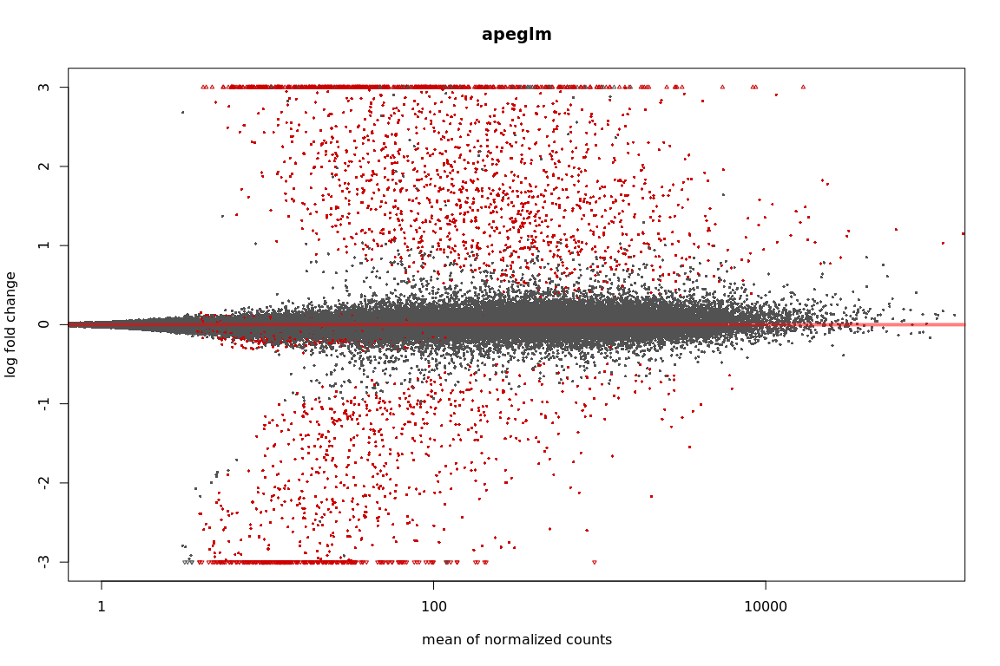

``` r
plotMA(resNormH898, xlim=xlim, ylim=ylim, main="normal")
```

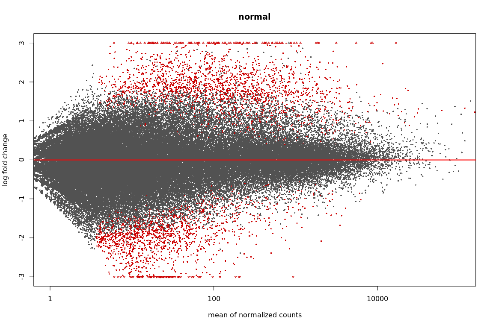

``` r
plotMA(resAshH898, xlim=xlim, ylim=ylim, main="ashr")
```

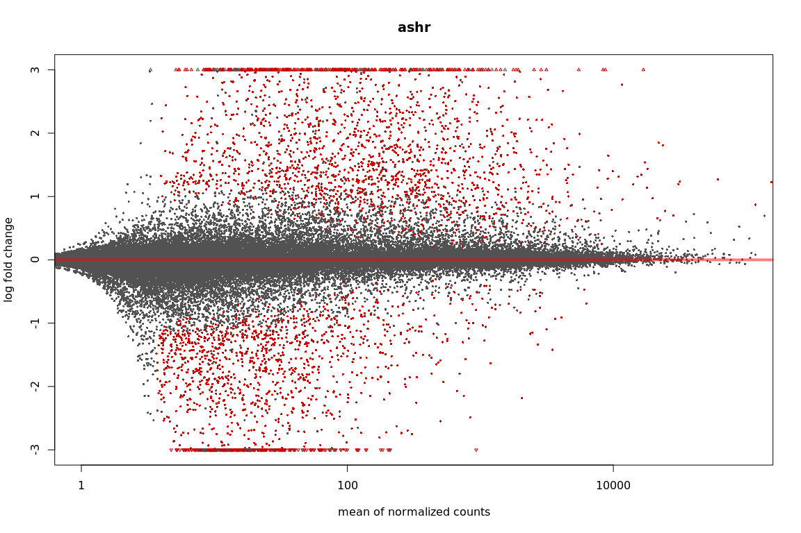

``` r
#plot counts
plotCounts(ddsH898, gene=which.min(resH898$padj), intgroup="condition")
```

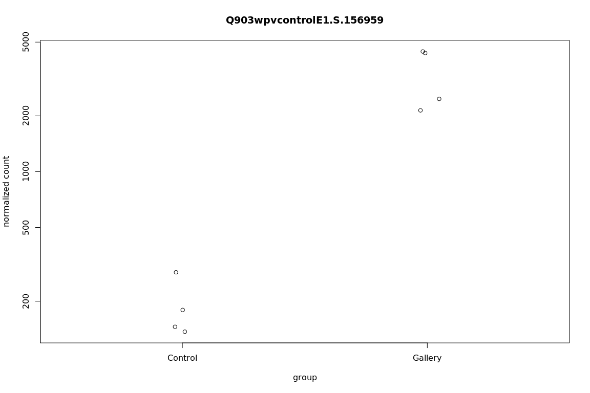

``` r
setwd("/projects/btl/kgagalova/PHD_projects2/SpruceUp/DifferentialExpression/data/Weevil")
write.csv(as.data.frame(resOrderedH898), file="H898_controlVSgalleryAll.csv")

##########Check values with foldchange 1.5 and p-value 0.05
#lfcThreshold is 1.5 fold change
#resH898log2_1.5 <- results(ddsH898,altHypothesis="greaterAbs",lfcThreshold=0.58,alpha=0.05)
#summary(resH898log2_1.5)
#write.csv(as.data.frame(resOrderedH898), file="H898_controlVSgalleryLog15.csv")
```

Q903
====

Import counts
-------------

``` r
samplesQ903 <- read.table("/projects/btl/kgagalova/PHD_projects2/SpruceUp/DifferentialExpression/data/Weevil/samplesQ903.txt", header = FALSE)

dir="/projects/spruceup_scratch/dev/SprucePaper2018/H898vsQ903sitka/DE/Salmon/Weevil/Q903/quants/all_samples"
allFiles <- list.files( path = dir, pattern = "quant.genesAll*", full.names = TRUE )
names(allFiles) = samplesQ903$V1

txi.salmon <- tximport(allFiles, type = "salmon",tx2gene = NULL, txOut=TRUE)
head(txi.salmon$counts) 
```

    ##                           Q903C1   Q903C2  Q903C3   Q903C4   Q903G1
    ## H898sccortE1.L.32095     24.6290  20.6200 18.5598  11.4972  25.4518
    ## H898wpvwound01.U.2100708 87.0342 249.8660 50.4677 144.3660 463.3930
    ## H898wpvwound01.U.2007951  0.0000   0.0000  8.0000   0.0000   8.0000
    ## H898wpvwound01.U.1918887 13.0000  12.9253  1.0000  13.0000   0.0000
    ## H898wpvwound01.U.1499000  0.0000   0.0000  2.0000   2.0000   0.0000
    ## H898wpvwound01.U.1475441  3.0000   9.0000  1.0000   0.0000   7.0000
    ##                           Q903G2    Q903G3    Q903G4
    ## H898sccortE1.L.32095     56.2344   9.13436  14.88660
    ## H898wpvwound01.U.2100708 80.1058 193.27800 264.72300
    ## H898wpvwound01.U.2007951  0.0000   0.00000   8.17682
    ## H898wpvwound01.U.1918887  2.0000   0.00000   0.00000
    ## H898wpvwound01.U.1499000 29.4929   0.00000   0.00000
    ## H898wpvwound01.U.1475441  0.0000   0.00000   3.00000

``` r
sampleTable <- data.frame(condition = samplesQ903$V2)
rownames(sampleTable) <- colnames(txi.salmon$counts)
ddsTxiQ903 <- DESeqDataSetFromTximport(txi.salmon,
                                   colData = sampleTable,
                                   design = ~ condition)
ddsQ903 <- DESeq(ddsTxiQ903)
resQ903 <- results(ddsQ903)
resultsNames(ddsQ903)
```

    ## [1] "Intercept"                    "condition_Gallery_vs_Control"

``` r
#check order condistions, Control should be the base
ddsQ903$condition
```

    ## [1] Control Control Control Control Gallery Gallery Gallery Gallery
    ## Levels: Control Gallery

``` r
resQ903
```

    ## log2 fold change (MLE): condition Gallery vs Control 
    ## Wald test p-value: condition Gallery vs Control 
    ## DataFrame with 138261 rows and 6 columns
    ##                            baseMean log2FoldChange     lfcSE       stat
    ##                           <numeric>      <numeric> <numeric>  <numeric>
    ## H898sccortE1.L.32095      22.368281      0.8091255 0.6354923  1.2732263
    ## H898wpvwound01.U.2100708 207.292236      1.4646228 0.7210988  2.0310986
    ## H898wpvwound01.U.2007951   3.500246      1.1841702 2.6984536  0.4388329
    ## H898wpvwound01.U.1918887   4.198381     -3.8310053 1.5347861 -2.4961167
    ## H898wpvwound01.U.1499000   3.870754      2.9310718 2.6919811  1.0888159
    ## ...                             ...            ...       ...        ...
    ## H898wpvwoundE0.L.280845    3.313373      0.8158546  1.783544  0.4574346
    ## H898wpvcontrolE1.L.54838   7.754487      1.3786005  1.135773  1.2137997
    ## H898wpvwoundE1.L.57319    10.135538      1.6884242  1.424582  1.1852071
    ## H898wpvcontrolE1.L.55107  14.820714     -0.4338028  0.888402 -0.4882956
    ## H898wpvcontrolE1.L.55617  14.671458     -1.4550202  1.000105 -1.4548671
    ##                              pvalue       padj
    ##                           <numeric>  <numeric>
    ## H898sccortE1.L.32095     0.20293776 0.36242385
    ## H898wpvwound01.U.2100708 0.04224499 0.12249950
    ## H898wpvwound01.U.2007951 0.66078263 0.78553218
    ## H898wpvwound01.U.1918887 0.01255613 0.04945982
    ## H898wpvwound01.U.1499000         NA         NA
    ## ...                             ...        ...
    ## H898wpvwoundE0.L.280845   0.6473587  0.7760006
    ## H898wpvcontrolE1.L.54838  0.2248242  0.3883172
    ## H898wpvwoundE1.L.57319    0.2359356  0.4011188
    ## H898wpvcontrolE1.L.55107  0.6253404  0.7593401
    ## H898wpvcontrolE1.L.55617  0.1457061  0.2914661

``` r
resLFCQ903 <- lfcShrink(ddsQ903, coef="condition_Gallery_vs_Control", type="apeglm")
resLFCQ903
```

    ## log2 fold change (MAP): condition Gallery vs Control 
    ## Wald test p-value: condition Gallery vs Control 
    ## DataFrame with 138261 rows and 5 columns
    ##                            baseMean log2FoldChange     lfcSE     pvalue
    ##                           <numeric>      <numeric> <numeric>  <numeric>
    ## H898sccortE1.L.32095      22.368281      0.6103367 0.5732616 0.20293776
    ## H898wpvwound01.U.2100708 207.292236      1.1184953 0.6985224 0.04224499
    ## H898wpvwound01.U.2007951   3.500246      0.1461114 0.9732868 0.66078263
    ## H898wpvwound01.U.1918887   4.198381     -2.5310364 1.7260327 0.01255613
    ## H898wpvwound01.U.1499000   3.870754      0.3289423 1.0535682         NA
    ## ...                             ...            ...       ...        ...
    ## H898wpvwoundE0.L.280845    3.313373      0.2039496 0.9088982  0.6473587
    ## H898wpvcontrolE1.L.54838   7.754487      0.6847665 0.8955827  0.2248242
    ## H898wpvwoundE1.L.57319    10.135538      0.6301117 1.0032994  0.2359356
    ## H898wpvcontrolE1.L.55107  14.820714     -0.2479274 0.6828240  0.6253404
    ## H898wpvcontrolE1.L.55617  14.671458     -0.8404305 0.8697581  0.1457061
    ##                                padj
    ##                           <numeric>
    ## H898sccortE1.L.32095     0.36242385
    ## H898wpvwound01.U.2100708 0.12249950
    ## H898wpvwound01.U.2007951 0.78553218
    ## H898wpvwound01.U.1918887 0.04945982
    ## H898wpvwound01.U.1499000         NA
    ## ...                             ...
    ## H898wpvwoundE0.L.280845   0.7760006
    ## H898wpvcontrolE1.L.54838  0.3883172
    ## H898wpvwoundE1.L.57319    0.4011188
    ## H898wpvcontrolE1.L.55107  0.7593401
    ## H898wpvcontrolE1.L.55617  0.2914661

``` r
#order by p-values
resOrderedQ903 <- resQ903[order(resQ903$pvalue),]
summary(resQ903)
```

    ## 
    ## out of 130550 with nonzero total read count
    ## adjusted p-value < 0.1
    ## LFC > 0 (up)     : 17770, 14% 
    ## LFC < 0 (down)   : 9906, 7.6% 
    ## outliers [1]     : 3767, 2.9% 
    ## low counts [2]   : 40371, 31% 
    ## (mean count < 2)
    ## [1] see 'cooksCutoff' argument of ?results
    ## [2] see 'independentFiltering' argument of ?results

``` r
sum(resQ903$padj < 0.1, na.rm=TRUE)
```

    ## [1] 27676

``` r
#show the differentially expressed
resQ903_05 <- results(ddsQ903, alpha=0.05)
summary(resQ903_05)
```

    ## 
    ## out of 130550 with nonzero total read count
    ## adjusted p-value < 0.05
    ## LFC > 0 (up)     : 14382, 11% 
    ## LFC < 0 (down)   : 7844, 6% 
    ## outliers [1]     : 3767, 2.9% 
    ## low counts [2]   : 45418, 35% 
    ## (mean count < 2)
    ## [1] see 'cooksCutoff' argument of ?results
    ## [2] see 'independentFiltering' argument of ?results

``` r
sum(resQ903_05$padj < 0.05, na.rm=TRUE)
```

    ## [1] 22226

``` r
#plots
plotMA(resQ903_05, ylim=c(-2,2))
```

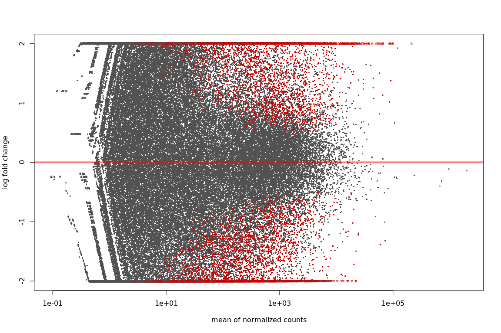

``` r
plotMA(resLFCQ903, ylim=c(-2,2))
```

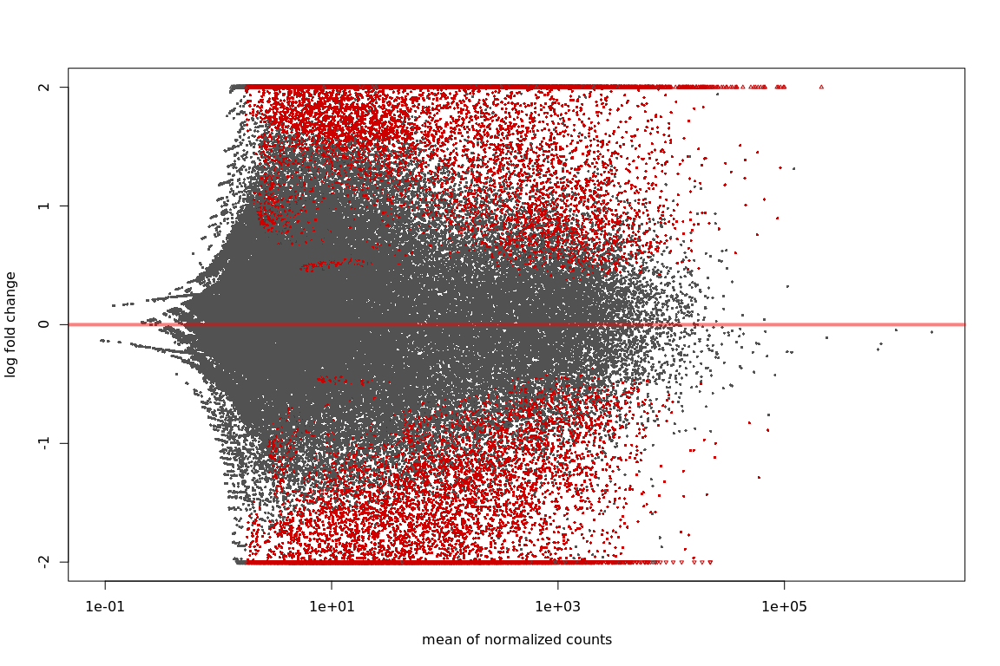

``` r
# because we are interested in treated vs untreated, we set 'coef=2'
resNormQ903 <- lfcShrink(ddsQ903, coef=2, type="normal")
resAshQ903 <- lfcShrink(ddsQ903, coef=2, type="ashr")
```

    ## Squarem-1
    ## Objective fn: 140097
    ## Objective fn: 94224.6  Extrapolation: 0  Steplength: 1
    ## Objective fn: 57695.4  Extrapolation: 1  Steplength: 4
    ## Objective fn: 55359.5  Extrapolation: 1  Steplength: 3.82052
    ## Objective fn: 55084.4  Extrapolation: 0  Steplength: 1
    ## Objective fn: 54938.7  Extrapolation: 1  Steplength: 16
    ## Objective fn: 54102.5  Extrapolation: 1  Steplength: 2.22996
    ## Objective fn: 54075.8  Extrapolation: 1  Steplength: 4.39439
    ## Objective fn: 54064.2  Extrapolation: 1  Steplength: 4.95171
    ## Objective fn: 54045.8  Extrapolation: 1  Steplength: 3.17804
    ## Objective fn: 54043.7  Extrapolation: 0  Steplength: 1
    ## Objective fn: 54041.9  Extrapolation: 0  Steplength: 1
    ## Objective fn: 54040.3  Extrapolation: 0  Steplength: 1
    ## Objective fn: 54021  Extrapolation: 1  Steplength: 53.4352
    ## Objective fn: 53991.8  Extrapolation: 1  Steplength: 4.65173
    ## Objective fn: 53981.1  Extrapolation: 1  Steplength: 4.67212
    ## Objective fn: 53979  Extrapolation: 0  Steplength: 1
    ## Objective fn: 53977.8  Extrapolation: 0  Steplength: 1
    ## Objective fn: 53976.8  Extrapolation: 0  Steplength: 1
    ## Objective fn: 53976  Extrapolation: 0  Steplength: 1
    ## Objective fn: 53965.1  Extrapolation: 1  Steplength: 16
    ## Objective fn: 53963.7  Extrapolation: 0  Steplength: 1
    ## Objective fn: 53962.6  Extrapolation: 0  Steplength: 1
    ## Objective fn: 53961.7  Extrapolation: 0  Steplength: 1
    ## Objective fn: 53950.1  Extrapolation: 1  Steplength: 16
    ## Objective fn: 53948.5  Extrapolation: 0  Steplength: 1
    ## Objective fn: 53947.4  Extrapolation: 0  Steplength: 1
    ## Objective fn: 53946.4  Extrapolation: 0  Steplength: 1
    ## Objective fn: 53934.3  Extrapolation: 1  Steplength: 16
    ## Objective fn: 53932.6  Extrapolation: 0  Steplength: 1
    ## Objective fn: 53931.4  Extrapolation: 0  Steplength: 1
    ## Objective fn: 53930.4  Extrapolation: 0  Steplength: 1
    ## Objective fn: 53918.2  Extrapolation: 1  Steplength: 16
    ## Objective fn: 53916.3  Extrapolation: 0  Steplength: 1
    ## Objective fn: 53915.1  Extrapolation: 0  Steplength: 1
    ## Objective fn: 53914  Extrapolation: 0  Steplength: 1
    ## Objective fn: 53902.1  Extrapolation: 1  Steplength: 16
    ## Objective fn: 53903.1  Extrapolation: 1  Steplength: 10.4512
    ## Objective fn: 53888.2  Extrapolation: 1  Steplength: 3.37258
    ## Objective fn: 53887.1  Extrapolation: 0  Steplength: 1
    ## Objective fn: 53886.1  Extrapolation: 0  Steplength: 1
    ## Objective fn: 53874.3  Extrapolation: 1  Steplength: 16
    ## Objective fn: 53872.7  Extrapolation: 0  Steplength: 1
    ## Objective fn: 53871.5  Extrapolation: 0  Steplength: 1
    ## Objective fn: 53870.5  Extrapolation: 0  Steplength: 1
    ## Objective fn: 53859.6  Extrapolation: 1  Steplength: 16
    ## Objective fn: 53857.9  Extrapolation: 0  Steplength: 1
    ## Objective fn: 53856.7  Extrapolation: 0  Steplength: 1
    ## Objective fn: 53855.8  Extrapolation: 0  Steplength: 1
    ## Objective fn: 53845.8  Extrapolation: 1  Steplength: 16
    ## Objective fn: 53844  Extrapolation: 0  Steplength: 1
    ## Objective fn: 53842.8  Extrapolation: 0  Steplength: 1
    ## Objective fn: 53841.9  Extrapolation: 0  Steplength: 1
    ## Objective fn: 53833  Extrapolation: 1  Steplength: 16
    ## Objective fn: 53831  Extrapolation: 0  Steplength: 1
    ## Objective fn: 53829.9  Extrapolation: 0  Steplength: 1
    ## Objective fn: 53829  Extrapolation: 0  Steplength: 1
    ## Objective fn: 53828.2  Extrapolation: 0  Steplength: 1
    ## Objective fn: 53819.2  Extrapolation: 1  Steplength: 16
    ## Objective fn: 53818  Extrapolation: 0  Steplength: 1
    ## Objective fn: 53817.1  Extrapolation: 0  Steplength: 1
    ## Objective fn: 53816.4  Extrapolation: 0  Steplength: 1
    ## Objective fn: 53808.4  Extrapolation: 1  Steplength: 16
    ## Objective fn: 53807.1  Extrapolation: 0  Steplength: 1
    ## Objective fn: 53806.2  Extrapolation: 0  Steplength: 1
    ## Objective fn: 53805.5  Extrapolation: 0  Steplength: 1
    ## Objective fn: 53798.5  Extrapolation: 1  Steplength: 16
    ## Objective fn: 53797.1  Extrapolation: 0  Steplength: 1
    ## Objective fn: 53796.3  Extrapolation: 0  Steplength: 1
    ## Objective fn: 53795.6  Extrapolation: 0  Steplength: 1
    ## Objective fn: 53795  Extrapolation: 0  Steplength: 1
    ## Objective fn: 53788.1  Extrapolation: 1  Steplength: 16
    ## Objective fn: 53787.2  Extrapolation: 0  Steplength: 1
    ## Objective fn: 53786.5  Extrapolation: 0  Steplength: 1
    ## Objective fn: 53786  Extrapolation: 0  Steplength: 1
    ## Objective fn: 53779.9  Extrapolation: 1  Steplength: 16
    ## Objective fn: 53778.9  Extrapolation: 0  Steplength: 1
    ## Objective fn: 53778.3  Extrapolation: 0  Steplength: 1
    ## Objective fn: 53777.8  Extrapolation: 0  Steplength: 1
    ## Objective fn: 53772.4  Extrapolation: 1  Steplength: 16
    ## Objective fn: 53771.4  Extrapolation: 0  Steplength: 1
    ## Objective fn: 53770.8  Extrapolation: 0  Steplength: 1
    ## Objective fn: 53770.2  Extrapolation: 0  Steplength: 1
    ## Objective fn: 53769.8  Extrapolation: 0  Steplength: 1
    ## Objective fn: 53764.6  Extrapolation: 1  Steplength: 16
    ## Objective fn: 53763.9  Extrapolation: 0  Steplength: 1
    ## Objective fn: 53763.4  Extrapolation: 0  Steplength: 1
    ## Objective fn: 53763  Extrapolation: 0  Steplength: 1
    ## Objective fn: 53758.4  Extrapolation: 1  Steplength: 16
    ## Objective fn: 53757.6  Extrapolation: 0  Steplength: 1
    ## Objective fn: 53757.1  Extrapolation: 0  Steplength: 1
    ## Objective fn: 53756.7  Extrapolation: 0  Steplength: 1
    ## Objective fn: 53756.4  Extrapolation: 0  Steplength: 1
    ## Objective fn: 53751.9  Extrapolation: 1  Steplength: 16
    ## Objective fn: 53751.4  Extrapolation: 0  Steplength: 1
    ## Objective fn: 53751  Extrapolation: 0  Steplength: 1
    ## Objective fn: 53750.7  Extrapolation: 0  Steplength: 1
    ## Objective fn: 53746.7  Extrapolation: 1  Steplength: 16
    ## Objective fn: 53746.2  Extrapolation: 0  Steplength: 1
    ## Objective fn: 53745.8  Extrapolation: 0  Steplength: 1
    ## Objective fn: 53745.5  Extrapolation: 0  Steplength: 1
    ## Objective fn: 53742  Extrapolation: 1  Steplength: 16
    ## Objective fn: 53742.7  Extrapolation: 1  Steplength: 12.0878
    ## Objective fn: 53737.6  Extrapolation: 1  Steplength: 3.60081
    ## Objective fn: 53737.3  Extrapolation: 0  Steplength: 1
    ## Objective fn: 53734.5  Extrapolation: 1  Steplength: 16
    ## Objective fn: 53733.9  Extrapolation: 0  Steplength: 1
    ## Objective fn: 53733.5  Extrapolation: 0  Steplength: 1
    ## Objective fn: 53733.2  Extrapolation: 0  Steplength: 1
    ## Objective fn: 53730.7  Extrapolation: 1  Steplength: 16
    ## Objective fn: 53730.1  Extrapolation: 0  Steplength: 1
    ## Objective fn: 53729.6  Extrapolation: 0  Steplength: 1
    ## Objective fn: 53729.3  Extrapolation: 0  Steplength: 1
    ## Objective fn: 53729.1  Extrapolation: 0  Steplength: 1
    ## Objective fn: 53726.6  Extrapolation: 1  Steplength: 16
    ## Objective fn: 53726.1  Extrapolation: 0  Steplength: 1
    ## Objective fn: 53725.8  Extrapolation: 0  Steplength: 1
    ## Objective fn: 53725.5  Extrapolation: 0  Steplength: 1
    ## Objective fn: 53723.3  Extrapolation: 1  Steplength: 16
    ## Objective fn: 53722.8  Extrapolation: 0  Steplength: 1
    ## Objective fn: 53722.5  Extrapolation: 0  Steplength: 1
    ## Objective fn: 53722.3  Extrapolation: 0  Steplength: 1
    ## Objective fn: 53720.4  Extrapolation: 1  Steplength: 16
    ## Objective fn: 53719.8  Extrapolation: 0  Steplength: 1
    ## Objective fn: 53719.5  Extrapolation: 0  Steplength: 1
    ## Objective fn: 53719.2  Extrapolation: 0  Steplength: 1
    ## Objective fn: 53719  Extrapolation: 0  Steplength: 1
    ## Objective fn: 53717  Extrapolation: 1  Steplength: 16
    ## Objective fn: 53716.6  Extrapolation: 0  Steplength: 1
    ## Objective fn: 53716.4  Extrapolation: 0  Steplength: 1
    ## Objective fn: 53716.2  Extrapolation: 0  Steplength: 1
    ## Objective fn: 53714.4  Extrapolation: 1  Steplength: 16
    ## Objective fn: 53714  Extrapolation: 0  Steplength: 1
    ## Objective fn: 53713.7  Extrapolation: 0  Steplength: 1
    ## Objective fn: 53713.5  Extrapolation: 0  Steplength: 1
    ## Objective fn: 53712  Extrapolation: 1  Steplength: 16
    ## Objective fn: 53711.6  Extrapolation: 0  Steplength: 1
    ## Objective fn: 53711.3  Extrapolation: 0  Steplength: 1
    ## Objective fn: 53711.1  Extrapolation: 0  Steplength: 1
    ## Objective fn: 53710.9  Extrapolation: 0  Steplength: 1
    ## Objective fn: 53709.3  Extrapolation: 1  Steplength: 16
    ## Objective fn: 53709  Extrapolation: 0  Steplength: 1
    ## Objective fn: 53708.8  Extrapolation: 0  Steplength: 1
    ## Objective fn: 53708.6  Extrapolation: 0  Steplength: 1
    ## Objective fn: 53707.2  Extrapolation: 1  Steplength: 16
    ## Objective fn: 53706.8  Extrapolation: 0  Steplength: 1
    ## Objective fn: 53706.6  Extrapolation: 0  Steplength: 1
    ## Objective fn: 53706.4  Extrapolation: 0  Steplength: 1
    ## Objective fn: 53706.3  Extrapolation: 0  Steplength: 1
    ## Objective fn: 53704.8  Extrapolation: 1  Steplength: 16
    ## Objective fn: 53704.6  Extrapolation: 0  Steplength: 1
    ## Objective fn: 53704.4  Extrapolation: 0  Steplength: 1
    ## Objective fn: 53704.3  Extrapolation: 0  Steplength: 1
    ## Objective fn: 53703  Extrapolation: 1  Steplength: 16
    ## Objective fn: 53702.7  Extrapolation: 0  Steplength: 1
    ## Objective fn: 53702.5  Extrapolation: 0  Steplength: 1
    ## Objective fn: 53702.4  Extrapolation: 0  Steplength: 1
    ## Objective fn: 53701.3  Extrapolation: 1  Steplength: 16
    ## Objective fn: 53701  Extrapolation: 0  Steplength: 1
    ## Objective fn: 53700.8  Extrapolation: 0  Steplength: 1
    ## Objective fn: 53700.6  Extrapolation: 0  Steplength: 1
    ## Objective fn: 53700.5  Extrapolation: 0  Steplength: 1
    ## Objective fn: 53699.3  Extrapolation: 1  Steplength: 16
    ## Objective fn: 53699.1  Extrapolation: 0  Steplength: 1
    ## Objective fn: 53698.9  Extrapolation: 0  Steplength: 1
    ## Objective fn: 53698.8  Extrapolation: 0  Steplength: 1
    ## Objective fn: 53697.8  Extrapolation: 1  Steplength: 16
    ## Objective fn: 53697.5  Extrapolation: 0  Steplength: 1
    ## Objective fn: 53697.4  Extrapolation: 0  Steplength: 1
    ## Objective fn: 53697.3  Extrapolation: 0  Steplength: 1
    ## Objective fn: 53696.3  Extrapolation: 1  Steplength: 16
    ## Objective fn: 53696.9  Extrapolation: 1  Steplength: 12.0065
    ## Objective fn: 53694.8  Extrapolation: 1  Steplength: 4.23069
    ## Objective fn: 53694.7  Extrapolation: 0  Steplength: 1
    ## Objective fn: 53693.9  Extrapolation: 1  Steplength: 16
    ## Objective fn: 53694.8  Extrapolation: 1  Steplength: 11.7402
    ## Objective fn: 53692.5  Extrapolation: 1  Steplength: 4.17578
    ## Objective fn: 53692.4  Extrapolation: 0  Steplength: 1
    ## Objective fn: 53692.3  Extrapolation: 0  Steplength: 1
    ## Objective fn: 53691.5  Extrapolation: 1  Steplength: 16
    ## Objective fn: 53691.3  Extrapolation: 0  Steplength: 1
    ## Objective fn: 53691.2  Extrapolation: 0  Steplength: 1
    ## Objective fn: 53691.1  Extrapolation: 0  Steplength: 1
    ## Objective fn: 53690.4  Extrapolation: 1  Steplength: 16
    ## Objective fn: 53690.2  Extrapolation: 0  Steplength: 1
    ## Objective fn: 53690  Extrapolation: 0  Steplength: 1
    ## Objective fn: 53689.9  Extrapolation: 0  Steplength: 1
    ## Objective fn: 53689.4  Extrapolation: 1  Steplength: 16
    ## Objective fn: 53689.1  Extrapolation: 0  Steplength: 1
    ## Objective fn: 53689  Extrapolation: 0  Steplength: 1
    ## Objective fn: 53688.8  Extrapolation: 0  Steplength: 1
    ## Objective fn: 53688.8  Extrapolation: 0  Steplength: 1
    ## Objective fn: 53688.1  Extrapolation: 1  Steplength: 16
    ## Objective fn: 53687.9  Extrapolation: 0  Steplength: 1
    ## Objective fn: 53687.8  Extrapolation: 0  Steplength: 1
    ## Objective fn: 53687.7  Extrapolation: 0  Steplength: 1
    ## Objective fn: 53687.2  Extrapolation: 1  Steplength: 16
    ## Objective fn: 53687  Extrapolation: 0  Steplength: 1
    ## Objective fn: 53686.9  Extrapolation: 0  Steplength: 1
    ## Objective fn: 53686.8  Extrapolation: 0  Steplength: 1
    ## Objective fn: 53686.3  Extrapolation: 1  Steplength: 16
    ## Objective fn: 53686.9  Extrapolation: 1  Steplength: 11.6145
    ## Objective fn: 53685.3  Extrapolation: 1  Steplength: 4.29452
    ## Objective fn: 53685.2  Extrapolation: 0  Steplength: 1
    ## Objective fn: 53685.1  Extrapolation: 0  Steplength: 1
    ## Objective fn: 53684.6  Extrapolation: 1  Steplength: 16
    ## Objective fn: 53684.4  Extrapolation: 0  Steplength: 1
    ## Objective fn: 53684.3  Extrapolation: 0  Steplength: 1
    ## Objective fn: 53684.3  Extrapolation: 0  Steplength: 1
    ## Objective fn: 53683.8  Extrapolation: 1  Steplength: 16
    ## Objective fn: 53683.7  Extrapolation: 0  Steplength: 1
    ## Objective fn: 53683.6  Extrapolation: 0  Steplength: 1
    ## Objective fn: 53683.5  Extrapolation: 0  Steplength: 1
    ## Objective fn: 53683.1  Extrapolation: 1  Steplength: 16
    ## Objective fn: 53683.6  Extrapolation: 1  Steplength: 12.0651
    ## Objective fn: 53682.2  Extrapolation: 1  Steplength: 4.29993
    ## Objective fn: 53682.2  Extrapolation: 0  Steplength: 1
    ## Objective fn: 53682.1  Extrapolation: 0  Steplength: 1
    ## Objective fn: 53681.7  Extrapolation: 1  Steplength: 16
    ## Objective fn: 53681.5  Extrapolation: 0  Steplength: 1
    ## Objective fn: 53681.5  Extrapolation: 0  Steplength: 1
    ## Objective fn: 53681.4  Extrapolation: 0  Steplength: 1
    ## Objective fn: 53681  Extrapolation: 1  Steplength: 16
    ## Objective fn: 53680.9  Extrapolation: 0  Steplength: 1
    ## Objective fn: 53680.8  Extrapolation: 0  Steplength: 1
    ## Objective fn: 53680.8  Extrapolation: 0  Steplength: 1
    ## Objective fn: 53680.4  Extrapolation: 1  Steplength: 16
    ## Objective fn: 53680.9  Extrapolation: 1  Steplength: 12.7484
    ## Objective fn: 53679.7  Extrapolation: 1  Steplength: 4.24621
    ## Objective fn: 53679.6  Extrapolation: 0  Steplength: 1
    ## Objective fn: 53679.3  Extrapolation: 1  Steplength: 16
    ## Objective fn: 53679.8  Extrapolation: 1  Steplength: 12.6125
    ## Objective fn: 53678.7  Extrapolation: 1  Steplength: 4.27895
    ## Objective fn: 53678.6  Extrapolation: 0  Steplength: 1
    ## Objective fn: 53678.6  Extrapolation: 0  Steplength: 1
    ## Objective fn: 53678.2  Extrapolation: 1  Steplength: 16
    ## Objective fn: 53678.2  Extrapolation: 0  Steplength: 1
    ## Objective fn: 53678.1  Extrapolation: 0  Steplength: 1
    ## Objective fn: 53678.1  Extrapolation: 0  Steplength: 1
    ## Objective fn: 53677.7  Extrapolation: 1  Steplength: 16
    ## Objective fn: 53677.7  Extrapolation: 0  Steplength: 1
    ## Objective fn: 53677.6  Extrapolation: 0  Steplength: 1
    ## Objective fn: 53677.6  Extrapolation: 0  Steplength: 1
    ## Objective fn: 53677.3  Extrapolation: 1  Steplength: 16
    ## Objective fn: 53677.8  Extrapolation: 1  Steplength: 14.2387
    ## Objective fn: 53676.7  Extrapolation: 1  Steplength: 4.0957
    ## Objective fn: 53676.7  Extrapolation: 0  Steplength: 1
    ## Objective fn: 53676.4  Extrapolation: 1  Steplength: 16
    ## Objective fn: 53676.3  Extrapolation: 0  Steplength: 1
    ## Objective fn: 53676.3  Extrapolation: 0  Steplength: 1
    ## Objective fn: 53676.2  Extrapolation: 0  Steplength: 1
    ## Objective fn: 53676  Extrapolation: 1  Steplength: 16
    ## Objective fn: 53676.5  Extrapolation: 1  Steplength: 13.3152
    ## Objective fn: 53675.5  Extrapolation: 1  Steplength: 4.08993
    ## Objective fn: 53675.5  Extrapolation: 0  Steplength: 1
    ## Objective fn: 53675.2  Extrapolation: 1  Steplength: 16
    ## Objective fn: 53675.2  Extrapolation: 0  Steplength: 1
    ## Objective fn: 53675.1  Extrapolation: 0  Steplength: 1
    ## Objective fn: 53675.1  Extrapolation: 0  Steplength: 1
    ## Objective fn: 53674.9  Extrapolation: 1  Steplength: 16
    ## Objective fn: 53675.3  Extrapolation: 1  Steplength: 13.6577
    ## Objective fn: 53674.4  Extrapolation: 1  Steplength: 4.03318
    ## Objective fn: 53674.4  Extrapolation: 0  Steplength: 1
    ## Objective fn: 53674.2  Extrapolation: 1  Steplength: 16
    ## Objective fn: 53674.1  Extrapolation: 0  Steplength: 1
    ## Objective fn: 53674.1  Extrapolation: 0  Steplength: 1
    ## Objective fn: 53674.1  Extrapolation: 0  Steplength: 1
    ## Objective fn: 53673.9  Extrapolation: 1  Steplength: 16
    ## Objective fn: 53674.7  Extrapolation: 1  Steplength: 16.2096
    ## Objective fn: 53673.4  Extrapolation: 1  Steplength: 3.73914
    ## Objective fn: 53673.4  Extrapolation: 0  Steplength: 1
    ## Objective fn: 53673.3  Extrapolation: 1  Steplength: 16
    ## Objective fn: 53673.2  Extrapolation: 0  Steplength: 1
    ## Objective fn: 53673.1  Extrapolation: 0  Steplength: 1
    ## Objective fn: 53673.1  Extrapolation: 0  Steplength: 1
    ## Objective fn: 53673  Extrapolation: 1  Steplength: 16
    ## Objective fn: 53672.9  Extrapolation: 0  Steplength: 1
    ## Objective fn: 53672.9  Extrapolation: 0  Steplength: 1
    ## Objective fn: 53672.8  Extrapolation: 0  Steplength: 1
    ## Objective fn: 53672.8  Extrapolation: 1  Steplength: 16
    ## Objective fn: 53672.6  Extrapolation: 0  Steplength: 1
    ## Objective fn: 53672.6  Extrapolation: 0  Steplength: 1
    ## Objective fn: 53672.5  Extrapolation: 0  Steplength: 1
    ## Objective fn: 53672.5  Extrapolation: 1  Steplength: 16
    ## Objective fn: 53673.1  Extrapolation: 1  Steplength: 12.3593
    ## Objective fn: 53672.1  Extrapolation: 1  Steplength: 3.75724
    ## Objective fn: 53672  Extrapolation: 0  Steplength: 1
    ## Objective fn: 53671.9  Extrapolation: 1  Steplength: 16
    ## Objective fn: 53671.9  Extrapolation: 0  Steplength: 1
    ## Objective fn: 53671.8  Extrapolation: 0  Steplength: 1
    ## Objective fn: 53671.8  Extrapolation: 1  Steplength: 16
    ## Objective fn: 53671.7  Extrapolation: 0  Steplength: 1
    ## Objective fn: 53671.6  Extrapolation: 0  Steplength: 1
    ## Objective fn: 53671.6  Extrapolation: 0  Steplength: 1
    ## Objective fn: 53671.5  Extrapolation: 0  Steplength: 1
    ## Objective fn: 53671.5  Extrapolation: 1  Steplength: 16
    ## Objective fn: 53671.4  Extrapolation: 0  Steplength: 1
    ## Objective fn: 53671.3  Extrapolation: 0  Steplength: 1
    ## Objective fn: 53671.3  Extrapolation: 0  Steplength: 1
    ## Objective fn: 53671.3  Extrapolation: 1  Steplength: 16
    ## Objective fn: 53671.2  Extrapolation: 0  Steplength: 1
    ## Objective fn: 53671.1  Extrapolation: 0  Steplength: 1
    ## Objective fn: 53671.1  Extrapolation: 0  Steplength: 1
    ## Objective fn: 53671.1  Extrapolation: 0  Steplength: 1
    ## Objective fn: 53671  Extrapolation: 1  Steplength: 16
    ## Objective fn: 53670.9  Extrapolation: 0  Steplength: 1
    ## Objective fn: 53670.9  Extrapolation: 0  Steplength: 1
    ## Objective fn: 53670.8  Extrapolation: 0  Steplength: 1
    ## Objective fn: 53670.8  Extrapolation: 1  Steplength: 16
    ## Objective fn: 53670.7  Extrapolation: 0  Steplength: 1
    ## Objective fn: 53670.7  Extrapolation: 0  Steplength: 1
    ## Objective fn: 53670.6  Extrapolation: 0  Steplength: 1
    ## Objective fn: 53670.6  Extrapolation: 1  Steplength: 16
    ## Objective fn: 53671.6  Extrapolation: 1  Steplength: 15.6561
    ## Objective fn: 53670.3  Extrapolation: 1  Steplength: 3.3819
    ## Objective fn: 53670.2  Extrapolation: 0  Steplength: 1
    ## Objective fn: 53670.2  Extrapolation: 0  Steplength: 1
    ## Objective fn: 53670.2  Extrapolation: 0  Steplength: 1
    ## Objective fn: 53670.1  Extrapolation: 1  Steplength: 16
    ## Objective fn: 53670  Extrapolation: 0  Steplength: 1
    ## Objective fn: 53670  Extrapolation: 0  Steplength: 1
    ## Objective fn: 53670  Extrapolation: 0  Steplength: 1
    ## Objective fn: 53669.9  Extrapolation: 1  Steplength: 16
    ## Objective fn: 53669.9  Extrapolation: 0  Steplength: 1
    ## Objective fn: 53669.8  Extrapolation: 0  Steplength: 1
    ## Objective fn: 53669.8  Extrapolation: 0  Steplength: 1
    ## Objective fn: 53669.7  Extrapolation: 1  Steplength: 16
    ## Objective fn: 53669.7  Extrapolation: 0  Steplength: 1
    ## Objective fn: 53669.7  Extrapolation: 0  Steplength: 1
    ## Objective fn: 53669.6  Extrapolation: 0  Steplength: 1
    ## Objective fn: 53669.6  Extrapolation: 0  Steplength: 1
    ## Objective fn: 53669.5  Extrapolation: 1  Steplength: 16
    ## Objective fn: 53669.5  Extrapolation: 0  Steplength: 1
    ## Objective fn: 53669.5  Extrapolation: 0  Steplength: 1
    ## Objective fn: 53669.5  Extrapolation: 0  Steplength: 1
    ## Objective fn: 53669.4  Extrapolation: 1  Steplength: 16
    ## Objective fn: 53669.3  Extrapolation: 0  Steplength: 1
    ## Objective fn: 53669.3  Extrapolation: 0  Steplength: 1
    ## Objective fn: 53669.3  Extrapolation: 0  Steplength: 1
    ## Objective fn: 53669.2  Extrapolation: 1  Steplength: 16
    ## Objective fn: 53669.2  Extrapolation: 0  Steplength: 1
    ## Objective fn: 53669.1  Extrapolation: 0  Steplength: 1
    ## Objective fn: 53669.1  Extrapolation: 0  Steplength: 1
    ## Objective fn: 53669.1  Extrapolation: 1  Steplength: 16
    ## Objective fn: 53669  Extrapolation: 0  Steplength: 1
    ## Objective fn: 53669  Extrapolation: 0  Steplength: 1
    ## Objective fn: 53669  Extrapolation: 0  Steplength: 1
    ## Objective fn: 53668.9  Extrapolation: 0  Steplength: 1
    ## Objective fn: 53668.9  Extrapolation: 1  Steplength: 16
    ## Objective fn: 53668.8  Extrapolation: 0  Steplength: 1
    ## Objective fn: 53668.8  Extrapolation: 0  Steplength: 1
    ## Objective fn: 53668.8  Extrapolation: 0  Steplength: 1
    ## Objective fn: 53668.7  Extrapolation: 1  Steplength: 16
    ## Objective fn: 53668.7  Extrapolation: 0  Steplength: 1
    ## Objective fn: 53668.7  Extrapolation: 0  Steplength: 1
    ## Objective fn: 53668.6  Extrapolation: 0  Steplength: 1
    ## Objective fn: 53668.6  Extrapolation: 1  Steplength: 16
    ## Objective fn: 53668.5  Extrapolation: 0  Steplength: 1
    ## Objective fn: 53668.5  Extrapolation: 0  Steplength: 1
    ## Objective fn: 53668.5  Extrapolation: 0  Steplength: 1
    ## Objective fn: 53668.5  Extrapolation: 1  Steplength: 16
    ## Objective fn: 53668.4  Extrapolation: 0  Steplength: 1
    ## Objective fn: 53668.4  Extrapolation: 0  Steplength: 1
    ## Objective fn: 53668.4  Extrapolation: 0  Steplength: 1
    ## Objective fn: 53668.3  Extrapolation: 0  Steplength: 1
    ## Objective fn: 53668.3  Extrapolation: 1  Steplength: 16
    ## Objective fn: 53668.2  Extrapolation: 0  Steplength: 1
    ## Objective fn: 53668.2  Extrapolation: 0  Steplength: 1
    ## Objective fn: 53668.2  Extrapolation: 0  Steplength: 1
    ## Objective fn: 53668.2  Extrapolation: 1  Steplength: 16
    ## Objective fn: 53668.1  Extrapolation: 0  Steplength: 1
    ## Objective fn: 53668.1  Extrapolation: 0  Steplength: 1
    ## Objective fn: 53668.1  Extrapolation: 0  Steplength: 1
    ## Objective fn: 53668  Extrapolation: 1  Steplength: 16
    ## Objective fn: 53668  Extrapolation: 0  Steplength: 1
    ## Objective fn: 53668  Extrapolation: 0  Steplength: 1
    ## Objective fn: 53667.9  Extrapolation: 0  Steplength: 1
    ## Objective fn: 53667.9  Extrapolation: 1  Steplength: 16
    ## Objective fn: 53667.9  Extrapolation: 0  Steplength: 1
    ## Objective fn: 53667.8  Extrapolation: 0  Steplength: 1
    ## Objective fn: 53667.8  Extrapolation: 0  Steplength: 1
    ## Objective fn: 53667.8  Extrapolation: 0  Steplength: 1
    ## Objective fn: 53667.8  Extrapolation: 1  Steplength: 16
    ## Objective fn: 53667.7  Extrapolation: 0  Steplength: 1
    ## Objective fn: 53667.7  Extrapolation: 0  Steplength: 1
    ## Objective fn: 53667.7  Extrapolation: 0  Steplength: 1
    ## Objective fn: 53667.6  Extrapolation: 1  Steplength: 16
    ## Objective fn: 53667.6  Extrapolation: 0  Steplength: 1
    ## Objective fn: 53667.6  Extrapolation: 0  Steplength: 1
    ## Objective fn: 53667.6  Extrapolation: 0  Steplength: 1
    ## Objective fn: 53667.5  Extrapolation: 1  Steplength: 16
    ## Objective fn: 53667.5  Extrapolation: 0  Steplength: 1
    ## Objective fn: 53667.5  Extrapolation: 0  Steplength: 1
    ## Objective fn: 53667.4  Extrapolation: 0  Steplength: 1
    ## Objective fn: 53667.4  Extrapolation: 1  Steplength: 16
    ## Objective fn: 53667.4  Extrapolation: 0  Steplength: 1
    ## Objective fn: 53667.3  Extrapolation: 0  Steplength: 1
    ## Objective fn: 53667.3  Extrapolation: 0  Steplength: 1
    ## Objective fn: 53667.4  Extrapolation: 1  Steplength: 16
    ## Objective fn: 53667.3  Extrapolation: 0  Steplength: 1
    ## Objective fn: 53667.2  Extrapolation: 0  Steplength: 1
    ## Objective fn: 53667.2  Extrapolation: 0  Steplength: 1
    ## Objective fn: 53667.2  Extrapolation: 0  Steplength: 1
    ## Objective fn: 53667.2  Extrapolation: 1  Steplength: 16
    ## Objective fn: 53667.1  Extrapolation: 0  Steplength: 1
    ## Objective fn: 53667.1  Extrapolation: 0  Steplength: 1
    ## Objective fn: 53667.1  Extrapolation: 0  Steplength: 1
    ## Objective fn: 53667.1  Extrapolation: 1  Steplength: 16
    ## Objective fn: 53667  Extrapolation: 0  Steplength: 1
    ## Objective fn: 53667  Extrapolation: 0  Steplength: 1
    ## Objective fn: 53667  Extrapolation: 0  Steplength: 1
    ## Objective fn: 53667  Extrapolation: 1  Steplength: 16
    ## Objective fn: 53667.9  Extrapolation: 1  Steplength: 16.1339
    ## Objective fn: 53666.8  Extrapolation: 1  Steplength: 3.20074
    ## Objective fn: 53666.8  Extrapolation: 0  Steplength: 1
    ## Objective fn: 53666.8  Extrapolation: 0  Steplength: 1
    ## Objective fn: 53666.7  Extrapolation: 0  Steplength: 1
    ## Objective fn: 53666.7  Extrapolation: 1  Steplength: 16
    ## Objective fn: 53666.7  Extrapolation: 0  Steplength: 1
    ## Objective fn: 53666.7  Extrapolation: 0  Steplength: 1
    ## Objective fn: 53666.6  Extrapolation: 0  Steplength: 1
    ## Objective fn: 53666.6  Extrapolation: 1  Steplength: 16
    ## Objective fn: 53666.6  Extrapolation: 0  Steplength: 1
    ## Objective fn: 53666.6  Extrapolation: 0  Steplength: 1
    ## Objective fn: 53666.5  Extrapolation: 0  Steplength: 1
    ## Objective fn: 53666.5  Extrapolation: 0  Steplength: 1
    ## Objective fn: 53666.5  Extrapolation: 1  Steplength: 16
    ## Objective fn: 53666.5  Extrapolation: 0  Steplength: 1
    ## Objective fn: 53666.5  Extrapolation: 0  Steplength: 1
    ## Objective fn: 53666.4  Extrapolation: 0  Steplength: 1
    ## Objective fn: 53666.4  Extrapolation: 1  Steplength: 16
    ## Objective fn: 53666.4  Extrapolation: 0  Steplength: 1
    ## Objective fn: 53666.4  Extrapolation: 0  Steplength: 1
    ## Objective fn: 53666.3  Extrapolation: 0  Steplength: 1
    ## Objective fn: 53666.3  Extrapolation: 1  Steplength: 16
    ## Objective fn: 53666.3  Extrapolation: 0  Steplength: 1
    ## Objective fn: 53666.3  Extrapolation: 0  Steplength: 1
    ## Objective fn: 53666.3  Extrapolation: 0  Steplength: 1
    ## Objective fn: 53666.2  Extrapolation: 1  Steplength: 16
    ## Objective fn: 53666.2  Extrapolation: 0  Steplength: 1
    ## Objective fn: 53666.2  Extrapolation: 0  Steplength: 1
    ## Objective fn: 53666.2  Extrapolation: 0  Steplength: 1
    ## Objective fn: 53666.2  Extrapolation: 0  Steplength: 1
    ## Objective fn: 53666.1  Extrapolation: 1  Steplength: 16
    ## Objective fn: 53666.1  Extrapolation: 0  Steplength: 1
    ## Objective fn: 53666.1  Extrapolation: 0  Steplength: 1
    ## Objective fn: 53666.1  Extrapolation: 0  Steplength: 1
    ## Objective fn: 53666  Extrapolation: 1  Steplength: 16
    ## Objective fn: 53666  Extrapolation: 0  Steplength: 1
    ## Objective fn: 53666  Extrapolation: 0  Steplength: 1
    ## Objective fn: 53666  Extrapolation: 0  Steplength: 1
    ## Objective fn: 53666  Extrapolation: 1  Steplength: 16
    ## Objective fn: 53665.9  Extrapolation: 0  Steplength: 1
    ## Objective fn: 53665.9  Extrapolation: 0  Steplength: 1
    ## Objective fn: 53665.9  Extrapolation: 0  Steplength: 1
    ## Objective fn: 53665.9  Extrapolation: 1  Steplength: 16
    ## Objective fn: 53665.8  Extrapolation: 0  Steplength: 1
    ## Objective fn: 53665.8  Extrapolation: 0  Steplength: 1
    ## Objective fn: 53665.8  Extrapolation: 0  Steplength: 1
    ## Objective fn: 53665.8  Extrapolation: 1  Steplength: 16
    ## Objective fn: 53665.8  Extrapolation: 0  Steplength: 1
    ## Objective fn: 53665.7  Extrapolation: 0  Steplength: 1
    ## Objective fn: 53665.7  Extrapolation: 0  Steplength: 1
    ## Objective fn: 53665.7  Extrapolation: 0  Steplength: 1
    ## Objective fn: 53665.7  Extrapolation: 1  Steplength: 16
    ## Objective fn: 53665.7  Extrapolation: 0  Steplength: 1
    ## Objective fn: 53665.6  Extrapolation: 0  Steplength: 1
    ## Objective fn: 53665.6  Extrapolation: 0  Steplength: 1
    ## Objective fn: 53665.6  Extrapolation: 1  Steplength: 16
    ## Objective fn: 53665.6  Extrapolation: 0  Steplength: 1
    ## Objective fn: 53665.6  Extrapolation: 0  Steplength: 1
    ## Objective fn: 53665.6  Extrapolation: 0  Steplength: 1
    ## Objective fn: 53665.6  Extrapolation: 1  Steplength: 16
    ## Objective fn: 53665.5  Extrapolation: 0  Steplength: 1
    ## Objective fn: 53665.5  Extrapolation: 0  Steplength: 1
    ## Objective fn: 53665.5  Extrapolation: 0  Steplength: 1
    ## Objective fn: 53665.5  Extrapolation: 1  Steplength: 16
    ## Objective fn: 53665.5  Extrapolation: 0  Steplength: 1
    ## Objective fn: 53665.4  Extrapolation: 0  Steplength: 1
    ## Objective fn: 53665.4  Extrapolation: 0  Steplength: 1
    ## Objective fn: 53665.4  Extrapolation: 0  Steplength: 1
    ## Objective fn: 53665.4  Extrapolation: 1  Steplength: 16
    ## Objective fn: 53665.4  Extrapolation: 0  Steplength: 1
    ## Objective fn: 53665.3  Extrapolation: 0  Steplength: 1
    ## Objective fn: 53665.3  Extrapolation: 0  Steplength: 1
    ## Objective fn: 53665.3  Extrapolation: 1  Steplength: 16
    ## Objective fn: 53665.3  Extrapolation: 0  Steplength: 1
    ## Objective fn: 53665.3  Extrapolation: 0  Steplength: 1
    ## Objective fn: 53665.2  Extrapolation: 0  Steplength: 1
    ## Objective fn: 53665.3  Extrapolation: 1  Steplength: 16
    ## Objective fn: 53665.2  Extrapolation: 0  Steplength: 1
    ## Objective fn: 53665.2  Extrapolation: 0  Steplength: 1
    ## Objective fn: 53665.2  Extrapolation: 0  Steplength: 1
    ## Objective fn: 53665.2  Extrapolation: 1  Steplength: 16
    ## Objective fn: 53665.2  Extrapolation: 0  Steplength: 1
    ## Objective fn: 53665.1  Extrapolation: 0  Steplength: 1
    ## Objective fn: 53665.1  Extrapolation: 0  Steplength: 1
    ## Objective fn: 53665.2  Extrapolation: 1  Steplength: 16
    ## Objective fn: 53665.1  Extrapolation: 0  Steplength: 1
    ## Objective fn: 53665.1  Extrapolation: 0  Steplength: 1
    ## Objective fn: 53665  Extrapolation: 0  Steplength: 1
    ## Objective fn: 53665  Extrapolation: 0  Steplength: 1
    ## Objective fn: 53665  Extrapolation: 1  Steplength: 16
    ## Objective fn: 53665  Extrapolation: 0  Steplength: 1
    ## Objective fn: 53665  Extrapolation: 0  Steplength: 1
    ## Objective fn: 53665  Extrapolation: 0  Steplength: 1
    ## Objective fn: 53665  Extrapolation: 1  Steplength: 16
    ## Objective fn: 53664.9  Extrapolation: 0  Steplength: 1
    ## Objective fn: 53664.9  Extrapolation: 0  Steplength: 1
    ## Objective fn: 53664.9  Extrapolation: 0  Steplength: 1
    ## Objective fn: 53665  Extrapolation: 1  Steplength: 16
    ## Objective fn: 53665.9  Extrapolation: 1  Steplength: 16.0613
    ## Objective fn: 53664.8  Extrapolation: 1  Steplength: 3.19772
    ## Objective fn: 53664.8  Extrapolation: 0  Steplength: 1
    ## Objective fn: 53664.7  Extrapolation: 0  Steplength: 1
    ## Objective fn: 53664.7  Extrapolation: 0  Steplength: 1
    ## Objective fn: 53664.7  Extrapolation: 1  Steplength: 16
    ## Objective fn: 53664.7  Extrapolation: 0  Steplength: 1
    ## Objective fn: 53664.7  Extrapolation: 0  Steplength: 1
    ## Objective fn: 53664.7  Extrapolation: 0  Steplength: 1
    ## Objective fn: 53664.7  Extrapolation: 1  Steplength: 16
    ## Objective fn: 53664.6  Extrapolation: 0  Steplength: 1
    ## Objective fn: 53664.6  Extrapolation: 0  Steplength: 1
    ## Objective fn: 53664.6  Extrapolation: 0  Steplength: 1
    ## Objective fn: 53664.6  Extrapolation: 0  Steplength: 1
    ## Objective fn: 53664.6  Extrapolation: 1  Steplength: 16
    ## Objective fn: 53664.6  Extrapolation: 0  Steplength: 1
    ## Objective fn: 53664.5  Extrapolation: 0  Steplength: 1
    ## Objective fn: 53664.5  Extrapolation: 0  Steplength: 1
    ## Objective fn: 53664.5  Extrapolation: 1  Steplength: 16
    ## Objective fn: 53664.5  Extrapolation: 0  Steplength: 1
    ## Objective fn: 53664.5  Extrapolation: 0  Steplength: 1
    ## Objective fn: 53664.5  Extrapolation: 0  Steplength: 1
    ## Objective fn: 53664.5  Extrapolation: 1  Steplength: 16
    ## Objective fn: 53664.4  Extrapolation: 0  Steplength: 1
    ## Objective fn: 53664.4  Extrapolation: 0  Steplength: 1
    ## Objective fn: 53664.4  Extrapolation: 0  Steplength: 1
    ## Objective fn: 53664.4  Extrapolation: 1  Steplength: 16
    ## Objective fn: 53664.4  Extrapolation: 0  Steplength: 1
    ## Objective fn: 53664.4  Extrapolation: 0  Steplength: 1
    ## Objective fn: 53664.4  Extrapolation: 0  Steplength: 1
    ## Objective fn: 53664.3  Extrapolation: 0  Steplength: 1
    ## Objective fn: 53664.3  Extrapolation: 1  Steplength: 16
    ## Objective fn: 53664.3  Extrapolation: 0  Steplength: 1
    ## Objective fn: 53664.3  Extrapolation: 0  Steplength: 1
    ## Objective fn: 53664.3  Extrapolation: 0  Steplength: 1
    ## Objective fn: 53664.3  Extrapolation: 1  Steplength: 16
    ## Objective fn: 53664.3  Extrapolation: 0  Steplength: 1
    ## Objective fn: 53664.2  Extrapolation: 0  Steplength: 1
    ## Objective fn: 53664.2  Extrapolation: 0  Steplength: 1
    ## Objective fn: 53664.2  Extrapolation: 1  Steplength: 16
    ## Objective fn: 53664.2  Extrapolation: 0  Steplength: 1
    ## Objective fn: 53664.2  Extrapolation: 0  Steplength: 1
    ## Objective fn: 53664.2  Extrapolation: 0  Steplength: 1
    ## Objective fn: 53664.2  Extrapolation: 1  Steplength: 16
    ## Objective fn: 53664.2  Extrapolation: 0  Steplength: 1
    ## Objective fn: 53664.1  Extrapolation: 0  Steplength: 1
    ## Objective fn: 53664.1  Extrapolation: 0  Steplength: 1
    ## Objective fn: 53664.1  Extrapolation: 0  Steplength: 1
    ## Objective fn: 53664.1  Extrapolation: 1  Steplength: 16
    ## Objective fn: 53664.1  Extrapolation: 0  Steplength: 1
    ## Objective fn: 53664.1  Extrapolation: 0  Steplength: 1
    ## Objective fn: 53664  Extrapolation: 0  Steplength: 1
    ## Objective fn: 53664.1  Extrapolation: 1  Steplength: 16
    ## Objective fn: 53664  Extrapolation: 0  Steplength: 1
    ## Objective fn: 53664  Extrapolation: 0  Steplength: 1
    ## Objective fn: 53664  Extrapolation: 0  Steplength: 1
    ## Objective fn: 53664  Extrapolation: 1  Steplength: 16
    ## Objective fn: 53664  Extrapolation: 0  Steplength: 1
    ## Objective fn: 53664  Extrapolation: 0  Steplength: 1
    ## Objective fn: 53663.9  Extrapolation: 0  Steplength: 1
    ## Objective fn: 53664  Extrapolation: 1  Steplength: 16
    ## Objective fn: 53663.9  Extrapolation: 0  Steplength: 1
    ## Objective fn: 53663.9  Extrapolation: 0  Steplength: 1
    ## Objective fn: 53663.9  Extrapolation: 0  Steplength: 1
    ## Objective fn: 53663.9  Extrapolation: 1  Steplength: 16
    ## Objective fn: 53663.9  Extrapolation: 0  Steplength: 1
    ## Objective fn: 53663.9  Extrapolation: 0  Steplength: 1
    ## Objective fn: 53663.8  Extrapolation: 0  Steplength: 1
    ## Objective fn: 53663.8  Extrapolation: 0  Steplength: 1
    ## Objective fn: 53663.8  Extrapolation: 1  Steplength: 16
    ## Objective fn: 53663.8  Extrapolation: 0  Steplength: 1
    ## Objective fn: 53663.8  Extrapolation: 0  Steplength: 1
    ## Objective fn: 53663.8  Extrapolation: 0  Steplength: 1
    ## Objective fn: 53663.8  Extrapolation: 1  Steplength: 16
    ## Objective fn: 53663.8  Extrapolation: 0  Steplength: 1
    ## Objective fn: 53663.7  Extrapolation: 0  Steplength: 1
    ## Objective fn: 53663.7  Extrapolation: 0  Steplength: 1
    ## Objective fn: 53663.8  Extrapolation: 1  Steplength: 16
    ## Objective fn: 53663.7  Extrapolation: 0  Steplength: 1
    ## Objective fn: 53663.7  Extrapolation: 0  Steplength: 1
    ## Objective fn: 53663.7  Extrapolation: 0  Steplength: 1
    ## Objective fn: 53663.7  Extrapolation: 1  Steplength: 16
    ## Objective fn: 53663.7  Extrapolation: 0  Steplength: 1
    ## Objective fn: 53663.7  Extrapolation: 0  Steplength: 1
    ## Objective fn: 53663.6  Extrapolation: 0  Steplength: 1
    ## Objective fn: 53663.6  Extrapolation: 0  Steplength: 1
    ## Objective fn: 53663.6  Extrapolation: 1  Steplength: 16
    ## Objective fn: 53663.6  Extrapolation: 0  Steplength: 1
    ## Objective fn: 53663.6  Extrapolation: 0  Steplength: 1
    ## Objective fn: 53663.6  Extrapolation: 0  Steplength: 1
    ## Objective fn: 53663.6  Extrapolation: 1  Steplength: 16
    ## Objective fn: 53663.6  Extrapolation: 0  Steplength: 1
    ## Objective fn: 53663.5  Extrapolation: 0  Steplength: 1
    ## Objective fn: 53663.5  Extrapolation: 0  Steplength: 1
    ## Objective fn: 53663.6  Extrapolation: 1  Steplength: 16
    ## Objective fn: 53663.5  Extrapolation: 0  Steplength: 1
    ## Objective fn: 53663.5  Extrapolation: 0  Steplength: 1
    ## Objective fn: 53663.5  Extrapolation: 0  Steplength: 1
    ## Objective fn: 53663.6  Extrapolation: 1  Steplength: 16
    ## Objective fn: 53664.4  Extrapolation: 1  Steplength: 15.4056
    ## Objective fn: 53663.4  Extrapolation: 1  Steplength: 3.26712
    ## Objective fn: 53663.4  Extrapolation: 0  Steplength: 1
    ## Objective fn: 53663.4  Extrapolation: 0  Steplength: 1
    ## Objective fn: 53663.4  Extrapolation: 0  Steplength: 1
    ## Objective fn: 53663.4  Extrapolation: 1  Steplength: 16
    ## Objective fn: 53663.3  Extrapolation: 0  Steplength: 1
    ## Objective fn: 53663.3  Extrapolation: 0  Steplength: 1
    ## Objective fn: 53663.3  Extrapolation: 0  Steplength: 1
    ## Objective fn: 53663.3  Extrapolation: 1  Steplength: 16
    ## Objective fn: 53663.3  Extrapolation: 0  Steplength: 1
    ## Objective fn: 53663.3  Extrapolation: 0  Steplength: 1
    ## Objective fn: 53663.3  Extrapolation: 0  Steplength: 1
    ## Objective fn: 53663.3  Extrapolation: 1  Steplength: 16
    ## Objective fn: 53663.3  Extrapolation: 0  Steplength: 1
    ## Objective fn: 53663.2  Extrapolation: 0  Steplength: 1
    ## Objective fn: 53663.2  Extrapolation: 0  Steplength: 1
    ## Objective fn: 53663.2  Extrapolation: 0  Steplength: 1
    ## Objective fn: 53663.2  Extrapolation: 1  Steplength: 16
    ## Objective fn: 53663.2  Extrapolation: 0  Steplength: 1
    ## Objective fn: 53663.2  Extrapolation: 0  Steplength: 1
    ## Objective fn: 53663.2  Extrapolation: 0  Steplength: 1
    ## Objective fn: 53663.2  Extrapolation: 1  Steplength: 16
    ## Objective fn: 53663.2  Extrapolation: 0  Steplength: 1
    ## Objective fn: 53663.1  Extrapolation: 0  Steplength: 1
    ## Objective fn: 53663.1  Extrapolation: 0  Steplength: 1
    ## Objective fn: 53663.2  Extrapolation: 1  Steplength: 16
    ## Objective fn: 53663.1  Extrapolation: 0  Steplength: 1
    ## Objective fn: 53663.1  Extrapolation: 0  Steplength: 1
    ## Objective fn: 53663.1  Extrapolation: 0  Steplength: 1
    ## Objective fn: 53663.1  Extrapolation: 0  Steplength: 1
    ## Objective fn: 53663.1  Extrapolation: 1  Steplength: 16
    ## Objective fn: 53663.1  Extrapolation: 0  Steplength: 1
    ## Objective fn: 53663.1  Extrapolation: 0  Steplength: 1
    ## Objective fn: 53663  Extrapolation: 0  Steplength: 1
    ## Objective fn: 53663.1  Extrapolation: 1  Steplength: 16
    ## Objective fn: 53663  Extrapolation: 0  Steplength: 1
    ## Objective fn: 53663  Extrapolation: 0  Steplength: 1
    ## Objective fn: 53663  Extrapolation: 0  Steplength: 1
    ## Objective fn: 53663  Extrapolation: 1  Steplength: 16
    ## Objective fn: 53663  Extrapolation: 0  Steplength: 1
    ## Objective fn: 53663  Extrapolation: 0  Steplength: 1
    ## Objective fn: 53663  Extrapolation: 0  Steplength: 1
    ## Objective fn: 53663  Extrapolation: 1  Steplength: 16
    ## Objective fn: 53663  Extrapolation: 0  Steplength: 1
    ## Objective fn: 53662.9  Extrapolation: 0  Steplength: 1
    ## Objective fn: 53662.9  Extrapolation: 0  Steplength: 1
    ## Objective fn: 53662.9  Extrapolation: 0  Steplength: 1
    ## Objective fn: 53662.9  Extrapolation: 1  Steplength: 16
    ## Objective fn: 53662.9  Extrapolation: 0  Steplength: 1
    ## Objective fn: 53662.9  Extrapolation: 0  Steplength: 1
    ## Objective fn: 53662.9  Extrapolation: 0  Steplength: 1
    ## Objective fn: 53662.9  Extrapolation: 1  Steplength: 16
    ## Objective fn: 53662.9  Extrapolation: 0  Steplength: 1
    ## Objective fn: 53662.9  Extrapolation: 0  Steplength: 1
    ## Objective fn: 53662.8  Extrapolation: 0  Steplength: 1
    ## Objective fn: 53662.9  Extrapolation: 1  Steplength: 16
    ## Objective fn: 53662.8  Extrapolation: 0  Steplength: 1
    ## Objective fn: 53662.8  Extrapolation: 0  Steplength: 1
    ## Objective fn: 53662.8  Extrapolation: 0  Steplength: 1
    ## Objective fn: 53662.8  Extrapolation: 1  Steplength: 16
    ## Objective fn: 53662.8  Extrapolation: 0  Steplength: 1
    ## Objective fn: 53662.8  Extrapolation: 0  Steplength: 1
    ## Objective fn: 53662.8  Extrapolation: 0  Steplength: 1
    ## Objective fn: 53662.8  Extrapolation: 0  Steplength: 1
    ## Objective fn: 53662.8  Extrapolation: 1  Steplength: 16
    ## Objective fn: 53662.7  Extrapolation: 0  Steplength: 1
    ## Objective fn: 53662.7  Extrapolation: 0  Steplength: 1
    ## Objective fn: 53662.7  Extrapolation: 0  Steplength: 1
    ## Objective fn: 53662.7  Extrapolation: 1  Steplength: 16
    ## Objective fn: 53662.7  Extrapolation: 0  Steplength: 1
    ## Objective fn: 53662.7  Extrapolation: 0  Steplength: 1
    ## Objective fn: 53662.7  Extrapolation: 0  Steplength: 1
    ## Objective fn: 53662.7  Extrapolation: 1  Steplength: 16
    ## Objective fn: 53662.7  Extrapolation: 0  Steplength: 1
    ## Objective fn: 53662.7  Extrapolation: 0  Steplength: 1
    ## Objective fn: 53662.7  Extrapolation: 0  Steplength: 1
    ## Objective fn: 53662.7  Extrapolation: 1  Steplength: 16
    ## Objective fn: 53662.7  Extrapolation: 0  Steplength: 1
    ## Objective fn: 53662.6  Extrapolation: 0  Steplength: 1
    ## Objective fn: 53662.6  Extrapolation: 0  Steplength: 1
    ## Objective fn: 53662.6  Extrapolation: 0  Steplength: 1
    ## Objective fn: 53662.6  Extrapolation: 1  Steplength: 16
    ## Objective fn: 53662.6  Extrapolation: 0  Steplength: 1
    ## Objective fn: 53662.6  Extrapolation: 0  Steplength: 1
    ## Objective fn: 53662.6  Extrapolation: 0  Steplength: 1
    ## Objective fn: 53662.6  Extrapolation: 1  Steplength: 16
    ## Objective fn: 53662.6  Extrapolation: 0  Steplength: 1
    ## Objective fn: 53662.6  Extrapolation: 0  Steplength: 1
    ## Objective fn: 53662.5  Extrapolation: 0  Steplength: 1
    ## Objective fn: 53662.6  Extrapolation: 1  Steplength: 16
    ## Objective fn: 53662.5  Extrapolation: 0  Steplength: 1
    ## Objective fn: 53662.5  Extrapolation: 0  Steplength: 1
    ## Objective fn: 53662.5  Extrapolation: 0  Steplength: 1
    ## Objective fn: 53662.6  Extrapolation: 1  Steplength: 16
    ## Objective fn: 53662.5  Extrapolation: 0  Steplength: 1
    ## Objective fn: 53662.5  Extrapolation: 0  Steplength: 1
    ## Objective fn: 53662.5  Extrapolation: 0  Steplength: 1
    ## Objective fn: 53662.5  Extrapolation: 1  Steplength: 16
    ## Objective fn: 53662.5  Extrapolation: 0  Steplength: 1
    ## Objective fn: 53662.5  Extrapolation: 0  Steplength: 1
    ## Objective fn: 53662.4  Extrapolation: 0  Steplength: 1
    ## Objective fn: 53662.4  Extrapolation: 0  Steplength: 1
    ## Objective fn: 53662.5  Extrapolation: 1  Steplength: 16
    ## Objective fn: 53662.4  Extrapolation: 0  Steplength: 1
    ## Objective fn: 53662.4  Extrapolation: 0  Steplength: 1
    ## Objective fn: 53662.4  Extrapolation: 0  Steplength: 1
    ## Objective fn: 53662.5  Extrapolation: 1  Steplength: 16
    ## Objective fn: 53662.4  Extrapolation: 0  Steplength: 1
    ## Objective fn: 53662.4  Extrapolation: 0  Steplength: 1
    ## Objective fn: 53662.4  Extrapolation: 0  Steplength: 1
    ## Objective fn: 53662.4  Extrapolation: 1  Steplength: 16
    ## Objective fn: 53662.4  Extrapolation: 0  Steplength: 1
    ## Objective fn: 53662.4  Extrapolation: 0  Steplength: 1
    ## Objective fn: 53662.3  Extrapolation: 0  Steplength: 1
    ## Objective fn: 53662.3  Extrapolation: 0  Steplength: 1
    ## Objective fn: 53662.4  Extrapolation: 1  Steplength: 16
    ## Objective fn: 53662.3  Extrapolation: 0  Steplength: 1
    ## Objective fn: 53662.3  Extrapolation: 0  Steplength: 1
    ## Objective fn: 53662.3  Extrapolation: 0  Steplength: 1
    ## Objective fn: 53662.4  Extrapolation: 1  Steplength: 16
    ## Objective fn: 53662.3  Extrapolation: 0  Steplength: 1
    ## Objective fn: 53662.3  Extrapolation: 0  Steplength: 1
    ## Objective fn: 53662.3  Extrapolation: 0  Steplength: 1
    ## Objective fn: 53662.3  Extrapolation: 1  Steplength: 16
    ## Objective fn: 53663.2  Extrapolation: 1  Steplength: 16.5033
    ## Objective fn: 53662.2  Extrapolation: 1  Steplength: 3.3209
    ## Objective fn: 53662.2  Extrapolation: 0  Steplength: 1
    ## Objective fn: 53662.2  Extrapolation: 0  Steplength: 1
    ## Objective fn: 53662.2  Extrapolation: 0  Steplength: 1
    ## Objective fn: 53662.2  Extrapolation: 1  Steplength: 16
    ## Objective fn: 53662.2  Extrapolation: 0  Steplength: 1
    ## Objective fn: 53662.2  Extrapolation: 0  Steplength: 1
    ## Objective fn: 53662.2  Extrapolation: 0  Steplength: 1
    ## Objective fn: 53662.2  Extrapolation: 1  Steplength: 16
    ## Objective fn: 53662.2  Extrapolation: 0  Steplength: 1
    ## Objective fn: 53662.1  Extrapolation: 0  Steplength: 1
    ## Objective fn: 53662.1  Extrapolation: 0  Steplength: 1
    ## Objective fn: 53662.1  Extrapolation: 0  Steplength: 1
    ## Objective fn: 53662.1  Extrapolation: 1  Steplength: 16
    ## Objective fn: 53662.1  Extrapolation: 0  Steplength: 1
    ## Objective fn: 53662.1  Extrapolation: 0  Steplength: 1
    ## Objective fn: 53662.1  Extrapolation: 0  Steplength: 1
    ## Objective fn: 53662.1  Extrapolation: 1  Steplength: 16
    ## Objective fn: 53662.1  Extrapolation: 0  Steplength: 1
    ## Objective fn: 53662.1  Extrapolation: 0  Steplength: 1
    ## Objective fn: 53662.1  Extrapolation: 0  Steplength: 1
    ## Objective fn: 53662.1  Extrapolation: 1  Steplength: 16
    ## Objective fn: 53662.1  Extrapolation: 0  Steplength: 1
    ## Objective fn: 53662  Extrapolation: 0  Steplength: 1
    ## Objective fn: 53662  Extrapolation: 0  Steplength: 1
    ## Objective fn: 53662.1  Extrapolation: 1  Steplength: 16
    ## Objective fn: 53662  Extrapolation: 0  Steplength: 1
    ## Objective fn: 53662  Extrapolation: 0  Steplength: 1
    ## Objective fn: 53662  Extrapolation: 0  Steplength: 1
    ## Objective fn: 53662  Extrapolation: 0  Steplength: 1
    ## Objective fn: 53662  Extrapolation: 1  Steplength: 16
    ## Objective fn: 53662  Extrapolation: 0  Steplength: 1
    ## Objective fn: 53662  Extrapolation: 0  Steplength: 1
    ## Objective fn: 53662  Extrapolation: 0  Steplength: 1
    ## Objective fn: 53662  Extrapolation: 1  Steplength: 16
    ## Objective fn: 53662  Extrapolation: 0  Steplength: 1
    ## Objective fn: 53662  Extrapolation: 0  Steplength: 1
    ## Objective fn: 53662  Extrapolation: 0  Steplength: 1
    ## Objective fn: 53662  Extrapolation: 1  Steplength: 16
    ## Objective fn: 53662  Extrapolation: 0  Steplength: 1
    ## Objective fn: 53661.9  Extrapolation: 0  Steplength: 1
    ## Objective fn: 53661.9  Extrapolation: 0  Steplength: 1
    ## Objective fn: 53662  Extrapolation: 1  Steplength: 16
    ## Objective fn: 53661.9  Extrapolation: 0  Steplength: 1
    ## Objective fn: 53661.9  Extrapolation: 0  Steplength: 1
    ## Objective fn: 53661.9  Extrapolation: 0  Steplength: 1
    ## Objective fn: 53661.9  Extrapolation: 0  Steplength: 1
    ## Objective fn: 53661.9  Extrapolation: 1  Steplength: 16
    ## Objective fn: 53661.9  Extrapolation: 0  Steplength: 1
    ## Objective fn: 53661.9  Extrapolation: 0  Steplength: 1
    ## Objective fn: 53661.9  Extrapolation: 0  Steplength: 1
    ## Objective fn: 53661.9  Extrapolation: 1  Steplength: 16
    ## Objective fn: 53661.9  Extrapolation: 0  Steplength: 1
    ## Objective fn: 53661.9  Extrapolation: 0  Steplength: 1
    ## Objective fn: 53661.8  Extrapolation: 0  Steplength: 1
    ## Objective fn: 53661.9  Extrapolation: 1  Steplength: 16
    ## Objective fn: 53661.8  Extrapolation: 0  Steplength: 1
    ## Objective fn: 53661.8  Extrapolation: 0  Steplength: 1
    ## Objective fn: 53661.8  Extrapolation: 0  Steplength: 1
    ## Objective fn: 53661.8  Extrapolation: 0  Steplength: 1
    ## Objective fn: 53661.8  Extrapolation: 1  Steplength: 16
    ## Objective fn: 53661.8  Extrapolation: 0  Steplength: 1
    ## Objective fn: 53661.8  Extrapolation: 0  Steplength: 1
    ## Objective fn: 53661.8  Extrapolation: 0  Steplength: 1
    ## Objective fn: 53661.8  Extrapolation: 1  Steplength: 16
    ## Objective fn: 53661.8  Extrapolation: 0  Steplength: 1
    ## Objective fn: 53661.8  Extrapolation: 0  Steplength: 1
    ## Objective fn: 53661.8  Extrapolation: 0  Steplength: 1
    ## Objective fn: 53661.8  Extrapolation: 1  Steplength: 16
    ## Objective fn: 53661.8  Extrapolation: 0  Steplength: 1
    ## Objective fn: 53661.8  Extrapolation: 0  Steplength: 1
    ## Objective fn: 53661.7  Extrapolation: 0  Steplength: 1
    ## Objective fn: 53661.8  Extrapolation: 1  Steplength: 16
    ## Objective fn: 53661.7  Extrapolation: 0  Steplength: 1
    ## Objective fn: 53661.7  Extrapolation: 0  Steplength: 1
    ## Objective fn: 53661.7  Extrapolation: 0  Steplength: 1
    ## Objective fn: 53661.7  Extrapolation: 0  Steplength: 1
    ## Objective fn: 53661.7  Extrapolation: 1  Steplength: 16
    ## Objective fn: 53661.7  Extrapolation: 0  Steplength: 1
    ## Objective fn: 53661.7  Extrapolation: 0  Steplength: 1
    ## Objective fn: 53661.7  Extrapolation: 0  Steplength: 1
    ## Objective fn: 53661.7  Extrapolation: 1  Steplength: 16
    ## Objective fn: 53661.7  Extrapolation: 0  Steplength: 1
    ## Objective fn: 53661.7  Extrapolation: 0  Steplength: 1
    ## Objective fn: 53661.7  Extrapolation: 0  Steplength: 1
    ## Objective fn: 53661.7  Extrapolation: 1  Steplength: 16
    ## Objective fn: 53661.7  Extrapolation: 0  Steplength: 1
    ## Objective fn: 53661.7  Extrapolation: 0  Steplength: 1
    ## Objective fn: 53661.6  Extrapolation: 0  Steplength: 1
    ## Objective fn: 53661.7  Extrapolation: 1  Steplength: 16
    ## Objective fn: 53661.7  Extrapolation: 0  Steplength: 1
    ## Objective fn: 53661.6  Extrapolation: 0  Steplength: 1
    ## Objective fn: 53661.6  Extrapolation: 0  Steplength: 1
    ## Objective fn: 53661.6  Extrapolation: 0  Steplength: 1
    ## Objective fn: 53661.6  Extrapolation: 1  Steplength: 16
    ## Objective fn: 53661.6  Extrapolation: 0  Steplength: 1
    ## Objective fn: 53661.6  Extrapolation: 0  Steplength: 1
    ## Objective fn: 53661.6  Extrapolation: 0  Steplength: 1
    ## Objective fn: 53661.6  Extrapolation: 1  Steplength: 16
    ## Objective fn: 53661.6  Extrapolation: 0  Steplength: 1
    ## Objective fn: 53661.6  Extrapolation: 0  Steplength: 1
    ## Objective fn: 53661.6  Extrapolation: 0  Steplength: 1
    ## Objective fn: 53661.6  Extrapolation: 1  Steplength: 16
    ## Objective fn: 53661.6  Extrapolation: 0  Steplength: 1
    ## Objective fn: 53661.6  Extrapolation: 0  Steplength: 1
    ## Objective fn: 53661.6  Extrapolation: 0  Steplength: 1
    ## Objective fn: 53661.6  Extrapolation: 1  Steplength: 16
    ## Objective fn: 53661.6  Extrapolation: 0  Steplength: 1
    ## Objective fn: 53661.5  Extrapolation: 0  Steplength: 1
    ## Objective fn: 53661.5  Extrapolation: 0  Steplength: 1
    ## Objective fn: 53661.5  Extrapolation: 0  Steplength: 1
    ## Objective fn: 53661.6  Extrapolation: 1  Steplength: 16
    ## Objective fn: 53661.5  Extrapolation: 0  Steplength: 1
    ## Objective fn: 53661.5  Extrapolation: 0  Steplength: 1
    ## Objective fn: 53661.5  Extrapolation: 0  Steplength: 1
    ## Objective fn: 53661.5  Extrapolation: 1  Steplength: 16
    ## Objective fn: 53661.5  Extrapolation: 0  Steplength: 1
    ## Objective fn: 53661.5  Extrapolation: 0  Steplength: 1
    ## Objective fn: 53661.5  Extrapolation: 0  Steplength: 1
    ## Objective fn: 53661.5  Extrapolation: 1  Steplength: 16
    ## Objective fn: 53661.5  Extrapolation: 0  Steplength: 1
    ## Objective fn: 53661.5  Extrapolation: 0  Steplength: 1
    ## Objective fn: 53661.5  Extrapolation: 0  Steplength: 1
    ## Objective fn: 53661.5  Extrapolation: 1  Steplength: 16
    ## Objective fn: 53662.3  Extrapolation: 1  Steplength: 16.6989
    ## Objective fn: 53661.4  Extrapolation: 1  Steplength: 3.32884
    ## Objective fn: 53662.2  Extrapolation: 1  Steplength: 29.2087
    ## Objective fn: 53661.5  Extrapolation: 1  Steplength: 5.43025
    ## Objective fn: 53661.5  Extrapolation: 1  Steplength: 7.85647
    ## Objective fn: 53661.4  Extrapolation: 1  Steplength: 6.43485
    ## Objective fn: 53661.4  Extrapolation: 1  Steplength: 11.2962
    ## Objective fn: 53661.3  Extrapolation: 1  Steplength: 5.18368
    ## Objective fn: 53661.5  Extrapolation: 1  Steplength: 29.2704
    ## Objective fn: 53661.3  Extrapolation: 1  Steplength: 3.98058
    ## Objective fn: 53661.7  Extrapolation: 1  Steplength: 64
    ## Objective fn: 53661.3  Extrapolation: 1  Steplength: 3.65227
    ## Objective fn: 53661.2  Extrapolation: 0  Steplength: 1
    ## Objective fn: 53661.2  Extrapolation: 0  Steplength: 1
    ## Objective fn: 53661.2  Extrapolation: 0  Steplength: 1
    ## Objective fn: 53661.2  Extrapolation: 0  Steplength: 1
    ## Objective fn: 53661.3  Extrapolation: 1  Steplength: 64
    ## Objective fn: 53661.2  Extrapolation: 1  Steplength: 5.58808
    ## Objective fn: 53661.2  Extrapolation: 0  Steplength: 1
    ## Objective fn: 53661.2  Extrapolation: 0  Steplength: 1
    ## Objective fn: 53661.2  Extrapolation: 0  Steplength: 1
    ## Objective fn: 53661.6  Extrapolation: 1  Steplength: 64
    ## Objective fn: 53661.1  Extrapolation: 1  Steplength: 4.40278
    ## Objective fn: 53661.6  Extrapolation: 1  Steplength: 26.4628
    ## Objective fn: 53661.1  Extrapolation: 1  Steplength: 3.7239
    ## Objective fn: 53661.1  Extrapolation: 0  Steplength: 1
    ## Objective fn: 53661.9  Extrapolation: 1  Steplength: 64
    ## Objective fn: 53661.1  Extrapolation: 1  Steplength: 4.74044
    ## Objective fn: 53661.1  Extrapolation: 1  Steplength: 9.60478
    ## Objective fn: 53661  Extrapolation: 1  Steplength: 5.68394
    ## Objective fn: 53661.1  Extrapolation: 1  Steplength: 16.4523
    ## Objective fn: 53661  Extrapolation: 1  Steplength: 4.35041
    ## Objective fn: 53661  Extrapolation: 0  Steplength: 1
    ## Objective fn: 53661  Extrapolation: 0  Steplength: 1
    ## Objective fn: 53661  Extrapolation: 0  Steplength: 1
    ## Objective fn: 53661  Extrapolation: 1  Steplength: 64
    ## Objective fn: 53661  Extrapolation: 1  Steplength: 5.26334
    ## Objective fn: 53661.1  Extrapolation: 1  Steplength: 26.8426
    ## Objective fn: 53660.9  Extrapolation: 1  Steplength: 4.0669
    ## Objective fn: 53660.9  Extrapolation: 0  Steplength: 1
    ## Objective fn: 53661  Extrapolation: 1  Steplength: 64
    ## Objective fn: 53660.9  Extrapolation: 1  Steplength: 4.51276
    ## Objective fn: 53661.4  Extrapolation: 1  Steplength: 52.5237
    ## Objective fn: 53660.8  Extrapolation: 1  Steplength: 3.81247
    ## Objective fn: 53660.8  Extrapolation: 0  Steplength: 1
    ## Objective fn: 53660.8  Extrapolation: 0  Steplength: 1
    ## Objective fn: 53661.3  Extrapolation: 1  Steplength: 64
    ## Objective fn: 53660.8  Extrapolation: 1  Steplength: 4.30797
    ## Objective fn: 53661.1  Extrapolation: 1  Steplength: 25.0039
    ## Objective fn: 53660.8  Extrapolation: 1  Steplength: 3.85518
    ## Objective fn: 53660.8  Extrapolation: 0  Steplength: 1
    ## Objective fn: 53660.8  Extrapolation: 0  Steplength: 1
    ## Objective fn: 53660.8  Extrapolation: 0  Steplength: 1
    ## Objective fn: 53660.9  Extrapolation: 1  Steplength: 64
    ## Objective fn: 53661.3  Extrapolation: 1  Steplength: 12.1952
    ## Objective fn: 53660.7  Extrapolation: 1  Steplength: 3.83201
    ## Objective fn: 53661.7  Extrapolation: 1  Steplength: 54.1987
    ## Objective fn: 53661.4  Extrapolation: 1  Steplength: 7.52835
    ## Objective fn: 53660.7  Extrapolation: 1  Steplength: 3.28644
    ## Objective fn: 53661.3  Extrapolation: 1  Steplength: 27.0856
    ## Objective fn: 53660.7  Extrapolation: 1  Steplength: 4.64624
    ## Objective fn: 53660.8  Extrapolation: 1  Steplength: 15.3845
    ## Objective fn: 53660.7  Extrapolation: 1  Steplength: 4.39858
    ## Objective fn: 53661  Extrapolation: 1  Steplength: 55.3299
    ## Objective fn: 53660.6  Extrapolation: 1  Steplength: 3.93949
    ## Objective fn: 53661.4  Extrapolation: 1  Steplength: 51.5534
    ## Objective fn: 53660.6  Extrapolation: 1  Steplength: 4.15298
    ## Objective fn: 53660.7  Extrapolation: 1  Steplength: 11.2983
    ## Objective fn: 53660.6  Extrapolation: 1  Steplength: 6.55724
    ## Objective fn: 53660.6  Extrapolation: 1  Steplength: 10.3288
    ## Objective fn: 53660.6  Extrapolation: 1  Steplength: 5.62409
    ## Objective fn: 53660.6  Extrapolation: 1  Steplength: 18.9766
    ## Objective fn: 53660.6  Extrapolation: 1  Steplength: 4.3382
    ## Objective fn: 53661.3  Extrapolation: 1  Steplength: 100
    ## Objective fn: 53660.5  Extrapolation: 1  Steplength: 3.84564
    ## Objective fn: 53660.5  Extrapolation: 0  Steplength: 1
    ## Objective fn: 53660.5  Extrapolation: 0  Steplength: 1
    ## Objective fn: 53660.5  Extrapolation: 0  Steplength: 1
    ## Objective fn: 53660.5  Extrapolation: 0  Steplength: 1
    ## Objective fn: 53660.7  Extrapolation: 1  Steplength: 64
    ## Objective fn: 53660.5  Extrapolation: 1  Steplength: 6.06709
    ## Objective fn: 53660.5  Extrapolation: 1  Steplength: 7.20339
    ## Objective fn: 53660.5  Extrapolation: 1  Steplength: 8.28251
    ## Objective fn: 53660.5  Extrapolation: 1  Steplength: 7.30771
    ## Objective fn: 53660.5  Extrapolation: 1  Steplength: 9.50761
    ## Objective fn: 53660.5  Extrapolation: 1  Steplength: 6.56469
    ## Objective fn: 53660.5  Extrapolation: 1  Steplength: 12.8934
    ## Objective fn: 53660.5  Extrapolation: 1  Steplength: 5.18572
    ## Objective fn: 53660.5  Extrapolation: 1  Steplength: 30.4684
    ## Objective fn: 53660.5  Extrapolation: 1  Steplength: 4.12363
    ## Objective fn: 53660.5  Extrapolation: 0  Steplength: 1
    ## Objective fn: 53660.5  Extrapolation: 0  Steplength: 1
    ## Objective fn: 53660.5  Extrapolation: 1  Steplength: 64
    ## Objective fn: 53660.4  Extrapolation: 1  Steplength: 5.8284
    ## Objective fn: 53660.5  Extrapolation: 1  Steplength: 17.2252
    ## Objective fn: 53660.4  Extrapolation: 1  Steplength: 4.52372
    ## Objective fn: 53660.7  Extrapolation: 1  Steplength: 67.921
    ## Objective fn: 53660.4  Extrapolation: 1  Steplength: 3.92374
    ## Objective fn: 53660.4  Extrapolation: 0  Steplength: 1
    ## Objective fn: 53660.4  Extrapolation: 0  Steplength: 1
    ## Objective fn: 53660.5  Extrapolation: 1  Steplength: 64
    ## Objective fn: 53660.4  Extrapolation: 1  Steplength: 4.6308
    ## Objective fn: 53660.5  Extrapolation: 1  Steplength: 31.7994
    ## Objective fn: 53660.4  Extrapolation: 1  Steplength: 3.81629
    ## Objective fn: 53661.2  Extrapolation: 1  Steplength: 89.1363
    ## Objective fn: 53660.6  Extrapolation: 1  Steplength: 6.1821
    ## Objective fn: 53660.3  Extrapolation: 1  Steplength: 3.77598
    ## Objective fn: 53660.3  Extrapolation: 0  Steplength: 1
    ## Objective fn: 53660.6  Extrapolation: 1  Steplength: 64
    ## Objective fn: 53660.3  Extrapolation: 1  Steplength: 3.73025
    ## Objective fn: 53660.3  Extrapolation: 1  Steplength: 19.5246
    ## Objective fn: 53660.4  Extrapolation: 1  Steplength: 11.7334
    ## Objective fn: 53660.3  Extrapolation: 1  Steplength: 3.82899
    ## Objective fn: 53660.3  Extrapolation: 1  Steplength: 52.0155
    ## Objective fn: 53660.3  Extrapolation: 1  Steplength: 7.47664
    ## Objective fn: 53660.3  Extrapolation: 1  Steplength: 6.6592
    ## Objective fn: 53660.3  Extrapolation: 1  Steplength: 16.4757
    ## Objective fn: 53660.3  Extrapolation: 1  Steplength: 4.00144
    ## Objective fn: 53660.2  Extrapolation: 1  Steplength: 256
    ## Objective fn: 53660.2  Extrapolation: 1  Steplength: 8.82585
    ## Objective fn: 53660.2  Extrapolation: 1  Steplength: 12.3062
    ## Objective fn: 53660.2  Extrapolation: 1  Steplength: 4.77371
    ## Objective fn: 53660.4  Extrapolation: 1  Steplength: 112.121
    ## Objective fn: 53660.2  Extrapolation: 1  Steplength: 3.89661
    ## Objective fn: 53660.7  Extrapolation: 1  Steplength: 134.319
    ## Objective fn: 53660.1  Extrapolation: 1  Steplength: 3.53911
    ## Objective fn: 53660.1  Extrapolation: 1  Steplength: 6.53182
    ## Objective fn: 53660.2  Extrapolation: 1  Steplength: 37.8137
    ## Objective fn: 53660.1  Extrapolation: 1  Steplength: 4.13432
    ## Objective fn: 53660.1  Extrapolation: 0  Steplength: 1
    ## Objective fn: 53660.1  Extrapolation: 0  Steplength: 1
    ## Objective fn: 53660.1  Extrapolation: 0  Steplength: 1
    ## Objective fn: 53660.1  Extrapolation: 0  Steplength: 1
    ## Objective fn: 53660.1  Extrapolation: 1  Steplength: 256
    ## Objective fn: 53660.1  Extrapolation: 1  Steplength: 3.7669
    ## Objective fn: 53660.1  Extrapolation: 1  Steplength: 11.8158
    ## Objective fn: 53660.1  Extrapolation: 1  Steplength: 18.133
    ## Objective fn: 53660.1  Extrapolation: 1  Steplength: 11.1108
    ## Objective fn: 53660.1  Extrapolation: 1  Steplength: 7.66864
    ## Objective fn: 53660.1  Extrapolation: 1  Steplength: 8.64685
    ## Objective fn: 53660.1  Extrapolation: 1  Steplength: 8.12359
    ## Objective fn: 53660.1  Extrapolation: 1  Steplength: 9.00534
    ## Objective fn: 53660.1  Extrapolation: 1  Steplength: 7.72504
    ## Objective fn: 53660.1  Extrapolation: 1  Steplength: 9.83791
    ## Objective fn: 53660.1  Extrapolation: 1  Steplength: 6.93238
    ## Objective fn: 53660.1  Extrapolation: 1  Steplength: 12.2944
    ## Objective fn: 53660.1  Extrapolation: 1  Steplength: 5.68296
    ## Objective fn: 53660.1  Extrapolation: 1  Steplength: 21.8828
    ## Objective fn: 53660.1  Extrapolation: 1  Steplength: 4.49174
    ## Objective fn: 53660.1  Extrapolation: 1  Steplength: 81.364
    ## Objective fn: 53660.1  Extrapolation: 1  Steplength: 4.00226
    ## Objective fn: 53660.1  Extrapolation: 0  Steplength: 1
    ## Objective fn: 53660.1  Extrapolation: 0  Steplength: 1
    ## Objective fn: 53660.1  Extrapolation: 0  Steplength: 1
    ## Objective fn: 53660.1  Extrapolation: 0  Steplength: 1
    ## Objective fn: 53660.1  Extrapolation: 0  Steplength: 1
    ## Objective fn: 53660  Extrapolation: 1  Steplength: 256
    ## Objective fn: 53660  Extrapolation: 1  Steplength: 7.13803
    ## Objective fn: 53660  Extrapolation: 1  Steplength: 4.76958
    ## Objective fn: 53660  Extrapolation: 1  Steplength: 55.7178
    ## Objective fn: 53660  Extrapolation: 1  Steplength: 4.01907
    ## Objective fn: 53660.1  Extrapolation: 1  Steplength: 173.843
    ## Objective fn: 53660  Extrapolation: 1  Steplength: 6.1144
    ## Objective fn: 53660  Extrapolation: 1  Steplength: 4.09916
    ## Objective fn: 53660  Extrapolation: 1  Steplength: 59.5972
    ## Objective fn: 53660  Extrapolation: 1  Steplength: 8.98196
    ## Objective fn: 53660  Extrapolation: 1  Steplength: 5.93063
    ## Objective fn: 53660  Extrapolation: 1  Steplength: 20.6612
    ## Objective fn: 53660  Extrapolation: 1  Steplength: 4.55252
    ## Objective fn: 53660  Extrapolation: 1  Steplength: 69.2099
    ## Objective fn: 53660  Extrapolation: 1  Steplength: 4.04165
    ## Objective fn: 53660.4  Extrapolation: 1  Steplength: 237.039
    ## Objective fn: 53659.9  Extrapolation: 1  Steplength: 3.79097
    ## Objective fn: 53659.9  Extrapolation: 1  Steplength: 9.79932
    ## Objective fn: 53659.9  Extrapolation: 1  Steplength: 18.3388
    ## Objective fn: 53659.9  Extrapolation: 1  Steplength: 4.25425
    ## Objective fn: 53660  Extrapolation: 1  Steplength: 137.841
    ## Objective fn: 53659.9  Extrapolation: 1  Steplength: 5.79449
    ## Objective fn: 53659.9  Extrapolation: 1  Steplength: 4.39383
    ## Objective fn: 53660.2  Extrapolation: 1  Steplength: 162.898
    ## Objective fn: 53659.9  Extrapolation: 1  Steplength: 3.53968
    ## Objective fn: 53659.9  Extrapolation: 1  Steplength: 7.02354
    ## Objective fn: 53659.9  Extrapolation: 1  Steplength: 23.3425
    ## Objective fn: 53659.9  Extrapolation: 1  Steplength: 4.39807
    ## Objective fn: 53660  Extrapolation: 1  Steplength: 113.531
    ## Objective fn: 53659.9  Extrapolation: 1  Steplength: 3.83427
    ## Objective fn: 53659.9  Extrapolation: 1  Steplength: 17.8581
    ## Objective fn: 53659.9  Extrapolation: 1  Steplength: 10.7276
    ## Objective fn: 53659.9  Extrapolation: 1  Steplength: 8.45732
    ## Objective fn: 53659.9  Extrapolation: 1  Steplength: 7.44369
    ## Objective fn: 53659.9  Extrapolation: 1  Steplength: 10.3588
    ## Objective fn: 53659.9  Extrapolation: 1  Steplength: 6.60859
    ## Objective fn: 53659.9  Extrapolation: 1  Steplength: 13.5716
    ## Objective fn: 53659.9  Extrapolation: 1  Steplength: 5.39862
    ## Objective fn: 53659.9  Extrapolation: 1  Steplength: 25.7894
    ## Objective fn: 53659.9  Extrapolation: 1  Steplength: 4.39341
    ## Objective fn: 53659.9  Extrapolation: 1  Steplength: 94.236
    ## Objective fn: 53659.9  Extrapolation: 1  Steplength: 3.99523
    ## Objective fn: 53659.9  Extrapolation: 0  Steplength: 1
    ## Objective fn: 53659.9  Extrapolation: 0  Steplength: 1
    ## Objective fn: 53659.9  Extrapolation: 0  Steplength: 1
    ## Objective fn: 53659.9  Extrapolation: 0  Steplength: 1
    ## Objective fn: 53659.9  Extrapolation: 0  Steplength: 1
    ## Objective fn: 53659.9  Extrapolation: 1  Steplength: 256
    ## Objective fn: 53659.9  Extrapolation: 1  Steplength: 7.63068
    ## Objective fn: 53659.9  Extrapolation: 1  Steplength: 4.71277
    ## Objective fn: 53659.9  Extrapolation: 1  Steplength: 63.1387
    ## Objective fn: 53659.9  Extrapolation: 1  Steplength: 3.93981
    ## Objective fn: 53659.9  Extrapolation: 1  Steplength: 47.6128
    ## Objective fn: 53659.9  Extrapolation: 1  Steplength: 6.70698
    ## Objective fn: 53659.9  Extrapolation: 1  Steplength: 18.4982
    ## Objective fn: 53659.9  Extrapolation: 1  Steplength: 4.7168
    ## Objective fn: 53659.9  Extrapolation: 1  Steplength: 52.6712
    ## Objective fn: 53659.9  Extrapolation: 1  Steplength: 4.08347
    ## Objective fn: 53660.8  Extrapolation: 1  Steplength: 396.341
    ## Objective fn: 53659.9  Extrapolation: 1  Steplength: 3.43391
    ## Objective fn: 53659.8  Extrapolation: 1  Steplength: 7.13171
    ## Objective fn: 53659.8  Extrapolation: 1  Steplength: 6.68828
    ## Objective fn: 53659.8  Extrapolation: 1  Steplength: 13.0388
    ## Objective fn: 53659.8  Extrapolation: 1  Steplength: 5.54797
    ## Objective fn: 53659.8  Extrapolation: 1  Steplength: 22.9117
    ## Objective fn: 53659.8  Extrapolation: 1  Steplength: 4.50879
    ## Objective fn: 53659.9  Extrapolation: 1  Steplength: 71.7477
    ## Objective fn: 53659.8  Extrapolation: 1  Steplength: 4.04049
    ## Objective fn: 53660.2  Extrapolation: 1  Steplength: 358.556
    ## Objective fn: 53659.8  Extrapolation: 1  Steplength: 3.58241
    ## Objective fn: 53659.8  Extrapolation: 1  Steplength: 6.91932
    ## Objective fn: 53659.8  Extrapolation: 1  Steplength: 13.5688
    ## Objective fn: 53659.8  Extrapolation: 1  Steplength: 5.35724
    ## Objective fn: 53659.8  Extrapolation: 1  Steplength: 26.2216
    ## Objective fn: 53659.8  Extrapolation: 1  Steplength: 4.40077
    ## Objective fn: 53659.8  Extrapolation: 1  Steplength: 89.6125
    ## Objective fn: 53659.8  Extrapolation: 1  Steplength: 4.00521
    ## Objective fn: 53660.7  Extrapolation: 1  Steplength: 461.619
    ## Objective fn: 53659.8  Extrapolation: 1  Steplength: 3.23293
    ## Objective fn: 53659.8  Extrapolation: 1  Steplength: 7.04471
    ## Objective fn: 53659.8  Extrapolation: 1  Steplength: 4.89496
    ## Objective fn: 53659.8  Extrapolation: 1  Steplength: 51.6456
    ## Objective fn: 53659.8  Extrapolation: 1  Steplength: 4.00361
    ## Objective fn: 53659.8  Extrapolation: 1  Steplength: 74.5234
    ## Objective fn: 53659.8  Extrapolation: 1  Steplength: 7.93119
    ## Objective fn: 53659.8  Extrapolation: 1  Steplength: 6.21829
    ## Objective fn: 53659.8  Extrapolation: 1  Steplength: 15.8943
    ## Objective fn: 53659.8  Extrapolation: 1  Steplength: 5.02492
    ## Objective fn: 53659.8  Extrapolation: 1  Steplength: 34.8374
    ## Objective fn: 53659.8  Extrapolation: 1  Steplength: 4.24555
    ## Objective fn: 53659.8  Extrapolation: 1  Steplength: 133.929
    ## Objective fn: 53659.8  Extrapolation: 1  Steplength: 3.96561
    ## Objective fn: 53659.8  Extrapolation: 1  Steplength: 190.709
    ## Objective fn: 53659.8  Extrapolation: 1  Steplength: 4.28635
    ## Objective fn: 53659.8  Extrapolation: 1  Steplength: 7.40609
    ## Objective fn: 53659.8  Extrapolation: 1  Steplength: 36.5484
    ## Objective fn: 53659.8  Extrapolation: 1  Steplength: 3.9327
    ## Objective fn: 53659.8  Extrapolation: 1  Steplength: 33.9808
    ## Objective fn: 53659.8  Extrapolation: 1  Steplength: 6.21707
    ## Objective fn: 53659.9  Extrapolation: 1  Steplength: 293.813
    ## Objective fn: 53659.8  Extrapolation: 1  Steplength: 3.85059
    ## Objective fn: 53659.8  Extrapolation: 1  Steplength: 15.5294
    ## Objective fn: 53659.8  Extrapolation: 1  Steplength: 14.4801
    ## Objective fn: 53659.8  Extrapolation: 1  Steplength: 4.41449
    ## Objective fn: 53659.8  Extrapolation: 1  Steplength: 114.519
    ## Objective fn: 53659.8  Extrapolation: 1  Steplength: 4.25587
    ## Objective fn: 53659.8  Extrapolation: 1  Steplength: 6.57302
    ## Objective fn: 53659.8  Extrapolation: 1  Steplength: 94.2118
    ## Objective fn: 53659.8  Extrapolation: 1  Steplength: 3.95883
    ## Objective fn: 53659.8  Extrapolation: 1  Steplength: 63.415
    ## Objective fn: 53659.8  Extrapolation: 1  Steplength: 9.40418
    ## Objective fn: 53659.8  Extrapolation: 1  Steplength: 5.12191
    ## Objective fn: 53659.8  Extrapolation: 1  Steplength: 38.9006
    ## Objective fn: 53659.8  Extrapolation: 1  Steplength: 4.09159
    ## Objective fn: 53659.8  Extrapolation: 1  Steplength: 148.026
    ## Objective fn: 53659.8  Extrapolation: 1  Steplength: 6.82888
    ## Objective fn: 53659.8  Extrapolation: 1  Steplength: 4.08906
    ## Objective fn: 53659.8  Extrapolation: 1  Steplength: 49.0775
    ## Objective fn: 53659.8  Extrapolation: 1  Steplength: 9.15647
    ## Objective fn: 53659.8  Extrapolation: 1  Steplength: 6.79908
    ## Objective fn: 53659.8  Extrapolation: 1  Steplength: 12.9109
    ## Objective fn: 53659.8  Extrapolation: 1  Steplength: 5.61624
    ## Objective fn: 53659.8  Extrapolation: 1  Steplength: 21.5032
    ## Objective fn: 53659.8  Extrapolation: 1  Steplength: 4.60384
    ## Objective fn: 53659.8  Extrapolation: 1  Steplength: 58.1221
    ## Objective fn: 53659.8  Extrapolation: 1  Steplength: 4.09189
    ## Objective fn: 53659.8  Extrapolation: 1  Steplength: 253.62
    ## Objective fn: 53659.8  Extrapolation: 1  Steplength: 3.86059
    ## Objective fn: 53659.8  Extrapolation: 1  Steplength: 13.8039
    ## Objective fn: 53659.8  Extrapolation: 1  Steplength: 18.9435
    ## Objective fn: 53659.8  Extrapolation: 1  Steplength: 4.47643
    ## Objective fn: 53659.8  Extrapolation: 1  Steplength: 64.443
    ## Objective fn: 53659.8  Extrapolation: 1  Steplength: 5.72422
    ## Objective fn: 53659.8  Extrapolation: 1  Steplength: 6.13651
    ## Objective fn: 53659.8  Extrapolation: 1  Steplength: 15.9356
    ## Objective fn: 53659.8  Extrapolation: 1  Steplength: 5.06619
    ## Objective fn: 53659.8  Extrapolation: 1  Steplength: 32.5858
    ## Objective fn: 53659.8  Extrapolation: 1  Steplength: 4.29143
    ## Objective fn: 53659.8  Extrapolation: 1  Steplength: 112.991
    ## Objective fn: 53659.8  Extrapolation: 1  Steplength: 3.99083
    ## Objective fn: 53660.1  Extrapolation: 1  Steplength: 542.844
    ## Objective fn: 53659.8  Extrapolation: 1  Steplength: 3.23698
    ## Objective fn: 53659.8  Extrapolation: 1  Steplength: 6.95774
    ## Objective fn: 53659.8  Extrapolation: 1  Steplength: 4.88461
    ## Objective fn: 53659.8  Extrapolation: 1  Steplength: 48.893
    ## Objective fn: 53659.8  Extrapolation: 1  Steplength: 4.04341
    ## Objective fn: 53659.8  Extrapolation: 1  Steplength: 108.939
    ## Objective fn: 53659.8  Extrapolation: 1  Steplength: 8.50768
    ## Objective fn: 53659.8  Extrapolation: 1  Steplength: 4.0295
    ## Objective fn: 53659.8  Extrapolation: 1  Steplength: 34.4074
    ## Objective fn: 53659.8  Extrapolation: 1  Steplength: 6.8293
    ## Objective fn: 53659.8  Extrapolation: 1  Steplength: 85.692
    ## Objective fn: 53659.8  Extrapolation: 1  Steplength: 3.91821
    ## Objective fn: 53659.8  Extrapolation: 1  Steplength: 34.186
    ## Objective fn: 53659.8  Extrapolation: 1  Steplength: 6.5202
    ## Objective fn: 53659.8  Extrapolation: 1  Steplength: 93.8155
    ## Objective fn: 53659.8  Extrapolation: 1  Steplength: 3.97716
    ## Objective fn: 53659.8  Extrapolation: 1  Steplength: 89.1707
    ## Objective fn: 53659.8  Extrapolation: 1  Steplength: 9.72418
    ## Objective fn: 53659.8  Extrapolation: 1  Steplength: 4.12339
    ## Objective fn: 53659.8  Extrapolation: 1  Steplength: 38.5089
    ## Objective fn: 53659.8  Extrapolation: 1  Steplength: 8.19517
    ## Objective fn: 53659.8  Extrapolation: 1  Steplength: 13.4295
    ## Objective fn: 53659.8  Extrapolation: 1  Steplength: 5.23543
    ## Objective fn: 53659.8  Extrapolation: 1  Steplength: 28.5203
    ## Objective fn: 53659.8  Extrapolation: 1  Steplength: 4.36195
    ## Objective fn: 53659.8  Extrapolation: 1  Steplength: 96.8944
    ## Objective fn: 53659.8  Extrapolation: 1  Steplength: 3.97565
    ## Objective fn: 53659.8  Extrapolation: 1  Steplength: 103.595
    ## Objective fn: 53659.8  Extrapolation: 1  Steplength: 7.18548
    ## Objective fn: 53659.8  Extrapolation: 1  Steplength: 5.24978
    ## Objective fn: 53659.8  Extrapolation: 1  Steplength: 28.47
    ## Objective fn: 53659.8  Extrapolation: 1  Steplength: 4.35702
    ## Objective fn: 53659.8  Extrapolation: 1  Steplength: 100.544
    ## Objective fn: 53659.8  Extrapolation: 1  Steplength: 3.95114
    ## Objective fn: 53659.8  Extrapolation: 1  Steplength: 59.3142
    ## Objective fn: 53659.8  Extrapolation: 1  Steplength: 6.54535
    ## Objective fn: 53659.8  Extrapolation: 1  Steplength: 17.6315
    ## Objective fn: 53659.8  Extrapolation: 1  Steplength: 4.87933
    ## Objective fn: 53659.8  Extrapolation: 1  Steplength: 39.3499
    ## Objective fn: 53659.8  Extrapolation: 1  Steplength: 4.21135
    ## Objective fn: 53659.8  Extrapolation: 1  Steplength: 147.959
    ## Objective fn: 53659.7  Extrapolation: 1  Steplength: 3.94273
    ## Objective fn: 53659.7  Extrapolation: 1  Steplength: 67.0276
    ## Objective fn: 53659.7  Extrapolation: 1  Steplength: 6.98075
    ## Objective fn: 53659.7  Extrapolation: 1  Steplength: 7.66501
    ## Objective fn: 53659.7  Extrapolation: 1  Steplength: 9.66736
    ## Objective fn: 53659.7  Extrapolation: 1  Steplength: 7.15879
    ## Objective fn: 53659.7  Extrapolation: 1  Steplength: 11.1452
    ## Objective fn: 53659.7  Extrapolation: 1  Steplength: 6.27136
    ## Objective fn: 53659.7  Extrapolation: 1  Steplength: 15.074
    ## Objective fn: 53659.7  Extrapolation: 1  Steplength: 5.20845
    ## Objective fn: 53659.7  Extrapolation: 1  Steplength: 28.2799
    ## Objective fn: 53659.7  Extrapolation: 1  Steplength: 4.38605
    ## Objective fn: 53659.7  Extrapolation: 1  Steplength: 86.4168
    ## Objective fn: 53659.7  Extrapolation: 1  Steplength: 4.02929
    ## Objective fn: 53659.8  Extrapolation: 1  Steplength: 419.827
    ## Objective fn: 53659.7  Extrapolation: 1  Steplength: 3.67448
    ## Objective fn: 53659.7  Extrapolation: 1  Steplength: 6.54131
    ## Objective fn: 53659.7  Extrapolation: 1  Steplength: 32.5371
    ## Objective fn: 53659.7  Extrapolation: 1  Steplength: 4.2896
    ## Objective fn: 53659.7  Extrapolation: 1  Steplength: 117.435
    ## Objective fn: 53659.7  Extrapolation: 1  Steplength: 3.94959
    ## Objective fn: 53659.7  Extrapolation: 1  Steplength: 62.9814
    ## Objective fn: 53659.7  Extrapolation: 1  Steplength: 6.71444
    ## Objective fn: 53659.7  Extrapolation: 1  Steplength: 13.896
    ## Objective fn: 53659.7  Extrapolation: 1  Steplength: 5.37835
    ## Objective fn: 53659.7  Extrapolation: 1  Steplength: 24.8048
    ## Objective fn: 53659.7  Extrapolation: 1  Steplength: 4.48676
    ## Objective fn: 53659.7  Extrapolation: 1  Steplength: 69.5581
    ## Objective fn: 53659.7  Extrapolation: 1  Steplength: 4.06308
    ## Objective fn: 53659.8  Extrapolation: 1  Steplength: 326.344
    ## Objective fn: 53659.7  Extrapolation: 1  Steplength: 3.77483
    ## Objective fn: 53659.7  Extrapolation: 1  Steplength: 7.08362
    ## Objective fn: 53659.7  Extrapolation: 1  Steplength: 87.8771
    ## Objective fn: 53659.7  Extrapolation: 1  Steplength: 3.86823
    ## Objective fn: 53659.7  Extrapolation: 1  Steplength: 21.6314
    ## Objective fn: 53659.7  Extrapolation: 1  Steplength: 6.93667
    ## Objective fn: 53659.7  Extrapolation: 1  Steplength: 155.358
    ## Objective fn: 53659.7  Extrapolation: 1  Steplength: 3.81288
    ## Objective fn: 53659.7  Extrapolation: 1  Steplength: 11.5166
    ## Objective fn: 53659.7  Extrapolation: 1  Steplength: 26.8572
    ## Objective fn: 53659.7  Extrapolation: 1  Steplength: 7.13324
    ## Objective fn: 53659.7  Extrapolation: 1  Steplength: 7.01894
    ## Objective fn: 53659.7  Extrapolation: 1  Steplength: 11.4897
    ## Objective fn: 53659.7  Extrapolation: 1  Steplength: 6.13185
    ## Objective fn: 53659.7  Extrapolation: 1  Steplength: 15.9588
    ## Objective fn: 53659.7  Extrapolation: 1  Steplength: 5.09167
    ## Objective fn: 53659.7  Extrapolation: 1  Steplength: 31.1286
    ## Objective fn: 53659.7  Extrapolation: 1  Steplength: 4.33244
    ## Objective fn: 53659.7  Extrapolation: 1  Steplength: 97.494
    ## Objective fn: 53659.7  Extrapolation: 1  Steplength: 4.01615
    ## Objective fn: 53659.8  Extrapolation: 1  Steplength: 497.987
    ## Objective fn: 53659.7  Extrapolation: 1  Steplength: 3.60798
    ## Objective fn: 53659.7  Extrapolation: 1  Steplength: 6.62816
    ## Objective fn: 53659.7  Extrapolation: 1  Steplength: 17.4404
    ## Objective fn: 53659.7  Extrapolation: 1  Steplength: 4.90069
    ## Objective fn: 53659.7  Extrapolation: 1  Steplength: 38.0217
    ## Objective fn: 53659.7  Extrapolation: 1  Steplength: 4.23101
    ## Objective fn: 53659.7  Extrapolation: 1  Steplength: 136.649
    ## Objective fn: 53659.7  Extrapolation: 1  Steplength: 3.94895
    ## Objective fn: 53659.7  Extrapolation: 1  Steplength: 69.9954
    ## Objective fn: 53659.7  Extrapolation: 1  Steplength: 6.66477
    ## Objective fn: 53659.7  Extrapolation: 1  Steplength: 11.9615
    ## Objective fn: 53659.7  Extrapolation: 1  Steplength: 5.92028
    ## Objective fn: 53659.7  Extrapolation: 1  Steplength: 17.6282
    ## Objective fn: 53659.7  Extrapolation: 1  Steplength: 4.90973
    ## Objective fn: 53659.7  Extrapolation: 1  Steplength: 37.2755
    ## Objective fn: 53659.7  Extrapolation: 1  Steplength: 4.24496
    ## Objective fn: 53659.7  Extrapolation: 1  Steplength: 125.147
    ## Objective fn: 53659.7  Extrapolation: 1  Steplength: 3.9897
    ## Objective fn: 53659.8  Extrapolation: 1  Steplength: 793.568
    ## Objective fn: 53659.7  Extrapolation: 1  Steplength: 3.22097
    ## Objective fn: 53659.7  Extrapolation: 1  Steplength: 7.11501
    ## Objective fn: 53659.7  Extrapolation: 1  Steplength: 4.29626
    ## Objective fn: 53659.7  Extrapolation: 1  Steplength: 116.254
    ## Objective fn: 53659.7  Extrapolation: 1  Steplength: 3.52556
    ## Objective fn: 53659.7  Extrapolation: 1  Steplength: 9.2646
    ## Objective fn: 53659.7  Extrapolation: 1  Steplength: 23.4979
    ## Objective fn: 53659.7  Extrapolation: 1  Steplength: 4.1968
    ## Objective fn: 53659.7  Extrapolation: 1  Steplength: 34.6755
    ## Objective fn: 53659.7  Extrapolation: 1  Steplength: 6.73638
    ## Objective fn: 53659.7  Extrapolation: 1  Steplength: 19.921
    ## Objective fn: 53659.7  Extrapolation: 1  Steplength: 4.70533
    ## Objective fn: 53659.7  Extrapolation: 1  Steplength: 48.7894
    ## Objective fn: 53659.7  Extrapolation: 1  Steplength: 4.13789
    ## Objective fn: 53659.7  Extrapolation: 1  Steplength: 243.604
    ## Objective fn: 53659.7  Extrapolation: 1  Steplength: 3.72021
    ## Objective fn: 53659.7  Extrapolation: 1  Steplength: 6.79849
    ## Objective fn: 53659.7  Extrapolation: 1  Steplength: 86.503
    ## Objective fn: 53659.7  Extrapolation: 1  Steplength: 3.96936
    ## Objective fn: 53659.7  Extrapolation: 1  Steplength: 67.0007
    ## Objective fn: 53659.7  Extrapolation: 1  Steplength: 6.45534
    ## Objective fn: 53659.7  Extrapolation: 1  Steplength: 21.1472
    ## Objective fn: 53659.7  Extrapolation: 1  Steplength: 4.65425
    ## Objective fn: 53659.7  Extrapolation: 1  Steplength: 51.558
    ## Objective fn: 53659.7  Extrapolation: 1  Steplength: 4.13375
    ## Objective fn: 53659.7  Extrapolation: 1  Steplength: 202.99
    ## Objective fn: 53659.7  Extrapolation: 1  Steplength: 3.90343
    ## Objective fn: 53659.7  Extrapolation: 1  Steplength: 26.1933
    ## Objective fn: 53659.7  Extrapolation: 1  Steplength: 6.44019
    ## Objective fn: 53659.7  Extrapolation: 1  Steplength: 83.9929
    ## Objective fn: 53659.7  Extrapolation: 1  Steplength: 4.03805
    ## Objective fn: 53659.7  Extrapolation: 1  Steplength: 397.924
    ## Objective fn: 53659.7  Extrapolation: 1  Steplength: 3.75112
    ## Objective fn: 53659.7  Extrapolation: 1  Steplength: 6.53824
    ## Objective fn: 53659.7  Extrapolation: 1  Steplength: 82.2754
    ## Objective fn: 53659.7  Extrapolation: 1  Steplength: 4.01238
    ## Objective fn: 53659.7  Extrapolation: 1  Steplength: 176.863
    ## Objective fn: 53659.7  Extrapolation: 1  Steplength: 5.51431
    ## Objective fn: 53659.7  Extrapolation: 1  Steplength: 7.84591
    ## Objective fn: 53659.7  Extrapolation: 1  Steplength: 6.37491
    ## Objective fn: 53659.7  Extrapolation: 1  Steplength: 15.7326
    ## Objective fn: 53659.7  Extrapolation: 1  Steplength: 5.01614
    ## Objective fn: 53659.7  Extrapolation: 1  Steplength: 33.9431
    ## Objective fn: 53659.7  Extrapolation: 1  Steplength: 4.28854
    ## Objective fn: 53659.7  Extrapolation: 1  Steplength: 109.155
    ## Objective fn: 53659.7  Extrapolation: 1  Steplength: 4.00281
    ## Objective fn: 53659.7  Extrapolation: 1  Steplength: 517.455
    ## Objective fn: 53659.7  Extrapolation: 1  Steplength: 3.53271
    ## Objective fn: 53659.7  Extrapolation: 1  Steplength: 15.9333
    ## Objective fn: 53659.7  Extrapolation: 1  Steplength: 5.60217
    ## Objective fn: 53659.7  Extrapolation: 1  Steplength: 6.89531
    ## Objective fn: 53659.7  Extrapolation: 1  Steplength: 12.2656
    ## Objective fn: 53659.7  Extrapolation: 1  Steplength: 5.83287
    ## Objective fn: 53659.7  Extrapolation: 1  Steplength: 18.6333
    ## Objective fn: 53659.7  Extrapolation: 1  Steplength: 4.8305
    ## Objective fn: 53659.7  Extrapolation: 1  Steplength: 40.3941
    ## Objective fn: 53659.7  Extrapolation: 1  Steplength: 4.21807
    ## Objective fn: 53659.7  Extrapolation: 1  Steplength: 134.967
    ## Objective fn: 53659.7  Extrapolation: 1  Steplength: 3.98665
    ## Objective fn: 53659.7  Extrapolation: 1  Steplength: 871.09
    ## Objective fn: 53659.7  Extrapolation: 1  Steplength: 3.3028
    ## Objective fn: 53659.7  Extrapolation: 1  Steplength: 7.44414
    ## Objective fn: 53659.7  Extrapolation: 1  Steplength: 4.09606
    ## Objective fn: 53659.7  Extrapolation: 1  Steplength: 27.6494
    ## Objective fn: 53659.7  Extrapolation: 1  Steplength: 11.4037
    ## Objective fn: 53659.7  Extrapolation: 1  Steplength: 16.3434
    ## Objective fn: 53659.7  Extrapolation: 1  Steplength: 4.39155
    ## Objective fn: 53659.7  Extrapolation: 1  Steplength: 174.206
    ## Objective fn: 53659.7  Extrapolation: 1  Steplength: 3.31176
    ## Objective fn: 53659.7  Extrapolation: 1  Steplength: 6.55614
    ## Objective fn: 53659.7  Extrapolation: 1  Steplength: 14.8942
    ## Objective fn: 53659.7  Extrapolation: 1  Steplength: 5.25255
    ## Objective fn: 53659.7  Extrapolation: 1  Steplength: 26.7471
    ## Objective fn: 53659.7  Extrapolation: 1  Steplength: 4.44524
    ## Objective fn: 53659.7  Extrapolation: 1  Steplength: 73.3976
    ## Objective fn: 53659.7  Extrapolation: 1  Steplength: 4.06135
    ## Objective fn: 53659.7  Extrapolation: 1  Steplength: 315.293
    ## Objective fn: 53659.7  Extrapolation: 1  Steplength: 3.84295
    ## Objective fn: 53659.7  Extrapolation: 1  Steplength: 9.46923
    ## Objective fn: 53659.7  Extrapolation: 1  Steplength: 65.6134
    ## Objective fn: 53659.7  Extrapolation: 1  Steplength: 5.75214
    ## Objective fn: 53659.7  Extrapolation: 1  Steplength: 6.1255
    ## Objective fn: 53659.7  Extrapolation: 1  Steplength: 15.7697
    ## Objective fn: 53659.7  Extrapolation: 1  Steplength: 5.13875
    ## Objective fn: 53659.7  Extrapolation: 1  Steplength: 29.3515
    ## Objective fn: 53659.7  Extrapolation: 1  Steplength: 4.3817
    ## Objective fn: 53659.7  Extrapolation: 1  Steplength: 84.0853
    ## Objective fn: 53659.7  Extrapolation: 1  Steplength: 4.04171
    ## Objective fn: 53659.7  Extrapolation: 1  Steplength: 345.392
    ## Objective fn: 53659.7  Extrapolation: 1  Steplength: 3.88206
    ## Objective fn: 53659.7  Extrapolation: 1  Steplength: 14.2549
    ## Objective fn: 53659.7  Extrapolation: 1  Steplength: 12.8516
    ## Objective fn: 53659.7  Extrapolation: 1  Steplength: 23.8155
    ## Objective fn: 53659.7  Extrapolation: 1  Steplength: 3.78767
    ## Objective fn: 53659.7  Extrapolation: 1  Steplength: 13.8888
    ## Objective fn: 53659.7  Extrapolation: 1  Steplength: 12.4152
    ## Objective fn: 53659.7  Extrapolation: 1  Steplength: 20.0574
    ## Objective fn: 53659.7  Extrapolation: 1  Steplength: 9.53165
    ## Objective fn: 53659.7  Extrapolation: 1  Steplength: 5.82409
    ## Objective fn: 53659.7  Extrapolation: 1  Steplength: 18.135
    ## Objective fn: 53659.7  Extrapolation: 1  Steplength: 4.87529
    ## Objective fn: 53659.7  Extrapolation: 1  Steplength: 38.2238
    ## Objective fn: 53659.7  Extrapolation: 1  Steplength: 4.24191
    ## Objective fn: 53659.7  Extrapolation: 1  Steplength: 124.829
    ## Objective fn: 53659.7  Extrapolation: 1  Steplength: 3.98681
    ## Objective fn: 53659.7  Extrapolation: 1  Steplength: 421.495
    ## Objective fn: 53659.7  Extrapolation: 1  Steplength: 6.05085
    ## Objective fn: 53659.7  Extrapolation: 1  Steplength: 4.03777
    ## Objective fn: 53659.7  Extrapolation: 1  Steplength: 339.373
    ## Objective fn: 53659.7  Extrapolation: 1  Steplength: 4.70609
    ## Objective fn: 53659.7  Extrapolation: 1  Steplength: 9.33467
    ## Objective fn: 53659.7  Extrapolation: 1  Steplength: 4.57909
    ## Objective fn: 53659.7  Extrapolation: 1  Steplength: 83.1205
    ## Objective fn: 53659.7  Extrapolation: 1  Steplength: 3.52022
    ## Objective fn: 53659.7  Extrapolation: 1  Steplength: 10.6246
    ## Objective fn: 53659.7  Extrapolation: 1  Steplength: 23.919
    ## Objective fn: 53659.7  Extrapolation: 1  Steplength: 3.85896
    ## Objective fn: 53659.7  Extrapolation: 1  Steplength: 19.1416
    ## Objective fn: 53659.7  Extrapolation: 1  Steplength: 7.10258
    ## Objective fn: 53659.7  Extrapolation: 1  Steplength: 947.504
    ## Objective fn: 53659.7  Extrapolation: 1  Steplength: 3.81359
    ## Objective fn: 53659.7  Extrapolation: 1  Steplength: 6.33376
    ## Objective fn: 53659.7  Extrapolation: 1  Steplength: 57.9345
    ## Objective fn: 53659.7  Extrapolation: 1  Steplength: 4.08305
    ## Objective fn: 53659.7  Extrapolation: 1  Steplength: 363.434
    ## Objective fn: 53659.7  Extrapolation: 1  Steplength: 3.38797
    ## Objective fn: 53659.7  Extrapolation: 1  Steplength: 10.8116
    ## Objective fn: 53659.7  Extrapolation: 1  Steplength: 6.36266
    ## Objective fn: 53659.7  Extrapolation: 1  Steplength: 7.04851
    ## Objective fn: 53659.7  Extrapolation: 1  Steplength: 11.8707
    ## Objective fn: 53659.7  Extrapolation: 1  Steplength: 5.93751
    ## Objective fn: 53659.7  Extrapolation: 1  Steplength: 17.7261
    ## Objective fn: 53659.7  Extrapolation: 1  Steplength: 4.91708
    ## Objective fn: 53659.7  Extrapolation: 1  Steplength: 36.3197
    ## Objective fn: 53659.7  Extrapolation: 1  Steplength: 4.26773
    ## Objective fn: 53659.7  Extrapolation: 1  Steplength: 113.247
    ## Objective fn: 53659.7  Extrapolation: 1  Steplength: 4.00635
    ## Objective fn: 53659.7  Extrapolation: 1  Steplength: 514.186
    ## Objective fn: 53659.7  Extrapolation: 1  Steplength: 3.79197
    ## Objective fn: 53659.7  Extrapolation: 1  Steplength: 7.90468

``` r
xlim <- c(1,1e5); 
ylim <- c(-3,3)
plotMA(resLFCQ903, xlim=xlim, ylim=ylim, main="apeglm")
```

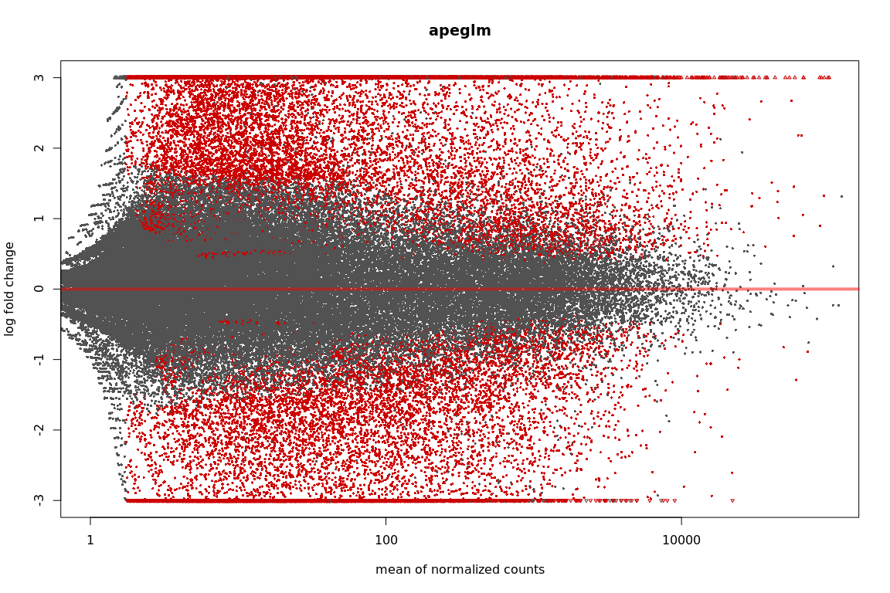

``` r
plotMA(resNormQ903, xlim=xlim, ylim=ylim, main="normal")
```

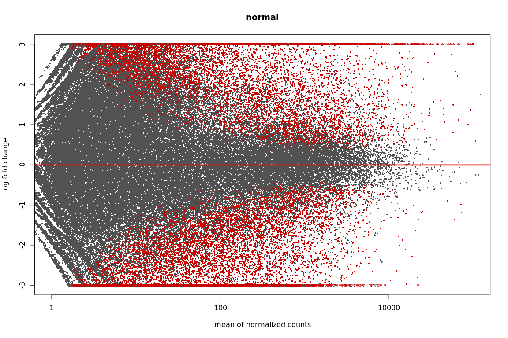

``` r
plotMA(resAshQ903, xlim=xlim, ylim=ylim, main="ashr")
```

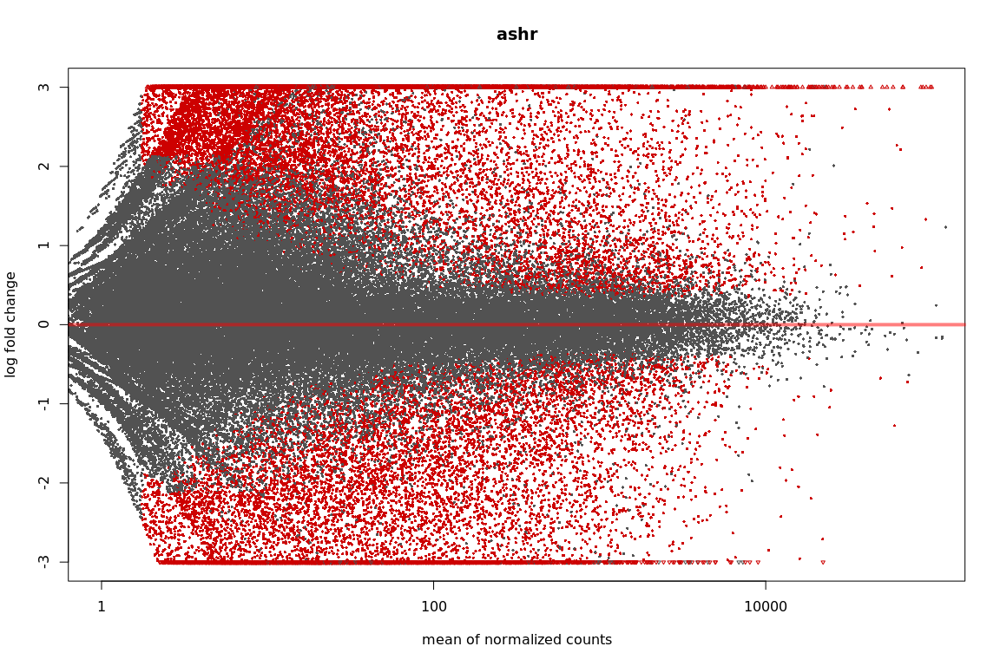

``` r
#plot counts
plotCounts(ddsQ903, gene=which.min(resQ903$padj), intgroup="condition")
```

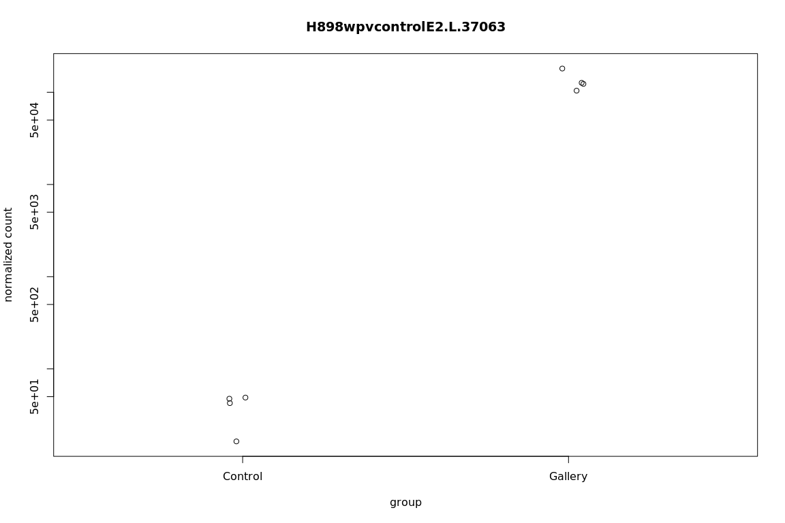

``` r
setwd("/projects/btl/kgagalova/PHD_projects2/SpruceUp/DifferentialExpression/data/Weevil")
write.csv(as.data.frame(resOrderedQ903), file="Q903_controlVSgalleryAll.csv")

#resQ903log2_1.5 <- results(ddsQ903,altHypothesis="greaterAbs",lfcThreshold=0.58,alpha=0.05)
#summary(resQ903log2_1.5)
#write.csv(as.data.frame(resOrderedQ903), file="Q903_controlVSgalleryLog15.csv")
```
