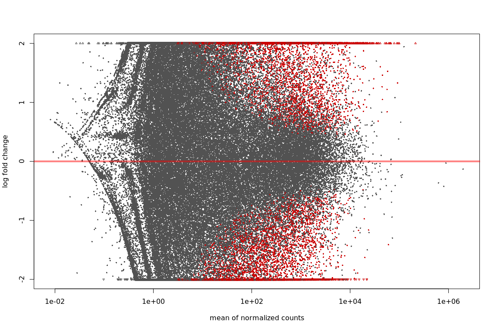
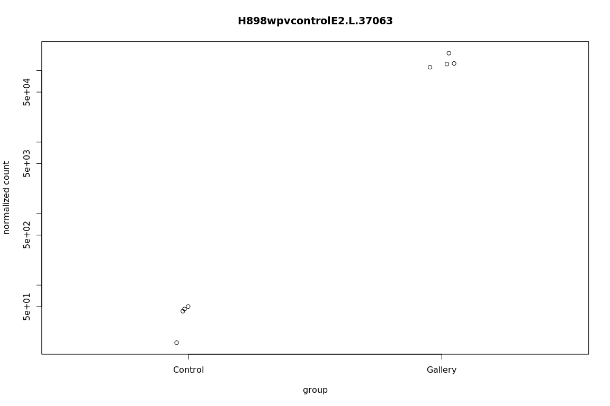

DE analysis - Weevil experiments in H898 and Q903, Bias corrected
================

H898
====

Import counts
-------------

The option tximport imports the salmon results in R, can also optionally aggregate the counts for genes. If this has been done before, as in our case, use `txOut = FALSE` when calling import function.

``` r
library("tximport")
library("readr")
library("tximportData")

samplesH898 <- read.table("/projects/btl/kgagalova/PHD_projects2/SpruceUp/DifferentialExpression/data/Weevil/samplesH898.txt", header = FALSE)
tx2gene <- read.table("/projects/spruceup_scratch/dev/SprucePaper2018/H898vsQ903sitka/GetDiffTrans/Cdhit/CdhitOnStarting/PostProcessing/SelectCDSonly/Chopstitch/Complete/geneMapTop5_nonNorm.tsv",header = F)

dir="/projects/spruceup_scratch/dev/SprucePaper2018/H898vsQ903sitka/DE/Salmon/Weevil2/H898/quants/all_samples"
allFiles <- list.files( path = dir, pattern = "quant.genesOnly", full.names = TRUE )
names(allFiles) = samplesH898$V1

txi.salmon <- tximport(allFiles, type = "salmon",tx2gene = NULL, txOut=TRUE)
head(txi.salmon$counts)
```

    ##           H898C1    H898C2     H898C3     H898C4    H898G1     H898G2
    ## 16953    1.00000    0.0000    0.00000    1.00000    0.0000    0.00000
    ## 15194    7.00000    6.0000    0.00000    6.94258   14.0000    2.00000
    ## 10472    3.00000    1.0000    3.00000    2.00000    3.0000    2.00000
    ## 23091    8.62424   15.5348    4.53837   19.93500   18.7752    5.83139
    ## 17326 1228.43000 1111.6100 1179.57000 1095.42000 1038.7200 1129.14000
    ## 21044    0.00000    0.0000    2.00000    0.00000    0.0000    1.00000
    ##        H898G3  H898G4
    ## 16953   0.000   0.000
    ## 15194  17.000   8.000
    ## 10472   1.000   0.000
    ## 23091   0.000   0.000
    ## 17326 680.239 763.332
    ## 21044   0.000   0.000

DE analysis
-----------

Check this reference for more details: `https://bioconductor.org/packages/release/bioc/vignettes/DESeq2/inst/doc/DESeq2.html` `https://bioconductor.org/packages/release/bioc/vignettes/DESeq2/inst/doc/DESeq2.html#theory-behind-deseq2`

``` r
library("DESeq2")
library("ashr")

sampleTable <- data.frame(condition = samplesH898$V2)
rownames(sampleTable) <- colnames(txi.salmon$counts)
ddsTxiH898 <- DESeqDataSetFromTximport(txi.salmon,
                                   colData = sampleTable,
                                   design = ~ condition)
ddsH898 <- DESeq(ddsTxiH898)
resH898 <- results(ddsH898)

resultsNames(ddsH898)
```

    ## [1] "Intercept"                    "condition_Gallery_vs_Control"

``` r
mcols(resH898)$description
```

    ## [1] "mean of normalized counts for all samples"           
    ## [2] "log2 fold change (MLE): condition Gallery vs Control"
    ## [3] "standard error: condition Gallery vs Control"        
    ## [4] "Wald statistic: condition Gallery vs Control"        
    ## [5] "Wald test p-value: condition Gallery vs Control"     
    ## [6] "BH adjusted p-values"

``` r
#check order condistions, Control should be the base
ddsH898$condition
```

    ## [1] Control Control Control Control Gallery Gallery Gallery Gallery
    ## Levels: Control Gallery

``` r
resH898
```

    ## log2 fold change (MLE): condition Gallery vs Control 
    ## Wald test p-value: condition Gallery vs Control 
    ## DataFrame with 22843 rows and 6 columns
    ##           baseMean log2FoldChange     lfcSE       stat     pvalue
    ##          <numeric>      <numeric> <numeric>  <numeric>  <numeric>
    ## 16953 5.626134e-02     0.36456881 3.4914996  0.1044161  0.9168391
    ## 15194 7.934596e+00     1.38118414 0.9379278  1.4725911  0.1408613
    ## 10472 1.707410e+00    -0.34698771 1.1521660 -0.3011612  0.7632916
    ## 23091 8.521864e+00    -0.94897131 1.1996068 -0.7910686  0.4289040
    ## 17326 1.017774e+03    -0.05310794 0.1788979 -0.2968618  0.7665720
    ## ...            ...            ...       ...        ...        ...
    ## 21787      0.00000             NA        NA         NA         NA
    ## 20519     34.42084     -0.8946499 0.3849386 -2.3241364 0.02011818
    ## 15711   6159.85884      0.4365257 0.1987383  2.1964852 0.02805724
    ## 16148     47.88755      0.1475655 0.4053703  0.3640263 0.71583834
    ## 42         0.00000             NA        NA         NA         NA
    ##            padj
    ##       <numeric>
    ## 16953        NA
    ## 15194 0.4608018
    ## 10472        NA
    ## 23091 0.7298208
    ## 17326 0.9149112
    ## ...         ...
    ## 21787        NA
    ## 20519 0.1908620
    ## 15711 0.2230895
    ## 16148 0.8932326
    ## 42           NA

``` r
resLFCH898 <- lfcShrink(ddsH898, coef="condition_Gallery_vs_Control", type="apeglm")
resLFCH898
```

    ## log2 fold change (MAP): condition Gallery vs Control 
    ## Wald test p-value: condition Gallery vs Control 
    ## DataFrame with 22843 rows and 5 columns
    ##           baseMean log2FoldChange     lfcSE     pvalue      padj
    ##          <numeric>      <numeric> <numeric>  <numeric> <numeric>
    ## 16953 5.626134e-02   -0.001968986 0.1390201  0.9168391        NA
    ## 15194 7.934596e+00    0.029395572 0.1422843  0.1408613 0.4608018
    ## 10472 1.707410e+00   -0.005076432 0.1381565  0.7632916        NA
    ## 23091 8.521864e+00   -0.012405822 0.1389964  0.4289040 0.7298208
    ## 17326 1.017774e+03   -0.019993551 0.1108531  0.7665720 0.9149112
    ## ...            ...            ...       ...        ...       ...
    ## 21787      0.00000             NA        NA         NA        NA
    ## 20519     34.42084     -0.1567715 0.2705216 0.02011818 0.1908620
    ## 15711   6159.85884      0.2397846 0.2175340 0.02805724 0.2230895
    ## 16148     47.88755      0.0156935 0.1326727 0.71583834 0.8932326
    ## 42         0.00000             NA        NA         NA        NA

``` r
#order by p-values
resOrderedH898 <- resH898[order(resH898$pvalue),]
summary(resH898)
```

    ## 
    ## out of 22074 with nonzero total read count
    ## adjusted p-value < 0.1
    ## LFC > 0 (up)     : 672, 3% 
    ## LFC < 0 (down)   : 414, 1.9% 
    ## outliers [1]     : 113, 0.51% 
    ## low counts [2]   : 2560, 12% 
    ## (mean count < 3)
    ## [1] see 'cooksCutoff' argument of ?results
    ## [2] see 'independentFiltering' argument of ?results

``` r
sum(resH898$padj < 0.1, na.rm=TRUE)
```

    ## [1] 1086

``` r
#show the differentially expressed
res05H898 <- results(ddsH898, alpha=0.05)
summary(res05H898)
```

    ## 
    ## out of 22074 with nonzero total read count
    ## adjusted p-value < 0.05
    ## LFC > 0 (up)     : 391, 1.8% 
    ## LFC < 0 (down)   : 229, 1% 
    ## outliers [1]     : 113, 0.51% 
    ## low counts [2]   : 1708, 7.7% 
    ## (mean count < 1)
    ## [1] see 'cooksCutoff' argument of ?results
    ## [2] see 'independentFiltering' argument of ?results

``` r
sum(res05H898$padj < 0.05, na.rm=TRUE)
```

    ## [1] 620

``` r
#plots
plotMA(res05H898, ylim=c(-2,2))
```


``` r
plotMA(resLFCH898, ylim=c(-2,2))
```


``` r
# because we are interested in treated vs untreated, we set 'coef=2'
resNormH898 <- lfcShrink(ddsH898, coef=2, type="normal")
resAshH898 <- lfcShrink(ddsH898, coef=2, type="ashr")

xlim <- c(1,1e5); 
ylim <- c(-3,3)
plotMA(resLFCH898, xlim=xlim, ylim=ylim, main="apeglm")
```


``` r
plotMA(resNormH898, xlim=xlim, ylim=ylim, main="normal")
```


``` r
plotMA(resAshH898, xlim=xlim, ylim=ylim, main="ashr")
```


``` r
#plot counts
plotCounts(ddsH898, gene=which.min(resH898$padj), intgroup="condition")
```


``` r
setwd("/projects/btl/kgagalova/PHD_projects2/SpruceUp/DifferentialExpression/data/Weevil")
write.csv(as.data.frame(resOrderedH898), file="H898_controlVSgallery_bias.csv")

##########Check values with foldchange 1.5 and p-value 0.05
#lfcThreshold is 1.5 fold change
#resH898log2_1.5 <- results(ddsH898,altHypothesis="greaterAbs",lfcThreshold=0.58,alpha=0.05)
#summary(resH898log2_1.5)
#write.csv(as.data.frame(resOrderedH898), file="H898_controlVSgalleryLog15.csv")
```

Q903
====

Import counts
-------------

``` r
samplesQ903 <- read.table("/projects/btl/kgagalova/PHD_projects2/SpruceUp/DifferentialExpression/data/Weevil/samplesQ903.txt", header = FALSE)

dir="/projects/spruceup_scratch/dev/SprucePaper2018/H898vsQ903sitka/DE/Salmon/Weevil2/Q903/quants/all_samples"

allFiles <- list.files( path = dir, pattern = "quant.genesOnly", full.names = TRUE )
names(allFiles) = samplesQ903$V1

txi.salmon <- tximport(allFiles, type = "salmon",tx2gene = NULL, txOut=TRUE)
head(txi.salmon$counts) 
```

    ##          Q903C1    Q903C2    Q903C3    Q903C4  Q903G1   Q903G2   Q903G3
    ## 16953   3.81499   5.15576   2.86520   7.56702   0.000   0.0000   1.0000
    ## 15194  34.05630  20.00000  22.92860  44.00000   8.000  71.9519  35.2062
    ## 10472   3.00000   1.00000   1.00000   7.00000   1.000   3.0000   0.0000
    ## 23091   6.65462  15.12230   5.61174  28.94540   0.000   0.0000   0.0000
    ## 17326 850.75500 852.12100 539.62900 883.52300 445.873 635.7190 559.8350
    ## 21044   1.00000   7.00000   0.00000   0.00000   2.000   0.0000   0.0000
    ##          Q903G4
    ## 16953   2.00000
    ## 15194  20.00000
    ## 10472   0.00000
    ## 23091   1.39513
    ## 17326 400.05200
    ## 21044   1.00000

``` r
sampleTable <- data.frame(condition = samplesQ903$V2)
rownames(sampleTable) <- colnames(txi.salmon$counts)
ddsTxiQ903 <- DESeqDataSetFromTximport(txi.salmon,
                                   colData = sampleTable,
                                   design = ~ condition)
ddsQ903 <- DESeq(ddsTxiQ903)
resQ903 <- results(ddsQ903)
resultsNames(ddsQ903)
```

    ## [1] "Intercept"                    "condition_Gallery_vs_Control"

``` r
#check order condistions, Control should be the base
ddsQ903$condition
```

    ## [1] Control Control Control Control Gallery Gallery Gallery Gallery
    ## Levels: Control Gallery

``` r
resQ903
```

    ## log2 fold change (MLE): condition Gallery vs Control 
    ## Wald test p-value: condition Gallery vs Control 
    ## DataFrame with 22843 rows and 6 columns
    ##          baseMean log2FoldChange     lfcSE       stat       pvalue
    ##         <numeric>      <numeric> <numeric>  <numeric>    <numeric>
    ## 16953    1.663582     -1.2862396 1.2059078 -1.0666152 0.2861456302
    ## 15194   31.399217      0.6590259 0.5808005  1.1346856 0.2565070897
    ## 10472    1.598506     -1.1108582 1.4093882 -0.7881847 0.4305886800
    ## 23091    5.786911     -4.9512994 1.2998708 -3.8090703 0.0001394903
    ## 17326  626.808410     -0.0407310 0.2055755 -0.1981315 0.8429421544
    ## ...           ...            ...       ...        ...          ...
    ## 21787    5.869093     -3.9993096 1.1242125  -3.557432 0.0003744979
    ## 20519   24.335956     -0.5523188 0.4923401  -1.121824 0.2619374101
    ## 15711 5043.698715      0.8017874 0.2730157   2.936781 0.0033163788
    ## 16148   63.096336      1.6521945 0.5943862   2.779665 0.0054415005
    ## 42       0.000000             NA        NA         NA           NA
    ##               padj
    ##          <numeric>
    ## 16953 0.4297189605
    ## 15194 0.3953920881
    ## 10472 0.5756017497
    ## 23091 0.0008029546
    ## 17326 0.9020203071
    ## ...            ...
    ## 21787  0.001875837
    ## 20519  0.401016518
    ## 15711  0.012252565
    ## 16148  0.018582890
    ## 42              NA

``` r
resLFCQ903 <- lfcShrink(ddsQ903, coef="condition_Gallery_vs_Control", type="apeglm")
resLFCQ903
```

    ## log2 fold change (MAP): condition Gallery vs Control 
    ## Wald test p-value: condition Gallery vs Control 
    ## DataFrame with 22843 rows and 5 columns
    ##          baseMean log2FoldChange     lfcSE       pvalue         padj
    ##         <numeric>      <numeric> <numeric>    <numeric>    <numeric>
    ## 16953    1.663582    -0.57092194 0.8587351 0.2861456302 0.4297189605
    ## 15194   31.399217     0.49462649 0.5185158 0.2565070897 0.3953920881
    ## 10472    1.598506    -0.36973159 0.8360123 0.4305886800 0.5756017497
    ## 23091    5.786911    -4.25743551 1.5233697 0.0001394903 0.0008029546
    ## 17326  626.808410    -0.03846994 0.2008217 0.8429421544 0.9020203071
    ## ...           ...            ...       ...          ...          ...
    ## 21787    5.869093     -3.7178098 1.4851953 0.0003744979  0.001875837
    ## 20519   24.335956     -0.4415958 0.4496630 0.2619374101  0.401016518
    ## 15711 5043.698715      0.7544733 0.2686473 0.0033163788  0.012252565
    ## 16148   63.096336      1.3872595 0.5992700 0.0054415005  0.018582890
    ## 42       0.000000             NA        NA           NA           NA

``` r
#order by p-values
resOrderedQ903 <- resQ903[order(resQ903$pvalue),]
summary(resQ903)
```

    ## 
    ## out of 22137 with nonzero total read count
    ## adjusted p-value < 0.1
    ## LFC > 0 (up)     : 4217, 19% 
    ## LFC < 0 (down)   : 4227, 19% 
    ## outliers [1]     : 247, 1.1% 
    ## low counts [2]   : 1714, 7.7% 
    ## (mean count < 1)
    ## [1] see 'cooksCutoff' argument of ?results
    ## [2] see 'independentFiltering' argument of ?results

``` r
sum(resQ903$padj < 0.1, na.rm=TRUE)
```

    ## [1] 8444

``` r
#show the differentially expressed
resQ903_05 <- results(ddsQ903, alpha=0.05)
summary(resQ903_05)
```

    ## 
    ## out of 22137 with nonzero total read count
    ## adjusted p-value < 0.05
    ## LFC > 0 (up)     : 3600, 16% 
    ## LFC < 0 (down)   : 3634, 16% 
    ## outliers [1]     : 247, 1.1% 
    ## low counts [2]   : 2143, 9.7% 
    ## (mean count < 1)
    ## [1] see 'cooksCutoff' argument of ?results
    ## [2] see 'independentFiltering' argument of ?results

``` r
sum(resQ903_05$padj < 0.05, na.rm=TRUE)
```

    ## [1] 7234

``` r
#plots
plotMA(resQ903_05, ylim=c(-2,2))
```



``` r
plotMA(resLFCQ903, ylim=c(-2,2))
```


``` r
# because we are interested in treated vs untreated, we set 'coef=2'
resNormQ903 <- lfcShrink(ddsQ903, coef=2, type="normal")
resAshQ903 <- lfcShrink(ddsQ903, coef=2, type="ashr")

xlim <- c(1,1e5); 
ylim <- c(-3,3)
plotMA(resLFCQ903, xlim=xlim, ylim=ylim, main="apeglm")
```


``` r
plotMA(resNormQ903, xlim=xlim, ylim=ylim, main="normal")
```


``` r
plotMA(resAshQ903, xlim=xlim, ylim=ylim, main="ashr")
```


``` r
#plot counts
plotCounts(ddsQ903, gene=which.min(resQ903$padj), intgroup="condition")
```



``` r
setwd("/projects/btl/kgagalova/PHD_projects2/SpruceUp/DifferentialExpression/data/Weevil")
write.csv(as.data.frame(resOrderedQ903), file="Q903_controlVSgallery_bias.csv")

#resQ903log2_1.5 <- results(ddsQ903,altHypothesis="greaterAbs",lfcThreshold=0.58,alpha=0.05)
#summary(resQ903log2_1.5)
#write.csv(as.data.frame(resOrderedQ903), file="Q903_controlVSgalleryLog15.csv")
```
