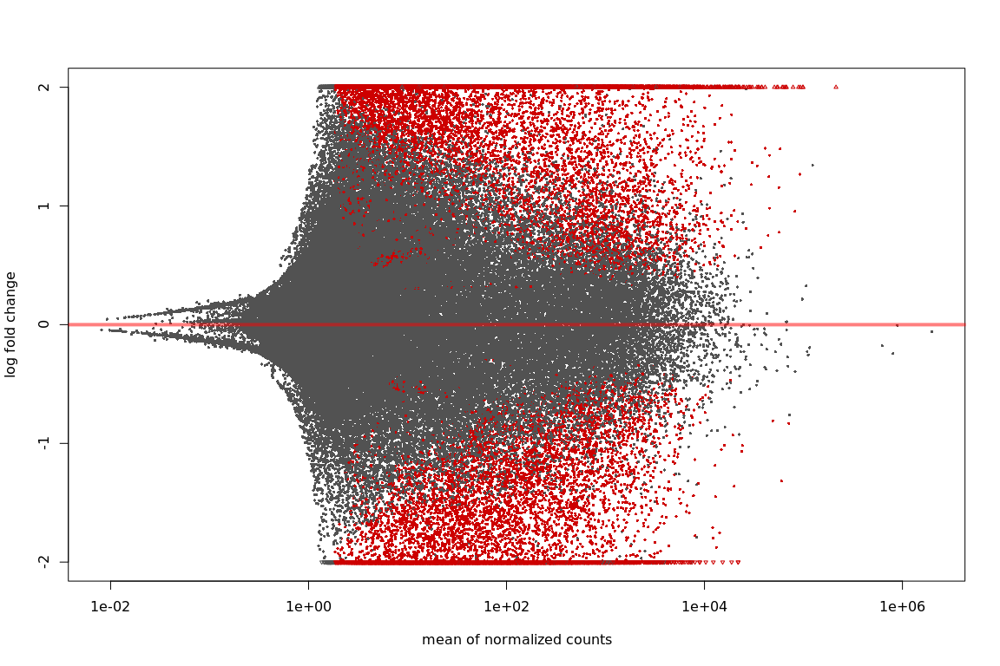
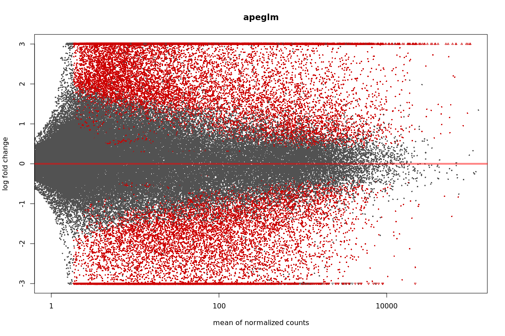
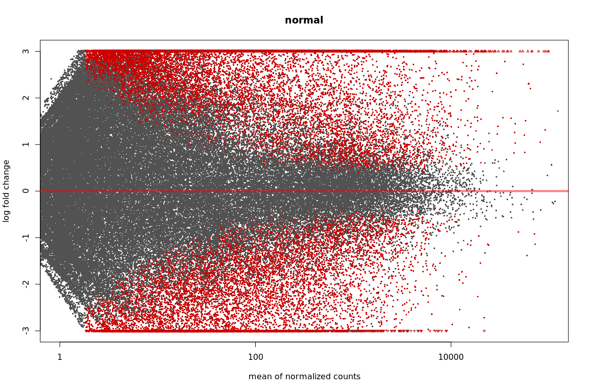
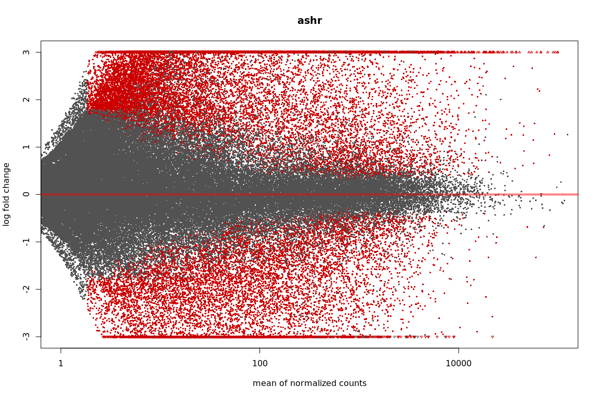

DE analysis - Weevil experiments in H898 and Q903 - bias removed and all transcripts
================

H898
====

Import counts
-------------

The option tximport imports the salmon results in R, can also optionally aggregate the counts for genes. If this has been done before, as in our case, use `txOut = FALSE` when calling import function.

``` r
library("tximport")
library("readr")
library("tximportData")

samplesH898 <- read.table("/projects/btl/kgagalova/PHD_projects2/SpruceUp/DifferentialExpression/data/Weevil/samplesH898.txt", header = FALSE)
tx2gene <- read.table("/projects/spruceup_scratch/dev/SprucePaper2018/H898vsQ903sitka/GetDiffTrans/Cdhit/CdhitOnStarting/PostProcessing/SelectCDSonly/Chopstitch/Complete/geneMapTop5_nonNorm.tsv",header = F)

dir="/projects/spruceup_scratch/dev/SprucePaper2018/H898vsQ903sitka/DE/Salmon/Weevil2/H898/quants/all_samples"
allFiles <- list.files( path = dir, pattern = "quant.genesAll", full.names = TRUE )
names(allFiles) = samplesH898$V1

txi.salmon <- tximport(allFiles, type = "salmon",tx2gene = NULL, txOut=TRUE)
head(txi.salmon$counts)
```

    ##                            H898C1    H898C2    H898C3    H898C4   H898G1
    ## H898sccortE1.L.32095      38.4162 12.849000   9.59552  16.56730 31.16350
    ## H898wpvwound01.U.2100708 118.8390  0.009166 157.79800 144.38600  0.00000
    ## H898wpvwound01.U.2007951   0.0000  4.889170   4.97413   4.85452  9.66501
    ## H898wpvwound01.U.1918887   5.0000  0.000000   0.00000   2.00000  1.00000
    ## H898wpvwound01.U.1499000   0.0000  6.000000   0.00000  12.50210  0.00000
    ## H898wpvwound01.U.1475441   0.0000  4.000000   1.00000   0.00000  0.00000
    ##                           H898G2   H898G3  H898G4
    ## H898sccortE1.L.32095     14.2282  30.8343  12.000
    ## H898wpvwound01.U.2100708 32.4525 187.8790 218.851
    ## H898wpvwound01.U.2007951 14.0000   0.0000   0.000
    ## H898wpvwound01.U.1918887  0.0000   2.0000   0.000
    ## H898wpvwound01.U.1499000  0.0000   2.0000   0.000
    ## H898wpvwound01.U.1475441  0.0000   0.0000   0.000

DE analysis
-----------

Check this reference for more details: `https://bioconductor.org/packages/release/bioc/vignettes/DESeq2/inst/doc/DESeq2.html` `https://bioconductor.org/packages/release/bioc/vignettes/DESeq2/inst/doc/DESeq2.html#theory-behind-deseq2`

``` r
library("DESeq2")
library("ashr")

sampleTable <- data.frame(condition = samplesH898$V2)
rownames(sampleTable) <- colnames(txi.salmon$counts)
ddsTxiH898 <- DESeqDataSetFromTximport(txi.salmon,
                                   colData = sampleTable,
                                   design = ~ condition)
ddsH898 <- DESeq(ddsTxiH898)
resH898 <- results(ddsH898)

resultsNames(ddsH898)
```

    ## [1] "Intercept"                    "condition_Gallery_vs_Control"

``` r
mcols(resH898)$description
```

    ## [1] "mean of normalized counts for all samples"           
    ## [2] "log2 fold change (MLE): condition Gallery vs Control"
    ## [3] "standard error: condition Gallery vs Control"        
    ## [4] "Wald statistic: condition Gallery vs Control"        
    ## [5] "Wald test p-value: condition Gallery vs Control"     
    ## [6] "BH adjusted p-values"

``` r
#check order condistions, Control should be the base
ddsH898$condition
```

    ## [1] Control Control Control Control Gallery Gallery Gallery Gallery
    ## Levels: Control Gallery

``` r
resH898
```

    ## log2 fold change (MLE): condition Gallery vs Control 
    ## Wald test p-value: condition Gallery vs Control 
    ## DataFrame with 138261 rows and 6 columns
    ##                             baseMean log2FoldChange     lfcSE       stat
    ##                            <numeric>      <numeric> <numeric>  <numeric>
    ## H898sccortE1.L.32095      20.2916540      0.4714972 0.5470964  0.8618174
    ## H898wpvwound01.U.2100708 118.4479991      0.6541898 1.6020951  0.4083339
    ## H898wpvwound01.U.2007951   3.3746095      1.0048858 1.5487097  0.6488536
    ## H898wpvwound01.U.1918887   0.4955103     -0.4628895 2.2468575 -0.2060164
    ## H898wpvwound01.U.1499000   1.8664913     -2.2319136 2.5900710 -0.8617191
    ## ...                              ...            ...       ...        ...
    ## H898wpvwoundE0.L.280845    0.8090556     -3.0065057 3.4261980 -0.8775049
    ## H898wpvcontrolE1.L.54838   6.2218150     -1.3689201 0.9874701 -1.3862902
    ## H898wpvwoundE1.L.57319     3.3595818      2.4109840 1.4390567  1.6753919
    ## H898wpvcontrolE1.L.55107  24.7625914     -0.2441643 0.4431322 -0.5509964
    ## H898wpvcontrolE1.L.55617  11.9666177     -2.1216051 0.8026016 -2.6434101
    ##                               pvalue      padj
    ##                            <numeric> <numeric>
    ## H898sccortE1.L.32095       0.3887880 0.7634227
    ## H898wpvwound01.U.2100708   0.6830285 0.9110515
    ## H898wpvwound01.U.2007951   0.5164330        NA
    ## H898wpvwound01.U.1918887   0.8367781        NA
    ## H898wpvwound01.U.1499000   0.3888421        NA
    ## ...                              ...       ...
    ## H898wpvwoundE0.L.280845  0.380212441        NA
    ## H898wpvcontrolE1.L.54838 0.165658317 0.5515042
    ## H898wpvwoundE1.L.57319   0.093857367        NA
    ## H898wpvcontrolE1.L.55107 0.581636109 0.8682074
    ## H898wpvcontrolE1.L.55617 0.008207556 0.1216380

``` r
resLFCH898 <- lfcShrink(ddsH898, coef="condition_Gallery_vs_Control", type="apeglm")
resLFCH898
```

    ## log2 fold change (MAP): condition Gallery vs Control 
    ## Wald test p-value: condition Gallery vs Control 
    ## DataFrame with 138261 rows and 5 columns
    ##                             baseMean log2FoldChange     lfcSE      pvalue
    ##                            <numeric>      <numeric> <numeric>   <numeric>
    ## H898sccortE1.L.32095      20.2916540    0.067054425 0.2146418   0.3887880
    ## H898wpvwound01.U.2100708 118.4479991    0.012055618 0.2158355   0.6830285
    ## H898wpvwound01.U.2007951   3.3746095    0.018716154 0.2163971   0.5164330
    ## H898wpvwound01.U.1918887   0.4955103   -0.006727698 0.2164398   0.8367781
    ## H898wpvwound01.U.1499000   1.8664913   -0.014962556 0.2175791   0.3888421
    ## ...                              ...            ...       ...         ...
    ## H898wpvwoundE0.L.280845    0.8090556    -0.01147993 0.2175952 0.380212441
    ## H898wpvcontrolE1.L.54838   6.2218150    -0.06384435 0.2260292 0.165658317
    ## H898wpvwoundE1.L.57319     3.3595818     0.05267813 0.2249672 0.093857367
    ## H898wpvcontrolE1.L.55107  24.7625914    -0.04793243 0.2009019 0.581636109
    ## H898wpvcontrolE1.L.55617  11.9666177    -0.18175790 0.3361513 0.008207556
    ##                               padj
    ##                          <numeric>
    ## H898sccortE1.L.32095     0.7634227
    ## H898wpvwound01.U.2100708 0.9110515
    ## H898wpvwound01.U.2007951        NA
    ## H898wpvwound01.U.1918887        NA
    ## H898wpvwound01.U.1499000        NA
    ## ...                            ...
    ## H898wpvwoundE0.L.280845         NA
    ## H898wpvcontrolE1.L.54838 0.5515042
    ## H898wpvwoundE1.L.57319          NA
    ## H898wpvcontrolE1.L.55107 0.8682074
    ## H898wpvcontrolE1.L.55617 0.1216380

``` r
#order by p-values
resOrderedH898 <- resH898[order(resH898$pvalue),]
summary(resH898)
```

    ## 
    ## out of 119538 with nonzero total read count
    ## adjusted p-value < 0.1
    ## LFC > 0 (up)     : 2039, 1.7% 
    ## LFC < 0 (down)   : 1384, 1.2% 
    ## outliers [1]     : 2088, 1.7% 
    ## low counts [2]   : 59497, 50% 
    ## (mean count < 4)
    ## [1] see 'cooksCutoff' argument of ?results
    ## [2] see 'independentFiltering' argument of ?results

``` r
sum(resH898$padj < 0.1, na.rm=TRUE)
```

    ## [1] 3423

``` r
#show the differentially expressed
res05H898 <- results(ddsH898, alpha=0.05)
summary(res05H898)
```

    ## 
    ## out of 119538 with nonzero total read count
    ## adjusted p-value < 0.05
    ## LFC > 0 (up)     : 1337, 1.1% 
    ## LFC < 0 (down)   : 866, 0.72% 
    ## outliers [1]     : 2088, 1.7% 
    ## low counts [2]   : 61709, 52% 
    ## (mean count < 4)
    ## [1] see 'cooksCutoff' argument of ?results
    ## [2] see 'independentFiltering' argument of ?results

``` r
sum(res05H898$padj < 0.05, na.rm=TRUE)
```

    ## [1] 2203

``` r
#plots
plotMA(res05H898, ylim=c(-2,2))
```


``` r
plotMA(resLFCH898, ylim=c(-2,2))
```


``` r
# because we are interested in treated vs untreated, we set 'coef=2'
resNormH898 <- lfcShrink(ddsH898, coef=2, type="normal")
resAshH898 <- lfcShrink(ddsH898, coef=2, type="ashr")
```

    ## Squarem-1
    ## Objective fn: 29598.1
    ## Objective fn: 28159.4  Extrapolation: 0  Steplength: 1
    ## Objective fn: 25475.2  Extrapolation: 1  Steplength: 4
    ## Objective fn: 25018  Extrapolation: 1  Steplength: 2.82754
    ## Objective fn: 24658.3  Extrapolation: 1  Steplength: 16
    ## Objective fn: 24399.4  Extrapolation: 1  Steplength: 3.36837
    ## Objective fn: 24386  Extrapolation: 1  Steplength: 7.13654
    ## Objective fn: 24352.8  Extrapolation: 1  Steplength: 4.04644
    ## Objective fn: 24317.1  Extrapolation: 0  Steplength: 1
    ## Objective fn: 24314.1  Extrapolation: 0  Steplength: 1
    ## Objective fn: 24282.5  Extrapolation: 1  Steplength: 16
    ## Objective fn: 24281.4  Extrapolation: 0  Steplength: 1
    ## Objective fn: 24269.2  Extrapolation: 1  Steplength: 64
    ## Objective fn: 24249.2  Extrapolation: 1  Steplength: 6.02783
    ## Objective fn: 24245.1  Extrapolation: 1  Steplength: 3.42827
    ## Objective fn: 24243.2  Extrapolation: 0  Steplength: 1
    ## Objective fn: 24242.9  Extrapolation: 0  Steplength: 1
    ## Objective fn: 24242.6  Extrapolation: 0  Steplength: 1
    ## Objective fn: 24242.4  Extrapolation: 0  Steplength: 1
    ## Objective fn: 24242.1  Extrapolation: 0  Steplength: 1
    ## Objective fn: 24241.9  Extrapolation: 0  Steplength: 1
    ## Objective fn: 24227.8  Extrapolation: 1  Steplength: 64
    ## Objective fn: 24226.2  Extrapolation: 1  Steplength: 8.21097
    ## Objective fn: 24226  Extrapolation: 0  Steplength: 1
    ## Objective fn: 24218.7  Extrapolation: 1  Steplength: 80.9706
    ## Objective fn: 24216.7  Extrapolation: 0  Steplength: 1
    ## Objective fn: 24214.6  Extrapolation: 1  Steplength: 6.25867
    ## Objective fn: 24214.5  Extrapolation: 0  Steplength: 1
    ## Objective fn: 24210.1  Extrapolation: 1  Steplength: 45.1919
    ## Objective fn: 24209.5  Extrapolation: 1  Steplength: 7.86339
    ## Objective fn: 24209.1  Extrapolation: 0  Steplength: 1
    ## Objective fn: 24209  Extrapolation: 0  Steplength: 1
    ## Objective fn: 24199.1  Extrapolation: 1  Steplength: 124.124
    ## Objective fn: 24196.7  Extrapolation: 1  Steplength: 6.37233
    ## Objective fn: 24196.1  Extrapolation: 0  Steplength: 1
    ## Objective fn: 24193.6  Extrapolation: 1  Steplength: 36.2252
    ## Objective fn: 24191.4  Extrapolation: 0  Steplength: 1
    ## Objective fn: 24189.7  Extrapolation: 1  Steplength: 12.8738
    ## Objective fn: 24189.5  Extrapolation: 0  Steplength: 1
    ## Objective fn: 24187  Extrapolation: 1  Steplength: 19.307
    ## Objective fn: 24186  Extrapolation: 1  Steplength: 5.76634
    ## Objective fn: 24185.8  Extrapolation: 0  Steplength: 1
    ## Objective fn: 24185.6  Extrapolation: 0  Steplength: 1
    ## Objective fn: 24176.7  Extrapolation: 1  Steplength: 64
    ## Objective fn: 24176.5  Extrapolation: 0  Steplength: 1
    ## Objective fn: 24174.3  Extrapolation: 1  Steplength: 62.2536
    ## Objective fn: 24167  Extrapolation: 1  Steplength: 5.45012
    ## Objective fn: 24166.7  Extrapolation: 0  Steplength: 1
    ## Objective fn: 24166.5  Extrapolation: 0  Steplength: 1
    ## Objective fn: 24166.4  Extrapolation: 0  Steplength: 1
    ## Objective fn: 24166.3  Extrapolation: 0  Steplength: 1
    ## Objective fn: 24166.1  Extrapolation: 0  Steplength: 1
    ## Objective fn: 24166  Extrapolation: 0  Steplength: 1
    ## Objective fn: 24157.5  Extrapolation: 1  Steplength: 64
    ## Objective fn: 24156.5  Extrapolation: 1  Steplength: 5.77791
    ## Objective fn: 24135.8  Extrapolation: 1  Steplength: 256
    ## Objective fn: 24128.8  Extrapolation: 1  Steplength: 5.50247
    ## Objective fn: 24128.6  Extrapolation: 0  Steplength: 1
    ## Objective fn: 24128.5  Extrapolation: 0  Steplength: 1
    ## Objective fn: 24128.5  Extrapolation: 0  Steplength: 1
    ## Objective fn: 24128.4  Extrapolation: 0  Steplength: 1
    ## Objective fn: 24128.3  Extrapolation: 0  Steplength: 1
    ## Objective fn: 24128.2  Extrapolation: 0  Steplength: 1
    ## Objective fn: 24128.2  Extrapolation: 0  Steplength: 1
    ## Objective fn: 24128.1  Extrapolation: 0  Steplength: 1
    ## Objective fn: 24128  Extrapolation: 0  Steplength: 1
    ## Objective fn: 24128  Extrapolation: 0  Steplength: 1
    ## Objective fn: 24127.9  Extrapolation: 0  Steplength: 1
    ## Objective fn: 24127.8  Extrapolation: 0  Steplength: 1
    ## Objective fn: 24127.8  Extrapolation: 0  Steplength: 1
    ## Objective fn: 24127.7  Extrapolation: 0  Steplength: 1
    ## Objective fn: 24127.6  Extrapolation: 0  Steplength: 1
    ## Objective fn: 24127.6  Extrapolation: 0  Steplength: 1
    ## Objective fn: 24127.5  Extrapolation: 0  Steplength: 1
    ## Objective fn: 24127.4  Extrapolation: 0  Steplength: 1
    ## Objective fn: 24127.4  Extrapolation: 0  Steplength: 1
    ## Objective fn: 24127.3  Extrapolation: 0  Steplength: 1
    ## Objective fn: 24127.2  Extrapolation: 0  Steplength: 1
    ## Objective fn: 24127.2  Extrapolation: 0  Steplength: 1
    ## Objective fn: 24127.1  Extrapolation: 0  Steplength: 1
    ## Objective fn: 24127  Extrapolation: 0  Steplength: 1
    ## Objective fn: 24127  Extrapolation: 0  Steplength: 1
    ## Objective fn: 24126.9  Extrapolation: 0  Steplength: 1
    ## Objective fn: 24126.8  Extrapolation: 0  Steplength: 1
    ## Objective fn: 24126.8  Extrapolation: 0  Steplength: 1
    ## Objective fn: 24126.7  Extrapolation: 0  Steplength: 1
    ## Objective fn: 24126.6  Extrapolation: 0  Steplength: 1
    ## Objective fn: 24126.6  Extrapolation: 0  Steplength: 1
    ## Objective fn: 24126.5  Extrapolation: 0  Steplength: 1
    ## Objective fn: 24126.4  Extrapolation: 0  Steplength: 1
    ## Objective fn: 24126.4  Extrapolation: 0  Steplength: 1
    ## Objective fn: 24126.3  Extrapolation: 0  Steplength: 1
    ## Objective fn: 24126.2  Extrapolation: 0  Steplength: 1
    ## Objective fn: 24126.2  Extrapolation: 0  Steplength: 1
    ## Objective fn: 24126.1  Extrapolation: 0  Steplength: 1
    ## Objective fn: 24111.5  Extrapolation: 1  Steplength: 256
    ## Objective fn: 24108.6  Extrapolation: 1  Steplength: 53.4177
    ## Objective fn: 24108.5  Extrapolation: 0  Steplength: 1
    ## Objective fn: 24107.9  Extrapolation: 1  Steplength: 16.0255
    ## Objective fn: 24107.5  Extrapolation: 1  Steplength: 9.35485
    ## Objective fn: 24107.3  Extrapolation: 0  Steplength: 1
    ## Objective fn: 24107.8  Extrapolation: 1  Steplength: 34.4141
    ## Objective fn: 24106.4  Extrapolation: 0  Steplength: 1
    ## Objective fn: 24105.5  Extrapolation: 1  Steplength: 7.32171
    ## Objective fn: 24105.5  Extrapolation: 0  Steplength: 1
    ## Objective fn: 24105.4  Extrapolation: 0  Steplength: 1
    ## Objective fn: 24105.4  Extrapolation: 0  Steplength: 1
    ## Objective fn: 24105.3  Extrapolation: 0  Steplength: 1
    ## Objective fn: 24105.3  Extrapolation: 0  Steplength: 1
    ## Objective fn: 24105.3  Extrapolation: 0  Steplength: 1
    ## Objective fn: 24105.2  Extrapolation: 0  Steplength: 1
    ## Objective fn: 24105.2  Extrapolation: 0  Steplength: 1
    ## Objective fn: 24105.2  Extrapolation: 0  Steplength: 1
    ## Objective fn: 24097.3  Extrapolation: 1  Steplength: 256
    ## Objective fn: 24096  Extrapolation: 1  Steplength: 6.74105
    ## Objective fn: 24096  Extrapolation: 0  Steplength: 1
    ## Objective fn: 24095.9  Extrapolation: 0  Steplength: 1
    ## Objective fn: 24085.7  Extrapolation: 1  Steplength: 867.03
    ## Objective fn: 24081.4  Extrapolation: 1  Steplength: 6.80856
    ## Objective fn: 24081.3  Extrapolation: 0  Steplength: 1
    ## Objective fn: 24081  Extrapolation: 1  Steplength: 31.7324
    ## Objective fn: 24080.7  Extrapolation: 0  Steplength: 1
    ## Objective fn: 24080.5  Extrapolation: 1  Steplength: 7.72259
    ## Objective fn: 24080.4  Extrapolation: 0  Steplength: 1
    ## Objective fn: 24080.4  Extrapolation: 0  Steplength: 1
    ## Objective fn: 24080.4  Extrapolation: 0  Steplength: 1
    ## Objective fn: 24080.4  Extrapolation: 0  Steplength: 1
    ## Objective fn: 24080.4  Extrapolation: 0  Steplength: 1
    ## Objective fn: 24080.4  Extrapolation: 0  Steplength: 1
    ## Objective fn: 24080.3  Extrapolation: 0  Steplength: 1
    ## Objective fn: 24080.3  Extrapolation: 0  Steplength: 1
    ## Objective fn: 24080.3  Extrapolation: 0  Steplength: 1
    ## Objective fn: 24080.3  Extrapolation: 0  Steplength: 1
    ## Objective fn: 24080.3  Extrapolation: 0  Steplength: 1
    ## Objective fn: 24076.7  Extrapolation: 1  Steplength: 256
    ## Objective fn: 24076.3  Extrapolation: 1  Steplength: 6.8951
    ## Objective fn: 24076.2  Extrapolation: 0  Steplength: 1
    ## Objective fn: 24076.2  Extrapolation: 0  Steplength: 1
    ## Objective fn: 24076.2  Extrapolation: 0  Steplength: 1
    ## Objective fn: 24076.2  Extrapolation: 0  Steplength: 1
    ## Objective fn: 24076.2  Extrapolation: 0  Steplength: 1
    ## Objective fn: 24076.2  Extrapolation: 0  Steplength: 1
    ## Objective fn: 24076.1  Extrapolation: 0  Steplength: 1
    ## Objective fn: 24076.1  Extrapolation: 0  Steplength: 1
    ## Objective fn: 24076.1  Extrapolation: 0  Steplength: 1
    ## Objective fn: 24076.1  Extrapolation: 0  Steplength: 1
    ## Objective fn: 24076.1  Extrapolation: 0  Steplength: 1
    ## Objective fn: 24076.1  Extrapolation: 0  Steplength: 1
    ## Objective fn: 24076  Extrapolation: 0  Steplength: 1
    ## Objective fn: 24076  Extrapolation: 0  Steplength: 1
    ## Objective fn: 24076  Extrapolation: 0  Steplength: 1
    ## Objective fn: 24076  Extrapolation: 0  Steplength: 1
    ## Objective fn: 24076  Extrapolation: 0  Steplength: 1
    ## Objective fn: 24076  Extrapolation: 0  Steplength: 1
    ## Objective fn: 24076  Extrapolation: 0  Steplength: 1
    ## Objective fn: 24075.9  Extrapolation: 0  Steplength: 1
    ## Objective fn: 24072.6  Extrapolation: 1  Steplength: 256
    ## Objective fn: 24071.5  Extrapolation: 1  Steplength: 32.282
    ## Objective fn: 24071.4  Extrapolation: 0  Steplength: 1
    ## Objective fn: 24071.2  Extrapolation: 1  Steplength: 12.8991
    ## Objective fn: 24071.2  Extrapolation: 1  Steplength: 12.4043
    ## Objective fn: 24071  Extrapolation: 0  Steplength: 1
    ## Objective fn: 24070.9  Extrapolation: 1  Steplength: 17.8632
    ## Objective fn: 24071.6  Extrapolation: 1  Steplength: 8.20574
    ## Objective fn: 24070.6  Extrapolation: 0  Steplength: 1
    ## Objective fn: 24070.5  Extrapolation: 0  Steplength: 1
    ## Objective fn: 24070.5  Extrapolation: 0  Steplength: 1
    ## Objective fn: 24070.5  Extrapolation: 0  Steplength: 1
    ## Objective fn: 24070.5  Extrapolation: 0  Steplength: 1
    ## Objective fn: 24070.5  Extrapolation: 0  Steplength: 1
    ## Objective fn: 24070.5  Extrapolation: 0  Steplength: 1
    ## Objective fn: 24070.4  Extrapolation: 0  Steplength: 1
    ## Objective fn: 24070.4  Extrapolation: 0  Steplength: 1
    ## Objective fn: 24070.4  Extrapolation: 0  Steplength: 1
    ## Objective fn: 24068.9  Extrapolation: 1  Steplength: 256
    ## Objective fn: 24066.6  Extrapolation: 1  Steplength: 6.14003
    ## Objective fn: 24066.5  Extrapolation: 0  Steplength: 1
    ## Objective fn: 24066.5  Extrapolation: 0  Steplength: 1
    ## Objective fn: 24066.5  Extrapolation: 0  Steplength: 1
    ## Objective fn: 24066.5  Extrapolation: 0  Steplength: 1
    ## Objective fn: 24066.5  Extrapolation: 0  Steplength: 1
    ## Objective fn: 24066.5  Extrapolation: 0  Steplength: 1
    ## Objective fn: 24066.5  Extrapolation: 0  Steplength: 1
    ## Objective fn: 24066.2  Extrapolation: 1  Steplength: 256
    ## Objective fn: 24063.2  Extrapolation: 1  Steplength: 5.8145
    ## Objective fn: 24063.1  Extrapolation: 0  Steplength: 1
    ## Objective fn: 24063.1  Extrapolation: 0  Steplength: 1
    ## Objective fn: 24063.1  Extrapolation: 0  Steplength: 1
    ## Objective fn: 24063.1  Extrapolation: 0  Steplength: 1
    ## Objective fn: 24063.1  Extrapolation: 0  Steplength: 1
    ## Objective fn: 24063.9  Extrapolation: 1  Steplength: 116.888
    ## Objective fn: 24062.3  Extrapolation: 1  Steplength: 5.58922
    ## Objective fn: 24062.2  Extrapolation: 1  Steplength: 37.2031
    ## Objective fn: 24061.4  Extrapolation: 0  Steplength: 1
    ## Objective fn: 24061.3  Extrapolation: 1  Steplength: 12.4996
    ## Objective fn: 24061.2  Extrapolation: 0  Steplength: 1
    ## Objective fn: 24061.1  Extrapolation: 1  Steplength: 17.0218
    ## Objective fn: 24061.2  Extrapolation: 1  Steplength: 8.78858
    ## Objective fn: 24061  Extrapolation: 0  Steplength: 1
    ## Objective fn: 24060.9  Extrapolation: 0  Steplength: 1
    ## Objective fn: 24060.9  Extrapolation: 0  Steplength: 1
    ## Objective fn: 24060.9  Extrapolation: 0  Steplength: 1
    ## Objective fn: 24060.9  Extrapolation: 0  Steplength: 1
    ## Objective fn: 24060.9  Extrapolation: 0  Steplength: 1
    ## Objective fn: 24060.9  Extrapolation: 0  Steplength: 1
    ## Objective fn: 24060.9  Extrapolation: 0  Steplength: 1
    ## Objective fn: 24060.9  Extrapolation: 0  Steplength: 1
    ## Objective fn: 24060.9  Extrapolation: 0  Steplength: 1
    ## Objective fn: 24060.9  Extrapolation: 0  Steplength: 1
    ## Objective fn: 24060.9  Extrapolation: 0  Steplength: 1
    ## Objective fn: 24059.2  Extrapolation: 1  Steplength: 256
    ## Objective fn: 24058.6  Extrapolation: 1  Steplength: 6.26713
    ## Objective fn: 24058.6  Extrapolation: 0  Steplength: 1
    ## Objective fn: 24058.6  Extrapolation: 0  Steplength: 1
    ## Objective fn: 24058.6  Extrapolation: 0  Steplength: 1
    ## Objective fn: 24058.6  Extrapolation: 0  Steplength: 1
    ## Objective fn: 24058.6  Extrapolation: 0  Steplength: 1
    ## Objective fn: 24058.6  Extrapolation: 0  Steplength: 1
    ## Objective fn: 24058.5  Extrapolation: 0  Steplength: 1
    ## Objective fn: 24058.5  Extrapolation: 0  Steplength: 1
    ## Objective fn: 24058.5  Extrapolation: 0  Steplength: 1
    ## Objective fn: 24058.5  Extrapolation: 0  Steplength: 1
    ## Objective fn: 24058.5  Extrapolation: 0  Steplength: 1
    ## Objective fn: 24058.5  Extrapolation: 0  Steplength: 1
    ## Objective fn: 24058.5  Extrapolation: 0  Steplength: 1
    ## Objective fn: 24058.5  Extrapolation: 0  Steplength: 1
    ## Objective fn: 24058.5  Extrapolation: 0  Steplength: 1
    ## Objective fn: 24058.5  Extrapolation: 0  Steplength: 1
    ## Objective fn: 24057  Extrapolation: 1  Steplength: 256
    ## Objective fn: 24057.2  Extrapolation: 1  Steplength: 43.3003
    ## Objective fn: 24056.6  Extrapolation: 1  Steplength: 6.04201
    ## Objective fn: 24056.6  Extrapolation: 0  Steplength: 1
    ## Objective fn: 24056.6  Extrapolation: 0  Steplength: 1
    ## Objective fn: 24056.6  Extrapolation: 0  Steplength: 1
    ## Objective fn: 24057.2  Extrapolation: 1  Steplength: 171.603
    ## Objective fn: 24056.2  Extrapolation: 1  Steplength: 5.19326
    ## Objective fn: 24056.8  Extrapolation: 1  Steplength: 34.3191
    ## Objective fn: 24055.7  Extrapolation: 0  Steplength: 1
    ## Objective fn: 24055.6  Extrapolation: 1  Steplength: 6.90882
    ## Objective fn: 24055.6  Extrapolation: 0  Steplength: 1
    ## Objective fn: 24055.6  Extrapolation: 0  Steplength: 1
    ## Objective fn: 24055.6  Extrapolation: 0  Steplength: 1
    ## Objective fn: 24055.6  Extrapolation: 0  Steplength: 1
    ## Objective fn: 24055.6  Extrapolation: 0  Steplength: 1
    ## Objective fn: 24055.6  Extrapolation: 0  Steplength: 1
    ## Objective fn: 24055.6  Extrapolation: 0  Steplength: 1
    ## Objective fn: 24055.6  Extrapolation: 0  Steplength: 1
    ## Objective fn: 24055.6  Extrapolation: 0  Steplength: 1
    ## Objective fn: 24055.6  Extrapolation: 0  Steplength: 1
    ## Objective fn: 24055.6  Extrapolation: 0  Steplength: 1
    ## Objective fn: 24055.6  Extrapolation: 0  Steplength: 1
    ## Objective fn: 24055.6  Extrapolation: 0  Steplength: 1
    ## Objective fn: 24055.6  Extrapolation: 0  Steplength: 1
    ## Objective fn: 24054.7  Extrapolation: 1  Steplength: 256
    ## Objective fn: 24054.7  Extrapolation: 1  Steplength: 29.785
    ## Objective fn: 24054.6  Extrapolation: 1  Steplength: 6.08513
    ## Objective fn: 24054.6  Extrapolation: 0  Steplength: 1
    ## Objective fn: 24054.6  Extrapolation: 0  Steplength: 1
    ## Objective fn: 24054.6  Extrapolation: 0  Steplength: 1
    ## Objective fn: 24054.6  Extrapolation: 0  Steplength: 1
    ## Objective fn: 24054.6  Extrapolation: 0  Steplength: 1
    ## Objective fn: 24054  Extrapolation: 1  Steplength: 256
    ## Objective fn: 24053.9  Extrapolation: 1  Steplength: 5.62023
    ## Objective fn: 24053.9  Extrapolation: 1  Steplength: 111.128
    ## Objective fn: 24053.8  Extrapolation: 1  Steplength: 5.13369
    ## Objective fn: 24053.7  Extrapolation: 0  Steplength: 1
    ## Objective fn: 24054.2  Extrapolation: 1  Steplength: 40.7496
    ## Objective fn: 24054  Extrapolation: 1  Steplength: 4.01643
    ## Objective fn: 24053.7  Extrapolation: 1  Steplength: 3.44899
    ## Objective fn: 24054.3  Extrapolation: 1  Steplength: 6.22566
    ## Objective fn: 24053.6  Extrapolation: 1  Steplength: 2.71561
    ## Objective fn: 24053.6  Extrapolation: 0  Steplength: 1
    ## Objective fn: 24053.6  Extrapolation: 0  Steplength: 1
    ## Objective fn: 24053.6  Extrapolation: 0  Steplength: 1
    ## Objective fn: 24053.6  Extrapolation: 0  Steplength: 1
    ## Objective fn: 24053.6  Extrapolation: 0  Steplength: 1
    ## Objective fn: 24053.6  Extrapolation: 0  Steplength: 1
    ## Objective fn: 24053.6  Extrapolation: 0  Steplength: 1
    ## Objective fn: 24053.6  Extrapolation: 0  Steplength: 1
    ## Objective fn: 24053.6  Extrapolation: 0  Steplength: 1
    ## Objective fn: 24053.6  Extrapolation: 0  Steplength: 1
    ## Objective fn: 24053.6  Extrapolation: 0  Steplength: 1
    ## Objective fn: 24053.6  Extrapolation: 0  Steplength: 1
    ## Objective fn: 24053.6  Extrapolation: 0  Steplength: 1
    ## Objective fn: 24053.1  Extrapolation: 1  Steplength: 256
    ## Objective fn: 24053  Extrapolation: 1  Steplength: 39.8763
    ## Objective fn: 24053  Extrapolation: 0  Steplength: 1
    ## Objective fn: 24053.5  Extrapolation: 1  Steplength: 87.1314
    ## Objective fn: 24052.9  Extrapolation: 1  Steplength: 5.78887
    ## Objective fn: 24052.9  Extrapolation: 0  Steplength: 1
    ## Objective fn: 24052.9  Extrapolation: 0  Steplength: 1
    ## Objective fn: 24053.6  Extrapolation: 1  Steplength: 136.775
    ## Objective fn: 24052.8  Extrapolation: 1  Steplength: 5.15348
    ## Objective fn: 24052.7  Extrapolation: 0  Steplength: 1
    ## Objective fn: 24052.9  Extrapolation: 1  Steplength: 39.8282
    ## Objective fn: 24053.7  Extrapolation: 1  Steplength: 5.86533
    ## Objective fn: 24052.6  Extrapolation: 1  Steplength: 2.85575
    ## Objective fn: 24052.5  Extrapolation: 0  Steplength: 1
    ## Objective fn: 24052.5  Extrapolation: 0  Steplength: 1
    ## Objective fn: 24053.4  Extrapolation: 1  Steplength: 253.667
    ## Objective fn: 24053  Extrapolation: 0  Steplength: 1
    ## Objective fn: 24052.9  Extrapolation: 0  Steplength: 1
    ## Objective fn: 24053.8  Extrapolation: 1  Steplength: 34.1344
    ## Objective fn: 24052.1  Extrapolation: 1  Steplength: 5.83293
    ## Objective fn: 24052.1  Extrapolation: 0  Steplength: 1
    ## Objective fn: 24052.8  Extrapolation: 1  Steplength: 77.1664
    ## Objective fn: 24052.2  Extrapolation: 1  Steplength: 5.8152
    ## Objective fn: 24051.9  Extrapolation: 0  Steplength: 1
    ## Objective fn: 24051.9  Extrapolation: 0  Steplength: 1
    ## Objective fn: 24051.9  Extrapolation: 0  Steplength: 1
    ## Objective fn: 24051.9  Extrapolation: 0  Steplength: 1
    ## Objective fn: 24052.8  Extrapolation: 1  Steplength: 170.126
    ## Objective fn: 24051.9  Extrapolation: 1  Steplength: 4.86309
    ## Objective fn: 24052.2  Extrapolation: 1  Steplength: 37.8589
    ## Objective fn: 24051.7  Extrapolation: 0  Steplength: 1
    ## Objective fn: 24051.5  Extrapolation: 1  Steplength: 5.66258
    ## Objective fn: 24051.5  Extrapolation: 0  Steplength: 1
    ## Objective fn: 24051.5  Extrapolation: 0  Steplength: 1
    ## Objective fn: 24051.5  Extrapolation: 0  Steplength: 1
    ## Objective fn: 24051.5  Extrapolation: 0  Steplength: 1
    ## Objective fn: 24051.5  Extrapolation: 0  Steplength: 1
    ## Objective fn: 24051.5  Extrapolation: 0  Steplength: 1
    ## Objective fn: 24051.5  Extrapolation: 0  Steplength: 1
    ## Objective fn: 24051.5  Extrapolation: 0  Steplength: 1
    ## Objective fn: 24051.5  Extrapolation: 0  Steplength: 1
    ## Objective fn: 24051.5  Extrapolation: 0  Steplength: 1
    ## Objective fn: 24051.5  Extrapolation: 0  Steplength: 1
    ## Objective fn: 24051.5  Extrapolation: 0  Steplength: 1
    ## Objective fn: 24051.5  Extrapolation: 0  Steplength: 1
    ## Objective fn: 24051.5  Extrapolation: 0  Steplength: 1
    ## Objective fn: 24051.5  Extrapolation: 0  Steplength: 1
    ## Objective fn: 24051.5  Extrapolation: 0  Steplength: 1
    ## Objective fn: 24051.5  Extrapolation: 0  Steplength: 1
    ## Objective fn: 24051.5  Extrapolation: 0  Steplength: 1
    ## Objective fn: 24051.5  Extrapolation: 0  Steplength: 1
    ## Objective fn: 24051.5  Extrapolation: 0  Steplength: 1
    ## Objective fn: 24051.5  Extrapolation: 0  Steplength: 1
    ## Objective fn: 24051.5  Extrapolation: 0  Steplength: 1
    ## Objective fn: 24051.5  Extrapolation: 0  Steplength: 1
    ## Objective fn: 24051.5  Extrapolation: 0  Steplength: 1
    ## Objective fn: 24051.5  Extrapolation: 0  Steplength: 1
    ## Objective fn: 24051.5  Extrapolation: 0  Steplength: 1
    ## Objective fn: 24051.5  Extrapolation: 0  Steplength: 1
    ## Objective fn: 24051.1  Extrapolation: 1  Steplength: 256
    ## Objective fn: 24051  Extrapolation: 1  Steplength: 38.2078
    ## Objective fn: 24051  Extrapolation: 0  Steplength: 1
    ## Objective fn: 24051.8  Extrapolation: 1  Steplength: 73.289
    ## Objective fn: 24051  Extrapolation: 1  Steplength: 5.84749
    ## Objective fn: 24050.8  Extrapolation: 0  Steplength: 1
    ## Objective fn: 24050.8  Extrapolation: 0  Steplength: 1
    ## Objective fn: 24050.8  Extrapolation: 0  Steplength: 1
    ## Objective fn: 24050.8  Extrapolation: 0  Steplength: 1
    ## Objective fn: 24050.8  Extrapolation: 0  Steplength: 1
    ## Objective fn: 24050.8  Extrapolation: 0  Steplength: 1
    ## Objective fn: 24050.8  Extrapolation: 0  Steplength: 1
    ## Objective fn: 24050.8  Extrapolation: 0  Steplength: 1
    ## Objective fn: 24050.8  Extrapolation: 0  Steplength: 1
    ## Objective fn: 24050.8  Extrapolation: 0  Steplength: 1
    ## Objective fn: 24050.8  Extrapolation: 0  Steplength: 1
    ## Objective fn: 24050.8  Extrapolation: 0  Steplength: 1
    ## Objective fn: 24050.8  Extrapolation: 0  Steplength: 1
    ## Objective fn: 24050.8  Extrapolation: 0  Steplength: 1
    ## Objective fn: 24050.8  Extrapolation: 0  Steplength: 1
    ## Objective fn: 24050.8  Extrapolation: 0  Steplength: 1
    ## Objective fn: 24050.8  Extrapolation: 0  Steplength: 1
    ## Objective fn: 24050.8  Extrapolation: 0  Steplength: 1
    ## Objective fn: 24050.8  Extrapolation: 0  Steplength: 1
    ## Objective fn: 24050.8  Extrapolation: 0  Steplength: 1
    ## Objective fn: 24050.8  Extrapolation: 0  Steplength: 1
    ## Objective fn: 24050.8  Extrapolation: 0  Steplength: 1
    ## Objective fn: 24050.8  Extrapolation: 0  Steplength: 1
    ## Objective fn: 24050.8  Extrapolation: 0  Steplength: 1
    ## Objective fn: 24050.8  Extrapolation: 0  Steplength: 1
    ## Objective fn: 24050.4  Extrapolation: 1  Steplength: 256
    ## Objective fn: 24050.2  Extrapolation: 1  Steplength: 37.4658
    ## Objective fn: 24051  Extrapolation: 1  Steplength: 19.9146
    ## Objective fn: 24050.2  Extrapolation: 0  Steplength: 1
    ## Objective fn: 24050.2  Extrapolation: 1  Steplength: 7.796
    ## Objective fn: 24050.2  Extrapolation: 0  Steplength: 1
    ## Objective fn: 24050.2  Extrapolation: 0  Steplength: 1
    ## Objective fn: 24050.2  Extrapolation: 0  Steplength: 1
    ## Objective fn: 24050.2  Extrapolation: 0  Steplength: 1
    ## Objective fn: 24050.2  Extrapolation: 0  Steplength: 1
    ## Objective fn: 24050.2  Extrapolation: 0  Steplength: 1
    ## Objective fn: 24050.2  Extrapolation: 0  Steplength: 1
    ## Objective fn: 24050.2  Extrapolation: 0  Steplength: 1
    ## Objective fn: 24050  Extrapolation: 1  Steplength: 256
    ## Objective fn: 24049.6  Extrapolation: 1  Steplength: 5.83414
    ## Objective fn: 24049.6  Extrapolation: 0  Steplength: 1
    ## Objective fn: 24049.6  Extrapolation: 0  Steplength: 1
    ## Objective fn: 24049.6  Extrapolation: 0  Steplength: 1
    ## Objective fn: 24049.6  Extrapolation: 0  Steplength: 1
    ## Objective fn: 24049.6  Extrapolation: 0  Steplength: 1
    ## Objective fn: 24049.6  Extrapolation: 0  Steplength: 1
    ## Objective fn: 24049.6  Extrapolation: 0  Steplength: 1
    ## Objective fn: 24049.6  Extrapolation: 0  Steplength: 1
    ## Objective fn: 24049.6  Extrapolation: 0  Steplength: 1
    ## Objective fn: 24049.6  Extrapolation: 0  Steplength: 1
    ## Objective fn: 24049.6  Extrapolation: 0  Steplength: 1
    ## Objective fn: 24049.6  Extrapolation: 0  Steplength: 1
    ## Objective fn: 24049.6  Extrapolation: 0  Steplength: 1
    ## Objective fn: 24049.6  Extrapolation: 0  Steplength: 1
    ## Objective fn: 24049.6  Extrapolation: 0  Steplength: 1
    ## Objective fn: 24049.6  Extrapolation: 0  Steplength: 1
    ## Objective fn: 24049.6  Extrapolation: 0  Steplength: 1
    ## Objective fn: 24049.6  Extrapolation: 0  Steplength: 1
    ## Objective fn: 24049.6  Extrapolation: 0  Steplength: 1
    ## Objective fn: 24049.6  Extrapolation: 0  Steplength: 1
    ## Objective fn: 24049.2  Extrapolation: 1  Steplength: 256
    ## Objective fn: 24049  Extrapolation: 1  Steplength: 37.4724
    ## Objective fn: 24049  Extrapolation: 1  Steplength: 10.9498
    ## Objective fn: 24048.9  Extrapolation: 0  Steplength: 1
    ## Objective fn: 24049  Extrapolation: 1  Steplength: 26.0973
    ## Objective fn: 24049.8  Extrapolation: 1  Steplength: 6.54979
    ## Objective fn: 24050.5  Extrapolation: 1  Steplength: 4.75022
    ## Objective fn: 24049.6  Extrapolation: 1  Steplength: 3.76399
    ## Objective fn: 24048.8  Extrapolation: 0  Steplength: 1
    ## Objective fn: 24048.8  Extrapolation: 0  Steplength: 1
    ## Objective fn: 24048.8  Extrapolation: 0  Steplength: 1
    ## Objective fn: 24048.2  Extrapolation: 1  Steplength: 256
    ## Objective fn: 24048.2  Extrapolation: 0  Steplength: 1
    ## Objective fn: 24048.7  Extrapolation: 1  Steplength: 52.7762
    ## Objective fn: 24048.2  Extrapolation: 1  Steplength: 6.04667
    ## Objective fn: 24048.1  Extrapolation: 0  Steplength: 1
    ## Objective fn: 24048.1  Extrapolation: 0  Steplength: 1
    ## Objective fn: 24048.1  Extrapolation: 0  Steplength: 1
    ## Objective fn: 24048.1  Extrapolation: 0  Steplength: 1
    ## Objective fn: 24048.1  Extrapolation: 0  Steplength: 1
    ## Objective fn: 24048.2  Extrapolation: 1  Steplength: 256
    ## Objective fn: 24047.5  Extrapolation: 1  Steplength: 5.85482
    ## Objective fn: 24047.4  Extrapolation: 0  Steplength: 1
    ## Objective fn: 24047.4  Extrapolation: 0  Steplength: 1
    ## Objective fn: 24047.4  Extrapolation: 0  Steplength: 1
    ## Objective fn: 24047.4  Extrapolation: 0  Steplength: 1
    ## Objective fn: 24047.4  Extrapolation: 0  Steplength: 1
    ## Objective fn: 24047.4  Extrapolation: 0  Steplength: 1
    ## Objective fn: 24047.4  Extrapolation: 0  Steplength: 1
    ## Objective fn: 24047.4  Extrapolation: 0  Steplength: 1
    ## Objective fn: 24047.4  Extrapolation: 0  Steplength: 1
    ## Objective fn: 24047.4  Extrapolation: 0  Steplength: 1
    ## Objective fn: 24047.4  Extrapolation: 0  Steplength: 1
    ## Objective fn: 24047.4  Extrapolation: 0  Steplength: 1
    ## Objective fn: 24047.4  Extrapolation: 0  Steplength: 1
    ## Objective fn: 24047.4  Extrapolation: 0  Steplength: 1
    ## Objective fn: 24047.4  Extrapolation: 0  Steplength: 1
    ## Objective fn: 24047.4  Extrapolation: 0  Steplength: 1
    ## Objective fn: 24047.4  Extrapolation: 0  Steplength: 1
    ## Objective fn: 24047.4  Extrapolation: 0  Steplength: 1
    ## Objective fn: 24047.4  Extrapolation: 0  Steplength: 1
    ## Objective fn: 24047.4  Extrapolation: 0  Steplength: 1
    ## Objective fn: 24047.4  Extrapolation: 0  Steplength: 1
    ## Objective fn: 24047.4  Extrapolation: 0  Steplength: 1
    ## Objective fn: 24047.4  Extrapolation: 0  Steplength: 1
    ## Objective fn: 24047.4  Extrapolation: 0  Steplength: 1
    ## Objective fn: 24047.4  Extrapolation: 0  Steplength: 1
    ## Objective fn: 24047.4  Extrapolation: 0  Steplength: 1
    ## Objective fn: 24047.4  Extrapolation: 0  Steplength: 1
    ## Objective fn: 24047.4  Extrapolation: 0  Steplength: 1
    ## Objective fn: 24047.4  Extrapolation: 0  Steplength: 1
    ## Objective fn: 24047.4  Extrapolation: 0  Steplength: 1
    ## Objective fn: 24047.4  Extrapolation: 0  Steplength: 1
    ## Objective fn: 24046.9  Extrapolation: 1  Steplength: 256
    ## Objective fn: 24046.7  Extrapolation: 1  Steplength: 35.3341
    ## Objective fn: 24046.7  Extrapolation: 0  Steplength: 1
    ## Objective fn: 24046.7  Extrapolation: 0  Steplength: 1
    ## Objective fn: 24046.6  Extrapolation: 0  Steplength: 1
    ## Objective fn: 24046.6  Extrapolation: 0  Steplength: 1
    ## Objective fn: 24046.6  Extrapolation: 0  Steplength: 1
    ## Objective fn: 24046.6  Extrapolation: 0  Steplength: 1
    ## Objective fn: 24046.6  Extrapolation: 0  Steplength: 1
    ## Objective fn: 24046.6  Extrapolation: 0  Steplength: 1
    ## Objective fn: 24046.6  Extrapolation: 0  Steplength: 1
    ## Objective fn: 24046.6  Extrapolation: 0  Steplength: 1
    ## Objective fn: 24046.8  Extrapolation: 1  Steplength: 256
    ## Objective fn: 24046.1  Extrapolation: 1  Steplength: 5.28846
    ## Objective fn: 24046.4  Extrapolation: 1  Steplength: 43.3973
    ## Objective fn: 24045.9  Extrapolation: 0  Steplength: 1
    ## Objective fn: 24045.8  Extrapolation: 1  Steplength: 6.74925
    ## Objective fn: 24045.8  Extrapolation: 0  Steplength: 1
    ## Objective fn: 24045.8  Extrapolation: 0  Steplength: 1
    ## Objective fn: 24045.8  Extrapolation: 0  Steplength: 1
    ## Objective fn: 24045.8  Extrapolation: 0  Steplength: 1
    ## Objective fn: 24045.8  Extrapolation: 0  Steplength: 1
    ## Objective fn: 24045.8  Extrapolation: 0  Steplength: 1
    ## Objective fn: 24045.8  Extrapolation: 0  Steplength: 1
    ## Objective fn: 24045.8  Extrapolation: 0  Steplength: 1
    ## Objective fn: 24045.8  Extrapolation: 0  Steplength: 1
    ## Objective fn: 24045.8  Extrapolation: 0  Steplength: 1
    ## Objective fn: 24045.8  Extrapolation: 0  Steplength: 1
    ## Objective fn: 24045.8  Extrapolation: 0  Steplength: 1
    ## Objective fn: 24045.8  Extrapolation: 0  Steplength: 1
    ## Objective fn: 24045.8  Extrapolation: 0  Steplength: 1
    ## Objective fn: 24045.8  Extrapolation: 0  Steplength: 1
    ## Objective fn: 24045.8  Extrapolation: 0  Steplength: 1
    ## Objective fn: 24045.8  Extrapolation: 0  Steplength: 1
    ## Objective fn: 24045.8  Extrapolation: 0  Steplength: 1
    ## Objective fn: 24045.8  Extrapolation: 0  Steplength: 1
    ## Objective fn: 24045.8  Extrapolation: 0  Steplength: 1
    ## Objective fn: 24045.8  Extrapolation: 0  Steplength: 1
    ## Objective fn: 24045.8  Extrapolation: 0  Steplength: 1
    ## Objective fn: 24045.8  Extrapolation: 0  Steplength: 1
    ## Objective fn: 24045.8  Extrapolation: 0  Steplength: 1
    ## Objective fn: 24045.8  Extrapolation: 0  Steplength: 1
    ## Objective fn: 24045.8  Extrapolation: 0  Steplength: 1
    ## Objective fn: 24045.3  Extrapolation: 1  Steplength: 256
    ## Objective fn: 24045  Extrapolation: 1  Steplength: 34.1427
    ## Objective fn: 24045  Extrapolation: 0  Steplength: 1
    ## Objective fn: 24045.7  Extrapolation: 1  Steplength: 51.2446
    ## Objective fn: 24045.1  Extrapolation: 1  Steplength: 6.22264
    ## Objective fn: 24044.9  Extrapolation: 0  Steplength: 1
    ## Objective fn: 24044.9  Extrapolation: 0  Steplength: 1
    ## Objective fn: 24044.9  Extrapolation: 0  Steplength: 1
    ## Objective fn: 24044.9  Extrapolation: 0  Steplength: 1
    ## Objective fn: 24044.9  Extrapolation: 0  Steplength: 1
    ## Objective fn: 24044.9  Extrapolation: 0  Steplength: 1
    ## Objective fn: 24045.2  Extrapolation: 1  Steplength: 256
    ## Objective fn: 24044.2  Extrapolation: 1  Steplength: 5.90215
    ## Objective fn: 24044.2  Extrapolation: 0  Steplength: 1
    ## Objective fn: 24044.2  Extrapolation: 0  Steplength: 1
    ## Objective fn: 24044.9  Extrapolation: 1  Steplength: 109.41
    ## Objective fn: 24044.1  Extrapolation: 1  Steplength: 5.27601
    ## Objective fn: 24044.2  Extrapolation: 1  Steplength: 36.5495
    ## Objective fn: 24043.8  Extrapolation: 0  Steplength: 1
    ## Objective fn: 24043.8  Extrapolation: 1  Steplength: 8.48976
    ## Objective fn: 24043.8  Extrapolation: 0  Steplength: 1
    ## Objective fn: 24043.8  Extrapolation: 0  Steplength: 1
    ## Objective fn: 24043.8  Extrapolation: 0  Steplength: 1
    ## Objective fn: 24043.8  Extrapolation: 0  Steplength: 1
    ## Objective fn: 24043.8  Extrapolation: 0  Steplength: 1
    ## Objective fn: 24043.8  Extrapolation: 0  Steplength: 1
    ## Objective fn: 24043.8  Extrapolation: 0  Steplength: 1
    ## Objective fn: 24043.8  Extrapolation: 0  Steplength: 1
    ## Objective fn: 24043.8  Extrapolation: 0  Steplength: 1
    ## Objective fn: 24043.8  Extrapolation: 0  Steplength: 1
    ## Objective fn: 24044.1  Extrapolation: 1  Steplength: 256
    ## Objective fn: 24043.2  Extrapolation: 1  Steplength: 5.54993
    ## Objective fn: 24043.6  Extrapolation: 1  Steplength: 44.3492
    ## Objective fn: 24043  Extrapolation: 0  Steplength: 1
    ## Objective fn: 24043  Extrapolation: 1  Steplength: 7.68194
    ## Objective fn: 24043  Extrapolation: 0  Steplength: 1
    ## Objective fn: 24043  Extrapolation: 0  Steplength: 1
    ## Objective fn: 24043  Extrapolation: 0  Steplength: 1
    ## Objective fn: 24043  Extrapolation: 0  Steplength: 1
    ## Objective fn: 24042.9  Extrapolation: 0  Steplength: 1
    ## Objective fn: 24042.9  Extrapolation: 0  Steplength: 1
    ## Objective fn: 24042.9  Extrapolation: 0  Steplength: 1
    ## Objective fn: 24042.9  Extrapolation: 0  Steplength: 1
    ## Objective fn: 24042.9  Extrapolation: 0  Steplength: 1
    ## Objective fn: 24042.9  Extrapolation: 0  Steplength: 1
    ## Objective fn: 24042.9  Extrapolation: 0  Steplength: 1
    ## Objective fn: 24042.9  Extrapolation: 0  Steplength: 1
    ## Objective fn: 24042.9  Extrapolation: 0  Steplength: 1
    ## Objective fn: 24042.9  Extrapolation: 0  Steplength: 1
    ## Objective fn: 24042.9  Extrapolation: 0  Steplength: 1
    ## Objective fn: 24042.9  Extrapolation: 0  Steplength: 1
    ## Objective fn: 24042.9  Extrapolation: 0  Steplength: 1
    ## Objective fn: 24042.9  Extrapolation: 0  Steplength: 1
    ## Objective fn: 24042.9  Extrapolation: 0  Steplength: 1
    ## Objective fn: 24042.9  Extrapolation: 0  Steplength: 1
    ## Objective fn: 24042.9  Extrapolation: 0  Steplength: 1
    ## Objective fn: 24042.9  Extrapolation: 0  Steplength: 1
    ## Objective fn: 24042.9  Extrapolation: 0  Steplength: 1
    ## Objective fn: 24042.9  Extrapolation: 0  Steplength: 1
    ## Objective fn: 24042.9  Extrapolation: 0  Steplength: 1
    ## Objective fn: 24042.5  Extrapolation: 1  Steplength: 256
    ## Objective fn: 24042.2  Extrapolation: 1  Steplength: 33.0092
    ## Objective fn: 24042.2  Extrapolation: 0  Steplength: 1
    ## Objective fn: 24042.2  Extrapolation: 1  Steplength: 24.2965
    ## Objective fn: 24042.1  Extrapolation: 1  Steplength: 7.33308
    ## Objective fn: 24042.1  Extrapolation: 0  Steplength: 1
    ## Objective fn: 24042.1  Extrapolation: 0  Steplength: 1
    ## Objective fn: 24042.1  Extrapolation: 0  Steplength: 1
    ## Objective fn: 24042.1  Extrapolation: 0  Steplength: 1
    ## Objective fn: 24042.1  Extrapolation: 0  Steplength: 1
    ## Objective fn: 24042.1  Extrapolation: 0  Steplength: 1
    ## Objective fn: 24042.1  Extrapolation: 0  Steplength: 1
    ## Objective fn: 24042.1  Extrapolation: 0  Steplength: 1
    ## Objective fn: 24042.1  Extrapolation: 0  Steplength: 1
    ## Objective fn: 24041.9  Extrapolation: 1  Steplength: 256
    ## Objective fn: 24041.5  Extrapolation: 1  Steplength: 6.4369
    ## Objective fn: 24041.5  Extrapolation: 0  Steplength: 1
    ## Objective fn: 24041.5  Extrapolation: 0  Steplength: 1
    ## Objective fn: 24041.5  Extrapolation: 0  Steplength: 1
    ## Objective fn: 24041.5  Extrapolation: 0  Steplength: 1
    ## Objective fn: 24041.5  Extrapolation: 0  Steplength: 1
    ## Objective fn: 24041.5  Extrapolation: 0  Steplength: 1
    ## Objective fn: 24041.8  Extrapolation: 1  Steplength: 256
    ## Objective fn: 24040.9  Extrapolation: 1  Steplength: 5.85089
    ## Objective fn: 24040.9  Extrapolation: 0  Steplength: 1
    ## Objective fn: 24040.8  Extrapolation: 1  Steplength: 58.5739
    ## Objective fn: 24040.7  Extrapolation: 1  Steplength: 6.69251
    ## Objective fn: 24040.7  Extrapolation: 0  Steplength: 1
    ## Objective fn: 24041.6  Extrapolation: 1  Steplength: 93.2491
    ## Objective fn: 24040.8  Extrapolation: 0  Steplength: 1
    ## Objective fn: 24040.6  Extrapolation: 1  Steplength: 6.1585
    ## Objective fn: 24040.6  Extrapolation: 0  Steplength: 1
    ## Objective fn: 24040.4  Extrapolation: 1  Steplength: 37.7157
    ## Objective fn: 24040.4  Extrapolation: 0  Steplength: 1
    ## Objective fn: 24041.3  Extrapolation: 1  Steplength: 58.3389
    ## Objective fn: 24041.6  Extrapolation: 1  Steplength: 6.39348
    ## Objective fn: 24040.9  Extrapolation: 1  Steplength: 3.83739
    ## Objective fn: 24040.3  Extrapolation: 0  Steplength: 1
    ## Objective fn: 24040.3  Extrapolation: 0  Steplength: 1
    ## Objective fn: 24040.3  Extrapolation: 0  Steplength: 1
    ## Objective fn: 24040.3  Extrapolation: 0  Steplength: 1
    ## Objective fn: 24040.3  Extrapolation: 0  Steplength: 1
    ## Objective fn: 24040.3  Extrapolation: 0  Steplength: 1
    ## Objective fn: 24040  Extrapolation: 1  Steplength: 256
    ## Objective fn: 24039.8  Extrapolation: 1  Steplength: 8.55486
    ## Objective fn: 24040.4  Extrapolation: 1  Steplength: 39.1589
    ## Objective fn: 24039.9  Extrapolation: 0  Steplength: 1
    ## Objective fn: 24039.6  Extrapolation: 1  Steplength: 6.57342
    ## Objective fn: 24039.6  Extrapolation: 0  Steplength: 1
    ## Objective fn: 24039.6  Extrapolation: 0  Steplength: 1
    ## Objective fn: 24039.6  Extrapolation: 0  Steplength: 1
    ## Objective fn: 24039.6  Extrapolation: 0  Steplength: 1
    ## Objective fn: 24039.6  Extrapolation: 0  Steplength: 1
    ## Objective fn: 24039.6  Extrapolation: 0  Steplength: 1
    ## Objective fn: 24039.6  Extrapolation: 0  Steplength: 1
    ## Objective fn: 24039.6  Extrapolation: 0  Steplength: 1
    ## Objective fn: 24039.6  Extrapolation: 0  Steplength: 1
    ## Objective fn: 24039.6  Extrapolation: 0  Steplength: 1
    ## Objective fn: 24039.6  Extrapolation: 0  Steplength: 1
    ## Objective fn: 24039.6  Extrapolation: 0  Steplength: 1
    ## Objective fn: 24039.6  Extrapolation: 0  Steplength: 1
    ## Objective fn: 24039.6  Extrapolation: 0  Steplength: 1
    ## Objective fn: 24039.6  Extrapolation: 0  Steplength: 1
    ## Objective fn: 24039.6  Extrapolation: 0  Steplength: 1
    ## Objective fn: 24039.2  Extrapolation: 1  Steplength: 256
    ## Objective fn: 24039.3  Extrapolation: 1  Steplength: 37.5905
    ## Objective fn: 24039  Extrapolation: 1  Steplength: 6.45829
    ## Objective fn: 24039  Extrapolation: 0  Steplength: 1
    ## Objective fn: 24039  Extrapolation: 0  Steplength: 1
    ## Objective fn: 24039  Extrapolation: 0  Steplength: 1
    ## Objective fn: 24039  Extrapolation: 0  Steplength: 1
    ## Objective fn: 24039  Extrapolation: 0  Steplength: 1
    ## Objective fn: 24039  Extrapolation: 0  Steplength: 1
    ## Objective fn: 24039  Extrapolation: 0  Steplength: 1
    ## Objective fn: 24039  Extrapolation: 0  Steplength: 1
    ## Objective fn: 24039  Extrapolation: 0  Steplength: 1
    ## Objective fn: 24039  Extrapolation: 0  Steplength: 1
    ## Objective fn: 24039  Extrapolation: 0  Steplength: 1
    ## Objective fn: 24039  Extrapolation: 0  Steplength: 1
    ## Objective fn: 24039  Extrapolation: 0  Steplength: 1
    ## Objective fn: 24039  Extrapolation: 0  Steplength: 1
    ## Objective fn: 24039  Extrapolation: 0  Steplength: 1
    ## Objective fn: 24039  Extrapolation: 0  Steplength: 1
    ## Objective fn: 24039  Extrapolation: 0  Steplength: 1
    ## Objective fn: 24039  Extrapolation: 0  Steplength: 1
    ## Objective fn: 24039  Extrapolation: 0  Steplength: 1
    ## Objective fn: 24039  Extrapolation: 0  Steplength: 1
    ## Objective fn: 24039  Extrapolation: 0  Steplength: 1
    ## Objective fn: 24039  Extrapolation: 0  Steplength: 1
    ## Objective fn: 24038.6  Extrapolation: 1  Steplength: 256
    ## Objective fn: 24038.5  Extrapolation: 1  Steplength: 30.4091
    ## Objective fn: 24038.7  Extrapolation: 1  Steplength: 17.7942
    ## Objective fn: 24038.5  Extrapolation: 0  Steplength: 1
    ## Objective fn: 24038.4  Extrapolation: 1  Steplength: 10.4945
    ## Objective fn: 24038.4  Extrapolation: 0  Steplength: 1
    ## Objective fn: 24038.4  Extrapolation: 1  Steplength: 23.2713
    ## Objective fn: 24038.4  Extrapolation: 1  Steplength: 7.89301
    ## Objective fn: 24038.4  Extrapolation: 0  Steplength: 1
    ## Objective fn: 24038.4  Extrapolation: 0  Steplength: 1
    ## Objective fn: 24039  Extrapolation: 1  Steplength: 77.8102
    ## Objective fn: 24038.2  Extrapolation: 1  Steplength: 6.31656
    ## Objective fn: 24038.2  Extrapolation: 0  Steplength: 1
    ## Objective fn: 24038.2  Extrapolation: 0  Steplength: 1
    ## Objective fn: 24038.2  Extrapolation: 0  Steplength: 1
    ## Objective fn: 24038.2  Extrapolation: 0  Steplength: 1
    ## Objective fn: 24038.2  Extrapolation: 0  Steplength: 1
    ## Objective fn: 24038.2  Extrapolation: 0  Steplength: 1
    ## Objective fn: 24038.2  Extrapolation: 0  Steplength: 1
    ## Objective fn: 24038.2  Extrapolation: 0  Steplength: 1
    ## Objective fn: 24038.2  Extrapolation: 0  Steplength: 1
    ## Objective fn: 24038  Extrapolation: 1  Steplength: 256
    ## Objective fn: 24037.8  Extrapolation: 1  Steplength: 6.65587
    ## Objective fn: 24037.8  Extrapolation: 0  Steplength: 1
    ## Objective fn: 24037.8  Extrapolation: 0  Steplength: 1
    ## Objective fn: 24037.8  Extrapolation: 0  Steplength: 1
    ## Objective fn: 24037.8  Extrapolation: 0  Steplength: 1
    ## Objective fn: 24037.8  Extrapolation: 0  Steplength: 1
    ## Objective fn: 24037.8  Extrapolation: 0  Steplength: 1
    ## Objective fn: 24037.8  Extrapolation: 0  Steplength: 1
    ## Objective fn: 24037.8  Extrapolation: 1  Steplength: 256
    ## Objective fn: 24037.4  Extrapolation: 1  Steplength: 5.80701
    ## Objective fn: 24037.4  Extrapolation: 1  Steplength: 38.6866
    ## Objective fn: 24037.4  Extrapolation: 0  Steplength: 1
    ## Objective fn: 24037.3  Extrapolation: 1  Steplength: 14.0697
    ## Objective fn: 24037.8  Extrapolation: 1  Steplength: 11.6545
    ## Objective fn: 24037.3  Extrapolation: 0  Steplength: 1
    ## Objective fn: 24037.4  Extrapolation: 1  Steplength: 17.9014
    ## Objective fn: 24037.3  Extrapolation: 0  Steplength: 1
    ## Objective fn: 24037.3  Extrapolation: 1  Steplength: 10.5296
    ## Objective fn: 24037.3  Extrapolation: 0  Steplength: 1
    ## Objective fn: 24037.3  Extrapolation: 1  Steplength: 22.759
    ## Objective fn: 24037.3  Extrapolation: 1  Steplength: 8.03492
    ## Objective fn: 24037.2  Extrapolation: 0  Steplength: 1
    ## Objective fn: 24038  Extrapolation: 1  Steplength: 50.7596
    ## Objective fn: 24037.3  Extrapolation: 0  Steplength: 1
    ## Objective fn: 24037.2  Extrapolation: 1  Steplength: 6.8638
    ## Objective fn: 24037.2  Extrapolation: 0  Steplength: 1
    ## Objective fn: 24037.2  Extrapolation: 0  Steplength: 1
    ## Objective fn: 24037.2  Extrapolation: 0  Steplength: 1
    ## Objective fn: 24037.2  Extrapolation: 0  Steplength: 1
    ## Objective fn: 24037.2  Extrapolation: 0  Steplength: 1
    ## Objective fn: 24037.2  Extrapolation: 0  Steplength: 1
    ## Objective fn: 24037.1  Extrapolation: 0  Steplength: 1
    ## Objective fn: 24037.1  Extrapolation: 0  Steplength: 1
    ## Objective fn: 24037.1  Extrapolation: 0  Steplength: 1
    ## Objective fn: 24036.9  Extrapolation: 1  Steplength: 256
    ## Objective fn: 24036.8  Extrapolation: 1  Steplength: 6.78766
    ## Objective fn: 24037.3  Extrapolation: 1  Steplength: 88.9802
    ## Objective fn: 24037  Extrapolation: 1  Steplength: 6.38326
    ## Objective fn: 24037.1  Extrapolation: 1  Steplength: 4.67671
    ## Objective fn: 24036.8  Extrapolation: 1  Steplength: 3.47678
    ## Objective fn: 24036.7  Extrapolation: 0  Steplength: 1
    ## Objective fn: 24036.7  Extrapolation: 0  Steplength: 1
    ## Objective fn: 24036.7  Extrapolation: 0  Steplength: 1
    ## Objective fn: 24036.4  Extrapolation: 1  Steplength: 256
    ## Objective fn: 24036.6  Extrapolation: 1  Steplength: 20.101
    ## Objective fn: 24036.4  Extrapolation: 0  Steplength: 1
    ## Objective fn: 24036.4  Extrapolation: 1  Steplength: 9.67632
    ## Objective fn: 24036.4  Extrapolation: 0  Steplength: 1
    ## Objective fn: 24036.4  Extrapolation: 1  Steplength: 27.4123
    ## Objective fn: 24036.4  Extrapolation: 1  Steplength: 7.61475
    ## Objective fn: 24036.3  Extrapolation: 0  Steplength: 1
    ## Objective fn: 24036.3  Extrapolation: 0  Steplength: 1
    ## Objective fn: 24036.6  Extrapolation: 1  Steplength: 83.3805
    ## Objective fn: 24036.3  Extrapolation: 1  Steplength: 6.36006
    ## Objective fn: 24036.2  Extrapolation: 0  Steplength: 1
    ## Objective fn: 24036.2  Extrapolation: 0  Steplength: 1
    ## Objective fn: 24036.2  Extrapolation: 0  Steplength: 1
    ## Objective fn: 24036.2  Extrapolation: 0  Steplength: 1
    ## Objective fn: 24036.2  Extrapolation: 0  Steplength: 1
    ## Objective fn: 24036.2  Extrapolation: 0  Steplength: 1
    ## Objective fn: 24036.2  Extrapolation: 0  Steplength: 1
    ## Objective fn: 24036.2  Extrapolation: 0  Steplength: 1
    ## Objective fn: 24036.2  Extrapolation: 0  Steplength: 1
    ## Objective fn: 24036.1  Extrapolation: 1  Steplength: 256
    ## Objective fn: 24036  Extrapolation: 1  Steplength: 6.81963
    ## Objective fn: 24036.4  Extrapolation: 1  Steplength: 97.8827
    ## Objective fn: 24036  Extrapolation: 1  Steplength: 6.2728
    ## Objective fn: 24036.2  Extrapolation: 1  Steplength: 4.89615
    ## Objective fn: 24035.9  Extrapolation: 1  Steplength: 3.25994
    ## Objective fn: 24036.9  Extrapolation: 1  Steplength: 7.70948
    ## Objective fn: 24035.9  Extrapolation: 1  Steplength: 1.75451
    ## Objective fn: 24035.9  Extrapolation: 0  Steplength: 1
    ## Objective fn: 24035.9  Extrapolation: 0  Steplength: 1
    ## Objective fn: 24035.7  Extrapolation: 1  Steplength: 256
    ## Objective fn: 24035.7  Extrapolation: 0  Steplength: 1
    ## Objective fn: 24035.7  Extrapolation: 1  Steplength: 37.0634
    ## Objective fn: 24035.9  Extrapolation: 1  Steplength: 6.88833
    ## Objective fn: 24035.7  Extrapolation: 1  Steplength: 3.35146
    ## Objective fn: 24036.2  Extrapolation: 1  Steplength: 6.93281
    ## Objective fn: 24035.6  Extrapolation: 1  Steplength: 1.98406
    ## Objective fn: 24035.6  Extrapolation: 0  Steplength: 1
    ## Objective fn: 24035.6  Extrapolation: 0  Steplength: 1
    ## Objective fn: 24035.6  Extrapolation: 0  Steplength: 1
    ## Objective fn: 24035.6  Extrapolation: 0  Steplength: 1
    ## Objective fn: 24035.6  Extrapolation: 0  Steplength: 1
    ## Objective fn: 24035.5  Extrapolation: 1  Steplength: 256
    ## Objective fn: 24035.4  Extrapolation: 1  Steplength: 30.8673
    ## Objective fn: 24035.4  Extrapolation: 1  Steplength: 9.45623
    ## Objective fn: 24035.4  Extrapolation: 0  Steplength: 1
    ## Objective fn: 24035.4  Extrapolation: 1  Steplength: 29.2084
    ## Objective fn: 24035.4  Extrapolation: 1  Steplength: 7.50968
    ## Objective fn: 24035.4  Extrapolation: 0  Steplength: 1
    ## Objective fn: 24035.4  Extrapolation: 0  Steplength: 1
    ## Objective fn: 24035.5  Extrapolation: 1  Steplength: 87.4287
    ## Objective fn: 24035.3  Extrapolation: 1  Steplength: 6.36944
    ## Objective fn: 24035.3  Extrapolation: 0  Steplength: 1
    ## Objective fn: 24035.3  Extrapolation: 0  Steplength: 1
    ## Objective fn: 24036.2  Extrapolation: 1  Steplength: 199.62
    ## Objective fn: 24035.3  Extrapolation: 1  Steplength: 6.14945
    ## Objective fn: 24035.5  Extrapolation: 1  Steplength: 5.50608
    ## Objective fn: 24035.2  Extrapolation: 1  Steplength: 2.37588
    ## Objective fn: 24035.2  Extrapolation: 0  Steplength: 1
    ## Objective fn: 24035.2  Extrapolation: 0  Steplength: 1
    ## Objective fn: 24035.2  Extrapolation: 0  Steplength: 1
    ## Objective fn: 24035.1  Extrapolation: 1  Steplength: 256
    ## Objective fn: 24035.2  Extrapolation: 1  Steplength: 35.6048
    ## Objective fn: 24035.1  Extrapolation: 0  Steplength: 1
    ## Objective fn: 24035  Extrapolation: 1  Steplength: 6.98606
    ## Objective fn: 24035  Extrapolation: 0  Steplength: 1
    ## Objective fn: 24035.4  Extrapolation: 1  Steplength: 119.539
    ## Objective fn: 24036.3  Extrapolation: 1  Steplength: 6.39401
    ## Objective fn: 24035  Extrapolation: 1  Steplength: 1.16009
    ## Objective fn: 24035.3  Extrapolation: 1  Steplength: 119.883
    ## Objective fn: 24034.9  Extrapolation: 1  Steplength: 5.81369
    ## Objective fn: 24034.9  Extrapolation: 0  Steplength: 1
    ## Objective fn: 24034.9  Extrapolation: 1  Steplength: 33.602
    ## Objective fn: 24035  Extrapolation: 1  Steplength: 9.77261
    ## Objective fn: 24035.1  Extrapolation: 1  Steplength: 5.35889
    ## Objective fn: 24034.9  Extrapolation: 1  Steplength: 2.09206
    ## Objective fn: 24034.9  Extrapolation: 0  Steplength: 1
    ## Objective fn: 24034.9  Extrapolation: 0  Steplength: 1
    ## Objective fn: 24034.8  Extrapolation: 1  Steplength: 256
    ## Objective fn: 24035  Extrapolation: 1  Steplength: 9.16946
    ## Objective fn: 24034.8  Extrapolation: 1  Steplength: 1.98382
    ## Objective fn: 24034.8  Extrapolation: 0  Steplength: 1
    ## Objective fn: 24035.5  Extrapolation: 1  Steplength: 107.581
    ## Objective fn: 24034.9  Extrapolation: 0  Steplength: 1
    ## Objective fn: 24034.7  Extrapolation: 1  Steplength: 5.77002
    ## Objective fn: 24034.7  Extrapolation: 0  Steplength: 1
    ## Objective fn: 24034.7  Extrapolation: 1  Steplength: 31.2259
    ## Objective fn: 24035.7  Extrapolation: 1  Steplength: 17.4676
    ## Objective fn: 24034.7  Extrapolation: 1  Steplength: 2.16632
    ## Objective fn: 24034.7  Extrapolation: 0  Steplength: 1
    ## Objective fn: 24034.7  Extrapolation: 1  Steplength: 20.126
    ## Objective fn: 24034.8  Extrapolation: 1  Steplength: 9.16199
    ## Objective fn: 24034.7  Extrapolation: 1  Steplength: 2.91251
    ## Objective fn: 24035.1  Extrapolation: 1  Steplength: 8.48033
    ## Objective fn: 24034.7  Extrapolation: 1  Steplength: 1.4084
    ## Objective fn: 24034.7  Extrapolation: 0  Steplength: 1
    ## Objective fn: 24034.7  Extrapolation: 0  Steplength: 1
    ## Objective fn: 24034.6  Extrapolation: 1  Steplength: 256
    ## Objective fn: 24034.6  Extrapolation: 1  Steplength: 6.89555
    ## Objective fn: 24034.6  Extrapolation: 0  Steplength: 1
    ## Objective fn: 24035  Extrapolation: 1  Steplength: 117.285
    ## Objective fn: 24034.6  Extrapolation: 0  Steplength: 1
    ## Objective fn: 24034.6  Extrapolation: 1  Steplength: 6.35328
    ## Objective fn: 24034.6  Extrapolation: 0  Steplength: 1
    ## Objective fn: 24034.6  Extrapolation: 0  Steplength: 1
    ## Objective fn: 24034.6  Extrapolation: 0  Steplength: 1
    ## Objective fn: 24034.6  Extrapolation: 0  Steplength: 1
    ## Objective fn: 24034.6  Extrapolation: 0  Steplength: 1
    ## Objective fn: 24034.6  Extrapolation: 0  Steplength: 1
    ## Objective fn: 24034.5  Extrapolation: 1  Steplength: 256
    ## Objective fn: 24034.5  Extrapolation: 1  Steplength: 5.80794
    ## Objective fn: 24034.5  Extrapolation: 1  Steplength: 31.9447
    ## Objective fn: 24035.5  Extrapolation: 1  Steplength: 28.4946
    ## Objective fn: 24034.6  Extrapolation: 1  Steplength: 2.98825
    ## Objective fn: 24034.5  Extrapolation: 1  Steplength: 3.33725
    ## Objective fn: 24034.5  Extrapolation: 1  Steplength: 4.91599
    ## Objective fn: 24034.5  Extrapolation: 1  Steplength: 3.05748
    ## Objective fn: 24034.7  Extrapolation: 1  Steplength: 9.03842
    ## Objective fn: 24034.5  Extrapolation: 1  Steplength: 1.40683
    ## Objective fn: 24034.5  Extrapolation: 0  Steplength: 1
    ## Objective fn: 24034.5  Extrapolation: 0  Steplength: 1
    ## Objective fn: 24034.4  Extrapolation: 1  Steplength: 256
    ## Objective fn: 24034.6  Extrapolation: 1  Steplength: 28.4797
    ## Objective fn: 24035.3  Extrapolation: 1  Steplength: 5.7371
    ## Objective fn: 24034.4  Extrapolation: 1  Steplength: 1.02123
    ## Objective fn: 24034.4  Extrapolation: 0  Steplength: 1
    ## Objective fn: 24034.4  Extrapolation: 0  Steplength: 1
    ## Objective fn: 24034.4  Extrapolation: 1  Steplength: 256
    ## Objective fn: 24034.3  Extrapolation: 1  Steplength: 6.85709
    ## Objective fn: 24034.3  Extrapolation: 0  Steplength: 1
    ## Objective fn: 24034.5  Extrapolation: 1  Steplength: 127.679
    ## Objective fn: 24034.9  Extrapolation: 1  Steplength: 6.54066
    ## Objective fn: 24034.3  Extrapolation: 1  Steplength: 1.03457
    ## Objective fn: 24035.1  Extrapolation: 1  Steplength: 94.0233
    ## Objective fn: 24034.3  Extrapolation: 0  Steplength: 1
    ## Objective fn: 24034.3  Extrapolation: 1  Steplength: 6.28564
    ## Objective fn: 24034.7  Extrapolation: 1  Steplength: 13.8798
    ## Objective fn: 24034.3  Extrapolation: 1  Steplength: 1.07498
    ## Objective fn: 24034.3  Extrapolation: 0  Steplength: 1
    ## Objective fn: 24034.3  Extrapolation: 0  Steplength: 1
    ## Objective fn: 24034.3  Extrapolation: 0  Steplength: 1
    ## Objective fn: 24034.3  Extrapolation: 0  Steplength: 1
    ## Objective fn: 24034.3  Extrapolation: 0  Steplength: 1
    ## Objective fn: 24034.3  Extrapolation: 0  Steplength: 1
    ## Objective fn: 24034.3  Extrapolation: 0  Steplength: 1
    ## Objective fn: 24034.3  Extrapolation: 0  Steplength: 1
    ## Objective fn: 24034.3  Extrapolation: 1  Steplength: 256
    ## Objective fn: 24034.3  Extrapolation: 1  Steplength: 7.99045
    ## Objective fn: 24034.3  Extrapolation: 1  Steplength: 44.0011
    ## Objective fn: 24034.2  Extrapolation: 1  Steplength: 6.60639
    ## Objective fn: 24034.7  Extrapolation: 1  Steplength: 15.6391
    ## Objective fn: 24034.2  Extrapolation: 1  Steplength: 1.02738
    ## Objective fn: 24034.2  Extrapolation: 0  Steplength: 1
    ## Objective fn: 24034.4  Extrapolation: 1  Steplength: 205.125
    ## Objective fn: 24034.2  Extrapolation: 1  Steplength: 6.05818
    ## Objective fn: 24034.2  Extrapolation: 1  Steplength: 2.86891
    ## Objective fn: 24034.3  Extrapolation: 1  Steplength: 8.84352
    ## Objective fn: 24034.2  Extrapolation: 1  Steplength: 1.48222
    ## Objective fn: 24034.2  Extrapolation: 0  Steplength: 1
    ## Objective fn: 24034.2  Extrapolation: 1  Steplength: 123.453
    ## Objective fn: 24034.2  Extrapolation: 0  Steplength: 1
    ## Objective fn: 24034.2  Extrapolation: 1  Steplength: 33.9333
    ## Objective fn: 24034.5  Extrapolation: 1  Steplength: 7.32046
    ## Objective fn: 24034.2  Extrapolation: 1  Steplength: 1.04774
    ## Objective fn: 24034.2  Extrapolation: 1  Steplength: 60.0616
    ## Objective fn: 24034.7  Extrapolation: 1  Steplength: 7.10925
    ## Objective fn: 24034.2  Extrapolation: 1  Steplength: 1
    ## Objective fn: 24034.2  Extrapolation: 0  Steplength: 1
    ## Objective fn: 24034.2  Extrapolation: 1  Steplength: 65.162
    ## Objective fn: 24034.2  Extrapolation: 1  Steplength: 6.76899
    ## Objective fn: 24034.2  Extrapolation: 1  Steplength: 1.55951
    ## Objective fn: 24034.2  Extrapolation: 0  Steplength: 1
    ## Objective fn: 24034.4  Extrapolation: 1  Steplength: 210.942
    ## Objective fn: 24034.9  Extrapolation: 1  Steplength: 6.25087
    ## Objective fn: 24034.1  Extrapolation: 1  Steplength: 1.15618
    ## Objective fn: 24034.1  Extrapolation: 1  Steplength: 41.7291
    ## Objective fn: 24034.1  Extrapolation: 1  Steplength: 7.50707
    ## Objective fn: 24034.2  Extrapolation: 1  Steplength: 68.7216
    ## Objective fn: 24034.8  Extrapolation: 1  Steplength: 6.95768
    ## Objective fn: 24034.1  Extrapolation: 1  Steplength: 1
    ## Objective fn: 24034.1  Extrapolation: 0  Steplength: 1
    ## Objective fn: 24034.2  Extrapolation: 1  Steplength: 76.9713
    ## Objective fn: 24034.3  Extrapolation: 1  Steplength: 6.62367
    ## Objective fn: 24034.1  Extrapolation: 1  Steplength: 1.09328
    ## Objective fn: 24034.3  Extrapolation: 1  Steplength: 146.104
    ## Objective fn: 24034.5  Extrapolation: 1  Steplength: 5.96889
    ## Objective fn: 24034.1  Extrapolation: 1  Steplength: 1.87823
    ## Objective fn: 24034.6  Extrapolation: 1  Steplength: 15.684
    ## Objective fn: 24034.1  Extrapolation: 1  Steplength: 1.03539
    ## Objective fn: 24034.9  Extrapolation: 1  Steplength: 97.1054
    ## Objective fn: 24034.1  Extrapolation: 1  Steplength: 2.184
    ## Objective fn: 24034.2  Extrapolation: 1  Steplength: 7.13835
    ## Objective fn: 24034.1  Extrapolation: 1  Steplength: 1.48119
    ## Objective fn: 24034.2  Extrapolation: 1  Steplength: 34.6238
    ## Objective fn: 24034.1  Extrapolation: 1  Steplength: 1.17949
    ## Objective fn: 24034.1  Extrapolation: 1  Steplength: 26.1013
    ## Objective fn: 24034.1  Extrapolation: 1  Steplength: 7.69352
    ## Objective fn: 24034.1  Extrapolation: 0  Steplength: 1
    ## Objective fn: 24034.1  Extrapolation: 1  Steplength: 59.4886
    ## Objective fn: 24034.1  Extrapolation: 1  Steplength: 6.84592
    ## Objective fn: 24034.1  Extrapolation: 1  Steplength: 2.21753
    ## Objective fn: 24034.7  Extrapolation: 1  Steplength: 22.2315
    ## Objective fn: 24034.1  Extrapolation: 1  Steplength: 1
    ## Objective fn: 24034.1  Extrapolation: 0  Steplength: 1
    ## Objective fn: 24034.1  Extrapolation: 1  Steplength: 61.1675
    ## Objective fn: 24034.2  Extrapolation: 1  Steplength: 6.98523
    ## Objective fn: 24034.1  Extrapolation: 1  Steplength: 1.30647
    ## Objective fn: 24034.3  Extrapolation: 1  Steplength: 85.1001
    ## Objective fn: 24034.1  Extrapolation: 0  Steplength: 1
    ## Objective fn: 24034.1  Extrapolation: 1  Steplength: 6.55345
    ## Objective fn: 24034.3  Extrapolation: 1  Steplength: 16.2436
    ## Objective fn: 24034.1  Extrapolation: 1  Steplength: 1.00146
    ## Objective fn: 24034.1  Extrapolation: 0  Steplength: 1
    ## Objective fn: 24034.1  Extrapolation: 1  Steplength: 108.721
    ## Objective fn: 24034.3  Extrapolation: 1  Steplength: 6.77433
    ## Objective fn: 24034.1  Extrapolation: 1  Steplength: 1
    ## Objective fn: 24034.1  Extrapolation: 0  Steplength: 1
    ## Objective fn: 24034.1  Extrapolation: 1  Steplength: 70.1368
    ## Objective fn: 24034.1  Extrapolation: 1  Steplength: 6.84513
    ## Objective fn: 24034.1  Extrapolation: 1  Steplength: 1.34858
    ## Objective fn: 24034.1  Extrapolation: 0  Steplength: 1
    ## Objective fn: 24034.1  Extrapolation: 1  Steplength: 134.323
    ## Objective fn: 24034.1  Extrapolation: 1  Steplength: 6.3108
    ## Objective fn: 24034.1  Extrapolation: 1  Steplength: 4.02975
    ## Objective fn: 24034.1  Extrapolation: 1  Steplength: 4.80532
    ## Objective fn: 24034  Extrapolation: 1  Steplength: 3.54741
    ## Objective fn: 24034.1  Extrapolation: 1  Steplength: 6.49042
    ## Objective fn: 24034  Extrapolation: 1  Steplength: 2.1503
    ## Objective fn: 24034.5  Extrapolation: 1  Steplength: 24.4398
    ## Objective fn: 24034  Extrapolation: 1  Steplength: 1.00654
    ## Objective fn: 24034.7  Extrapolation: 1  Steplength: 28.9294
    ## Objective fn: 24034  Extrapolation: 1  Steplength: 1.01586
    ## Objective fn: 24034  Extrapolation: 0  Steplength: 1
    ## Objective fn: 24034.7  Extrapolation: 1  Steplength: 499.605
    ## Objective fn: 24034.1  Extrapolation: 0  Steplength: 1
    ## Objective fn: 24034  Extrapolation: 1  Steplength: 6.10255
    ## Objective fn: 24034.1  Extrapolation: 1  Steplength: 11.8461
    ## Objective fn: 24034  Extrapolation: 1  Steplength: 1.07492
    ## Objective fn: 24034.1  Extrapolation: 1  Steplength: 119.007
    ## Objective fn: 24034.5  Extrapolation: 1  Steplength: 6.82964
    ## Objective fn: 24034  Extrapolation: 1  Steplength: 1.00394
    ## Objective fn: 24034.7  Extrapolation: 1  Steplength: 27.1606
    ## Objective fn: 24034  Extrapolation: 1  Steplength: 1.01619
    ## Objective fn: 24034  Extrapolation: 1  Steplength: 10.55
    ## Objective fn: 24034.1  Extrapolation: 1  Steplength: 18.7605
    ## Objective fn: 24034  Extrapolation: 1  Steplength: 1.54621
    ## Objective fn: 24034  Extrapolation: 1  Steplength: 12.5967
    ## Objective fn: 24034  Extrapolation: 1  Steplength: 5.61947
    ## Objective fn: 24034  Extrapolation: 1  Steplength: 1.50557
    ## Objective fn: 24034  Extrapolation: 0  Steplength: 1
    ## Objective fn: 24034  Extrapolation: 0  Steplength: 1
    ## Objective fn: 24034  Extrapolation: 1  Steplength: 256
    ## Objective fn: 24034  Extrapolation: 1  Steplength: 9.79829
    ## Objective fn: 24034.1  Extrapolation: 1  Steplength: 12.7594
    ## Objective fn: 24034  Extrapolation: 1  Steplength: 1.01205
    ## Objective fn: 24034  Extrapolation: 1  Steplength: 29.3574
    ## Objective fn: 24034.1  Extrapolation: 1  Steplength: 8.22531
    ## Objective fn: 24034  Extrapolation: 1  Steplength: 1.09909
    ## Objective fn: 24034  Extrapolation: 1  Steplength: 36.6346
    ## Objective fn: 24034  Extrapolation: 1  Steplength: 7.19896
    ## Objective fn: 24034  Extrapolation: 1  Steplength: 7.94843
    ## Objective fn: 24034  Extrapolation: 1  Steplength: 1.45296
    ## Objective fn: 24034  Extrapolation: 0  Steplength: 1
    ## Objective fn: 24034  Extrapolation: 0  Steplength: 1
    ## Objective fn: 24034  Extrapolation: 1  Steplength: 256
    ## Objective fn: 24034  Extrapolation: 1  Steplength: 7.24088
    ## Objective fn: 24034.5  Extrapolation: 1  Steplength: 29.3755
    ## Objective fn: 24034  Extrapolation: 1  Steplength: 1
    ## Objective fn: 24034  Extrapolation: 1  Steplength: 12.1514
    ## Objective fn: 24034  Extrapolation: 1  Steplength: 2.15683
    ## Objective fn: 24034.2  Extrapolation: 1  Steplength: 19.1368
    ## Objective fn: 24034  Extrapolation: 1  Steplength: 1.00718
    ## Objective fn: 24034  Extrapolation: 1  Steplength: 13.509
    ## Objective fn: 24034  Extrapolation: 1  Steplength: 3.27436
    ## Objective fn: 24034  Extrapolation: 1  Steplength: 4.52221
    ## Objective fn: 24034  Extrapolation: 1  Steplength: 3.4139
    ## Objective fn: 24034  Extrapolation: 1  Steplength: 7.01599
    ## Objective fn: 24034  Extrapolation: 1  Steplength: 1.9093
    ## Objective fn: 24034.6  Extrapolation: 1  Steplength: 38.0987
    ## Objective fn: 24034  Extrapolation: 1  Steplength: 1.03988
    ## Objective fn: 24034  Extrapolation: 0  Steplength: 1
    ## Objective fn: 24034  Extrapolation: 0  Steplength: 1
    ## Objective fn: 24034  Extrapolation: 1  Steplength: 256
    ## Objective fn: 24034  Extrapolation: 1  Steplength: 7.55387
    ## Objective fn: 24034.6  Extrapolation: 1  Steplength: 34.5556
    ## Objective fn: 24034  Extrapolation: 1  Steplength: 1.02422
    ## Objective fn: 24034  Extrapolation: 1  Steplength: 9.0698
    ## Objective fn: 24034.2  Extrapolation: 1  Steplength: 25.6833
    ## Objective fn: 24034  Extrapolation: 1  Steplength: 1.36781
    ## Objective fn: 24034  Extrapolation: 1  Steplength: 9.48393
    ## Objective fn: 24034.1  Extrapolation: 1  Steplength: 17.5737
    ## Objective fn: 24034  Extrapolation: 1  Steplength: 1.02763
    ## Objective fn: 24033.9  Extrapolation: 1  Steplength: 13.9477
    ## Objective fn: 24034  Extrapolation: 1  Steplength: 12.541
    ## Objective fn: 24033.9  Extrapolation: 1  Steplength: 2.39449
    ## Objective fn: 24034  Extrapolation: 1  Steplength: 13.2567
    ## Objective fn: 24033.9  Extrapolation: 1  Steplength: 1.00741
    ## Objective fn: 24034.2  Extrapolation: 1  Steplength: 35.7015
    ## Objective fn: 24033.9  Extrapolation: 1  Steplength: 1.81083
    ## Objective fn: 24034  Extrapolation: 1  Steplength: 9.38628
    ## Objective fn: 24033.9  Extrapolation: 1  Steplength: 1.50764
    ## Objective fn: 24034  Extrapolation: 1  Steplength: 35.1564
    ## Objective fn: 24034  Extrapolation: 1  Steplength: 4.44719
    ## Objective fn: 24033.9  Extrapolation: 1  Steplength: 1.0456
    ## Objective fn: 24033.9  Extrapolation: 1  Steplength: 47.097
    ## Objective fn: 24034  Extrapolation: 1  Steplength: 7.42339
    ## Objective fn: 24033.9  Extrapolation: 1  Steplength: 1.08265
    ## Objective fn: 24033.9  Extrapolation: 1  Steplength: 49.1348
    ## Objective fn: 24033.9  Extrapolation: 1  Steplength: 7.03937
    ## Objective fn: 24033.9  Extrapolation: 1  Steplength: 2.37259
    ## Objective fn: 24034  Extrapolation: 1  Steplength: 17.6613
    ## Objective fn: 24033.9  Extrapolation: 1  Steplength: 1
    ## Objective fn: 24034.9  Extrapolation: 1  Steplength: 43.7058
    ## Objective fn: 24033.9  Extrapolation: 1  Steplength: 1
    ## Objective fn: 24033.9  Extrapolation: 1  Steplength: 9.03397
    ## Objective fn: 24033.9  Extrapolation: 1  Steplength: 2.10275
    ## Objective fn: 24034.2  Extrapolation: 1  Steplength: 25.7495
    ## Objective fn: 24033.9  Extrapolation: 1  Steplength: 1
    ## Objective fn: 24034  Extrapolation: 1  Steplength: 12.9438
    ## Objective fn: 24033.9  Extrapolation: 1  Steplength: 2.28942
    ## Objective fn: 24034  Extrapolation: 1  Steplength: 15.1166
    ## Objective fn: 24033.9  Extrapolation: 1  Steplength: 1
    ## Objective fn: 24034  Extrapolation: 1  Steplength: 22.1012
    ## Objective fn: 24033.9  Extrapolation: 1  Steplength: 2.20458
    ## Objective fn: 24034  Extrapolation: 1  Steplength: 11.1683
    ## Objective fn: 24033.9  Extrapolation: 1  Steplength: 1.02796
    ## Objective fn: 24033.9  Extrapolation: 1  Steplength: 26.7265
    ## Objective fn: 24034  Extrapolation: 1  Steplength: 8.39229
    ## Objective fn: 24033.9  Extrapolation: 1  Steplength: 1.49272
    ## Objective fn: 24034  Extrapolation: 1  Steplength: 47.717
    ## Objective fn: 24034  Extrapolation: 1  Steplength: 3.89111
    ## Objective fn: 24033.9  Extrapolation: 1  Steplength: 1.09582
    ## Objective fn: 24033.9  Extrapolation: 1  Steplength: 20.2276
    ## Objective fn: 24033.9  Extrapolation: 1  Steplength: 8.74556
    ## Objective fn: 24034  Extrapolation: 1  Steplength: 15.8167
    ## Objective fn: 24033.9  Extrapolation: 1  Steplength: 1
    ## Objective fn: 24034  Extrapolation: 1  Steplength: 20.7621
    ## Objective fn: 24033.9  Extrapolation: 1  Steplength: 2.2486
    ## Objective fn: 24034  Extrapolation: 1  Steplength: 11.1438
    ## Objective fn: 24033.9  Extrapolation: 1  Steplength: 1.02287
    ## Objective fn: 24033.9  Extrapolation: 1  Steplength: 29.8261
    ## Objective fn: 24034  Extrapolation: 1  Steplength: 8.17622
    ## Objective fn: 24033.9  Extrapolation: 1  Steplength: 1.22567
    ## Objective fn: 24033.9  Extrapolation: 1  Steplength: 39.7089
    ## Objective fn: 24033.9  Extrapolation: 1  Steplength: 7.21857
    ## Objective fn: 24033.9  Extrapolation: 1  Steplength: 3.66056
    ## Objective fn: 24033.9  Extrapolation: 1  Steplength: 5.50407
    ## Objective fn: 24033.9  Extrapolation: 1  Steplength: 2.74496
    ## Objective fn: 24034  Extrapolation: 1  Steplength: 11.9061
    ## Objective fn: 24033.9  Extrapolation: 1  Steplength: 1.12067
    ## Objective fn: 24033.9  Extrapolation: 0  Steplength: 1
    ## Objective fn: 24033.9  Extrapolation: 1  Steplength: 256
    ## Objective fn: 24034  Extrapolation: 1  Steplength: 42.4885
    ## Objective fn: 24034  Extrapolation: 1  Steplength: 3.72819
    ## Objective fn: 24033.9  Extrapolation: 1  Steplength: 1.24519
    ## Objective fn: 24033.9  Extrapolation: 1  Steplength: 21.1722
    ## Objective fn: 24033.9  Extrapolation: 1  Steplength: 8.77956
    ## Objective fn: 24033.9  Extrapolation: 1  Steplength: 5.46186
    ## Objective fn: 24033.9  Extrapolation: 1  Steplength: 2.1311
    ## Objective fn: 24034.1  Extrapolation: 1  Steplength: 25.3029
    ## Objective fn: 24033.9  Extrapolation: 1  Steplength: 1.00559
    ## Objective fn: 24034.1  Extrapolation: 1  Steplength: 27.7476
    ## Objective fn: 24033.9  Extrapolation: 1  Steplength: 1.00672
    ## Objective fn: 24034.1  Extrapolation: 1  Steplength: 27.683
    ## Objective fn: 24033.9  Extrapolation: 1  Steplength: 1
    ## Objective fn: 24034  Extrapolation: 1  Steplength: 22.0467
    ## Objective fn: 24033.9  Extrapolation: 1  Steplength: 1.28979
    ## Objective fn: 24033.9  Extrapolation: 1  Steplength: 10.2086
    ## Objective fn: 24034  Extrapolation: 1  Steplength: 20.3499
    ## Objective fn: 24033.9  Extrapolation: 1  Steplength: 2.16101
    ## Objective fn: 24034  Extrapolation: 1  Steplength: 12.3422
    ## Objective fn: 24033.9  Extrapolation: 1  Steplength: 1.03824
    ## Objective fn: 24033.9  Extrapolation: 1  Steplength: 20.6749
    ## Objective fn: 24033.9  Extrapolation: 1  Steplength: 9.18913
    ## Objective fn: 24033.9  Extrapolation: 1  Steplength: 2.50711
    ## Objective fn: 24034  Extrapolation: 1  Steplength: 13.5267
    ## Objective fn: 24033.9  Extrapolation: 1  Steplength: 1.01976
    ## Objective fn: 24034  Extrapolation: 1  Steplength: 79.3816
    ## Objective fn: 24034.3  Extrapolation: 1  Steplength: 6.71249
    ## Objective fn: 24033.9  Extrapolation: 1  Steplength: 1.04217
    ## Objective fn: 24034.8  Extrapolation: 1  Steplength: 110.914
    ## Objective fn: 24034  Extrapolation: 1  Steplength: 2.9503
    ## Objective fn: 24033.9  Extrapolation: 1  Steplength: 2.16685
    ## Objective fn: 24033.9  Extrapolation: 1  Steplength: 9.52058
    ## Objective fn: 24033.9  Extrapolation: 1  Steplength: 1.0223
    ## Objective fn: 24033.9  Extrapolation: 1  Steplength: 35.0533
    ## Objective fn: 24033.9  Extrapolation: 1  Steplength: 7.89623
    ## Objective fn: 24033.9  Extrapolation: 1  Steplength: 1.07365
    ## Objective fn: 24033.9  Extrapolation: 1  Steplength: 39.9397
    ## Objective fn: 24033.9  Extrapolation: 1  Steplength: 7.30338
    ## Objective fn: 24033.9  Extrapolation: 1  Steplength: 2.55506
    ## Objective fn: 24033.9  Extrapolation: 1  Steplength: 13.8617
    ## Objective fn: 24033.9  Extrapolation: 1  Steplength: 1.03142
    ## Objective fn: 24034.9  Extrapolation: 1  Steplength: 194.016
    ## Objective fn: 24035.4  Extrapolation: 1  Steplength: 4.70072
    ## Objective fn: 24033.9  Extrapolation: 1  Steplength: 1.04332
    ## Objective fn: 24033.9  Extrapolation: 1  Steplength: 13.235
    ## Objective fn: 24033.9  Extrapolation: 1  Steplength: 11.4598
    ## Objective fn: 24033.9  Extrapolation: 1  Steplength: 1.0391
    ## Objective fn: 24033.9  Extrapolation: 1  Steplength: 22.9063
    ## Objective fn: 24033.9  Extrapolation: 1  Steplength: 8.76634
    ## Objective fn: 24033.9  Extrapolation: 1  Steplength: 2.28972
    ## Objective fn: 24034  Extrapolation: 1  Steplength: 18.9641
    ## Objective fn: 24033.9  Extrapolation: 1  Steplength: 1
    ## Objective fn: 24034  Extrapolation: 1  Steplength: 26.9805
    ## Objective fn: 24033.9  Extrapolation: 1  Steplength: 1.54169
    ## Objective fn: 24033.9  Extrapolation: 1  Steplength: 9.75187
    ## Objective fn: 24033.9  Extrapolation: 1  Steplength: 5.32145
    ## Objective fn: 24033.9  Extrapolation: 1  Steplength: 2.03266
    ## Objective fn: 24034  Extrapolation: 1  Steplength: 30.0144
    ## Objective fn: 24033.9  Extrapolation: 1  Steplength: 1.01642
    ## Objective fn: 24033.9  Extrapolation: 0  Steplength: 1
    ## Objective fn: 24034.1  Extrapolation: 1  Steplength: 528.317
    ## Objective fn: 24034.8  Extrapolation: 1  Steplength: 6.52983
    ## Objective fn: 24033.9  Extrapolation: 1  Steplength: 1.06197
    ## Objective fn: 24033.9  Extrapolation: 1  Steplength: 22.9405
    ## Objective fn: 24033.9  Extrapolation: 1  Steplength: 8.46927
    ## Objective fn: 24033.9  Extrapolation: 1  Steplength: 1.00128
    ## Objective fn: 24034.1  Extrapolation: 1  Steplength: 37.3092
    ## Objective fn: 24033.9  Extrapolation: 1  Steplength: 1.54804
    ## Objective fn: 24033.9  Extrapolation: 1  Steplength: 8.48825
    ## Objective fn: 24033.9  Extrapolation: 1  Steplength: 4.29476
    ## Objective fn: 24033.9  Extrapolation: 1  Steplength: 3.46783
    ## Objective fn: 24033.9  Extrapolation: 1  Steplength: 6.73117
    ## Objective fn: 24033.9  Extrapolation: 1  Steplength: 2.02265
    ## Objective fn: 24034  Extrapolation: 1  Steplength: 30.4802
    ## Objective fn: 24033.9  Extrapolation: 1  Steplength: 1.01995
    ## Objective fn: 24033.9  Extrapolation: 0  Steplength: 1
    ## Objective fn: 24033.9  Extrapolation: 0  Steplength: 1
    ## Objective fn: 24033.9  Extrapolation: 1  Steplength: 256
    ## Objective fn: 24033.9  Extrapolation: 1  Steplength: 11.473
    ## Objective fn: 24033.9  Extrapolation: 1  Steplength: 14.0327
    ## Objective fn: 24033.9  Extrapolation: 1  Steplength: 1.06018
    ## Objective fn: 24033.9  Extrapolation: 1  Steplength: 16.267
    ## Objective fn: 24033.9  Extrapolation: 1  Steplength: 10.4453
    ## Objective fn: 24033.9  Extrapolation: 1  Steplength: 5.45071
    ## Objective fn: 24033.9  Extrapolation: 1  Steplength: 1.83565
    ## Objective fn: 24034.1  Extrapolation: 1  Steplength: 45.3016
    ## Objective fn: 24033.9  Extrapolation: 1  Steplength: 1.04899
    ## Objective fn: 24033.9  Extrapolation: 0  Steplength: 1
    ## Objective fn: 24033.9  Extrapolation: 1  Steplength: 224.827
    ## Objective fn: 24033.9  Extrapolation: 1  Steplength: 6.3555
    ## Objective fn: 24033.9  Extrapolation: 1  Steplength: 1.07237
    ## Objective fn: 24033.9  Extrapolation: 1  Steplength: 140.307
    ## Objective fn: 24034.1  Extrapolation: 1  Steplength: 6.89147
    ## Objective fn: 24033.9  Extrapolation: 1  Steplength: 1.03159
    ## Objective fn: 24033.9  Extrapolation: 1  Steplength: 40.8064
    ## Objective fn: 24033.9  Extrapolation: 1  Steplength: 6.19955
    ## Objective fn: 24033.9  Extrapolation: 1  Steplength: 1.00867
    ## Objective fn: 24033.9  Extrapolation: 1  Steplength: 27.6853
    ## Objective fn: 24033.9  Extrapolation: 1  Steplength: 1.00876
    ## Objective fn: 24034  Extrapolation: 1  Steplength: 27.5465
    ## Objective fn: 24033.9  Extrapolation: 1  Steplength: 1
    ## Objective fn: 24034  Extrapolation: 1  Steplength: 27.7243
    ## Objective fn: 24033.9  Extrapolation: 1  Steplength: 1.00247
    ## Objective fn: 24033.9  Extrapolation: 1  Steplength: 10.4831
    ## Objective fn: 24033.9  Extrapolation: 1  Steplength: 2.86254
    ## Objective fn: 24033.9  Extrapolation: 1  Steplength: 8.20909
    ## Objective fn: 24033.9  Extrapolation: 1  Steplength: 1.38269
    ## Objective fn: 24033.9  Extrapolation: 0  Steplength: 1
    ## Objective fn: 24034.4  Extrapolation: 1  Steplength: 1024
    ## Objective fn: 24033.9  Extrapolation: 0  Steplength: 1
    ## Objective fn: 24033.9  Extrapolation: 1  Steplength: 6.10015
    ## Objective fn: 24033.9  Extrapolation: 1  Steplength: 3.23875
    ## Objective fn: 24033.9  Extrapolation: 1  Steplength: 7.31565
    ## Objective fn: 24033.9  Extrapolation: 1  Steplength: 1.76174
    ## Objective fn: 24034.1  Extrapolation: 1  Steplength: 54.1644
    ## Objective fn: 24033.9  Extrapolation: 1  Steplength: 1.06604
    ## Objective fn: 24033.9  Extrapolation: 0  Steplength: 1
    ## Objective fn: 24034  Extrapolation: 1  Steplength: 641.974
    ## Objective fn: 24034.2  Extrapolation: 1  Steplength: 6.3285
    ## Objective fn: 24033.9  Extrapolation: 1  Steplength: 1.16358
    ## Objective fn: 24033.8  Extrapolation: 1  Steplength: 34.331
    ## Objective fn: 24033.8  Extrapolation: 1  Steplength: 7.01052
    ## Objective fn: 24033.9  Extrapolation: 1  Steplength: 28.3636
    ## Objective fn: 24033.8  Extrapolation: 1  Steplength: 1
    ## Objective fn: 24033.9  Extrapolation: 1  Steplength: 15.8661
    ## Objective fn: 24033.8  Extrapolation: 1  Steplength: 1.75915
    ## Objective fn: 24033.9  Extrapolation: 1  Steplength: 16.6714
    ## Objective fn: 24033.8  Extrapolation: 1  Steplength: 2.15363
    ## Objective fn: 24033.9  Extrapolation: 1  Steplength: 14.6529
    ## Objective fn: 24033.8  Extrapolation: 1  Steplength: 1.03428
    ## Objective fn: 24033.8  Extrapolation: 1  Steplength: 16.3658
    ## Objective fn: 24033.9  Extrapolation: 1  Steplength: 10.7361
    ## Objective fn: 24033.8  Extrapolation: 1  Steplength: 2.7337
    ## Objective fn: 24033.9  Extrapolation: 1  Steplength: 9.34379
    ## Objective fn: 24033.8  Extrapolation: 1  Steplength: 1.21162
    ## Objective fn: 24033.9  Extrapolation: 1  Steplength: 310.776
    ## Objective fn: 24034.4  Extrapolation: 1  Steplength: 6.84557
    ## Objective fn: 24033.8  Extrapolation: 1  Steplength: 1.07495
    ## Objective fn: 24033.8  Extrapolation: 1  Steplength: 20.3243
    ## Objective fn: 24033.9  Extrapolation: 1  Steplength: 9.27271
    ## Objective fn: 24033.8  Extrapolation: 1  Steplength: 1.05206
    ## Objective fn: 24033.8  Extrapolation: 1  Steplength: 29.088
    ## Objective fn: 24033.8  Extrapolation: 1  Steplength: 7.99113
    ## Objective fn: 24033.8  Extrapolation: 1  Steplength: 2.29434
    ## Objective fn: 24033.9  Extrapolation: 1  Steplength: 19.3737
    ## Objective fn: 24033.8  Extrapolation: 1  Steplength: 1
    ## Objective fn: 24033.9  Extrapolation: 1  Steplength: 32.2339
    ## Objective fn: 24033.8  Extrapolation: 1  Steplength: 1.28558
    ## Objective fn: 24033.8  Extrapolation: 1  Steplength: 8.4157
    ## Objective fn: 24033.9  Extrapolation: 1  Steplength: 32.7763
    ## Objective fn: 24033.8  Extrapolation: 1  Steplength: 1.425
    ## Objective fn: 24033.8  Extrapolation: 1  Steplength: 8.58006
    ## Objective fn: 24033.9  Extrapolation: 1  Steplength: 10.5732
    ## Objective fn: 24033.8  Extrapolation: 1  Steplength: 1.07545
    ## Objective fn: 24033.8  Extrapolation: 1  Steplength: 90.25
    ## Objective fn: 24033.9  Extrapolation: 1  Steplength: 6.94225
    ## Objective fn: 24033.8  Extrapolation: 1  Steplength: 1
    ## Objective fn: 24034  Extrapolation: 1  Steplength: 42.2379
    ## Objective fn: 24033.8  Extrapolation: 1  Steplength: 1.14216
    ## Objective fn: 24033.8  Extrapolation: 1  Steplength: 7.75591
    ## Objective fn: 24033.8  Extrapolation: 1  Steplength: 41.844
    ## Objective fn: 24033.8  Extrapolation: 1  Steplength: 6.96919
    ## Objective fn: 24033.9  Extrapolation: 1  Steplength: 13.9679
    ## Objective fn: 24033.8  Extrapolation: 1  Steplength: 1.01929
    ## Objective fn: 24033.9  Extrapolation: 1  Steplength: 93.8619
    ## Objective fn: 24034  Extrapolation: 1  Steplength: 6.3031
    ## Objective fn: 24033.8  Extrapolation: 1  Steplength: 1.06489
    ## Objective fn: 24033.8  Extrapolation: 0  Steplength: 1
    ## Objective fn: 24033.9  Extrapolation: 1  Steplength: 641.658
    ## Objective fn: 24034.1  Extrapolation: 1  Steplength: 6.48973
    ## Objective fn: 24033.8  Extrapolation: 1  Steplength: 1.07403
    ## Objective fn: 24033.8  Extrapolation: 1  Steplength: 25.2129
    ## Objective fn: 24033.8  Extrapolation: 1  Steplength: 8.42889
    ## Objective fn: 24033.8  Extrapolation: 1  Steplength: 1.01127
    ## Objective fn: 24033.8  Extrapolation: 1  Steplength: 36.4064
    ## Objective fn: 24033.8  Extrapolation: 1  Steplength: 7.86121
    ## Objective fn: 24033.8  Extrapolation: 1  Steplength: 1
    ## Objective fn: 24033.9  Extrapolation: 1  Steplength: 36.3537
    ## Objective fn: 24033.8  Extrapolation: 1  Steplength: 1.49042
    ## Objective fn: 24033.8  Extrapolation: 1  Steplength: 8.40413
    ## Objective fn: 24033.8  Extrapolation: 1  Steplength: 6.20616
    ## Objective fn: 24033.8  Extrapolation: 1  Steplength: 1.80395
    ## Objective fn: 24033.9  Extrapolation: 1  Steplength: 48.5224
    ## Objective fn: 24033.8  Extrapolation: 1  Steplength: 1.05988
    ## Objective fn: 24033.8  Extrapolation: 0  Steplength: 1
    ## Objective fn: 24033.8  Extrapolation: 0  Steplength: 1
    ## Objective fn: 24034.4  Extrapolation: 1  Steplength: 3647.92
    ## Objective fn: 24033.9  Extrapolation: 1  Steplength: 6.0278
    ## Objective fn: 24033.8  Extrapolation: 1  Steplength: 1.23609
    ## Objective fn: 24033.8  Extrapolation: 1  Steplength: 16.8146
    ## Objective fn: 24033.8  Extrapolation: 1  Steplength: 6.83303
    ## Objective fn: 24033.8  Extrapolation: 1  Steplength: 2.82098
    ## Objective fn: 24033.8  Extrapolation: 1  Steplength: 10.4787
    ## Objective fn: 24033.8  Extrapolation: 1  Steplength: 1.27807
    ## Objective fn: 24034.1  Extrapolation: 1  Steplength: 334.574
    ## Objective fn: 24033.8  Extrapolation: 1  Steplength: 1.15773
    ## Objective fn: 24033.8  Extrapolation: 1  Steplength: 10.5123
    ## Objective fn: 24033.8  Extrapolation: 1  Steplength: 8.544
    ## Objective fn: 24033.8  Extrapolation: 1  Steplength: 36.8025
    ## Objective fn: 24033.8  Extrapolation: 1  Steplength: 7.14127
    ## Objective fn: 24033.8  Extrapolation: 1  Steplength: 1.10845
    ## Objective fn: 24033.8  Extrapolation: 1  Steplength: 73.3945
    ## Objective fn: 24033.8  Extrapolation: 1  Steplength: 6.47453
    ## Objective fn: 24033.8  Extrapolation: 1  Steplength: 3.33597
    ## Objective fn: 24033.8  Extrapolation: 1  Steplength: 7.25125
    ## Objective fn: 24033.8  Extrapolation: 1  Steplength: 1.86886
    ## Objective fn: 24033.8  Extrapolation: 1  Steplength: 40.3402
    ## Objective fn: 24033.8  Extrapolation: 1  Steplength: 1.04599
    ## Objective fn: 24033.8  Extrapolation: 0  Steplength: 1
    ## Objective fn: 24033.8  Extrapolation: 0  Steplength: 1
    ## Objective fn: 24033.8  Extrapolation: 1  Steplength: 1024
    ## Objective fn: 24033.8  Extrapolation: 1  Steplength: 4.96209
    ## Objective fn: 24033.9  Extrapolation: 1  Steplength: 23.1185
    ## Objective fn: 24033.8  Extrapolation: 1  Steplength: 1
    ## Objective fn: 24033.8  Extrapolation: 1  Steplength: 7.91601
    ## Objective fn: 24033.8  Extrapolation: 1  Steplength: 1.40224
    ## Objective fn: 24033.8  Extrapolation: 1  Steplength: 61.6127
    ## Objective fn: 24033.8  Extrapolation: 1  Steplength: 5.5396
    ## Objective fn: 24033.8  Extrapolation: 1  Steplength: 1.03409
    ## Objective fn: 24034.7  Extrapolation: 1  Steplength: 252.036
    ## Objective fn: 24033.8  Extrapolation: 1  Steplength: 1.51591
    ## Objective fn: 24033.8  Extrapolation: 1  Steplength: 6.00649
    ## Objective fn: 24033.8  Extrapolation: 1  Steplength: 2.23734
    ## Objective fn: 24033.8  Extrapolation: 1  Steplength: 11.4196
    ## Objective fn: 24033.8  Extrapolation: 1  Steplength: 1.16504
    ## Objective fn: 24033.8  Extrapolation: 1  Steplength: 65.0227
    ## Objective fn: 24033.8  Extrapolation: 1  Steplength: 38.9968
    ## Objective fn: 24033.8  Extrapolation: 1  Steplength: 1.33735
    ## Objective fn: 24033.8  Extrapolation: 1  Steplength: 15.8024
    ## Objective fn: 24033.8  Extrapolation: 1  Steplength: 11.316
    ## Objective fn: 24033.8  Extrapolation: 1  Steplength: 1.55015
    ## Objective fn: 24033.8  Extrapolation: 1  Steplength: 24.4745
    ## Objective fn: 24033.8  Extrapolation: 1  Steplength: 4.51661
    ## Objective fn: 24033.8  Extrapolation: 1  Steplength: 1.23552
    ## Objective fn: 24033.8  Extrapolation: 1  Steplength: 87.033
    ## Objective fn: 24033.8  Extrapolation: 1  Steplength: 6.936
    ## Objective fn: 24033.8  Extrapolation: 1  Steplength: 1.00945
    ## Objective fn: 24033.8  Extrapolation: 1  Steplength: 49.594
    ## Objective fn: 24033.8  Extrapolation: 1  Steplength: 1.26601
    ## Objective fn: 24033.8  Extrapolation: 1  Steplength: 7.37266
    ## Objective fn: 24033.8  Extrapolation: 1  Steplength: 46.6101
    ## Objective fn: 24033.8  Extrapolation: 1  Steplength: 1.08929
    ## Objective fn: 24033.8  Extrapolation: 1  Steplength: 7.64684
    ## Objective fn: 24033.8  Extrapolation: 1  Steplength: 51.4581
    ## Objective fn: 24033.8  Extrapolation: 1  Steplength: 3.65631
    ## Objective fn: 24033.8  Extrapolation: 1  Steplength: 1.20652
    ## Objective fn: 24033.8  Extrapolation: 1  Steplength: 16.6486
    ## Objective fn: 24033.8  Extrapolation: 1  Steplength: 9.86206
    ## Objective fn: 24033.8  Extrapolation: 1  Steplength: 18.2326
    ## Objective fn: 24033.8  Extrapolation: 1  Steplength: 1.06665
    ## Objective fn: 24033.8  Extrapolation: 1  Steplength: 12.2661
    ## Objective fn: 24033.8  Extrapolation: 1  Steplength: 14.1323
    ## Objective fn: 24033.8  Extrapolation: 1  Steplength: 6.35316
    ## Objective fn: 24033.8  Extrapolation: 1  Steplength: 1.22892
    ## Objective fn: 24033.8  Extrapolation: 0  Steplength: 1
    ## Objective fn: 24034  Extrapolation: 1  Steplength: 4096
    ## Objective fn: 24033.8  Extrapolation: 0  Steplength: 1
    ## Objective fn: 24033.8  Extrapolation: 1  Steplength: 6.07809
    ## Objective fn: 24033.8  Extrapolation: 1  Steplength: 1.28866
    ## Objective fn: 24033.8  Extrapolation: 1  Steplength: 47.4409
    ## Objective fn: 24033.8  Extrapolation: 1  Steplength: 7.36331
    ## Objective fn: 24033.8  Extrapolation: 1  Steplength: 1.04166
    ## Objective fn: 24033.8  Extrapolation: 1  Steplength: 51.3955
    ## Objective fn: 24033.8  Extrapolation: 1  Steplength: 7.39422
    ## Objective fn: 24033.8  Extrapolation: 1  Steplength: 1.01182
    ## Objective fn: 24033.8  Extrapolation: 1  Steplength: 47.2464
    ## Objective fn: 24033.8  Extrapolation: 1  Steplength: 7.40891
    ## Objective fn: 24033.8  Extrapolation: 1  Steplength: 1
    ## Objective fn: 24033.8  Extrapolation: 1  Steplength: 31.7551
    ## Objective fn: 24033.8  Extrapolation: 1  Steplength: 1.02716
    ## Objective fn: 24033.8  Extrapolation: 1  Steplength: 9.17029
    ## Objective fn: 24033.8  Extrapolation: 1  Steplength: 26.2104
    ## Objective fn: 24033.8  Extrapolation: 1  Steplength: 1.50709
    ## Objective fn: 24033.8  Extrapolation: 1  Steplength: 9.70913
    ## Objective fn: 24033.8  Extrapolation: 1  Steplength: 6.70691
    ## Objective fn: 24033.8  Extrapolation: 1  Steplength: 1.48211
    ## Objective fn: 24033.9  Extrapolation: 1  Steplength: 153.9
    ## Objective fn: 24033.8  Extrapolation: 1  Steplength: 1.09746
    ## Objective fn: 24033.8  Extrapolation: 1  Steplength: 15.7318
    ## Objective fn: 24033.8  Extrapolation: 1  Steplength: 11.3491
    ## Objective fn: 24033.8  Extrapolation: 1  Steplength: 1.41983
    ## Objective fn: 24033.8  Extrapolation: 1  Steplength: 21.9676
    ## Objective fn: 24033.8  Extrapolation: 1  Steplength: 8.21804
    ## Objective fn: 24033.8  Extrapolation: 1  Steplength: 1.00897
    ## Objective fn: 24033.8  Extrapolation: 1  Steplength: 46.4131
    ## Objective fn: 24033.8  Extrapolation: 1  Steplength: 1.33213
    ## Objective fn: 24033.8  Extrapolation: 1  Steplength: 7.52582
    ## Objective fn: 24033.8  Extrapolation: 1  Steplength: 20.4725
    ## Objective fn: 24033.8  Extrapolation: 1  Steplength: 1
    ## Objective fn: 24033.8  Extrapolation: 1  Steplength: 19.8056
    ## Objective fn: 24033.8  Extrapolation: 1  Steplength: 1.87329
    ## Objective fn: 24033.8  Extrapolation: 1  Steplength: 13.8025
    ## Objective fn: 24033.8  Extrapolation: 1  Steplength: 1.52567
    ## Objective fn: 24033.8  Extrapolation: 1  Steplength: 17.3811
    ## Objective fn: 24033.8  Extrapolation: 1  Steplength: 5.89484
    ## Objective fn: 24033.8  Extrapolation: 1  Steplength: 1.17423
    ## Objective fn: 24033.8  Extrapolation: 0  Steplength: 1
    ## Objective fn: 24034.2  Extrapolation: 1  Steplength: 11634.3
    ## Objective fn: 24034.1  Extrapolation: 1  Steplength: 6.16923
    ## Objective fn: 24033.8  Extrapolation: 1  Steplength: 1.07995
    ## Objective fn: 24033.8  Extrapolation: 1  Steplength: 6.07081
    ## Objective fn: 24033.8  Extrapolation: 1  Steplength: 11.7836
    ## Objective fn: 24033.8  Extrapolation: 1  Steplength: 1.2149
    ## Objective fn: 24033.8  Extrapolation: 1  Steplength: 124.464
    ## Objective fn: 24033.8  Extrapolation: 1  Steplength: 4.75493
    ## Objective fn: 24033.8  Extrapolation: 1  Steplength: 2.70264
    ## Objective fn: 24033.8  Extrapolation: 1  Steplength: 7.74584
    ## Objective fn: 24033.8  Extrapolation: 1  Steplength: 1.56358
    ## Objective fn: 24033.8  Extrapolation: 1  Steplength: 37.0095
    ## Objective fn: 24033.8  Extrapolation: 1  Steplength: 1.02537
    ## Objective fn: 24033.8  Extrapolation: 1  Steplength: 257.834
    ## Objective fn: 24033.8  Extrapolation: 1  Steplength: 1.23842
    ## Objective fn: 24033.8  Extrapolation: 1  Steplength: 26.3929
    ## Objective fn: 24033.8  Extrapolation: 1  Steplength: 2.10192
    ## Objective fn: 24033.8  Extrapolation: 1  Steplength: 20.4081
    ## Objective fn: 24033.8  Extrapolation: 1  Steplength: 1.02969
    ## Objective fn: 24033.8  Extrapolation: 1  Steplength: 11.8229
    ## Objective fn: 24033.8  Extrapolation: 1  Steplength: 15.7498
    ## Objective fn: 24033.8  Extrapolation: 1  Steplength: 2.37804
    ## Objective fn: 24033.8  Extrapolation: 1  Steplength: 11.6736
    ## Objective fn: 24033.8  Extrapolation: 1  Steplength: 1.02925
    ## Objective fn: 24033.8  Extrapolation: 1  Steplength: 40.1417
    ## Objective fn: 24033.8  Extrapolation: 1  Steplength: 7.72871
    ## Objective fn: 24033.8  Extrapolation: 1  Steplength: 1.04268
    ## Objective fn: 24033.8  Extrapolation: 1  Steplength: 41.439
    ## Objective fn: 24033.8  Extrapolation: 1  Steplength: 7.59778
    ## Objective fn: 24033.8  Extrapolation: 1  Steplength: 1.15548
    ## Objective fn: 24033.8  Extrapolation: 1  Steplength: 47.3963
    ## Objective fn: 24033.8  Extrapolation: 1  Steplength: 6.74707
    ## Objective fn: 24033.8  Extrapolation: 1  Steplength: 115.599
    ## Objective fn: 24033.8  Extrapolation: 1  Steplength: 6.94785
    ## Objective fn: 24033.8  Extrapolation: 1  Steplength: 1.05526
    ## Objective fn: 24033.8  Extrapolation: 1  Steplength: 44.7891
    ## Objective fn: 24033.8  Extrapolation: 1  Steplength: 6.29959

``` r
xlim <- c(1,1e5); 
ylim <- c(-3,3)
plotMA(resLFCH898, xlim=xlim, ylim=ylim, main="apeglm")
```


``` r
plotMA(resNormH898, xlim=xlim, ylim=ylim, main="normal")
```


``` r
plotMA(resAshH898, xlim=xlim, ylim=ylim, main="ashr")
```


``` r
#plot counts
plotCounts(ddsH898, gene=which.min(resH898$padj), intgroup="condition")
```


``` r
setwd("/projects/btl/kgagalova/PHD_projects2/SpruceUp/DifferentialExpression/data/Weevil")
write.csv(as.data.frame(resOrderedH898), file="H898_controlVSgallery_biasAll.csv")

##########Check values with foldchange 1.5 and p-value 0.05
#lfcThreshold is 1.5 fold change
#resH898log2_1.5 <- results(ddsH898,altHypothesis="greaterAbs",lfcThreshold=0.58,alpha=0.05)
#summary(resH898log2_1.5)
#write.csv(as.data.frame(resOrderedH898), file="H898_controlVSgalleryLog15.csv")
```

Q903
====

Import counts
-------------

``` r
samplesQ903 <- read.table("/projects/btl/kgagalova/PHD_projects2/SpruceUp/DifferentialExpression/data/Weevil/samplesQ903.txt", header = FALSE)

dir="/projects/spruceup_scratch/dev/SprucePaper2018/H898vsQ903sitka/DE/Salmon/Weevil2/Q903/quants/all_samples"
allFiles <- list.files( path = dir, pattern = "quant.genesAll", full.names = TRUE )
names(allFiles) = samplesQ903$V1

txi.salmon <- tximport(allFiles, type = "salmon",tx2gene = NULL, txOut=TRUE)
head(txi.salmon$counts) 
```

    ##                           Q903C1   Q903C2  Q903C3   Q903C4   Q903G1
    ## H898sccortE1.L.32095     24.6292  20.6226 18.5620  11.4965  25.4581
    ## H898wpvwound01.U.2100708 98.1116 259.2110 52.5118 161.6450 551.5560
    ## H898wpvwound01.U.2007951  0.0000   0.0000  8.0000   0.0000   8.0000
    ## H898wpvwound01.U.1918887 13.0000  12.9309  1.0000  13.0000   0.0000
    ## H898wpvwound01.U.1499000  0.0000   0.0000  2.0000   2.0000   0.0000
    ## H898wpvwound01.U.1475441  3.0000   9.0000  1.0000   0.0000   7.0000
    ##                            Q903G2    Q903G3    Q903G4
    ## H898sccortE1.L.32095      56.2242   9.13903  14.88790
    ## H898wpvwound01.U.2100708 102.1360 202.58700 297.94300
    ## H898wpvwound01.U.2007951   0.0000   0.00000   7.24622
    ## H898wpvwound01.U.1918887   2.0000   0.00000   0.00000
    ## H898wpvwound01.U.1499000  32.0865   0.00000   0.00000
    ## H898wpvwound01.U.1475441   0.0000   0.00000   3.00000

``` r
sampleTable <- data.frame(condition = samplesQ903$V2)
rownames(sampleTable) <- colnames(txi.salmon$counts)
ddsTxiQ903 <- DESeqDataSetFromTximport(txi.salmon,
                                   colData = sampleTable,
                                   design = ~ condition)
ddsQ903 <- DESeq(ddsTxiQ903)
resQ903 <- results(ddsQ903)
resultsNames(ddsQ903)
```

    ## [1] "Intercept"                    "condition_Gallery_vs_Control"

``` r
#check order condistions, Control should be the base
ddsQ903$condition
```

    ## [1] Control Control Control Control Gallery Gallery Gallery Gallery
    ## Levels: Control Gallery

``` r
resQ903
```

    ## log2 fold change (MLE): condition Gallery vs Control 
    ## Wald test p-value: condition Gallery vs Control 
    ## DataFrame with 138261 rows and 6 columns
    ##                            baseMean log2FoldChange     lfcSE       stat
    ##                           <numeric>      <numeric> <numeric>  <numeric>
    ## H898sccortE1.L.32095      22.391033      0.8173793 0.6204065  1.3174900
    ## H898wpvwound01.U.2100708 236.919946      1.5801630 0.7029490  2.2479056
    ## H898wpvwound01.U.2007951   1.265377      1.1621632 2.6213416  0.4433467
    ## H898wpvwound01.U.1918887   2.320270     -2.5729144 1.5159767 -1.6971992
    ## H898wpvwound01.U.1499000   3.292815      2.6639282 2.6254124  1.0146704
    ## ...                             ...            ...       ...        ...
    ## H898wpvwoundE0.L.280845    2.859529      0.8007610 1.6691165  0.4797514
    ## H898wpvcontrolE1.L.54838   7.663936      1.3322527 1.1025055  1.2083865
    ## H898wpvwoundE1.L.57319     5.740053      1.2691882 1.2141332  1.0453451
    ## H898wpvcontrolE1.L.55107  14.754543     -0.3965821 0.8544898 -0.4641156
    ## H898wpvcontrolE1.L.55617  14.156288     -1.3646954 0.9567646 -1.4263647
    ##                              pvalue       padj
    ##                           <numeric>  <numeric>
    ## H898sccortE1.L.32095     0.18767444 0.34124039
    ## H898wpvwound01.U.2100708 0.02458221 0.08288376
    ## H898wpvwound01.U.2007951 0.65751496         NA
    ## H898wpvwound01.U.1918887 0.08965901 0.20642697
    ## H898wpvwound01.U.1499000         NA         NA
    ## ...                             ...        ...
    ## H898wpvwoundE0.L.280845   0.6314042  0.7622602
    ## H898wpvcontrolE1.L.54838  0.2268986  0.3877619
    ## H898wpvwoundE1.L.57319    0.2958635  0.4643421
    ## H898wpvcontrolE1.L.55107  0.6425649  0.7709141
    ## H898wpvcontrolE1.L.55617  0.1537631  0.2981467

``` r
resLFCQ903 <- lfcShrink(ddsQ903, coef="condition_Gallery_vs_Control", type="apeglm")
resLFCQ903
```

    ## log2 fold change (MAP): condition Gallery vs Control 
    ## Wald test p-value: condition Gallery vs Control 
    ## DataFrame with 138261 rows and 5 columns
    ##                            baseMean log2FoldChange     lfcSE     pvalue
    ##                           <numeric>      <numeric> <numeric>  <numeric>
    ## H898sccortE1.L.32095      22.391033      0.6247438 0.5634075 0.18767444
    ## H898wpvwound01.U.2100708 236.919946      1.2436269 0.6931111 0.02458221
    ## H898wpvwound01.U.2007951   1.265377      0.1630096 0.9709069 0.65751496
    ## H898wpvwound01.U.1918887   2.320270     -1.1695050 1.4512140 0.08965901
    ## H898wpvwound01.U.1499000   3.292815      0.3415637 1.0579956         NA
    ## ...                             ...            ...       ...        ...
    ## H898wpvwoundE0.L.280845    2.859529      0.2241318 0.8942569  0.6314042
    ## H898wpvcontrolE1.L.54838   7.663936      0.6819348 0.8767176  0.2268986
    ## H898wpvwoundE1.L.57319     5.740053      0.5957848 0.8817396  0.2958635
    ## H898wpvcontrolE1.L.55107  14.754543     -0.2337622 0.6656919  0.6425649
    ## H898wpvcontrolE1.L.55617  14.156288     -0.8136782 0.8320601  0.1537631
    ##                                padj
    ##                           <numeric>
    ## H898sccortE1.L.32095     0.34124039
    ## H898wpvwound01.U.2100708 0.08288376
    ## H898wpvwound01.U.2007951         NA
    ## H898wpvwound01.U.1918887 0.20642697
    ## H898wpvwound01.U.1499000         NA
    ## ...                             ...
    ## H898wpvwoundE0.L.280845   0.7622602
    ## H898wpvcontrolE1.L.54838  0.3877619
    ## H898wpvwoundE1.L.57319    0.4643421
    ## H898wpvcontrolE1.L.55107  0.7709141
    ## H898wpvcontrolE1.L.55617  0.2981467

``` r
#order by p-values
resOrderedQ903 <- resQ903[order(resQ903$pvalue),]
summary(resQ903)
```

    ## 
    ## out of 130627 with nonzero total read count
    ## adjusted p-value < 0.1
    ## LFC > 0 (up)     : 15771, 12% 
    ## LFC < 0 (down)   : 9426, 7.2% 
    ## outliers [1]     : 3933, 3% 
    ## low counts [2]   : 47638, 36% 
    ## (mean count < 2)
    ## [1] see 'cooksCutoff' argument of ?results
    ## [2] see 'independentFiltering' argument of ?results

``` r
sum(resQ903$padj < 0.1, na.rm=TRUE)
```

    ## [1] 25197

``` r
#show the differentially expressed
resQ903_05 <- results(ddsQ903, alpha=0.05)
summary(resQ903_05)
```

    ## 
    ## out of 130627 with nonzero total read count
    ## adjusted p-value < 0.05
    ## LFC > 0 (up)     : 12342, 9.4% 
    ## LFC < 0 (down)   : 7594, 5.8% 
    ## outliers [1]     : 3933, 3% 
    ## low counts [2]   : 57312, 44% 
    ## (mean count < 3)
    ## [1] see 'cooksCutoff' argument of ?results
    ## [2] see 'independentFiltering' argument of ?results

``` r
sum(resQ903_05$padj < 0.05, na.rm=TRUE)
```

    ## [1] 19936

``` r
#plots
plotMA(resQ903_05, ylim=c(-2,2))
```


``` r
plotMA(resLFCQ903, ylim=c(-2,2))
```



``` r
# because we are interested in treated vs untreated, we set 'coef=2'
resNormQ903 <- lfcShrink(ddsQ903, coef=2, type="normal")
resAshQ903 <- lfcShrink(ddsQ903, coef=2, type="ashr")
```

    ## Squarem-1
    ## Objective fn: 125903
    ## Objective fn: 85781.2  Extrapolation: 0  Steplength: 1
    ## Objective fn: 52816.4  Extrapolation: 1  Steplength: 4
    ## Objective fn: 50153.9  Extrapolation: 1  Steplength: 4.39939
    ## Objective fn: 49765.2  Extrapolation: 0  Steplength: 1
    ## Objective fn: 49339.9  Extrapolation: 1  Steplength: 16
    ## Objective fn: 48727.5  Extrapolation: 1  Steplength: 2.84782
    ## Objective fn: 48625.4  Extrapolation: 0  Steplength: 1
    ## Objective fn: 48615.7  Extrapolation: 0  Steplength: 1
    ## Objective fn: 48609.6  Extrapolation: 0  Steplength: 1
    ## Objective fn: 48604.3  Extrapolation: 0  Steplength: 1
    ## Objective fn: 48599.3  Extrapolation: 0  Steplength: 1
    ## Objective fn: 48594.7  Extrapolation: 0  Steplength: 1
    ## Objective fn: 48590.3  Extrapolation: 0  Steplength: 1
    ## Objective fn: 48586.2  Extrapolation: 0  Steplength: 1
    ## Objective fn: 48575  Extrapolation: 1  Steplength: 50.2922
    ## Objective fn: 48521.9  Extrapolation: 1  Steplength: 3.26561
    ## Objective fn: 48519.7  Extrapolation: 0  Steplength: 1
    ## Objective fn: 48518.6  Extrapolation: 0  Steplength: 1
    ## Objective fn: 48517.9  Extrapolation: 1  Steplength: 14.0266
    ## Objective fn: 48516.6  Extrapolation: 1  Steplength: 6.30223
    ## Objective fn: 48513.7  Extrapolation: 1  Steplength: 5.49051
    ## Objective fn: 48511.8  Extrapolation: 0  Steplength: 1
    ## Objective fn: 48510.9  Extrapolation: 0  Steplength: 1
    ## Objective fn: 48510.4  Extrapolation: 0  Steplength: 1
    ## Objective fn: 48510.1  Extrapolation: 0  Steplength: 1
    ## Objective fn: 48507.4  Extrapolation: 1  Steplength: 16
    ## Objective fn: 48506.4  Extrapolation: 0  Steplength: 1
    ## Objective fn: 48505.9  Extrapolation: 0  Steplength: 1
    ## Objective fn: 48505.5  Extrapolation: 0  Steplength: 1
    ## Objective fn: 48502.6  Extrapolation: 1  Steplength: 16
    ## Objective fn: 48501.6  Extrapolation: 0  Steplength: 1
    ## Objective fn: 48501  Extrapolation: 0  Steplength: 1
    ## Objective fn: 48500.6  Extrapolation: 0  Steplength: 1
    ## Objective fn: 48497.4  Extrapolation: 1  Steplength: 16
    ## Objective fn: 48496.3  Extrapolation: 0  Steplength: 1
    ## Objective fn: 48495.7  Extrapolation: 0  Steplength: 1
    ## Objective fn: 48495.2  Extrapolation: 0  Steplength: 1
    ## Objective fn: 48491.9  Extrapolation: 1  Steplength: 16
    ## Objective fn: 48490.7  Extrapolation: 0  Steplength: 1
    ## Objective fn: 48490  Extrapolation: 0  Steplength: 1
    ## Objective fn: 48489.5  Extrapolation: 0  Steplength: 1
    ## Objective fn: 48489.1  Extrapolation: 0  Steplength: 1
    ## Objective fn: 48484.7  Extrapolation: 1  Steplength: 16
    ## Objective fn: 48483.9  Extrapolation: 0  Steplength: 1
    ## Objective fn: 48483.4  Extrapolation: 0  Steplength: 1
    ## Objective fn: 48483  Extrapolation: 0  Steplength: 1
    ## Objective fn: 48478.4  Extrapolation: 1  Steplength: 16
    ## Objective fn: 48477.6  Extrapolation: 0  Steplength: 1
    ## Objective fn: 48477  Extrapolation: 0  Steplength: 1
    ## Objective fn: 48476.6  Extrapolation: 0  Steplength: 1
    ## Objective fn: 48471.9  Extrapolation: 1  Steplength: 16
    ## Objective fn: 48471  Extrapolation: 0  Steplength: 1
    ## Objective fn: 48470.4  Extrapolation: 0  Steplength: 1
    ## Objective fn: 48470  Extrapolation: 0  Steplength: 1
    ## Objective fn: 48465.3  Extrapolation: 1  Steplength: 16
    ## Objective fn: 48464.3  Extrapolation: 0  Steplength: 1
    ## Objective fn: 48463.7  Extrapolation: 0  Steplength: 1
    ## Objective fn: 48463.2  Extrapolation: 0  Steplength: 1
    ## Objective fn: 48458.6  Extrapolation: 1  Steplength: 16
    ## Objective fn: 48457.5  Extrapolation: 0  Steplength: 1
    ## Objective fn: 48456.8  Extrapolation: 0  Steplength: 1
    ## Objective fn: 48456.3  Extrapolation: 0  Steplength: 1
    ## Objective fn: 48455.9  Extrapolation: 0  Steplength: 1
    ## Objective fn: 48450.8  Extrapolation: 1  Steplength: 16
    ## Objective fn: 48450.1  Extrapolation: 0  Steplength: 1
    ## Objective fn: 48449.5  Extrapolation: 0  Steplength: 1
    ## Objective fn: 48449.1  Extrapolation: 0  Steplength: 1
    ## Objective fn: 48444.1  Extrapolation: 1  Steplength: 16
    ## Objective fn: 48443.4  Extrapolation: 0  Steplength: 1
    ## Objective fn: 48442.9  Extrapolation: 0  Steplength: 1
    ## Objective fn: 48442.4  Extrapolation: 0  Steplength: 1
    ## Objective fn: 48437.7  Extrapolation: 1  Steplength: 16
    ## Objective fn: 48436.9  Extrapolation: 0  Steplength: 1
    ## Objective fn: 48436.3  Extrapolation: 0  Steplength: 1
    ## Objective fn: 48435.9  Extrapolation: 0  Steplength: 1
    ## Objective fn: 48431.5  Extrapolation: 1  Steplength: 16
    ## Objective fn: 48430.6  Extrapolation: 0  Steplength: 1
    ## Objective fn: 48430  Extrapolation: 0  Steplength: 1
    ## Objective fn: 48429.6  Extrapolation: 0  Steplength: 1
    ## Objective fn: 48429.2  Extrapolation: 0  Steplength: 1
    ## Objective fn: 48424.6  Extrapolation: 1  Steplength: 16
    ## Objective fn: 48424  Extrapolation: 0  Steplength: 1
    ## Objective fn: 48423.6  Extrapolation: 0  Steplength: 1
    ## Objective fn: 48423.2  Extrapolation: 0  Steplength: 1
    ## Objective fn: 48418.9  Extrapolation: 1  Steplength: 16
    ## Objective fn: 48418.3  Extrapolation: 0  Steplength: 1
    ## Objective fn: 48417.9  Extrapolation: 0  Steplength: 1
    ## Objective fn: 48417.5  Extrapolation: 0  Steplength: 1
    ## Objective fn: 48413.6  Extrapolation: 1  Steplength: 16
    ## Objective fn: 48412.9  Extrapolation: 0  Steplength: 1
    ## Objective fn: 48412.4  Extrapolation: 0  Steplength: 1
    ## Objective fn: 48412.1  Extrapolation: 0  Steplength: 1
    ## Objective fn: 48411.8  Extrapolation: 0  Steplength: 1
    ## Objective fn: 48407.8  Extrapolation: 1  Steplength: 16
    ## Objective fn: 48407.3  Extrapolation: 0  Steplength: 1
    ## Objective fn: 48406.9  Extrapolation: 0  Steplength: 1
    ## Objective fn: 48406.6  Extrapolation: 0  Steplength: 1
    ## Objective fn: 48403  Extrapolation: 1  Steplength: 16
    ## Objective fn: 48402.5  Extrapolation: 0  Steplength: 1
    ## Objective fn: 48402.1  Extrapolation: 0  Steplength: 1
    ## Objective fn: 48401.8  Extrapolation: 0  Steplength: 1
    ## Objective fn: 48398.5  Extrapolation: 1  Steplength: 16
    ## Objective fn: 48397.9  Extrapolation: 0  Steplength: 1
    ## Objective fn: 48397.5  Extrapolation: 0  Steplength: 1
    ## Objective fn: 48397.3  Extrapolation: 0  Steplength: 1
    ## Objective fn: 48397  Extrapolation: 0  Steplength: 1
    ## Objective fn: 48393.6  Extrapolation: 1  Steplength: 16
    ## Objective fn: 48393.3  Extrapolation: 0  Steplength: 1
    ## Objective fn: 48393  Extrapolation: 0  Steplength: 1
    ## Objective fn: 48392.7  Extrapolation: 0  Steplength: 1
    ## Objective fn: 48389.6  Extrapolation: 1  Steplength: 16
    ## Objective fn: 48389.2  Extrapolation: 0  Steplength: 1
    ## Objective fn: 48388.9  Extrapolation: 0  Steplength: 1
    ## Objective fn: 48388.7  Extrapolation: 0  Steplength: 1
    ## Objective fn: 48388.4  Extrapolation: 0  Steplength: 1
    ## Objective fn: 48385.4  Extrapolation: 1  Steplength: 16
    ## Objective fn: 48385.1  Extrapolation: 0  Steplength: 1
    ## Objective fn: 48384.9  Extrapolation: 0  Steplength: 1
    ## Objective fn: 48384.6  Extrapolation: 0  Steplength: 1
    ## Objective fn: 48381.8  Extrapolation: 1  Steplength: 16
    ## Objective fn: 48381.5  Extrapolation: 0  Steplength: 1
    ## Objective fn: 48381.3  Extrapolation: 0  Steplength: 1
    ## Objective fn: 48381.1  Extrapolation: 0  Steplength: 1
    ## Objective fn: 48378.5  Extrapolation: 1  Steplength: 16
    ## Objective fn: 48378.1  Extrapolation: 0  Steplength: 1
    ## Objective fn: 48377.9  Extrapolation: 0  Steplength: 1
    ## Objective fn: 48377.7  Extrapolation: 0  Steplength: 1
    ## Objective fn: 48375.3  Extrapolation: 1  Steplength: 16
    ## Objective fn: 48374.9  Extrapolation: 0  Steplength: 1
    ## Objective fn: 48374.7  Extrapolation: 0  Steplength: 1
    ## Objective fn: 48374.5  Extrapolation: 0  Steplength: 1
    ## Objective fn: 48374.3  Extrapolation: 0  Steplength: 1
    ## Objective fn: 48371.9  Extrapolation: 1  Steplength: 16
    ## Objective fn: 48371.6  Extrapolation: 0  Steplength: 1
    ## Objective fn: 48371.4  Extrapolation: 0  Steplength: 1
    ## Objective fn: 48371.2  Extrapolation: 0  Steplength: 1
    ## Objective fn: 48369  Extrapolation: 1  Steplength: 16
    ## Objective fn: 48368.8  Extrapolation: 0  Steplength: 1
    ## Objective fn: 48368.6  Extrapolation: 0  Steplength: 1
    ## Objective fn: 48368.4  Extrapolation: 0  Steplength: 1
    ## Objective fn: 48366.4  Extrapolation: 1  Steplength: 16
    ## Objective fn: 48366  Extrapolation: 0  Steplength: 1
    ## Objective fn: 48365.8  Extrapolation: 0  Steplength: 1
    ## Objective fn: 48365.7  Extrapolation: 0  Steplength: 1
    ## Objective fn: 48365.5  Extrapolation: 0  Steplength: 1
    ## Objective fn: 48363.5  Extrapolation: 1  Steplength: 16
    ## Objective fn: 48363.3  Extrapolation: 0  Steplength: 1
    ## Objective fn: 48363.1  Extrapolation: 0  Steplength: 1
    ## Objective fn: 48362.9  Extrapolation: 0  Steplength: 1
    ## Objective fn: 48361.1  Extrapolation: 1  Steplength: 16
    ## Objective fn: 48360.8  Extrapolation: 0  Steplength: 1
    ## Objective fn: 48360.6  Extrapolation: 0  Steplength: 1
    ## Objective fn: 48360.5  Extrapolation: 0  Steplength: 1
    ## Objective fn: 48358.8  Extrapolation: 1  Steplength: 16
    ## Objective fn: 48358.5  Extrapolation: 0  Steplength: 1
    ## Objective fn: 48358.3  Extrapolation: 0  Steplength: 1
    ## Objective fn: 48358.2  Extrapolation: 0  Steplength: 1
    ## Objective fn: 48358.1  Extrapolation: 0  Steplength: 1
    ## Objective fn: 48356.3  Extrapolation: 1  Steplength: 16
    ## Objective fn: 48356.1  Extrapolation: 0  Steplength: 1
    ## Objective fn: 48356  Extrapolation: 0  Steplength: 1
    ## Objective fn: 48355.9  Extrapolation: 0  Steplength: 1
    ## Objective fn: 48354.3  Extrapolation: 1  Steplength: 16
    ## Objective fn: 48354.1  Extrapolation: 0  Steplength: 1
    ## Objective fn: 48353.9  Extrapolation: 0  Steplength: 1
    ## Objective fn: 48353.8  Extrapolation: 0  Steplength: 1
    ## Objective fn: 48352.3  Extrapolation: 1  Steplength: 16
    ## Objective fn: 48352.1  Extrapolation: 0  Steplength: 1
    ## Objective fn: 48351.9  Extrapolation: 0  Steplength: 1
    ## Objective fn: 48351.8  Extrapolation: 0  Steplength: 1
    ## Objective fn: 48351.7  Extrapolation: 0  Steplength: 1
    ## Objective fn: 48350.2  Extrapolation: 1  Steplength: 16
    ## Objective fn: 48350.1  Extrapolation: 0  Steplength: 1
    ## Objective fn: 48349.9  Extrapolation: 0  Steplength: 1
    ## Objective fn: 48349.8  Extrapolation: 0  Steplength: 1
    ## Objective fn: 48348.5  Extrapolation: 1  Steplength: 16
    ## Objective fn: 48348.3  Extrapolation: 0  Steplength: 1
    ## Objective fn: 48348.2  Extrapolation: 0  Steplength: 1
    ## Objective fn: 48348  Extrapolation: 0  Steplength: 1
    ## Objective fn: 48346.8  Extrapolation: 1  Steplength: 16
    ## Objective fn: 48346.6  Extrapolation: 0  Steplength: 1
    ## Objective fn: 48346.5  Extrapolation: 0  Steplength: 1
    ## Objective fn: 48346.4  Extrapolation: 0  Steplength: 1
    ## Objective fn: 48346.3  Extrapolation: 0  Steplength: 1
    ## Objective fn: 48345  Extrapolation: 1  Steplength: 16
    ## Objective fn: 48344.9  Extrapolation: 0  Steplength: 1
    ## Objective fn: 48344.8  Extrapolation: 0  Steplength: 1
    ## Objective fn: 48344.7  Extrapolation: 0  Steplength: 1
    ## Objective fn: 48343.5  Extrapolation: 1  Steplength: 16
    ## Objective fn: 48343.4  Extrapolation: 0  Steplength: 1
    ## Objective fn: 48343.2  Extrapolation: 0  Steplength: 1
    ## Objective fn: 48343.2  Extrapolation: 0  Steplength: 1
    ## Objective fn: 48343.1  Extrapolation: 0  Steplength: 1
    ## Objective fn: 48341.9  Extrapolation: 1  Steplength: 16
    ## Objective fn: 48341.8  Extrapolation: 0  Steplength: 1
    ## Objective fn: 48341.7  Extrapolation: 0  Steplength: 1
    ## Objective fn: 48341.6  Extrapolation: 0  Steplength: 1
    ## Objective fn: 48340.6  Extrapolation: 1  Steplength: 16
    ## Objective fn: 48340.4  Extrapolation: 0  Steplength: 1
    ## Objective fn: 48340.3  Extrapolation: 0  Steplength: 1
    ## Objective fn: 48340.3  Extrapolation: 0  Steplength: 1
    ## Objective fn: 48339.3  Extrapolation: 1  Steplength: 16
    ## Objective fn: 48339.1  Extrapolation: 0  Steplength: 1
    ## Objective fn: 48339.1  Extrapolation: 0  Steplength: 1
    ## Objective fn: 48339  Extrapolation: 0  Steplength: 1
    ## Objective fn: 48338.9  Extrapolation: 0  Steplength: 1
    ## Objective fn: 48337.9  Extrapolation: 1  Steplength: 16
    ## Objective fn: 48337.8  Extrapolation: 0  Steplength: 1
    ## Objective fn: 48337.7  Extrapolation: 0  Steplength: 1
    ## Objective fn: 48337.7  Extrapolation: 0  Steplength: 1
    ## Objective fn: 48336.8  Extrapolation: 1  Steplength: 16
    ## Objective fn: 48336.7  Extrapolation: 0  Steplength: 1
    ## Objective fn: 48336.6  Extrapolation: 0  Steplength: 1
    ## Objective fn: 48336.5  Extrapolation: 0  Steplength: 1
    ## Objective fn: 48335.7  Extrapolation: 1  Steplength: 16
    ## Objective fn: 48335.6  Extrapolation: 0  Steplength: 1
    ## Objective fn: 48335.5  Extrapolation: 0  Steplength: 1
    ## Objective fn: 48335.4  Extrapolation: 0  Steplength: 1
    ## Objective fn: 48335.3  Extrapolation: 0  Steplength: 1
    ## Objective fn: 48334.5  Extrapolation: 1  Steplength: 16
    ## Objective fn: 48334.4  Extrapolation: 0  Steplength: 1
    ## Objective fn: 48334.4  Extrapolation: 0  Steplength: 1
    ## Objective fn: 48334.3  Extrapolation: 0  Steplength: 1
    ## Objective fn: 48333.5  Extrapolation: 1  Steplength: 16
    ## Objective fn: 48333.4  Extrapolation: 0  Steplength: 1
    ## Objective fn: 48333.4  Extrapolation: 0  Steplength: 1
    ## Objective fn: 48333.3  Extrapolation: 0  Steplength: 1
    ## Objective fn: 48332.6  Extrapolation: 1  Steplength: 16
    ## Objective fn: 48333.2  Extrapolation: 1  Steplength: 16.4104
    ## Objective fn: 48331.6  Extrapolation: 1  Steplength: 4.4042
    ## Objective fn: 48331.5  Extrapolation: 0  Steplength: 1
    ## Objective fn: 48331.4  Extrapolation: 0  Steplength: 1
    ## Objective fn: 48331  Extrapolation: 1  Steplength: 16
    ## Objective fn: 48330.8  Extrapolation: 0  Steplength: 1
    ## Objective fn: 48330.7  Extrapolation: 0  Steplength: 1
    ## Objective fn: 48330.6  Extrapolation: 0  Steplength: 1
    ## Objective fn: 48330.5  Extrapolation: 0  Steplength: 1
    ## Objective fn: 48330  Extrapolation: 1  Steplength: 16
    ## Objective fn: 48329.9  Extrapolation: 0  Steplength: 1
    ## Objective fn: 48329.8  Extrapolation: 0  Steplength: 1
    ## Objective fn: 48329.7  Extrapolation: 0  Steplength: 1
    ## Objective fn: 48329.3  Extrapolation: 1  Steplength: 16
    ## Objective fn: 48329.1  Extrapolation: 0  Steplength: 1
    ## Objective fn: 48329  Extrapolation: 0  Steplength: 1
    ## Objective fn: 48328.9  Extrapolation: 0  Steplength: 1
    ## Objective fn: 48328.6  Extrapolation: 1  Steplength: 16
    ## Objective fn: 48328.4  Extrapolation: 0  Steplength: 1
    ## Objective fn: 48328.3  Extrapolation: 0  Steplength: 1
    ## Objective fn: 48328.2  Extrapolation: 0  Steplength: 1
    ## Objective fn: 48327.9  Extrapolation: 1  Steplength: 16
    ## Objective fn: 48327.7  Extrapolation: 0  Steplength: 1
    ## Objective fn: 48327.6  Extrapolation: 0  Steplength: 1
    ## Objective fn: 48327.5  Extrapolation: 0  Steplength: 1
    ## Objective fn: 48327.4  Extrapolation: 0  Steplength: 1
    ## Objective fn: 48327  Extrapolation: 1  Steplength: 16
    ## Objective fn: 48326.9  Extrapolation: 0  Steplength: 1
    ## Objective fn: 48326.8  Extrapolation: 0  Steplength: 1
    ## Objective fn: 48326.8  Extrapolation: 0  Steplength: 1
    ## Objective fn: 48326.4  Extrapolation: 1  Steplength: 16
    ## Objective fn: 48326.3  Extrapolation: 0  Steplength: 1
    ## Objective fn: 48326.2  Extrapolation: 0  Steplength: 1
    ## Objective fn: 48326.1  Extrapolation: 0  Steplength: 1
    ## Objective fn: 48325.9  Extrapolation: 1  Steplength: 16
    ## Objective fn: 48325.7  Extrapolation: 0  Steplength: 1
    ## Objective fn: 48325.6  Extrapolation: 0  Steplength: 1
    ## Objective fn: 48325.5  Extrapolation: 0  Steplength: 1
    ## Objective fn: 48325.3  Extrapolation: 1  Steplength: 16
    ## Objective fn: 48325.1  Extrapolation: 0  Steplength: 1
    ## Objective fn: 48325  Extrapolation: 0  Steplength: 1
    ## Objective fn: 48325  Extrapolation: 0  Steplength: 1
    ## Objective fn: 48324.9  Extrapolation: 0  Steplength: 1
    ## Objective fn: 48324.6  Extrapolation: 1  Steplength: 16
    ## Objective fn: 48324.5  Extrapolation: 0  Steplength: 1
    ## Objective fn: 48324.4  Extrapolation: 0  Steplength: 1
    ## Objective fn: 48324.4  Extrapolation: 0  Steplength: 1
    ## Objective fn: 48324.1  Extrapolation: 1  Steplength: 16
    ## Objective fn: 48324  Extrapolation: 0  Steplength: 1
    ## Objective fn: 48323.9  Extrapolation: 0  Steplength: 1
    ## Objective fn: 48323.8  Extrapolation: 0  Steplength: 1
    ## Objective fn: 48323.6  Extrapolation: 1  Steplength: 16
    ## Objective fn: 48323.5  Extrapolation: 0  Steplength: 1
    ## Objective fn: 48323.4  Extrapolation: 0  Steplength: 1
    ## Objective fn: 48323.3  Extrapolation: 0  Steplength: 1
    ## Objective fn: 48323.3  Extrapolation: 0  Steplength: 1
    ## Objective fn: 48323  Extrapolation: 1  Steplength: 16
    ## Objective fn: 48322.9  Extrapolation: 0  Steplength: 1
    ## Objective fn: 48322.8  Extrapolation: 0  Steplength: 1
    ## Objective fn: 48322.8  Extrapolation: 0  Steplength: 1
    ## Objective fn: 48322.5  Extrapolation: 1  Steplength: 16
    ## Objective fn: 48322.4  Extrapolation: 0  Steplength: 1
    ## Objective fn: 48322.4  Extrapolation: 0  Steplength: 1
    ## Objective fn: 48322.3  Extrapolation: 0  Steplength: 1
    ## Objective fn: 48322.1  Extrapolation: 1  Steplength: 16
    ## Objective fn: 48322  Extrapolation: 0  Steplength: 1
    ## Objective fn: 48321.9  Extrapolation: 0  Steplength: 1
    ## Objective fn: 48321.9  Extrapolation: 0  Steplength: 1
    ## Objective fn: 48321.7  Extrapolation: 1  Steplength: 16
    ## Objective fn: 48321.6  Extrapolation: 0  Steplength: 1
    ## Objective fn: 48321.5  Extrapolation: 0  Steplength: 1
    ## Objective fn: 48321.4  Extrapolation: 0  Steplength: 1
    ## Objective fn: 48321.4  Extrapolation: 0  Steplength: 1
    ## Objective fn: 48321.2  Extrapolation: 1  Steplength: 16
    ## Objective fn: 48321.1  Extrapolation: 0  Steplength: 1
    ## Objective fn: 48321  Extrapolation: 0  Steplength: 1
    ## Objective fn: 48321  Extrapolation: 0  Steplength: 1
    ## Objective fn: 48320.8  Extrapolation: 1  Steplength: 16
    ## Objective fn: 48320.7  Extrapolation: 0  Steplength: 1
    ## Objective fn: 48320.6  Extrapolation: 0  Steplength: 1
    ## Objective fn: 48320.6  Extrapolation: 0  Steplength: 1
    ## Objective fn: 48320.4  Extrapolation: 1  Steplength: 16
    ## Objective fn: 48320.3  Extrapolation: 0  Steplength: 1
    ## Objective fn: 48320.3  Extrapolation: 0  Steplength: 1
    ## Objective fn: 48320.2  Extrapolation: 0  Steplength: 1
    ## Objective fn: 48320.1  Extrapolation: 1  Steplength: 16
    ## Objective fn: 48320  Extrapolation: 0  Steplength: 1
    ## Objective fn: 48319.9  Extrapolation: 0  Steplength: 1
    ## Objective fn: 48319.8  Extrapolation: 0  Steplength: 1
    ## Objective fn: 48319.8  Extrapolation: 1  Steplength: 16
    ## Objective fn: 48319.6  Extrapolation: 0  Steplength: 1
    ## Objective fn: 48319.5  Extrapolation: 0  Steplength: 1
    ## Objective fn: 48319.5  Extrapolation: 0  Steplength: 1
    ## Objective fn: 48319.4  Extrapolation: 0  Steplength: 1
    ## Objective fn: 48319.3  Extrapolation: 1  Steplength: 16
    ## Objective fn: 48319.2  Extrapolation: 0  Steplength: 1
    ## Objective fn: 48319.1  Extrapolation: 0  Steplength: 1
    ## Objective fn: 48319.1  Extrapolation: 0  Steplength: 1
    ## Objective fn: 48319  Extrapolation: 1  Steplength: 16
    ## Objective fn: 48318.9  Extrapolation: 0  Steplength: 1
    ## Objective fn: 48318.8  Extrapolation: 0  Steplength: 1
    ## Objective fn: 48318.8  Extrapolation: 0  Steplength: 1
    ## Objective fn: 48318.7  Extrapolation: 1  Steplength: 16
    ## Objective fn: 48318.5  Extrapolation: 0  Steplength: 1
    ## Objective fn: 48318.5  Extrapolation: 0  Steplength: 1
    ## Objective fn: 48318.4  Extrapolation: 0  Steplength: 1
    ## Objective fn: 48318.4  Extrapolation: 1  Steplength: 16
    ## Objective fn: 48318.2  Extrapolation: 0  Steplength: 1
    ## Objective fn: 48318.2  Extrapolation: 0  Steplength: 1
    ## Objective fn: 48318.1  Extrapolation: 0  Steplength: 1
    ## Objective fn: 48318.1  Extrapolation: 1  Steplength: 16
    ## Objective fn: 48317.9  Extrapolation: 0  Steplength: 1
    ## Objective fn: 48317.8  Extrapolation: 0  Steplength: 1
    ## Objective fn: 48317.8  Extrapolation: 0  Steplength: 1
    ## Objective fn: 48317.8  Extrapolation: 0  Steplength: 1
    ## Objective fn: 48317.7  Extrapolation: 1  Steplength: 16
    ## Objective fn: 48317.6  Extrapolation: 0  Steplength: 1
    ## Objective fn: 48317.5  Extrapolation: 0  Steplength: 1
    ## Objective fn: 48317.5  Extrapolation: 0  Steplength: 1
    ## Objective fn: 48317.4  Extrapolation: 1  Steplength: 16
    ## Objective fn: 48317.3  Extrapolation: 0  Steplength: 1
    ## Objective fn: 48317.2  Extrapolation: 0  Steplength: 1
    ## Objective fn: 48317.2  Extrapolation: 0  Steplength: 1
    ## Objective fn: 48317.1  Extrapolation: 1  Steplength: 16
    ## Objective fn: 48317  Extrapolation: 0  Steplength: 1
    ## Objective fn: 48316.9  Extrapolation: 0  Steplength: 1
    ## Objective fn: 48316.9  Extrapolation: 0  Steplength: 1
    ## Objective fn: 48316.9  Extrapolation: 1  Steplength: 16
    ## Objective fn: 48316.7  Extrapolation: 0  Steplength: 1
    ## Objective fn: 48316.6  Extrapolation: 0  Steplength: 1
    ## Objective fn: 48316.6  Extrapolation: 0  Steplength: 1
    ## Objective fn: 48316.7  Extrapolation: 1  Steplength: 16
    ## Objective fn: 48316.5  Extrapolation: 0  Steplength: 1
    ## Objective fn: 48316.4  Extrapolation: 0  Steplength: 1
    ## Objective fn: 48316.3  Extrapolation: 0  Steplength: 1
    ## Objective fn: 48316.4  Extrapolation: 1  Steplength: 16
    ## Objective fn: 48316.2  Extrapolation: 0  Steplength: 1
    ## Objective fn: 48316.1  Extrapolation: 0  Steplength: 1
    ## Objective fn: 48316.1  Extrapolation: 0  Steplength: 1
    ## Objective fn: 48316  Extrapolation: 0  Steplength: 1
    ## Objective fn: 48316  Extrapolation: 1  Steplength: 16
    ## Objective fn: 48315.9  Extrapolation: 0  Steplength: 1
    ## Objective fn: 48315.8  Extrapolation: 0  Steplength: 1
    ## Objective fn: 48315.8  Extrapolation: 0  Steplength: 1
    ## Objective fn: 48315.8  Extrapolation: 1  Steplength: 16
    ## Objective fn: 48315.6  Extrapolation: 0  Steplength: 1
    ## Objective fn: 48315.5  Extrapolation: 0  Steplength: 1
    ## Objective fn: 48315.5  Extrapolation: 0  Steplength: 1
    ## Objective fn: 48315.6  Extrapolation: 1  Steplength: 16
    ## Objective fn: 48315.4  Extrapolation: 0  Steplength: 1
    ## Objective fn: 48315.3  Extrapolation: 0  Steplength: 1
    ## Objective fn: 48315.3  Extrapolation: 0  Steplength: 1
    ## Objective fn: 48315.3  Extrapolation: 1  Steplength: 16
    ## Objective fn: 48315.2  Extrapolation: 0  Steplength: 1
    ## Objective fn: 48315.1  Extrapolation: 0  Steplength: 1
    ## Objective fn: 48315  Extrapolation: 0  Steplength: 1
    ## Objective fn: 48315.2  Extrapolation: 1  Steplength: 16
    ## Objective fn: 48314.9  Extrapolation: 0  Steplength: 1
    ## Objective fn: 48314.8  Extrapolation: 0  Steplength: 1
    ## Objective fn: 48314.8  Extrapolation: 0  Steplength: 1
    ## Objective fn: 48315  Extrapolation: 1  Steplength: 16
    ## Objective fn: 48314.7  Extrapolation: 0  Steplength: 1
    ## Objective fn: 48314.6  Extrapolation: 0  Steplength: 1
    ## Objective fn: 48314.5  Extrapolation: 0  Steplength: 1
    ## Objective fn: 48314.5  Extrapolation: 0  Steplength: 1
    ## Objective fn: 48314.5  Extrapolation: 1  Steplength: 16
    ## Objective fn: 48314.4  Extrapolation: 0  Steplength: 1
    ## Objective fn: 48314.3  Extrapolation: 0  Steplength: 1
    ## Objective fn: 48314.3  Extrapolation: 0  Steplength: 1
    ## Objective fn: 48314.3  Extrapolation: 1  Steplength: 16
    ## Objective fn: 48314.2  Extrapolation: 0  Steplength: 1
    ## Objective fn: 48314.1  Extrapolation: 0  Steplength: 1
    ## Objective fn: 48314  Extrapolation: 0  Steplength: 1
    ## Objective fn: 48314.1  Extrapolation: 1  Steplength: 16
    ## Objective fn: 48313.9  Extrapolation: 0  Steplength: 1
    ## Objective fn: 48313.8  Extrapolation: 0  Steplength: 1
    ## Objective fn: 48313.8  Extrapolation: 0  Steplength: 1
    ## Objective fn: 48314  Extrapolation: 1  Steplength: 16
    ## Objective fn: 48313.7  Extrapolation: 0  Steplength: 1
    ## Objective fn: 48313.6  Extrapolation: 0  Steplength: 1
    ## Objective fn: 48313.6  Extrapolation: 0  Steplength: 1
    ## Objective fn: 48313.8  Extrapolation: 1  Steplength: 16
    ## Objective fn: 48313.5  Extrapolation: 0  Steplength: 1
    ## Objective fn: 48313.4  Extrapolation: 0  Steplength: 1
    ## Objective fn: 48313.4  Extrapolation: 0  Steplength: 1
    ## Objective fn: 48313.6  Extrapolation: 1  Steplength: 16
    ## Objective fn: 48313.3  Extrapolation: 0  Steplength: 1
    ## Objective fn: 48313.2  Extrapolation: 0  Steplength: 1
    ## Objective fn: 48313.1  Extrapolation: 0  Steplength: 1
    ## Objective fn: 48313.5  Extrapolation: 1  Steplength: 16
    ## Objective fn: 48313.2  Extrapolation: 0  Steplength: 1
    ## Objective fn: 48313  Extrapolation: 0  Steplength: 1
    ## Objective fn: 48312.9  Extrapolation: 0  Steplength: 1
    ## Objective fn: 48312.9  Extrapolation: 0  Steplength: 1
    ## Objective fn: 48313  Extrapolation: 1  Steplength: 16
    ## Objective fn: 48312.8  Extrapolation: 0  Steplength: 1
    ## Objective fn: 48312.7  Extrapolation: 0  Steplength: 1
    ## Objective fn: 48312.7  Extrapolation: 0  Steplength: 1
    ## Objective fn: 48312.8  Extrapolation: 1  Steplength: 16
    ## Objective fn: 48312.6  Extrapolation: 0  Steplength: 1
    ## Objective fn: 48312.5  Extrapolation: 0  Steplength: 1
    ## Objective fn: 48312.5  Extrapolation: 0  Steplength: 1
    ## Objective fn: 48312.7  Extrapolation: 1  Steplength: 16
    ## Objective fn: 48312.4  Extrapolation: 0  Steplength: 1
    ## Objective fn: 48312.3  Extrapolation: 0  Steplength: 1
    ## Objective fn: 48312.2  Extrapolation: 0  Steplength: 1
    ## Objective fn: 48312.5  Extrapolation: 1  Steplength: 16
    ## Objective fn: 48312.2  Extrapolation: 0  Steplength: 1
    ## Objective fn: 48312.1  Extrapolation: 0  Steplength: 1
    ## Objective fn: 48312  Extrapolation: 0  Steplength: 1
    ## Objective fn: 48312.4  Extrapolation: 1  Steplength: 16
    ## Objective fn: 48312.1  Extrapolation: 0  Steplength: 1
    ## Objective fn: 48311.9  Extrapolation: 0  Steplength: 1
    ## Objective fn: 48311.8  Extrapolation: 0  Steplength: 1
    ## Objective fn: 48312.3  Extrapolation: 1  Steplength: 16
    ## Objective fn: 48311.9  Extrapolation: 0  Steplength: 1
    ## Objective fn: 48311.7  Extrapolation: 0  Steplength: 1
    ## Objective fn: 48311.6  Extrapolation: 0  Steplength: 1
    ## Objective fn: 48312.2  Extrapolation: 1  Steplength: 16
    ## Objective fn: 48311.7  Extrapolation: 0  Steplength: 1
    ## Objective fn: 48311.5  Extrapolation: 0  Steplength: 1
    ## Objective fn: 48311.4  Extrapolation: 0  Steplength: 1
    ## Objective fn: 48312  Extrapolation: 1  Steplength: 16
    ## Objective fn: 48311.6  Extrapolation: 0  Steplength: 1
    ## Objective fn: 48311.4  Extrapolation: 0  Steplength: 1
    ## Objective fn: 48311.3  Extrapolation: 0  Steplength: 1
    ## Objective fn: 48311.2  Extrapolation: 0  Steplength: 1
    ## Objective fn: 48311.4  Extrapolation: 1  Steplength: 16
    ## Objective fn: 48311.2  Extrapolation: 0  Steplength: 1
    ## Objective fn: 48311.1  Extrapolation: 0  Steplength: 1
    ## Objective fn: 48311  Extrapolation: 0  Steplength: 1
    ## Objective fn: 48311.3  Extrapolation: 1  Steplength: 16
    ## Objective fn: 48311  Extrapolation: 0  Steplength: 1
    ## Objective fn: 48310.9  Extrapolation: 0  Steplength: 1
    ## Objective fn: 48310.8  Extrapolation: 0  Steplength: 1
    ## Objective fn: 48311.2  Extrapolation: 1  Steplength: 16
    ## Objective fn: 48310.9  Extrapolation: 0  Steplength: 1
    ## Objective fn: 48310.7  Extrapolation: 0  Steplength: 1
    ## Objective fn: 48310.6  Extrapolation: 0  Steplength: 1
    ## Objective fn: 48311.1  Extrapolation: 1  Steplength: 16
    ## Objective fn: 48310.7  Extrapolation: 0  Steplength: 1
    ## Objective fn: 48310.5  Extrapolation: 0  Steplength: 1
    ## Objective fn: 48310.4  Extrapolation: 0  Steplength: 1
    ## Objective fn: 48311  Extrapolation: 1  Steplength: 16
    ## Objective fn: 48310.5  Extrapolation: 0  Steplength: 1
    ## Objective fn: 48310.3  Extrapolation: 0  Steplength: 1
    ## Objective fn: 48310.3  Extrapolation: 0  Steplength: 1
    ## Objective fn: 48310.9  Extrapolation: 1  Steplength: 16
    ## Objective fn: 48310.4  Extrapolation: 0  Steplength: 1
    ## Objective fn: 48310.2  Extrapolation: 0  Steplength: 1
    ## Objective fn: 48310.1  Extrapolation: 0  Steplength: 1
    ## Objective fn: 48310  Extrapolation: 0  Steplength: 1
    ## Objective fn: 48310.3  Extrapolation: 1  Steplength: 16
    ## Objective fn: 48310  Extrapolation: 0  Steplength: 1
    ## Objective fn: 48309.9  Extrapolation: 0  Steplength: 1
    ## Objective fn: 48309.8  Extrapolation: 0  Steplength: 1
    ## Objective fn: 48310.2  Extrapolation: 1  Steplength: 16
    ## Objective fn: 48309.9  Extrapolation: 0  Steplength: 1
    ## Objective fn: 48309.7  Extrapolation: 0  Steplength: 1
    ## Objective fn: 48309.7  Extrapolation: 0  Steplength: 1
    ## Objective fn: 48309.6  Extrapolation: 0  Steplength: 1
    ## Objective fn: 48309.7  Extrapolation: 1  Steplength: 16
    ## Objective fn: 48309.6  Extrapolation: 0  Steplength: 1
    ## Objective fn: 48309.5  Extrapolation: 0  Steplength: 1
    ## Objective fn: 48309.4  Extrapolation: 0  Steplength: 1
    ## Objective fn: 48309.6  Extrapolation: 1  Steplength: 16
    ## Objective fn: 48309.4  Extrapolation: 0  Steplength: 1
    ## Objective fn: 48309.3  Extrapolation: 0  Steplength: 1
    ## Objective fn: 48309.3  Extrapolation: 0  Steplength: 1
    ## Objective fn: 48309.2  Extrapolation: 0  Steplength: 1
    ## Objective fn: 48309.2  Extrapolation: 1  Steplength: 16
    ## Objective fn: 48309.1  Extrapolation: 0  Steplength: 1
    ## Objective fn: 48309.1  Extrapolation: 0  Steplength: 1
    ## Objective fn: 48309  Extrapolation: 0  Steplength: 1
    ## Objective fn: 48309.1  Extrapolation: 1  Steplength: 16
    ## Objective fn: 48309  Extrapolation: 0  Steplength: 1
    ## Objective fn: 48308.9  Extrapolation: 0  Steplength: 1
    ## Objective fn: 48308.9  Extrapolation: 0  Steplength: 1
    ## Objective fn: 48308.8  Extrapolation: 0  Steplength: 1
    ## Objective fn: 48308.8  Extrapolation: 1  Steplength: 16
    ## Objective fn: 48308.7  Extrapolation: 0  Steplength: 1
    ## Objective fn: 48308.7  Extrapolation: 0  Steplength: 1
    ## Objective fn: 48308.7  Extrapolation: 0  Steplength: 1
    ## Objective fn: 48308.7  Extrapolation: 1  Steplength: 16
    ## Objective fn: 48308.6  Extrapolation: 0  Steplength: 1
    ## Objective fn: 48308.5  Extrapolation: 0  Steplength: 1
    ## Objective fn: 48308.5  Extrapolation: 0  Steplength: 1
    ## Objective fn: 48308.5  Extrapolation: 0  Steplength: 1
    ## Objective fn: 48308.4  Extrapolation: 1  Steplength: 16
    ## Objective fn: 48308.4  Extrapolation: 0  Steplength: 1
    ## Objective fn: 48308.3  Extrapolation: 0  Steplength: 1
    ## Objective fn: 48308.3  Extrapolation: 0  Steplength: 1
    ## Objective fn: 48308.3  Extrapolation: 1  Steplength: 16
    ## Objective fn: 48308.2  Extrapolation: 0  Steplength: 1
    ## Objective fn: 48308.2  Extrapolation: 0  Steplength: 1
    ## Objective fn: 48308.1  Extrapolation: 0  Steplength: 1
    ## Objective fn: 48308.1  Extrapolation: 1  Steplength: 16
    ## Objective fn: 48308  Extrapolation: 0  Steplength: 1
    ## Objective fn: 48308  Extrapolation: 0  Steplength: 1
    ## Objective fn: 48308  Extrapolation: 0  Steplength: 1
    ## Objective fn: 48307.9  Extrapolation: 0  Steplength: 1
    ## Objective fn: 48307.9  Extrapolation: 1  Steplength: 16
    ## Objective fn: 48307.8  Extrapolation: 0  Steplength: 1
    ## Objective fn: 48307.8  Extrapolation: 0  Steplength: 1
    ## Objective fn: 48307.8  Extrapolation: 0  Steplength: 1
    ## Objective fn: 48307.7  Extrapolation: 1  Steplength: 16
    ## Objective fn: 48307.7  Extrapolation: 0  Steplength: 1
    ## Objective fn: 48307.6  Extrapolation: 0  Steplength: 1
    ## Objective fn: 48307.6  Extrapolation: 0  Steplength: 1
    ## Objective fn: 48307.6  Extrapolation: 0  Steplength: 1
    ## Objective fn: 48307.5  Extrapolation: 1  Steplength: 16
    ## Objective fn: 48307.5  Extrapolation: 0  Steplength: 1
    ## Objective fn: 48307.4  Extrapolation: 0  Steplength: 1
    ## Objective fn: 48307.4  Extrapolation: 0  Steplength: 1
    ## Objective fn: 48307.3  Extrapolation: 1  Steplength: 16
    ## Objective fn: 48307.3  Extrapolation: 0  Steplength: 1
    ## Objective fn: 48307.3  Extrapolation: 0  Steplength: 1
    ## Objective fn: 48307.3  Extrapolation: 0  Steplength: 1
    ## Objective fn: 48307.2  Extrapolation: 1  Steplength: 16
    ## Objective fn: 48307.1  Extrapolation: 0  Steplength: 1
    ## Objective fn: 48307.1  Extrapolation: 0  Steplength: 1
    ## Objective fn: 48307.1  Extrapolation: 0  Steplength: 1
    ## Objective fn: 48307.1  Extrapolation: 0  Steplength: 1
    ## Objective fn: 48307  Extrapolation: 1  Steplength: 16
    ## Objective fn: 48307  Extrapolation: 0  Steplength: 1
    ## Objective fn: 48306.9  Extrapolation: 0  Steplength: 1
    ## Objective fn: 48306.9  Extrapolation: 0  Steplength: 1
    ## Objective fn: 48306.8  Extrapolation: 1  Steplength: 16
    ## Objective fn: 48306.8  Extrapolation: 0  Steplength: 1
    ## Objective fn: 48306.8  Extrapolation: 0  Steplength: 1
    ## Objective fn: 48306.8  Extrapolation: 0  Steplength: 1
    ## Objective fn: 48306.7  Extrapolation: 1  Steplength: 16
    ## Objective fn: 48307.6  Extrapolation: 1  Steplength: 18.6224
    ## Objective fn: 48306.5  Extrapolation: 1  Steplength: 4.58013
    ## Objective fn: 48306.5  Extrapolation: 0  Steplength: 1
    ## Objective fn: 48306.4  Extrapolation: 0  Steplength: 1
    ## Objective fn: 48306.6  Extrapolation: 1  Steplength: 16
    ## Objective fn: 48306.4  Extrapolation: 0  Steplength: 1
    ## Objective fn: 48306.3  Extrapolation: 0  Steplength: 1
    ## Objective fn: 48306.3  Extrapolation: 0  Steplength: 1
    ## Objective fn: 48306.5  Extrapolation: 1  Steplength: 16
    ## Objective fn: 48306.3  Extrapolation: 0  Steplength: 1
    ## Objective fn: 48306.2  Extrapolation: 0  Steplength: 1
    ## Objective fn: 48306.1  Extrapolation: 0  Steplength: 1
    ## Objective fn: 48306.4  Extrapolation: 1  Steplength: 16
    ## Objective fn: 48306.1  Extrapolation: 0  Steplength: 1
    ## Objective fn: 48306.1  Extrapolation: 0  Steplength: 1
    ## Objective fn: 48306  Extrapolation: 0  Steplength: 1
    ## Objective fn: 48306  Extrapolation: 0  Steplength: 1
    ## Objective fn: 48306  Extrapolation: 1  Steplength: 16
    ## Objective fn: 48305.9  Extrapolation: 0  Steplength: 1
    ## Objective fn: 48305.9  Extrapolation: 0  Steplength: 1
    ## Objective fn: 48305.8  Extrapolation: 0  Steplength: 1
    ## Objective fn: 48305.9  Extrapolation: 1  Steplength: 16
    ## Objective fn: 48305.8  Extrapolation: 0  Steplength: 1
    ## Objective fn: 48305.7  Extrapolation: 0  Steplength: 1
    ## Objective fn: 48305.7  Extrapolation: 0  Steplength: 1
    ## Objective fn: 48305.8  Extrapolation: 1  Steplength: 16
    ## Objective fn: 48305.7  Extrapolation: 0  Steplength: 1
    ## Objective fn: 48305.6  Extrapolation: 0  Steplength: 1
    ## Objective fn: 48305.5  Extrapolation: 0  Steplength: 1
    ## Objective fn: 48305.7  Extrapolation: 1  Steplength: 16
    ## Objective fn: 48305.5  Extrapolation: 0  Steplength: 1
    ## Objective fn: 48305.4  Extrapolation: 0  Steplength: 1
    ## Objective fn: 48305.4  Extrapolation: 0  Steplength: 1
    ## Objective fn: 48305.6  Extrapolation: 1  Steplength: 16
    ## Objective fn: 48305.4  Extrapolation: 0  Steplength: 1
    ## Objective fn: 48305.3  Extrapolation: 0  Steplength: 1
    ## Objective fn: 48305.3  Extrapolation: 0  Steplength: 1
    ## Objective fn: 48305.5  Extrapolation: 1  Steplength: 16
    ## Objective fn: 48305.3  Extrapolation: 0  Steplength: 1
    ## Objective fn: 48305.2  Extrapolation: 0  Steplength: 1
    ## Objective fn: 48305.1  Extrapolation: 0  Steplength: 1
    ## Objective fn: 48305.1  Extrapolation: 0  Steplength: 1
    ## Objective fn: 48305.2  Extrapolation: 1  Steplength: 16
    ## Objective fn: 48305.1  Extrapolation: 0  Steplength: 1
    ## Objective fn: 48305  Extrapolation: 0  Steplength: 1
    ## Objective fn: 48305  Extrapolation: 0  Steplength: 1
    ## Objective fn: 48305.1  Extrapolation: 1  Steplength: 16
    ## Objective fn: 48304.9  Extrapolation: 0  Steplength: 1
    ## Objective fn: 48304.9  Extrapolation: 0  Steplength: 1
    ## Objective fn: 48304.8  Extrapolation: 0  Steplength: 1
    ## Objective fn: 48305  Extrapolation: 1  Steplength: 16
    ## Objective fn: 48304.8  Extrapolation: 0  Steplength: 1
    ## Objective fn: 48304.7  Extrapolation: 0  Steplength: 1
    ## Objective fn: 48304.7  Extrapolation: 0  Steplength: 1
    ## Objective fn: 48304.9  Extrapolation: 1  Steplength: 16
    ## Objective fn: 48304.7  Extrapolation: 0  Steplength: 1
    ## Objective fn: 48304.6  Extrapolation: 0  Steplength: 1
    ## Objective fn: 48304.6  Extrapolation: 0  Steplength: 1
    ## Objective fn: 48304.8  Extrapolation: 1  Steplength: 16
    ## Objective fn: 48304.6  Extrapolation: 0  Steplength: 1
    ## Objective fn: 48304.5  Extrapolation: 0  Steplength: 1
    ## Objective fn: 48304.4  Extrapolation: 0  Steplength: 1
    ## Objective fn: 48304.8  Extrapolation: 1  Steplength: 16
    ## Objective fn: 48304.5  Extrapolation: 0  Steplength: 1
    ## Objective fn: 48304.4  Extrapolation: 0  Steplength: 1
    ## Objective fn: 48304.3  Extrapolation: 0  Steplength: 1
    ## Objective fn: 48304.3  Extrapolation: 0  Steplength: 1
    ## Objective fn: 48304.4  Extrapolation: 1  Steplength: 16
    ## Objective fn: 48304.3  Extrapolation: 0  Steplength: 1
    ## Objective fn: 48304.2  Extrapolation: 0  Steplength: 1
    ## Objective fn: 48304.2  Extrapolation: 0  Steplength: 1
    ## Objective fn: 48304.3  Extrapolation: 1  Steplength: 16
    ## Objective fn: 48304.2  Extrapolation: 0  Steplength: 1
    ## Objective fn: 48304.1  Extrapolation: 0  Steplength: 1
    ## Objective fn: 48304  Extrapolation: 0  Steplength: 1
    ## Objective fn: 48304.3  Extrapolation: 1  Steplength: 16
    ## Objective fn: 48304.1  Extrapolation: 0  Steplength: 1
    ## Objective fn: 48304  Extrapolation: 0  Steplength: 1
    ## Objective fn: 48303.9  Extrapolation: 0  Steplength: 1
    ## Objective fn: 48304.2  Extrapolation: 1  Steplength: 16
    ## Objective fn: 48304  Extrapolation: 0  Steplength: 1
    ## Objective fn: 48303.8  Extrapolation: 0  Steplength: 1
    ## Objective fn: 48303.8  Extrapolation: 0  Steplength: 1
    ## Objective fn: 48304.1  Extrapolation: 1  Steplength: 16
    ## Objective fn: 48303.9  Extrapolation: 0  Steplength: 1
    ## Objective fn: 48303.7  Extrapolation: 0  Steplength: 1
    ## Objective fn: 48303.7  Extrapolation: 0  Steplength: 1
    ## Objective fn: 48304.1  Extrapolation: 1  Steplength: 16
    ## Objective fn: 48303.8  Extrapolation: 0  Steplength: 1
    ## Objective fn: 48303.6  Extrapolation: 0  Steplength: 1
    ## Objective fn: 48303.6  Extrapolation: 0  Steplength: 1
    ## Objective fn: 48304  Extrapolation: 1  Steplength: 16
    ## Objective fn: 48303.7  Extrapolation: 0  Steplength: 1
    ## Objective fn: 48303.5  Extrapolation: 0  Steplength: 1
    ## Objective fn: 48303.4  Extrapolation: 0  Steplength: 1
    ## Objective fn: 48304  Extrapolation: 1  Steplength: 16
    ## Objective fn: 48303.6  Extrapolation: 0  Steplength: 1
    ## Objective fn: 48303.4  Extrapolation: 0  Steplength: 1
    ## Objective fn: 48303.3  Extrapolation: 0  Steplength: 1
    ## Objective fn: 48303.3  Extrapolation: 0  Steplength: 1
    ## Objective fn: 48303.5  Extrapolation: 1  Steplength: 16
    ## Objective fn: 48303.3  Extrapolation: 0  Steplength: 1
    ## Objective fn: 48303.2  Extrapolation: 0  Steplength: 1
    ## Objective fn: 48303.2  Extrapolation: 0  Steplength: 1
    ## Objective fn: 48303.5  Extrapolation: 1  Steplength: 16
    ## Objective fn: 48303.2  Extrapolation: 0  Steplength: 1
    ## Objective fn: 48303.1  Extrapolation: 0  Steplength: 1
    ## Objective fn: 48303.1  Extrapolation: 0  Steplength: 1
    ## Objective fn: 48303.4  Extrapolation: 1  Steplength: 16
    ## Objective fn: 48303.2  Extrapolation: 0  Steplength: 1
    ## Objective fn: 48303  Extrapolation: 0  Steplength: 1
    ## Objective fn: 48303  Extrapolation: 0  Steplength: 1
    ## Objective fn: 48303.4  Extrapolation: 1  Steplength: 16
    ## Objective fn: 48303.1  Extrapolation: 0  Steplength: 1
    ## Objective fn: 48302.9  Extrapolation: 0  Steplength: 1
    ## Objective fn: 48302.9  Extrapolation: 0  Steplength: 1
    ## Objective fn: 48303.4  Extrapolation: 1  Steplength: 16
    ## Objective fn: 48303  Extrapolation: 0  Steplength: 1
    ## Objective fn: 48302.8  Extrapolation: 0  Steplength: 1
    ## Objective fn: 48302.8  Extrapolation: 0  Steplength: 1
    ## Objective fn: 48302.7  Extrapolation: 0  Steplength: 1
    ## Objective fn: 48302.9  Extrapolation: 1  Steplength: 16
    ## Objective fn: 48302.8  Extrapolation: 0  Steplength: 1
    ## Objective fn: 48302.7  Extrapolation: 0  Steplength: 1
    ## Objective fn: 48302.6  Extrapolation: 0  Steplength: 1
    ## Objective fn: 48302.6  Extrapolation: 0  Steplength: 1
    ## Objective fn: 48302.7  Extrapolation: 1  Steplength: 16
    ## Objective fn: 48302.6  Extrapolation: 0  Steplength: 1
    ## Objective fn: 48302.5  Extrapolation: 0  Steplength: 1
    ## Objective fn: 48302.5  Extrapolation: 0  Steplength: 1
    ## Objective fn: 48302.6  Extrapolation: 1  Steplength: 16
    ## Objective fn: 48302.5  Extrapolation: 0  Steplength: 1
    ## Objective fn: 48302.4  Extrapolation: 0  Steplength: 1
    ## Objective fn: 48302.4  Extrapolation: 0  Steplength: 1
    ## Objective fn: 48302.4  Extrapolation: 0  Steplength: 1
    ## Objective fn: 48302.4  Extrapolation: 1  Steplength: 16
    ## Objective fn: 48302.3  Extrapolation: 0  Steplength: 1
    ## Objective fn: 48302.3  Extrapolation: 0  Steplength: 1
    ## Objective fn: 48302.3  Extrapolation: 0  Steplength: 1
    ## Objective fn: 48302.3  Extrapolation: 1  Steplength: 16
    ## Objective fn: 48302.2  Extrapolation: 0  Steplength: 1
    ## Objective fn: 48302.2  Extrapolation: 0  Steplength: 1
    ## Objective fn: 48302.2  Extrapolation: 0  Steplength: 1
    ## Objective fn: 48302.1  Extrapolation: 0  Steplength: 1
    ## Objective fn: 48302.1  Extrapolation: 1  Steplength: 16
    ## Objective fn: 48302.1  Extrapolation: 0  Steplength: 1
    ## Objective fn: 48302.1  Extrapolation: 0  Steplength: 1
    ## Objective fn: 48302  Extrapolation: 0  Steplength: 1
    ## Objective fn: 48302.1  Extrapolation: 1  Steplength: 16
    ## Objective fn: 48302  Extrapolation: 0  Steplength: 1
    ## Objective fn: 48302  Extrapolation: 0  Steplength: 1
    ## Objective fn: 48301.9  Extrapolation: 0  Steplength: 1
    ## Objective fn: 48301.9  Extrapolation: 0  Steplength: 1
    ## Objective fn: 48301.9  Extrapolation: 1  Steplength: 16
    ## Objective fn: 48301.9  Extrapolation: 0  Steplength: 1
    ## Objective fn: 48301.9  Extrapolation: 0  Steplength: 1
    ## Objective fn: 48301.8  Extrapolation: 0  Steplength: 1
    ## Objective fn: 48301.8  Extrapolation: 1  Steplength: 16
    ## Objective fn: 48301.8  Extrapolation: 0  Steplength: 1
    ## Objective fn: 48301.8  Extrapolation: 0  Steplength: 1
    ## Objective fn: 48301.7  Extrapolation: 0  Steplength: 1
    ## Objective fn: 48301.7  Extrapolation: 1  Steplength: 16
    ## Objective fn: 48301.7  Extrapolation: 0  Steplength: 1
    ## Objective fn: 48301.7  Extrapolation: 0  Steplength: 1
    ## Objective fn: 48301.6  Extrapolation: 0  Steplength: 1
    ## Objective fn: 48301.6  Extrapolation: 0  Steplength: 1
    ## Objective fn: 48301.6  Extrapolation: 1  Steplength: 16
    ## Objective fn: 48301.6  Extrapolation: 0  Steplength: 1
    ## Objective fn: 48301.6  Extrapolation: 0  Steplength: 1
    ## Objective fn: 48301.5  Extrapolation: 0  Steplength: 1
    ## Objective fn: 48301.5  Extrapolation: 1  Steplength: 16
    ## Objective fn: 48302.4  Extrapolation: 1  Steplength: 19.4987
    ## Objective fn: 48301.5  Extrapolation: 1  Steplength: 4.34067
    ## Objective fn: 48301.4  Extrapolation: 0  Steplength: 1
    ## Objective fn: 48301.4  Extrapolation: 0  Steplength: 1
    ## Objective fn: 48301.5  Extrapolation: 1  Steplength: 16
    ## Objective fn: 48301.4  Extrapolation: 0  Steplength: 1
    ## Objective fn: 48301.3  Extrapolation: 0  Steplength: 1
    ## Objective fn: 48301.3  Extrapolation: 0  Steplength: 1
    ## Objective fn: 48301.3  Extrapolation: 0  Steplength: 1
    ## Objective fn: 48301.3  Extrapolation: 1  Steplength: 16
    ## Objective fn: 48301.2  Extrapolation: 0  Steplength: 1
    ## Objective fn: 48301.2  Extrapolation: 0  Steplength: 1
    ## Objective fn: 48301.2  Extrapolation: 0  Steplength: 1
    ## Objective fn: 48301.2  Extrapolation: 1  Steplength: 16
    ## Objective fn: 48301.2  Extrapolation: 0  Steplength: 1
    ## Objective fn: 48301.1  Extrapolation: 0  Steplength: 1
    ## Objective fn: 48301.1  Extrapolation: 0  Steplength: 1
    ## Objective fn: 48301.2  Extrapolation: 1  Steplength: 16
    ## Objective fn: 48301.1  Extrapolation: 0  Steplength: 1
    ## Objective fn: 48301  Extrapolation: 0  Steplength: 1
    ## Objective fn: 48301  Extrapolation: 0  Steplength: 1
    ## Objective fn: 48301.1  Extrapolation: 1  Steplength: 16
    ## Objective fn: 48301  Extrapolation: 0  Steplength: 1
    ## Objective fn: 48301  Extrapolation: 0  Steplength: 1
    ## Objective fn: 48300.9  Extrapolation: 0  Steplength: 1
    ## Objective fn: 48301.1  Extrapolation: 1  Steplength: 16
    ## Objective fn: 48300.9  Extrapolation: 0  Steplength: 1
    ## Objective fn: 48300.9  Extrapolation: 0  Steplength: 1
    ## Objective fn: 48300.8  Extrapolation: 0  Steplength: 1
    ## Objective fn: 48300.8  Extrapolation: 0  Steplength: 1
    ## Objective fn: 48300.9  Extrapolation: 1  Steplength: 16
    ## Objective fn: 48300.8  Extrapolation: 0  Steplength: 1
    ## Objective fn: 48300.8  Extrapolation: 0  Steplength: 1
    ## Objective fn: 48300.7  Extrapolation: 0  Steplength: 1
    ## Objective fn: 48300.8  Extrapolation: 1  Steplength: 16
    ## Objective fn: 48300.7  Extrapolation: 0  Steplength: 1
    ## Objective fn: 48300.7  Extrapolation: 0  Steplength: 1
    ## Objective fn: 48300.7  Extrapolation: 0  Steplength: 1
    ## Objective fn: 48300.8  Extrapolation: 1  Steplength: 16
    ## Objective fn: 48300.7  Extrapolation: 0  Steplength: 1
    ## Objective fn: 48300.6  Extrapolation: 0  Steplength: 1
    ## Objective fn: 48300.6  Extrapolation: 0  Steplength: 1
    ## Objective fn: 48300.7  Extrapolation: 1  Steplength: 16
    ## Objective fn: 48300.6  Extrapolation: 0  Steplength: 1
    ## Objective fn: 48300.5  Extrapolation: 0  Steplength: 1
    ## Objective fn: 48300.5  Extrapolation: 0  Steplength: 1
    ## Objective fn: 48300.7  Extrapolation: 1  Steplength: 16
    ## Objective fn: 48300.5  Extrapolation: 0  Steplength: 1
    ## Objective fn: 48300.5  Extrapolation: 0  Steplength: 1
    ## Objective fn: 48300.4  Extrapolation: 0  Steplength: 1
    ## Objective fn: 48300.7  Extrapolation: 1  Steplength: 16
    ## Objective fn: 48300.5  Extrapolation: 0  Steplength: 1
    ## Objective fn: 48300.4  Extrapolation: 0  Steplength: 1
    ## Objective fn: 48300.4  Extrapolation: 0  Steplength: 1
    ## Objective fn: 48300.3  Extrapolation: 0  Steplength: 1
    ## Objective fn: 48300.4  Extrapolation: 1  Steplength: 16
    ## Objective fn: 48300.3  Extrapolation: 0  Steplength: 1
    ## Objective fn: 48300.3  Extrapolation: 0  Steplength: 1
    ## Objective fn: 48300.3  Extrapolation: 0  Steplength: 1
    ## Objective fn: 48300.4  Extrapolation: 1  Steplength: 16
    ## Objective fn: 48300.3  Extrapolation: 0  Steplength: 1
    ## Objective fn: 48300.2  Extrapolation: 0  Steplength: 1
    ## Objective fn: 48300.2  Extrapolation: 0  Steplength: 1
    ## Objective fn: 48300.4  Extrapolation: 1  Steplength: 16
    ## Objective fn: 48300.2  Extrapolation: 0  Steplength: 1
    ## Objective fn: 48300.2  Extrapolation: 0  Steplength: 1
    ## Objective fn: 48300.1  Extrapolation: 0  Steplength: 1
    ## Objective fn: 48300.3  Extrapolation: 1  Steplength: 16
    ## Objective fn: 48300.2  Extrapolation: 0  Steplength: 1
    ## Objective fn: 48300.1  Extrapolation: 0  Steplength: 1
    ## Objective fn: 48300.1  Extrapolation: 0  Steplength: 1
    ## Objective fn: 48300.3  Extrapolation: 1  Steplength: 16
    ## Objective fn: 48300.1  Extrapolation: 0  Steplength: 1
    ## Objective fn: 48300  Extrapolation: 0  Steplength: 1
    ## Objective fn: 48300  Extrapolation: 0  Steplength: 1
    ## Objective fn: 48300.3  Extrapolation: 1  Steplength: 16
    ## Objective fn: 48300.1  Extrapolation: 0  Steplength: 1
    ## Objective fn: 48300  Extrapolation: 0  Steplength: 1
    ## Objective fn: 48299.9  Extrapolation: 0  Steplength: 1
    ## Objective fn: 48300.3  Extrapolation: 1  Steplength: 16
    ## Objective fn: 48300  Extrapolation: 0  Steplength: 1
    ## Objective fn: 48299.9  Extrapolation: 0  Steplength: 1
    ## Objective fn: 48299.9  Extrapolation: 0  Steplength: 1
    ## Objective fn: 48300.3  Extrapolation: 1  Steplength: 16
    ## Objective fn: 48301.1  Extrapolation: 1  Steplength: 9.35811
    ## Objective fn: 48299.9  Extrapolation: 1  Steplength: 4.05382
    ## Objective fn: 48299.8  Extrapolation: 0  Steplength: 1
    ## Objective fn: 48299.7  Extrapolation: 0  Steplength: 1
    ## Objective fn: 48299.7  Extrapolation: 0  Steplength: 1
    ## Objective fn: 48299.8  Extrapolation: 1  Steplength: 16
    ## Objective fn: 48299.7  Extrapolation: 0  Steplength: 1
    ## Objective fn: 48299.7  Extrapolation: 0  Steplength: 1
    ## Objective fn: 48299.7  Extrapolation: 0  Steplength: 1
    ## Objective fn: 48299.8  Extrapolation: 1  Steplength: 16
    ## Objective fn: 48299.7  Extrapolation: 0  Steplength: 1
    ## Objective fn: 48299.6  Extrapolation: 0  Steplength: 1
    ## Objective fn: 48299.6  Extrapolation: 0  Steplength: 1
    ## Objective fn: 48299.8  Extrapolation: 1  Steplength: 16
    ## Objective fn: 48299.6  Extrapolation: 0  Steplength: 1
    ## Objective fn: 48299.6  Extrapolation: 0  Steplength: 1
    ## Objective fn: 48299.5  Extrapolation: 0  Steplength: 1
    ## Objective fn: 48299.7  Extrapolation: 1  Steplength: 16
    ## Objective fn: 48299.6  Extrapolation: 0  Steplength: 1
    ## Objective fn: 48299.5  Extrapolation: 0  Steplength: 1
    ## Objective fn: 48299.5  Extrapolation: 0  Steplength: 1
    ## Objective fn: 48299.7  Extrapolation: 1  Steplength: 16
    ## Objective fn: 48299.6  Extrapolation: 0  Steplength: 1
    ## Objective fn: 48299.5  Extrapolation: 0  Steplength: 1
    ## Objective fn: 48299.4  Extrapolation: 0  Steplength: 1
    ## Objective fn: 48299.7  Extrapolation: 1  Steplength: 16
    ## Objective fn: 48300.4  Extrapolation: 1  Steplength: 9.67696
    ## Objective fn: 48299.4  Extrapolation: 1  Steplength: 4.17926
    ## Objective fn: 48299.4  Extrapolation: 0  Steplength: 1
    ## Objective fn: 48299.3  Extrapolation: 0  Steplength: 1
    ## Objective fn: 48299.3  Extrapolation: 0  Steplength: 1
    ## Objective fn: 48299.4  Extrapolation: 1  Steplength: 16
    ## Objective fn: 48299.3  Extrapolation: 0  Steplength: 1
    ## Objective fn: 48299.3  Extrapolation: 0  Steplength: 1
    ## Objective fn: 48299.2  Extrapolation: 0  Steplength: 1
    ## Objective fn: 48299.4  Extrapolation: 1  Steplength: 16
    ## Objective fn: 48299.3  Extrapolation: 0  Steplength: 1
    ## Objective fn: 48299.2  Extrapolation: 0  Steplength: 1
    ## Objective fn: 48299.2  Extrapolation: 0  Steplength: 1
    ## Objective fn: 48299.3  Extrapolation: 1  Steplength: 16
    ## Objective fn: 48299.2  Extrapolation: 0  Steplength: 1
    ## Objective fn: 48299.2  Extrapolation: 0  Steplength: 1
    ## Objective fn: 48299.1  Extrapolation: 0  Steplength: 1
    ## Objective fn: 48299.3  Extrapolation: 1  Steplength: 16
    ## Objective fn: 48300.2  Extrapolation: 1  Steplength: 11.3881
    ## Objective fn: 48299.1  Extrapolation: 1  Steplength: 3.9892
    ## Objective fn: 48299.1  Extrapolation: 0  Steplength: 1
    ## Objective fn: 48299  Extrapolation: 0  Steplength: 1
    ## Objective fn: 48299  Extrapolation: 0  Steplength: 1
    ## Objective fn: 48299.1  Extrapolation: 1  Steplength: 16
    ## Objective fn: 48299  Extrapolation: 0  Steplength: 1
    ## Objective fn: 48299  Extrapolation: 0  Steplength: 1
    ## Objective fn: 48299  Extrapolation: 0  Steplength: 1
    ## Objective fn: 48299.1  Extrapolation: 1  Steplength: 16
    ## Objective fn: 48299  Extrapolation: 0  Steplength: 1
    ## Objective fn: 48298.9  Extrapolation: 0  Steplength: 1
    ## Objective fn: 48298.9  Extrapolation: 0  Steplength: 1
    ## Objective fn: 48299  Extrapolation: 1  Steplength: 16
    ## Objective fn: 48298.9  Extrapolation: 0  Steplength: 1
    ## Objective fn: 48298.9  Extrapolation: 0  Steplength: 1
    ## Objective fn: 48298.9  Extrapolation: 0  Steplength: 1
    ## Objective fn: 48299  Extrapolation: 1  Steplength: 16
    ## Objective fn: 48298.9  Extrapolation: 0  Steplength: 1
    ## Objective fn: 48298.8  Extrapolation: 0  Steplength: 1
    ## Objective fn: 48298.8  Extrapolation: 0  Steplength: 1
    ## Objective fn: 48299  Extrapolation: 1  Steplength: 16
    ## Objective fn: 48298.9  Extrapolation: 0  Steplength: 1
    ## Objective fn: 48298.8  Extrapolation: 0  Steplength: 1
    ## Objective fn: 48298.8  Extrapolation: 0  Steplength: 1
    ## Objective fn: 48299  Extrapolation: 1  Steplength: 16
    ## Objective fn: 48299.8  Extrapolation: 1  Steplength: 10.7232
    ## Objective fn: 48298.8  Extrapolation: 1  Steplength: 3.94258
    ## Objective fn: 48298.7  Extrapolation: 0  Steplength: 1
    ## Objective fn: 48298.7  Extrapolation: 0  Steplength: 1
    ## Objective fn: 48298.7  Extrapolation: 0  Steplength: 1
    ## Objective fn: 48298.7  Extrapolation: 1  Steplength: 16
    ## Objective fn: 48298.7  Extrapolation: 0  Steplength: 1
    ## Objective fn: 48298.6  Extrapolation: 0  Steplength: 1
    ## Objective fn: 48298.6  Extrapolation: 0  Steplength: 1
    ## Objective fn: 48298.7  Extrapolation: 1  Steplength: 16
    ## Objective fn: 48298.6  Extrapolation: 0  Steplength: 1
    ## Objective fn: 48298.6  Extrapolation: 0  Steplength: 1
    ## Objective fn: 48298.6  Extrapolation: 0  Steplength: 1
    ## Objective fn: 48298.7  Extrapolation: 1  Steplength: 16
    ## Objective fn: 48298.6  Extrapolation: 0  Steplength: 1
    ## Objective fn: 48298.5  Extrapolation: 0  Steplength: 1
    ## Objective fn: 48298.5  Extrapolation: 0  Steplength: 1
    ## Objective fn: 48298.7  Extrapolation: 1  Steplength: 16
    ## Objective fn: 48298.6  Extrapolation: 0  Steplength: 1
    ## Objective fn: 48298.5  Extrapolation: 0  Steplength: 1
    ## Objective fn: 48298.5  Extrapolation: 0  Steplength: 1
    ## Objective fn: 48298.6  Extrapolation: 1  Steplength: 16
    ## Objective fn: 48298.5  Extrapolation: 0  Steplength: 1
    ## Objective fn: 48298.5  Extrapolation: 0  Steplength: 1
    ## Objective fn: 48298.4  Extrapolation: 0  Steplength: 1
    ## Objective fn: 48298.6  Extrapolation: 1  Steplength: 16
    ## Objective fn: 48299.5  Extrapolation: 1  Steplength: 11.1528
    ## Objective fn: 48298.4  Extrapolation: 1  Steplength: 3.84523
    ## Objective fn: 48298.4  Extrapolation: 0  Steplength: 1
    ## Objective fn: 48298.4  Extrapolation: 0  Steplength: 1
    ## Objective fn: 48298.5  Extrapolation: 1  Steplength: 16
    ## Objective fn: 48299.2  Extrapolation: 1  Steplength: 10.9497
    ## Objective fn: 48298.3  Extrapolation: 1  Steplength: 4.10361
    ## Objective fn: 48298.3  Extrapolation: 0  Steplength: 1
    ## Objective fn: 48298.3  Extrapolation: 0  Steplength: 1
    ## Objective fn: 48298.3  Extrapolation: 0  Steplength: 1
    ## Objective fn: 48298.3  Extrapolation: 1  Steplength: 16
    ## Objective fn: 48298.3  Extrapolation: 0  Steplength: 1
    ## Objective fn: 48298.2  Extrapolation: 0  Steplength: 1
    ## Objective fn: 48298.2  Extrapolation: 0  Steplength: 1
    ## Objective fn: 48298.3  Extrapolation: 1  Steplength: 16
    ## Objective fn: 48298.2  Extrapolation: 0  Steplength: 1
    ## Objective fn: 48298.2  Extrapolation: 0  Steplength: 1
    ## Objective fn: 48298.2  Extrapolation: 0  Steplength: 1
    ## Objective fn: 48298.3  Extrapolation: 1  Steplength: 16
    ## Objective fn: 48298.2  Extrapolation: 0  Steplength: 1
    ## Objective fn: 48298.2  Extrapolation: 0  Steplength: 1
    ## Objective fn: 48298.1  Extrapolation: 0  Steplength: 1
    ## Objective fn: 48298.3  Extrapolation: 1  Steplength: 16
    ## Objective fn: 48299.1  Extrapolation: 1  Steplength: 12.6339
    ## Objective fn: 48298.1  Extrapolation: 1  Steplength: 3.86514
    ## Objective fn: 48298.1  Extrapolation: 0  Steplength: 1
    ## Objective fn: 48298.1  Extrapolation: 0  Steplength: 1
    ## Objective fn: 48298.2  Extrapolation: 1  Steplength: 16
    ## Objective fn: 48298.8  Extrapolation: 1  Steplength: 11.1268
    ## Objective fn: 48298.1  Extrapolation: 1  Steplength: 4.11573
    ## Objective fn: 48298  Extrapolation: 0  Steplength: 1
    ## Objective fn: 48298  Extrapolation: 0  Steplength: 1
    ## Objective fn: 48298  Extrapolation: 0  Steplength: 1
    ## Objective fn: 48298  Extrapolation: 1  Steplength: 16
    ## Objective fn: 48298  Extrapolation: 0  Steplength: 1
    ## Objective fn: 48298  Extrapolation: 0  Steplength: 1
    ## Objective fn: 48297.9  Extrapolation: 0  Steplength: 1
    ## Objective fn: 48298  Extrapolation: 1  Steplength: 16
    ## Objective fn: 48298  Extrapolation: 0  Steplength: 1
    ## Objective fn: 48297.9  Extrapolation: 0  Steplength: 1
    ## Objective fn: 48297.9  Extrapolation: 0  Steplength: 1
    ## Objective fn: 48298  Extrapolation: 1  Steplength: 16
    ## Objective fn: 48299  Extrapolation: 1  Steplength: 14.4758
    ## Objective fn: 48297.9  Extrapolation: 1  Steplength: 3.72692
    ## Objective fn: 48297.9  Extrapolation: 0  Steplength: 1
    ## Objective fn: 48297.8  Extrapolation: 0  Steplength: 1
    ## Objective fn: 48298  Extrapolation: 1  Steplength: 16
    ## Objective fn: 48298.8  Extrapolation: 1  Steplength: 12.3192
    ## Objective fn: 48297.8  Extrapolation: 1  Steplength: 3.81841
    ## Objective fn: 48297.8  Extrapolation: 0  Steplength: 1
    ## Objective fn: 48297.8  Extrapolation: 0  Steplength: 1
    ## Objective fn: 48297.9  Extrapolation: 1  Steplength: 16
    ## Objective fn: 48298.5  Extrapolation: 1  Steplength: 11.8128
    ## Objective fn: 48297.8  Extrapolation: 1  Steplength: 3.98651
    ## Objective fn: 48297.7  Extrapolation: 0  Steplength: 1
    ## Objective fn: 48297.7  Extrapolation: 0  Steplength: 1
    ## Objective fn: 48297.7  Extrapolation: 0  Steplength: 1
    ## Objective fn: 48297.7  Extrapolation: 1  Steplength: 16
    ## Objective fn: 48297.7  Extrapolation: 0  Steplength: 1
    ## Objective fn: 48297.7  Extrapolation: 0  Steplength: 1
    ## Objective fn: 48297.7  Extrapolation: 0  Steplength: 1
    ## Objective fn: 48297.7  Extrapolation: 1  Steplength: 16
    ## Objective fn: 48297.7  Extrapolation: 0  Steplength: 1
    ## Objective fn: 48297.6  Extrapolation: 0  Steplength: 1
    ## Objective fn: 48297.6  Extrapolation: 0  Steplength: 1
    ## Objective fn: 48297.7  Extrapolation: 1  Steplength: 16
    ## Objective fn: 48297.6  Extrapolation: 0  Steplength: 1
    ## Objective fn: 48297.6  Extrapolation: 0  Steplength: 1
    ## Objective fn: 48297.6  Extrapolation: 0  Steplength: 1
    ## Objective fn: 48297.7  Extrapolation: 1  Steplength: 16
    ## Objective fn: 48298.6  Extrapolation: 1  Steplength: 14.4536
    ## Objective fn: 48297.6  Extrapolation: 1  Steplength: 3.65177
    ## Objective fn: 48297.6  Extrapolation: 0  Steplength: 1
    ## Objective fn: 48297.5  Extrapolation: 0  Steplength: 1
    ## Objective fn: 48297.6  Extrapolation: 1  Steplength: 16
    ## Objective fn: 48298.6  Extrapolation: 1  Steplength: 13.6918
    ## Objective fn: 48297.5  Extrapolation: 1  Steplength: 3.61238
    ## Objective fn: 48297.5  Extrapolation: 0  Steplength: 1
    ## Objective fn: 48297.5  Extrapolation: 0  Steplength: 1
    ## Objective fn: 48297.6  Extrapolation: 1  Steplength: 16
    ## Objective fn: 48297.5  Extrapolation: 0  Steplength: 1
    ## Objective fn: 48297.5  Extrapolation: 0  Steplength: 1
    ## Objective fn: 48297.4  Extrapolation: 0  Steplength: 1
    ## Objective fn: 48297.6  Extrapolation: 1  Steplength: 16
    ## Objective fn: 48298.4  Extrapolation: 1  Steplength: 12.9068
    ## Objective fn: 48297.4  Extrapolation: 1  Steplength: 3.62033
    ## Objective fn: 48297.4  Extrapolation: 0  Steplength: 1
    ## Objective fn: 48297.4  Extrapolation: 0  Steplength: 1
    ## Objective fn: 48297.5  Extrapolation: 1  Steplength: 16
    ## Objective fn: 48297.4  Extrapolation: 0  Steplength: 1
    ## Objective fn: 48297.4  Extrapolation: 0  Steplength: 1
    ## Objective fn: 48297.4  Extrapolation: 0  Steplength: 1
    ## Objective fn: 48297.5  Extrapolation: 1  Steplength: 16
    ## Objective fn: 48298.3  Extrapolation: 1  Steplength: 13.3245
    ## Objective fn: 48297.3  Extrapolation: 1  Steplength: 3.59018
    ## Objective fn: 48297.3  Extrapolation: 0  Steplength: 1
    ## Objective fn: 48297.3  Extrapolation: 0  Steplength: 1
    ## Objective fn: 48297.4  Extrapolation: 1  Steplength: 16
    ## Objective fn: 48297.3  Extrapolation: 0  Steplength: 1
    ## Objective fn: 48297.3  Extrapolation: 0  Steplength: 1
    ## Objective fn: 48297.3  Extrapolation: 0  Steplength: 1
    ## Objective fn: 48297.4  Extrapolation: 1  Steplength: 16
    ## Objective fn: 48298.3  Extrapolation: 1  Steplength: 13.9617
    ## Objective fn: 48297.3  Extrapolation: 1  Steplength: 3.49633
    ## Objective fn: 48297.2  Extrapolation: 0  Steplength: 1
    ## Objective fn: 48297.2  Extrapolation: 0  Steplength: 1
    ## Objective fn: 48297.3  Extrapolation: 1  Steplength: 16
    ## Objective fn: 48297.2  Extrapolation: 0  Steplength: 1
    ## Objective fn: 48297.2  Extrapolation: 0  Steplength: 1
    ## Objective fn: 48297.2  Extrapolation: 0  Steplength: 1
    ## Objective fn: 48297.3  Extrapolation: 1  Steplength: 16
    ## Objective fn: 48297.2  Extrapolation: 0  Steplength: 1
    ## Objective fn: 48297.2  Extrapolation: 0  Steplength: 1
    ## Objective fn: 48297.2  Extrapolation: 0  Steplength: 1
    ## Objective fn: 48297.3  Extrapolation: 1  Steplength: 16
    ## Objective fn: 48297.2  Extrapolation: 0  Steplength: 1
    ## Objective fn: 48297.2  Extrapolation: 0  Steplength: 1
    ## Objective fn: 48297.1  Extrapolation: 0  Steplength: 1
    ## Objective fn: 48297.3  Extrapolation: 1  Steplength: 16
    ## Objective fn: 48298.2  Extrapolation: 1  Steplength: 12.4895
    ## Objective fn: 48297.1  Extrapolation: 1  Steplength: 3.42398
    ## Objective fn: 48297.1  Extrapolation: 0  Steplength: 1
    ## Objective fn: 48297.3  Extrapolation: 1  Steplength: 16
    ## Objective fn: 48297.6  Extrapolation: 1  Steplength: 9.69117
    ## Objective fn: 48297.1  Extrapolation: 1  Steplength: 4.10856
    ## Objective fn: 48297.1  Extrapolation: 0  Steplength: 1
    ## Objective fn: 48297.1  Extrapolation: 0  Steplength: 1
    ## Objective fn: 48297  Extrapolation: 0  Steplength: 1
    ## Objective fn: 48297.1  Extrapolation: 1  Steplength: 16
    ## Objective fn: 48298  Extrapolation: 1  Steplength: 19.3084
    ## Objective fn: 48297  Extrapolation: 1  Steplength: 3.57251
    ## Objective fn: 48297  Extrapolation: 0  Steplength: 1
    ## Objective fn: 48297  Extrapolation: 0  Steplength: 1
    ## Objective fn: 48297.1  Extrapolation: 1  Steplength: 16
    ## Objective fn: 48297.9  Extrapolation: 1  Steplength: 14.3639
    ## Objective fn: 48297  Extrapolation: 1  Steplength: 3.51299
    ## Objective fn: 48297  Extrapolation: 0  Steplength: 1
    ## Objective fn: 48297  Extrapolation: 0  Steplength: 1
    ## Objective fn: 48297  Extrapolation: 1  Steplength: 16
    ## Objective fn: 48297  Extrapolation: 0  Steplength: 1
    ## Objective fn: 48296.9  Extrapolation: 0  Steplength: 1
    ## Objective fn: 48296.9  Extrapolation: 0  Steplength: 1
    ## Objective fn: 48297  Extrapolation: 1  Steplength: 16
    ## Objective fn: 48297  Extrapolation: 0  Steplength: 1
    ## Objective fn: 48296.9  Extrapolation: 0  Steplength: 1
    ## Objective fn: 48296.9  Extrapolation: 0  Steplength: 1
    ## Objective fn: 48297  Extrapolation: 1  Steplength: 16
    ## Objective fn: 48296.9  Extrapolation: 0  Steplength: 1
    ## Objective fn: 48296.9  Extrapolation: 0  Steplength: 1
    ## Objective fn: 48296.9  Extrapolation: 0  Steplength: 1
    ## Objective fn: 48297  Extrapolation: 1  Steplength: 16
    ## Objective fn: 48297.8  Extrapolation: 1  Steplength: 13.1572
    ## Objective fn: 48296.9  Extrapolation: 1  Steplength: 3.39088
    ## Objective fn: 48296.9  Extrapolation: 0  Steplength: 1
    ## Objective fn: 48297  Extrapolation: 1  Steplength: 16
    ## Objective fn: 48297.5  Extrapolation: 1  Steplength: 11.0197
    ## Objective fn: 48296.8  Extrapolation: 1  Steplength: 3.74286
    ## Objective fn: 48296.8  Extrapolation: 0  Steplength: 1
    ## Objective fn: 48296.8  Extrapolation: 0  Steplength: 1
    ## Objective fn: 48296.9  Extrapolation: 1  Steplength: 16
    ## Objective fn: 48297.5  Extrapolation: 1  Steplength: 14.9467
    ## Objective fn: 48296.8  Extrapolation: 1  Steplength: 3.68263
    ## Objective fn: 48296.8  Extrapolation: 0  Steplength: 1
    ## Objective fn: 48296.8  Extrapolation: 0  Steplength: 1
    ## Objective fn: 48296.8  Extrapolation: 1  Steplength: 16
    ## Objective fn: 48297.5  Extrapolation: 1  Steplength: 15.5151
    ## Objective fn: 48296.7  Extrapolation: 1  Steplength: 3.57568
    ## Objective fn: 48296.7  Extrapolation: 0  Steplength: 1
    ## Objective fn: 48296.7  Extrapolation: 0  Steplength: 1
    ## Objective fn: 48296.8  Extrapolation: 1  Steplength: 16
    ## Objective fn: 48296.7  Extrapolation: 0  Steplength: 1
    ## Objective fn: 48296.7  Extrapolation: 0  Steplength: 1
    ## Objective fn: 48296.7  Extrapolation: 0  Steplength: 1
    ## Objective fn: 48296.8  Extrapolation: 1  Steplength: 16
    ## Objective fn: 48297.6  Extrapolation: 1  Steplength: 15.806
    ## Objective fn: 48296.7  Extrapolation: 1  Steplength: 3.38733
    ## Objective fn: 48296.7  Extrapolation: 0  Steplength: 1
    ## Objective fn: 48296.8  Extrapolation: 1  Steplength: 16
    ## Objective fn: 48297.2  Extrapolation: 1  Steplength: 10.3804
    ## Objective fn: 48296.7  Extrapolation: 1  Steplength: 3.90527
    ## Objective fn: 48296.6  Extrapolation: 0  Steplength: 1
    ## Objective fn: 48296.6  Extrapolation: 0  Steplength: 1
    ## Objective fn: 48296.7  Extrapolation: 1  Steplength: 16
    ## Objective fn: 48297  Extrapolation: 1  Steplength: 12.3922
    ## Objective fn: 48296.6  Extrapolation: 1  Steplength: 4.14216
    ## Objective fn: 48297.5  Extrapolation: 1  Steplength: 23.4027
    ## Objective fn: 48296.6  Extrapolation: 1  Steplength: 3.53973
    ## Objective fn: 48296.6  Extrapolation: 0  Steplength: 1
    ## Objective fn: 48296.6  Extrapolation: 0  Steplength: 1
    ## Objective fn: 48296.6  Extrapolation: 1  Steplength: 16
    ## Objective fn: 48297.3  Extrapolation: 1  Steplength: 14.819
    ## Objective fn: 48296.6  Extrapolation: 1  Steplength: 3.47912
    ## Objective fn: 48296.5  Extrapolation: 0  Steplength: 1
    ## Objective fn: 48296.6  Extrapolation: 1  Steplength: 16
    ## Objective fn: 48296.9  Extrapolation: 1  Steplength: 10.3681
    ## Objective fn: 48296.5  Extrapolation: 1  Steplength: 4.07667
    ## Objective fn: 48297.4  Extrapolation: 1  Steplength: 24.0507
    ## Objective fn: 48296.5  Extrapolation: 1  Steplength: 3.50712
    ## Objective fn: 48296.5  Extrapolation: 0  Steplength: 1
    ## Objective fn: 48296.5  Extrapolation: 0  Steplength: 1
    ## Objective fn: 48296.5  Extrapolation: 1  Steplength: 16
    ## Objective fn: 48297.3  Extrapolation: 1  Steplength: 15.4456
    ## Objective fn: 48296.5  Extrapolation: 1  Steplength: 3.39794
    ## Objective fn: 48296.5  Extrapolation: 0  Steplength: 1
    ## Objective fn: 48296.6  Extrapolation: 1  Steplength: 16
    ## Objective fn: 48297  Extrapolation: 1  Steplength: 12.0471
    ## Objective fn: 48296.4  Extrapolation: 1  Steplength: 3.60491
    ## Objective fn: 48296.4  Extrapolation: 0  Steplength: 1
    ## Objective fn: 48296.4  Extrapolation: 0  Steplength: 1
    ## Objective fn: 48296.5  Extrapolation: 1  Steplength: 16
    ## Objective fn: 48296.4  Extrapolation: 0  Steplength: 1
    ## Objective fn: 48296.4  Extrapolation: 0  Steplength: 1
    ## Objective fn: 48296.4  Extrapolation: 0  Steplength: 1
    ## Objective fn: 48296.5  Extrapolation: 1  Steplength: 16
    ## Objective fn: 48297.3  Extrapolation: 1  Steplength: 18.6919
    ## Objective fn: 48296.4  Extrapolation: 1  Steplength: 3.30411
    ## Objective fn: 48296.4  Extrapolation: 0  Steplength: 1
    ## Objective fn: 48296.5  Extrapolation: 1  Steplength: 16
    ## Objective fn: 48297  Extrapolation: 1  Steplength: 11.7766
    ## Objective fn: 48296.4  Extrapolation: 1  Steplength: 3.50226
    ## Objective fn: 48296.4  Extrapolation: 0  Steplength: 1
    ## Objective fn: 48296.4  Extrapolation: 1  Steplength: 16
    ## Objective fn: 48296.8  Extrapolation: 1  Steplength: 12.7439
    ## Objective fn: 48296.3  Extrapolation: 1  Steplength: 3.68671
    ## Objective fn: 48296.3  Extrapolation: 0  Steplength: 1
    ## Objective fn: 48296.3  Extrapolation: 0  Steplength: 1
    ## Objective fn: 48296.4  Extrapolation: 1  Steplength: 16
    ## Objective fn: 48297  Extrapolation: 1  Steplength: 18.1409
    ## Objective fn: 48296.3  Extrapolation: 1  Steplength: 3.49584
    ## Objective fn: 48296.3  Extrapolation: 0  Steplength: 1
    ## Objective fn: 48296.4  Extrapolation: 1  Steplength: 16
    ## Objective fn: 48296.6  Extrapolation: 1  Steplength: 10.0686
    ## Objective fn: 48296.3  Extrapolation: 1  Steplength: 4.23001
    ## Objective fn: 48296.8  Extrapolation: 1  Steplength: 20.7741
    ## Objective fn: 48296.3  Extrapolation: 1  Steplength: 3.68027
    ## Objective fn: 48296.3  Extrapolation: 0  Steplength: 1
    ## Objective fn: 48296.3  Extrapolation: 0  Steplength: 1
    ## Objective fn: 48296.3  Extrapolation: 1  Steplength: 16
    ## Objective fn: 48296.8  Extrapolation: 1  Steplength: 15.9282
    ## Objective fn: 48296.2  Extrapolation: 1  Steplength: 3.62147
    ## Objective fn: 48296.2  Extrapolation: 0  Steplength: 1
    ## Objective fn: 48296.2  Extrapolation: 0  Steplength: 1
    ## Objective fn: 48296.3  Extrapolation: 1  Steplength: 16
    ## Objective fn: 48297  Extrapolation: 1  Steplength: 19.9013
    ## Objective fn: 48296.2  Extrapolation: 1  Steplength: 3.35075
    ## Objective fn: 48296.2  Extrapolation: 0  Steplength: 1
    ## Objective fn: 48296.3  Extrapolation: 1  Steplength: 16
    ## Objective fn: 48296.7  Extrapolation: 1  Steplength: 12.1372
    ## Objective fn: 48296.2  Extrapolation: 1  Steplength: 3.5376
    ## Objective fn: 48296.2  Extrapolation: 0  Steplength: 1
    ## Objective fn: 48296.2  Extrapolation: 1  Steplength: 16
    ## Objective fn: 48296.6  Extrapolation: 1  Steplength: 12.7345
    ## Objective fn: 48296.2  Extrapolation: 1  Steplength: 3.78206
    ## Objective fn: 48296.2  Extrapolation: 0  Steplength: 1
    ## Objective fn: 48296.2  Extrapolation: 0  Steplength: 1
    ## Objective fn: 48296.2  Extrapolation: 1  Steplength: 16
    ## Objective fn: 48296.5  Extrapolation: 1  Steplength: 15.9676
    ## Objective fn: 48296.2  Extrapolation: 1  Steplength: 3.76304
    ## Objective fn: 48296.1  Extrapolation: 0  Steplength: 1
    ## Objective fn: 48296.1  Extrapolation: 0  Steplength: 1
    ## Objective fn: 48296.2  Extrapolation: 1  Steplength: 16
    ## Objective fn: 48296.5  Extrapolation: 1  Steplength: 16.0985
    ## Objective fn: 48296.1  Extrapolation: 1  Steplength: 3.73478
    ## Objective fn: 48296.1  Extrapolation: 0  Steplength: 1
    ## Objective fn: 48296.1  Extrapolation: 0  Steplength: 1
    ## Objective fn: 48296.1  Extrapolation: 1  Steplength: 16
    ## Objective fn: 48296.5  Extrapolation: 1  Steplength: 16.8785
    ## Objective fn: 48296.1  Extrapolation: 1  Steplength: 3.66009
    ## Objective fn: 48296.1  Extrapolation: 0  Steplength: 1
    ## Objective fn: 48296.1  Extrapolation: 0  Steplength: 1
    ## Objective fn: 48296.1  Extrapolation: 1  Steplength: 16
    ## Objective fn: 48296.6  Extrapolation: 1  Steplength: 19.0877
    ## Objective fn: 48296.1  Extrapolation: 1  Steplength: 3.46326
    ## Objective fn: 48296.1  Extrapolation: 0  Steplength: 1
    ## Objective fn: 48296.1  Extrapolation: 1  Steplength: 16
    ## Objective fn: 48296.4  Extrapolation: 1  Steplength: 11.9689
    ## Objective fn: 48296.1  Extrapolation: 1  Steplength: 3.7945
    ## Objective fn: 48296.1  Extrapolation: 0  Steplength: 1
    ## Objective fn: 48296.1  Extrapolation: 0  Steplength: 1
    ## Objective fn: 48296.1  Extrapolation: 1  Steplength: 16
    ## Objective fn: 48296.4  Extrapolation: 1  Steplength: 16.0923
    ## Objective fn: 48296  Extrapolation: 1  Steplength: 3.79414
    ## Objective fn: 48296  Extrapolation: 0  Steplength: 1
    ## Objective fn: 48296  Extrapolation: 0  Steplength: 1
    ## Objective fn: 48296.1  Extrapolation: 1  Steplength: 16
    ## Objective fn: 48296.3  Extrapolation: 1  Steplength: 15.7966
    ## Objective fn: 48296  Extrapolation: 1  Steplength: 3.81291
    ## Objective fn: 48296  Extrapolation: 0  Steplength: 1
    ## Objective fn: 48296  Extrapolation: 0  Steplength: 1
    ## Objective fn: 48296  Extrapolation: 1  Steplength: 16
    ## Objective fn: 48296.3  Extrapolation: 1  Steplength: 15.4914
    ## Objective fn: 48296  Extrapolation: 1  Steplength: 3.85888
    ## Objective fn: 48296.9  Extrapolation: 1  Steplength: 34.8775
    ## Objective fn: 48296  Extrapolation: 1  Steplength: 3.32464
    ## Objective fn: 48296  Extrapolation: 0  Steplength: 1
    ## Objective fn: 48296  Extrapolation: 0  Steplength: 1
    ## Objective fn: 48296  Extrapolation: 1  Steplength: 16
    ## Objective fn: 48296.7  Extrapolation: 1  Steplength: 16.973
    ## Objective fn: 48296  Extrapolation: 1  Steplength: 3.07601
    ## Objective fn: 48296.6  Extrapolation: 1  Steplength: 30.1673
    ## Objective fn: 48296.1  Extrapolation: 1  Steplength: 4.88501
    ## Objective fn: 48296  Extrapolation: 1  Steplength: 5.28098
    ## Objective fn: 48296.1  Extrapolation: 1  Steplength: 10.0712
    ## Objective fn: 48296  Extrapolation: 1  Steplength: 4.95859
    ## Objective fn: 48296.1  Extrapolation: 1  Steplength: 13.649
    ## Objective fn: 48295.9  Extrapolation: 1  Steplength: 4.3314
    ## Objective fn: 48296.2  Extrapolation: 1  Steplength: 21.4326
    ## Objective fn: 48295.9  Extrapolation: 1  Steplength: 3.75428
    ## Objective fn: 48295.9  Extrapolation: 0  Steplength: 1
    ## Objective fn: 48295.9  Extrapolation: 0  Steplength: 1
    ## Objective fn: 48295.9  Extrapolation: 1  Steplength: 16
    ## Objective fn: 48296.2  Extrapolation: 1  Steplength: 16.2729
    ## Objective fn: 48295.9  Extrapolation: 1  Steplength: 3.7646
    ## Objective fn: 48295.9  Extrapolation: 0  Steplength: 1
    ## Objective fn: 48295.9  Extrapolation: 0  Steplength: 1
    ## Objective fn: 48295.9  Extrapolation: 1  Steplength: 16
    ## Objective fn: 48296.2  Extrapolation: 1  Steplength: 17.097
    ## Objective fn: 48295.9  Extrapolation: 1  Steplength: 3.736
    ## Objective fn: 48295.9  Extrapolation: 0  Steplength: 1
    ## Objective fn: 48295.9  Extrapolation: 0  Steplength: 1
    ## Objective fn: 48295.9  Extrapolation: 1  Steplength: 16
    ## Objective fn: 48296.2  Extrapolation: 1  Steplength: 17.8808
    ## Objective fn: 48295.9  Extrapolation: 1  Steplength: 3.66637
    ## Objective fn: 48295.9  Extrapolation: 0  Steplength: 1
    ## Objective fn: 48295.9  Extrapolation: 0  Steplength: 1
    ## Objective fn: 48295.9  Extrapolation: 1  Steplength: 16
    ## Objective fn: 48296.3  Extrapolation: 1  Steplength: 20.3307
    ## Objective fn: 48295.9  Extrapolation: 1  Steplength: 3.47964
    ## Objective fn: 48295.9  Extrapolation: 0  Steplength: 1
    ## Objective fn: 48295.9  Extrapolation: 1  Steplength: 16
    ## Objective fn: 48296.1  Extrapolation: 1  Steplength: 13.5494
    ## Objective fn: 48295.8  Extrapolation: 1  Steplength: 3.65086
    ## Objective fn: 48295.8  Extrapolation: 0  Steplength: 1
    ## Objective fn: 48296.7  Extrapolation: 1  Steplength: 64
    ## Objective fn: 48295.8  Extrapolation: 1  Steplength: 3.06216
    ## Objective fn: 48295.8  Extrapolation: 0  Steplength: 1
    ## Objective fn: 48295.8  Extrapolation: 0  Steplength: 1
    ## Objective fn: 48295.8  Extrapolation: 0  Steplength: 1
    ## Objective fn: 48295.8  Extrapolation: 0  Steplength: 1
    ## Objective fn: 48295.8  Extrapolation: 0  Steplength: 1
    ## Objective fn: 48295.8  Extrapolation: 0  Steplength: 1
    ## Objective fn: 48295.8  Extrapolation: 1  Steplength: 64
    ## Objective fn: 48295.8  Extrapolation: 1  Steplength: 3.44147
    ## Objective fn: 48295.9  Extrapolation: 1  Steplength: 114.575
    ## Objective fn: 48295.8  Extrapolation: 1  Steplength: 4.92565
    ## Objective fn: 48295.8  Extrapolation: 1  Steplength: 12.8294
    ## Objective fn: 48295.9  Extrapolation: 1  Steplength: 7.33671
    ## Objective fn: 48295.8  Extrapolation: 1  Steplength: 6.16688
    ## Objective fn: 48295.8  Extrapolation: 1  Steplength: 6.534
    ## Objective fn: 48295.8  Extrapolation: 1  Steplength: 7.27793
    ## Objective fn: 48295.8  Extrapolation: 1  Steplength: 6.70996
    ## Objective fn: 48295.8  Extrapolation: 1  Steplength: 7.63891
    ## Objective fn: 48295.8  Extrapolation: 1  Steplength: 6.56837
    ## Objective fn: 48295.8  Extrapolation: 1  Steplength: 8.02967
    ## Objective fn: 48295.8  Extrapolation: 1  Steplength: 6.27889
    ## Objective fn: 48295.8  Extrapolation: 1  Steplength: 8.6575
    ## Objective fn: 48295.7  Extrapolation: 1  Steplength: 5.85201
    ## Objective fn: 48295.8  Extrapolation: 1  Steplength: 9.80124
    ## Objective fn: 48295.7  Extrapolation: 1  Steplength: 5.29259
    ## Objective fn: 48295.8  Extrapolation: 1  Steplength: 12.0753
    ## Objective fn: 48295.7  Extrapolation: 1  Steplength: 4.65134
    ## Objective fn: 48295.9  Extrapolation: 1  Steplength: 17.0595
    ## Objective fn: 48295.7  Extrapolation: 1  Steplength: 4.04041
    ## Objective fn: 48296  Extrapolation: 1  Steplength: 28.9873
    ## Objective fn: 48295.7  Extrapolation: 1  Steplength: 3.54469
    ## Objective fn: 48295.7  Extrapolation: 0  Steplength: 1
    ## Objective fn: 48295.7  Extrapolation: 0  Steplength: 1
    ## Objective fn: 48295.7  Extrapolation: 0  Steplength: 1
    ## Objective fn: 48295.9  Extrapolation: 1  Steplength: 64
    ## Objective fn: 48295.7  Extrapolation: 1  Steplength: 3.96171
    ## Objective fn: 48295.9  Extrapolation: 1  Steplength: 24.9773
    ## Objective fn: 48295.7  Extrapolation: 1  Steplength: 3.66753
    ## Objective fn: 48296.3  Extrapolation: 1  Steplength: 41.0666
    ## Objective fn: 48295.7  Extrapolation: 1  Steplength: 3.29035
    ## Objective fn: 48295.7  Extrapolation: 0  Steplength: 1
    ## Objective fn: 48295.7  Extrapolation: 0  Steplength: 1
    ## Objective fn: 48295.7  Extrapolation: 0  Steplength: 1
    ## Objective fn: 48295.7  Extrapolation: 0  Steplength: 1
    ## Objective fn: 48295.7  Extrapolation: 0  Steplength: 1
    ## Objective fn: 48296.4  Extrapolation: 1  Steplength: 180.812
    ## Objective fn: 48296  Extrapolation: 0  Steplength: 1
    ## Objective fn: 48296.7  Extrapolation: 1  Steplength: 10.1499
    ## Objective fn: 48295.9  Extrapolation: 1  Steplength: 4.86197
    ## Objective fn: 48295.6  Extrapolation: 1  Steplength: 3.51209
    ## Objective fn: 48296.5  Extrapolation: 1  Steplength: 59.6423
    ## Objective fn: 48295.6  Extrapolation: 1  Steplength: 3.38173
    ## Objective fn: 48295.7  Extrapolation: 1  Steplength: 12.2225
    ## Objective fn: 48295.6  Extrapolation: 1  Steplength: 4.60261
    ## Objective fn: 48295.7  Extrapolation: 1  Steplength: 11.7911
    ## Objective fn: 48295.6  Extrapolation: 1  Steplength: 4.57556
    ## Objective fn: 48295.7  Extrapolation: 1  Steplength: 17.1841
    ## Objective fn: 48295.6  Extrapolation: 1  Steplength: 4.02739
    ## Objective fn: 48295.8  Extrapolation: 1  Steplength: 29.5448
    ## Objective fn: 48295.6  Extrapolation: 1  Steplength: 3.56018
    ## Objective fn: 48295.6  Extrapolation: 0  Steplength: 1
    ## Objective fn: 48295.6  Extrapolation: 0  Steplength: 1
    ## Objective fn: 48295.6  Extrapolation: 0  Steplength: 1
    ## Objective fn: 48295.7  Extrapolation: 1  Steplength: 64
    ## Objective fn: 48295.6  Extrapolation: 1  Steplength: 4.26048
    ## Objective fn: 48295.7  Extrapolation: 1  Steplength: 17.1931
    ## Objective fn: 48295.6  Extrapolation: 1  Steplength: 3.99357
    ## Objective fn: 48295.8  Extrapolation: 1  Steplength: 29.6304
    ## Objective fn: 48295.6  Extrapolation: 1  Steplength: 3.57174
    ## Objective fn: 48296.4  Extrapolation: 1  Steplength: 55.8584
    ## Objective fn: 48295.6  Extrapolation: 1  Steplength: 3.07082
    ## Objective fn: 48295.5  Extrapolation: 0  Steplength: 1
    ## Objective fn: 48295.5  Extrapolation: 0  Steplength: 1
    ## Objective fn: 48295.5  Extrapolation: 0  Steplength: 1
    ## Objective fn: 48295.5  Extrapolation: 0  Steplength: 1
    ## Objective fn: 48295.5  Extrapolation: 0  Steplength: 1
    ## Objective fn: 48295.5  Extrapolation: 0  Steplength: 1
    ## Objective fn: 48295.5  Extrapolation: 0  Steplength: 1
    ## Objective fn: 48295.6  Extrapolation: 1  Steplength: 64
    ## Objective fn: 48295.6  Extrapolation: 1  Steplength: 8.0288
    ## Objective fn: 48295.5  Extrapolation: 1  Steplength: 6.17754
    ## Objective fn: 48295.7  Extrapolation: 1  Steplength: 14.7579
    ## Objective fn: 48295.5  Extrapolation: 1  Steplength: 3.55822
    ## Objective fn: 48295.5  Extrapolation: 0  Steplength: 1
    ## Objective fn: 48295.5  Extrapolation: 0  Steplength: 1
    ## Objective fn: 48295.7  Extrapolation: 1  Steplength: 64
    ## Objective fn: 48295.5  Extrapolation: 1  Steplength: 3.78224
    ## Objective fn: 48295.9  Extrapolation: 1  Steplength: 42.7265
    ## Objective fn: 48295.5  Extrapolation: 1  Steplength: 3.40142
    ## Objective fn: 48295.5  Extrapolation: 0  Steplength: 1
    ## Objective fn: 48295.5  Extrapolation: 0  Steplength: 1
    ## Objective fn: 48295.5  Extrapolation: 0  Steplength: 1
    ## Objective fn: 48295.5  Extrapolation: 0  Steplength: 1
    ## Objective fn: 48295.6  Extrapolation: 1  Steplength: 64
    ## Objective fn: 48296.4  Extrapolation: 1  Steplength: 16.7596
    ## Objective fn: 48295.5  Extrapolation: 1  Steplength: 2.35387
    ## Objective fn: 48295.5  Extrapolation: 1  Steplength: 4.79733
    ## Objective fn: 48295.7  Extrapolation: 1  Steplength: 23.3202
    ## Objective fn: 48295.5  Extrapolation: 1  Steplength: 3.59639
    ## Objective fn: 48296  Extrapolation: 1  Steplength: 51.1044
    ## Objective fn: 48295.5  Extrapolation: 1  Steplength: 3.35328
    ## Objective fn: 48295.7  Extrapolation: 1  Steplength: 22.086
    ## Objective fn: 48295.5  Extrapolation: 1  Steplength: 4.07965
    ## Objective fn: 48295.5  Extrapolation: 1  Steplength: 12.1543
    ## Objective fn: 48295.5  Extrapolation: 1  Steplength: 4.78997
    ## Objective fn: 48295.5  Extrapolation: 1  Steplength: 14.4639
    ## Objective fn: 48295.5  Extrapolation: 1  Steplength: 4.2934
    ## Objective fn: 48295.6  Extrapolation: 1  Steplength: 22.3738
    ## Objective fn: 48295.5  Extrapolation: 1  Steplength: 3.79229
    ## Objective fn: 48295.8  Extrapolation: 1  Steplength: 41.4611
    ## Objective fn: 48295.5  Extrapolation: 1  Steplength: 3.38106
    ## Objective fn: 48295.5  Extrapolation: 0  Steplength: 1
    ## Objective fn: 48295.5  Extrapolation: 0  Steplength: 1
    ## Objective fn: 48295.7  Extrapolation: 1  Steplength: 64
    ## Objective fn: 48295.5  Extrapolation: 1  Steplength: 2.77965
    ## Objective fn: 48295.5  Extrapolation: 1  Steplength: 12.9061
    ## Objective fn: 48295.4  Extrapolation: 1  Steplength: 3.63857
    ## Objective fn: 48296.4  Extrapolation: 1  Steplength: 256
    ## Objective fn: 48295.5  Extrapolation: 1  Steplength: 4.08693
    ## Objective fn: 48295.5  Extrapolation: 1  Steplength: 5.56504
    ## Objective fn: 48295.4  Extrapolation: 1  Steplength: 5.44462
    ## Objective fn: 48295.4  Extrapolation: 1  Steplength: 9.95175
    ## Objective fn: 48295.4  Extrapolation: 1  Steplength: 5.16962
    ## Objective fn: 48295.5  Extrapolation: 1  Steplength: 12.5246
    ## Objective fn: 48295.4  Extrapolation: 1  Steplength: 4.58389
    ## Objective fn: 48295.5  Extrapolation: 1  Steplength: 17.8317
    ## Objective fn: 48295.4  Extrapolation: 1  Steplength: 4.0254
    ## Objective fn: 48295.6  Extrapolation: 1  Steplength: 30.2046
    ## Objective fn: 48295.4  Extrapolation: 1  Steplength: 3.59178
    ## Objective fn: 48295.9  Extrapolation: 1  Steplength: 62.5208
    ## Objective fn: 48295.4  Extrapolation: 1  Steplength: 3.12747
    ## Objective fn: 48295.9  Extrapolation: 1  Steplength: 36.0809
    ## Objective fn: 48295.4  Extrapolation: 1  Steplength: 2.91877
    ## Objective fn: 48295.4  Extrapolation: 1  Steplength: 3.9816
    ## Objective fn: 48295.7  Extrapolation: 1  Steplength: 131.91
    ## Objective fn: 48295.4  Extrapolation: 1  Steplength: 4.26298
    ## Objective fn: 48295.4  Extrapolation: 1  Steplength: 6.667
    ## Objective fn: 48295.4  Extrapolation: 1  Steplength: 6.35149
    ## Objective fn: 48295.4  Extrapolation: 1  Steplength: 8.19329
    ## Objective fn: 48295.4  Extrapolation: 1  Steplength: 6.11126
    ## Objective fn: 48295.4  Extrapolation: 1  Steplength: 8.99065
    ## Objective fn: 48295.4  Extrapolation: 1  Steplength: 5.68016
    ## Objective fn: 48295.4  Extrapolation: 1  Steplength: 10.3516
    ## Objective fn: 48295.4  Extrapolation: 1  Steplength: 5.1285
    ## Objective fn: 48295.4  Extrapolation: 1  Steplength: 12.995
    ## Objective fn: 48295.4  Extrapolation: 1  Steplength: 4.52647
    ## Objective fn: 48295.4  Extrapolation: 1  Steplength: 18.6728
    ## Objective fn: 48295.4  Extrapolation: 1  Steplength: 3.98169
    ## Objective fn: 48295.5  Extrapolation: 1  Steplength: 32.0399
    ## Objective fn: 48295.4  Extrapolation: 1  Steplength: 3.56773
    ## Objective fn: 48295.9  Extrapolation: 1  Steplength: 67.9519
    ## Objective fn: 48295.4  Extrapolation: 1  Steplength: 3.10322
    ## Objective fn: 48295.6  Extrapolation: 1  Steplength: 28.4755
    ## Objective fn: 48295.4  Extrapolation: 1  Steplength: 3.33131
    ## Objective fn: 48295.4  Extrapolation: 1  Steplength: 20.8752
    ## Objective fn: 48295.4  Extrapolation: 1  Steplength: 3.6458
    ## Objective fn: 48295.6  Extrapolation: 1  Steplength: 89.8848
    ## Objective fn: 48295.4  Extrapolation: 1  Steplength: 4.33595
    ## Objective fn: 48295.4  Extrapolation: 1  Steplength: 6.44648
    ## Objective fn: 48295.4  Extrapolation: 1  Steplength: 6.73725
    ## Objective fn: 48295.4  Extrapolation: 1  Steplength: 7.54689
    ## Objective fn: 48295.4  Extrapolation: 1  Steplength: 6.66963
    ## Objective fn: 48295.4  Extrapolation: 1  Steplength: 7.85755
    ## Objective fn: 48295.4  Extrapolation: 1  Steplength: 6.45112
    ## Objective fn: 48295.4  Extrapolation: 1  Steplength: 8.30499
    ## Objective fn: 48295.4  Extrapolation: 1  Steplength: 6.11865
    ## Objective fn: 48295.4  Extrapolation: 1  Steplength: 9.05694
    ## Objective fn: 48295.3  Extrapolation: 1  Steplength: 5.66855
    ## Objective fn: 48295.4  Extrapolation: 1  Steplength: 10.4196
    ## Objective fn: 48295.3  Extrapolation: 1  Steplength: 5.11471
    ## Objective fn: 48295.4  Extrapolation: 1  Steplength: 13.0872
    ## Objective fn: 48295.3  Extrapolation: 1  Steplength: 4.51711
    ## Objective fn: 48295.4  Extrapolation: 1  Steplength: 18.8072
    ## Objective fn: 48295.3  Extrapolation: 1  Steplength: 3.97939
    ## Objective fn: 48295.5  Extrapolation: 1  Steplength: 32.2283
    ## Objective fn: 48295.3  Extrapolation: 1  Steplength: 3.57448
    ## Objective fn: 48295.7  Extrapolation: 1  Steplength: 68.1484
    ## Objective fn: 48295.3  Extrapolation: 1  Steplength: 3.1429
    ## Objective fn: 48295.6  Extrapolation: 1  Steplength: 35.6545
    ## Objective fn: 48295.3  Extrapolation: 1  Steplength: 3.75113
    ## Objective fn: 48295.4  Extrapolation: 1  Steplength: 11.5029
    ## Objective fn: 48295.3  Extrapolation: 1  Steplength: 4.38839
    ## Objective fn: 48295.4  Extrapolation: 1  Steplength: 18.7779
    ## Objective fn: 48295.3  Extrapolation: 1  Steplength: 3.95821
    ## Objective fn: 48295.4  Extrapolation: 1  Steplength: 32.7631
    ## Objective fn: 48295.3  Extrapolation: 1  Steplength: 3.57401
    ## Objective fn: 48295.7  Extrapolation: 1  Steplength: 66.601
    ## Objective fn: 48295.3  Extrapolation: 1  Steplength: 3.1823
    ## Objective fn: 48295.3  Extrapolation: 0  Steplength: 1
    ## Objective fn: 48295.3  Extrapolation: 0  Steplength: 1
    ## Objective fn: 48295.3  Extrapolation: 0  Steplength: 1
    ## Objective fn: 48295.3  Extrapolation: 0  Steplength: 1
    ## Objective fn: 48295.3  Extrapolation: 0  Steplength: 1
    ## Objective fn: 48296.1  Extrapolation: 1  Steplength: 350.897
    ## Objective fn: 48295.3  Extrapolation: 1  Steplength: 4.20982
    ## Objective fn: 48295.3  Extrapolation: 1  Steplength: 6.59265
    ## Objective fn: 48295.3  Extrapolation: 1  Steplength: 4.18133
    ## Objective fn: 48295.3  Extrapolation: 1  Steplength: 21.6724
    ## Objective fn: 48295.3  Extrapolation: 1  Steplength: 3.8989
    ## Objective fn: 48295.4  Extrapolation: 1  Steplength: 32.9239
    ## Objective fn: 48295.3  Extrapolation: 1  Steplength: 3.6272
    ## Objective fn: 48295.4  Extrapolation: 1  Steplength: 45.5868
    ## Objective fn: 48295.3  Extrapolation: 1  Steplength: 3.5504
    ## Objective fn: 48295.3  Extrapolation: 1  Steplength: 24.0346
    ## Objective fn: 48295.3  Extrapolation: 1  Steplength: 4.67558
    ## Objective fn: 48295.3  Extrapolation: 1  Steplength: 10.1739
    ## Objective fn: 48295.3  Extrapolation: 1  Steplength: 5.16298
    ## Objective fn: 48295.3  Extrapolation: 1  Steplength: 12.4521
    ## Objective fn: 48295.3  Extrapolation: 1  Steplength: 4.6119
    ## Objective fn: 48295.3  Extrapolation: 1  Steplength: 17.4508
    ## Objective fn: 48295.3  Extrapolation: 1  Steplength: 4.07051
    ## Objective fn: 48295.4  Extrapolation: 1  Steplength: 28.8042
    ## Objective fn: 48295.3  Extrapolation: 1  Steplength: 3.65437
    ## Objective fn: 48295.5  Extrapolation: 1  Steplength: 57.3381
    ## Objective fn: 48295.3  Extrapolation: 1  Steplength: 3.31499
    ## Objective fn: 48295.3  Extrapolation: 0  Steplength: 1
    ## Objective fn: 48295.3  Extrapolation: 0  Steplength: 1
    ## Objective fn: 48295.3  Extrapolation: 0  Steplength: 1
    ## Objective fn: 48295.3  Extrapolation: 0  Steplength: 1
    ## Objective fn: 48295.3  Extrapolation: 0  Steplength: 1
    ## Objective fn: 48295.4  Extrapolation: 1  Steplength: 256
    ## Objective fn: 48295.3  Extrapolation: 1  Steplength: 3.85442
    ## Objective fn: 48295.3  Extrapolation: 1  Steplength: 9.78145
    ## Objective fn: 48295.3  Extrapolation: 1  Steplength: 6.40578
    ## Objective fn: 48295.3  Extrapolation: 1  Steplength: 8.14406
    ## Objective fn: 48295.3  Extrapolation: 1  Steplength: 6.19162
    ## Objective fn: 48295.3  Extrapolation: 1  Steplength: 8.82788
    ## Objective fn: 48295.3  Extrapolation: 1  Steplength: 5.78892
    ## Objective fn: 48295.3  Extrapolation: 1  Steplength: 9.9835
    ## Objective fn: 48295.3  Extrapolation: 1  Steplength: 5.27191
    ## Objective fn: 48295.3  Extrapolation: 1  Steplength: 12.1538
    ## Objective fn: 48295.3  Extrapolation: 1  Steplength: 4.69071
    ## Objective fn: 48295.3  Extrapolation: 1  Steplength: 16.6171
    ## Objective fn: 48295.3  Extrapolation: 1  Steplength: 4.13762
    ## Objective fn: 48295.3  Extrapolation: 1  Steplength: 26.6839
    ## Objective fn: 48295.3  Extrapolation: 1  Steplength: 3.70672
    ## Objective fn: 48295.4  Extrapolation: 1  Steplength: 51.4568
    ## Objective fn: 48295.3  Extrapolation: 1  Steplength: 3.38665
    ## Objective fn: 48295.3  Extrapolation: 0  Steplength: 1
    ## Objective fn: 48295.3  Extrapolation: 0  Steplength: 1
    ## Objective fn: 48295.3  Extrapolation: 0  Steplength: 1
    ## Objective fn: 48295.6  Extrapolation: 1  Steplength: 256
    ## Objective fn: 48295.3  Extrapolation: 1  Steplength: 2.95607
    ## Objective fn: 48295.2  Extrapolation: 1  Steplength: 5.38237
    ## Objective fn: 48296.2  Extrapolation: 1  Steplength: 114.966
    ## Objective fn: 48295.4  Extrapolation: 1  Steplength: 4.40659
    ## Objective fn: 48295.2  Extrapolation: 1  Steplength: 3.56373
    ## Objective fn: 48295.3  Extrapolation: 1  Steplength: 12.4514
    ## Objective fn: 48295.3  Extrapolation: 1  Steplength: 7.08907
    ## Objective fn: 48295.2  Extrapolation: 1  Steplength: 6.22495
    ## Objective fn: 48295.2  Extrapolation: 1  Steplength: 8.2474
    ## Objective fn: 48295.2  Extrapolation: 1  Steplength: 6.02868
    ## Objective fn: 48295.2  Extrapolation: 1  Steplength: 9.14076
    ## Objective fn: 48295.2  Extrapolation: 1  Steplength: 5.60732
    ## Objective fn: 48295.3  Extrapolation: 1  Steplength: 10.5919
    ## Objective fn: 48295.2  Extrapolation: 1  Steplength: 5.0682
    ## Objective fn: 48295.3  Extrapolation: 1  Steplength: 13.3569
    ## Objective fn: 48295.2  Extrapolation: 1  Steplength: 4.48981
    ## Objective fn: 48295.3  Extrapolation: 1  Steplength: 19.194
    ## Objective fn: 48295.2  Extrapolation: 1  Steplength: 3.97532
    ## Objective fn: 48295.3  Extrapolation: 1  Steplength: 32.6895
    ## Objective fn: 48295.2  Extrapolation: 1  Steplength: 3.5996
    ## Objective fn: 48295.4  Extrapolation: 1  Steplength: 67.5334
    ## Objective fn: 48295.2  Extrapolation: 1  Steplength: 3.2857
    ## Objective fn: 48296.1  Extrapolation: 1  Steplength: 131.671
    ## Objective fn: 48295.3  Extrapolation: 1  Steplength: 4.06176
    ## Objective fn: 48295.2  Extrapolation: 1  Steplength: 3.61046
    ## Objective fn: 48295.2  Extrapolation: 1  Steplength: 19.696
    ## Objective fn: 48295.2  Extrapolation: 1  Steplength: 5.61472
    ## Objective fn: 48295.2  Extrapolation: 1  Steplength: 8.11037
    ## Objective fn: 48295.2  Extrapolation: 1  Steplength: 6.09907
    ## Objective fn: 48295.2  Extrapolation: 1  Steplength: 8.93865
    ## Objective fn: 48295.2  Extrapolation: 1  Steplength: 5.7069
    ## Objective fn: 48295.2  Extrapolation: 1  Steplength: 10.222
    ## Objective fn: 48295.2  Extrapolation: 1  Steplength: 5.18685
    ## Objective fn: 48295.2  Extrapolation: 1  Steplength: 12.6115
    ## Objective fn: 48295.2  Extrapolation: 1  Steplength: 4.61032
    ## Objective fn: 48295.2  Extrapolation: 1  Steplength: 17.5456
    ## Objective fn: 48295.2  Extrapolation: 1  Steplength: 4.07572
    ## Objective fn: 48295.3  Extrapolation: 1  Steplength: 28.7261
    ## Objective fn: 48295.2  Extrapolation: 1  Steplength: 3.67146
    ## Objective fn: 48295.3  Extrapolation: 1  Steplength: 56.3989
    ## Objective fn: 48295.2  Extrapolation: 1  Steplength: 3.37848
    ## Objective fn: 48295.2  Extrapolation: 0  Steplength: 1
    ## Objective fn: 48295.2  Extrapolation: 0  Steplength: 1
    ## Objective fn: 48295.2  Extrapolation: 0  Steplength: 1
    ## Objective fn: 48295.4  Extrapolation: 1  Steplength: 256
    ## Objective fn: 48295.2  Extrapolation: 1  Steplength: 3.34578
    ## Objective fn: 48295.2  Extrapolation: 1  Steplength: 15.2349
    ## Objective fn: 48295.2  Extrapolation: 1  Steplength: 3.16891
    ## Objective fn: 48295.2  Extrapolation: 1  Steplength: 35.1359
    ## Objective fn: 48295.2  Extrapolation: 1  Steplength: 3.27619
    ## Objective fn: 48295.2  Extrapolation: 1  Steplength: 13.5395
    ## Objective fn: 48295.2  Extrapolation: 1  Steplength: 13.246
    ## Objective fn: 48295.2  Extrapolation: 1  Steplength: 2.92061
    ## Objective fn: 48295.2  Extrapolation: 1  Steplength: 54.8472
    ## Objective fn: 48295.2  Extrapolation: 1  Steplength: 3.35557
    ## Objective fn: 48295.2  Extrapolation: 1  Steplength: 17.0719
    ## Objective fn: 48295.2  Extrapolation: 1  Steplength: 4.1623
    ## Objective fn: 48295.2  Extrapolation: 1  Steplength: 39.5042
    ## Objective fn: 48295.2  Extrapolation: 1  Steplength: 9.87675
    ## Objective fn: 48295.2  Extrapolation: 1  Steplength: 6.26381
    ## Objective fn: 48295.2  Extrapolation: 1  Steplength: 20.6459
    ## Objective fn: 48295.2  Extrapolation: 1  Steplength: 3.09163
    ## Objective fn: 48295.2  Extrapolation: 1  Steplength: 50.8627
    ## Objective fn: 48295.2  Extrapolation: 1  Steplength: 3.5808
    ## Objective fn: 48295.2  Extrapolation: 1  Steplength: 141.669
    ## Objective fn: 48295.2  Extrapolation: 1  Steplength: 3.43695
    ## Objective fn: 48295.2  Extrapolation: 1  Steplength: 10.413
    ## Objective fn: 48295.2  Extrapolation: 1  Steplength: 4.78325
    ## Objective fn: 48295.2  Extrapolation: 1  Steplength: 185.994
    ## Objective fn: 48295.2  Extrapolation: 1  Steplength: 3.36177
    ## Objective fn: 48295.2  Extrapolation: 1  Steplength: 9.33387
    ## Objective fn: 48295.2  Extrapolation: 1  Steplength: 3.30857
    ## Objective fn: 48295.2  Extrapolation: 1  Steplength: 150.204
    ## Objective fn: 48295.2  Extrapolation: 1  Steplength: 4.38556
    ## Objective fn: 48295.2  Extrapolation: 1  Steplength: 9.52769
    ## Objective fn: 48295.2  Extrapolation: 1  Steplength: 11.4935
    ## Objective fn: 48295.2  Extrapolation: 1  Steplength: 3.17655
    ## Objective fn: 48295.2  Extrapolation: 1  Steplength: 175.026
    ## Objective fn: 48295.2  Extrapolation: 1  Steplength: 3.63048
    ## Objective fn: 48295.2  Extrapolation: 1  Steplength: 12.7351
    ## Objective fn: 48295.2  Extrapolation: 1  Steplength: 11.9055
    ## Objective fn: 48295.2  Extrapolation: 1  Steplength: 2.90661
    ## Objective fn: 48295.2  Extrapolation: 1  Steplength: 63.4254
    ## Objective fn: 48295.2  Extrapolation: 1  Steplength: 3.46854
    ## Objective fn: 48295.2  Extrapolation: 1  Steplength: 21.7487
    ## Objective fn: 48295.2  Extrapolation: 1  Steplength: 4.74434
    ## Objective fn: 48295.2  Extrapolation: 1  Steplength: 51.4957
    ## Objective fn: 48295.2  Extrapolation: 1  Steplength: 3.63725
    ## Objective fn: 48295.2  Extrapolation: 1  Steplength: 11.1883
    ## Objective fn: 48295.2  Extrapolation: 1  Steplength: 37.4001
    ## Objective fn: 48295.2  Extrapolation: 1  Steplength: 4.97476
    ## Objective fn: 48295.2  Extrapolation: 1  Steplength: 29.4094
    ## Objective fn: 48295.2  Extrapolation: 1  Steplength: 3.05845
    ## Objective fn: 48295.2  Extrapolation: 1  Steplength: 16.948
    ## Objective fn: 48295.2  Extrapolation: 1  Steplength: 3.47123
    ## Objective fn: 48295.2  Extrapolation: 1  Steplength: 29.4415
    ## Objective fn: 48295.2  Extrapolation: 1  Steplength: 11.718
    ## Objective fn: 48295.2  Extrapolation: 1  Steplength: 2.98079
    ## Objective fn: 48295.2  Extrapolation: 1  Steplength: 62.0382
    ## Objective fn: 48295.2  Extrapolation: 1  Steplength: 3.37528
    ## Objective fn: 48295.2  Extrapolation: 1  Steplength: 10.3953
    ## Objective fn: 48295.2  Extrapolation: 1  Steplength: 17.1462
    ## Objective fn: 48295.2  Extrapolation: 1  Steplength: 2.99008
    ## Objective fn: 48295.2  Extrapolation: 1  Steplength: 53.2028
    ## Objective fn: 48295.2  Extrapolation: 1  Steplength: 3.31817
    ## Objective fn: 48295.2  Extrapolation: 1  Steplength: 15.8942
    ## Objective fn: 48295.2  Extrapolation: 1  Steplength: 4.01723
    ## Objective fn: 48295.2  Extrapolation: 1  Steplength: 40.1217
    ## Objective fn: 48295.2  Extrapolation: 1  Steplength: 9.28482
    ## Objective fn: 48295.2  Extrapolation: 1  Steplength: 57.3132
    ## Objective fn: 48295.2  Extrapolation: 1  Steplength: 3.27385
    ## Objective fn: 48295.2  Extrapolation: 1  Steplength: 13.3442
    ## Objective fn: 48295.2  Extrapolation: 1  Steplength: 4.00335
    ## Objective fn: 48295.2  Extrapolation: 1  Steplength: 55.7435
    ## Objective fn: 48295.2  Extrapolation: 1  Steplength: 8.70763
    ## Objective fn: 48295.2  Extrapolation: 1  Steplength: 46.8894
    ## Objective fn: 48295.2  Extrapolation: 1  Steplength: 3.36677
    ## Objective fn: 48295.2  Extrapolation: 1  Steplength: 23.6584
    ## Objective fn: 48295.2  Extrapolation: 1  Steplength: 3.74927
    ## Objective fn: 48295.2  Extrapolation: 1  Steplength: 20.2935
    ## Objective fn: 48295.2  Extrapolation: 1  Steplength: 12.6451
    ## Objective fn: 48295.2  Extrapolation: 1  Steplength: 28.8539
    ## Objective fn: 48295.2  Extrapolation: 1  Steplength: 3.32284
    ## Objective fn: 48295.2  Extrapolation: 1  Steplength: 15.6206
    ## Objective fn: 48295.2  Extrapolation: 1  Steplength: 16.5409
    ## Objective fn: 48295.2  Extrapolation: 1  Steplength: 2.97341
    ## Objective fn: 48295.2  Extrapolation: 1  Steplength: 37.9567
    ## Objective fn: 48295.2  Extrapolation: 1  Steplength: 3.10802
    ## Objective fn: 48295.2  Extrapolation: 1  Steplength: 13.801
    ## Objective fn: 48295.2  Extrapolation: 1  Steplength: 4.07177
    ## Objective fn: 48295.2  Extrapolation: 1  Steplength: 54.4863
    ## Objective fn: 48295.2  Extrapolation: 1  Steplength: 8.93507
    ## Objective fn: 48295.2  Extrapolation: 1  Steplength: 13.0068
    ## Objective fn: 48295.2  Extrapolation: 1  Steplength: 2.98466
    ## Objective fn: 48295.2  Extrapolation: 1  Steplength: 83.787
    ## Objective fn: 48295.2  Extrapolation: 1  Steplength: 3.60582
    ## Objective fn: 48295.2  Extrapolation: 1  Steplength: 29.2787
    ## Objective fn: 48295.2  Extrapolation: 1  Steplength: 6.30827
    ## Objective fn: 48295.2  Extrapolation: 1  Steplength: 5.06987
    ## Objective fn: 48295.2  Extrapolation: 1  Steplength: 96.6658
    ## Objective fn: 48295.2  Extrapolation: 1  Steplength: 3.69086
    ## Objective fn: 48295.2  Extrapolation: 1  Steplength: 52.0299
    ## Objective fn: 48295.2  Extrapolation: 1  Steplength: 6.37186
    ## Objective fn: 48295.2  Extrapolation: 1  Steplength: 3.00702
    ## Objective fn: 48295.2  Extrapolation: 1  Steplength: 111.978
    ## Objective fn: 48295.2  Extrapolation: 1  Steplength: 3.44433
    ## Objective fn: 48295.2  Extrapolation: 1  Steplength: 11.6319
    ## Objective fn: 48295.2  Extrapolation: 1  Steplength: 5.26534
    ## Objective fn: 48295.2  Extrapolation: 1  Steplength: 59.2879
    ## Objective fn: 48295.2  Extrapolation: 1  Steplength: 3.49384
    ## Objective fn: 48295.2  Extrapolation: 1  Steplength: 29.5288
    ## Objective fn: 48295.2  Extrapolation: 1  Steplength: 4.34326
    ## Objective fn: 48295.2  Extrapolation: 1  Steplength: 22.0603
    ## Objective fn: 48295.2  Extrapolation: 1  Steplength: 14.0066
    ## Objective fn: 48295.2  Extrapolation: 1  Steplength: 2.86087
    ## Objective fn: 48295.2  Extrapolation: 1  Steplength: 39.4319
    ## Objective fn: 48295.2  Extrapolation: 1  Steplength: 3.1299
    ## Objective fn: 48295.2  Extrapolation: 1  Steplength: 13.0768
    ## Objective fn: 48295.2  Extrapolation: 1  Steplength: 5.15701
    ## Objective fn: 48295.2  Extrapolation: 1  Steplength: 67.7683
    ## Objective fn: 48295.2  Extrapolation: 1  Steplength: 3.43512
    ## Objective fn: 48295.2  Extrapolation: 1  Steplength: 17.1886
    ## Objective fn: 48295.2  Extrapolation: 1  Steplength: 4.85114
    ## Objective fn: 48295.2  Extrapolation: 1  Steplength: 82.1493
    ## Objective fn: 48295.2  Extrapolation: 1  Steplength: 3.23085
    ## Objective fn: 48295.2  Extrapolation: 1  Steplength: 10.0068
    ## Objective fn: 48295.2  Extrapolation: 1  Steplength: 4.84744
    ## Objective fn: 48295.2  Extrapolation: 1  Steplength: 160.104
    ## Objective fn: 48295.2  Extrapolation: 1  Steplength: 3.44683
    ## Objective fn: 48295.2  Extrapolation: 1  Steplength: 10.1716
    ## Objective fn: 48295.2  Extrapolation: 1  Steplength: 4.56182
    ## Objective fn: 48295.2  Extrapolation: 1  Steplength: 247.982
    ## Objective fn: 48295.2  Extrapolation: 1  Steplength: 3.38003
    ## Objective fn: 48295.2  Extrapolation: 1  Steplength: 8.42583
    ## Objective fn: 48295.2  Extrapolation: 1  Steplength: 4.19174
    ## Objective fn: 48295.2  Extrapolation: 1  Steplength: 454.431
    ## Objective fn: 48295.2  Extrapolation: 1  Steplength: 7.25314
    ## Objective fn: 48295.2  Extrapolation: 1  Steplength: 3.7722
    ## Objective fn: 48295.2  Extrapolation: 1  Steplength: 372.186
    ## Objective fn: 48295.2  Extrapolation: 1  Steplength: 3.29465

``` r
xlim <- c(1,1e5); 
ylim <- c(-3,3)
plotMA(resLFCQ903, xlim=xlim, ylim=ylim, main="apeglm")
```



``` r
plotMA(resNormQ903, xlim=xlim, ylim=ylim, main="normal")
```



``` r
plotMA(resAshQ903, xlim=xlim, ylim=ylim, main="ashr")
```



``` r
#plot counts
plotCounts(ddsQ903, gene=which.min(resQ903$padj), intgroup="condition")
```


``` r
setwd("/projects/btl/kgagalova/PHD_projects2/SpruceUp/DifferentialExpression/data/Weevil")
write.csv(as.data.frame(resOrderedQ903), file="Q903_controlVSgallery_biasAll.csv")

#resQ903log2_1.5 <- results(ddsQ903,altHypothesis="greaterAbs",lfcThreshold=0.58,alpha=0.05)
#summary(resQ903log2_1.5)
#write.csv(as.data.frame(resOrderedQ903), file="Q903_controlVSgalleryLog15.csv")
```
