Compare annotation features - 3 species
================

Load data sets
--------------

``` r
library( dplyr )
library( ggplot2 )
library( tidyr )
library( data.table )

dataPath="/projects/spruceup_scratch/dev/SprucePaper2018/TestScoresAnnotation/StatseAEDfeatures"
allFiles <- list.files( path = dataPath, pattern = ".stats", full.names = TRUE )

l <- lapply( allFiles, function( fn ){
  d <- read.table( fn, header = F );
  d$fileName <- fn;
  d
  } );

d <- bind_rows( l );
dim(d)
```

    ## [1] 99234    13

``` r
d$species = gsub(".stats","",sapply(strsplit(d$fileName,"/"),"[[",8))

colnames(d) = c("trans","mRNAlen","eAED","fiveprimeLen","FracSS_EST","FracOverEST","FracOverEST_prot","FracSS_SNAP","FracExon_SNAP","NumExons","threeprimeLen","ProtLen","fileNam","species")

d$trans_species = paste(d$trans,d$species,sep="|")
#add ng50
d$ng50 = as.numeric(replace(replace(replace(d$species, d$species=="PG29", 121714),d$species=="WS77111",131339),d$species=="Q903",38458))
```

Plot scores
-----------

You can include R code in the document as follows:

``` r
tapply(d$mRNAlen, d$species, summary)
```

    ## $PG29
    ##    Min. 1st Qu.  Median    Mean 3rd Qu.    Max. 
    ##     206    1569    2758    5670    6111  173579 
    ## 
    ## $Q903
    ##    Min. 1st Qu.  Median    Mean 3rd Qu.    Max. 
    ##     204    1495    2352    3487    4163   59422 
    ## 
    ## $WS77111
    ##    Min. 1st Qu.  Median    Mean 3rd Qu.    Max. 
    ##     195    1427    2183    3690    4021  261172

``` r
tapply(d$eAED, d$species, summary)
```

    ## $PG29
    ##    Min. 1st Qu.  Median    Mean 3rd Qu.    Max. 
    ##  0.0000  0.1600  0.3100  0.3584  0.5300  0.9900 
    ## 
    ## $Q903
    ##    Min. 1st Qu.  Median    Mean 3rd Qu.    Max. 
    ##  0.0000  0.0900  0.1800  0.2428  0.3400  0.9900 
    ## 
    ## $WS77111
    ##    Min. 1st Qu.  Median    Mean 3rd Qu.    Max. 
    ##  0.0000  0.0800  0.1700  0.2288  0.3300  0.9900

``` r
ggplot(d,aes(mRNAlen,eAED)) + geom_point(aes(colour=species),size=4,alpha=0.4) + 
   geom_density2d(colour="black") +
   theme(axis.title.x = element_text(face='bold',size=16,hjust=0.5),
          axis.title.y = element_text(face='bold',size=16,vjust=1),
          axis.text.x = element_text(face='bold',size=14,color='black'),
          axis.text.y = element_text(face='bold',size=14,color='black')) + facet_grid(species ~.)
```

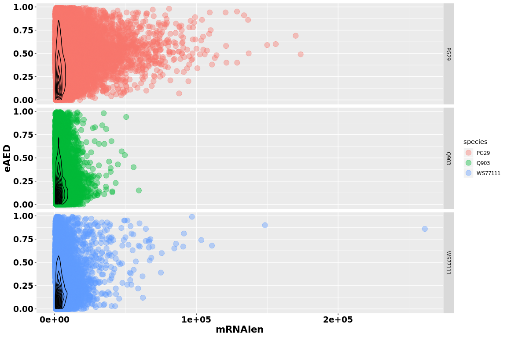

``` r
#zoomed region
ggplot(d,aes(mRNAlen,eAED)) + geom_point(aes(colour=species),size=4,alpha=0.4) + 
   geom_density2d(colour="black") +
   theme(axis.title.x = element_text(face='bold',size=16,hjust=0.5),
          axis.title.y = element_text(face='bold',size=16,vjust=1),
          axis.text.x = element_text(face='bold',size=14,color='black'),
          axis.text.y = element_text(face='bold',size=14,color='black')) + facet_grid(species ~.) +
          coord_cartesian(xlim=c(1000,10000))
```

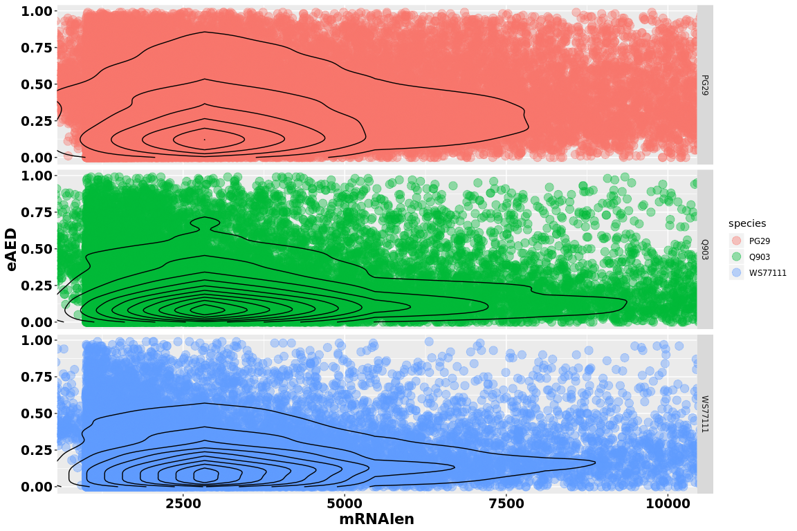

``` r
tapply(d$ProtLen, d$species, summary)
```

    ## $PG29
    ##    Min. 1st Qu.  Median    Mean 3rd Qu.    Max. 
    ##     4.0   120.0   232.0   298.2   398.0  4507.0 
    ## 
    ## $Q903
    ##    Min. 1st Qu.  Median    Mean 3rd Qu.    Max. 
    ##    25.0   197.0   324.0   369.1   474.0  4664.0 
    ## 
    ## $WS77111
    ##    Min. 1st Qu.  Median    Mean 3rd Qu.    Max. 
    ##    31.0   194.0   310.0   349.1   444.0  3617.0

``` r
tapply(d$eAED, d$species, summary)
```

    ## $PG29
    ##    Min. 1st Qu.  Median    Mean 3rd Qu.    Max. 
    ##  0.0000  0.1600  0.3100  0.3584  0.5300  0.9900 
    ## 
    ## $Q903
    ##    Min. 1st Qu.  Median    Mean 3rd Qu.    Max. 
    ##  0.0000  0.0900  0.1800  0.2428  0.3400  0.9900 
    ## 
    ## $WS77111
    ##    Min. 1st Qu.  Median    Mean 3rd Qu.    Max. 
    ##  0.0000  0.0800  0.1700  0.2288  0.3300  0.9900

``` r
ggplot(d,aes(ProtLen,eAED)) + geom_point(aes(colour=species),size=4,alpha=0.4) + 
   geom_density2d(colour="black") +
   theme(axis.title.x = element_text(face='bold',size=16,hjust=0.5),
          axis.title.y = element_text(face='bold',size=16,vjust=1),
          axis.text.x = element_text(face='bold',size=14,color='black'),
          axis.text.y = element_text(face='bold',size=14,color='black')) + facet_grid(species ~.)
```

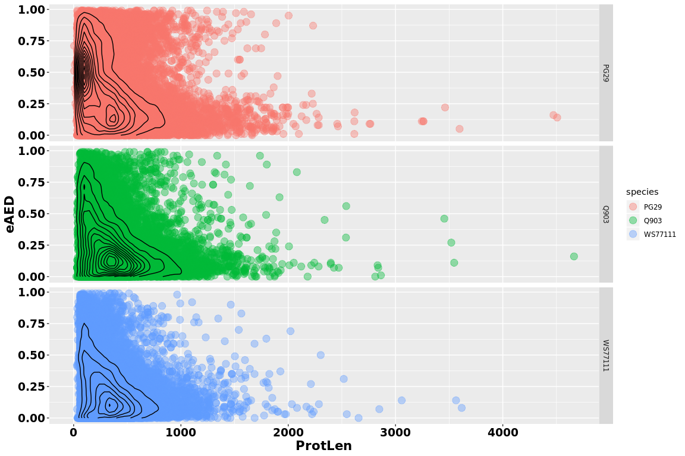

``` r
#zoomed region
ggplot(d,aes(ProtLen,eAED)) + geom_point(aes(colour=species),size=4,alpha=0.4) + 
   geom_density2d(colour="black") + 
   theme(axis.title.x = element_text(face='bold',size=16,hjust=0.5),
          axis.title.y = element_text(face='bold',size=16,vjust=1),
          axis.text.x = element_text(face='bold',size=14,color='black'),
          axis.text.y = element_text(face='bold',size=14,color='black')) + facet_grid(species ~.) +
          coord_cartesian(xlim=c(4,1000))
```

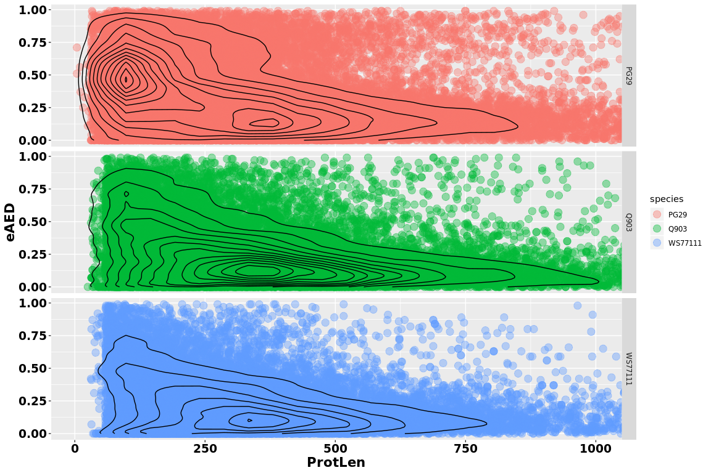

``` r
ggplot(d,aes(mRNAlen,ProtLen)) + geom_point(aes(colour=species),size=4,alpha=0.4) + 
   geom_density2d(colour="black") +
   theme(axis.title.x = element_text(face='bold',size=16,hjust=0.5),
          axis.title.y = element_text(face='bold',size=16,vjust=1),
          axis.text.x = element_text(face='bold',size=14,color='black'),
          axis.text.y = element_text(face='bold',size=14,color='black')) + facet_grid(species ~.)
```

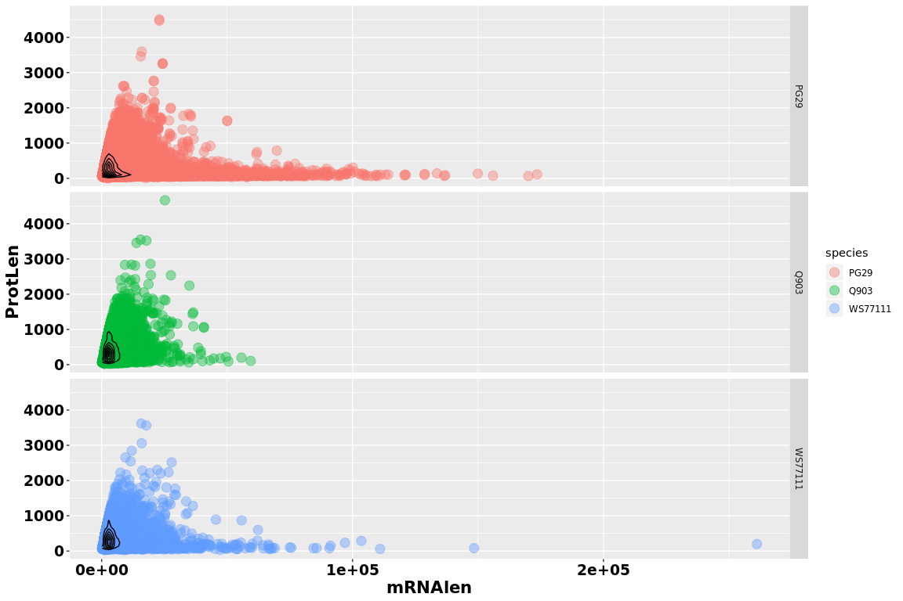

``` r
ggplot(d,aes(mRNAlen,fiveprimeLen)) + geom_point(aes(colour=species),size=4,alpha=0.4) + 
   geom_density2d(colour="black") +
   theme(axis.title.x = element_text(face='bold',size=16,hjust=0.5),
          axis.title.y = element_text(face='bold',size=16,vjust=1),
          axis.text.x = element_text(face='bold',size=14,color='black'),
          axis.text.y = element_text(face='bold',size=14,color='black')) + facet_grid(species ~.)
```

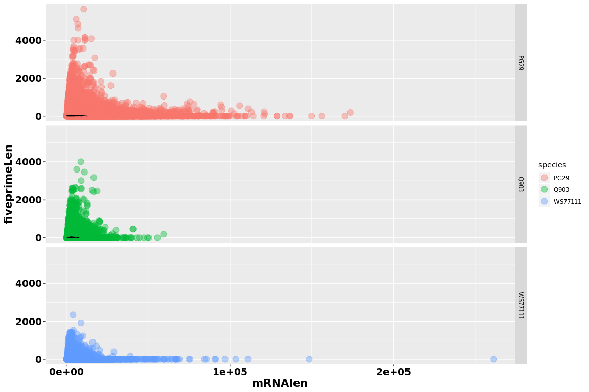

``` r
ggplot(d,aes(mRNAlen,threeprimeLen)) + geom_point(aes(colour=species),size=4,alpha=0.4) + 
   geom_density2d(colour="black") +
   theme(axis.title.x = element_text(face='bold',size=16,hjust=0.5),
          axis.title.y = element_text(face='bold',size=16,vjust=1),
          axis.text.x = element_text(face='bold',size=14,color='black'),
          axis.text.y = element_text(face='bold',size=14,color='black')) + facet_grid(species ~.)
```

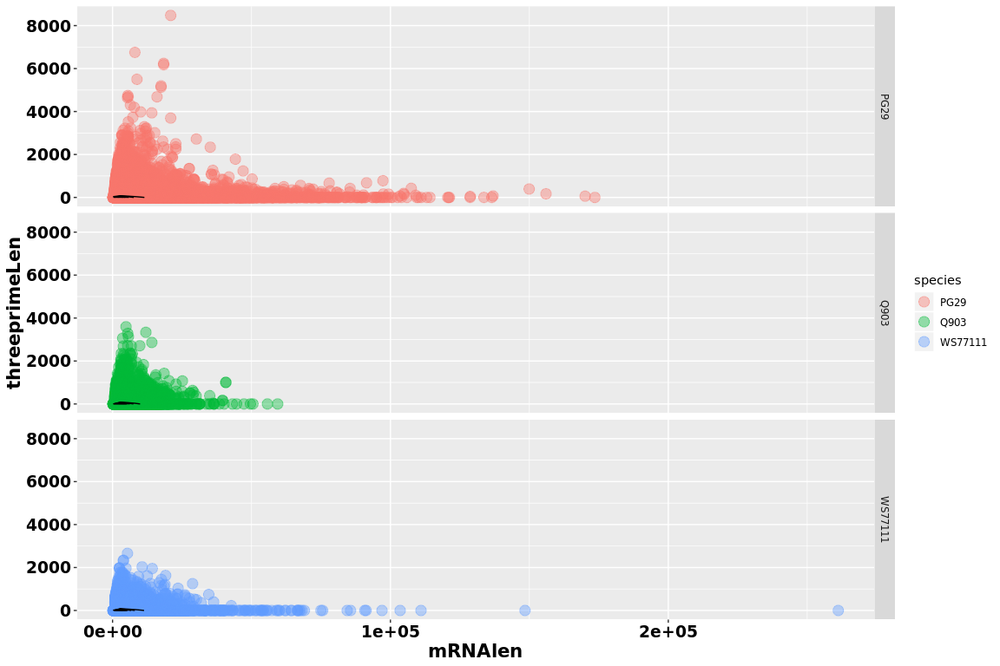

``` r
ggplot(d,aes(fiveprimeLen,eAED)) + geom_point(aes(colour=species),size=4,alpha=0.4) + 
   geom_density2d(colour="black") + 
   theme(axis.title.x = element_text(face='bold',size=16,hjust=0.5),
          axis.title.y = element_text(face='bold',size=16,vjust=1),
          axis.text.x = element_text(face='bold',size=14,color='black'),
          axis.text.y = element_text(face='bold',size=14,color='black')) + facet_grid(species ~.)
```

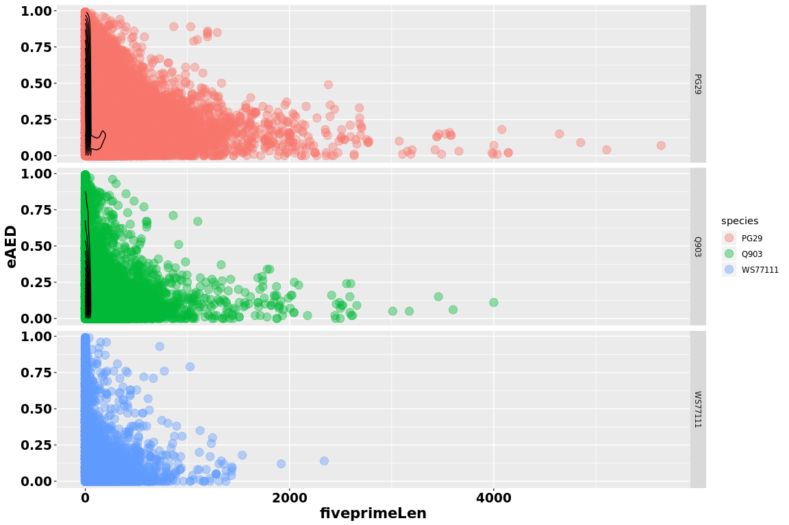

``` r
ggplot(d,aes(threeprimeLen,eAED)) + geom_point(aes(colour=species),size=4,alpha=0.4) + 
   geom_density2d(colour="black") +
   theme(axis.title.x = element_text(face='bold',size=16,hjust=0.5),
          axis.title.y = element_text(face='bold',size=16,vjust=1),
          axis.text.x = element_text(face='bold',size=14,color='black'),
          axis.text.y = element_text(face='bold',size=14,color='black')) + facet_grid(species ~.)
```

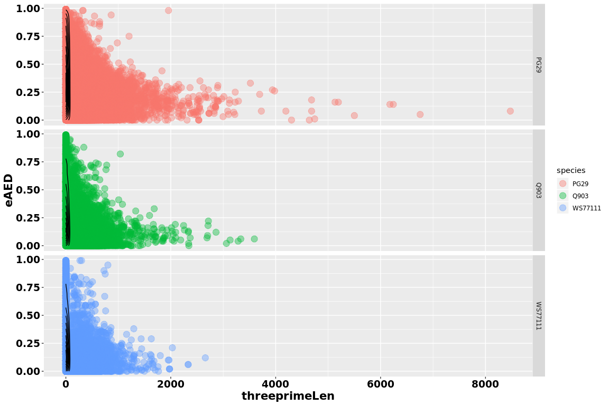

``` r
ggplot(d,aes(ng50,fiveprimeLen)) + geom_violin(aes(colour=species)) + 
   theme(axis.title.x = element_text(face='bold',size=16,hjust=0.5),
          axis.title.y = element_text(face='bold',size=16,vjust=1),
          axis.text.x = element_text(face='bold',size=14,color='black'),
          axis.text.y = element_text(face='bold',size=14,color='black'))
```

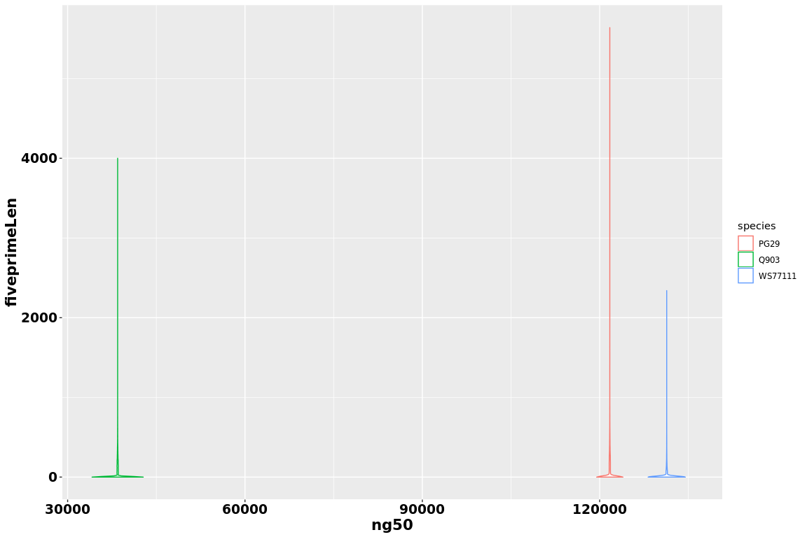

``` r
ggplot(d,aes(ng50,threeprimeLen)) + geom_violin(aes(colour=species)) + 
   theme(axis.title.x = element_text(face='bold',size=16,hjust=0.5),
          axis.title.y = element_text(face='bold',size=16,vjust=1),
          axis.text.x = element_text(face='bold',size=14,color='black'),
          axis.text.y = element_text(face='bold',size=14,color='black'))
```

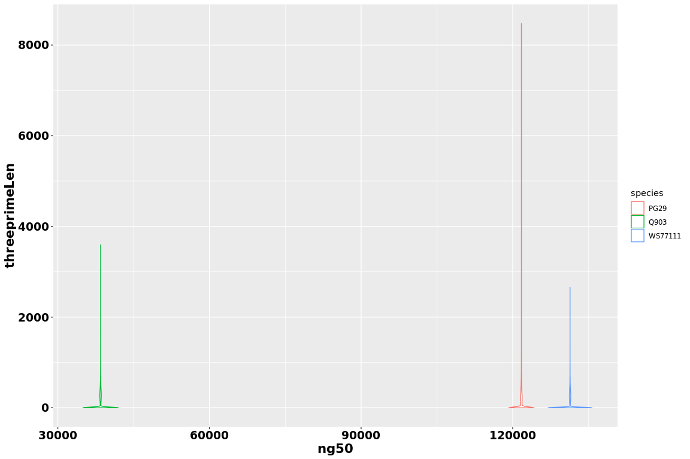

``` r
ggplot(d,aes(ng50,mRNAlen)) + geom_violin(aes(colour=species)) + 
   theme(axis.title.x = element_text(face='bold',size=16,hjust=0.5),
          axis.title.y = element_text(face='bold',size=16,vjust=1),
          axis.text.x = element_text(face='bold',size=14,color='black'),
          axis.text.y = element_text(face='bold',size=14,color='black'))
```

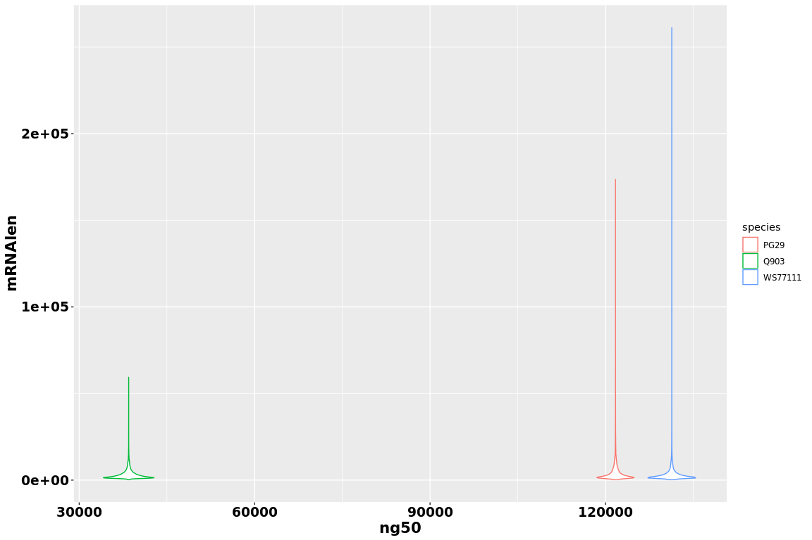

``` r
ggplot(d,aes(ng50,ProtLen)) + geom_violin(aes(colour=species)) + 
   theme(axis.title.x = element_text(face='bold',size=16,hjust=0.5),
          axis.title.y = element_text(face='bold',size=16,vjust=1),
          axis.text.x = element_text(face='bold',size=14,color='black'),
          axis.text.y = element_text(face='bold',size=14,color='black'))
```

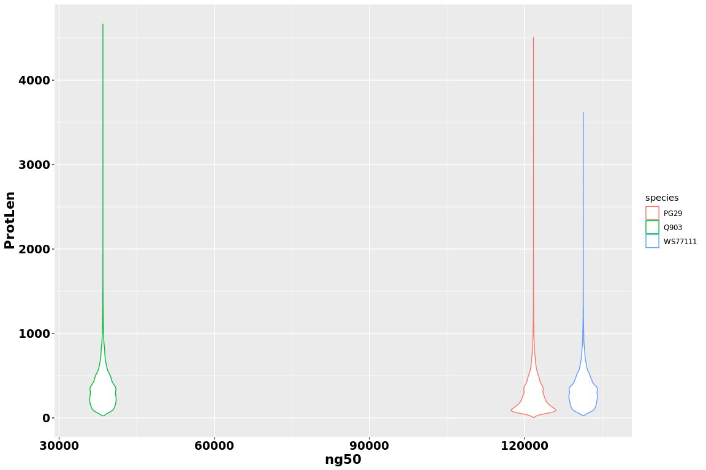

Statistics introns
------------------

``` r
#dataPath="/projects/spruceup_scratch/dev/SprucePaper2018/TestScoresAnnotation/StatseAEDfeatures"
allFiles <- list.files( path = dataPath, pattern = ".introns2", full.names = TRUE )

l <- lapply( allFiles, function( fn ){
  d1 <- read.table( fn, header = F );
  d1$fileName <- fn;
  d1
  } );

d1<- bind_rows( l );
dim(d1)
```

    ## [1] 260108      3

``` r
d1$species = gsub(".introns2","",sapply(strsplit(d1$fileName,"/"),"[[",8))

colnames(d1) = c("trans_introns","intron_len","fileNam","species")

d1$trans = sapply(strsplit(d1$trans_intron,"\\|"),"[[",1)
d1$trans_species = paste(d1$trans,d1$species,sep="|")

tapply(d1$intron_len, d1$species, summary)
```

    ## $PG29
    ##    Min. 1st Qu.  Median    Mean 3rd Qu.    Max. 
    ##       9     105     224    1754     936  172605 
    ## 
    ## $Q903
    ##    Min. 1st Qu.  Median    Mean 3rd Qu.    Max. 
    ##     9.0   104.0   185.0   687.7   579.8 43536.0 
    ## 
    ## $WS77111
    ##     Min.  1st Qu.   Median     Mean  3rd Qu.     Max. 
    ##      9.0    106.0    180.0    844.9    549.0 163083.0

``` r
d1eAED = merge(d[,c("eAED","trans_species","ng50")],d1,by="trans_species",all.y = T)
```

Statistics eAED
---------------

``` r
ggplot(d1eAED,aes(intron_len,eAED)) + geom_point(aes(colour=species),size=4,alpha=0.4) + 
   geom_density2d(colour="black") +
   theme(axis.title.x = element_text(face='bold',size=16,hjust=0.5),
          axis.title.y = element_text(face='bold',size=16,vjust=1),
          axis.text.x = element_text(face='bold',size=14,color='black'),
          axis.text.y = element_text(face='bold',size=14,color='black')) + facet_grid(species ~.)
```

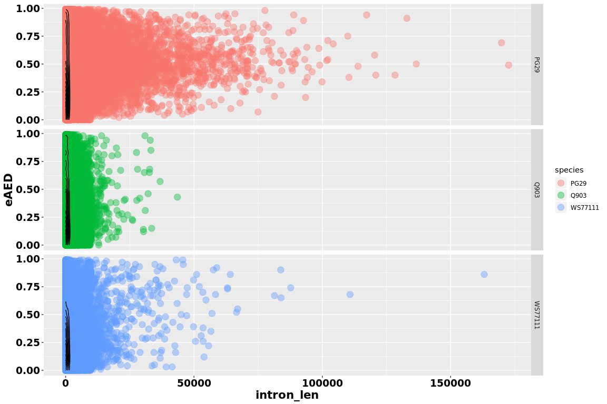

``` r
ggplot(d1eAED,aes(ng50,intron_len)) + geom_violin(aes(colour=species)) + 
   theme(axis.title.x = element_text(face='bold',size=16,hjust=0.5),
          axis.title.y = element_text(face='bold',size=16,vjust=1),
          axis.text.x = element_text(face='bold',size=14,color='black'),
          axis.text.y = element_text(face='bold',size=14,color='black'))
```

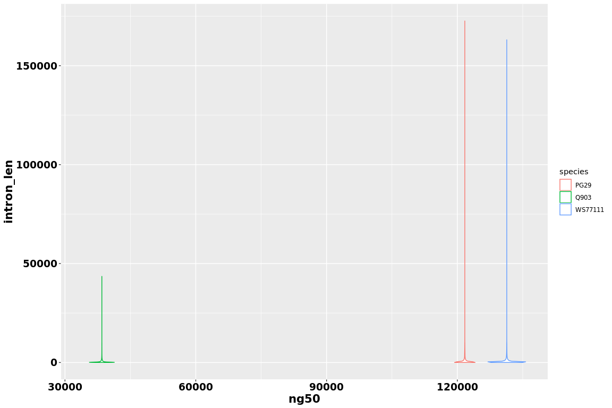
