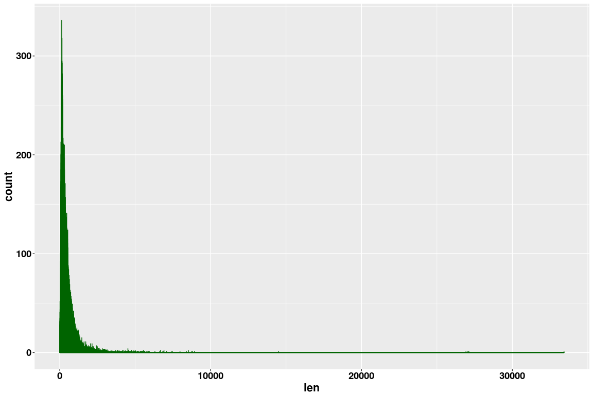
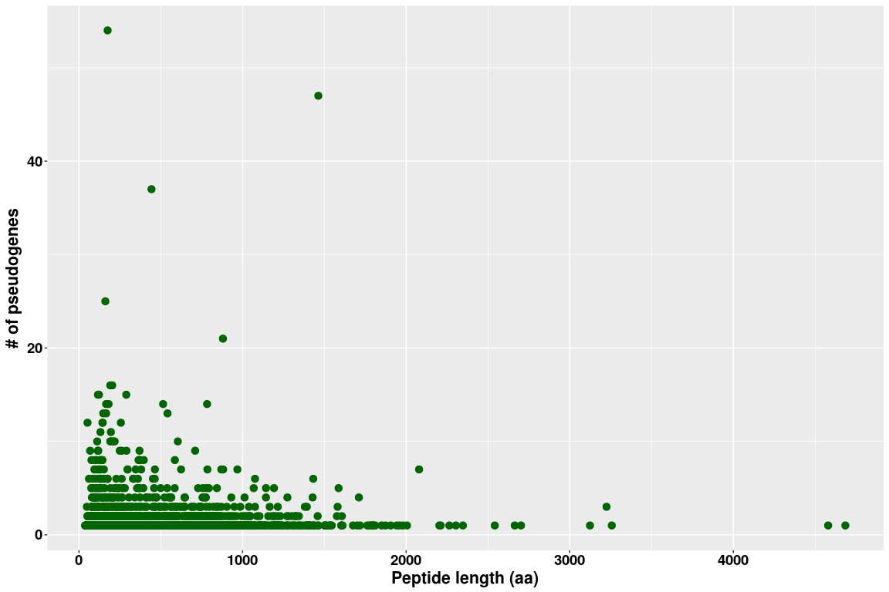
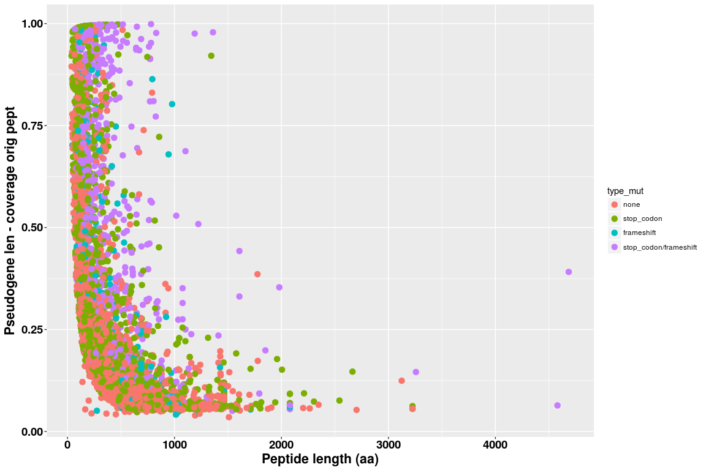
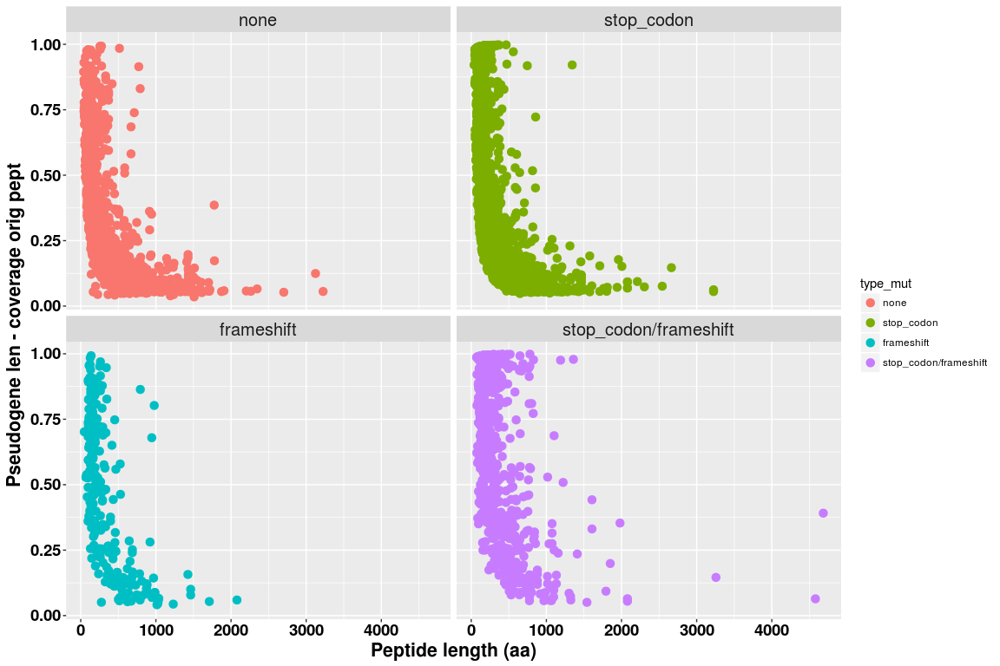
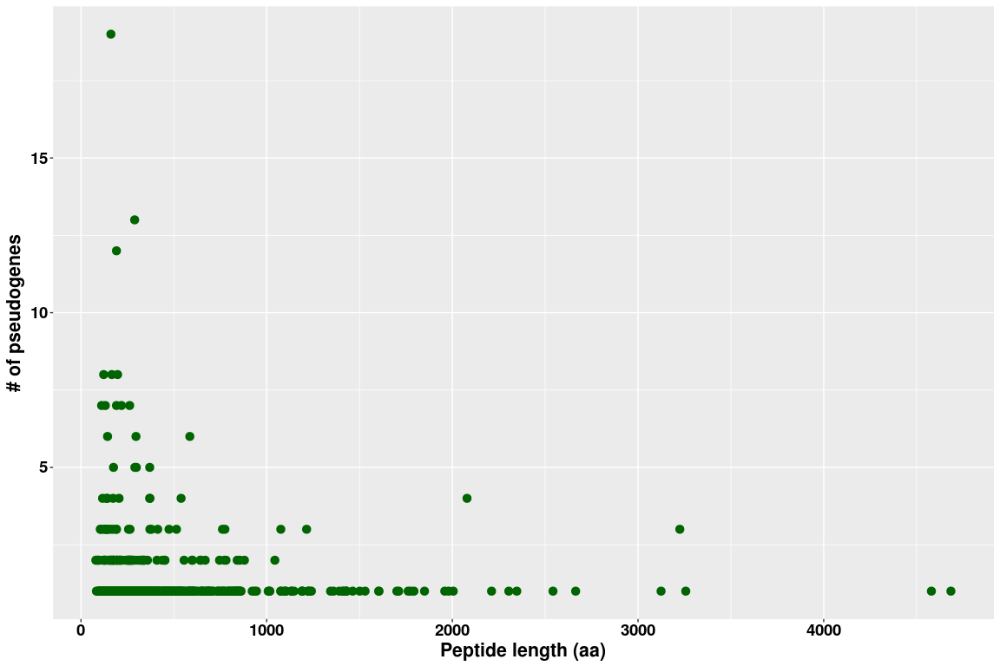
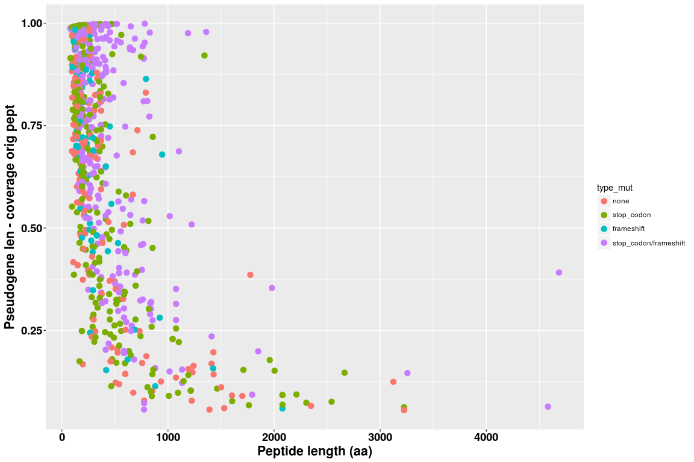
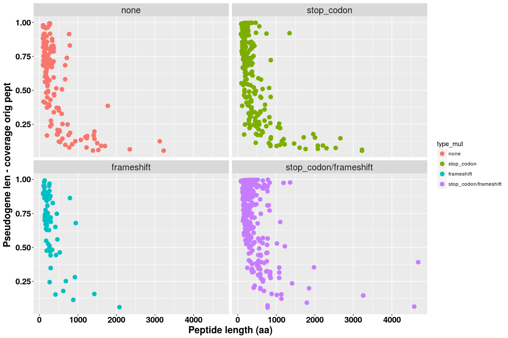
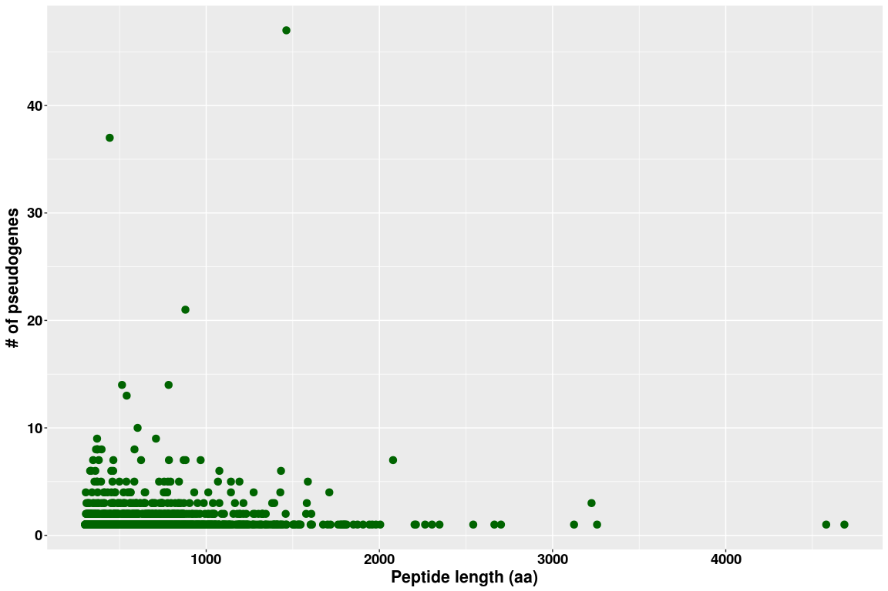
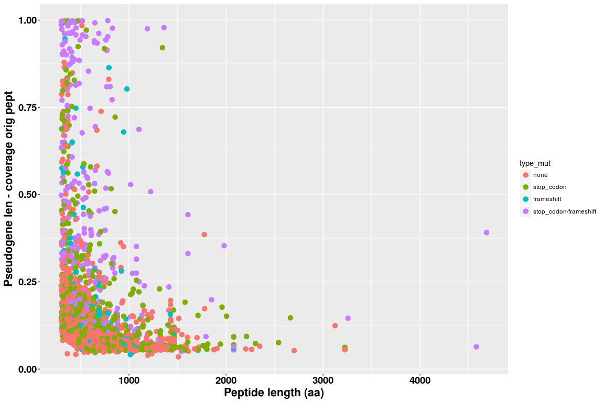
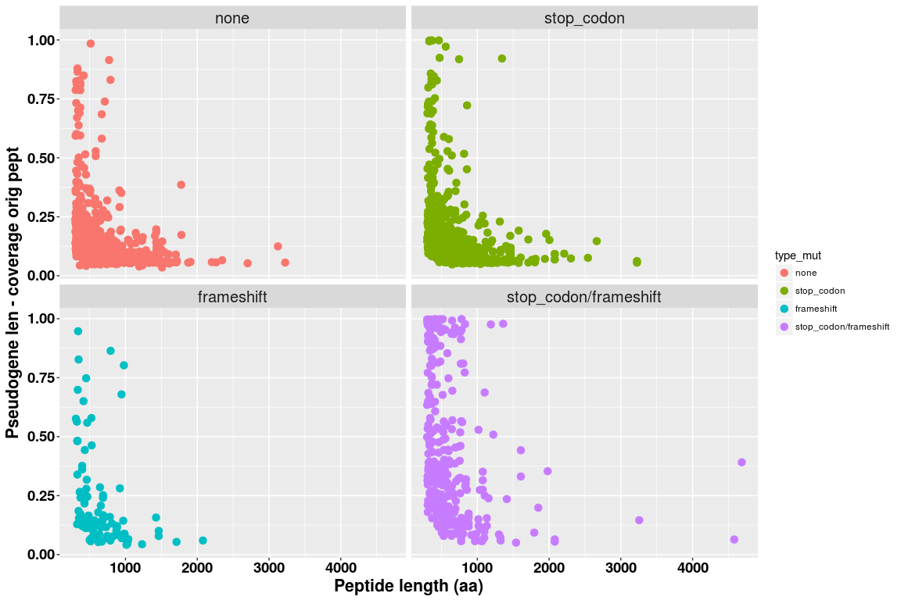

Analysis of pseudogenes Human GRCh38 - Ens 90 - Maker-P
================

Load and process data
---------------------

``` r
library(ggplot2)

d = read.table(gzfile("/projects/btl/kgagalova/PHD_projects2/SpruceUp/GenomeAnnotation/WS77111/data/Pseudogenes/OutForR_pseudoHuman.txt.gz"),header=F)
nams=c("trans","contig","coord","eval","stop_high","stop_low","frame_high","farme_low")
colnames(d) = nams
#convert to char
d$trans = as.character(d$trans)
d$contig = as.character(d$contig)
d$coord = as.character(d$coord)
d$start_match_prot= sapply(strsplit(sapply(strsplit(d$coord,":"),"[[",1),"-"),"[[",1)
d$stop_match_prot= sapply(strsplit(sapply(strsplit(d$coord,":"),"[[",1),"-"),"[[",2)
d$start_match_prot = as.numeric(d$start_match_prot)
d$stop_match_prot = as.numeric(d$stop_match_prot)
d$len_align = d$stop_match_prot - d$start_match_prot
d$prot_nam = sapply(strsplit(d$trans,"_protein"),"[[",1)

#load prot lens
lens = read.table("/projects/btl/kgagalova/PHD_projects2/SpruceUp/GenomeAnnotation/WS77111/data/Pseudogenes/mart_exportAllPep.90protCodingExclAlterante.len")
colnames(lens) = c("prot_nam","len")
lens$prot_nam = as.character(lens$prot_nam)
d1 = merge(d,lens,by="prot_nam")
d1$perc_align = d1$len_align / d1$len
d1$contig1 = sapply(strsplit(d1$contig,":"),"[[",1) 
d1$start_coord = sapply(strsplit(sapply(strsplit(d1$contig,"\\|"),"[[",2),"-"),"[[",1)
d1$stop_coord = sapply(strsplit(sapply(strsplit(d1$contig,"\\|"),"[[",2),"-"),"[[",2)
d1$contig2 = paste(d1$contig1,d1$start_coord,d1$stop_coord,sep="_")

stop_c = ifelse(d1$stop_high > 0, "stop_codon", "none")
framesh = ifelse(d1$frame_high > 0, "frameshift", "none")

chech_mut <-function(stopc,fr){
  type_mut = c()
  for(i in 1:length(stopc)){
    si = stopc[i]
    fi = fr[i]
    #print(si)
    #print(fi)
    if (si == "stop_codon" && fi == "none") {
      type_mut = c(type_mut,"stop_codon")
    } else if(si == "none" && fi == "frameshift") {
      type_mut = c(type_mut,"frameshift")
    } else if(si == "stop_codon" && fi == "frameshift") {
      type_mut = c(type_mut,"stop_codon/frameshift")
    } else 
      type_mut = c(type_mut,"none")
  }
  return(type_mut)
  }

type_mut = chech_mut(stop_c, framesh)
d1$type_mut = factor(type_mut,levels = c("none", "stop_codon","frameshift","stop_codon/frameshift"))
```

``` r
ggplot(lens, aes(x=len)) + geom_histogram(color="darkgreen", fill="white", binwidth=2) + 
        theme(axis.title.x = element_text(face='bold',size=16,hjust=0.5),
          axis.title.y = element_text(face='bold',size=16,vjust=1),
          axis.text.x = element_text(face='bold',size=14,color='black'),
          axis.text.y = element_text(face='bold',size=14,color='black'))
```



``` r
summary(lens$len)
```

    ##    Min. 1st Qu.  Median    Mean 3rd Qu.    Max. 
    ##       1     161     312     449     562   33424

Plot distributions
------------------

``` r
d1_counts = as.data.frame(table(d1$prot_nam))
d2_counts = merge(d1_counts,lens, by.x="Var1",by.y="prot_nam")
d2_counts = d2_counts[with(d2_counts, order(len)),]

ggplot(d2_counts, aes(len,Freq)) + geom_point(size = 3,colour="darkgreen") + ylab("# of pseudogenes") + xlab("Peptide length (aa)") +
      theme(axis.title.x = element_text(face='bold',size=16,hjust=0.5),
          axis.title.y = element_text(face='bold',size=16,vjust=1),
          axis.text.x = element_text(face='bold',size=14,color='black'),
          axis.text.y = element_text(face='bold',size=14,color='black'))
```



``` r
summary(d2_counts$Freq)
```

    ##    Min. 1st Qu.  Median    Mean 3rd Qu.    Max. 
    ##   1.000   1.000   1.000   1.633   1.000  54.000

``` r
nrow(d2_counts)
```

    ## [1] 2753

``` r
ggplot(d1, aes(len,perc_align,colour=type_mut)) + geom_point(size = 3) + ylab("Pseudogene len - coverage orig pept") + xlab("Peptide length (aa)") + 
      theme(axis.title.x = element_text(face='bold',size=16,hjust=0.5),
          axis.title.y = element_text(face='bold',size=16,vjust=1),
          axis.text.x = element_text(face='bold',size=14,color='black'),
          axis.text.y = element_text(face='bold',size=14,color='black'))
```



``` r
ggplot(d1, aes(len,perc_align,colour=type_mut)) + geom_point(size = 3) + ylab("Pseudogene len - coverage orig pept") + xlab("Peptide length (aa)") + 
      theme(axis.title.x = element_text(face='bold',size=16,hjust=0.5),
          axis.title.y = element_text(face='bold',size=16,vjust=1),
          axis.text.x = element_text(face='bold',size=14,color='black'),
          axis.text.y = element_text(face='bold',size=14,color='black'),
          strip.text = element_text(size=15) ) + 
      facet_wrap( ~ type_mut )
```



``` r
table(d1$type_mut)
```

    ## 
    ##                  none            stop_codon            frameshift 
    ##                  2051                  1535                   256 
    ## stop_codon/frameshift 
    ##                   655

``` r
#genomic region covered by pseudogenes
sum(as.numeric(d1$stop_coord) - as.numeric(d1$start_coord))
```

    ## [1] 4766752

``` r
no_mutd1 = subset(d1,d1$type_mut == "none")
sum(as.numeric(no_mutd1$stop_coord) - as.numeric(no_mutd1$start_coord))
```

    ## [1] 1463245

``` r
stopd1 = subset(d1,d1$type_mut == "stop_codon")
framed1 = subset(d1,d1$type_mut == "frameshift")
stopframed1 = subset(d1,d1$type_mut == "stop_codon/frameshift")

sum(as.numeric(stopd1$stop_coord) - as.numeric(stopd1$start_coord))
```

    ## [1] 896298

``` r
sum(as.numeric(framed1$stop_coord) - as.numeric(framed1$start_coord))
```

    ## [1] 238120

``` r
sum(as.numeric(stopframed1$stop_coord) - as.numeric(stopframed1$start_coord))
```

    ## [1] 2169089

``` r
d1eval = subset(d1, d1$eval<1e-50)
d1eval_counts = as.data.frame(table(d1eval$prot_nam))

d2eval_counts = merge(d1eval_counts,lens, by.x="Var1",by.y="prot_nam")
d2eval_counts = d2eval_counts[with(d2eval_counts, order(len)),]

ggplot(d2eval_counts, aes(len,Freq)) + geom_point(size = 3,colour="darkgreen") + ylab("# of pseudogenes") + xlab("Peptide length (aa)") +
      theme(axis.title.x = element_text(face='bold',size=16,hjust=0.5),
          axis.title.y = element_text(face='bold',size=16,vjust=1),
          axis.text.x = element_text(face='bold',size=14,color='black'),
          axis.text.y = element_text(face='bold',size=14,color='black'))
```



``` r
summary(d2eval_counts$Freq)
```

    ##    Min. 1st Qu.  Median    Mean 3rd Qu.    Max. 
    ##   1.000   1.000   1.000   1.466   1.000  19.000

``` r
nrow(d2eval_counts)
```

    ## [1] 569

``` r
ggplot(d1eval, aes(len,perc_align,colour=type_mut)) + geom_point(size = 3) + ylab("Pseudogene len - coverage orig pept") + xlab("Peptide length (aa)") + 
      theme(axis.title.x = element_text(face='bold',size=16,hjust=0.5),
          axis.title.y = element_text(face='bold',size=16,vjust=1),
          axis.text.x = element_text(face='bold',size=14,color='black'),
          axis.text.y = element_text(face='bold',size=14,color='black'))
```



``` r
ggplot(d1eval, aes(len,perc_align,colour=type_mut)) + geom_point(size = 3) + ylab("Pseudogene len - coverage orig pept") + xlab("Peptide length (aa)") + 
      theme(axis.title.x = element_text(face='bold',size=16,hjust=0.5),
          axis.title.y = element_text(face='bold',size=16,vjust=1),
          axis.text.x = element_text(face='bold',size=14,color='black'),
          axis.text.y = element_text(face='bold',size=14,color='black'),
          strip.text = element_text(size=15) ) + 
      facet_wrap( ~ type_mut )
```



``` r
table(d1eval$type_mut)
```

    ## 
    ##                  none            stop_codon            frameshift 
    ##                   160                   287                    70 
    ## stop_codon/frameshift 
    ##                   317

``` r
lens_long = subset(lens, lens$len>300)

d2_countsLong = merge(d1_counts,lens_long, by.x="Var1",by.y="prot_nam")
d2_countsLong = d2_countsLong[with(d2_countsLong, order(len)),]

ggplot(d2_countsLong, aes(len,Freq)) + geom_point(size = 3,colour="darkgreen") + ylab("# of pseudogenes") + xlab("Peptide length (aa)") +
      theme(axis.title.x = element_text(face='bold',size=16,hjust=0.5),
          axis.title.y = element_text(face='bold',size=16,vjust=1),
          axis.text.x = element_text(face='bold',size=14,color='black'),
          axis.text.y = element_text(face='bold',size=14,color='black'))
```



``` r
summary(d2_countsLong$Freq)
```

    ##    Min. 1st Qu.  Median    Mean 3rd Qu.    Max. 
    ##   1.000   1.000   1.000   1.508   1.000  47.000

``` r
nrow(d2_countsLong)
```

    ## [1] 1532

``` r
d1_long = d1[d1$prot_nam %in% lens_long$prot_nam,]
ggplot(d1_long, aes(len,perc_align,colour=type_mut)) + geom_point(size = 3) + ylab("Pseudogene len - coverage orig pept") + xlab("Peptide length (aa)") + 
      theme(axis.title.x = element_text(face='bold',size=16,hjust=0.5),
          axis.title.y = element_text(face='bold',size=16,vjust=1),
          axis.text.x = element_text(face='bold',size=14,color='black'),
          axis.text.y = element_text(face='bold',size=14,color='black'))
```



``` r
ggplot(d1_long, aes(len,perc_align,colour=type_mut)) + geom_point(size = 3) + ylab("Pseudogene len - coverage orig pept") + xlab("Peptide length (aa)") + 
      theme(axis.title.x = element_text(face='bold',size=16,hjust=0.5),
          axis.title.y = element_text(face='bold',size=16,vjust=1),
          axis.text.x = element_text(face='bold',size=14,color='black'),
          axis.text.y = element_text(face='bold',size=14,color='black'),
          strip.text = element_text(size=15) ) + 
      facet_wrap( ~ type_mut )
```



``` r
table(d1_long$type_mut)
```

    ## 
    ##                  none            stop_codon            frameshift 
    ##                  1142                   750                   101 
    ## stop_codon/frameshift 
    ##                   317
