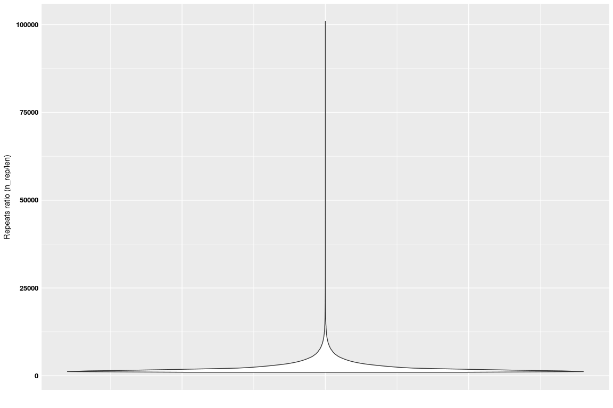

Repeats in WS77111 - genome annotation
================

Load the data
-------------

``` r
rep_ws <- read.delim("/projects/btl/kgagalova/PHD_projects2/SpruceUp/GenomeAnnotation/WS77111/data/RepeatMasking/WS77111-v2_all.masked", header=FALSE)
nams = c("contig","len","reps","gaps")
colnames(rep_ws) = nams
```

Plot repeats and gaps
---------------------

``` r
library(ggplot2)
p <- ggplot(rep_ws, aes(len, reps))
p + geom_point(aes(color = gaps))
```


``` r
#zoomed region
p <- ggplot(rep_ws, aes(len, reps))
p + geom_point(aes(color = gaps)) + scale_x_continuous(limits = c(0, 1000000)) + scale_y_continuous(limits = c(0, 500000))
```


Ratio repeats or Ns
-------------------

``` r
rep_ws$ratio_reps = round(rep_ws$reps / rep_ws$len, 3)
rep_ws$ratio_gaps = round(rep_ws$gaps / rep_ws$len, 3)

summary(rep_ws$ratio_reps)
```

    ##    Min. 1st Qu.  Median    Mean 3rd Qu.    Max. 
    ##  0.0000  0.6520  0.9880  0.8071  1.0000  1.0000

``` r
# Box plot with dot plot
ggplot(rep_ws, aes(x=1,y=ratio_reps)) + 
  geom_violin() + 
  xlab(" ") +
  ylab("Repeats ratio (n_rep/len)") +
  theme(axis.title.x = element_text(face='bold',size=16,hjust=0.5),
          axis.title.y = element_text(), 
          axis.text.x = element_blank(), axis.ticks=element_blank(),
          axis.text.y = element_text(face='bold',size=10,color='black'))
```


``` r
################################################################################################
#check how many targets have 100% ratio 
total_repeats = subset(rep_ws,rep_ws$ratio_reps == 1)[c("contig","len")]
nrow(total_repeats)
```

    ## [1] 704770

``` r
summary(total_repeats$len)
```

    ##    Min. 1st Qu.  Median    Mean 3rd Qu.    Max. 
    ##    1000    1285    1706    2271    2617   51058

``` r
ggplot(total_repeats, aes(1,y=len)) + 
  geom_violin() + 
  xlab(" ") +
  ylab("Repeats ratio (n_rep/len)") +
  theme(axis.title.x = element_text(face='bold',size=16,hjust=0.5),
          axis.title.y = element_text(), 
          axis.text.x = element_blank(), axis.ticks=element_blank(),
          axis.text.y = element_text(face='bold',size=10,color='black'))
```


``` r
################################################################################################
#check how many targets have 95% ratio 
total_repeats095 = subset(rep_ws,rep_ws$ratio_reps >= 0.95)[c("contig","len")]
nrow(total_repeats095)
```

    ## [1] 1391792

``` r
summary(total_repeats095$len)
```

    ##    Min. 1st Qu.  Median    Mean 3rd Qu.    Max. 
    ##    1000    1326    1802    2580    2952   81814

``` r
ggplot(total_repeats095, aes(1,y=len)) + 
  geom_violin() + 
  xlab(" ") +
  ylab("Repeats ratio (n_rep/len)") +
  theme(axis.title.x = element_text(face='bold',size=16,hjust=0.5),
          axis.title.y = element_text(), 
          axis.text.x = element_blank(), axis.ticks=element_blank(),
          axis.text.y = element_text(face='bold',size=10,color='black'))
```


``` r
################################################################################################
#check how many targets have 90% ratio 
total_repeats09 = subset(rep_ws,rep_ws$ratio_reps >= 0.9)[c("contig","len")]
nrow(total_repeats09)
```

    ## [1] 1501602

``` r
summary(total_repeats09$len)
```

    ##    Min. 1st Qu.  Median    Mean 3rd Qu.    Max. 
    ##    1000    1342    1846    2717    3101  100909

``` r
ggplot(total_repeats09, aes(1,y=len)) + 
  geom_violin() + 
  xlab(" ") +
  ylab("Repeats ratio (n_rep/len)") +
  theme(axis.title.x = element_text(face='bold',size=16,hjust=0.5),
          axis.title.y = element_text(), 
          axis.text.x = element_blank(), axis.ticks=element_blank(),
          axis.text.y = element_text(face='bold',size=10,color='black'))
```



``` r
toKeep090 = subset(rep_ws,rep_ws$ratio_reps < 0.90 & rep_ws$len >= 70000)
nrow(toKeep090)
```

    ## [1] 58873

``` r
toKeep090_2 = subset(rep_ws,rep_ws$ratio_reps < 0.90 & rep_ws$len >= 35000)
nrow(toKeep090_2)
```

    ## [1] 90329

``` r
#----------------------------------------------------------------------------
toKeep095 = subset(rep_ws,rep_ws$ratio_reps < 0.95 & rep_ws$len >= 140000)
nrow(toKeep095)
```

    ## [1] 34877

``` r
toKeep095_1 = subset(rep_ws,rep_ws$ratio_reps < 0.95 & rep_ws$len >= 70000)
nrow(toKeep095_1)
```

    ## [1] 58886

``` r
toKeep095_3 = subset(rep_ws,rep_ws$ratio_reps < 0.95 & rep_ws$len >= 60000)
nrow(toKeep095_3)
```

    ## [1] 65009

``` r
toKeep095_4 = subset(rep_ws,rep_ws$ratio_reps < 0.95 & rep_ws$len >= 50000)
nrow(toKeep095_4)
```

    ## [1] 72806

``` r
toKeep095_5 = subset(rep_ws,rep_ws$ratio_reps < 0.95 & rep_ws$len >= 40000)
nrow(toKeep095_5)
```

    ## [1] 83466

``` r
toKeep095_6 = subset(rep_ws,rep_ws$ratio_reps < 0.95 & rep_ws$len >= 30000)
nrow(toKeep095_6)
```

    ## [1] 99198

``` r
toKeep095_7 = subset(rep_ws,rep_ws$ratio_reps < 0.95 & rep_ws$len >= 20000)
nrow(toKeep095_7)
```

    ## [1] 130882

``` r
setwd("/projects/btl/kgagalova/PHD_projects2/SpruceUp/GenomeAnnotation/WS77111/data/RepeatMasking")
write.table(rep_ws,"WS77111-v2_all.stats",quote=F,row.names=F,col.names=T)
```
