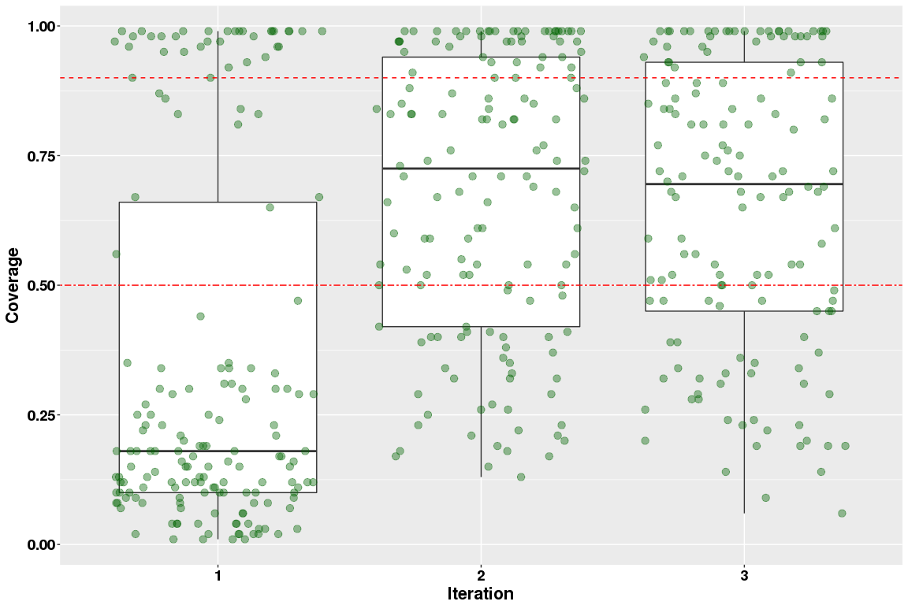
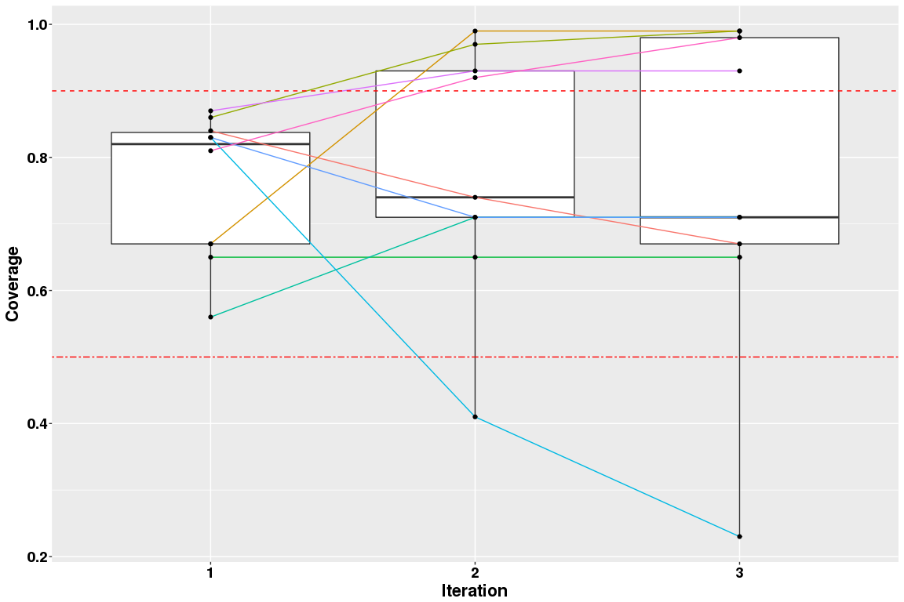
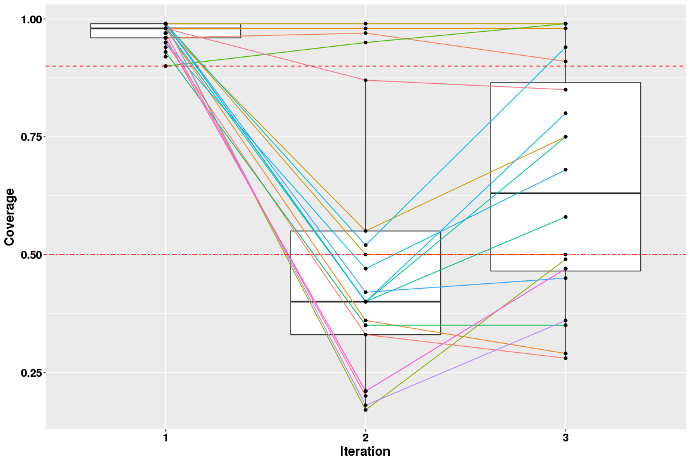
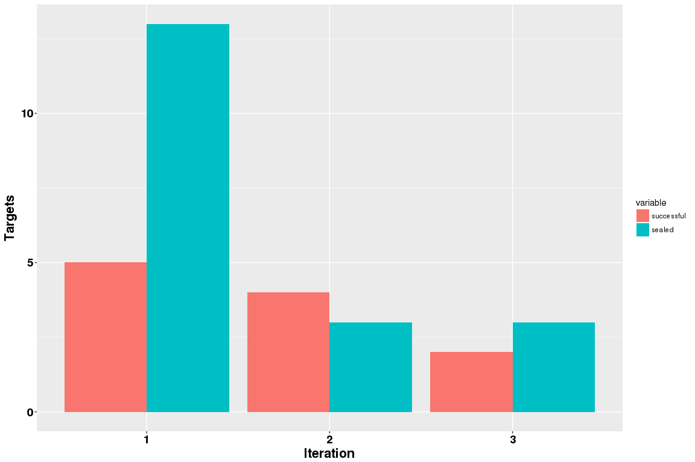
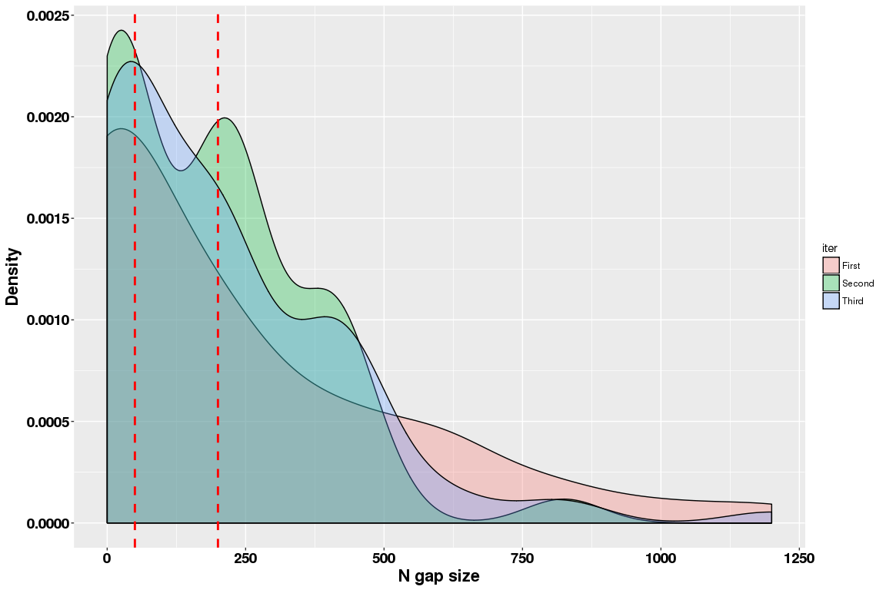

TPS Kollector assembly
================

Coverage progression with iterations
------------------------------------

``` r
library( dplyr )
library( ggplot2 )
library( tidyr )
library( data.table )

dataPath="/projects/btl/scratch/kgagalova/Analysis/TPS_kollector/PG29"
allFiles <- list.files( path = dataPath, pattern = ".txt", full.names = TRUE )

l <- lapply( allFiles, function( fn ){
  d <- read.table( fn, header = F );
  d$fileName <- fn;
  d
  } );

d <- bind_rows( l );

iter = gsub("cov","",gsub(".txt", "", sapply(strsplit(sapply(strsplit(d$fileName,"/"),"[[",9),"\\_"),"[[",2)))
d$iteration=as.factor(iter)
names(d)[c(1,2)] = c("cov", "target")
```

``` r
ggplot(d, aes(iteration,cov)) +
    geom_boxplot(outlier.size=NA) +
    geom_jitter(aes(iteration,cov),
               position=position_jitter(width=0.4,height=0),
               alpha=0.4,
               size=3,
               colour="darkgreen") +
    xlab("Iteration") +
    ylab("Coverage") +
    theme(axis.title.x = element_text(face='bold',size=16,hjust=0.5),
          axis.title.y = element_text(face='bold',size=16,vjust=1),
          axis.text.x = element_text(face='bold',size=14,color='black'),
          axis.text.y = element_text(face='bold',size=14,color='black')) + 
    geom_hline(yintercept = 0.5,colour="red",linetype="twodash") +
    geom_hline(yintercept = 0.9,colour="red",linetype="dashed") + 
    scale_colour_gradientn(colours = terrain.colors(10))
```



``` r
targetsItPartial1 = subset(d,d$cov > 0.5 & d$cov < 0.9 & d$iteration==1)$target
d1=d[d$target %in% targetsItPartial1,]

ggplot(d1, aes(x = iteration, y = cov)) +
  geom_boxplot(outlier.shape = NA) +
  geom_line(aes(group = target,colour=target)) +
  geom_point() + 
  xlab("Iteration") +
  ylab("Coverage") +
  theme(axis.title.x = element_text(face='bold',size=16,hjust=0.5),
          axis.title.y = element_text(face='bold',size=16,vjust=1),
          axis.text.x = element_text(face='bold',size=14,color='black'),
          axis.text.y = element_text(face='bold',size=14,color='black')) +
  geom_hline(yintercept = 0.5,colour="red",linetype="twodash") +
  geom_hline(yintercept = 0.9,colour="red",linetype="dashed") +
  theme(legend.position="none")
```



``` r
targetsItSucc1 = subset(d,d$cov >= 0.9 & d$iteration==1)$target
d2=d[d$target %in% targetsItSucc1,]

ggplot(d2, aes(x = iteration, y = cov)) +
  geom_boxplot(outlier.shape = NA) +
  geom_line(aes(group = target,colour=target)) +
  geom_point() + 
  xlab("Iteration") +
  ylab("Coverage") +
  theme(axis.title.x = element_text(face='bold',size=16,hjust=0.5),
          axis.title.y = element_text(face='bold',size=16,vjust=1),
          axis.text.x = element_text(face='bold',size=14,color='black'),
          axis.text.y = element_text(face='bold',size=14,color='black')) +
  geom_hline(yintercept = 0.5,colour="red",linetype="twodash") +
  geom_hline(yintercept = 0.9,colour="red",linetype="dashed") +
  theme(legend.position="none")
```



LOad the data from fasta stats
------------------------------

``` r
library( dplyr )
library( ggplot2 )
library( tidyr )
library( data.table )

dataPath="/projects/spruceup_scratch/dev/kollector_comparativeGen/Kollector_runs/TPS_kollector/PG29/AssembledTargets/ListsProgressIterations"

#assembled
allFilesAss <- list.files( path = dataPath, pattern = "Assembled.txt", full.names = TRUE )

l <- lapply( allFilesAss, function( fn ){
  d <- read.table( fn, header = F );
  d$fileName <- fn;
  d
  } );

dAss <- bind_rows( l );
dim(dAss)
```

    ## [1] 136  14

``` r
dAss$iter = gsub("ItSealedPolish.txt", "", gsub("ItAssembled.txt","",sapply(strsplit(dAss$fileName,"/"),"[[",11)))
dAss$target = gsub("TPS_targets_","",sapply(strsplit(dAss$V1,"-"),"[[",2))

#sealed
allFilesSeal <- list.files( path = dataPath, pattern = "Polish.txt", full.names = TRUE )

l <- lapply( allFilesSeal, function( fn ){
  d <- read.table( fn, header = F );
  d$fileName <- fn;
  d
  } );

dSeal <- bind_rows( l );
dim(dSeal)
```

    ## [1] 284  14

``` r
dSeal$iter = gsub("ItSealedPolish.txt", "", gsub("ItAssembled.txt","",sapply(strsplit(dSeal$fileName,"/"),"[[",11)))
dSeal$target = sapply(strsplit(sapply(strsplit(sapply(strsplit(dSeal$V1,":"),"[[",2),"_"), "[[",3),"\\."),"[[",1)

#assign names
nams = c("chr","length", "A", "C", "G", "T", "ambIUPAC2", "ambIUPAC3", "N", "CpG", "tv", "ts", "CpG-ts","file","iter","target")
colnames(dAss) =nams
colnames(dSeal) =nams
```

``` r
#make the intervals
d_suc = subset(dAss,dAss$N == 0)
d_seal = subset(dSeal,dSeal$N == 0)

whiteList = apply( dAss[ , c("iter","target") ] , 1 , paste , collapse = "_" )
d_seal$collapsed = apply( d_seal[ , c("iter","target") ] , 1 , paste , collapse = "_" )

d_seal = d_seal[d_seal$collapsed %in% whiteList,]

df = data.frame(successful =(d_suc %>% group_by(iter) %>% count(iter))$n, sealed = (d_seal %>% group_by(iter) %>% count(iter))$n , iter = c("1", "2", "3"))
df = melt(df)
ggplot(df, aes(iter, value, fill=variable)) + 
      geom_bar(position="dodge",stat="identity") +
      xlab("Iteration") +
      ylab("Targets") +
      theme(axis.title.x = element_text(face='bold',size=16,hjust=0.5),
          axis.title.y = element_text(face='bold',size=16,vjust=1),
          axis.text.x = element_text(face='bold',size=14,color='black'),
          axis.text.y = element_text(face='bold',size=14,color='black'))
```



``` r
sum(df$value)
```

    ## [1] 30

``` r
#count how many targets have gapped assemblies
length(unique(subset(dSeal,dSeal$N != 0)$target))
```

    ## [1] 113

``` r
##plot the gap sizes per iteration
ggplot(dSeal, aes(x=N, fill=iter)) + geom_density(alpha=.3) +
      xlab("N gap size") +
      ylab("Density") +
      theme(axis.title.x = element_text(face='bold',size=16,hjust=0.5),
          axis.title.y = element_text(face='bold',size=16,vjust=1),
          axis.text.x = element_text(face='bold',size=14,color='black'),
          axis.text.y = element_text(face='bold',size=14,color='black')) +
      geom_vline(xintercept=50,linetype="dashed",colour="red", size=1) + 
      geom_vline(xintercept=200,linetype="dashed",colour="red", size=1)
```



``` r
##plot the length size
library(plyr)
library(reshape2)
cdat <- ddply(dSeal, "iter", summarise, rating.med=median(length))
head(cdat)
```

    ##     iter rating.med
    ## 1  First     2986.5
    ## 2 Second     5192.5
    ## 3  Third     5262.0

``` r
ggplot(dSeal, aes(x=length, fill=iter)) + 
      #geom_histogram(binwidth=30, alpha=.5,position="dodge") +
      geom_histogram(alpha=.5, color="black") +
      xlab("Contig length") +
      ylab(" ") +
      theme(axis.title.x = element_text(face='bold',size=16,hjust=0.5),
          axis.title.y = element_text(face='bold',size=16,vjust=1),
          axis.text.x = element_text(face='bold',size=14,color='black'),
          axis.text.y = element_text(face='bold',size=14,color='black')) + 
      geom_vline(data=cdat, aes(xintercept=rating.med,  colour=iter),
               linetype="dashed", size=1)
```


Summary
-------

-   There is a general improvement of the reconstruction covergae with the iteraions
-   Increased coverage is observed for the partial reconstruction, higher reconstruction for targets in the following iterations
-   Usually decresed reconstruction for the targets with gaps and successful that are being re-iterated
-   The total number of reconstructed targets is 30
-
