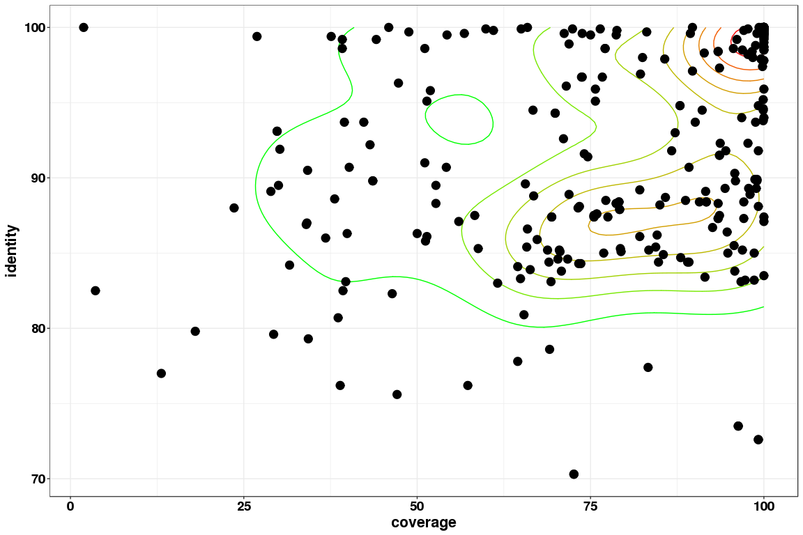
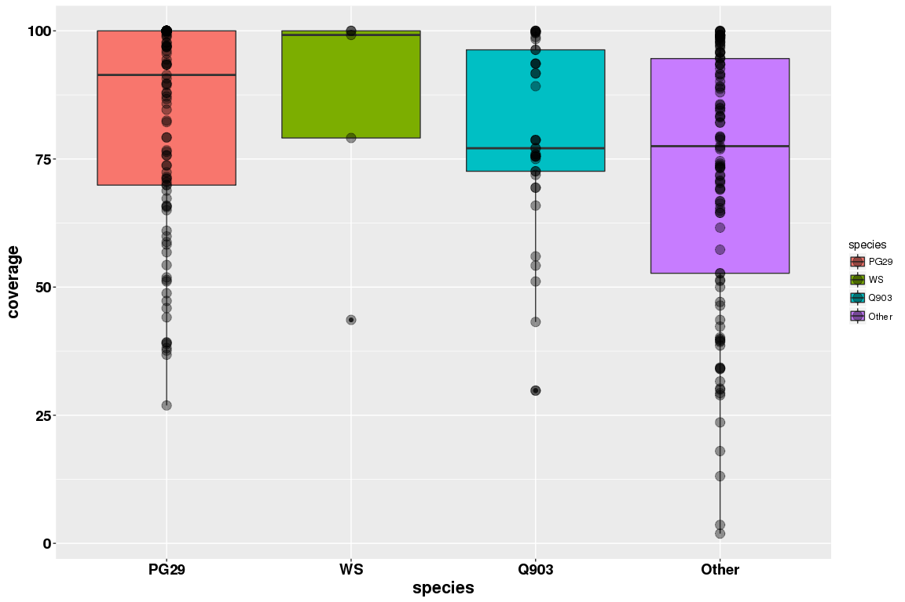
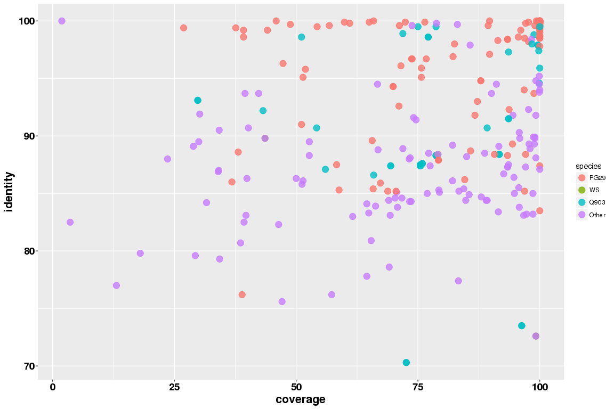

TPS targets in PG29 genome
================

Coverage for the aligned sequences in the genome assembly
---------------------------------------------------------

``` r
library( dplyr )
library( ggplot2 )
library( tidyr )
library( data.table )


d <- read.table("/projects/btl/kgagalova/PHD_projects/SpruceUp/KollectorGeneReconstruction3species/ComparativeAnalysis_TPS/RunsPerformances/data/CovIdentity/PG29/CoverageIdentityTargetsCLEANED.txt", quote="\"")

colnames(d) = c("target","identity","coverage")
d1 = d[order(d$target, d$coverage, decreasing=T), ]
d1 = d1[ !duplicated(d1$target), ]
##remove sequences with unknown procedur -  patent
d1 = d1[-grep("Patent",d1$target), ]
```

``` r
#add labels
d1$species = rep("Other",nrow(d1))
d1$species[grep("PiceaglaucacloneWS",d1$target)] = "WS"
d1$species[grep("PiceaengelmanniixPiceaglaucaclone|Picea_engelmannii_x_Picea_glauca_clone|_TSA:_Picea_glauca_|maker|snap",d1$target)] = "PG29"
d1$species[grep("Piceasitchensisclone|Picea_sitchensis",d1$target)] = "Q903"
d1$species = as.factor(d1$species)
d1$species = ordered(d1$species, levels = c("PG29", "WS", "Q903","Other"))

table(subset(d1,d1$coverage >=90)$species)
```

    ## 
    ##  PG29    WS  Q903 Other 
    ##    55     3    16    37

``` r
table(subset(d1,d1$coverage >=80)$species)
```

    ## 
    ##  PG29    WS  Q903 Other 
    ##    66     3    17    51

``` r
table(subset(d1,d1$coverage >=70)$species)
```

    ## 
    ##  PG29    WS  Q903 Other 
    ##    79     4    32    70

``` r
commonTheme = list(labs(color="Density",fill="Density"),
                   theme_bw(),
                   theme(axis.title.x = element_text(face='bold',size=16,hjust=0.5),
                         axis.title.y = element_text(face='bold',size=16,vjust=1),
                         axis.text.x = element_text(face='bold',size=14,color='black'),
                         axis.text.y = element_text(face='bold',size=14,color='black'),
                         legend.position="none",
                         legend.justification=c(0,1)))

ggplot(data=d1,aes(coverage,identity)) + 
  geom_density2d(aes(colour=..level..)) + 
  scale_colour_gradient(low="green",high="red") + 
  geom_point(size=4) + commonTheme
```



``` r
ggplot(d1, aes(x=species, y=coverage, fill=species)) +
  geom_boxplot() + 
  theme(axis.title.x = element_text(face='bold',size=16,hjust=0.5),
        axis.title.y = element_text(face='bold',size=16,vjust=1),
        axis.text.x = element_text(face='bold',size=14,color='black'),
        axis.text.y = element_text(face='bold',size=14,color='black'),
        legend.justification=c(0,0.5)) +
  geom_point(size=4,alpha=0.4)
```



``` r
ggplot(d1, aes(x=coverage, y=identity, color=species)) +
  geom_point(size=4,alpha=0.8) + 
  theme(axis.title.x = element_text(face='bold',size=16,hjust=0.5),
        axis.title.y = element_text(face='bold',size=16,vjust=1),
        axis.text.x = element_text(face='bold',size=14,color='black'),
        axis.text.y = element_text(face='bold',size=14,color='black'),
        legend.justification=c(0,0.5))
```


