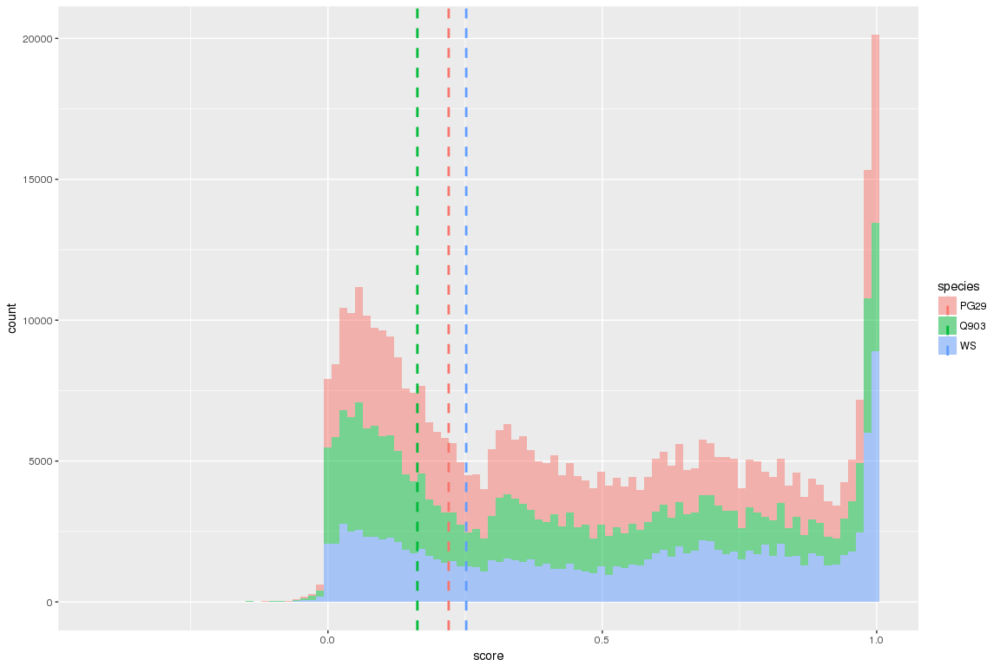

Comparative analysis GCAT
================

Load the dataset
----------------

For all the species together

``` r
library( dplyr )
library( ggplot2 )
library( tidyr )
library( data.table )
library(plyr)


dataPath=c("/projects/spruceup_scratch/dev/KollectorAlignments/cdhit-output4AllTargets/PG29/Scipio2/PeptidesGCAT/ParsedYaml", "/projects/spruceup_scratch/dev/KollectorAlignments/cdhit-output4AllTargets/Q903/Scipio2/PeptidesGCAT/ParsedYaml","/projects/spruceup_scratch/dev/KollectorAlignments/cdhit-output4AllTargets/WS77111/Scipio2/PeptidesGCAT/ParsedYaml")

allFiles <- list.files( path = dataPath, pattern = ".out", full.names = TRUE )

l <- lapply( allFiles, function( fn ){
  d <- read.table( fn, header = T, sep="\t" )
  d
  } );

allGCAT <- bind_rows( l );

dim(allGCAT)
```

    ## [1] 429205     26

``` r
allGCAT$species = sapply(strsplit(allGCAT$bin,"_"), "[[", 2)
table(sapply(strsplit(allGCAT$bin,"_"), "[[", 2))
```

    ## 
    ##   PG29   Q903     WS 
    ## 158903 140539 129763

General plots
-------------

Significant scores

``` r
#extract the general info, not inron/exon spec
allGCATgen = allGCAT[,c(1:12,27)]
allGCATgen = allGCATgen[!duplicated(allGCATgen), ]
dim(allGCATgen)
```

    ## [1] 172591     13

``` r
#plot the score per species
cdat <- ddply(allGCATgen, "species", summarise, rating.med=median(score))
cdat
```

    ##   species rating.med
    ## 1    PG29      0.220
    ## 2    Q903      0.163
    ## 3      WS      0.252

``` r
ggplot(allGCAT, aes(x=score, fill=species)) + geom_density(alpha=.3) +
    geom_vline(data=cdat, aes(xintercept=rating.med,  colour=species),
               linetype="dashed", size=1)
```


``` r
ggplot(allGCAT, aes(x=score, fill=species))  + geom_histogram(alpha=.5, bins = 100) +
    geom_vline(data=cdat, aes(xintercept=rating.med,  colour=species),
               linetype="dashed", size=1)
```



``` r
#plot the peptide length vs contig length
ggplot(allGCATgen, aes(x=prot_len, y=contig_len)) +
  #geom_point() 
  geom_point(aes(shape=score > 0.9,colour = score > 0.9), size=2) + scale_shape_manual(values=c(3, 16, 17))+
  scale_color_manual(values=c('#999999','#E69F00', '#56B4E9')) + facet_wrap( ~ species ) + theme_bw()
```


``` r
#status aligments
allGCATgenScore = subset(allGCATgen, allGCATgen$score >= 0.9)
status = allGCATgenScore$status
status[status == "auto"] = "complete"
status_d = as.data.frame(cbind(status,allGCATgenScore$species))
table(status)
```

    ## status
    ##   complete incomplete    partial 
    ##       1542      12982        189

``` r
status_d = as.matrix(table(status_d))

barplot(status_d, ylab="Frequency", xlab="Species", main="Scipio summary alignments", col=c("turquoise4", "turquoise2", "turquoise" ), beside=TRUE, width=.3)
legend(x=2.3,y=4000, title="Status alignments", legend=c("complete","incomplete","partial"), fill =c("turquoise4", "turquoise2", "turquoise" ), box.lty=0)
```


``` r
#get the ones with incomplete
reason = allGCATgenScore$reason[which(status == "incomplete")]
reason_d = as.data.frame(cbind(reason,allGCATgenScore$species[which(status == "incomplete")]))
#table(reason_d)
reason_d = as.data.frame(as.matrix(table(reason_d)))
reason_dWide= reshape(reason_d, idvar = "reason", timevar = "V2", direction = "wide")
colnames(reason_dWide) = gsub("Freq.","",colnames(reason_dWide))
reason_dWide$sum = apply(reason_dWide[,2:ncol(reason_dWide)],1,sum)
reason_dWide = reason_dWide[order(reason_dWide$sum, decreasing=T),] 
topReasons = as.character(reason_dWide[1:10,1])
reason_dTop = subset(reason_dWide, reason_dWide$reason %in% topReasons)
rownames(reason_dTop) = reason_dTop$reason
reason_dTop$reason = NULL
reason_dTop = as.matrix(reason_dTop)

reason_dTop
```

    ##                                             PG29 Q903   WS  sum
    ## mismatches/gap_to_querystart                1145 1293 1308 3746
    ## mismatches                                  1141 1201 1364 3706
    ## gap_to_querystart                            732  437  760 1929
    ## sequence_shift/mismatches                    153  197  162  512
    ## sequence_shift/mismatches/gap_to_querystart  115  175  126  416
    ## bad_intron/mismatches                        113   83  119  315
    ## bad_intron/mismatches/gap_to_querystart       96   91  103  290
    ## gap/mismatches                                41   48   67  156
    ## bad_intron/gap_to_querystart                  61   35   58  154
    ## bad_intron                                    53   27   58  138

``` r
barplot(reason_dTop[,c(1:3)], ylab="", xlab="Species", main="Scipio status incomplete", col = colors()[1:10], beside=TRUE, width=.3)
legend(x=8, y=1100, title=" ", legend=rownames(reason_dTop), fill = colors()[1:10], box.lty=0)
```


``` r
#see length upstream downstream
seq_upDown = as.data.frame(cbind(sapply(as.character(allGCATgenScore$seq_upstream),nchar, type = "chars"),sapply(as.character(allGCATgenScore$seq_downstream),nchar, type = "chars"),allGCATgenScore$species))
colnames(seq_upDown) = c("seq_up","seq_down","species")
rownames(seq_upDown) = NULL
seq_upDownMelt = melt(seq_upDown,  id.vars = "species")
seq_upDownMelt$variable= as.factor(seq_upDownMelt$variable)
seq_upDownMelt$value =  as.numeric(seq_upDownMelt$value)

ggplot(seq_upDownMelt, aes(x=value, fill=species)) + geom_density(alpha=.3) + facet_wrap( ~ variable )
```


``` r
ggplot(seq_upDownMelt, aes(x=value, fill=species)) + geom_histogram(alpha=.3, bins = 40) + facet_wrap( ~ variable )
```


Get the number of reconstructed targets in the 3 species
--------------------------------------------------------

``` r
overlap =reshape(as.data.frame(table(allGCATgenScore[,c("target","species")])),idvar = "target", timevar="species" , direction = "wide" )
head(overlap)
```

    ##                                                                                                            target
    ## 1  lcl|ORF101:10:444unnamedproteinproductGQ03204K12.1clone=GQ03204K12cluster=GQ03204K12status=completegb=BT109101
    ## 2 lcl|ORF101:100:936unnamedproteinproductGQ03113G11.1clone=GQ03113G11cluster=GQ03113G11status=completegb=BT107844
    ## 3 lcl|ORF101:101:661unnamedproteinproductGQ03814B10.1clone=GQ03814B10cluster=GQ03814B10status=completegb=BT117165
    ## 4 lcl|ORF101:107:544unnamedproteinproductGQ02904M15.1clone=GQ02904M15cluster=GQ02904M15status=completegb=BT106192
    ## 5 lcl|ORF101:107:598unnamedproteinproductGQ04107E01.1clone=GQ04107E01cluster=GQ04107E01status=completegb=BT119564
    ## 6 lcl|ORF101:107:631unnamedproteinproductGQ03808I16.1clone=GQ03808I16cluster=GQ03808I16status=completegb=BT116883
    ##   Freq.PG29 Freq.Q903 Freq.WS
    ## 1         2         0       0
    ## 2         5         7       7
    ## 3         4         0       0
    ## 4         1         1       0
    ## 5         0         0       1
    ## 6         1         1       1

``` r
overlap1 = overlap[,c(2:4)]
dim(overlap1)
```

    ## [1] 4177    3

``` r
length(which(apply(overlap1 == 0, 1, sum) == 0))
```

    ## [1] 1950

``` r
#check only for the complete or incomplete/mismatches
allGCATgenScoreStatusOK = subset(allGCATgenScore, allGCATgenScore$status == "auto" | allGCATgenScore$reason == "mismatches")
overlapGood =reshape(as.data.frame(table(allGCATgenScoreStatusOK[,c("target","species")])),idvar = "target", timevar="species" , direction = "wide" )
head(overlapGood)
```

    ##                                                                                                             target
    ## 1   lcl|ORF101:10:444unnamedproteinproductGQ03204K12.1clone=GQ03204K12cluster=GQ03204K12status=completegb=BT109101
    ## 2  lcl|ORF101:100:936unnamedproteinproductGQ03113G11.1clone=GQ03113G11cluster=GQ03113G11status=completegb=BT107844
    ## 3  lcl|ORF101:101:661unnamedproteinproductGQ03814B10.1clone=GQ03814B10cluster=GQ03814B10status=completegb=BT117165
    ## 4  lcl|ORF101:107:544unnamedproteinproductGQ02904M15.1clone=GQ02904M15cluster=GQ02904M15status=completegb=BT106192
    ## 5 lcl|ORF101:109:1587unnamedproteinproductGQ03811L18.1clone=GQ03811L18cluster=GQ03811L18status=completegb=BT117043
    ## 6     lcl|ORF101:116:733unnamedproteinproductGQ0133O14.1clone=GQ0133O14cluster=GQ0133O14status=completegb=BT101943
    ##   Freq.PG29 Freq.Q903 Freq.WS
    ## 1         2         0       0
    ## 2         5         7       7
    ## 3         4         0       0
    ## 4         1         1       0
    ## 5         0         1       1
    ## 6         6         0       3

``` r
overlapGood1 = overlapGood[,c(2:4)]
dim(overlapGood1)
```

    ## [1] 1720    3

``` r
length(which(apply(overlapGood1 == 0, 1, sum) == 0))
```

    ## [1] 594

``` r
#plot again the length for contigs vs peptides for the selected targets
ggplot(allGCATgenScoreStatusOK, aes(x=prot_len, y=contig_len)) +
  geom_point(aes(shape=score >= 0.9,colour = score >= 0.9), size=2) + scale_shape_manual(values=c(3, 16, 17))+
  scale_color_manual(values=c('#999999','#E69F00', '#56B4E9')) + facet_wrap( ~ species ) + theme_bw()
```


