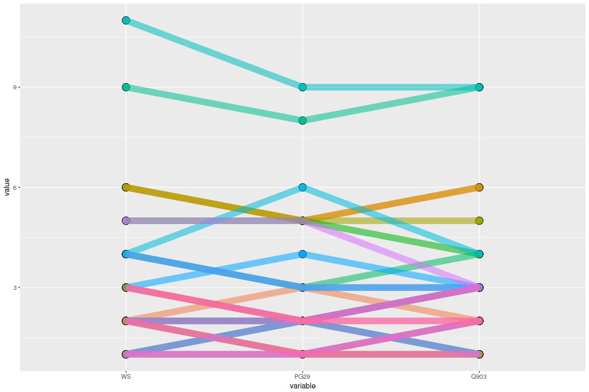

Comparative analysis for introns GCAT
================

Load the dataset
----------------

For all the species together

``` r
library( dplyr )
library( ggplot2 )
library( tidyr )
library( data.table )
library(plyr)


dataPath=c("/projects/spruceup_scratch/dev/KollectorAlignments/cdhit-output4AllTargets/PG29/Scipio2/PeptidesGCAT/ParsedYaml", "/projects/spruceup_scratch/dev/KollectorAlignments/cdhit-output4AllTargets/Q903/Scipio2/PeptidesGCAT/ParsedYaml","/projects/spruceup_scratch/dev/KollectorAlignments/cdhit-output4AllTargets/WS77111/Scipio2/PeptidesGCAT/ParsedYaml")

allFiles <- list.files( path = dataPath, pattern = ".out", full.names = TRUE )

l <- lapply( allFiles, function( fn ){
  d <- read.table( fn, header = T, sep="\t" )
  d
  } );

allGCAT <- bind_rows( l );

dim(allGCAT)
```

    ## [1] 429205     26

``` r
allGCAT$species = sapply(strsplit(allGCAT$bin,"_"), "[[", 2)
table(sapply(strsplit(allGCAT$bin,"_"), "[[", 2))
```

    ## 
    ##   PG29   Q903     WS 
    ## 158903 140539 129763

Plots
-----

Significant scores

``` r
#allGCATgen = allGCAT[,c(1:12,27)]
#allGCATgen = allGCATgen[!duplicated(allGCATgen), ]
allGCATScore = subset(allGCAT, allGCAT$score >= 0.9)
allGCATScoreStatusOK = subset(allGCATScore, allGCATScore$status == "auto" | allGCATScore$reason == "mismatches")
#drop the unused elements
allGCATScoreStatusOK$type = droplevels(allGCATScoreStatusOK)$type
```

Get the number of reconstructed targets in the 3 species
--------------------------------------------------------

``` r
overlap =reshape(as.data.frame(table(allGCATScoreStatusOK[,c("target","species")])),idvar = "target", timevar="species" , direction = "wide" )
head(overlap)
```

    ##                                                                                                             target
    ## 1   lcl|ORF101:10:444unnamedproteinproductGQ03204K12.1clone=GQ03204K12cluster=GQ03204K12status=completegb=BT109101
    ## 2  lcl|ORF101:100:936unnamedproteinproductGQ03113G11.1clone=GQ03113G11cluster=GQ03113G11status=completegb=BT107844
    ## 3  lcl|ORF101:101:661unnamedproteinproductGQ03814B10.1clone=GQ03814B10cluster=GQ03814B10status=completegb=BT117165
    ## 4  lcl|ORF101:107:544unnamedproteinproductGQ02904M15.1clone=GQ02904M15cluster=GQ02904M15status=completegb=BT106192
    ## 5 lcl|ORF101:109:1587unnamedproteinproductGQ03811L18.1clone=GQ03811L18cluster=GQ03811L18status=completegb=BT117043
    ## 6     lcl|ORF101:116:733unnamedproteinproductGQ0133O14.1clone=GQ0133O14cluster=GQ0133O14status=completegb=BT101943
    ##   Freq.PG29 Freq.Q903 Freq.WS
    ## 1         2         0       0
    ## 2        25        35      35
    ## 3        12         0       0
    ## 4         3         3       0
    ## 5         0        11      11
    ## 6        54         0      27

``` r
overlap1 = overlap[,c(2:4)]
dim(overlap)
```

    ## [1] 1720    4

``` r
length(which(apply(overlap1 == 0, 1, sum) == 0))
```

    ## [1] 594

``` r
#see how many have gaps in the seq sequences
#allGCATScoreNoGaps = allGCATScoreStatusOK[!grepl("n",allGCATScoreStatusOK$seq),]
overlapStatusOK = reshape(as.data.frame(table(allGCATScoreStatusOK[,c("target","species")])),idvar = "target", timevar="species" , direction = "wide" )
head(overlapStatusOK)
```

    ##                                                                                                             target
    ## 1   lcl|ORF101:10:444unnamedproteinproductGQ03204K12.1clone=GQ03204K12cluster=GQ03204K12status=completegb=BT109101
    ## 2  lcl|ORF101:100:936unnamedproteinproductGQ03113G11.1clone=GQ03113G11cluster=GQ03113G11status=completegb=BT107844
    ## 3  lcl|ORF101:101:661unnamedproteinproductGQ03814B10.1clone=GQ03814B10cluster=GQ03814B10status=completegb=BT117165
    ## 4  lcl|ORF101:107:544unnamedproteinproductGQ02904M15.1clone=GQ02904M15cluster=GQ02904M15status=completegb=BT106192
    ## 5 lcl|ORF101:109:1587unnamedproteinproductGQ03811L18.1clone=GQ03811L18cluster=GQ03811L18status=completegb=BT117043
    ## 6     lcl|ORF101:116:733unnamedproteinproductGQ0133O14.1clone=GQ0133O14cluster=GQ0133O14status=completegb=BT101943
    ##   Freq.PG29 Freq.Q903 Freq.WS
    ## 1         2         0       0
    ## 2        25        35      35
    ## 3        12         0       0
    ## 4         3         3       0
    ## 5         0        11      11
    ## 6        54         0      27

``` r
overlapStatusOK1 = overlapStatusOK[,c(2:4)]
dim(overlapStatusOK1)
```

    ## [1] 1720    3

``` r
#lost 2 targets removed because gaps
length(which(apply(overlapStatusOK1 == 0, 1, sum) == 0))
```

    ## [1] 594

``` r
commonTargets = as.character(overlapStatusOK[which(apply(overlapStatusOK1 == 0, 1, sum) == 0),]$target)

#count introns per spices
exons = subset(allGCATScoreStatusOK,allGCATScoreStatusOK$type=="exon" & allGCATScoreStatusOK$target %in% commonTargets)

#check the id per target
exons1 = exons[,c("id","target","species")]
exons1 = exons1[!duplicated(exons1),]
#exons1$id = as.character(exons1$id)
freq_targets = as.data.frame(table(exons1[,c("target","species")]))
length(which(freq_targets$Freq > 1))
```

    ## [1] 332

``` r
#since some targets are reconstructed in several bins and most of them have identical score, select the ones that are assembled earlier
exons$iter = sapply(strsplit(as.character(exons$bin),"\\."),"[[",2)
exons$extra = grepl("xtra",exons$bin) 
exons[which(exons$iter == "1" & exons$extra == T), "iter"] = "6" 
exons[which(exons$iter == "2" & exons$extra == T), "iter"] = "7"
exons$iter = as.numeric(exons$iter)
tmp = as.data.frame(exons %>% group_by(species, target) %>% slice(which.min(iter)))

idsToKeep = as.character(paste(tmp$id,tmp$species,sep="_"))
exons$combIds = as.character(paste(exons$id,exons$species,sep="_"))
exonsPol = exons[exons$combId %in% idsToKeep,]

#tested with frequency, no duplicates anymore
test = as.data.frame(table(exonsPol[,c("target","species")]))
test = test[!duplicated(test),]
which(as.data.frame(table(test[,c("target","species")]))$Freq > 1)
```

    ## integer(0)

Count the number of exons per target in each species
----------------------------------------------------

``` r
countExons = reshape(count(exonsPol, c('id','bin','species','target')),idvar = c("target"), timevar="species" , direction = "wide" )
colnames(countExons) = gsub("freq.","",colnames(countExons))
colnames(countExons)
```

    ##  [1] "target"   "id.WS"    "bin.WS"   "WS"       "id.PG29"  "bin.PG29"
    ##  [7] "PG29"     "id.Q903"  "bin.Q903" "Q903"

``` r
row.names(countExons) = NULL
countExons = countExons[,c("target","WS", "PG29", "Q903", "id.WS","id.PG29","id.Q903","bin.WS","bin.PG29","bin.Q903")]
#get the difeerent
countExonsDiff = countExons[apply(countExons[,c(2,3,4)],1,function(x) length(unique(x)) >1),]

#plot the diferences
countExonsDiffMelt = melt(countExonsDiff[,c(1:4)],id.var="target")
ggplot(countExonsDiffMelt, aes(x = variable, y = value, colour=target)) +
  #geom_jitter(aes(variable,value),
   #position=position_jitter(width=0.4,height=0),
   #alpha=0.4,
   #size=3) +
  geom_point(aes(fill=target), 
       colour="black",pch=21, size=5) + 
  geom_point(size=4, alpha=0.1) +
  geom_line(aes(group = target,colour=target, size=2, alpha=0.1)) + 
  theme(legend.position="none")
```


