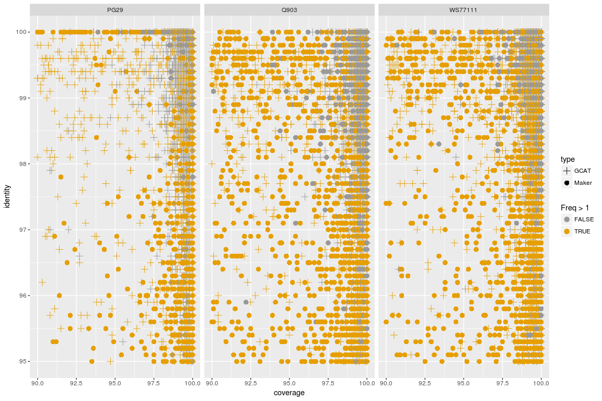

GMAP alignments for 3 species - cdhit4 with Gnavigator parameters GMAP
================

Upload the results from the alignment - coverage/identity and length of the targets
-----------------------------------------------------------------------------------

``` r
library( dplyr )
library( ggplot2 )
library( tidyr )
library( data.table )
library(plyr)
library(splitstackshape)

dataPath=c("/projects/btl/kgagalova/PHD_projects2/SpruceUp/KollectorGeneReconstruction3species/ComparativeAnlysis/data/GMAPcDNA_GCATgnavigator")

allFiles <- list.files( path = dataPath, pattern = "Coverage", full.names = TRUE )

l <- lapply( allFiles, function( fn ){
  d <- read.table( fn, header = F)
  d$fileName <- fn;
  d
  } );

allGMAP <- bind_rows( l );
dim(allGMAP)
```

    ## [1] 107404      4

``` r
colnames(allGMAP)[1:3] = c("query","identity","coverage")

#load the len of the sequences
lenSeqs <- read.delim("/projects/btl/kgagalova/PHD_projects2/SpruceUp/KollectorGeneReconstruction3species/ComparativeAnlysis/data/GMAPcDNA_GCAT/lenSeqs.txt", header=FALSE)
colnames(lenSeqs) = c("query","len")
allGMAPm = merge(allGMAP,lenSeqs,by="query",all.x=T)

allGMAPm$species = gsub("CoverageIdentity||targetsTargets.txt||targets.txt||targetsGnavigator.txt","",sapply(strsplit(allGMAPm$fileName,"/"),"[[",11))

countsPaths = as.data.frame(table(allGMAPm[,c("query","species")]))

allGMAPm = merge(allGMAPm,countsPaths,by.x=c("query","species"),by.y=c("query","species"))

allGMAPm$type = ifelse(grepl("augustus|maker|snap|genemark",allGMAPm$query), "Maker", "GCAT")#number of total alignments

#number of unique alignments - targets
detach("package:plyr", unload=TRUE) 
test = allGMAPm %>% group_by(query,species,type) %>% summarize(count=n())

table(subset(test,test$species=="PG29")$type)
```

    ## 
    ##  GCAT Maker 
    ##  7440 10786

``` r
table(subset(test,test$species=="Q903")$type)
```

    ## 
    ##  GCAT Maker 
    ##  7438 10766

``` r
table(subset(test,test$species=="WS77111")$type)
```

    ## 
    ##  GCAT Maker 
    ##  7441 10777

Plot the coverage and identity for the GMAP alignments
------------------------------------------------------

``` r
ggplot(allGMAPm, aes(x=coverage, y=identity)) + 
    geom_point(aes(shape=Freq > 1,colour = Freq > 1)) + facet_wrap( ~ species ) 
```


``` r
ggplot(allGMAPm, aes(x=coverage, y=identity)) + 
    geom_point(aes(shape=Freq > 1,colour = Freq > 1)) + facet_wrap( ~ species ) + 
  coord_cartesian(xlim = c(90,100),ylim= c(95,100))
```


``` r
#select only the ones that are >90% cov and 95% identity
allGMAPmSel = subset(allGMAPm,allGMAPm$coverage>=90 & allGMAPm$identity>=95)

tmp = allGMAPmSel %>% group_by(query,species,type) %>% summarize(count=n())
table(tmp[,c("species","type")])
```

    ##          type
    ## species    GCAT Maker
    ##   PG29     4074 10768
    ##   Q903     2847  7401
    ##   WS77111  4106  8624

``` r
ggplot(allGMAPmSel, aes(x=coverage, y=identity)) + 
    geom_point(aes(shape=Freq > 1,colour = Freq > 1),size=3) + facet_wrap( ~ species )
```


``` r
#Quantify exactly for the 3 species
table(subset(allGMAPmSel, allGMAPmSel$Freq == 1)$species)
```

    ## 
    ##    PG29    Q903 WS77111 
    ##   10566    7049    7642

``` r
#divide per type
ggplot(allGMAPm, aes(x=coverage, y=identity)) + 
    geom_point(aes(shape=type,colour = type),size=3) + facet_wrap( ~ species )
```


``` r
ggplot(allGMAPmSel, aes(x=coverage, y=identity)) + 
    geom_point(aes(shape=type,colour = Freq > 1),size=3) + facet_wrap( ~ species ) + 
    scale_shape_manual(values=c(3, 16)) + 
    scale_color_manual(values=c('#999999','#E69F00'))
```



``` r
#GCAT only
allGMAPmSelGCAT = subset(allGMAPmSel,allGMAPmSel$type == "GCAT")
allGMAPmSelMaker = subset(allGMAPmSel,allGMAPmSel$type == "Maker")

ggplot(allGMAPmSelGCAT, aes(x=coverage, y=identity)) + 
    geom_point(aes(shape=type,colour = Freq > 1),size=3) + facet_wrap( ~ species ) + 
    scale_shape_manual(values=c(3)) + 
    scale_color_manual(values=c('#999999','#E69F00'))
```


``` r
ggplot(allGMAPmSelMaker, aes(x=coverage, y=identity)) + 
    geom_point(aes(shape=type,colour = Freq > 1),size=3) + facet_wrap( ~ species ) + 
    scale_shape_manual(values=c(16)) + 
    scale_color_manual(values=c('#999999','#E69F00'))
```


``` r
allGMAPmSelGCATfreq = subset(melt(table(allGMAPmSelGCAT[,c("query","species")]),id.var=query),melt(table(allGMAPmSelGCAT[,c("query","species")]),id.var=query)$value>0)
allGMAPmSelMakerfreq = subset(melt(table(allGMAPmSelMaker[,c("query","species")]),id.var=query),melt(table(allGMAPmSelMaker[,c("query","species")]),id.var=query)$value>0)


allGMAPmSelGCATfreq[allGMAPmSelGCATfreq$value == 1,] %>% group_by(species) %>% summarize(count=n())
```

    ## # A tibble: 3 x 2
    ##   species count
    ##    <fctr> <int>
    ## 1    PG29  3588
    ## 2    Q903  2438
    ## 3 WS77111  3103

``` r
allGMAPmSelMakerfreq[allGMAPmSelMakerfreq$value == 1,] %>% group_by(species) %>% summarize(count=n())
```

    ## # A tibble: 3 x 2
    ##   species count
    ##    <fctr> <int>
    ## 1    PG29  8677
    ## 2    Q903  6277
    ## 3 WS77111  6235

``` r
allGMAPmSelGCATfreq[allGMAPmSelGCATfreq$value == 2,] %>% group_by(species) %>% summarize(count=n())
```

    ## # A tibble: 3 x 2
    ##   species count
    ##    <fctr> <int>
    ## 1    PG29   394
    ## 2    Q903   325
    ## 3 WS77111   726

``` r
allGMAPmSelMakerfreq[allGMAPmSelMakerfreq$value == 2,] %>% group_by(species) %>% summarize(count=n())
```

    ## # A tibble: 3 x 2
    ##   species count
    ##    <fctr> <int>
    ## 1    PG29  1693
    ## 2    Q903   773
    ## 3 WS77111  1593

``` r
allGMAPmSelGCATfreq[allGMAPmSelGCATfreq$value > 2,] %>% group_by(species) %>% summarize(count=n())
```

    ## # A tibble: 3 x 2
    ##   species count
    ##    <fctr> <int>
    ## 1    PG29    92
    ## 2    Q903    84
    ## 3 WS77111   277

``` r
allGMAPmSelMakerfreq[allGMAPmSelMakerfreq$value > 2,] %>% group_by(species) %>% summarize(count=n())
```

    ## # A tibble: 3 x 2
    ##   species count
    ##    <fctr> <int>
    ## 1    PG29   398
    ## 2    Q903   351
    ## 3 WS77111   796

``` r
#plot the graphs
ggplot(allGMAPmSelGCATfreq, aes(x=value, fill=species)) + geom_density(alpha=.3) +
  ggtitle("GCAT targets") +
    xlab("Number of complete aligmnetsper target")
```


``` r
#ggplot(df, aes(x=dose, y=, fill=species)) 
ggplot(allGMAPmSelGCATfreq, aes(x=value, fill=species)) + geom_histogram(alpha=.3) +
    ggtitle("GCAT targets") +
      xlab("Number of complete aligmnets per target") + 
          facet_wrap( ~ species )
```


``` r
ggplot(allGMAPmSelMakerfreq, aes(x=value, fill=species)) + geom_density(alpha=.3) +
  ggtitle("Maker targets") +
    xlab("Number of complete aligmnets per target")
```


``` r
ggplot(allGMAPmSelMakerfreq, aes(x=value, fill=species)) + geom_histogram(alpha=.3) +
    ggtitle("Maker targets") +
      xlab("Number of complete aligmnets per target") + 
                facet_wrap( ~ species )
```


Intersect with the common Kollector
-----------------------------------

``` r
Common <- read.table("/projects/btl/kgagalova/PHD_projects2/SpruceUp/KollectorGeneReconstruction3species/ComparativeAnlysis/data/GMAPcDNA_GCAT/common_intersection3.txt", quote="\"", comment.char="")
table(as.character(Common$V1) %in% unique(as.character(allGMAPmSelMakerfreq$query))) 
```

    ## 
    ## FALSE  TRUE 
    ##  2288  4794

``` r
namsCorr = gsub("_status","status",gsub("_cluster","cluster", gsub("_clone","clone", unique(as.character(Common$V1)))))

#check how many are reconstructed as complete
allGMAPmSelMakerfreq[as.character(allGMAPmSelMakerfreq$query) %in% as.character(Common$V1),] %>% group_by(species) %>% count(value)
```

    ## # A tibble: 24 x 3
    ## # Groups:   species [3]
    ##    species value     n
    ##     <fctr> <int> <int>
    ##  1    PG29     1  3932
    ##  2    PG29     2   688
    ##  3    PG29     3   135
    ##  4    PG29     4    29
    ##  5    PG29     5     2
    ##  6    PG29     6     2
    ##  7    PG29     8     1
    ##  8    PG29    10     4
    ##  9    Q903     1  3575
    ## 10    Q903     2   320
    ## # ... with 14 more rows

``` r
allGMAPmSelGCATfreq[as.character(allGMAPmSelGCATfreq$query) %in% as.character(namsCorr),] %>% group_by(species) %>% count(value)
```

    ## # A tibble: 12 x 3
    ## # Groups:   species [3]
    ##    species value     n
    ##     <fctr> <int> <int>
    ##  1    PG29     1   218
    ##  2    PG29     2    31
    ##  3    PG29     3     9
    ##  4    PG29     4     3
    ##  5    Q903     1   198
    ##  6    Q903     2    21
    ##  7    Q903     3    14
    ##  8    Q903     4     2
    ##  9 WS77111     1   163
    ## 10 WS77111     2    60
    ## 11 WS77111     3    31
    ## 12 WS77111     4     7

``` r
ggplot(allGMAPmSelMakerfreq[as.character(allGMAPmSelMakerfreq$query) %in% as.character(Common$V1),] %>% group_by(species) %>% count(value),aes(x=value,y=n,colour=species)) + geom_bar(stat="identity") +  facet_wrap( ~ species ) + 
ggtitle("Maker targets") +
xlab("Number of complete aligmnets per target") + ylab("Count")
```


``` r
ggplot(allGMAPmSelGCATfreq[as.character(allGMAPmSelGCATfreq$query) %in% as.character(namsCorr),] %>% group_by(species) %>% count(value),aes(x=value,y=n,colour=species)) + geom_bar(stat="identity") +  facet_wrap( ~ species ) + 
ggtitle("GCAT targets") +
xlab("Number of complete aligmnets per target") + ylab("Count")
```


