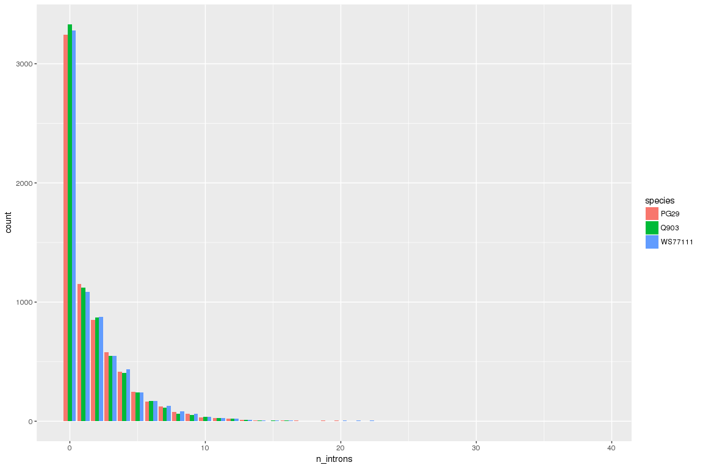
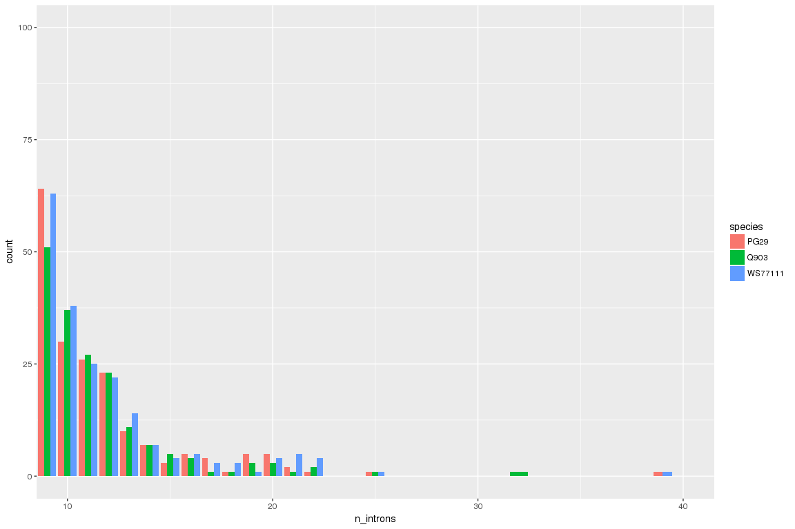
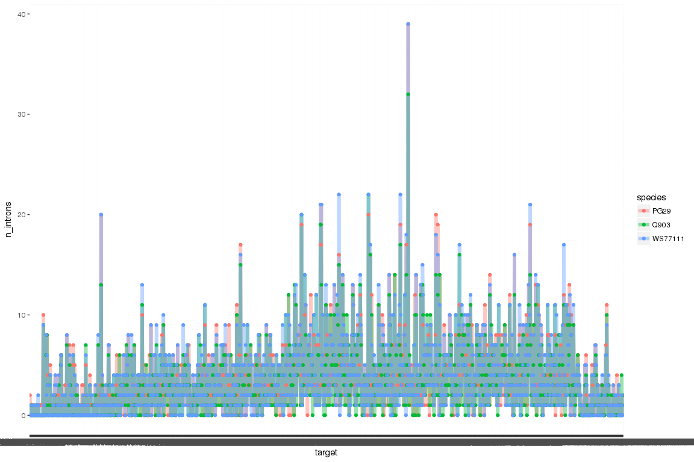

Scipio - introns number
================

Load data
---------

``` r
library( dplyr )
library( ggplot2 )
library( tidyr )
library( data.table )
library( reshape2 )

allFiles <- c("/projects/spruceup_scratch/dev/KollectorAlignments/cdhit-output4AllTargets/WS77111/Scipio/IntronsWSGCAT.out","/projects/spruceup_scratch/dev/KollectorAlignments/cdhit-output4AllTargets/WS77111/Scipio/IntronsWSHCG.out","/projects/spruceup_scratch/dev/KollectorAlignments/cdhit-output4AllTargets/PG29/Scipio/IntronsPG29HCG.out","/projects/spruceup_scratch/dev/KollectorAlignments/cdhit-output4AllTargets/PG29/Scipio/IntronsPG29GCAT.out","/projects/spruceup_scratch/dev/KollectorAlignments/cdhit-output4AllTargets/Q903/Scipio/IntronsQ903GCAT.out","/projects/spruceup_scratch/dev/KollectorAlignments/cdhit-output4AllTargets/Q903/Scipio/IntronsQ903HCG.out")

l <- lapply( allFiles, function( fn ){
  d <- read.table( fn, header = F );
  d$fileName <- fn;
  d
  } );

d <- bind_rows( l );
dim(d)
```

    ## [1] 23091     3

``` r
d$species = sapply(strsplit(d$fileName,"/"),"[[",7)
d$bin = gsub(".out|IntronsWS|IntronsPG29|IntronsQ903", "", sapply(strsplit(d$fileName,"/"),"[[",9))
colnames(d)[1:2] = c("target","n_introns")

#remove duplicated alignments
d1 = d[!grepl('\\(1\\)',d$target),]
#808 total removed

d1_Nintrons = dcast(d1[,c("target","n_introns","species")],target ~ species,  value.var="n_introns")
d1_NintronsComplete = d1_Nintrons[complete.cases(d1_Nintrons), ]
```

Plots - different number of introns
-----------------------------------

``` r
#density plot number of introns
d1_NintronsComplete_m = melt(d1_NintronsComplete,id="target")
colnames(d1_NintronsComplete_m) = c("target","species","n_introns")
ggplot(data=d1_NintronsComplete_m, aes(x=n_introns, fill=species)) +
  geom_bar(position=position_dodge())
```



``` r
#zoomed region
ggplot(data=d1_NintronsComplete_m, aes(x=n_introns, fill=species)) +
  geom_bar(position=position_dodge()) + 
  coord_cartesian(xlim = c(10, 40),ylim = c(0, 100))
```



``` r
#get different number of introns
d1_diffIntr = d1_NintronsComplete[apply(d1_NintronsComplete[,c("PG29","WS77111","Q903")],1,function(vector) length(unique(vector)) > 1),]
#--------------------------------------------------------------------
#test similarity targets
sum(d1_diffIntr$PG29 == d1_diffIntr$WS77111)
```

    ## [1] 388

``` r
sum(d1_diffIntr$PG29 == d1_diffIntr$Q903)
```

    ## [1] 290

``` r
sum(d1_diffIntr$WS77111 == d1_diffIntr$Q903)
```

    ## [1] 475

``` r
#test more or less introns (just see how many have more or less, do not cosider the degree of difference)
diffPG29_WS = d1_diffIntr$PG29 - d1_diffIntr$WS77111
length(diffPG29_WS[ diffPG29_WS != 0 ])
```

    ## [1] 897

``` r
sum(ifelse(diffPG29_WS[ diffPG29_WS != 0 ] < 0, -1, 1))
```

    ## [1] -39

``` r
diffPG29_Q903 = d1_diffIntr$PG29 - d1_diffIntr$Q903
length(diffPG29_WS[ diffPG29_Q903 != 0 ])
```

    ## [1] 995

``` r
sum(ifelse(diffPG29_Q903[ diffPG29_Q903 != 0 ] < 0, -1, 1))
```

    ## [1] 333

``` r
diffWS_Q903 = d1_diffIntr$WS77111 - d1_diffIntr$Q903
length(diffWS_Q903[ diffWS_Q903 != 0 ])
```

    ## [1] 810

``` r
sum(ifelse(diffWS_Q903[ diffWS_Q903 != 0 ] < 0, -1, 1))
```

    ## [1] 376

``` r
#---------------------------------------------------------------------
d1_diffIntr_m =melt(d1_diffIntr,id="target")
colnames(d1_diffIntr_m) = c("target","species","n_introns")
#plot differece between intron numbers
ggplot(d1_diffIntr_m, aes(x=target, y=n_introns, group=species)) +
  geom_line(aes(color=species), size=2, alpha=0.4)+
  geom_point(aes(color=species))
```



``` r
#this is the case with extreme values
subset(d1_diffIntr,d1_diffIntr$WS77111 > 30)
```

    ##                                                                                                       target
    ## 5529 maker-168310425-snap-gene-0.34-mRNA-1_protein_AED:0.12_eAED:0.12_QI:0|0.92|0.92|1|0.89|0.87|40|181|1855
    ##      PG29 Q903 WS77111
    ## 5529   39   32      39

Summary
-------

-   The number of interesting cases with different number of introns with at least 2 species is 1285
-   This is how similar the 3 species look like: WS is more similar to Q903, followed by PG29 to WS and the least similar are PG29 to Q903
-   PG29 has a higher number of introns when compared to Q903, same for WS when compared to Q903. PG29 has however a lower number of introns than WS77111
