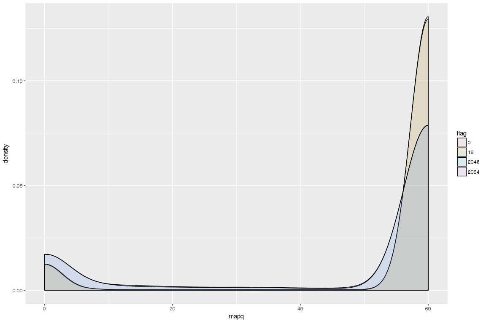
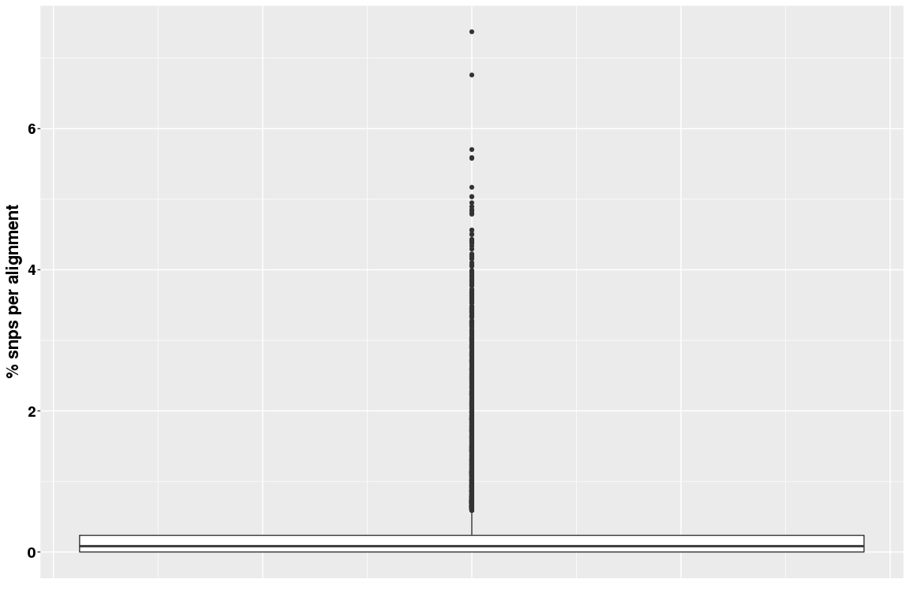

Kollector targets aligned to PG29 assembly
================

PG29
----

**BWA mem** align assembled genes to genome assembly, use `-x intractg` -B9 -O16 -L5 (intra-species contigs to ref)

Plot values from sam alignment:

``` r
library(ggplot2)
library(dplyr)
library(Rsamtools)

samPG29 <- read.table("/projects/btl/kgagalova/PHD_projects/SpruceUp/KollectorGeneReconstruction3species/ComparativeAnlysis/data/ParsedSam.txt", quote="\"")
nams = c("qname","flag","rname","pos","mapq","cigar","md","nm")
colnames(samPG29) = nams
samPG29$flag = as.factor(samPG29$flag)
#primary alignments
samPG29prim=subset(samPG29,samPG29$flag == 16 | samPG29$flag == 0 )
samPG29prim$qname = as.character(samPG29prim$qname)
head(samPG29prim)
```

    ##                                    qname flag    rname  pos mapq
    ## 8   1431442:cdhit-output-4_5=iteration.1   16  4868879    1   60
    ## 16  290766:cdhit-output-4_16=iteration.1   16  7509625  300   60
    ## 17 1699452:cdhit-output-4_14=iteration.1    0  8021654    1   60
    ## 21 1555225:cdhit-output-4_12=iteration.1    0  8743699 1825   60
    ## 22  1329824:cdhit-output-4_4=iteration.1    0  8743699 1988   60
    ## 27 1162380:cdhit-output-4_15=iteration.1   16 10930138    1   60
    ##              cigar                            md     nm
    ## 8  179S102M3D1219M   MD:Z:47T1C3C2T26T18^AAG1219 NM:i:8
    ## 16           1035M                     MD:Z:1035 NM:i:0
    ## 17 2148S2883M2100S            MD:Z:1347T1302T232 NM:i:2
    ## 21      1436S3089M MD:Z:108C2103A62G642C5C11T152 NM:i:6
    ## 22           2366M           MD:Z:1981G67A62G253 NM:i:3
    ## 27     16S1202M16S                     MD:Z:1202 NM:i:0

General statistics
------------------

``` r
#alignment
table(samPG29$flag)
```

    ## 
    ##    0    4   16 2048 2064 
    ## 5791    1 5893 4933 4804

``` r
#alignment quality - Phred score is not available
# The calculation is based on the number of optimal (best) alignments found, as well as the number of sub-optimal #alignments combined with the Phred scores of the bases which differ between the optimal and sub-optimal alignments


#excllude the 16 flag
samPG29allmapped = subset(samPG29,samPG29$flag != 4)
samPG29allmapped$flag= droplevels(samPG29allmapped$flag)
#levels(samPG29allmapped$flag)<-c(0,16,2048,2064)

#all alignments, color by flag
ggplot(samPG29allmapped, aes(x=mapq,fill=flag)) +
    geom_density(alpha=0.10)
```



``` r
#summary values, per flag
group_by(samPG29, flag) %>%
summarise(mean=mean(mapq), median=median(mapq), sd=sd(mapq),mad=mad(mapq))
```

    ## # A tibble: 5 x 5
    ##     flag     mean median       sd   mad
    ##   <fctr>    <dbl>  <dbl>    <dbl> <dbl>
    ## 1      0 54.34105     60 17.21694     0
    ## 2      4  0.00000      0       NA     0
    ## 3     16 54.19073     60 17.41997     0
    ## 4   2048 47.31887     60 23.35241     0
    ## 5   2064 47.52144     60 23.24013     0

SNPs analysis
-------------

The analysis is performed only on the primary alignments

``` r
####functions to parse MD and CIGAR
countSnps <- function(my_str){
  
  n = nchar(gsub("MD:Z:","",gsub('[[:digit:]]+', '', my_str)))
  return(n)
}
#-----------------------------------
#extract the cigar elements
#see link: https://www.biostars.org/p/9335/
matcher <- function(pattern, x) {

  ind = gregexpr(pattern, x)[[1]]
  start = as.numeric(ind)
  end = start + attr(ind, "match.length")- 2
  apply(cbind(start,end), 1, function(y) substr(x, start=y[1], stop=y[2]));
}
doone <- function(c, cigar) {
  pat <- paste("\\d+", c , sep="")
  sum(as.numeric(matcher(pat, cigar)), na.rm=T)
}

## takes a cigar string and parses it, not very fast but...
cigarsums <- function(cigar, chars=c("M","N","D","I","S","H", "P", "X", "=")) {
   sapply (chars, doone, cigar)
}
#------------------------------------

Mcigar = sapply(samPG29prim$cigar, cigarsums)[1,]
snpsPG29 = sapply(samPG29prim$md,countSnps)
#exclude insertions in the reference alignments (2807 excluded) - complicated, admixture of Ns etc
samPG29noins = samPG29prim[!grepl("\\^",samPG29prim$md),]
Mcigar = Mcigar[!grepl("\\^",samPG29prim$md)]
snpsPG29 = snpsPG29[!grepl("\\^",samPG29prim$md)]

#how many with 0 snps
sum(snpsPG29==0)
```

    ## [1] 2569

``` r
#distribution
summary(snpsPG29)
```

    ##    Min. 1st Qu.  Median    Mean 3rd Qu.    Max. 
    ##   0.000   0.000   2.000   8.127   6.000 331.000

``` r
#normalize for the length of matching regions
percSNPs = data.frame(perc_snps=((snpsPG29/Mcigar)*100))
summary(percSNPs$perc_snps)
```

    ##    Min. 1st Qu.  Median    Mean 3rd Qu.    Max. 
    ## 0.00000 0.00000 0.08299 0.29590 0.23600 7.37300

``` r
ggplot(aes(y = perc_snps,x=1),data=percSNPs) + geom_boxplot() + 
    xlab("") +
    ylab("% snps per alignment") +
    theme(axis.title.x = element_text(face='bold',size=16,hjust=0.5),
          axis.title.y = element_text(face='bold',size=16,vjust=1),
          axis.text.x = element_blank(),
          axis.text.y = element_text(face='bold',size=14,color='black'),
          axis.ticks.x=element_blank())
```



``` r
#check th outliers
samPG29noins[which(percSNPs>5),]
```

    ##                                            qname flag     rname   pos mapq
    ## 4651   4004139:cdhit-output-4_1=iteration.2extra    0 168252212  7374   60
    ## 5140       1729722:cdhit-output-4_11=iteration.1    0 168302875  5202   60
    ## 7392       1699577:cdhit-output-4_14=iteration.1   16 168505468 53861   60
    ## 9476        1500421:cdhit-output-4_2=iteration.1    0 500296170  2653    0
    ## 10142       1548549:cdhit-output-4_8=iteration.1   16 500947766  6341   60
    ## 10891       2190887:cdhit-output-4_6=iteration.4   16 501549995 12070   60
    ## 15449      1743495:cdhit-output-4_16=iteration.3   16 504149551  1083   60
    ## 17862 3622303:cdhit-output-4_17=iteration.1extra   16 504316824 24715   60
    ##                           cigar
    ## 4651          1055M10I295M1937S
    ## 5140               1409M18I274M
    ## 7392        3384M9I1217M21I295M
    ## 9476            66S65M2I96M526S
    ## 10142              153M16I1078M
    ## 10891            1S1290M25I239M
    ## 15449         205M12I1193M1540S
    ## 17862 168M2I1195M69I1371M4I304M
    ##                                                                                                                                                                                                                                                                                                                                                                                                                                                                                                                                                                                                                                                                                                                         md
    ## 4651                                                                                                                                                                                                                                                                                                                                                                                                                                                                                                                                                 MD:Z:1055G0T0G0A0G0A0T0T0G0A0A0C0G0G0G0G0A0G0G0T0C0T0A0G0A0A0C0T0C0T0T0T0G0G0A0T0A0T0A0G0G0G0A0G0G0A0T0G0A0T0G0C0A0C0A0T0A0C0C0A0A0G0T0G0G0A0C0A0A0A0T0T0A0T0T0T0C218
    ## 5140                                                                                                                                                                                                                                                                                                                                                                                                                                                                                                                  MD:Z:16C11C20C5C9A8C1G7G37T26A6T2G0C7G30A15G5G35T82C2A6C19C6C1G48A46A933T0A0T0T0A0G0T0T0T0T0C0A0C0A0G0A0A0A0T0T0A0A0A0A0A0A0A0A0A0A0A0A0A0T0T0A0A0C0C0A0T0G0A0T0T0T0T0A0T0C0T0C0T0T0T0T0C0A0C0A0G213
    ## 7392  MD:Z:480C0A4A3T29C4T29C579T30A43A10C45C12G8T25A1075T128C863T0G0C0T0T0G0C0C0C0G0A0T0T0C0G0T0T0T0G0G0A0C0T0G0T0T0G0A0C0T0G0A0G0T0T0A0A0C0A0C0A0T0T0T0G0G0A0C0A0T0A0C0G0G0C0A0T0T0G0T0G0G0G0A0T0A0G0A0A0T0A0C0T0T0G0C0C0A0C0A0A0G0A0T0C0T0T0C0T0A0A0A0G0A0T0G0A0G0C0A0A0T0C0T0G0A0A0A0A0T0T0T0T0A0G0G0A0G0T0C0C0G0G0G0A0A0T0G0T0C0C0A0T0T0G0C0A0G0G0A0A0C0A0T0C0C0A0T0T0T0A0G0A0G0G0G0G0G0T0A0A0A0T0T0G0G0A0C0G0A0T0T0C0C0C0A0C0T0A0C0A0A0C0G0G0C0A0T0G0T0T1026G0T0T0A0T0G0C0C0A0G0T0G0T0A0C0T0A0G0G0T0T0G0T0A0C0C0A0T0T0G0G0T0T0G0T0T0T0A0A0G0T0T0C0T0A0A0T0T0A0T0T0C0A0T0G0A0A0G0A0A0T0A0A0A0T0T0C0A0T0A0T0G0C0T0A0A0G0G0T0T0T0G0T0G0T0T0C0A0A0G0T0G0T0T0T0G0G0T0A0G0G0T0G0A0A0A0T0C0C0G0T0C0C0A0G0G0C0A0A0A0G0C0T172
    ## 9476                                                                                                                                                                                                                                                                                                                                                                                                                                                                                                                                                                                                                                                                                         MD:Z:29T0G10A9A29A7A26A6T1G35
    ## 10142                                                                                                                                                                                                                                                                                                                                                                                                                                                                                                                                                                              MD:Z:153A0T0A0T0G0T0T0C0A0A0T0A0G0T0T0T0A0A0T0A0A0T0A0T0T0G0A0A0A0A0T0A0C0T0C0A0A0A0A0T0C0T0A0G0G0T0C0A0A0A0G0T0G0G0A0G0A0C0T0T0T0G1016
    ## 10891                                                                                                                                                                                                                                                                                                                                                                                                                                                                                                                                                MD:Z:1290T0T0A0A0A0A0G0C0C0T0T0A0G0A0T0C0T0C0C0G0T0T0T0T0T0C0A0C0G0A0C0C0G0T0T0G0G0G0A0T0C0C0G0C0G0G0G0C0G0G0T0G0C0C0G0G0T0C0G0C0T0G0T0T0A0G0C0C0A0G0T0G0C0G0C0T0A162
    ## 15449                                                                                                                                                                                                                                                                                                                                                                                                                                                                                                                                            MD:Z:74C130G0C0G0T0G0G0G0G0A0G0A0T0T0T0T0C0G0A0A0T0G0C0G0C0A0A0A0A0A0A0T0T0G0T0A0A0A0T0A0G0A0C0T0T0T0T0T0T0A0A0A0C0A0T0A0A0A0A0T0T0T0T0A0A0A0T0C0T0G0T0T0T0A0T0T0T446A670
    ## 17862                                                                                                                                                                                                                                       MD:Z:168G0T0C0G0G0A0G0A0G0G0G0A0G0G0G0G0T0T0T0G0T0A0T0G0T0C0A0A0G0T0A0A0C0G0G0C0C0G0A0C0A0G0C0T0C0G0C0C0G0T0C0A0A0G0G0A0G0G0A0A0T0A0G0A0A0T0G0A0A0G0G0A0G0T0T0T0A0G0C0A0T0A0A0C0G0A0G0A0A0G0A0A0G0T0G0A0G0G0G0T0G0G0C0C0G0T0T0T0G0A0A0T2409A44G0T0G0T0A0A0T0A0T0T0T0A0T0T0A0T0C0A0G0T0T0T0G0A0T0T0A0G0T0G0G0C0A0A0G0T0G0A0A0G0C0A0A0C0T0T0T0T0G0T0G0A0G0A0T0A0C0A0G0C0T0T0G0C0T0C0T0T0C0T0T0A0T0T0G0T0T0T0G0T0G0A0G0A0T0A0A0G0G0C0T0T0G0C0T0C0T0T0A0T0T0A0T0T0G0T0G0T0G0A0A193
    ##             nm
    ## 4651   NM:i:87
    ## 5140  NM:i:105
    ## 7392  NM:i:361
    ## 9476   NM:i:11
    ## 10142  NM:i:78
    ## 10891 NM:i:102
    ## 15449  NM:i:90
    ## 17862 NM:i:299

Summary
-------

-   All the Kollector reconstructed genes (except one) are aligned to the assembly.
-   Large part of the primary alignments have mapq score == 60, some of those also low quality scores.
-   When excluding indels and clipping (only looking at the matching regions), the snps percentage is very low with median of 0.8% from the sequence length. Alignments with higher percentage of snps have high amount of Ns in the Kollector gene reconstruction (individual cases need to be checked)
