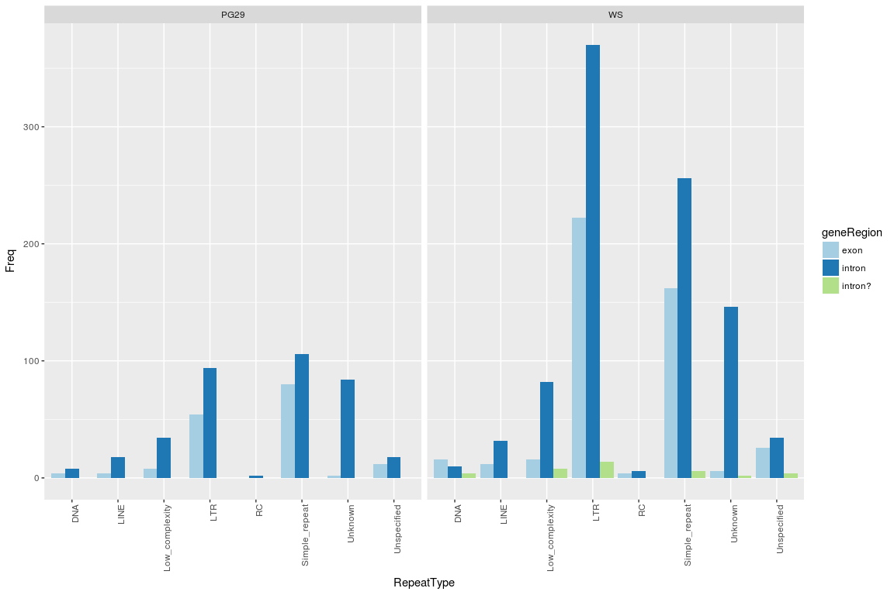

Repeats in genes - GCAT
================

Load the data
-------------

Genes coordinates, intersected with the repeats coordinates (RepeatMasker). The gene regions are divided by introns and exons.

``` r
library( dplyr )
library( ggplot2 )
library( tidyr )
library( data.table )
library(plyr)


dataPath=c("/projects/btl/kgagalova/PHD_projects2/SpruceUp/KollectorGeneReconstruction3species/ComparativeAnlysis/data/RepeatsInGenes/GCAT")

allFiles <- list.files( path = dataPath, pattern = ".txt", full.names = TRUE )

l <- lapply( allFiles, function( fn ){
  d <- read.table( fn, header = F, sep="\t" )
  d$fileName <- fn;
  d
  } );

allGenElems <- bind_rows( l );

dim(allGenElems)
```

    ## [1] 3803   22

``` r
allGenElems$species = sapply(strsplit(sapply(strsplit(allGenElems$fileName,"/"), "[[", 12),"_"),"[[",1)

allGenElems$rep <- gsub("%",".",sapply(strsplit(sapply(strsplit(sapply(strsplit(as.character(allGenElems[,20]),"genus:"),"[",2)," "),"[",1),";"),"[",1))
allGenElems$repShort <- sapply(strsplit(gsub("%",".",sapply(strsplit(sapply(strsplit(sapply(strsplit(as.character(allGenElems[,20]),"genus:"),"[",2)," "),"[",1),";"),"[",1)),"\\."),"[",1)

#nams = c("contig","start","stop","feat","score","strand","source","type","feat2","targetInfo","contig2","start2","stop2","score2","strand2","type2","feat3","uknown","feat4","overlap","fileName","species","rep","repShort")
```

Plot the repeats per region
---------------------------

``` r
colnames(allGenElems)[c(8,18,25)] = c("geneRegion","Match","RepeatType")
bedIntPG29sel = allGenElems[,c("geneRegion","RepeatType","species")]
bedIntPG29selCompl = as.data.frame(table(bedIntPG29sel))

ggplot(data=bedIntPG29selCompl, aes(x=RepeatType, y=Freq, fill=geneRegion)) +
  geom_bar(stat="identity", position=position_dodge())+
  scale_fill_brewer(palette="Paired")+
  facet_wrap( ~ species ) + theme(axis.text.x = element_text(angle = 90, hjust = 1))
```



``` r
#get only the complete match
allGenElems2 = subset(allGenElems,allGenElems$Match == "match")
bedIntPG29sel2 = allGenElems2[,c("geneRegion","RepeatType","species")]
bedIntPG29selCompl2 = as.data.frame(table(bedIntPG29sel2))

ggplot(data=bedIntPG29selCompl2, aes(x=RepeatType, y=Freq, fill=geneRegion)) +
  geom_bar(stat="identity", position=position_dodge())+
  scale_fill_brewer(palette="Paired")+
  facet_wrap( ~ species ) + theme(axis.text.x = element_text(angle = 90, hjust = 1))
```


``` r
#add a quantitative analysis
genesRepeats = subset(allGenElems, allGenElems$V21 > 0)[,c(10,23)]
geneRepeats2 = genesRepeats[!duplicated(genesRepeats), ]
table(geneRepeats2$species)
```

    ## 
    ## PG29   WS 
    ##   83  200

``` r
#add a quantitative analysis - complete match
genesRepeats = subset(allGenElems2, allGenElems2$V21 > 0)[,c(10,23)]
geneRepeats2 = genesRepeats[!duplicated(genesRepeats), ]
table(geneRepeats2$species)
```

    ## 
    ## PG29   WS 
    ##   83  200
