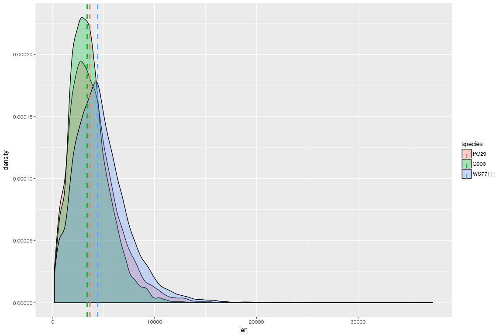
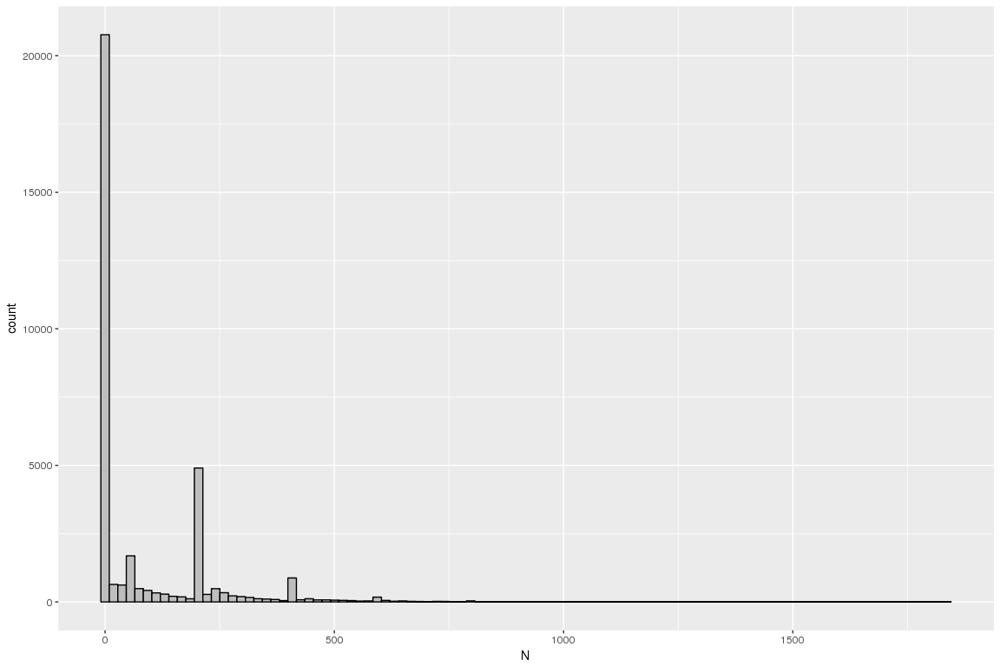
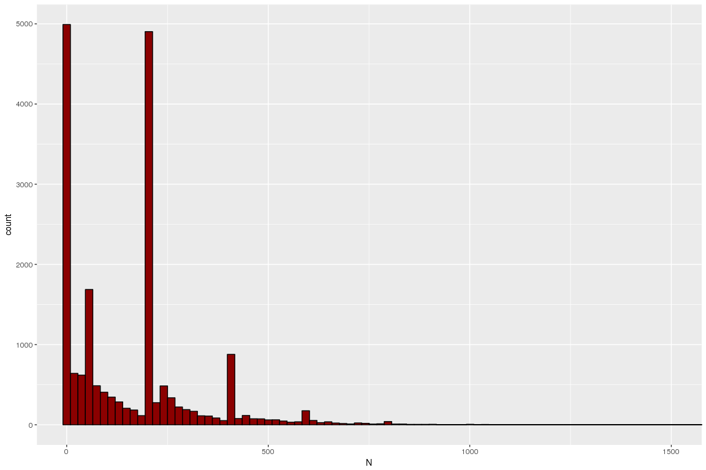
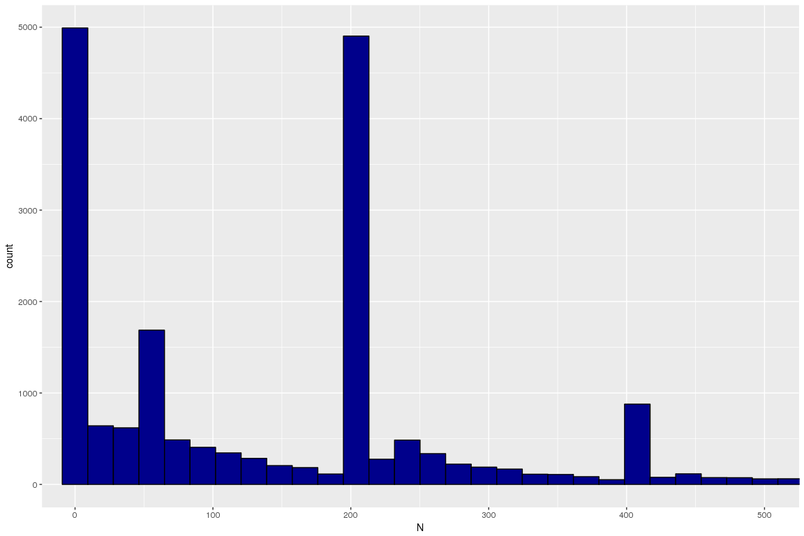
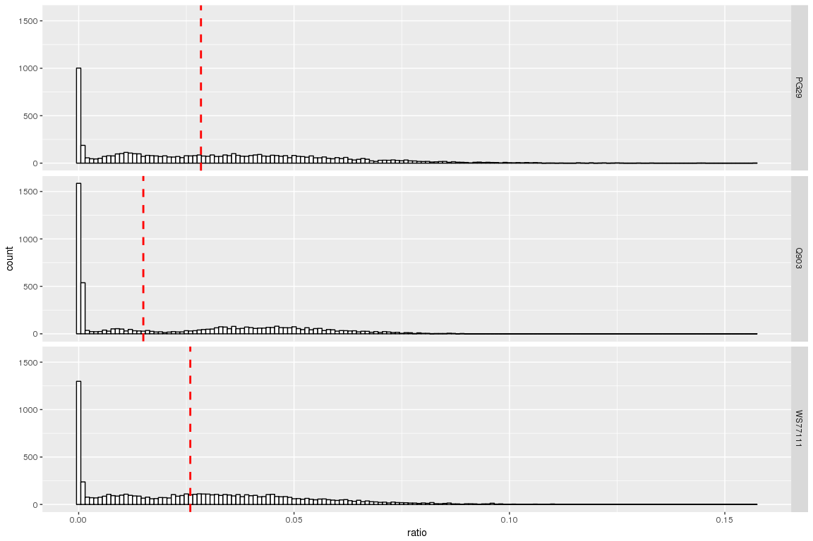
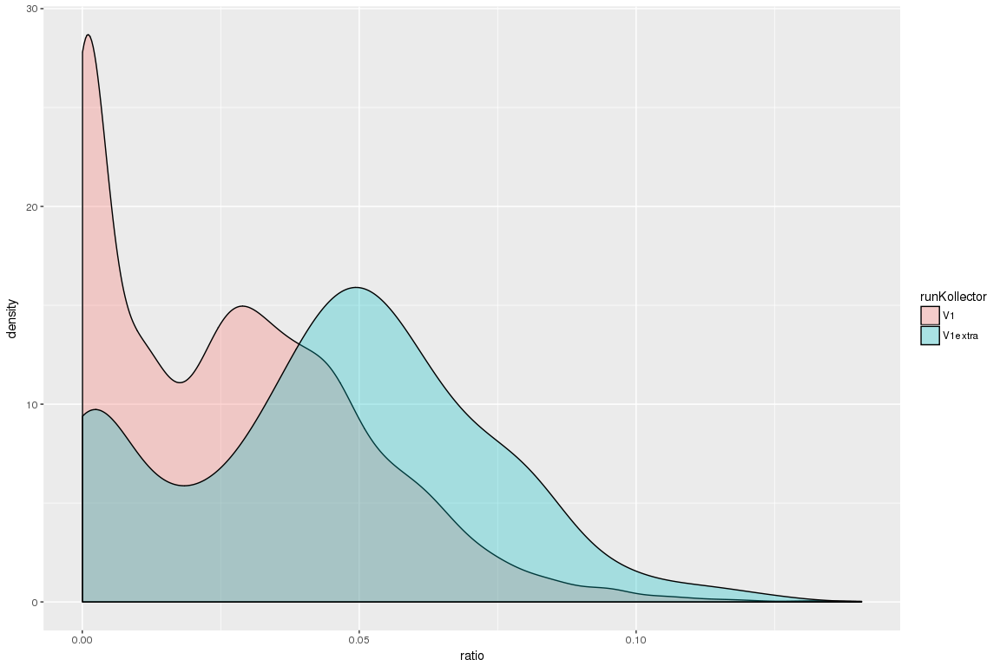
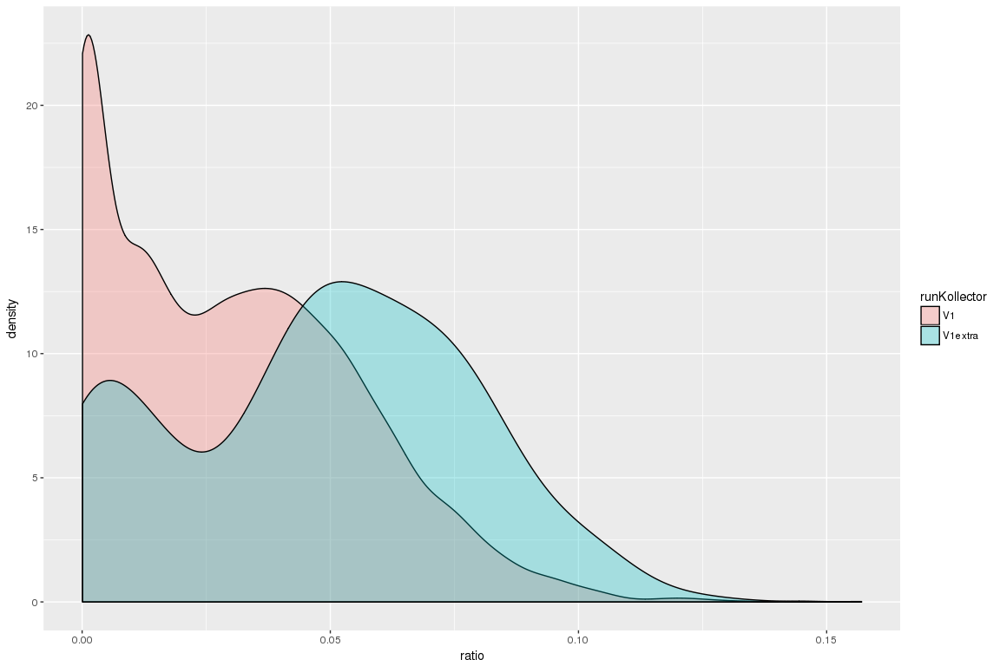
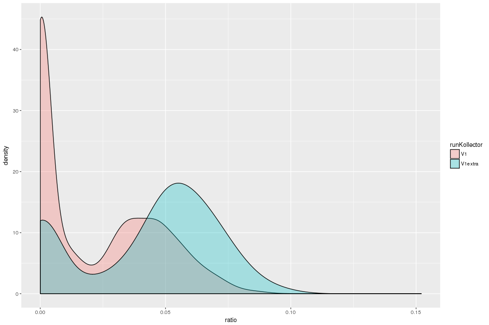
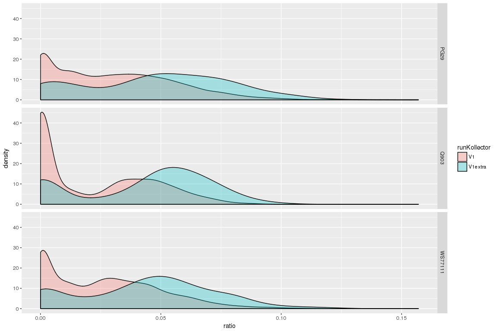
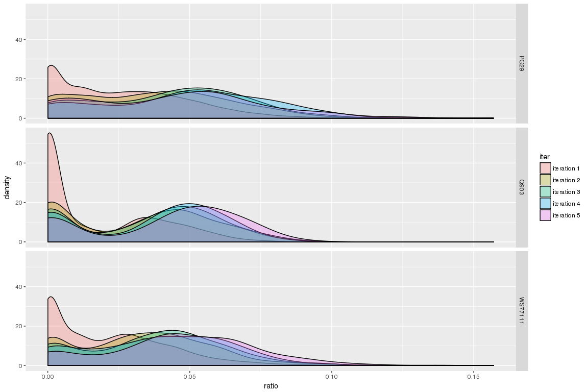

General stats about the assembled contigs so far and Ns
================

Nucleotide counts for 3 species
-------------------------------

``` r
library( dplyr )
library( ggplot2 )
library( tidyr )
library( data.table )
library(plyr)

#list the files
allFiles <- list("/projects/btl/kgagalova/PHD_projects/SpruceUp/KollectorGeneReconstruction3species/RunKollector/data/OutputKollectorRuns/PG29/NstatsPG29.txt",
                  "/projects/btl/kgagalova/PHD_projects/SpruceUp/KollectorGeneReconstruction3species/RunKollector/data/OutputKollectorRuns/WS77111/NstatsWS77111.txt",
                 "/projects/btl/kgagalova/PHD_projects/SpruceUp/KollectorGeneReconstruction3species/RunKollector/data/OutputKollectorRuns/Q903/NstatsQ903.txt")
#load
l <- lapply( allFiles, function( fn ){
  d <- read.table( fn, header = F );
  d$fileName <- fn;
  d
  } );
#make df
d <- bind_rows( l );
dim(d)
```

    ## [1] 34661     9

``` r
nams = c("contig","len","A","C","G","T","N","cpg","fileName")
colnames(d) = nams
#add category
d$species = as.factor(sapply(strsplit(d$fileName,"/"),"[[",11))
d$ratio = d$N/d$len
#exclude total
d1 = subset(d,d$contig != "total")
summary_total = subset(d,d$contig == "total")
#add a flag for extra runs
d1$runKollector = as.factor(ifelse(grepl("extra",d1$contig)=="TRUE","V1extra","V1"))

#---------------------------------------------------------------------
#check general summary
head(summary_total)
```

    ##       contig      len        A        C        G        T       N    cpg
    ## 11686  total 47143757 14167130  8820953  8881287 14225177 1049210 732181
    ## 24643  total 62136097 18968606 11480634 11484610 18976210 1226037 954151
    ## 34661  total 36497764 11002143  6947800  6937239 10978745  631837 611738
    ##                                                                                                                                                fileName
    ## 11686       /projects/btl/kgagalova/PHD_projects/SpruceUp/KollectorGeneReconstruction3species/RunKollector/data/OutputKollectorRuns/PG29/NstatsPG29.txt
    ## 24643 /projects/btl/kgagalova/PHD_projects/SpruceUp/KollectorGeneReconstruction3species/RunKollector/data/OutputKollectorRuns/WS77111/NstatsWS77111.txt
    ## 34661       /projects/btl/kgagalova/PHD_projects/SpruceUp/KollectorGeneReconstruction3species/RunKollector/data/OutputKollectorRuns/Q903/NstatsQ903.txt
    ##       species      ratio
    ## 11686    PG29 0.02225554
    ## 24643 WS77111 0.01973148
    ## 34661    Q903 0.01731166

``` r
summary_total$N/summary_total$len
```

    ## [1] 0.02225554 0.01973148 0.01731166

``` r
#---------------------------------------------------------------------

#chech how many samples have 0 N in the sequence
table(subset(d1, d1$N == 0)[,c("runKollector","species")])
```

    ##             species
    ## runKollector PG29 Q903 WS77111
    ##      V1      5024 4568    5519
    ##      V1extra  181  240     245

``` r
#show the total contigs
table(d1[,c("runKollector","species")])
```

    ##             species
    ## runKollector  PG29  Q903 WS77111
    ##      V1      11183  9505   12276
    ##      V1extra   502   512     680

``` r
#------------------------------------------------------------
#ratio between the 2 <- shown in summary
table(subset(d1, d1$N == 0)[,c("runKollector","species")])/table(d1[,c("runKollector","species")])
```

    ##             species
    ## runKollector      PG29      Q903   WS77111
    ##      V1      0.4492533 0.4805892 0.4495764
    ##      V1extra 0.3605578 0.4687500 0.3602941

``` r
#do the same but ignore Kollector runs
table(d1[,c("species")])
```

    ## 
    ##    PG29    Q903 WS77111 
    ##   11685   10017   12956

``` r
table(subset(d1, d1$N == 0)[,c("species")])
```

    ## 
    ##    PG29    Q903 WS77111 
    ##    5205    4808    5764

``` r
#------------------------------------------------------------
#ratio total and containing N only for species <-shown isn summary
table(subset(d1, d1$N == 0)[,c("species")])/table(d1[,c("species")]) 
```

    ## 
    ##      PG29      Q903   WS77111 
    ## 0.4454429 0.4799840 0.4448904

Plot the Ns in each contig for the 3 species
--------------------------------------------

``` r
##length sequences
cdat <- ddply(d1, "species", summarise, rating.med=median(len))
head(cdat)
```

    ##   species rating.med
    ## 1    PG29     3637.0
    ## 2    Q903     3369.0
    ## 3 WS77111     4396.5

``` r
ggplot(d1, aes(x=len, fill=species)) + geom_density(alpha=.3) +
    geom_vline(data=cdat, aes(xintercept=rating.med,  colour=species),
               linetype="dashed", size=1)
```



``` r
###plot the generals stats for the Ns (all contigs)
ggplot(d1, aes(x=N)) + geom_histogram(fill="gray",colour="black",bins=100)
```



``` r
###plot the general stats for the Ns (exclude zeros)
NozeroN = subset(d1,d1$N!=0)
ggplot(NozeroN, aes(x=N)) + geom_histogram(fill="darkred",colour="black",bins=100) +
    coord_cartesian(xlim = c(1, 1500))
```



``` r
###plot general stats zoomed regions
ggplot(NozeroN, aes(x=N)) + geom_histogram(fill="darkblue",colour="black",bins=100) +
    coord_cartesian(xlim = c(1, 500))
```



``` r
#see peaks most high
order(table(NozeroN$N),decreasing=T)[1:10]
```

    ##  [1]   1 200 201  50   2 400 202  51 401 250

``` r
#summary
summary(NozeroN$N)
```

    ##    Min. 1st Qu.  Median    Mean 3rd Qu.    Max. 
    ##       1       3     138     154     201    1836

``` r
######################################################
#Ns ratios
#exclude ) Ns from the analysis
d2 = subset(d1, d1$N != 0)
cdat <- ddply(d2, "species", summarise, rating.med=median(ratio))
head(cdat)
```

    ##   species rating.med
    ## 1    PG29 0.02839184
    ## 2    Q903 0.01500883
    ## 3 WS77111 0.02591344

``` r
ggplot(d2, aes(x=ratio)) +
    geom_histogram(binwidth=.001, colour="black", fill="white") +
    facet_grid(species ~.) +
    geom_vline(data=cdat, aes(xintercept=rating.med),
               linetype="dashed",colour="red", size=1)
```



``` r
#plot per Kollector and species separately
#--------------------------------------------
#WS77111
d2WS = subset(d2,d2$species == "WS77111")
ggplot(d2WS, aes(x=ratio, fill=runKollector)) + geom_density(alpha=.3)
```



``` r
d2PG = subset(d2,d2$species == "PG29")
ggplot(d2PG, aes(x=ratio, fill=runKollector)) + geom_density(alpha=.3)
```



``` r
d2Q903 = subset(d2,d2$species == "Q903")
ggplot(d2Q903, aes(x=ratio, fill=runKollector)) + geom_density(alpha=.3)
```



``` r
##and all together on a single figure
ggplot(d2, aes(x=ratio, fill=runKollector)) + geom_density(alpha=.3) +
    facet_grid(species ~.)
```



``` r
ddply(d2,species~runKollector,summarise,mean=mean(ratio),sd=sd(ratio),median=median(ratio), mad=mad(ratio))
```

    ##   species runKollector       mean         sd     median        mad
    ## 1    PG29           V1 0.03013477 0.02501665 0.02742702 0.02930679
    ## 2    PG29      V1extra 0.04787367 0.02978887 0.04939323 0.03274529
    ## 3    Q903           V1 0.02239343 0.02358257 0.01272455 0.01853529
    ## 4    Q903      V1extra 0.04261240 0.02734694 0.05061065 0.02379648
    ## 5 WS77111           V1 0.02682547 0.02337857 0.02492869 0.02810985
    ## 6 WS77111      V1extra 0.04403955 0.02768965 0.04666821 0.02631580

``` r
## interesting: plot per V1 colored by iteration
d1$iter = as.factor(sapply(strsplit(d1$contig,"="),"[[",2))
d12plot = subset(d1,d1$runKollector == "V1" & d1$ratio > 0 )
#plot the 3 species
ggplot(d12plot, aes(x=ratio, fill=iter)) + geom_density(alpha=.3) +
    facet_grid(species ~.)
```



Summary
-------

-   The total amount of Ns in the sequences is different for the 3 species. PG29 have the highes ratio (ration Ns/len seq), Q903 the lowest

| species | ratio N/len |
|:-------:|:-----------:|
|   PG29  |    0.0222   |
| WS77111 |    0.0197   |
|   Q903  |    0.0173   |

-   The number of sequences with no Ns is around 44.5, 48 and 44.8% respectively for PG29, WS77111 and Q903, see Table2. More detailed description in Table1.

**Table1**

|   Run   |    PG29   |    Q903   |  WS77111  |
|:-------:|:---------:|:---------:|:---------:|
|    V1   | 0.4492533 | 0.4799840 | 0.4495764 |
| V1extra | 0.3605578 | 0.4687500 | 0.3602941 |

**Table2**

|    PG29   |    Q903   |  WS77111  |
|:---------:|:---------:|:---------:|
| 0.4454429 | 0.4799840 | 0.4448904 |

-   The longest sequences are assembled in WS
-   The size of N gaps is most frequently equal to 1N, than 200, 201, 50, 2, 400, 202, 51, 401 and 250. See peaks in the histograms.
-   The median ratio Ns/len is higest in PG29, followed by WS77111. Q903 contains less Ns.
-   The Ns/len ratio (after the exclusion of 0 Ns so no gaps) looks like a bimodal distribution. Not sure by what it depends. Maybe lower s parameter in Kollector since the second bump is observed mostly in KollectorV1 extra. Or maybe in for genes with a higher amount of introns which are assembled in the following iterations.
-   **IMPORTANT: gaps in Abyss** - this is where we have higher frequency of some gaps. 1 - a single lowercase “n” is used to indicate that two sequences overlap (due to paired-end evidence), but were not merged because the sequences did not perfectly match, 50 bp is the minimum gap length during the ABySS contigs stage, 200 bp is the minimum gap length during the ABySS long scaffolding stage. A peak in 400 may indicate 2 gaps of 200. Scaffolding is unabled by default in Abyss.
