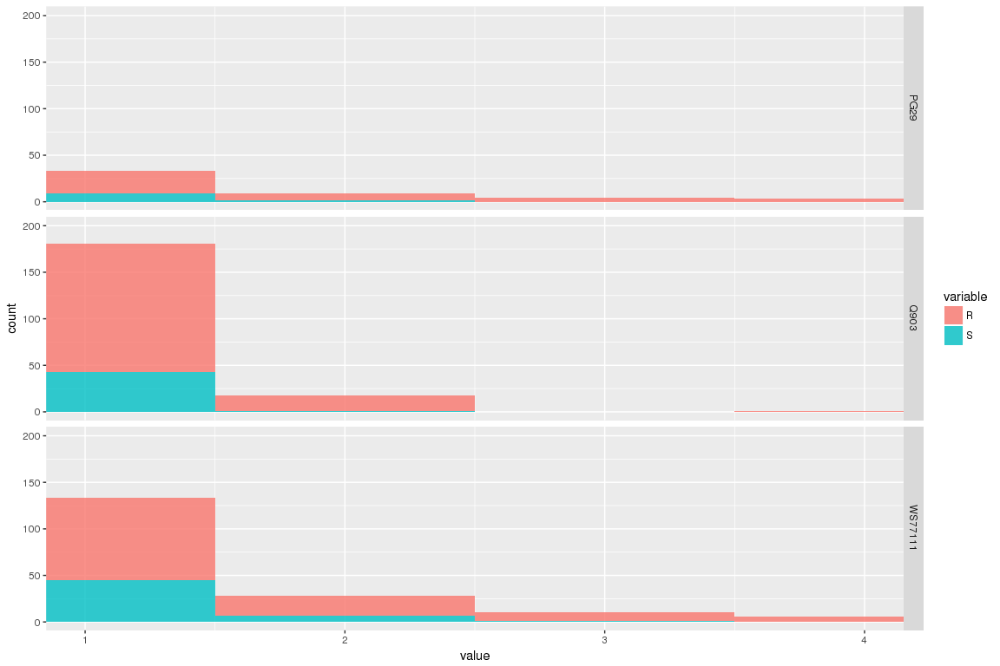
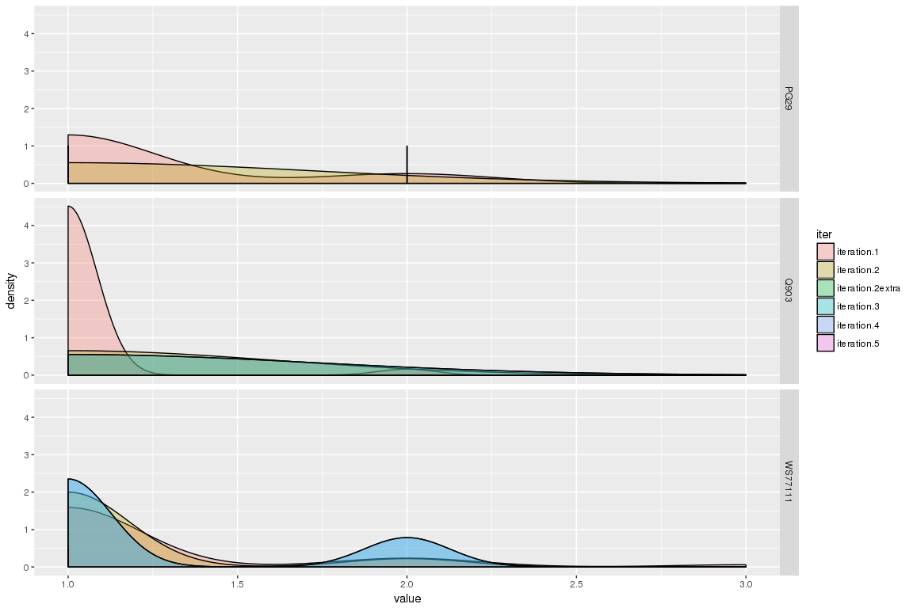
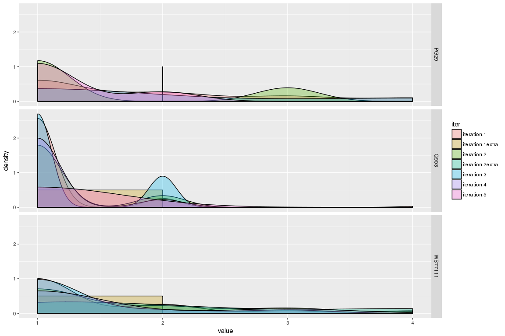

General stats about the assembled contigs so far and R-S nucleotides
================

Nucleotide counts for 3 species
-------------------------------

``` r
library(reshape)
library( dplyr )
library( ggplot2 )
library( tidyr )
library( data.table )
library(plyr)

#load stats R-S
allFiles <- list("/projects/btl/kgagalova/PHD_projects/SpruceUp/KollectorGeneReconstruction3species/RunKollector/data/OutputKollectorRuns/PG29/RSstatsPG29.txt",
                  "/projects/btl/kgagalova/PHD_projects/SpruceUp/KollectorGeneReconstruction3species/RunKollector/data/OutputKollectorRuns/WS77111/RSstatsWS77111.txt",
                 "/projects/btl/kgagalova/PHD_projects/SpruceUp/KollectorGeneReconstruction3species/RunKollector/data/OutputKollectorRuns/Q903/RSstatsQ903.txt")
#load
l <- lapply( allFiles, function( fn ){
  d <- read.table( fn, header = F );
  d$fileName <- fn;
  d
  } );
#make df and refine
rs <- bind_rows( l );
rs$species = as.factor(sapply(strsplit(rs$fileName,"/"),"[[",11))
colnames(rs)[1:3] = c("contig","R","S")
rs$runKollector = as.factor(ifelse(grepl("extra",rs$contig)=="TRUE","V1extra","V1"))
```

Stats
-----

``` r
#-----------------------------------R
table(subset(rs, rs$R == 0)[,c("runKollector","species")])
```

    ##             species
    ## runKollector  PG29  Q903 WS77111
    ##      V1      11147  9353   12158
    ##      V1extra   500   508     674

``` r
#ratio between the 2 <- shown in summary
table(subset(rs, rs$R == 0)[,c("runKollector","species")])/table(rs[,c("runKollector","species")])
```

    ##             species
    ## runKollector      PG29      Q903   WS77111
    ##      V1      0.9967808 0.9840084 0.9903877
    ##      V1extra 0.9960159 0.9921875 0.9911765

``` r
#------------------------------------------------------------
#ratio total and containing R only for species <-shown isn summary
table(subset(rs, rs$R == 0)[,c("species")])/table(rs[,c("species")])
```

    ## 
    ##      PG29      Q903   WS77111 
    ## 0.9967480 0.9844265 0.9904291

``` r
#-----------------------------------S
table(subset(rs, rs$S == 0)[,c("runKollector","species")])
```

    ##             species
    ## runKollector  PG29  Q903 WS77111
    ##      V1      11172  9464   12224
    ##      V1extra   502   509     679

``` r
#ratio between the 2 <- shown in summary
table(subset(rs, rs$S == 0)[,c("runKollector","species")])/table(rs[,c("runKollector","species")])
```

    ##             species
    ## runKollector      PG29      Q903   WS77111
    ##      V1      0.9990164 0.9956865 0.9957641
    ##      V1extra 1.0000000 0.9941406 0.9985294

``` r
#------------------------------------------------------------
#ratio total and containing R only for species <-shown isn summary
table(subset(rs, rs$S == 0)[,c("species")])/table(rs[,c("species")])
```

    ## 
    ##      PG29      Q903   WS77111 
    ## 0.9990586 0.9956075 0.9959092

``` r
#see how many sequences have both
rs_both = subset(rs,rs$R > 0 & rs$S > 0 )
```

Plot the distribution for R and S per sequence
----------------------------------------------

``` r
rs1_m = melt(rs[,c("contig","R","S")], id=c("contig"))
rs1_m = merge(rs1_m,rs[,c("contig","species")],by="contig")
ggplot(rs1_m ,aes(x=value, fill=variable)) + geom_histogram(alpha=.8,binwidth=1) + 
  facet_grid(species ~.) + 
  coord_cartesian(xlim = c(1, 4),ylim = c(1,200))
```



``` r
#plot colored by iteration
rs1_m$iter = as.factor(sapply(strsplit(rs1_m$contig,"="),"[[",2))
ggplot(subset(rs1_m,rs1_m$variable=="S" & rs1_m$value>0 ), aes(x=value, fill=iter)) + geom_density(alpha=.3)+
    facet_grid(species ~.)
```



``` r
ggplot(subset(rs1_m,rs1_m$variable=="R" & rs1_m$value>0 ), aes(x=value, fill=iter)) + geom_density(alpha=.3)+
    facet_grid(species ~.)
```



Summary
-------

-   R (A or G) and S (G or C) are commonly assigned when the assembly does not recognize a certain pattern. It can mean both uncertainty but also gene families or differet alleles.
-   In our case the percentage of sequences with such a nucleotide is very low (1-2%) but it need to be considered.
-   The table shows the number of sequences with R or S:

|    Nucl    | PG29 | Q903 | WS77111 |
|:----------:|:----:|:----:|:-------:|
|      R     |  38  |  156 |   124   |
|      S     |  11  |  44  |    53   |
|    Total   |  49  |  200 |   177   |
| Total cum. |  40  |  195 |   150   |
