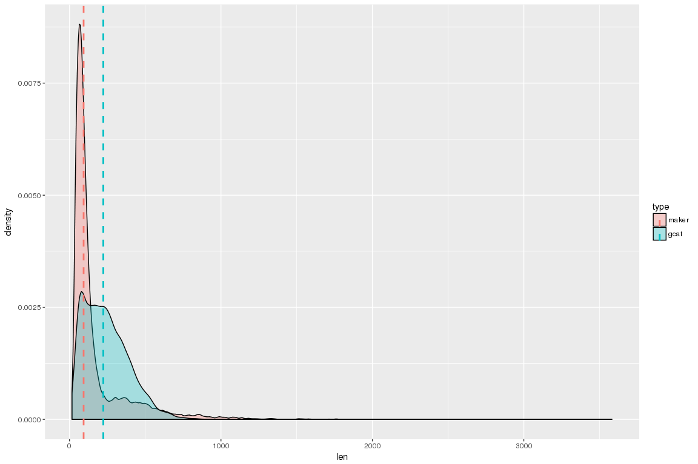
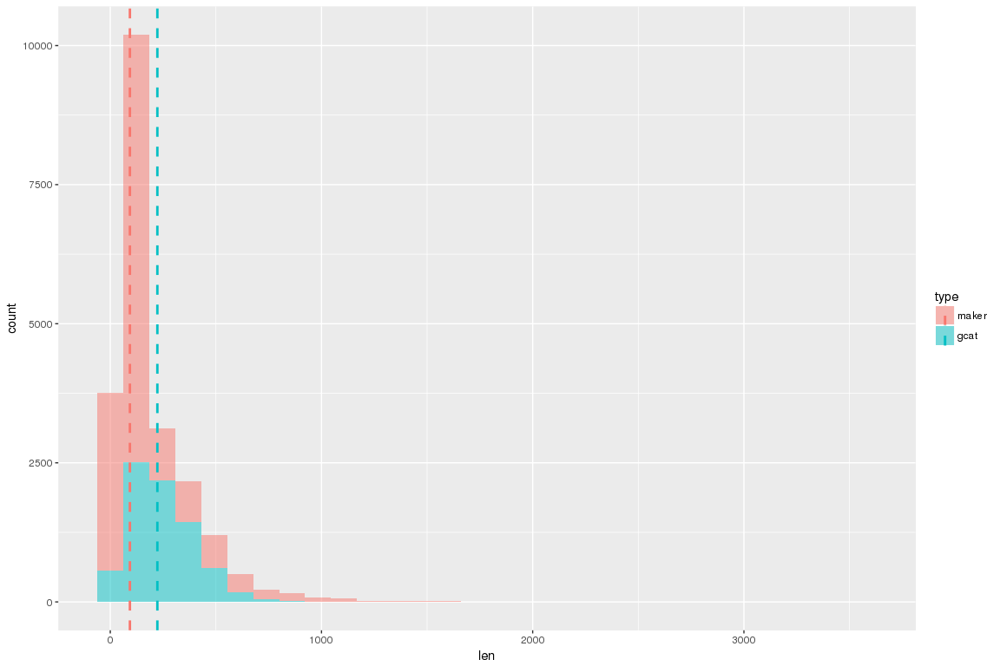
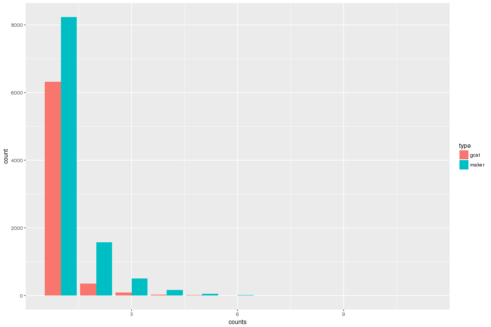

Partial peptides
================

Load the translated peptides
----------------------------

-   Translate cDNA seuence - GCAT or Maker with ORFfinder
-   Minimum ORF must be 30aa
-   Keep only the complete sequences, avoid partial even if those are longer
-   Keep all the peptides within a range og 10aa from the longer. Multiple isoforms possible for the same target?

``` r
library( dplyr )
library( ggplot2 )
library( tidyr )
library( data.table )
library(plyr)

maker <- read.delim("/projects/btl_scratch/kgagalova/TargetSetKollector/cdhit-4/Peptides/PeptidesMaker/LenPeptides.txt", header=FALSE)
gcat <- read.delim("/projects/btl_scratch/kgagalova/TargetSetKollector/cdhit-4/Peptides/PeptidesGCAT/LenPeptides.txt", header=FALSE)

maker$type = as.factor(rep("maker",nrow(maker)))
gcat$type = as.factor(rep("gcat",nrow(gcat)))

peptides = rbind(maker,gcat)
colnames(peptides)[c(1,2)] = c("len","pept_nam")

#get multeplicity per peptide
peptides$target = sapply(strsplit(as.character(peptides$pept_nam), "_product_"), "[[", 2)

freq_makerTargets = cbind(unname(table(subset(peptides,peptides$type=="maker")$target)), rep("maker",nrow(table(subset(peptides,peptides$type=="maker")$target))))
freq_gcatTargets = cbind(unname(table(subset(peptides,peptides$type=="gcat")$target)), rep("gcat",nrow(table(subset(peptides,peptides$type=="gcat")$target))))

freqTargets = as.data.frame(rbind(freq_gcatTargets, freq_makerTargets))
colnames(freqTargets) = c("counts","type")
freqTargets$counts = as.numeric(as.character(freqTargets$counts))
```

Plots
-----

Plot the lengts per group of peptides, GCAT vs Maker

``` r
cdat <- ddply(peptides, "type", summarise, rating.med=median(len))
cdat
```

    ##    type rating.med
    ## 1 maker         93
    ## 2  gcat        223

``` r
ggplot(peptides, aes(x=len, fill=type)) + geom_density(alpha=.3) +
    geom_vline(data=cdat, aes(xintercept=rating.med,  colour=type),
               linetype="dashed", size=1)
```



``` r
ggplot(peptides, aes(x=len, fill=type)) + geom_histogram(alpha=.5) +
    geom_vline(data=cdat, aes(xintercept=rating.med,  colour=type),
               linetype="dashed", size=1)
```



``` r
#plot multeplicity within the type of targets
ggplot(freqTargets, aes(x=counts, fill=type)) +
    geom_histogram(position="dodge",stat="count")
```



Some examples
-------------

-   GCAT clear threshold

        #413     lcl|ORF1_1:195:1436_unnamed_protein_product
        #138     lcl|ORF36_1:1211:795_unnamed_protein_product
        #132     lcl|ORF17_1:1145:1543_unnamed_protein_product
        #106     lcl|ORF15_1:569:889_unnamed_protein_product
        #87    lcl|ORF29_1:1527:1264_unnamed_protein_product
        #79    lcl|ORF38_1:629:390_unnamed_protein_product
        #71    lcl|ORF5_1:421:636_unnamed_protein_product
        #62    lcl|ORF33_1:318:130_unnamed_protein_product
        #60    lcl|ORF12_1:140:322_unnamed_protein_product
        #58    lcl|ORF16_1:968:1144_unnamed_protein_product

-   Maker unclear pattern, non complete peptide, likely truncated peptide at the top?

<!-- -->

    #1074
    lcl|ORF1_augustus_masked-160355095-processed-gene-0.0-mRNA-1:0:3224_unnamed_protein_product,_partial
    #106
    lcl|ORF73_augustus_masked-160355095-processed-gene-0.0-mRNA-1:1876:1556_unnamed_protein_product
    #85
    lcl|ORF68_augustus_masked-160355095-processed-gene-0.0-mRNA-1:3157:2900_unnamed_protein_product
    #82
    lcl|ORF46_augustus_masked-160355095-processed-gene-0.0-mRNA-1:3185:2937_unnamed_protein_product
    #80
    lcl|ORF55_augustus_masked-160355095-processed-gene-0.0-mRNA-1:1568:1326_unnamed_protein_product
    #78
    lcl|ORF85_augustus_masked-160355095-processed-gene-0.0-mRNA-1:2820:2584_unnamed_protein_product
    #71
    lcl|ORF3_augustus_masked-160355095-processed-gene-0.0-mRNA-1:301:516_unnamed_protein_product

From Austin
-----------

-   It is important to have a high quality set of proteins
-   Check the longerst partial ones and see if I can take them back by aligning to proteins and see if their 5 prime is there
-   Exclude the ones with multiple complete and shorter ORFs.
