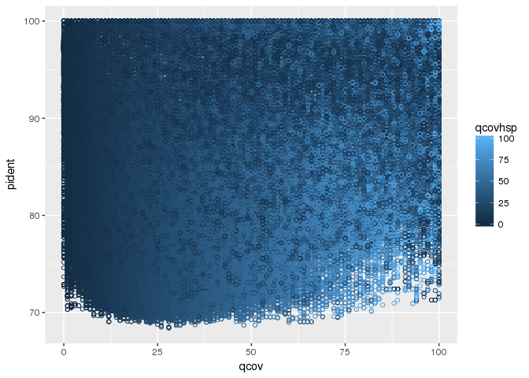

Plot identity vs coverage for 4 data sets generated with cdhit
================

Description
-----------

The code generates a set of images that display the percentage identity vs the query coverage for 4 CDHIT output dataset

Motivation
----------

The plots will show the scatterplot for those values and will enable to display an eventual threshold cut.

**Legend:** - y-axis: identity (pident) - x-axis: query coverage (qcov) - color code: query coverage for the high scoring segment pair (qcovhsp)

cd\_hit\_3\_500plus
-------------------

``` r
library(ggplot2)

wd = "/projects/spruceup/pglauca/WS77111/assemblies/kollector/target-sequences/evaluation/alignments/usr/kgagalova/SameSeq"

nams = c("qseqid", "sseqid", "pident", "length", "mismatch", "gapopen", "qstart", "qend", "sstart", "send", "evalue", "bitscore", "qcov", "qcovhsp")

#import data
cdhit_3_500plus <- read.table(paste0(wd, "/cd_hit_3_500plus/", "cd_hit_3_500plus.allvsall.tsv"))
dim(cdhit_3_500plus)
```

    ## [1] 683697     14

``` r
names(cdhit_3_500plus) = nams
cdhit_3_500plus <- cdhit_3_500plus[which(cdhit_3_500plus$qseqid != cdhit_3_500plus$sseqid),]
dim(cdhit_3_500plus)
```

    ## [1] 583068     14


cd\_hit\_3
----------

``` r
cdhit_3 <- read.table(paste0(wd, "/cdhit-output-3/", "cd_hit_3.allvsall.tsv"))
dim(cdhit_3)
```

    ## [1] 697371     14

``` r
names(cdhit_3) = nams
cdhit_3 <- cdhit_3[which(cdhit_3$qseqid != cdhit_3$sseqid),]
dim(cdhit_3)
```

    ## [1] 593878     14


cd\_hit\_2
----------

``` r
#import data
cdhit_2 <- read.table(paste0(wd, "/cdhit-output-2/", "cd_hit_2.allvsall.tsv"))
dim(cdhit_2)
```

    ## [1] 727978     14

``` r
names(cdhit_2) = nams
cdhit_2 <- cdhit_2[which(cdhit_2$qseqid != cdhit_2$sseqid),]
dim(cdhit_2)
```

    ## [1] 632629     14


cd\_hit\_1
----------

``` r
cdhit_1 <- read.table(paste0(wd, "/cdhit-output-1/", "cd_hit_1.allvsall.tsv"))
dim(cdhit_1)
```

    ## [1] 2860124      14

``` r
names(cdhit_1) = nams
cdhit_1 <- cdhit_2[which(cdhit_1$qseqid != cdhit_1$sseqid),]
dim(cdhit_1)
```

    ## [1] 2657065      14

    ## Warning: Removed 2064965 rows containing missing values (geom_point).




## Conclusions

- There is no clear cut off to use when applying pident and qcov
