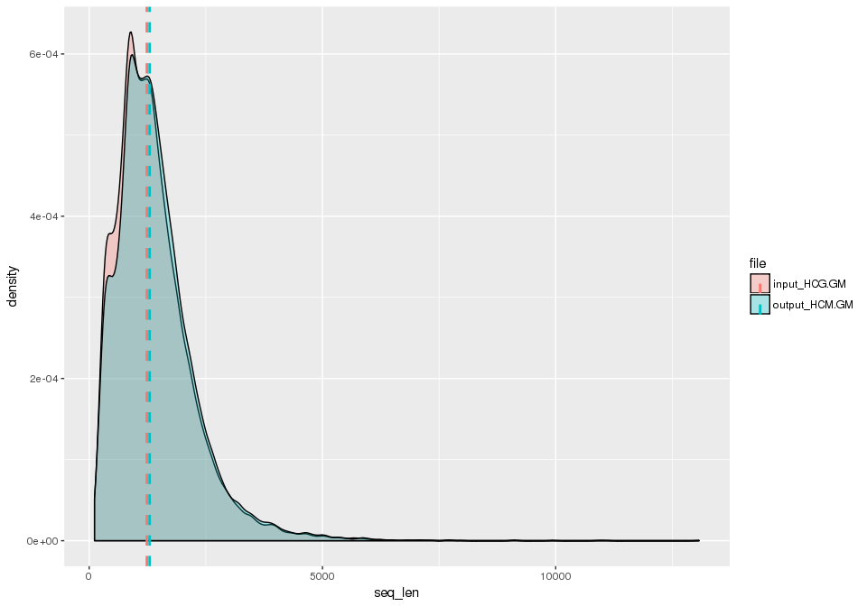
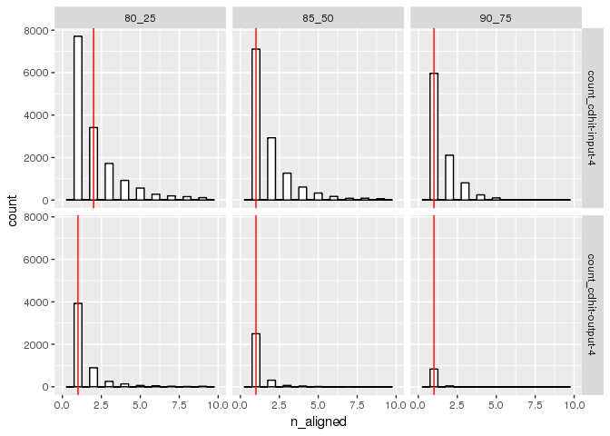
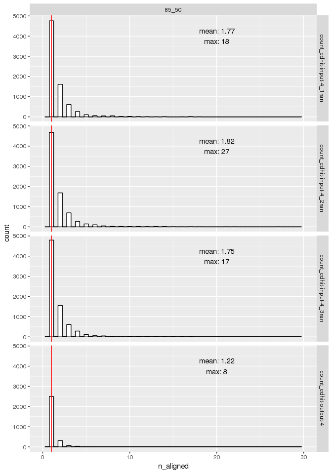

Analysis of multiplicity - different thresholds for HIGH CONFIDENCE GENES and GENETIC MAP
================

Background info
---------------

Given a data set, filter sequence redundancy with cdhit. The output is evaluated through self-BLAST alignment all-vs-all.

Parameters cdhit:
`cd-hit-est -T 0 -M 1000000 -c 0.8 -r 0 -n 4 -i cdhit-input.fa -o cdhit-output-4.fa`

**-c**: defaults "global sequence identity" calculated as: number of identical amino acids in alignment divided by the full length of the shorter sequence
**-r**: strand alignment, 0 means that only +/+ strand alignment is considered
**-n**: word\_length, n parameter selected according to cd-hit user's guide for this -c threshold

Load the fa sequences for cdhit input and output
------------------------------------------------

``` r
library(Biostrings)
library(ggplot2)
library(plyr)

dataPath="/projects/spruceup/pglauca/WS77111/assemblies/kollector/target-sequences/evaluation/alignments/usr/kgagalova/SameSeq/ParseBlast_complete/input"
#select HCG + GM data set
fa_files <- list.files( path = dataPath, pattern = "input-4|output-4", full.names = TRUE )
#load the fa files
seqs <- sapply(fa_files, readDNAStringSet)
names(seqs) = c("input_HCG.GM", "output_HCM.GM")
sapply(seqs, length)
```

    ##  input_HCG.GM output_HCM.GM 
    ##         25306         18243

``` r
#statistics len seqs
widths_seqs = sapply(seqs,width)
sapply(widths_seqs, summary)
```

    ##         input_HCG.GM output_HCM.GM
    ## Min.             114         114.0
    ## 1st Qu.          820         867.5
    ## Median          1237        1296.0
    ## Mean            1385        1440.0
    ## 3rd Qu.         1770        1822.0
    ## Max.           13070       13070.0

``` r
#create data frame from the lengths
d_seqs = cbind(as.data.frame(unname(unlist(widths_seqs))), as.data.frame(rep(names(widths_seqs), sapply(widths_seqs, length))))
names(d_seqs) = c("seq_len","file")
```

``` r
#density plot and median 
cdat <- ddply(d_seqs, "file", summarise, rating.med=median(seq_len))

ggplot(d_seqs, aes(x=seq_len, fill=file)) + geom_density(alpha=.3) +
    geom_vline(data=cdat, aes(xintercept=rating.med,  colour=file),
               linetype="dashed", size=1)
```



-   Average length mRNA is calculated to be 1,396 nucleotides, with an average CDS of 871 bp (290 predicted amino acids) (Rigault et al., 2011)
-   The cdhit removed sequences mainly in the 1000-1200 bp interval

Parsed BLAST - evaluate multiplicity
------------------------------------

Load the results for the count BLAST data, re-arrange and add new columns. The BLAST output has been filtered for self-hits and reverse complement alignment. 3 different thresholds have been set for identity and coverage.

``` r
library( dplyr )
library( ggplot2 )
library( tidyr )
library( data.table )
library(stringr)
#directory with all the data for multeplicity (also from Austin)
dataPath="/projects/spruceup/pglauca/WS77111/assemblies/kollector/target-sequences/evaluation/alignments/usr/kgagalova/SameSeq/ParseBlast_complete/out"
allFiles <- list.files( path = dataPath, pattern = "-input.|cdhit-input-4kristina|cdhit-output-4|output-3-500plus", full.names = TRUE )

l <- lapply( allFiles, function( fn ){
  d <- read.table( fn, header = TRUE );
  d$fileName <- fn;
  d
  } );
d <- bind_rows( l );
```

    ## Warning in bind_rows_(x, .id): Unequal factor levels: coercing to character

    ## Warning in bind_rows_(x, .id): Unequal factor levels: coercing to character

``` r
#dim(d)

d$fa_file = gsub("kristina", "", sapply(strsplit(sapply(strsplit(d$fileName,"/"),tail,1),"\\."),"[[",1))
d$thr = sapply(strsplit(sapply(strsplit(d$fileName,"/"),tail,1),"\\."),tail,2)[1,]
d$fa_file = gsub("kristina", "", sapply(strsplit(sapply(strsplit(d$fileName,"/"),tail,1),"\\."),"[[",1))

#table(d$fa_file, d$thr)
```

Evaluate multeplicity in high confidence genes + genetic map set
----------------------------------------------------------------

Compare the average number of hits per query in original and filtered cdhit data set. Use threshold coverage and identity of 25-80, 50-85 and 75-90%.

``` r
#select HCG and GM data set only
d_hcg.gm = d[grep("4", d$fa_file), ]
#statistics
cbind(table(d_hcg.gm$fa_file, d_hcg.gm$th),total=sapply(seqs, length))
```

    ##                      80_25 85_50 90_75 total
    ## count_cdhit-input-4  15711 12813  9311 25306
    ## count_cdhit-output-4  5424  2922   879 18243

``` r
#calc median of plot
summarise(group_by(d_hcg.gm, fa_file, thr), med=median(n_aligned), mean=mean(n_aligned), mad=mad(n_aligned), std=sd(n_aligned), min=min(n_aligned),max=max(n_aligned))
```

    ## Source: local data frame [6 x 8]
    ## Groups: fa_file [?]
    ## 
    ##                fa_file   thr   med     mean    mad       std   min   max
    ##                  <chr> <chr> <dbl>    <dbl>  <dbl>     <dbl> <int> <int>
    ## 1  count_cdhit-input-4 80_25     2 2.714722 1.4826 3.9937362     1    52
    ## 2  count_cdhit-input-4 85_50     1 2.032701 0.0000 1.9942803     1    33
    ## 3  count_cdhit-input-4 90_75     1 1.587585 0.0000 1.0703666     1    13
    ## 4 count_cdhit-output-4 80_25     1 1.590708 0.0000 1.4845303     1    19
    ## 5 count_cdhit-output-4 85_50     1 1.215264 0.0000 0.6354794     1     8
    ## 6 count_cdhit-output-4 90_75     1 1.056883 0.0000 0.2682005     1     4

Histogram for different thresholds
----------------------------------

``` r
ggplot(d_hcg.gm, aes(x=n_aligned)) +
    geom_histogram(binwidth=.5, colour="black", fill="white") +
    xlim(0, 10) + 
    facet_grid( fa_file ~ thr  ) +
    geom_vline(data=ddply(d_hcg.gm , fa_file~thr, numcolwise(median)), 
      mapping=aes(xintercept=n_aligned), color="red")
```

    ## Warning: Removed 727 rows containing non-finite values (stat_bin).



There are globally less sequences aligned in the cdhit output. And also less sequences at higher thresholds. Is this however do to the size effect or to cdhit? See next analysis

Negative control: random sampling
---------------------------------

``` r
#load the random subsampled sequences
dataPathran = "/projects/spruceup/pglauca/WS77111/assemblies/kollector/target-sequences/evaluation/alignments/usr/kgagalova/SameSeq/ParseBlast_complete/RandomSeq/out"
allFilesRan <- list.files( path = dataPathran, pattern = "ran", full.names = TRUE )
l <- lapply( allFilesRan, function( fn ){
  d <- read.table( fn, header = TRUE );
  d$fileName <- fn;
  d
  } );
d_ran <- bind_rows( l );
```

    ## Warning in bind_rows_(x, .id): Unequal factor levels: coercing to character

    ## Warning in bind_rows_(x, .id): Unequal factor levels: coercing to character

``` r
#add factors columns
d_ran$fa_file = gsub("kristina", "", sapply(strsplit(sapply(strsplit(d_ran$fileName,"/"),tail,1),"\\."),"[[",1))
d_ran$thr = sapply(strsplit(sapply(strsplit(d_ran$fileName,"/"),tail,1),"\\."),tail,2)[1,]
d_ran$fa_file = gsub("kristina", "", sapply(strsplit(sapply(strsplit(d_ran$fileName,"/"),tail,1),"\\."),"[[",1))

#bind to cdhit file
d_ran = rbind(subset(d_hcg.gm, d_hcg.gm$fa_file == "count_cdhit-output-4"), d_ran)
table(d_ran$fa_file,d_ran$thr)
```

    ##                           
    ##                            80_25 85_50 90_75
    ##   count_cdhit-input-4_1ran  9513  7575  5278
    ##   count_cdhit-input-4_2ran  9618  7719  5485
    ##   count_cdhit-input-4_3ran  9492  7569  5315
    ##   count_cdhit-output-4      5424  2922   879

``` r
d_ran85_50 = subset(d_ran, d_ran$thr == "85_50")
#add a column for ran
d_ran85_50$method <- factor( ifelse( grepl( "ran", d_ran85_50$fa_file ), "Random", "Cdhit" ) )

d_summ <- d_ran85_50 %>%
  group_by(fa_file) %>%
  summarise(med = median(n_aligned),mean = round(mean(n_aligned),2),max=max(n_aligned))

ggplot(d_ran85_50, aes(x=n_aligned)) +
    geom_histogram(binwidth=.5, colour="black", fill="white") +
    xlim(0, 30) + 
    facet_grid( fa_file ~ thr  ) +
    geom_vline(data=ddply(d_ran85_50 , fa_file~thr, numcolwise(median)), 
      mapping=aes(xintercept=n_aligned), color="red") +
    geom_text(x = 20, y = 4000, 
            aes(label = paste(paste0("mean: ", mean), paste0("max: ", max),sep="\n")), 
            data = d_summ)
```



### Test for size effect

-   Top 3 sequences are the randomly sampled fasta sequences, the bottom one is the output from cdhit. The blast is made on the same number of sequences - 18243 so removing the size effect variable.

Conclusions
-----------

-   cdhit\_HCG+GM contains 18243 sequences (original data set - 25306)
-   The sequences that have been filtered are mainly those in the length interval 1000 bp - 1200 bp
-   The ratio total/aligned sequences is lower for the cdhit output than for the cdhit imput - meaning that part of the multiplicity has been removed from this data set (input: 15711/25306 = 0.6208, output: 424/18243 =0.2973)
-   The majority of the sequences align to only 1 hit. There are however sequences that align to a large amount of hits.
-   Compared to a random sampling the cdhit performs better. The barplot shows that there is a global lower number of aligned sequences (not hits at all to any other in the data set). The tail of the histogram for cdhit is also shorther, meaning that sequences with high number of hits are less numerous.

References
----------

Rigault P, Boyle B, Lepage P, Cooke JE, Bousquet J, MacKay JJ. (2011) A white spruce gene catalog for conifer genome analyses.
