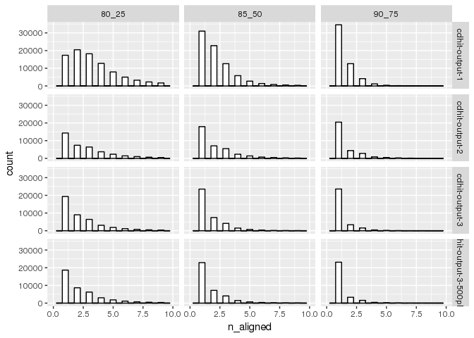

Analysis of multiplicity - different thresholds for
================

Parsed BLAST
------------

Load the results for the count BLAST data, re-arrange and add new columns. The BLAST output has been filtered for self-hits and reverse complement alignment. 3 different thresholds have been set for identity and coverage.

``` r
library( dplyr )
library( ggplot2 )
library( tidyr )
library( data.table )
library(stringr)

dataPath="/projects/spruceup/pglauca/WS77111/assemblies/kollector/target-sequences/evaluation/alignments/usr/kgagalova/SameSeq/ParseBlast_complete/out"
allFiles <- list.files( path = dataPath, pattern = "-output-1.|-output-2.|-output-3.|-output-3-500plus.", full.names = TRUE )

l <- lapply( allFiles, function( fn ){
  d <- read.table( fn, header = TRUE );
  d$fileName <- fn;
  d
  } );
d <- bind_rows( l );
```

    ## Warning in bind_rows_(x, .id): Unequal factor levels: coercing to character

    ## Warning in bind_rows_(x, .id): Unequal factor levels: coercing to character

``` r
d$fa_file = gsub("count_","",sapply(strsplit(sapply(strsplit(d$fileName,"/"),tail,1),"\\."),"[[",1))
d$thr = sapply(strsplit(sapply(strsplit(d$fileName,"/"),tail,1),"\\."),tail,2)[1,]
table(d$fa_file, d$thr)
```

    ##                         
    ##                          80_25 85_50 90_75
    ##   cdhit-output-1         97405 79054 53206
    ##   cdhit-output-2         39139 36035 29389
    ##   cdhit-output-3         43909 38089 29212
    ##   cdhit-output-3-500plus 42413 37080 28667

Motivation
----------

Compare the average number of hits per query in order to evaluate multeplicity at different thresholds of identity and coverage.

``` r
#calc median of plot
summarise(group_by(d, fa_file, thr), med=median(n_aligned), mean=mean(n_aligned), mad=mad(n_aligned), std=sd(n_aligned))
```

    ## Source: local data frame [12 x 6]
    ## Groups: fa_file [?]
    ## 
    ##                   fa_file   thr   med     mean    mad       std
    ##                     <chr> <chr> <dbl>    <dbl>  <dbl>     <dbl>
    ## 1          cdhit-output-1 80_25     3 4.621806 1.4826 5.7754531
    ## 2          cdhit-output-1 85_50     2 2.373163 1.4826 2.0326037
    ## 3          cdhit-output-1 90_75     1 1.533793 0.0000 0.9541381
    ## 4          cdhit-output-2 80_25     2 3.141010 1.4826 3.4450000
    ## 5          cdhit-output-2 85_50     2 2.190703 1.4826 1.7617696
    ## 6          cdhit-output-2 90_75     1 1.581000 0.0000 1.1307961
    ## 7          cdhit-output-3 80_25     2 2.735407 1.4826 3.2444301
    ## 8          cdhit-output-3 85_50     1 1.739557 0.0000 1.3236337
    ## 9          cdhit-output-3 90_75     1 1.307990 0.0000 0.7495623
    ## 10 cdhit-output-3-500plus 80_25     2 2.742390 1.4826 3.2598611
    ## 11 cdhit-output-3-500plus 85_50     1 1.742745 0.0000 1.3279910
    ## 12 cdhit-output-3-500plus 90_75     1 1.309275 0.0000 0.7517037

Histogram plots for different thresholds
----------------------------------------

``` r
ggplot(d, aes(x=n_aligned)) +
    geom_histogram(binwidth=.5, colour="black", fill="white") +
    xlim(0, 10) + 
    facet_grid( fa_file ~ thr  )
```

    ## Warning: Removed 11937 rows containing non-finite values (stat_bin).



Conclusions
-----------

-   The multeplicity decreases with the applied filter (this may be due also to the decreased number of sequences)
-   The data set with the lowest number of average hists is cd-hit-3 and cd-hit-3plus
