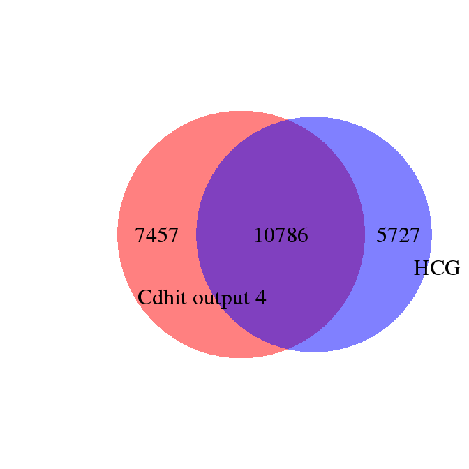
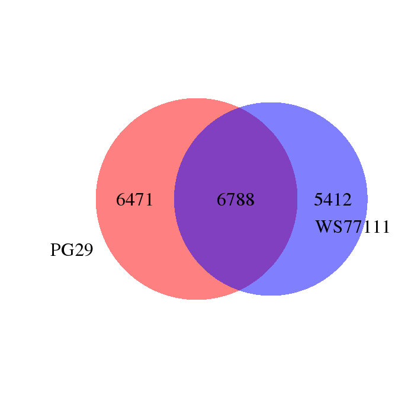

Comparison Erdi (PG29) and Kristina (WS77111) Kollector runs
================

Compare input targets
---------------------

Given the previous results from PG29 - Kollector and the current WS77111, compare the overlap between input targets (High confidence genes vs high confidence genes + genetic map after redundancy removal with cdhit)

``` r
library(Biostrings)
library(VennDiagram)

hcg <- read.table("/projects/cheny_prj/white_spruce/high_confidence_genes.fasta", quote="\"")
cdhit_out4 <- read.table("/projects/spruceup/pglauca/WS77111/assemblies/kollector/target-sequences/evaluation/alignments/usr/kgagalova/SameSeq/cdhit-output-4kristina/cdhit-output-4_nospaces.fa", quote="\"")
#select names
hcg_nams<-as.character(hcg[grep("^>",as.vector(t(hcg))),])
#tot number HCG
length(hcg_nams)
```

    ## [1] 16513

``` r
cdhit_out4_nams<-as.character(cdhit_out4[grep("^>",as.vector(t(cdhit_out4))),])
#tot number cdhit output 4
length(cdhit_out4_nams)
```

    ## [1] 18243

``` r
venn.plot <- draw.pairwise.venn(area1           = length(cdhit_out4_nams),
                                area2           = length(hcg_nams),
                                cross.area      = length(intersect(hcg_nams, cdhit_out4_nams)),
                                category        = c("Cdhit output 4", "HCG"),
                                fill            = c("red", "blue"),
                                lty             = "blank",
                                cex             = 2,
                                cat.cex         = 2,
                                cat.pos         = c(-110, 100),
                                cat.dist        = c(0.2,0.05),
                                cat.just        = list(c(-1, -1), c(1, 1)),
                                ext.pos         = c(20,20),
                                ext.dist        = c(1,1),
                                ext.length      = 0.85,
                                ext.line.lwd    = 2,
                                ext.line.lty    = "dashed"
                                )
```



``` r
#write overlap to file
write.table(as.data.frame(intersect(hcg_nams, cdhit_out4_nams)),"OverlapTranscripts.txt", quote=F, row.names=F, col.names=F)
```

The overlap shows the transcripts that has been used for both WS77111 and PG29 Kollector.

Compare succeeded targets
-------------------------

``` r
PG29 <- read.delim("/projects/btl/kgagalova/comapre_resources/AssembledTranscripts/Out.results.PG29.top", header=FALSE)
WS <- read.delim("/projects/btl/kgagalova/comapre_resources/AssembledTranscripts/Out.results.WS77111.top", header=FALSE)
```

``` r
venn.plot <- draw.pairwise.venn(area1           = length(as.character(PG29[,2])),
                                area2           = length(as.character(WS[,2])),
                                cross.area      = length(intersect(as.character(PG29[,2]), as.character(WS[,2]))),
                                category        = c("PG29", "WS77111"),
                                fill            = c("red", "blue"),
                                lty             = "blank",
                                cex             = 2,
                                cat.cex         = 2,
                                cat.pos         = c(-110, 100),
                                cat.dist        = c(0.2,0.05),
                                cat.just        = list(c(-1, -1), c(1, 1)),
                                ext.pos         = c(20,20),
                                ext.dist        = c(1,1),
                                ext.length      = 0.85,
                                ext.line.lwd    = 2,
                                ext.line.lty    = "dashed"
                                )
```



``` r
#write overlap to file
write.table(as.data.frame(intersect(as.character(PG29[,2]), as.character(WS[,2]))),"OverlapSucceeded.txt", quote=F, row.names=F, col.names=F)
```

The number of successfully reconstructed genes in both the species is 6782.
