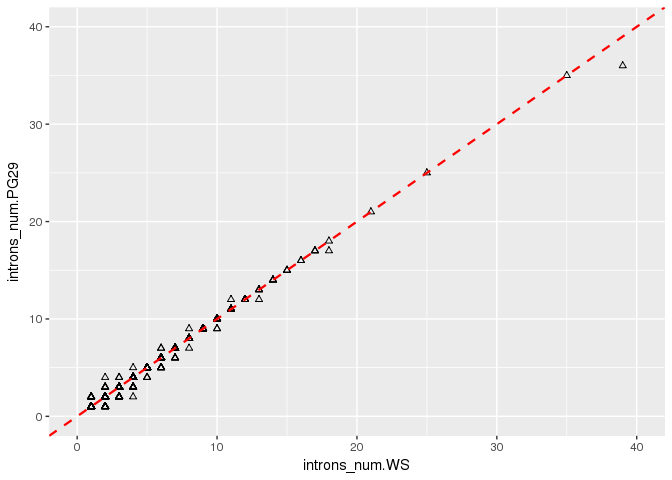
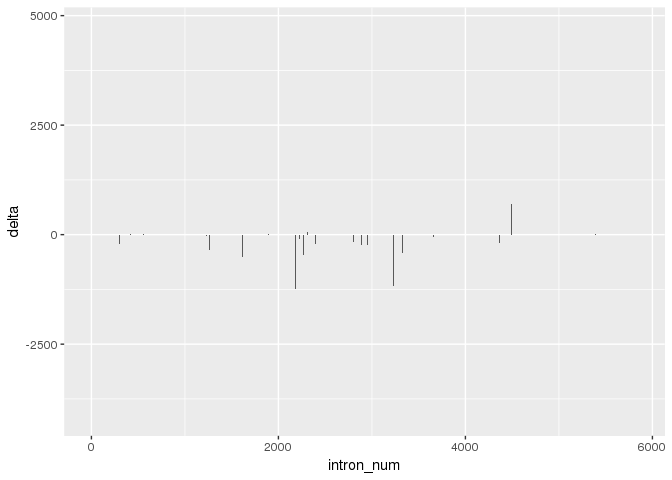
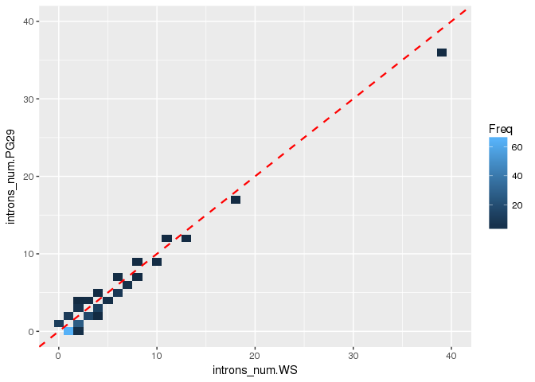

Introns comparison PG29 and WS77111
================

Given the reconstructed gene aligned to the transcript, extract intron info from the CIGAR - GMAP alignment.
Filter any alignmnet which:
- Has soft/hard clipping - Has deletions or insertions

Introns number - PG29
---------------------

``` r
library(qdapRegex)
#load PG29
PG29 <- read.table("/projects/btl/kgagalova/PHD_projects/SpruceUp/KollectorGeneReconstruction3species/PreliminaryResults12May/data/OverlapSucceededPG29_sam.txt", quote="\"")
dim(PG29)
```

    ## [1] 6788    8

``` r
nams=c("bin","coverage","transcript","strand","gene","cigar","MD","NM")
colnames(PG29) = nams
head(PG29)
```

    ##                  bin coverage
    ## 1 myseq12000.fa.r112     0.99
    ## 2 myseq12000.fa.r112     0.99
    ## 3  myseq9000.fa.r112     0.99
    ## 4  myseq3000.fa.r112     0.99
    ## 5 myseq12000.fa.r112     0.99
    ## 6 myseq12000.fa.r112     0.99
    ##                                       transcript strand    gene cigar
    ## 1 snap_masked-92073787-processed-gene-0.1-mRNA-1     16 7715521  411M
    ## 2 snap_masked-85511505-processed-gene-0.1-mRNA-1      0 7624491  216M
    ## 3 snap_masked-60304503-processed-gene-0.2-mRNA-1     16 9255630  397M
    ## 4 snap_masked-38781969-processed-gene-0.1-mRNA-1      0 9176017  378M
    ## 5 snap_masked-25856054-processed-gene-0.2-mRNA-1     16 7687339 1250M
    ## 6 snap_masked-17380839-processed-gene-0.2-mRNA-1     16 7644782  366M
    ##                          MD     NM
    ## 1          MD:Z:129A127T153 NM:i:2
    ## 2                  MD:Z:216 NM:i:0
    ## 3            MD:Z:95A234C66 NM:i:2
    ## 4         MD:Z:74G12C52G237 NM:i:3
    ## 5 MD:Z:168G380C17C623G36G21 NM:i:5
    ## 6                  MD:Z:366 NM:i:0

``` r
#1) soft/hard clipped 
PG29sh=PG29[sapply(regmatches(PG29$cigar, gregexpr("S|H",PG29$cigar)), length) == 0,]
#2) exclude deletions insertions from the alignment 
PG29di=PG29sh[sapply(regmatches(PG29sh$cigar, gregexpr("D|I",PG29sh$cigar)), length) == 0,]
#get number of exons
PG29exons=sapply(regmatches(PG29di$cigar, gregexpr("M",PG29di$cigar)), length)
# single exons genes
PG29single=PG29di[PG29exons==1,]
dim(PG29single)
```

    ## [1] 1963    8

``` r
# multiple exons genes
PG29multi=PG29di[PG29exons>1,]
dim(PG29multi)
```

    ## [1] 2257    8

Extract length and number of introns

``` r
#extract the intron lengths
get_intron_len <- function(mycigar) {
  int_introns = paste(rm_between(mycigar, 'M', 'N', extract=TRUE)[[1]],collapse=",")
  return(int_introns)
}

PG29multi$introns_len=sapply(PG29multi$cigar, get_intron_len)
PG29multi$introns_num=sapply(gregexpr(",", PG29multi$introns_len, fixed = TRUE), function(x) sum(x > -1)) + 1
#write output
write.table(PG29multi,"PG29mutipleIntrons.txt",row.names=F,quote=F)
write.table(PG29single,"PG29noIntrons.txt",row.names=F,quote=F)
```

Introns number - WS77111
------------------------

``` r
#load WS
WS77111 <- read.table("/projects/btl/kgagalova/PHD_projects/SpruceUp/KollectorGeneReconstruction3species/PreliminaryResults12May/data/OverlapSucceededWS77111_sam.txt", quote="\"")
dim(WS77111)
```

    ## [1] 6788    8

``` r
colnames(WS77111) = nams
head(WS77111)
```

    ##                             bin coverage
    ## 1 cdhit-output-4_18.iteration.1     0.99
    ## 2 cdhit-output-4_18.iteration.1     0.99
    ## 3 cdhit-output-4_15.iteration.1     0.99
    ## 4 cdhit-output-4_11.iteration.1     0.99
    ## 5 cdhit-output-4_18.iteration.1     0.99
    ## 6 cdhit-output-4_17.iteration.1     0.99
    ##                                       transcript strand    gene cigar
    ## 1 snap_masked-92073787-processed-gene-0.1-mRNA-1     16 3684716  411M
    ## 2 snap_masked-85511505-processed-gene-0.1-mRNA-1      0 3722524  216M
    ## 3 snap_masked-60304503-processed-gene-0.2-mRNA-1      0 3575853  397M
    ## 4 snap_masked-38781969-processed-gene-0.1-mRNA-1      0 3287915  378M
    ## 5 snap_masked-25856054-processed-gene-0.2-mRNA-1     16 3750983 1250M
    ## 6 snap_masked-17380839-processed-gene-0.2-mRNA-1     16 3052413  366M
    ##                              MD     NM
    ## 1               MD:Z:22T234T153 NM:i:2
    ## 2                      MD:Z:216 NM:i:0
    ## 3                MD:Z:66G234T95 NM:i:2
    ## 4             MD:Z:74G12C52G237 NM:i:3
    ## 5 MD:Z:168G380C17C503C119G36G21 NM:i:6
    ## 6                      MD:Z:366 NM:i:0

``` r
#1) soft/hard clipped 
WS77111sh=WS77111[sapply(regmatches(WS77111$cigar, gregexpr("S|H",WS77111$cigar)), length) == 0,]
#2) exclude deletions insertions from the alignment 
WS77111di=WS77111sh[sapply(regmatches(WS77111sh$cigar, gregexpr("D|I",WS77111sh$cigar)), length) == 0,]
#get number of exons
WS77111exons=sapply(regmatches(WS77111di$cigar, gregexpr("M",WS77111di$cigar)), length)
#single exons genes
WS77111single=WS77111di[WS77111exons==1,]
dim(WS77111single)
```

    ## [1] 1836    8

``` r
#multiple exons genes
WS77111multi=WS77111di[WS77111exons>1,]
dim(WS77111multi)
```

    ## [1] 2238    8

Extract length and number of introns

``` r
#extract the intron lengths
WS77111multi$introns_len=sapply(WS77111multi$cigar, get_intron_len)
WS77111multi$introns_num=sapply(gregexpr(",", WS77111multi$introns_len, fixed = TRUE), function(x) sum(x > -1)) + 1
write.table(WS77111multi,"WS77111mutipleIntrons.txt",row.names=F,quote=F)
write.table(WS77111single,"WS77111noIntrons.txt",row.names=F,quote=F)
```

Summary
-------

Filrering steps are shown in the code comments 1 and 2

|                Type                | PG29 | WS77111 |
|:----------------------------------:|:----:|:-------:|
|        Succeeded-overlapped        | 6788 |   6788  |
|     1 - Exclude clipping S & H     |      |         |
| 2 - Exclude Indels I and D from 1) |      |         |
|        Results: Single exon        |      |         |
|       Results: Multiple exons      |      |         |

-   Several genes show complicated D/I pattern: snap\_masked-168486261-processed-gene-0.33-mRNA-1 - WS, **2S595M12D213M1D114M15S**, snap\_masked-168412892-processed-gene-0.11-mRNA-1 - WS, **1293M12I1197M**
-   Some complicated pattern are present for intronic structures with I/D: maker-82336937-augustus-gene-0.3-mRNA-1 - WS, **77M1D1145M175N289M102N90M**

Merge the 2 tables for comparison - multiple introns
----------------------------------------------------

``` r
compTranscripts = merge(PG29multi,WS77111multi,by="transcript")

nams_merged=c("transcript", "bin.PG29", "coverage.PG29","strand.PG29","gene.PG29", "cigar.PG29", "MD.PG29", "NM.PG29", "introns_len.PG29","introns_num.PG29","bin.WS","coverage.WS","strand.WS","gene.WS","cigar.WS","MD.WS", "NM.WS", "introns_len.WS", "introns_num.WS")
colnames(compTranscripts) = nams_merged

#show swapped order of the introns (ex row:2,3,5)
head(compTranscripts[,c("introns_len.PG29","introns_len.WS")],n=10)
```

    ##    introns_len.PG29 introns_len.WS
    ## 1                79             79
    ## 2       174,527,262    262,527,174
    ## 3          1638,221       221,1638
    ## 4           122,152        122,152
    ## 5               199            382
    ## 6           371,112        112,371
    ## 7            81,564         81,248
    ## 8                42         42,304
    ## 9                91             91
    ## 10           769,50         50,769

``` r
#functon to swap strands when antisense == 16
#enter here the two columns of the data frame, one with the strand infor and the other one with the introns length
swap_same <-function(df){
  rev_int=c()
  for(row in 1:nrow(df)){
    cur_row = df[row,]
    if(cur_row[1]==0){
      rev_int = c(rev_int,unname(cur_row[2]))
    }else{
      rev_int=c(rev_int, paste(rev(as.numeric(strsplit(as.character(cur_row[2]),",")[[1]])),collapse=","))
  }
 }
 rev_int = sapply(rev_int,"[[",1)
 return(rev_int)
}

compTranscripts$swap.introns_len.PG29 = swap_same(compTranscripts[,c("strand.PG29","introns_len.PG29")])
compTranscripts$swap.introns_len.WS = swap_same(compTranscripts[,c("strand.WS","introns_len.WS")])
write.table(compTranscripts,"OverlappingMultipleIntrons.txt",row.names=F,quote=F)
```

Merge the 2 tables for comparison - single introns
--------------------------------------------------

``` r
compTranscriptsSingle = merge(PG29single,WS77111single,by="transcript")
write.table(compTranscriptsSingle,"OverlappingSingleExon.txt",row.names=F,quote=F)
```

-----------------
-----------------

Preliminary statistics - comparison between number of introns
-------------------------------------------------------------

``` r
sum(compTranscripts$introns_num.PG29 == compTranscripts$introns_num.WS)
```

    ## [1] 1790

Comparison between intron lengths
---------------------------------

``` r
sum(compTranscripts$swap.introns_len.PG29 == compTranscripts$swap.introns_len.WS)
```

    ## [1] 1281

Summary for comparison - intron length
--------------------------------------

Total overlapping transcripts (multiple exons only, no I and D): **1841**

|                    n                    | PG29vsWS77111 |
|:---------------------------------------:|:-------------:|
|  same number of introns per transcript  |      1750     |
| same length of introns per transcript\* |      1246     |

\*Same length of introns refers to genes with same number of introns

Basic plots - introns number
----------------------------

``` r
#number of introns in PG29 vs number of introns in WS
#WARNING: there are 1841 points in this plot most of them are overlapping in the low range numbers of the plot
library(ggplot2)
ggplot(compTranscripts, aes(x=introns_num.WS, y=introns_num.PG29)) + geom_point(shape=2,col="black") + 
   geom_abline(intercept = 0, slope = 1, color="red", 
                 linetype="dashed", size=0.8) + 
    coord_cartesian(ylim=c(0, 40),xlim=c(0,40))
```



``` r
#general difference: number of introns
#WS higher number of introns than PG29
sum((compTranscripts$introns_num.PG29 - compTranscripts$introns_num.WS) < 0)
```

    ## [1] 76

``` r
#PG29 higher number of introns than WS
sum((compTranscripts$introns_num.PG29 - compTranscripts$introns_num.WS) > 0)
```

    ## [1] 22

Basic plots - delta introns length
----------------------------------

``` r
#get transcripts with same number of introns
compTranscriptsSameIntrNumb = compTranscripts[which(compTranscripts$introns_num.PG29 == compTranscripts$introns_num.WS),]

#function that calculate the delta between each intron
calc_delta <-function(df){
  delta=c()
  for(row in 1:nrow(df)){
    cur_row = df[row,]
    d1 = as.numeric(strsplit(as.character(cur_row[1]),",")[[1]])
    d2 = as.numeric(strsplit(as.character(cur_row[2]),",")[[1]])
    diff= d1-d2
    delta=c(delta,diff)
 }
 return(delta)
}

delta_len = calc_delta(compTranscriptsSameIntrNumb[,c("swap.introns_len.PG29","swap.introns_len.WS")])
df_delta = data.frame(seq(1:length(delta_len)),delta_len)
names(df_delta) = c("intron_num","delta")

#barplot showing the delta in intron lengths
#negative part of plot shows the longer introns in WS and positive the longer in PG29
ggplot(data=df_delta, aes(x=intron_num, y=delta)) +
  geom_bar(stat="identity") 
```



``` r
summary(df_delta$delta)
```

    ##    Min. 1st Qu.  Median    Mean 3rd Qu.    Max. 
    ## -4148.0     0.0     0.0   -14.5     0.0  4745.0

Extra intron number: new data analysis, include aslo single exons to the comparison
-----------------------------------------------------------------------------------

The previous analysis was not considering the singlie exons when doing the comparison for intron number/length

``` r
#WS77111
WS77111single$introns_len = rep(0,nrow(WS77111single))
WS77111single$introns_num = rep(0,nrow(WS77111single))
WS77111all = rbind(WS77111single,WS77111multi)
#PG29
PG29single$introns_len = rep(0,nrow(PG29single))
PG29single$introns_num = rep(0,nrow(PG29single))
PG29all = rbind(PG29single,PG29multi)

compTranscriptsAll = merge(PG29all,WS77111all,by="transcript")
colnames(compTranscriptsAll) = nams_merged

compTranscriptsAll$swap.introns_len.PG29 = swap_same(compTranscriptsAll[,c("strand.PG29","introns_len.PG29")])
compTranscriptsAll$swap.introns_len.WS = swap_same(compTranscriptsAll[,c("strand.WS","introns_len.WS")])

sum(compTranscriptsAll$introns_num.PG29 == compTranscriptsAll$introns_num.WS)
```

    ## [1] 3508

``` r
sum(compTranscriptsAll$swap.introns_len.PG29 == compTranscriptsAll$swap.introns_len.WS)
```

    ## [1] 2999

Plot the data analysis and show differences

``` r
ggplot(compTranscriptsAll, aes(x=introns_num.WS, y=introns_num.PG29)) + geom_point(shape=2,col="black") + 
   geom_abline(intercept = 0, slope = 1, color="red", 
                 linetype="dashed", size=0.8) + 
    coord_cartesian(ylim=c(0, 40),xlim=c(0,40))
```


``` r
#general difference: number of introns
#WS higher number of introns than PG29
sum((compTranscriptsAll$introns_num.PG29 - compTranscriptsAll$introns_num.WS) < 0)
```

    ## [1] 144

``` r
#PG29 higher number of introns than WS
sum((compTranscriptsAll$introns_num.PG29 - compTranscriptsAll$introns_num.WS) > 0)
```

    ## [1] 33

Show all the possible transitions of introns number
---------------------------------------------------

``` r
DiffIntronsNum = which(data.frame(table(compTranscriptsAll[,c("introns_num.PG29","introns_num.WS")]))$Freq != 0 )
Freq_diff = data.frame(table(compTranscriptsAll[,c("introns_num.PG29","introns_num.WS")]))
Freq_diff = Freq_diff[DiffIntronsNum,]
Freq_diff[,c(1,2,3)] = sapply(Freq_diff[,c(1,2,3)],as.character)
Freq_diff[,c(1,2,3)] = sapply(Freq_diff[,c(1,2,3)],as.numeric)
Freq_diff = Freq_diff[which(Freq_diff$introns_num.PG29 != Freq_diff$introns_num.WS),]
Freq_diff
```

    ##     introns_num.PG29 introns_num.WS Freq
    ## 2                  1              0   11
    ## 24                 0              1   65
    ## 26                 2              1    9
    ## 47                 0              2    3
    ## 48                 1              2   26
    ## 50                 3              2    5
    ## 51                 4              2    1
    ## 72                 2              3   16
    ## 74                 4              3    2
    ## 95                 2              4    1
    ## 96                 3              4   12
    ## 98                 5              4    1
    ## 120                4              5    3
    ## 144                5              6    8
    ## 146                7              6    2
    ## 168                6              7    4
    ## 192                7              8    1
    ## 194                9              8    1
    ## 240                9             10    2
    ## 266               12             11    1
    ## 312               12             13    1
    ## 432               17             18    1
    ## 529               36             39    1

``` r
#create a heatmap of the differences
ggplot(data = Freq_diff, aes(x = introns_num.WS, y = introns_num.PG29)) +
  geom_tile(aes(fill = Freq)) + 
  geom_abline(intercept = 0, slope = 1, color="red", 
                 linetype="dashed", size=0.8) + 
   coord_cartesian(ylim=c(0, 40),xlim=c(0,40))
```


