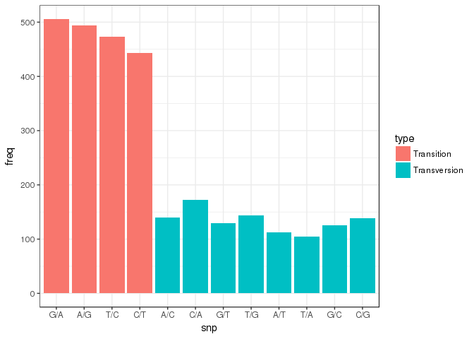

SNPS differences
================

SNPs nucleotides
----------------

Analyze SNPs, difference between PG29 and WS77111

``` r
snps <- read.csv("/projects/btl/kgagalova/PHD_projects/SpruceUp/PreliminaryResults12May/data/SnpsAnalysis/snpsWS_PGnowhite.txt", header=FALSE)
#reaarrange data frame
df_dna= data.frame(contigs=gsub('\t',':',gsub('>','',snps[grep(">", snps$V1), ])))
df_dna$snps= gsub("\\t$", "", snps[grep("A|G|T|C|None", snps$V1),])
#total exons-genes without snp
length(which(df_dna$snps == 'None'))
```

    ## [1] 1004

``` r
dim(df_dna)
```

    ## [1] 1696    2

``` r
#get table with snips only
df_dna1= df_dna[which(df_dna$snps != 'None'),]
#get frequencies
sort(table(sapply(unname(data.frame(unname(sapply(sapply(df_dna1$snps,strsplit,'\t'),strsplit,' ')))[2,]),as.character)),decreasing=T)
```

    ## 
    ## G/A A/G T/C C/T C/A T/G A/C C/G G/T G/C A/T T/A A/N T/N C/N G/N A/R C/Y 
    ## 506 494 473 443 173 144 140 138 130 125 112 105  68  52  43  38   7   6 
    ## C/S G/S T/Y Y/T A/W G/K N/A N/G R/G S/C T/K 
    ##   3   3   3   2   1   1   1   1   1   1   1

| mismatch |  freq|
|:--------:|-----:|
|    G/A   |   506|
|    A/G   |   494|
|    T/C   |   473|
|    C/T   |   443|
|    C/A   |   173|
|    T/G   |   144|
|    A/C   |   140|
|    C/G   |   138|
|    G/T   |   130|
|    G/C   |   125|
|    A/T   |   112|
|    T/A   |   105|
|    A/N   |    68|
|    T/N   |    52|
|    C/N   |    43|
|    G/N   |    38|
|    A/R   |     7|
|    C/Y   |     6|
|    C/S   |     3|
|    G/S   |     3|
|    T/Y   |     3|
|    Y/T   |     2|
|    A/W   |     1|
|    G/K   |     1|
|    N/A   |     1|
|    N/G   |     1|
|    R/G   |     1|
|    S/C   |     1|
|    T/K   |     1|

AA mismatches
-------------

``` r
aa <- read.csv("/projects/btl/kgagalova/PHD_projects/SpruceUp/PreliminaryResults12May/data/SnpsAnalysis/snpsWS_PGaanowhite.txt", header=FALSE)
#reaarrange data frame
df_aa= data.frame(contigs=gsub('\t',':',gsub('>','',aa[grep(">", aa$V1), ])))
df_aa$mis= gsub("\\t$", "", aa[grep("[A-Z]|None", aa$V1),])
#total exons-genes without snp
length(which(df_aa$mis == 'None'))
```

    ## [1] 1141

``` r
dim(df_aa)
```

    ## [1] 1696    2

``` r
#get table with snips only
df_aa1= df_aa[which(df_aa$mis != 'None'),]
#get frequencies
sort(table(sapply(unname(data.frame(unname(sapply(sapply(df_aa1$mis,strsplit,'\t'),strsplit,' ')))[2,]),as.character)),decreasing=T)
```

    ## 
    ## A/T V/A T/A V/I F/L K/E A/V E/K I/V L/P N/S N/K S/N L/F E/D K/N R/K S/A 
    ##  58  45  40  38  34  34  32  32  32  28  28  27  27  26  23  23  23  23 
    ## I/T D/E G/R I/M L/V N/D P/S D/N L/I M/I D/G F/S R/Q T/I P/L Q/R L/S R/G 
    ##  22  21  21  21  21  21  21  20  20  20  19  19  19  19  18  18  16  16 
    ## S/P K/R S/T E/Q G/A G/S M/L A/S G/E H/Q H/R K/Q R/H R/S S/R A/E C/R M/T 
    ##  16  15  15  14  14  14  14  13  13  13  13  13  13  13  13  12  12  12 
    ## M/V Q/E Q/K S/G E/G I/L K/T R/C T/M V/M H/D H/X P/A S/F S/L S/Y V/X A/G 
    ##  12  12  12  12  11  11  11  11  11  11  10  10  10  10  10  10  10   9 
    ## E/A F/I Q/H Y/C -/Q A/D C/Y G/D H/N L/M L/X N/X S/C T/K T/S V/L H/Y K/X 
    ##   9   9   9   9   8   8   8   8   8   8   8   8   8   8   8   8   7   7 
    ## T/X V/F Y/D Y/S C/S D/Y E/X F/V I/N N/T R/L Y/H -/E A/P C/F C/G D/A G/V 
    ##   7   7   7   7   6   6   6   6   6   6   6   6   5   5   5   5   5   5 
    ## G/X I/F L/H L/R N/Y Q/P R/I R/T S/I S/X Y/X A/X D/H D/V F/Y G/C I/S N/I 
    ##   5   5   5   5   5   5   5   5   5   5   5   4   4   4   4   4   4   4 
    ## P/T T/N V/E Y/F -/R -/W C/X D/X H/P I/K I/R K/I K/M L/Q N/H P/H P/R Q/X 
    ##   4   4   4   4   3   3   3   3   3   3   3   3   3   3   3   3   3   3 
    ## R/- S/- T/P T/R V/D W/L W/R Y/N -/C C/- E/V F/C F/X G/N H/L I/X K/- L/W 
    ##   3   3   3   3   3   3   3   3   2   2   2   2   2   2   2   2   2   2 
    ## M/A M/K M/R P/Q Q/- R/M R/P R/W R/X S/E T/V V/G V/T W/C W/S X/L -/K -/L 
    ##   2   2   2   2   2   2   2   2   2   2   2   2   2   2   2   2   1   1 
    ## -/S -/Y A/I A/L C/H D/I E/- E/N F/P G/I G/P G/Q G/W H/C I/G I/H K/A K/D 
    ##   1   1   1   1   1   1   1   1   1   1   1   1   1   1   1   1   1   1 
    ## K/G K/S K/W L/C M/C M/X N/E N/Q N/V P/X Q/L Q/M Q/N Q/S R/N S/W W/- X/A 
    ##   1   1   1   1   1   1   1   1   1   1   1   1   1   1   1   1   1   1 
    ## X/K X/R X/S 
    ##   1   1   1

| freq | aa  |
|------|-----|
| 58   | A/T |
| 45   | V/A |
| 40   | T/A |
| 38   | V/I |
| 34   | F/L |
| 34   | K/E |
| 32   | A/V |
| 32   | E/K |
| 32   | I/V |
| 28   | L/P |
| 28   | N/S |
| 27   | N/K |
| 27   | S/N |
| 26   | L/F |
| 23   | E/D |
| 23   | K/N |
| 23   | R/K |
| 23   | S/A |
| 22   | I/T |
| 21   | D/E |
| 21   | G/R |
| 21   | I/M |
| 21   | L/V |
| 21   | N/D |
| 21   | P/S |
| 20   | D/N |
| 20   | L/I |
| 20   | M/I |
| 19   | D/G |
| 19   | F/S |
| 19   | R/Q |
| 19   | T/I |
| 18   | P/L |
| 18   | Q/R |
| 16   | L/S |
| 16   | R/G |
| 16   | S/P |
| 15   | K/R |
| 15   | S/T |
| 14   | E/Q |
| 14   | G/A |
| 14   | G/S |
| 14   | M/L |
| 13   | A/S |
| 13   | G/E |
| 13   | H/Q |
| 13   | H/R |
| 13   | K/Q |
| 13   | R/H |
| 13   | R/S |
| 13   | S/R |
| 12   | A/E |
| 12   | C/R |
| 12   | M/T |
| 12   | M/V |
| 12   | Q/E |
| 12   | Q/K |
| 12   | S/G |
| 11   | E/G |
| 11   | I/L |
| 11   | K/T |
| 11   | R/C |
| 11   | T/M |
| 11   | V/M |
| 10   | H/D |
| 10   | H/X |
| 10   | P/A |
| 10   | S/F |
| 10   | S/L |
| 10   | S/Y |
| 10   | V/X |
| 9    | A/G |
| 9    | E/A |
| 9    | F/I |
| 9    | Q/H |
| 9    | Y/C |
| 8    | -/Q |
| 8    | A/D |
| 8    | C/Y |
| 8    | G/D |
| 8    | H/N |
| 8    | L/M |
| 8    | L/X |
| 8    | N/X |
| 8    | S/C |
| 8    | T/K |
| 8    | T/S |
| 8    | V/L |
| 7    | H/Y |
| 7    | K/X |
| 7    | T/X |
| 7    | V/F |
| 7    | Y/D |
| 7    | Y/S |
| 6    | C/S |
| 6    | D/Y |
| 6    | E/X |
| 6    | F/V |
| 6    | I/N |
| 6    | N/T |
| 6    | R/L |
| 6    | Y/H |
| 5    | -/E |
| 5    | A/P |
| 5    | C/F |
| 5    | C/G |
| 5    | D/A |
| 5    | G/V |
| 5    | G/X |
| 5    | I/F |
| 5    | L/H |
| 5    | L/R |
| 5    | N/Y |
| 5    | Q/P |
| 5    | R/I |
| 5    | R/T |
| 5    | S/I |
| 5    | S/X |
| 5    | Y/X |
| 4    | A/X |
| 4    | D/H |
| 4    | D/V |
| 4    | F/Y |
| 4    | G/C |
| 4    | I/S |
| 4    | N/I |
| 4    | P/T |
| 4    | T/N |
| 4    | V/E |
| 4    | Y/F |
| 3    | -/R |
| 3    | -/W |
| 3    | C/X |
| 3    | D/X |
| 3    | H/P |
| 3    | I/K |
| 3    | I/R |
| 3    | K/I |
| 3    | K/M |
| 3    | L/Q |
| 3    | N/H |
| 3    | P/H |
| 3    | P/R |
| 3    | Q/X |
| 3    | R/- |
| 3    | S/- |
| 3    | T/P |
| 3    | T/R |
| 3    | V/D |
| 3    | W/L |
| 3    | W/R |
| 3    | Y/N |
| 2    | -/C |
| 2    | C/- |
| 2    | E/V |
| 2    | F/C |
| 2    | F/X |
| 2    | G/N |
| 2    | H/L |
| 2    | I/X |
| 2    | K/- |
| 2    | L/W |
| 2    | M/A |
| 2    | M/K |
| 2    | M/R |
| 2    | P/Q |
| 2    | Q/- |
| 2    | R/M |
| 2    | R/P |
| 2    | R/W |
| 2    | R/X |
| 2    | S/E |
| 2    | T/V |
| 2    | V/G |
| 2    | V/T |
| 2    | W/C |
| 2    | W/S |
| 2    | X/L |
| 1    | -/K |
| 1    | -/L |
| 1    | -/S |
| 1    | -/Y |
| 1    | A/I |
| 1    | A/L |
| 1    | C/H |
| 1    | D/I |
| 1    | E/- |
| 1    | E/N |
| 1    | F/P |
| 1    | G/I |
| 1    | G/P |
| 1    | G/Q |
| 1    | G/W |
| 1    | H/C |
| 1    | I/G |
| 1    | I/H |
| 1    | K/A |
| 1    | K/D |
| 1    | K/G |
| 1    | K/S |
| 1    | K/W |
| 1    | L/C |
| 1    | M/C |
| 1    | M/X |
| 1    | N/E |
| 1    | N/Q |
| 1    | N/V |
| 1    | P/X |
| 1    | Q/L |
| 1    | Q/M |
| 1    | Q/N |
| 1    | Q/S |
| 1    | R/N |
| 1    | S/W |
| 1    | W/- |
| 1    | X/A |
| 1    | X/K |
| 1    | X/R |
| 1    | X/S |

``` r
library(ggplot2)
#barplot transitions/transversions
toPlotTransTransv = sort(table(sapply(unname(data.frame(unname(sapply(sapply(df_dna1$snps,strsplit,'\t'),strsplit,' ')))[2,]),as.character)),decreasing=T)[1:12]

names_plot = c("G/A","A/G","T/C","C/T","A/C","C/A","G/T","T/G","A/T","T/A","G/C" ,"C/G" )
toPlotTransTransv = toPlotTransTransv[names_plot]
df_plot = data.frame(type=c(rep("Transition",4),rep("Transversion",8)),snp=names_plot,freq = unname(toPlotTransTransv))
names(df_plot) = c("type","snp","Var1","freq")
ggplot(df_plot, aes(x=snp, y=freq, fill=type)) +
  geom_bar(stat="identity")+ theme_bw() + 
  scale_x_discrete(limits = names_plot)
```


