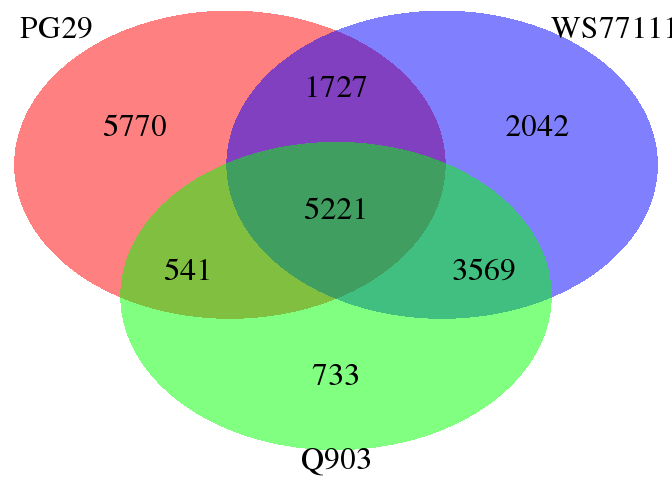
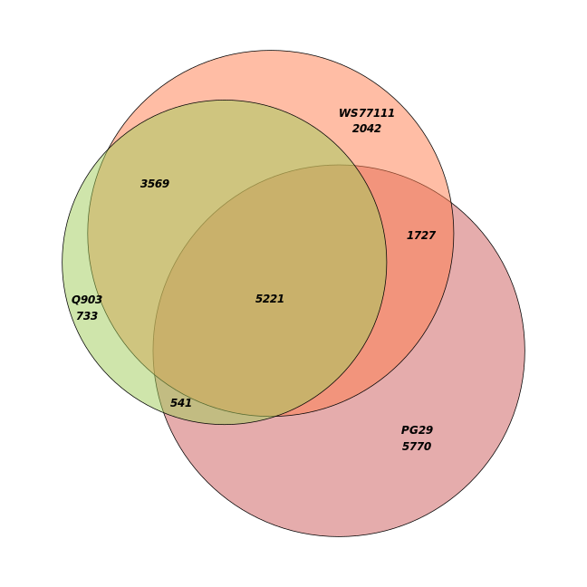
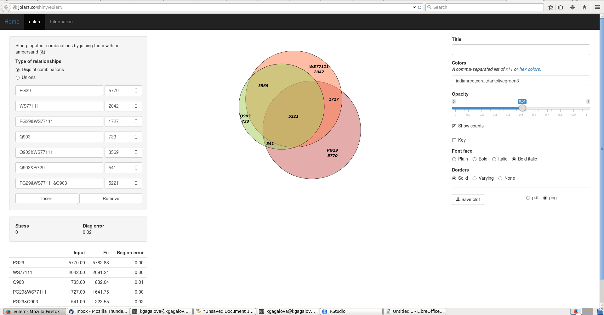
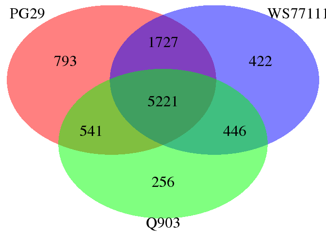

Comparison Erdi (PG29) and Kristina (WS77111,Q903) Kollector runs
================

Compare succeeded targets
-------------------------

Given the previous results from PG29 - Kollector and the current WS77111+Q903, compare the overlap between succeded genes. Note that PG29 target set is different, containing only the high confidence genes.

``` r
library(Biostrings)
library(VennDiagram)
#library(venneuler)

#load the data sets
PG29 <- read.delim("/projects/btl/kgagalova/PHD_projects/SpruceUp/KollectorGeneReconstruction3species/PreliminaryResults12May/data/AssembledTranscripts/Out.results.PG29.top", header=FALSE)
WS <- read.delim("/projects/btl/kgagalova/PHD_projects/SpruceUp/KollectorGeneReconstruction3species/PreliminaryResults1June/data/AssembledTranscripts/Out.results.WS77111extraAll.top", header=FALSE)
`Q903` <- read.delim("/projects/btl/kgagalova/PHD_projects/SpruceUp/KollectorGeneReconstruction3species/PreliminaryResults1June/data/AssembledTranscripts/Out.results.Q903.top", header=FALSE)

venn.plot <- draw.triple.venn(area1           = length(as.character(PG29[,2])),
                              area2           = length(as.character(WS[,2])),
                              area3           = length(as.character(Q903[,2])),
                              n12             = length(intersect(as.character(PG29[,2]), as.character(WS[,2]))),
                              n23             = length(intersect(as.character(WS[,2]), as.character(Q903[,2]))),
                              n13             = length(intersect(as.character(PG29[,2]), as.character(Q903[,2]))),
                              n123            = length(Reduce(intersect, list(as.character(PG29[,2]),as.character(WS[,2]),as.character(Q903[,2])))),
                              category        = c("PG29", "WS77111","Q903"),
                              fill            = c("red", "blue","green"),
                              lty             = "blank",
                              cex             = 2,
                              cat.cex         = 2,
                              euler.d         = TRUE,
                              scaled          = TRUE, 
                              #cat.pos         = c(-110, 100),
                              #cat.dist        = c(0.2,0.05),
                              #cat.just        = list(c(-1, -1), c(1, 1)),
                              #ext.pos         = c(20,20),
                              #ext.dist        = c(1,1),
                              #ext.length      = 0.85,
                              #ext.line.lwd    = 2,
                              ext.line.lty    = "dashed"
                              )
```



For a better plot with scaled areas (link [here](http://jolars.co/shiny/eulerr)):




``` r
#write overlap to file
write.table(as.data.frame(Reduce(intersect, list(as.character(PG29[,2]),as.character(WS[,2]),as.character(Q903[,2])))),"OverlapSucceeded3sp.txt", quote=F, row.names=F, col.names=F)
```

Only with the overlapping targets
---------------------------------

``` r
OverlapTrans <- read.table("/projects/btl/kgagalova/PHD_projects/SpruceUp/KollectorGeneReconstruction3species/PreliminaryResults12May/data/OverlapTranscripts.txt", quote="\"")
#select names
overlap<-gsub(">","",as.character(OverlapTrans[grep("^>",as.vector(t(OverlapTrans))),]))
PG29_hcg <- PG29[PG29$V2 %in% overlap,]
WS_hcg <- WS[WS$V2 %in% overlap,]
Q903_hcg <- Q903[Q903$V2 %in% overlap,]

venn.plot <- draw.triple.venn(area1           = length(as.character(PG29_hcg[,2])),
                              area2           = length(as.character(WS_hcg[,2])),
                              area3           = length(as.character(Q903_hcg[,2])),
                              n12             = length(intersect(as.character(PG29_hcg[,2]), as.character(WS_hcg[,2]))),
                              n23             = length(intersect(as.character(WS_hcg[,2]), as.character(Q903_hcg[,2]))),
                              n13             = length(intersect(as.character(PG29_hcg[,2]), as.character(Q903_hcg[,2]))),
                              n123            = length(Reduce(intersect, list(as.character(PG29_hcg[,2]),as.character(WS_hcg[,2]),as.character(Q903_hcg[,2])))),
                              category        = c("PG29", "WS77111","Q903"),
                              fill            = c("red", "blue","green"),
                              lty             = "blank",
                              cex             = 2,
                              cat.cex         = 2,
                              euler.d         = TRUE,
                              scaled          = TRUE, 
                              #cat.pos         = c(-110, 100),
                              #cat.dist        = c(0.2,0.05),
                              #cat.just        = list(c(-1, -1), c(1, 1)),
                              #ext.pos         = c(20,20),
                              #ext.dist        = c(1,1),
                              #ext.length      = 0.85,
                              #ext.line.lwd    = 2,
                              ext.line.lty    = "dashed"
                              )
```



The overlap between the 3 species is 5221.
