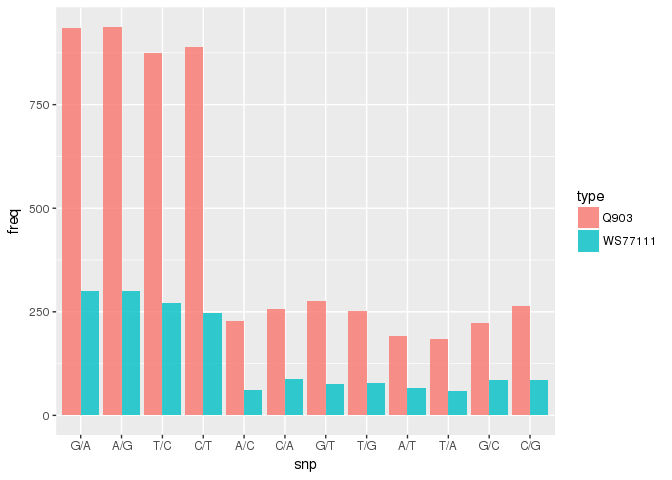

SNPS differences
================

SNPs nucleotides
----------------

Analyze SNPs, difference between PG29 and Q903

``` r
snpsQ903 <- read.csv("/projects/btl/kgagalova/PHD_projects/SpruceUp/KollectorGeneReconstruction3species/PreliminaryResults1June/data/SnpsAnalysis/snpsQ903_PG.txt", header=FALSE)
#rearrange data frame
df_dnaQ903= data.frame(contigs=gsub('\t',':',gsub('>','',snpsQ903[grep(">", snpsQ903$V1), ])))
df_dnaQ903$snps= gsub("\\t$", "", snpsQ903[grep("A|G|T|C|None", snpsQ903$V1),])
#total exons-genes without snp
length(which(df_dnaQ903$snps == 'None'))
```

    ## [1] 122

``` r
dim(df_dnaQ903)
```

    ## [1] 852   2

``` r
#get table with snips only
df_dnaQ903_1= df_dnaQ903[which(df_dnaQ903$snps != 'None'),]
#get frequencies
sort(table(sapply(unname(data.frame(unname(sapply(sapply(df_dnaQ903_1$snps,strsplit,'\t'),strsplit,' ')))[2,]),as.character)),decreasing=T)
```

    ## 
    ## A/G G/A C/T T/C G/T C/G C/A T/G A/C G/C A/T T/A A/N G/N T/N C/N N/T N/A 
    ## 938 935 888 875 277 265 256 251 228 222 192 184 101  99  88  75  57  55 
    ## N/G N/C G/R A/R C/Y C/M C/S A/M A/W G/S S/C T/Y Y/C Y/T 
    ##  49  39  10   5   5   3   3   1   1   1   1   1   1   1

SNPs nucleotides
----------------

Analyze SNPs, difference between PG29 and WS77111

``` r
snpsWS <- read.csv("/projects/btl/kgagalova/PHD_projects/SpruceUp/KollectorGeneReconstruction3species/PreliminaryResults1June/data/SnpsAnalysis/snpsWS_PG.txt", header=FALSE)
#reaarrange data frame
df_dnaWS= data.frame(contigs=gsub('\t',':',gsub('>','',snpsWS[grep(">", snpsWS$V1), ])))
df_dnaWS$snps= gsub("\\t$", "", snpsWS[grep("A|G|T|C|None", snpsWS$V1),])
#total exons-genes without snp
length(which(df_dnaWS$snps == 'None'))
```

    ## [1] 646

``` r
dim(df_dnaWS)
```

    ## [1] 1107    2

``` r
#get table with snips only
df_dnaWS_1= df_dnaWS[which(df_dnaWS$snps != 'None'),]
#get frequencies
######################ERROR#################################
#1 sequence is not atching correctly - removed from the plots (7018003 3261031)
sort(table(sapply(unname(data.frame(unname(sapply(sapply(df_dnaWS_1$snps,strsplit,'\t'),strsplit,' ')))[2,]),as.character)),decreasing=T)
```

    ## 
    ## A/G G/A T/C C/T  G/  C/  T/  A/ C/A C/G G/C T/G G/T A/T A/C T/A N/A N/T 
    ## 301 299 272 247 208 202 192 132  87  85  85  79  75  66  62  59  57  55 
    ## N/G N/C C/Y A/R C/S A/- T/- Y/T A/W C/N G/K G/S S/C T/Y 
    ##  49  39   6   5   3   2   2   2   1   1   1   1   1   1

``` r
library(ggplot2)
library(reshape)

#barplot transitions/transversions in comparison 

toPlotQ903 = sort(table(sapply(unname(data.frame(unname(sapply(sapply(df_dnaQ903_1$snps,strsplit,'\t'),strsplit,' ')))[2,]),as.character)),decreasing=T)[1:12]

toPlotWS = sort(table(sapply(unname(data.frame(unname(sapply(sapply(df_dnaWS_1$snps,strsplit,'\t'),strsplit,' ')))[2,]),as.character)),decreasing=T)[c(1:4,9:16)]

names_plot = c("G/A","A/G","T/C","C/T","A/C","C/A","G/T","T/G","A/T","T/A","G/C" ,"C/G" )
toPlotQ903 = toPlotQ903[names_plot]
toPlotWS = toPlotWS[names_plot]
#toPlotTransTransv = toPlotTransTransv[names_plot]

df_plot = data.frame(type=c(rep("Q903",12),rep("WS77111",12)),snp=names_plot,freq = c(toPlotQ903,toPlotWS))
names(df_plot) = c("type","snp","freq")

ggplot(df_plot,aes(x=snp,y=freq,fill=type)) + 
        geom_bar(stat="identity",position = "dodge", alpha=.8) + scale_x_discrete(limits = names_plot)
```


