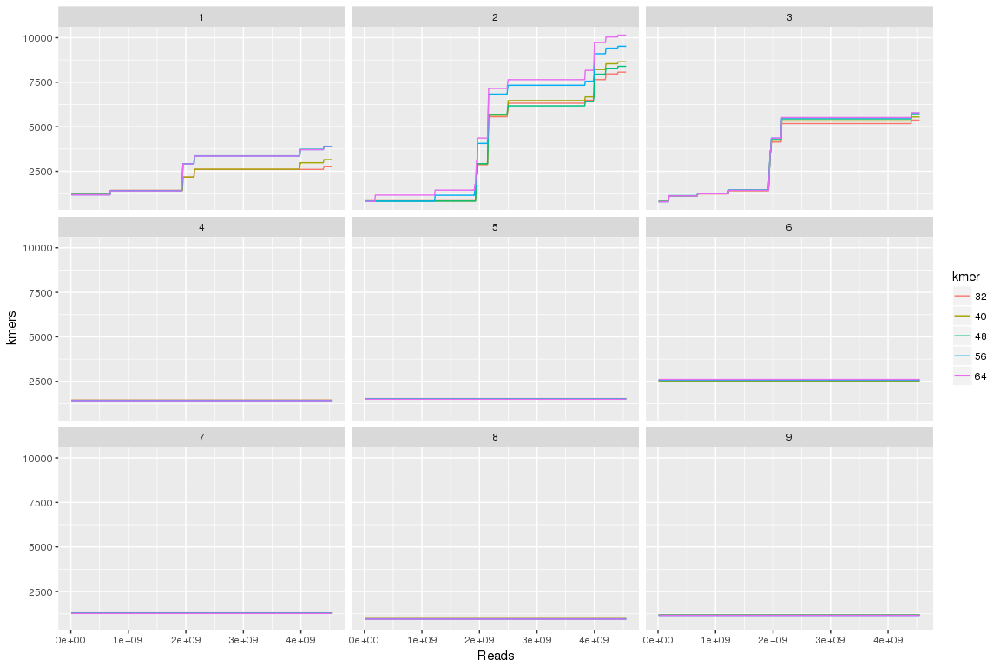

Untitled
================

Kmer progression with different k values
----------------------------------------

``` r
library( dplyr )
library( ggplot2 )
library( tidyr )
library( data.table )

dataPath="/projects/btl/kgagalova/TestRunsKollector/DifferentK/analysis"
allFiles <- list.files( path = dataPath, pattern = ".txt", full.names = TRUE )

l <- lapply( allFiles, function( fn ){
  d <- read.table( fn, header = F );
  d$fileName <- fn;
  d
  } );

d <- bind_rows( l );
d <- d[,c("V5","V10","V16","fileName")]

tps = sapply(strsplit(sapply(strsplit(d$fileName,"/"),"[[",8),"\\_"),"[[",4)
kmer = gsub("new.txt","",sapply(strsplit(sapply(strsplit(d$fileName,"/"),"[[",8),"\\_"),"[[",5))

d$tps = as.factor(tps)
d$kmer = as.factor(kmer)
names(d)[c(1,2,3)] = c("reads", "kmers", "tagged")

d1 = d[,c(1,2,3,5,6)]
```

``` r
#kmners
ggplot(data=d1, aes(x=reads, y=kmers)) +
  geom_line(aes(color=kmer))+ 
  #coord_cartesian(xlim = c(0, 156000001)) +
  xlab("Reads") + 
  ylab("kmers") +
facet_wrap( ~ tps )
```



``` r
#tagged
ggplot(data=d1, aes(x=reads, y=tagged)) +
  geom_line(aes(color=kmer))+ 
  #coord_cartesian(xlim = c(0, 156000001)) +
  xlab("Reads") + 
  ylab("tagged") +
facet_wrap( ~ tps )
```


Summary
-------

-   There is no clear trend for kmers recruitment
-   The kmers recruitment is quite low for each of the targets, not reaching the caps
-   It looks like the kmer recruitment is sequence specific, not really connected to the kmer size in bbtmaker.
