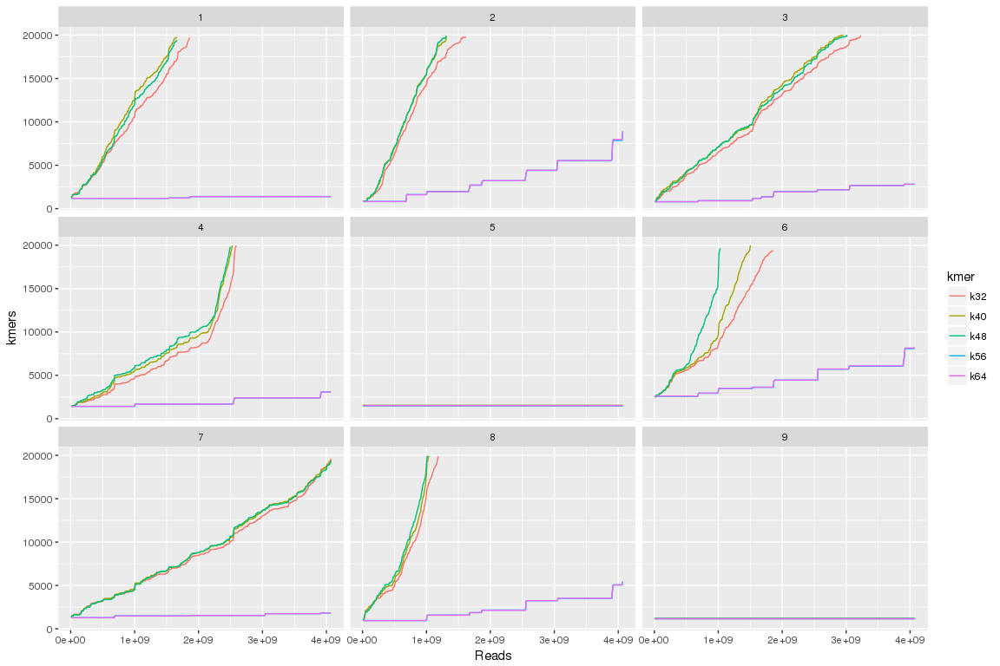
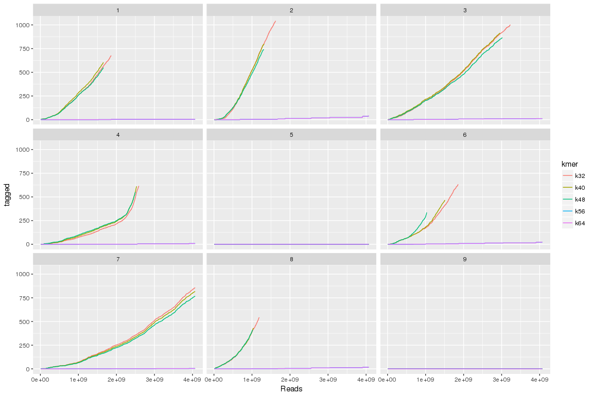
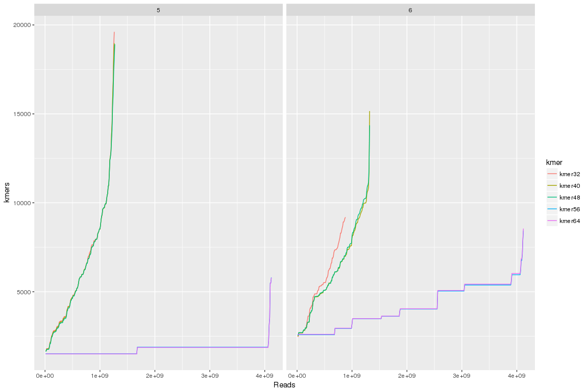
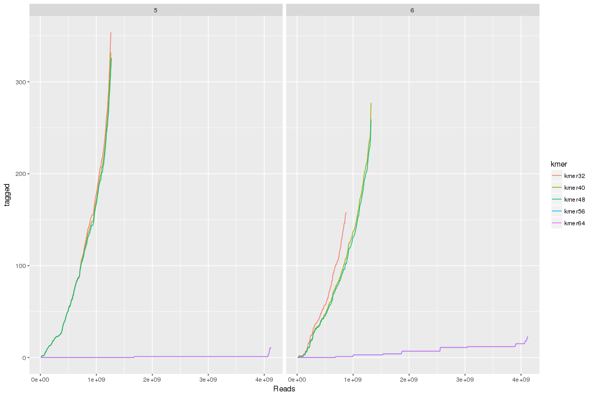

BBT
================

Kmer progression with different k values- continuation previous (2)
-------------------------------------------------------------------

Thresholds for the kmer counst is set to 500.000

``` r
library( dplyr )
library( ggplot2 )
library( tidyr )
library( data.table )

dataPath="/projects/btl/scratch/kgagalova/KollectorTests/KmerExperiments/HighThresholdUnitigs/analysis"
allFiles <- list.files( path = dataPath, pattern = ".out", full.names = TRUE )

l <- lapply( allFiles, function( fn ){
  d <- read.table( fn, header = F , sep="\t");
  d$fileName <- fn;
  d
  } );

d <- bind_rows( l )

tps = sapply(strsplit(sapply(strsplit(d$fileName,"/"),"[[",10),"\\_"),"[[",4)
kmer = gsub("High.out","",sapply(strsplit(sapply(strsplit(d$fileName,"/"),"[[",10),"\\_"),"[[",5))

d$tps = as.factor(tps)
d$kmer = as.factor(kmer)
names(d)[c(1,2,3)] = c("reads", "kmers", "tagged")
```

``` r
#kmners
ggplot(data=d, aes(x=reads, y=kmers)) +
  geom_line(aes(color=kmer))+ 
  #coord_cartesian(xlim = c(0, 156000001)) +
  xlab("Reads") + 
  ylab("kmers") +
facet_wrap( ~ tps )
```



``` r
#tagged
ggplot(data=d, aes(x=reads, y=tagged)) +
  geom_line(aes(color=kmer))+ 
  #coord_cartesian(xlim = c(0, 156000001)) +
  xlab("Reads") + 
  ylab("tagged") +
facet_wrap( ~ tps )
```



Run without repeat filter
-------------------------

``` r
library( dplyr )
library( ggplot2 )
library( tidyr )
library( data.table )

dataPath="/projects/btl/scratch/kgagalova/KollectorTests/KmerExperiments/NoRepFilter/analysis"
allFiles <- list.files( path = dataPath, pattern = ".out", full.names = TRUE )

l <- lapply( allFiles, function( fn ){
  d <- read.table( fn, header = F , sep="\t");
  d$fileName <- fn;
  d
  } );

d <- bind_rows( l )

tps = sapply(strsplit(sapply(strsplit(d$fileName,"/"),"[[",10),"\\_"),"[[",3)
kmer = gsub("High.out","",sapply(strsplit(sapply(strsplit(d$fileName,"/"),"[[",10),"\\_"),"[[",4))

d$tps = as.factor(tps)
d$kmer = as.factor(kmer)
names(d)[c(1,2,3)] = c("reads", "kmers", "tagged")
```

``` r
#kmners
ggplot(data=d, aes(x=reads, y=kmers)) +
  geom_line(aes(color=kmer))+ 
  #coord_cartesian(xlim = c(0, 156000001)) +
  xlab("Reads") + 
  ylab("kmers") +
facet_wrap( ~ tps )
```



``` r
#tagged
ggplot(data=d, aes(x=reads, y=tagged)) +
  geom_line(aes(color=kmer))+ 
  #coord_cartesian(xlim = c(0, 156000001)) +
  xlab("Reads") + 
  ylab("tagged") +
facet_wrap( ~ tps )
```



Summary
-------

In the Low threshold - There is no clear trend for kmers recruitment - The kmers recruitment is quite low for each of the targets, not reaching the caps - It looks like the kmer recruitment is sequence specific, not really connected to the kmer size in bbtmaker.

In the high threshold - There is an apparent trend for kmers recruitment, I was expecting the lower kmers to be faster than the higher. This is only partially true. k40 is recruiting faster than k32. k56 and k64 are identical. Sequence specific?

In the plots without repeat filter: - Th elines do not reach the caps in the plot due to the binning in the log file. This is an example for kmer 32 and target 6:

    Currently Reading Read Number: 850000000 ; Unique k-mers Added: 8921 ; Reads Used in Tagging: 146
    Currently Reading Read Number: 860000000 ; Unique k-mers Added: 8996 ; Reads Used in Tagging: 154
    Currently Reading Read Number: 870000000 ; Unique k-mers Added: 9126 ; Reads Used in Tagging: 157
    Currently Reading Read Number: 880000000 ; Unique k-mers Added: 9190 ; Reads Used in Tagging: 158
    K-mer threshold reached at read 888688180
    Storing filter. Filter is 36064 bytes.

The reads in the interval 880000000-888688180 (which are not shown in the log file) contain the kmers necessary to arrive to the caps (20.000). The plots make sense, the binning is not fine enough to capture the caps - There is a trand of the recruitment, kmer 32 is faster than the others.
