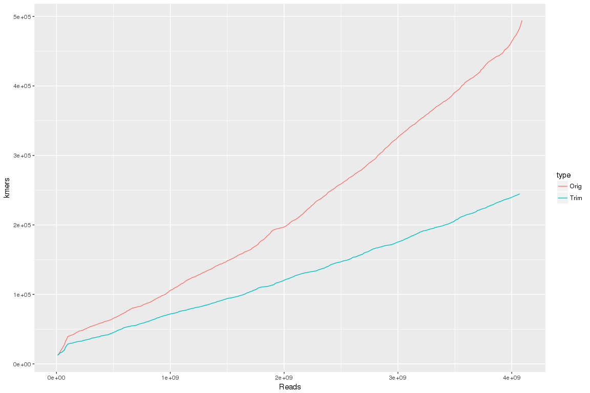

Kmers recruitment curve - BBTmaker
================

Kollector run (1)
-----------------

-   r=0.9
-   s=0.7
-   caps single target: 20,000; caps all targets: 500,000
-   reads: trimmed, origial

``` r
library( dplyr )
library( ggplot2 )
library( tidyr )
library( data.table )

dataPath="/projects/btl/kgagalova/TestRunsKollector/SingleTrans/Run1"
allFiles <- list.files( path = dataPath, pattern = ".txt", full.names = TRUE )

l <- lapply( allFiles, function( fn ){
  d <- read.table( fn, header = F );
  d$fileName <- fn;
  d
  } );

Run1 <- bind_rows( l );

cat = sapply(strsplit(sapply(strsplit(Run1$fileName,"/"),"[[",8),"\\_"),"[[",1)
tps = gsub(".txt","",gsub("parsed","",sapply(strsplit(sapply(strsplit(Run1$fileName,"/"),"[[",8),"\\_"),"[[",2)))
Run1$type = as.factor(replace(cat,cat=="NoTrim","Orig"))
Run1$tps = tps

#exclude the runs with all
Run1ind = subset(Run1,Run1$tps != "all")

nams = c("reads","kmers","tagged")
colnames(Run1ind)[1:3] = nams
```

``` r
ggplot(data=Run1ind, aes(x=reads, y=kmers)) +
  geom_line(aes(color=type))+ 
  #coord_cartesian(xlim = c(0, 156000001)) +
  xlab("Reads") + 
  ylab("kmers") +
  facet_wrap( ~ tps )
```


Kollector run (2)
-----------------

-   r=150
-   s=125
-   caps single target: 20,000; caps all targets: 500,000
-   reads: trimmed, origial

Kollector run 2
---------------

``` r
dataPath="/projects/btl/kgagalova/TestRunsKollector/SingleTrans/Run2"
allFiles <- list.files( path = dataPath, pattern = ".txt", full.names = TRUE )

l <- lapply( allFiles, function( fn ){
  d <- read.table( fn, header = F );
  d$fileName <- fn;
  d
  } );

Run2 <- bind_rows( l );

cat = sapply(strsplit(sapply(strsplit(Run2$fileName,"/"),"[[",8),"\\_"),"[[",1)
tps = gsub(".txt","",gsub("parsed","",sapply(strsplit(sapply(strsplit(Run2$fileName,"/"),"[[",8),"\\_"),"[[",2)))
Run2$type = as.factor(replace(cat,cat=="NoTrim","Orig"))
Run2$tps = tps

#exclude the runs with all
Run2ind = subset(Run2,Run2$tps != "all")


nams = c("reads","kmers","tagged")
colnames(Run2ind)[1:3] = nams
```

``` r
ggplot(data=Run2ind, aes(x=reads, y=kmers)) +
  geom_line(aes(color=type))+ 
  xlab("Reads") + 
  ylab("kmers") +
  facet_wrap( ~ tps )
```


Plot the whole bunch of targets
-------------------------------

``` r
Run2all = subset(Run2,Run2$tps == "all")

colnames(Run2all)[1:3] = nams
ggplot(data=Run2all, aes(x=reads, y=kmers)) +
  geom_line(aes(color=type))+ 
  xlab("Reads") + 
  ylab("kmers")
```


