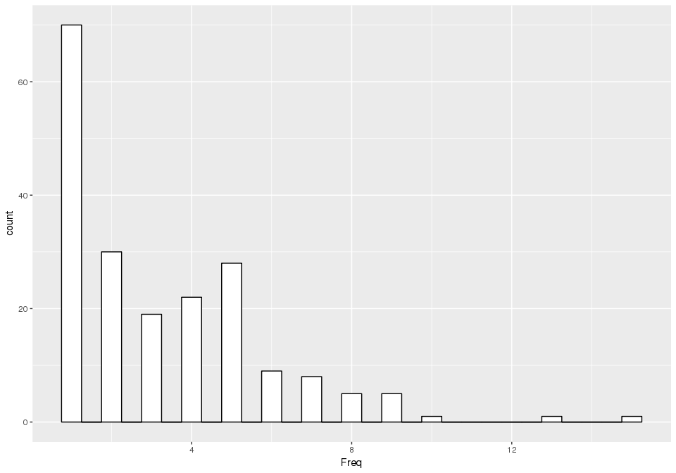
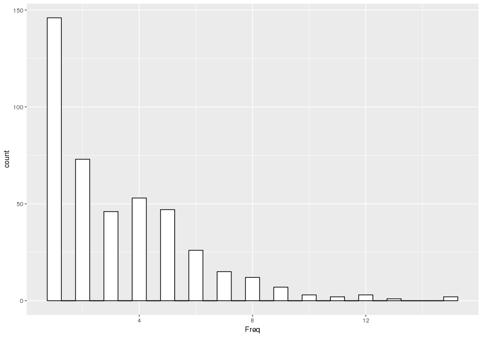
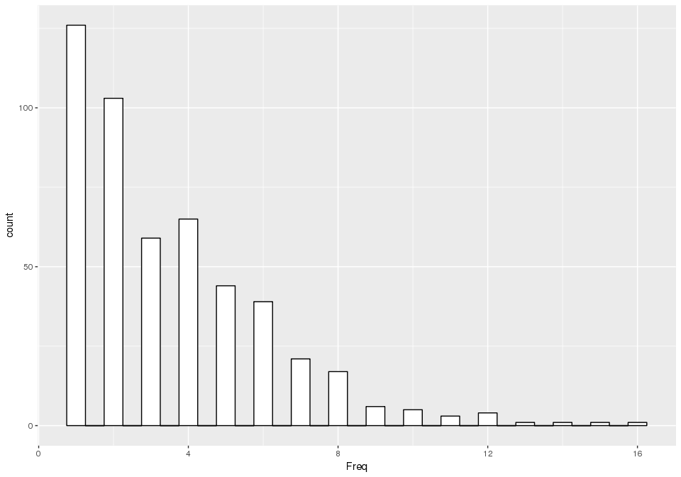

Seed vs assembled sequences
================

Run \#5
-------

-   seed number: 500
-   Kollector options: j=12, r=0.9, s=0.7, k=32, K=25, n=50000000
-   Abyss abyss-bloom-dbg settings: -k32 -q3 -v -b30G -H4 -j12 --kc=3
-   GMAP coverage threshold: 0.9

| n   | n:500 | L50 | min | N80  | N50  | N20   | E-size | max   | sum     | name                            |
|-----|-------|-----|-----|------|------|-------|--------|-------|---------|---------------------------------|
| 226 | 226   | 69  | 598 | 4899 | 7495 | 10336 | 7767   | 17127 | 1371659 | assembledtargets\_half500\_2.fa |
| 500 | 491   | 182 | 500 | 1039 | 1437 | 1836  | 1468   | 2850  | 649937  | seed500/cdhit-output-4\_1.fasta |

### BLAST

``` r
library(ggplot2)
library(plyr)
#load sequences with coverage and identity > 90%
blastSeed_500 <- read.delim("/projects/spruceup/pglauca/WS77111/assemblies/kollector/EvalSuccessRate/Half500_2/out.seed.Half500_2.allvsseed.tsv", header=FALSE)
nams=c("qseqid", "sseqid","pident","length","mismatch","gapopen","qstart","qend","sstart","send","evalue","bitscore","qcovs","qcovhsp")
names(blastSeed_500) = nams
head(blastSeed_500)
```

    ##          qseqid  sseqid pident length mismatch gapopen qstart qend sstart
    ## 1 GQ03217_I16.1 4389511  99.66    879        3       0      1  879    390
    ## 2 GQ03011_D11.2 4390096  98.48    723        8       2      1  721   2410
    ## 3 GQ03011_D11.2 4390096  98.36    488        8       0   1096 1583   8309
    ## 4 GQ03011_D11.2 4390096  98.65    223        2       1    879 1100   5312
    ## 5 GQ03011_D11.2 4390096 100.00    166        0       0    719  884   3386
    ## 6 GQ02814_H06.1 4389455  99.25    799        3       2      1  798   2226
    ##   send evalue bitscore qcovs qcovhsp
    ## 1 1268  0e+00     1607    99      99
    ## 2 3131  0e+00     1271    99      45
    ## 3 8796  0e+00      857    99      31
    ## 4 5534 4e-110      394    99      14
    ## 5 3551  5e-84      307    99      10
    ## 6 3022  0e+00     1439    99      99

``` r
length(unique(blastSeed_500$qseqid))
```

    ## [1] 199

``` r
multip_blast=as.data.frame(table(blastSeed_500$qseqid))
#check if queries align to multiple subjects (seed reconstructed multiple genes)
count(apply(apply(table(blastSeed_500[,c(1,2)]),2,"!=",0), 1, sum))
```

    ##   x freq
    ## 1 1  199

``` r
#check if same subject aligns to multipl queries (multiple seeds reconstructed same gene)
count(apply(apply(table(blastSeed_500[,c(1,2)]),1,"!=",0), 1, sum))
```

    ##   x freq
    ## 1 1  195
    ## 2 2    2

``` r
ggplot(multip_blast, aes(x=Freq)) +
    geom_histogram(binwidth=.5, colour="black", fill="white")
```



**Success rate (number of unique transcripts aligning with ident/coverage \> 90% to the assembled genes)**: 39.8%

Run \#7
-------

-   seed number: 1000
-   Kollector options: j=12, r=0.9, s=0.7, k=32, K=25, n=50000000
-   Abyss abyss-bloom-dbg settings: -k32 -q3 -v -b30G -H4 -j12 --kc=3
-   GMAP coverage threshold: 0.9

| n    | n:500 | L50 | min | N80  | N50  | N20   | E-size | max   | sum     | name                             |
|------|-------|-----|-----|------|------|-------|--------|-------|---------|----------------------------------|
| 480  | 480   | 146 | 598 | 4966 | 7676 | 11130 | 8245   | 25575 | 3052841 | assembledtargets\_half1000\_1.fa |
| 1000 | 986   | 365 | 500 | 1056 | 1452 | 1873  | 1492   | 3009  | 1321600 | seed1000/cdhit-output-4\_1.fasta |

### BLAST

``` r
#load sequences with coverage and identity > 90%
blastSeed_1000 <- read.delim("/projects/spruceup/pglauca/WS77111/assemblies/kollector/EvalSuccessRate/Half1000_1/out.seed.Half1000_1.allvsseed.tsv", header=FALSE)
names(blastSeed_1000) = nams
head(blastSeed_1000)
```

    ##          qseqid  sseqid pident length mismatch gapopen qstart qend sstart
    ## 1 GQ03217_I16.1 9866745  99.66    879        3       0      1  879    375
    ## 2 GQ03011_D11.2 9867983  98.62    723        8       1      1  721   2410
    ## 3 GQ03011_D11.2 9867983  98.36    488        8       0   1096 1583   8310
    ## 4 GQ03011_D11.2 9867983  98.65    223        2       1    879 1100   5313
    ## 5 GQ03011_D11.2 9867983 100.00    166        0       0    719  884   3387
    ## 6 GQ02814_H06.1 9866758  99.25    799        3       2      1  798   2226
    ##   send evalue bitscore qcovs qcovhsp
    ## 1 1253  0e+00     1607    99      99
    ## 2 3132  0e+00     1279    99      45
    ## 3 8797  0e+00      857    99      31
    ## 4 5535 9e-110      394    99      14
    ## 5 3552  1e-83      307    99      10
    ## 6 3022  0e+00     1439    99      99

``` r
length(unique(as.character(blastSeed_1000$qseqid)))
```

    ## [1] 436

``` r
multip_blast=as.data.frame(table(blastSeed_1000$qseqid))
#check if queries align to multiple subjects (seed reconstructed multiple genes)
count(apply(apply(table(blastSeed_1000[,c(1,2)]),2,"!=",0), 1, sum))
```

    ##   x freq
    ## 1 1  436

``` r
#check if same subject aligns to multipl queries (multiple seeds reconstructed same gene)
count(apply(apply(table(blastSeed_1000[,c(1,2)]),1,"!=",0), 1, sum))
```

    ##   x freq
    ## 1 1  422
    ## 2 2    7

``` r
ggplot(multip_blast, aes(x=Freq)) +
    geom_histogram(binwidth=.5, colour="black", fill="white")
```



**Success rate (number of unique transcripts aligning with ident/coverage \> 90% to the assembled genes)**: 43.6%

Run \#9
-------

-   seed number: 1000
-   Kollector options: j=12, r=0.9, s=0.7, k=116, K=25, n=50000000
-   Abyss abyss-bloom-dbg settings: -k116 -q3 -v -b7G -H4 -j12 --kc=3
-   GMAP coverage threshold: 0.9

| n    | n:500 | L50 | min | N80  | N50  | N20   | E-size | max   | sum     | name                             |
|------|-------|-----|-----|------|------|-------|--------|-------|---------|----------------------------------|
| 544  | 544   | 163 | 707 | 5137 | 8054 | 12303 | 8984   | 27428 | 3754270 | assembledtargets\_half1000\_3.fa |
| 1000 | 986   | 365 | 500 | 1056 | 1452 | 1873  | 1492   | 3009  | 1321600 | seed1000/cdhit-output-4\_1.fasta |

### BLAST

``` r
#load sequences with coverage and identity > 90%
blastSeed_1000.3 <- read.delim("/projects/spruceup/pglauca/WS77111/assemblies/kollector/EvalSuccessRate/Half1000_3/out.seed.Half1000_3.allvsseed.tsv", header=FALSE)
names(blastSeed_1000.3) = nams
head(blastSeed_1000.3)
```

    ##          qseqid  sseqid pident length mismatch gapopen qstart qend sstart
    ## 1 GQ03107_D14.2 3598657  99.63    810        2       1    907 1716   1259
    ## 2 GQ03107_D14.2 3598657  96.60    852       28       1      1  851   4047
    ## 3 GQ03210_I22.1 3597999  99.31   1019        7       0      1 1019    438
    ## 4 GQ03217_I16.1 3598423  99.66    879        3       0      1  879   4141
    ## 5 GQ02011_C07.1 3598369  98.65   1329       15       2      1 1329   1424
    ## 6 GQ03011_D11.2 3599011  98.62    723        7       2      1  721  11652
    ##    send evalue bitscore qcovs qcovhsp
    ## 1   451      0     1478    97      47
    ## 2  3196      0     1411    97      50
    ## 3  1456      0     1844    99      99
    ## 4  3263      0     1607    99      99
    ## 5    99      0     2351    99      99
    ## 6 10931      0     1277    99      45

``` r
length(unique(as.character(blastSeed_1000.3$qseqid)))
```

    ## [1] 496

``` r
multip_blast=as.data.frame(table(blastSeed_1000.3$qseqid))
#check if queries align to multiple subjects (seed reconstructed multiple genes)
count(apply(apply(table(blastSeed_1000.3[,c(1,2)]),2,"!=",0), 1, sum))
```

    ##   x freq
    ## 1 1  484
    ## 2 2    9
    ## 3 3    3

``` r
#check if same subject aligns to multipl queries (multiple seeds reconstructed same gene)
count(apply(apply(table(blastSeed_1000.3[,c(1,2)]),1,"!=",0), 1, sum))
```

    ##   x freq
    ## 1 1  491
    ## 2 2   10

``` r
ggplot(multip_blast, aes(x=Freq)) +
    geom_histogram(binwidth=.5, colour="black", fill="white")
```



**Success rate (number of unique transcripts aligning with ident/coverage \> 90% to the assembled genes)**: 49.6%
