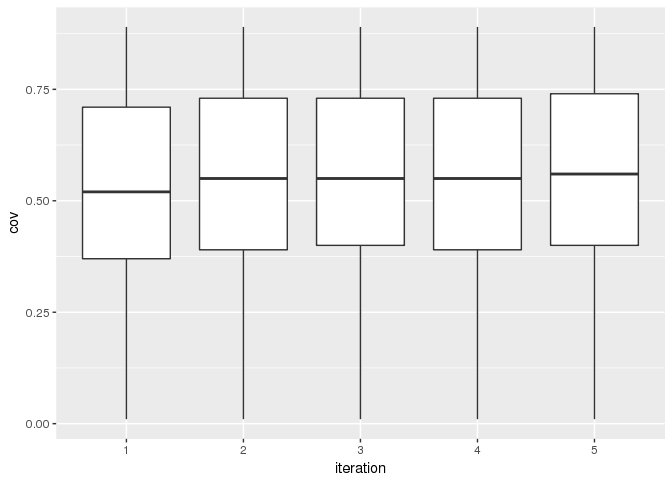
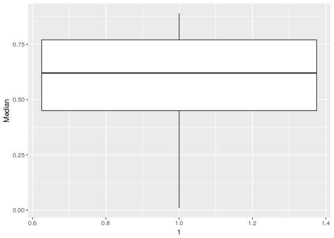
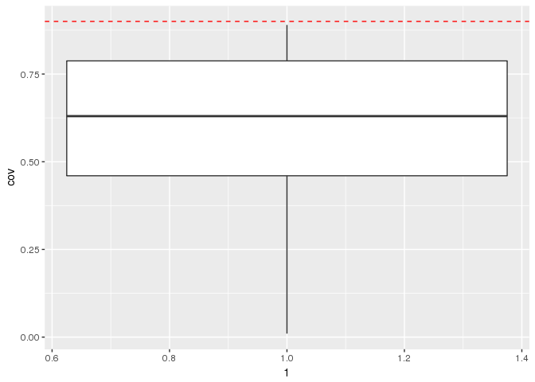
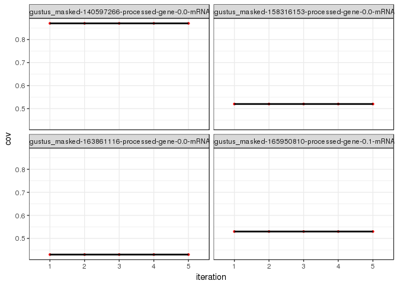
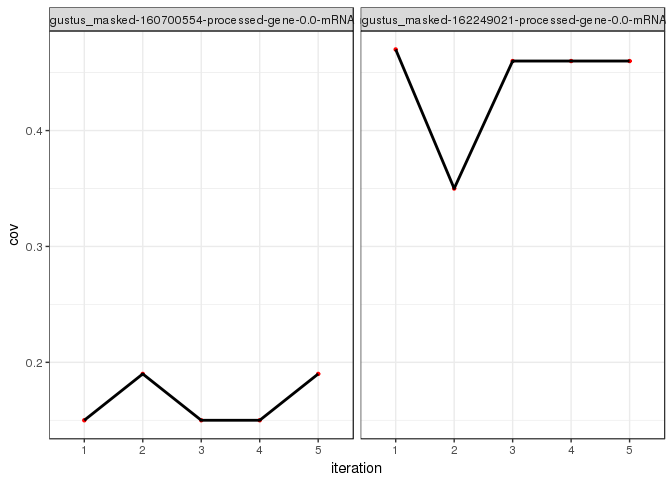
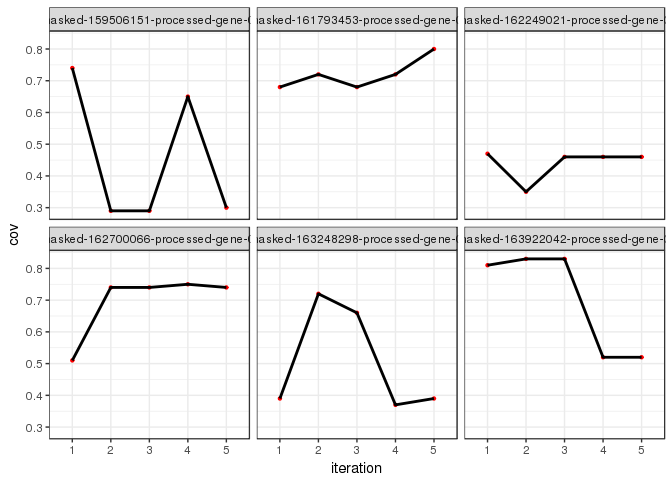

Plot coverage for all transcripts in each bin/iteration - WS77111
================

See coverage trend per iteration
--------------------------------

``` r
library( dplyr )
library( ggplot2 )
library( tidyr )
library( data.table )

dataPath="/projects/btl/kgagalova/PHD_projects/SpruceUp/KollectorGeneReconstruction3species/RunKollector/data/CoverageKollectorWS"
allFiles <- list.files( path = dataPath, pattern = ".out", full.names = TRUE )

l <- lapply( allFiles, function( fn ){
  d <- read.table( fn, header = F );
  d$fileName <- fn;
  d
  } );

d <- bind_rows( l );
```

    ## Warning in bind_rows_(x, .id): Unequal factor levels: coercing to character

``` r
dim(d)
```

    ## [1] 75809     4

``` r
d$bin = sapply(strsplit(sapply(strsplit(d$fileName,"/"),"[[",11),"\\="),"[[",1)
d$iteration = gsub("iteration.", "", gsub(".out","",sapply(strsplit(sapply(strsplit(d$fileName,"/"),"[[",11),"\\="),"[[",2)))
colnames(d)[c(1:3)] = c("cov","trans","contig")
#get the highest coverage in each bin/iteration
d1 <- d %>% group_by(trans,bin,iteration) %>%  slice(which.max(cov))
#total number of transcripts with some coverage
length(unique(d1$trans))
```

    ## [1] 17588

``` r
d1 <- d1 %>% filter(cov != 0)
#exclude >=90% coverage reached at the first iteration
d2 <- d1[!(d1$cov >= .90 & d1$iteration == 1), ]
dim(d2)
```

    ## [1] 33456     6

General statistics
------------------

``` r
#Number of transcripts that are assembled at per iteration
all_assembled=c()
for(i in 1:5){
  n = sum(d1$cov >= .90 & d1$iteration == i)
  print(paste0("The number of genes assembled in iteration ", as.character(i)," is ", as.character(n)))
  all_assembled=c(all_assembled,d1[d1$cov >= .90 & d1$iteration == i,]$trans)
}
```

    ## [1] "The number of genes assembled in iteration 1 is 9118"
    ## [1] "The number of genes assembled in iteration 2 is 1349"
    ## [1] "The number of genes assembled in iteration 3 is 725"
    ## [1] "The number of genes assembled in iteration 4 is 473"
    ## [1] "The number of genes assembled in iteration 5 is 535"

``` r
#for the genes that are not assembled
d3<-d1[!d1$trans %in% all_assembled,]

#number of iterations with coverage
countsTransFailed <- d3 %>%  group_by(trans) %>% summarise(n = n())

#get the counts for transcripts present in all the iterations
table(countsTransFailed$n)
```

    ## 
    ##    1    2    3    4    5 
    ##  303  177  177  265 4464

``` r
countsFailed5iter=countsTransFailed[which(countsTransFailed$n == 5),]$trans
d4 = d3[d3$trans %in% countsFailed5iter,]

#make std per transcript to see how many transcripts have the same coverage in each iteration
tab_std=d4%>%group_by(trans)%>%summarise(Std=sd(cov),Median=median(cov))

#n transcripts with the same coverage in all iterations 
length(which(tab_std$Std==0))
```

    ## [1] 1248

``` r
#get all the genes with the highest coverage (independently of the iteration)
d3best = d3 %>% group_by(trans) %>%  slice(which.max(cov))
```

Plot coverages
--------------

``` r
#-------------------------------------------------------
#Non succeeded & present in 5 iterations, boxplot per iteration
#-------------------------------------------------------
#boxplot of the coverage per iteration for the non succeeded transcripts && cov in all 5 iterations
ggplot(aes(y = cov, x = iteration), data = d4) + geom_boxplot()
```



``` r
#mean/median per group for coverage from previous boxplot
d4%>%
group_by(iteration)%>% 
summarise(Mean=mean(cov), Max=max(cov), Min=min(cov), Median=median(cov), Std=sd(cov))
```

    ## # A tibble: 5 × 6
    ##   iteration      Mean   Max   Min Median       Std
    ##       <chr>     <dbl> <dbl> <dbl>  <dbl>     <dbl>
    ## 1         1 0.5329301  0.89  0.01   0.52 0.2036543
    ## 2         2 0.5511156  0.89  0.01   0.55 0.2028613
    ## 3         3 0.5568974  0.89  0.01   0.55 0.2011743
    ## 4         4 0.5512522  0.89  0.01   0.55 0.2012162
    ## 5         5 0.5594982  0.89  0.01   0.56 0.2016617

``` r
#Boxplot cov - special cases - transcripts with coverage equal in all iterations 
#boxplot of the coverage - transcripts with same cov in all the iterations
tab_std0 = subset(tab_std, tab_std$Std == 0)
ggplot(aes(y = Median,x=1),data=tab_std0) + geom_boxplot()
```



``` r
#---------------------------------------------------------------------------
# Boxplot - best coverage for the non succeeded independently of iteration
#---------------------------------------------------------------------------

ggplot(aes(y = cov,x=1),data=d3best) + geom_boxplot() + geom_hline(yintercept=0.9,col="red",linetype="dashed")
```



``` r
summary(d3best$cov)
```

    ##    Min. 1st Qu.  Median    Mean 3rd Qu.    Max. 
    ##  0.0100  0.4600  0.6300  0.6091  0.7875  0.8900

``` r
#--------------------------------------------------------
#some examples
#plot same coverage cases
d2plot = d2[d2$trans %in% c("augustus_masked-140597266-processed-gene-0.0-mRNA-1","augustus_masked-158316153-processed-gene-0.0-mRNA-1","augustus_masked-163861116-processed-gene-0.0-mRNA-1","augustus_masked-165950810-processed-gene-0.1-mRNA-1"),]
#d2plot_test = slice(d2plot,1:1000)
ggplot(d2plot, aes( x =iteration ,y=cov, group=1) ) + geom_point(size=0.9,colour="red") + 
  geom_line(size=1) + facet_wrap( ~ trans ) + theme_bw()
```



``` r
#plot peak coverage cases
d2plot = d2[d2$trans %in% c("augustus_masked-160700554-processed-gene-0.0-mRNA-1","augustus_masked-162249021-processed-gene-0.0-mRNA-1"),]
ggplot(d2plot, aes( x =iteration ,y=cov, group=1) ) + geom_point(size=0.9,colour="red") + 
  geom_line(size=1) + facet_wrap( ~ trans ) + theme_bw()
```



``` r
#plot no pattern
d2plot = d2[d2$trans %in% c("augustus_masked-161793453-processed-gene-0.0-mRNA-1","augustus_masked-163248298-processed-gene-0.0-mRNA-1","augustus_masked-163922042-processed-gene-0.0-mRNA-1","augustus_masked-159506151-processed-gene-0.0-mRNA-1","augustus_masked-162249021-processed-gene-0.0-mRNA-1","augustus_masked-162700066-processed-gene-0.0-mRNA-1"),]
ggplot(d2plot, aes( x =iteration ,y=cov, group=1) ) + geom_point(size=0.9,colour="red") + 
  geom_line(size=1) + facet_wrap( ~ trans ) + theme_bw()
```



Summary
-------

-   The number of transcripts assembled per iteration is 9118, 1349, 725, 473 and 535 respectively
-   **657** are completely missing from the assembly (0% coverage in all the iterations)
-   The majority of the transcripts which genes are not assembled with coverage \> 90%, are partially assembled in all the iterations (4467)
-   **4268/4467** (95.5%) - partial genes in all the iterations - belong to GCAT
-   **1248** transcripts have the same coverage value in all the iterations (no improvement even when changing Kollector parameters)
-   The genes that are not assembled have generally a good coverage (median = 0.63). Those may be suitable for re-scaffolding.
-   The coverage is quite hectic and heterogeneous. It reflects the fact that the reads are shuffled each iteration so later iterations are not necessarily more successful
