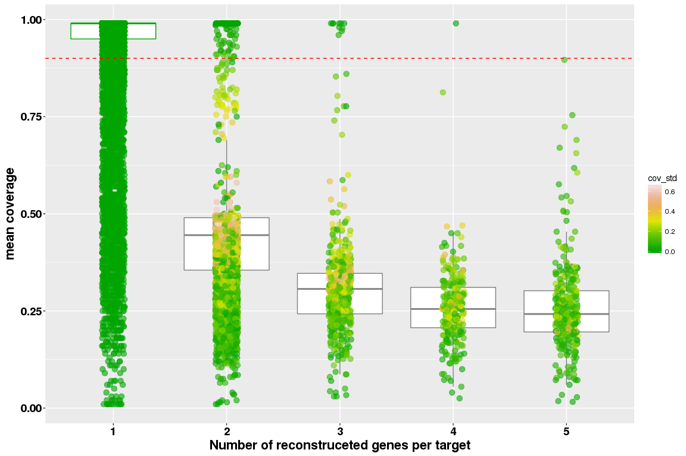
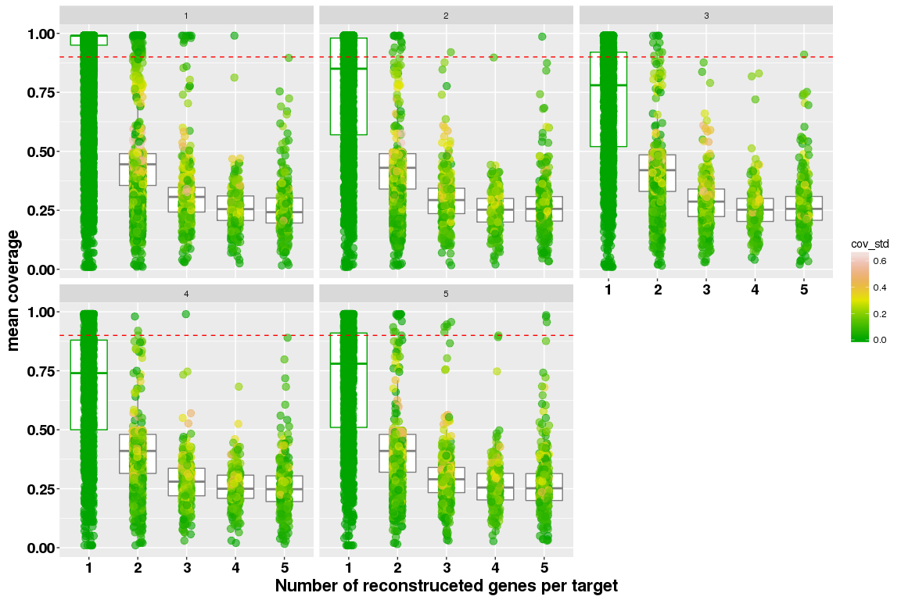

Paralogous analysis - WS77111
================

See coverage trend per iteration
--------------------------------

``` r
library( dplyr )
library( ggplot2 )
library( tidyr )
library( data.table )

dataPath="/projects/btl/kgagalova/PHD_projects/SpruceUp/KollectorGeneReconstruction3species/RunKollector/data/CoverageKollectorWS"
allFiles <- list.files( path = dataPath, pattern = ".out", full.names = TRUE )

l <- lapply( allFiles, function( fn ){
  d <- read.table( fn, header = F );
  d$fileName <- fn;
  d
  } );

d <- bind_rows( l );
dim(d)
```

    ## [1] 75809     4

``` r
d$bin = sapply(strsplit(sapply(strsplit(d$fileName,"/"),"[[",11),"\\="),"[[",1)
d$iteration = gsub("iteration.", "", gsub(".out","",sapply(strsplit(sapply(strsplit(d$fileName,"/"),"[[",11),"\\="),"[[",2)))
colnames(d)[c(1:3)] = c("cov","trans","contig")
d <- d %>% filter(cov != 0)
```

Show the number of assembled geness per transcript with any coverage
--------------------------------------------------------------------

``` r
d1 = d %>% group_by( trans,iteration ) %>% summarize( freq = n(),cov_mean = mean(cov), cov_std = sd(cov) )
#replace NA in sd
d1$cov_std[which(is.na(d1$cov_std))] <- 0
head(d1)
```

    ## Source: local data frame [6 x 5]
    ## Groups: trans [5]
    ## 
    ## # A tibble: 6 x 5
    ##                                                 trans iteration  freq
    ##                                                 <chr>     <chr> <int>
    ## 1 augustus_masked-102623972-processed-gene-0.0-mRNA-1         4     1
    ## 2 augustus_masked-102623972-processed-gene-0.0-mRNA-1         5     2
    ## 3  augustus_masked-10930138-processed-gene-0.0-mRNA-1         1     1
    ## 4 augustus_masked-112047644-processed-gene-0.0-mRNA-1         1     1
    ## 5 augustus_masked-140382321-processed-gene-0.0-mRNA-1         1     1
    ## 6 augustus_masked-140597266-processed-gene-0.0-mRNA-1         1     2
    ## # ... with 2 more variables: cov_mean <dbl>, cov_std <dbl>

plot the mean - sd in correspondence to the number of transcripts

``` r
pd <- position_dodge(0.1)
d1$freq = as.factor(d1$freq)

d1_1=subset(d1,d1$iteration == 1)

#PLOTS

##plot only the first iteration
ggplot(d1_1, aes(freq,cov_mean,colour=cov_std)) +
    geom_boxplot(outlier.size=NA) +
    geom_jitter(aes(freq,cov_mean),
               position=position_jitter(width=0.1,height=0),
               alpha=0.6,
               size=3) +
    xlab("Number of reconstruceted genes per target") +
    ylab("mean coverage") +
    theme(axis.title.x = element_text(face='bold',size=16,hjust=0.5),
          axis.title.y = element_text(face='bold',size=16,vjust=1),
          axis.text.x = element_text(face='bold',size=14,color='black'),
          axis.text.y = element_text(face='bold',size=14,color='black')) + 
    geom_hline(yintercept = 0.9,colour="red",linetype="dashed") + 
    scale_colour_gradientn(colours = terrain.colors(10))
```



``` r
ggplot(d1, aes(freq,cov_mean,colour=cov_std)) +
    geom_boxplot(outlier.size=NA) +
    geom_jitter(aes(freq,cov_mean),
               position=position_jitter(width=0.1,height=0),
               alpha=0.6,
               size=3) +
    xlab("Number of reconstruceted genes per target") +
    ylab("mean coverage") +
    theme(axis.title.x = element_text(face='bold',size=16,hjust=0.5),
          axis.title.y = element_text(face='bold',size=16,vjust=1),
          axis.text.x = element_text(face='bold',size=14,color='black'),
          axis.text.y = element_text(face='bold',size=14,color='black')) + 
    facet_wrap( ~ iteration ) + 
    geom_hline(yintercept = 0.9,colour="red",linetype="dashed") + 
    scale_colour_gradientn(colours = terrain.colors(10))
```



Summary statistics
------------------

``` r
#show the number of elements per boxplot - x is frequency, y is iteration
table(d1$freq,d1$iteration)
```

    ##    
    ##         1     2     3     4     5
    ##   1 10502  2945  2221  1841  1628
    ##   2  5119  3756  3276  3035  2992
    ##   3   552   484   457   441   480
    ##   4   260   241   233   240   238
    ##   5   317   333   328   312   343

``` r
apply(table(d1$freq,d1$iteration),2,sum) #check the number of transcripts with only one target
```

    ##     1     2     3     4     5 
    ## 16750  7759  6515  5869  5681

``` r
#total elements
sum(table(d1$freq,d1$iteration))
```

    ## [1] 42574

``` r
sum(subset(d1,d1$freq==1)$cov_mean >= 0.9)
```

    ## [1] 11098

``` r
sum(subset(d1,d1$freq==1)$cov_mean >= 0.95)
```

    ## [1] 10080

``` r
sum(subset(d1,d1$freq==1)$cov_mean == 0.99)
```

    ## [1] 8410

``` r
#check the ones that appear in multiple iterations
d1_1freq=subset(d1,d1$freq == 1)
d1_1freq = as.data.frame(table(d1_1freq$trans))
dim(d1_1freq)#unique targets <-------THIS IS THE IMPORTANT NUMBER
```

    ## [1] 13540     2

``` r
#genes reconstructed with different amount in different iterations
d1_allfreq = as.data.frame(table(d1$trans,d1$freq))
colnames(d1_allfreq) = c("trans","n_genes","Freq")
subset(d1,d1$trans=="augustus_masked-158701749-processed-gene-0.0-mRNA-1")
```

    ## Source: local data frame [5 x 5]
    ## Groups: trans [1]
    ## 
    ## # A tibble: 5 x 5
    ##                                                 trans iteration   freq
    ##                                                 <chr>     <chr> <fctr>
    ## 1 augustus_masked-158701749-processed-gene-0.0-mRNA-1         1      4
    ## 2 augustus_masked-158701749-processed-gene-0.0-mRNA-1         2      1
    ## 3 augustus_masked-158701749-processed-gene-0.0-mRNA-1         3      1
    ## 4 augustus_masked-158701749-processed-gene-0.0-mRNA-1         4      1
    ## 5 augustus_masked-158701749-processed-gene-0.0-mRNA-1         5      2
    ## # ... with 2 more variables: cov_mean <dbl>, cov_std <dbl>

``` r
subset(d1,d1$trans=="augustus_masked-102623972-processed-gene-0.0-mRNA-1")
```

    ## Source: local data frame [2 x 5]
    ## Groups: trans [1]
    ## 
    ## # A tibble: 2 x 5
    ##                                                 trans iteration   freq
    ##                                                 <chr>     <chr> <fctr>
    ## 1 augustus_masked-102623972-processed-gene-0.0-mRNA-1         4      1
    ## 2 augustus_masked-102623972-processed-gene-0.0-mRNA-1         5      2
    ## # ... with 2 more variables: cov_mean <dbl>, cov_std <dbl>

``` r
#show summary stats per sd
d1%>%group_by(iteration,freq)%>%summarise(Mean=mean(cov_std), Max=max(cov_std), Min=min(cov_std), Median=median(cov_std)) %>% print(n=25)
```

    ## Source: local data frame [25 x 6]
    ## Groups: iteration [?]
    ## 
    ## # A tibble: 25 x 6
    ##    iteration   freq      Mean       Max   Min     Median
    ##        <chr> <fctr>     <dbl>     <dbl> <dbl>      <dbl>
    ##  1         1      1 0.0000000 0.0000000 0.000 0.00000000
    ##  2         1      2 0.2863485 0.6858936 0.000 0.26162951
    ##  3         1      3 0.1807395 0.5513922 0.000 0.15529541
    ##  4         1      4 0.1481846 0.4667619 0.000 0.13297868
    ##  5         1      5 0.1228763 0.4420633 0.000 0.09864076
    ##  6         2      1 0.0000000 0.0000000 0.000 0.00000000
    ##  7         2      2 0.2622865 0.6858936 0.000 0.23334524
    ##  8         2      3 0.1651214 0.5253887 0.000 0.14029719
    ##  9         2      4 0.1493552 0.4552197 0.000 0.13073510
    ## 10         2      5 0.1235165 0.4149940 0.000 0.10148892
    ## 11         3      1 0.0000000 0.0000000 0.000 0.00000000
    ## 12         3      2 0.2483033 0.6717514 0.000 0.21920310
    ## 13         3      3 0.1693073 0.5542563 0.000 0.14730920
    ## 14         3      4 0.1495365 0.4666905 0.000 0.12675436
    ## 15         3      5 0.1125571 0.4114365 0.000 0.09096702
    ## 16         4      1 0.0000000 0.0000000 0.000 0.00000000
    ## 17         4      2 0.2389019 0.6717514 0.000 0.20506097
    ## 18         4      3 0.1716093 0.4965212 0.000 0.15011107
    ## 19         4      4 0.1389675 0.4439595 0.000 0.12320373
    ## 20         4      5 0.1143821 0.3837577 0.000 0.09375203
    ## 21         5      1 0.0000000 0.0000000 0.000 0.00000000
    ## 22         5      2 0.2380601 0.6788225 0.000 0.20506097
    ## 23         5      3 0.1731794 0.5253887 0.000 0.14571662
    ## 24         5      4 0.1463026 0.4066940 0.005 0.13043197
    ## 25         5      5 0.1184949 0.4203808 0.000 0.09909591

Summary
-------

**Only one gene reconstructed** \* A good portion of transcripts has only one gene reconstructed after Kollector (independently of the iteration). The total is 16750/42574 - **39%** of all the genes generated during the runs. \* **Note that those nubers do not correspond to transcript number, some transcripts occur in multiple iterations. Unique transcripts are 13540 which correspond to 74.2% of the input Kollector targets** \* The transcripts with only one gene reconstructed are shared between iterations in the following way (same transcripts may occur in different iterations): iteration 1: 10502 - iteration 2: 5119 - iteration 3: 552 - iteration 4: 260 - iteration 5: 317 \* 11098/16750 (**66.2%**) are successfully reconstructed based on the Kollector settings (success rate: coverage \>= 0.9). 10080/16750 (**60.17%**) have coverage \>= 0.95, 8410/16750 (**50.2%**) has coverage of **100%** (very high for reconstruction). \* Since the gene is not reconstructed in some cases (coverage \< 0.9), there are some transcripts that occur in multiple iterations: 903 in 2 iterations, 523 in 3 iterations, 456 in 4 iterations and 570 in all the iterations.

**Variable genes reconstructed** \* There are some interesting cases where the same transcript is reconstructed with variable number of genes in different iterations.
