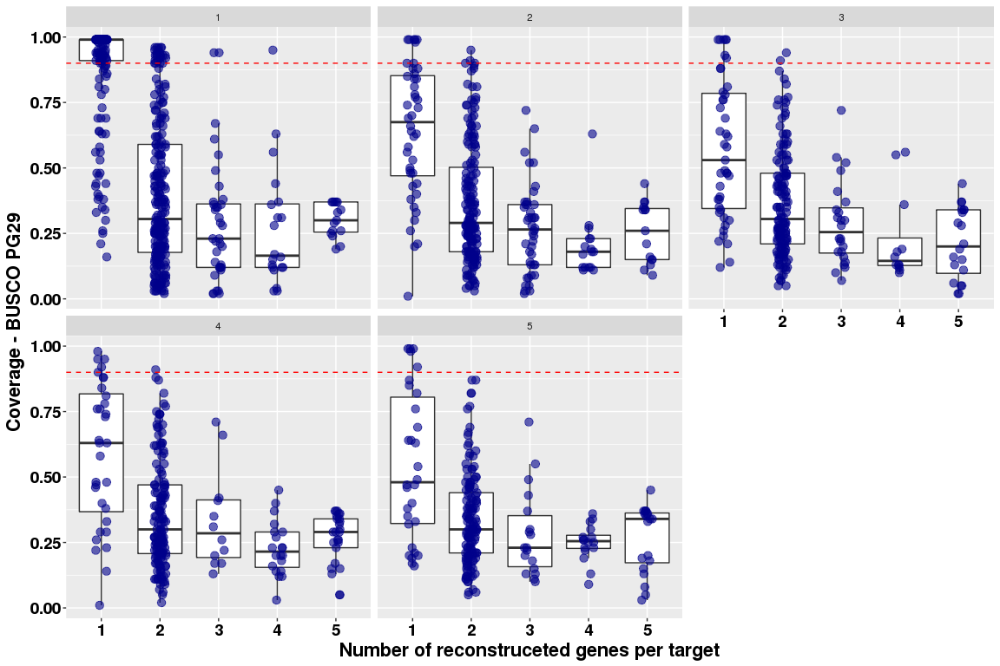
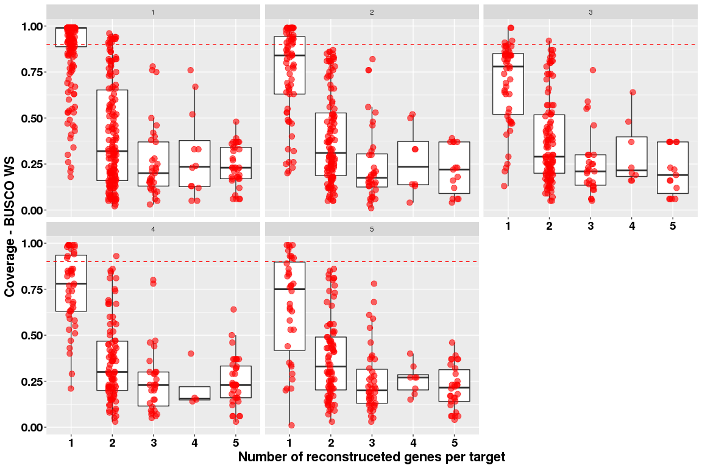
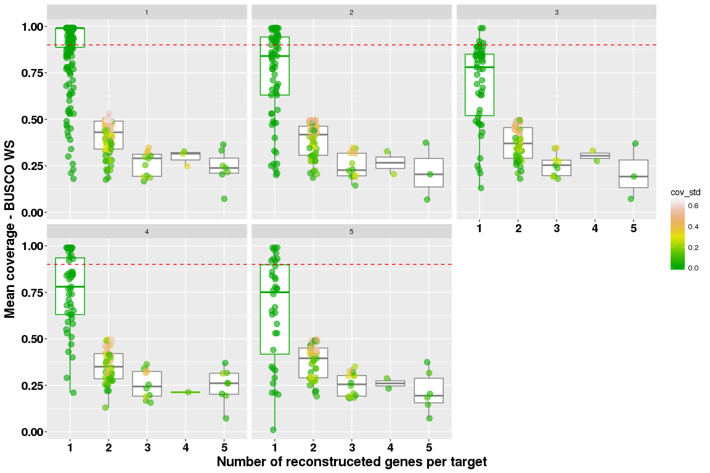
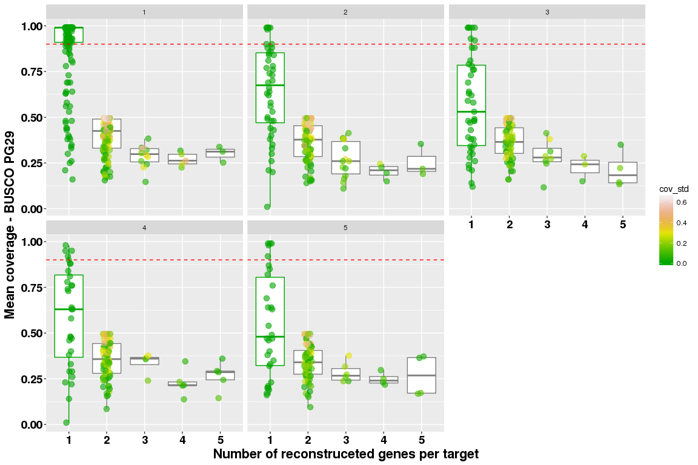

BUSCO multiplicity analysis
================

PG29
----

Analysis is performed on PG29 reconstrucetd genes. Note that some iterations are still missing for bin 8. Extract only the targets that are highlighted by BUSCO.

``` r
library( dplyr )
library( ggplot2 )
library( tidyr )
library( data.table )

dataPath="/projects/btl/kgagalova/PHD_projects/SpruceUp/KollectorGeneReconstruction3species/RunKollector/data/CoverageKollectorPG29"
allFiles <- list.files( path = dataPath, pattern = ".out", full.names = TRUE )

l <- lapply( allFiles, function( fn ){
  d <- read.table( fn, header = F );
  d$fileName <- fn;
  d
  } );

dPG29 <- bind_rows( l );
dim(dPG29)
```

    ## [1] 91312     4

``` r
dPG29$bin = sapply(strsplit(sapply(strsplit(dPG29$fileName,"/"),"[[",11),"\\="),"[[",1)
dPG29$iteration = gsub("iteration.", "", gsub(".out","",sapply(strsplit(sapply(strsplit(dPG29$fileName,"/"),"[[",11),"\\="),"[[",2)))
colnames(dPG29)[c(1:3)] = c("cov","trans","contig")
dPG29 <- dPG29 %>% filter(cov != 0)
dPG29$sr <- ifelse(dPG29$cov >= .90, "Succeeded","Failed" )

#calculate the number of contigs per target
d1PG29 = dPG29 %>% group_by( trans,iteration ) %>% summarize( freq = n(),cov_mean = mean(cov), cov_std = sd(cov) )
d1PG29$freq = as.factor(d1PG29$freq)
#replace NA in sd
d1PG29$cov_std[which(is.na(d1PG29$cov_std))] <- 0
head(d1PG29)
```

    ## # A tibble: 6 x 5
    ## # Groups:   trans [2]
    ##                                                 trans iteration   freq
    ##                                                 <chr>     <chr> <fctr>
    ## 1 augustus_masked-102623972-processed-gene-0.0-mRNA-1         1      2
    ## 2 augustus_masked-102623972-processed-gene-0.0-mRNA-1         2      2
    ## 3 augustus_masked-102623972-processed-gene-0.0-mRNA-1         3      2
    ## 4 augustus_masked-102623972-processed-gene-0.0-mRNA-1         4      2
    ## 5 augustus_masked-102623972-processed-gene-0.0-mRNA-1         5      2
    ## 6 augustus_masked-108549639-processed-gene-0.0-mRNA-1         1      1
    ## # ... with 2 more variables: cov_mean <dbl>, cov_std <dbl>

WS77111
-------

``` r
dataPath="/projects/btl/kgagalova/PHD_projects/SpruceUp/KollectorGeneReconstruction3species/RunKollector/data/CoverageKollectorWS"
allFiles <- list.files( path = dataPath, pattern = ".out", full.names = TRUE )

l <- lapply( allFiles, function( fn ){
  d <- read.table( fn, header = F );
  d$fileName <- fn;
  d
  } );

dWS <- bind_rows( l );
dim(dWS)
```

    ## [1] 75809     4

``` r
dWS$bin = sapply(strsplit(sapply(strsplit(dWS$fileName,"/"),"[[",11),"\\="),"[[",1)
dWS$iteration = gsub("iteration.", "", gsub(".out","",sapply(strsplit(sapply(strsplit(dWS$fileName,"/"),"[[",11),"\\="),"[[",2)))
colnames(dWS)[c(1:3)] = c("cov","trans","contig")
dWS <- dWS %>% filter(cov != 0)
dWS$sr <- ifelse(dWS$cov >= .90, "Succeeded","Failed" )

#calculate the number of contigs per target
d1WS = dWS %>% group_by( trans,iteration ) %>% summarize( freq = n(),cov_mean = mean(cov), cov_std = sd(cov) )
d1WS$freq = as.factor(d1WS$freq)
#replace NA in sd
d1WS$cov_std[which(is.na(d1WS$cov_std))] <- 0
head(d1WS)
```

    ## # A tibble: 6 x 5
    ## # Groups:   trans [5]
    ##                                                 trans iteration   freq
    ##                                                 <chr>     <chr> <fctr>
    ## 1 augustus_masked-102623972-processed-gene-0.0-mRNA-1         4      1
    ## 2 augustus_masked-102623972-processed-gene-0.0-mRNA-1         5      2
    ## 3  augustus_masked-10930138-processed-gene-0.0-mRNA-1         1      1
    ## 4 augustus_masked-112047644-processed-gene-0.0-mRNA-1         1      1
    ## 5 augustus_masked-140382321-processed-gene-0.0-mRNA-1         1      1
    ## 6 augustus_masked-140597266-processed-gene-0.0-mRNA-1         1      2
    ## # ... with 2 more variables: cov_mean <dbl>, cov_std <dbl>

Load the list of targets by BUSCO.

``` r
busco = read.table("/projects/spruceup/pglauca/WS77111/analyses/comparative-genomics/kollector/experiment/single-copy/targets-single-copy-busco-in-pg29v4.txt",header=F)
#intersect with contigs list
busco$V1 = as.character(busco$V1)
#####################PG29
d1PG29_busco = d1PG29[which(d1PG29$trans%in% busco$V1),]
#how many of the busco transcripts are found in the target set
length(unique(d1PG29_busco$trans)) #out of 317
```

    ## [1] 316

``` r
#which one is not present here
busco$V1[!(busco$V1 %in% unique(unique(d1PG29_busco$trans)))]
```

    ## [1] "GQ03406_O18.1_clone=GQ03406_O18_cluster=GQ03406_O18_status=complete_gb=BT113394"

``` r
#success rate overall
dPG29_busco = dPG29[which(dPG29$trans%in% busco$V1),]
buscoPG29_sr = subset(dPG29_busco,dPG29_busco$cov >= 0.90)
#distribution per iteration
table(buscoPG29_sr$iteration)
```

    ## 
    ##   1   2   3   4   5 
    ## 163  12   9   6   5

``` r
#total success rate
sum(table(buscoPG29_sr$iteration))
```

    ## [1] 195

``` r
d2PG29 = merge(dPG29_busco[,c("trans","cov","iteration")],d1PG29[which(d1PG29$trans %in% as.character(busco$V1)),],by=c("trans","iteration"))


#####################WS77111
d1WS_busco = d1WS[which(d1WS$trans%in% busco$V1),]
#how many of the busco transcripts are found in the target set
length(unique(d1WS_busco$trans)) #out of 317
```

    ## [1] 315

``` r
#which one is not present here
busco$V1[!(busco$V1 %in% unique(unique(d1WS_busco$trans)))]
```

    ## [1] "snap_masked-168551623-processed-gene-0.56-mRNA-1"                               
    ## [2] "GQ03406_O18.1_clone=GQ03406_O18_cluster=GQ03406_O18_status=complete_gb=BT113394"

``` r
#success rate overall
dWS_busco = dWS[which(dWS$trans%in% busco$V1),]
buscoWS_sr = subset(dWS_busco,dWS_busco$cov >= 0.90)
#distribution per iteration
table(buscoWS_sr$iteration)
```

    ## 
    ##   1   2   3   4   5 
    ## 167  27   6  15   9

``` r
#total success rate
sum(table(buscoWS_sr$iteration))
```

    ## [1] 224

``` r
d2WS = merge(dWS_busco[,c("trans","cov","iteration")],d1WS[which(d1WS$trans %in% as.character(busco$V1)),],by=c("trans","iteration"))
```

Plot the number of contigs per target - single dot, single coverage value

``` r
d2PG29$freq = as.factor(d2PG29$freq)
ggplot(d2PG29, aes(freq,cov)) +
    geom_boxplot(outlier.size=NA) +
    geom_jitter(aes(freq,cov),
               position=position_jitter(width=0.1,height=0),
               alpha=0.6,
               size=3,
               colour="darkblue") +
    xlab("Number of reconstruceted genes per target") +
    ylab("Coverage - BUSCO PG29") +
    theme(axis.title.x = element_text(face='bold',size=16,hjust=0.5),
          axis.title.y = element_text(face='bold',size=16,vjust=1),
          axis.text.x = element_text(face='bold',size=14,color='black'),
          axis.text.y = element_text(face='bold',size=14,color='black')) + 
    facet_wrap( ~ iteration ) + 
    geom_hline(yintercept = 0.9,colour="red",linetype="dashed")
```



``` r
d2WS$freq = as.factor(d2WS$freq)
ggplot(d2WS, aes(freq,cov)) +
    geom_boxplot(outlier.size=NA) +
    geom_jitter(aes(freq,cov),
               position=position_jitter(width=0.1,height=0),
               alpha=0.6,
               size=3,
               colour="red") +
    xlab("Number of reconstruceted genes per target") +
    ylab("Coverage - BUSCO WS") +
    theme(axis.title.x = element_text(face='bold',size=16,hjust=0.5),
          axis.title.y = element_text(face='bold',size=16,vjust=1),
          axis.text.x = element_text(face='bold',size=14,color='black'),
          axis.text.y = element_text(face='bold',size=14,color='black')) + 
    facet_wrap( ~ iteration ) + 
    geom_hline(yintercept = 0.9,colour="red",linetype="dashed")
```



Plot the number of contigs per target - mean value for coverage

``` r
ggplot(d1WS_busco, aes(freq,cov_mean,colour=cov_std)) +
    geom_boxplot(outlier.size=NA) +
    geom_jitter(aes(freq,cov_mean),
               position=position_jitter(width=0.1,height=0),
               alpha=0.6,
               size=3) +
    xlab("Number of reconstruceted genes per target") +
    ylab("Mean coverage - BUSCO WS") +
    theme(axis.title.x = element_text(face='bold',size=16,hjust=0.5),
          axis.title.y = element_text(face='bold',size=16,vjust=1),
          axis.text.x = element_text(face='bold',size=14,color='black'),
          axis.text.y = element_text(face='bold',size=14,color='black')) + 
    facet_wrap( ~ iteration ) + 
    geom_hline(yintercept = 0.9,colour="red",linetype="dashed") + 
    scale_colour_gradientn(colours = terrain.colors(10))
```



``` r
ggplot(d1PG29_busco, aes(freq,cov_mean,colour=cov_std)) +
    geom_boxplot(outlier.size=NA) +
    geom_jitter(aes(freq,cov_mean),
               position=position_jitter(width=0.1,height=0),
               alpha=0.6,
               size=3) +
    xlab("Number of reconstruceted genes per target") +
    ylab("Mean coverage - BUSCO PG29") +
    theme(axis.title.x = element_text(face='bold',size=16,hjust=0.5),
          axis.title.y = element_text(face='bold',size=16,vjust=1),
          axis.text.x = element_text(face='bold',size=14,color='black'),
          axis.text.y = element_text(face='bold',size=14,color='black')) + 
    facet_wrap( ~ iteration ) + 
    geom_hline(yintercept = 0.9,colour="red",linetype="dashed") + 
    scale_colour_gradientn(colours = terrain.colors(10))
```



Summary
-------

-   The contigs in PG29 with some coverage detected cover 316 of the 317 BUSCO transcripts. In WS 315.
-   The overall success rate for PG29 is 195 (coverage \> 0.9): iteration 1 - 163, iteration 2 - 12, iteration 3 - 9, iteration 4 - 6, iteration 5 - 5. For WS is respectively 167, 27, 6, 15 and 9
-   There are few genes that are successful and have partial reconstruction with another target.
-   Note that whenever the reconstruction is successful for multiple contigs, there is large difference between the coverage of the different contigs.
