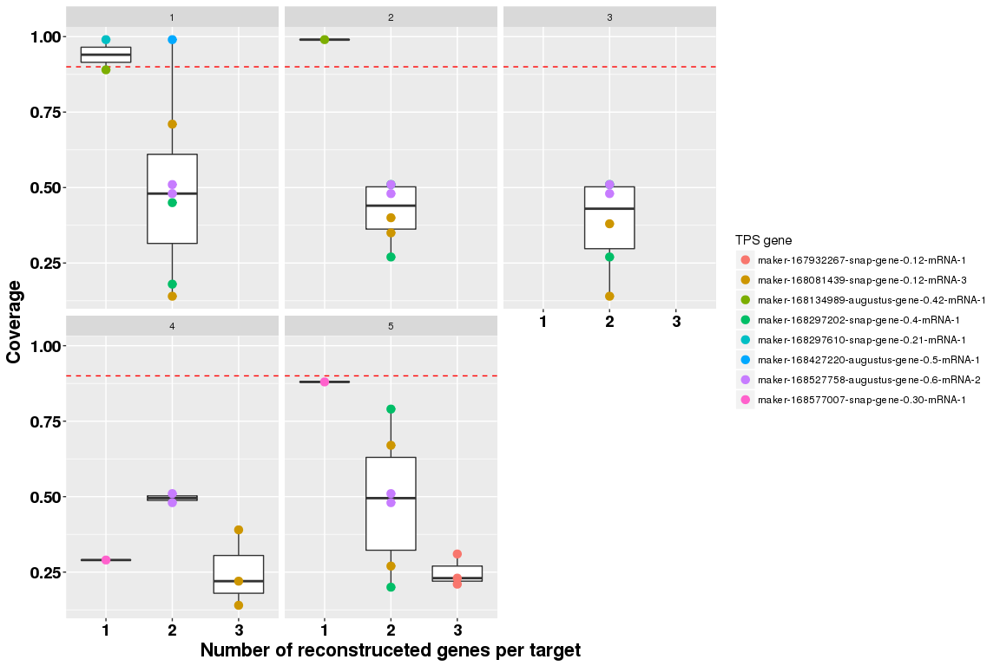

Untitled
================

Analysis TPS transcripts
------------------------

``` r
library( dplyr )
library( ggplot2 )
library( tidyr )
library( data.table )

dataPath="/projects/btl/kgagalova/PHD_projects/SpruceUp/KollectorGeneReconstruction3species/RunKollector/data/CoverageKollectorWS"
allFiles <- list.files( path = dataPath, pattern = ".out", full.names = TRUE )

l <- lapply( allFiles, function( fn ){
  d <- read.table( fn, header = F );
  d$fileName <- fn;
  d
  } );

d <- bind_rows( l );
dim(d)
```

    ## [1] 75809     4

``` r
d$bin = sapply(strsplit(sapply(strsplit(d$fileName,"/"),"[[",11),"\\="),"[[",1)
d$iteration = gsub("iteration.", "", gsub(".out","",sapply(strsplit(sapply(strsplit(d$fileName,"/"),"[[",11),"\\="),"[[",2)))
colnames(d)[c(1:3)] = c("cov","trans","contig")
d <- d %>% filter(cov != 0)

#calculate the number of contigs per target
d1 = d %>% group_by( trans,iteration ) %>% summarize( freq = n(),cov_mean = mean(cov), cov_std = sd(cov) )
#replace NA in sd
d1$cov_std[which(is.na(d1$cov_std))] <- 0
head(d1)
```

    ## Source: local data frame [6 x 5]
    ## Groups: trans [5]
    ## 
    ## # A tibble: 6 x 5
    ##                                                 trans iteration  freq
    ##                                                 <chr>     <chr> <int>
    ## 1 augustus_masked-102623972-processed-gene-0.0-mRNA-1         4     1
    ## 2 augustus_masked-102623972-processed-gene-0.0-mRNA-1         5     2
    ## 3  augustus_masked-10930138-processed-gene-0.0-mRNA-1         1     1
    ## 4 augustus_masked-112047644-processed-gene-0.0-mRNA-1         1     1
    ## 5 augustus_masked-140382321-processed-gene-0.0-mRNA-1         1     1
    ## 6 augustus_masked-140597266-processed-gene-0.0-mRNA-1         1     2
    ## # ... with 2 more variables: cov_mean <dbl>, cov_std <dbl>

Load the TPS and select only those from the data set
----------------------------------------------------

``` r
TPS = read.table("/projects/spruceup/interior_spruce/PG29/annotation/putative-terpene-related-targets.txt")
TPS$V1 = as.character(TPS$V1)
head(TPS,n=9)
```

    ##                                                V1
    ## 1 snap_masked-163531372-processed-gene-0.2-mRNA-1
    ## 2            maker-168297202-snap-gene-0.4-mRNA-1
    ## 3        maker-168427220-augustus-gene-0.5-mRNA-1
    ## 4           maker-168297610-snap-gene-0.21-mRNA-1
    ## 5           maker-168577007-snap-gene-0.30-mRNA-1
    ## 6        maker-168527758-augustus-gene-0.6-mRNA-2
    ## 7           maker-168081439-snap-gene-0.12-mRNA-3
    ## 8           maker-167932267-snap-gene-0.12-mRNA-1
    ## 9       maker-168134989-augustus-gene-0.42-mRNA-1

``` r
TPS1 = d[which(d$trans%in% as.character(TPS$V1)),]
#number of temptative reconstructed TPS
length(unique(TPS1$trans))
```

    ## [1] 8

``` r
#the ones that are NOT present in our reconstruction
TPS$V1[!(TPS$V1 %in% unique(TPS1$trans))]
```

    ## [1] "snap_masked-163531372-processed-gene-0.2-mRNA-1"

``` r
#how many of those are considered as reconstructed
unique(subset(TPS1,TPS1$cov >= 0.9)$trans)
```

    ## [1] "maker-168427220-augustus-gene-0.5-mRNA-1" 
    ## [2] "maker-168297610-snap-gene-0.21-mRNA-1"    
    ## [3] "maker-168134989-augustus-gene-0.42-mRNA-1"

``` r
#maker-168427220-augustus-gene-0.5-mRNA-1 is reconstructed 2 times with cov 0.99
subset(TPS1,TPS1$cov >= 0.9)$trans
```

    ## [1] "maker-168427220-augustus-gene-0.5-mRNA-1" 
    ## [2] "maker-168427220-augustus-gene-0.5-mRNA-1" 
    ## [3] "maker-168297610-snap-gene-0.21-mRNA-1"    
    ## [4] "maker-168134989-augustus-gene-0.42-mRNA-1"

``` r
#get the counts
d1[which(d1$trans%in% as.character(TPS$V1)),] %>% print(n=40)
```

    ## Source: local data frame [21 x 5]
    ## Groups: trans [8]
    ## 
    ## # A tibble: 21 x 5
    ##                                        trans iteration  freq cov_mean
    ##                                        <chr>     <chr> <int>    <dbl>
    ##  1     maker-167932267-snap-gene-0.12-mRNA-1         5     3    0.250
    ##  2     maker-168081439-snap-gene-0.12-mRNA-3         1     2    0.425
    ##  3     maker-168081439-snap-gene-0.12-mRNA-3         2     2    0.375
    ##  4     maker-168081439-snap-gene-0.12-mRNA-3         3     2    0.260
    ##  5     maker-168081439-snap-gene-0.12-mRNA-3         4     3    0.250
    ##  6     maker-168081439-snap-gene-0.12-mRNA-3         5     2    0.470
    ##  7 maker-168134989-augustus-gene-0.42-mRNA-1         1     1    0.890
    ##  8 maker-168134989-augustus-gene-0.42-mRNA-1         2     1    0.990
    ##  9      maker-168297202-snap-gene-0.4-mRNA-1         1     2    0.315
    ## 10      maker-168297202-snap-gene-0.4-mRNA-1         2     2    0.390
    ## 11      maker-168297202-snap-gene-0.4-mRNA-1         3     2    0.390
    ## 12      maker-168297202-snap-gene-0.4-mRNA-1         5     2    0.495
    ## 13     maker-168297610-snap-gene-0.21-mRNA-1         1     1    0.990
    ## 14  maker-168427220-augustus-gene-0.5-mRNA-1         1     2    0.990
    ## 15  maker-168527758-augustus-gene-0.6-mRNA-2         1     2    0.495
    ## 16  maker-168527758-augustus-gene-0.6-mRNA-2         2     2    0.495
    ## 17  maker-168527758-augustus-gene-0.6-mRNA-2         3     2    0.495
    ## 18  maker-168527758-augustus-gene-0.6-mRNA-2         4     2    0.495
    ## 19  maker-168527758-augustus-gene-0.6-mRNA-2         5     2    0.495
    ## 20     maker-168577007-snap-gene-0.30-mRNA-1         4     1    0.290
    ## 21     maker-168577007-snap-gene-0.30-mRNA-1         5     1    0.880
    ## # ... with 1 more variables: cov_std <dbl>

``` r
d2 = merge(TPS1[,c("trans","cov","iteration")],d1[which(d1$trans%in% as.character(TPS$V1)),],by=c("trans","iteration"))
d2 = distinct(d2,trans, cov, iteration , freq, cov_mean , cov_std )
```

Plot the coverage for TPS
-------------------------

``` r
d2$freq = as.factor(d2$freq)
ggplot(d2, aes(freq,cov)) +
    geom_boxplot(outlier.size=NA) +
    xlab("Number of reconstruceted genes per target") +
    ylab("Coverage") +
    theme(axis.title.x = element_text(face='bold',size=16,hjust=0.5),
          axis.title.y = element_text(face='bold',size=16,vjust=1),
          axis.text.x = element_text(face='bold',size=14,color='black'),
          axis.text.y = element_text(face='bold',size=14,color='black')) +  
    geom_hline(yintercept = 0.9,colour="red",linetype="dashed") + 
    geom_point(aes(colour = factor(trans)),size = 3) + 
    facet_wrap( ~ iteration ) + 
    scale_colour_discrete(name  ="TPS gene")
```



Get the names of the 2 genes reconstructed with .99
---------------------------------------------------

``` r
subset(d,d$trans=="maker-168427220-augustus-gene-0.5-mRNA-1")$contig
```

    ## [1] 3011234 3011322

Summary
-------

-   There are 8/9 TPS identified in our reconstructed gene set
-   3 out of those 8 are considered as successfully reconstructed, maker-168427220-augustus-gene-0.5-mRNA-1 is reconstructed with 2 genes
-   5/8 are reconstructed with \> 1 gene
