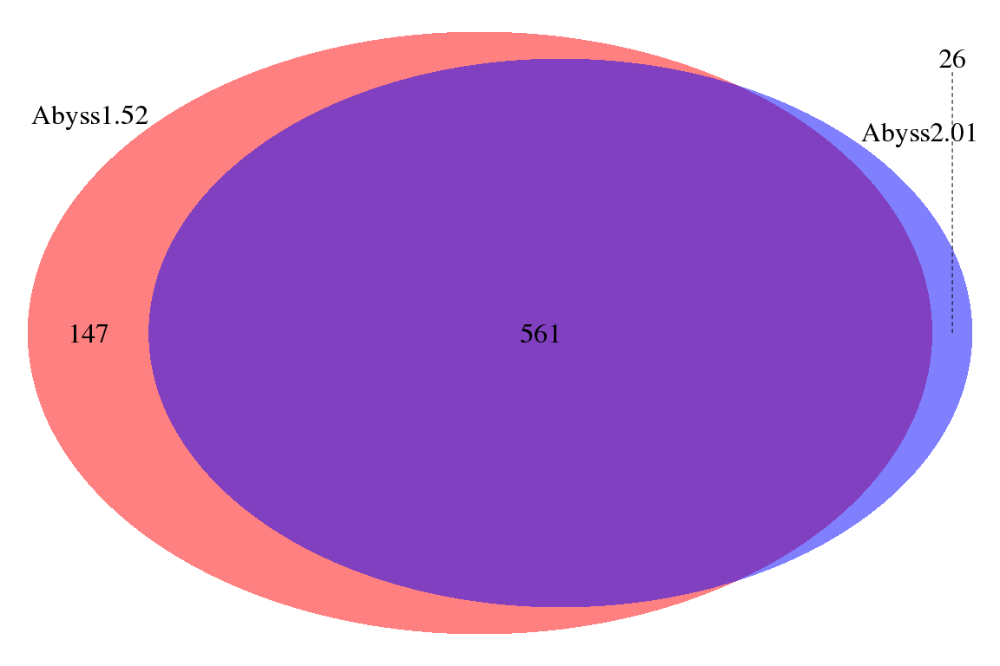

Abyss 1.52 vs Abyss 2.01 in Kollector
================

Load the data
-------------

Given the runs for Abyss 1.52 and 2.01, find the intersecting trancripts and load the contigs sequences.

``` r
library(Biostrings)
library(VennDiagram)
library(dplyr)
library(ggplot2)

abyss1 <- read.table("/projects/btl/kgagalova/PHD_projects/SpruceUp/KollectorGeneReconstruction3species/RunKollector/data/Test_AbyssKollector/allcoveredmapped_1.txt", quote="\"")
abyss2 <- read.table("/projects/btl/kgagalova/PHD_projects/SpruceUp/KollectorGeneReconstruction3species/RunKollector/data/Test_AbyssKollector/allcoveredmapped_2.txt", quote="\"")
nams = c("cov","trans","contig")
colnames(abyss1) = nams 
colnames(abyss2) = nams 
abyss1$trans = as.character(abyss1$trans)
abyss2$trans = as.character(abyss2$trans)
abyss1 = abyss1[order(abyss1$trans),]
abyss2 = abyss2[order(abyss2$trans),]
#work only on sequences that have been reconstructed by one contigs (ignore all the others that are reconstructed with >2)
abyss1_1 = abyss1[abyss1$trans %in% as.character((subset(as.data.frame(table(abyss1$trans)),as.data.frame(table(abyss1$trans))$Freq == 1)$Var1)),]
abyss2_1 = abyss2[abyss2$trans %in% as.character((subset(as.data.frame(table(abyss2$trans)),as.data.frame(table(abyss2$trans))$Freq == 1)$Var1)),]
#check success rate
length(unique(abyss1$trans))
```

    ## [1] 708

``` r
length(unique(abyss2$trans))
```

    ## [1] 587

``` r
#check the duplicated ones
sum(duplicated(abyss1$trans))
```

    ## [1] 177

``` r
sum(duplicated(abyss2$trans))
```

    ## [1] 5

``` r
#remove duplicated ones and compare output
length(which(table(abyss1$trans)==1))
```

    ## [1] 583

``` r
length(which(table(abyss2$trans)==1))
```

    ## [1] 583

Plot the Ven diagram for all the unique reconstructed targets

``` r
venn.plot <- draw.pairwise.venn(area1           = length(unique(abyss1$trans)),
                                area2           = length(unique(abyss2$trans)),
                                cross.area      = length(intersect(abyss1$trans, abyss2$trans)),
                                category        = c("Abyss1.52", "Abyss2.01"),
                                fill            = c("red", "blue"),
                                lty             = "blank",
                                cex             = 2,
                                cat.cex         = 2,
                                #cat.pos         = c(-110, 100),
                                #cat.dist        = c(0.2,0.05),
                                #cat.just        = list(c(-1, -1), c(1, 1)),
                                #ext.pos         = c(20,20),
                                #ext.dist        = c(1,1),
                                #ext.length      = 0.85,
                                #ext.line.lwd    = 2,
                                ext.line.lty    = "dashed"
                                )
```



merge the data tables

``` r
abyss_merged = merge(abyss1_1,abyss2_1,by="trans")
names(abyss_merged) = c("trans","cov1","contig1","cov2","contig2")
write.table(abyss_merged,"MergedCommonPolished.txt",quote=F,row.names=F)
```

Do the pairwise alignment with the script in `src` - RunPairwiseBlastn.sh and upload the data. Plot coverage and identity for the alignments.

``` r
align_abyss <- read.delim("/projects/btl/kgagalova/PHD_projects/SpruceUp/KollectorGeneReconstruction3species/RunKollector/data/Test_AbyssKollector/Abyss_alignments_blastn.txt", header=FALSE)
#load seq lengths
blast_nams=c("qseqid","sseqid","pident","length","mismatch","gapopen","qstart","qend","sstart","send","evalue","bitscore","qcovs","qcovhsp")
colnames(align_abyss) = blast_nams
#select the max alignment
align_abyss_top =  align_abyss %>% group_by(qseqid,sseqid) %>% top_n(1, pident) %>% top_n(1, qcovs) %>% filter(row_number(qseqid) == 1)
dim(align_abyss_top)
```

    ## [1] 466  14

Plot identity vs coverage

``` r
ggplot(align_abyss_top, aes(pident, qcovs)) + 
  geom_point(colour = "darkred",size = 3) + scale_colour_gradient(low = "red") +
  #geom_point(aes(size = length)) + 
  xlab("Identity %") +
  ylab("Coverage %") +
  theme(axis.title.x = element_text(face='bold',size=16,hjust=0.5),
          axis.title.y = element_text(face='bold',size=16,vjust=1),
          axis.text.x = element_text(face='bold',size=14,color='black'),
          axis.text.y = element_text(face='bold',size=14,color='black'))
```


Summary
-------

-   Abyss 1 has a higher rate of reconstruction overall when compared to Abyss 2, respectively 70.8% and 58.7%.
-   Abyss 1 assembles 177 targets with \> 1 contig, Abyss 2 only 5.
-   The number of targets that are reconstructed by exactly 1 contigs is identical for Abyss 1 and 2.
-   561 targets are both reconstructed by Abyss 1 and Abyss 2
-   The correspondence between identity and coverage is not very string - reconstruction looks very different
