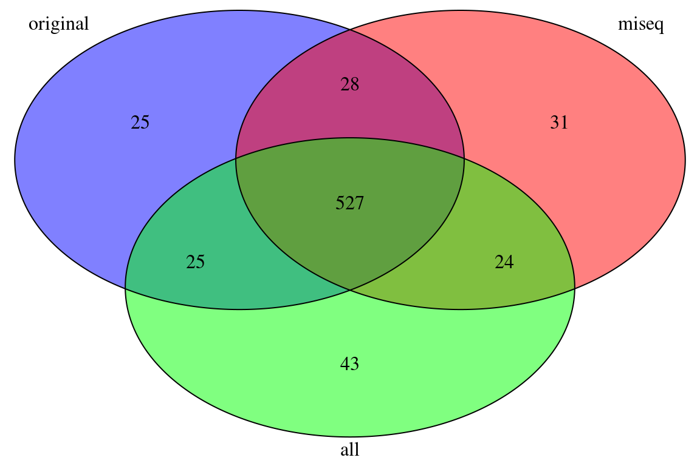
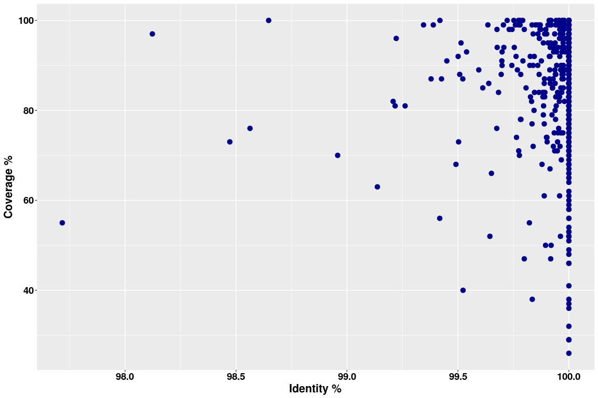

Shuffle reads scenario
================

Compare runs with shaffled reads - Kollector
--------------------------------------------

Given 3 Kollector runs of PG29: - original (keep miseq first) - shuffled reads miseq (keep miseq first too) - shuffled reads all (shuffle without preserving the order of miseq)

In this case "miseq" run is more conservative than "all" when compared to orig.

Load the data sets

``` r
library(VennDiagram)
library(dplyr)
library(ggplot2)
library(qdapRegex)

shuf_orig <- read.table("/media/kgagalova/SD2561/Documents/PHD_projects/SpruceUp/KollectorGeneReconstruction3species/RunKollector/data/Test_ShuffleKollector/allcoveredmapped_shuffle_orig_succeed.sam", quote="\"")
shuf_miseq <- read.table("/media/kgagalova/SD2561/Documents/PHD_projects/SpruceUp/KollectorGeneReconstruction3species/RunKollector/data/Test_ShuffleKollector/allcoveredmapped_shuffle_succeed.sam", quote="\"")
shuf_all <- read.table("/media/kgagalova/SD2561/Documents/PHD_projects/SpruceUp/KollectorGeneReconstruction3species/RunKollector/data/Test_ShuffleKollector/allcoveredmapped_shuffle2_succeed.sam", quote="\"")
nams = c("cov","trans","contig")
colnames(shuf_orig) = nams 
colnames(shuf_miseq) = nams
colnames(shuf_all) = nams
shuf_orig$trans = as.character(shuf_orig$trans)
shuf_miseq$trans = as.character(shuf_miseq$trans)
shuf_all$trans = as.character(shuf_all$trans)
```

Plot reconstruction
-------------------

Venndiagram

``` r
draw.triple.venn(area1 = length(unique(shuf_orig$trans)),
                 area2 = length(unique(shuf_miseq$trans)),
                 area3 = length(unique(shuf_all$trans)),
                 n12 = length(intersect(shuf_orig$trans,shuf_miseq$trans)),
                 n23 = length(intersect(shuf_miseq$trans,shuf_all$trans)),
                 n13 = length(intersect(shuf_orig$trans,shuf_all$trans)),
                 n123 = length(Reduce(intersect, list(shuf_orig$trans,shuf_miseq$trans,shuf_all$trans))),
                 category = c("original", "miseq", "all"),
                 fill = c("blue", "red", "green"),
                 cex = 2,
                 cat.cex = 2,
                 scaled=TRUE)
```



    ## (polygon[GRID.polygon.1], polygon[GRID.polygon.2], polygon[GRID.polygon.3], polygon[GRID.polygon.4], polygon[GRID.polygon.5], polygon[GRID.polygon.6], text[GRID.text.7], text[GRID.text.8], text[GRID.text.9], text[GRID.text.10], text[GRID.text.11], text[GRID.text.12], text[GRID.text.13], text[GRID.text.14], text[GRID.text.15], text[GRID.text.16])

Perform a qualitative analysis for original vs miseq shuffled read runs
-----------------------------------------------------------------------

### Merge the data files, exclude targets with multiple contigs

``` r
shuf_merged = merge(shuf_orig[shuf_orig$trans %in% names(which(table(shuf_orig$trans) == 1)),],shuf_miseq[shuf_miseq$trans %in% names(which(table(shuf_miseq$trans) == 1)),],by="trans")
names(shuf_merged) = c("trans","cov1","contig1","cov2","contig2")
write.table(shuf_merged,"MergedCommonPolished_shuf.txt",quote=F,row.names=F)
```

Do the pairwise alignment with the script in `src` - RunPairwiseBlastn\_len.sh and upload the data. The script aligns the longest sequence to the shortes in order to define exact identity and coverge of the most reconstructed gene. Plot coverage and identity for the alignments.

``` r
align_shuf <- read.delim("/media/kgagalova/SD2561/Documents/PHD_projects/SpruceUp/KollectorGeneReconstruction3species/RunKollector/data/Test_ShuffleKollector/CompareOrigMiseq/Shuf_alignments_blastn2.txt", header=FALSE)
#load seq lengths
blast_nams=c("qseqid","sseqid","pident","length","mismatch","gapopen","qstart","qend","sstart","send","evalue","bitscore","qcovs","qcovhsp","order")
colnames(align_shuf) = blast_nams
#select the max alignment
align_shuf_top_id =  align_shuf %>% group_by(qseqid,sseqid) %>% top_n(1, pident) %>% top_n(1, qcovs) %>% filter(row_number(qseqid) == 1)
dim(align_shuf_top_id)
```

    ## [1] 546  15

``` r
align_shuf_top_cov =  align_shuf %>% group_by(qseqid,sseqid) %>% top_n(1, qcovs) %>% top_n(1, pident) %>% filter(row_number(qseqid) == 1)

##statistics identity and cov
summary(align_shuf_top_id$pident)
```

    ##    Min. 1st Qu.  Median    Mean 3rd Qu.    Max. 
    ##   97.72   99.93  100.00   99.92  100.00  100.00

``` r
summary(align_shuf_top_id$qcovs)
```

    ##    Min. 1st Qu.  Median    Mean 3rd Qu.    Max. 
    ##   26.00   79.00   89.00   85.58   96.00  100.00

``` r
dim(subset(align_shuf_top_id,align_shuf_top_id$pident==100))
```

    ## [1] 331  15

``` r
dim(subset(align_shuf_top_id,align_shuf_top_id$qcovs==100))
```

    ## [1] 43 15

``` r
dim(subset(align_shuf_top_id,align_shuf_top_id$pident==100 & align_shuf_top_id$qcovs==100))
```

    ## [1] 26 15

Plot identity vs coverage

``` r
#plot when selecting identity first
ggplot(align_shuf_top_id, aes(pident, qcovs)) + 
  geom_point(colour = "darkblue",size = 3) +
  xlab("Identity %") +
  ylab("Coverage %") +
  theme(axis.title.x = element_text(face='bold',size=16,hjust=0.5),
          axis.title.y = element_text(face='bold',size=16,vjust=1),
          axis.text.x = element_text(face='bold',size=14,color='black'),
          axis.text.y = element_text(face='bold',size=14,color='black'))
```



``` r
#plot when selecting cov first
ggplot(align_shuf_top_cov, aes(pident, qcovs)) + 
  geom_point(colour = "darkblue",size = 3) +
  xlab("Identity %") +
  ylab("Coverage %") +
  theme(axis.title.x = element_text(face='bold',size=16,hjust=0.5),
          axis.title.y = element_text(face='bold',size=16,vjust=1),
          axis.text.x = element_text(face='bold',size=14,color='black'),
          axis.text.y = element_text(face='bold',size=14,color='black'))
```


Check the alignments against the target
---------------------------------------

``` r
miseq_comp <- read.delim("/media/kgagalova/SD2561/Documents/PHD_projects/SpruceUp/KollectorGeneReconstruction3species/RunKollector/data/Test_ShuffleKollector/CompareOrigMiseq/allcoveredmapped_shuffle_miseq_compOrigMiseq.sam",header=F,sep=" ")

orig_comp <- read.delim("/media/kgagalova/SD2561/Documents/PHD_projects/SpruceUp/KollectorGeneReconstruction3species/RunKollector/data/Test_ShuffleKollector/CompareOrigMiseq/allcoveredmapped_shuffle_orig_compOrigMiseq.sam", header=F,sep=" ")

nams1=c("cov","trans","strand","contig","cigar")
names(orig_comp) = nams1
names(miseq_comp) = nams1

#extract the intron lengths
get_intron_len <- function(mycigar) {
  int_introns = paste(rm_between(mycigar, 'M', 'N', extract=TRUE)[[1]],collapse=",")
  return(int_introns)
}

miseq_comp$introns_len=sapply(miseq_comp$cigar, get_intron_len)
#miseq_comp[miseq_comp$introns_len=="NA",c("introns_num","introns_len")] = 0
#exclude soft hard clipping
miseq_sh=miseq_comp[sapply(regmatches(miseq_comp$cigar, gregexpr("S|H",miseq_comp$cigar)), length) == 0,]
#2) exclude deletions insertions from the alignment 
miseq_di=miseq_sh[sapply(regmatches(miseq_sh$cigar, gregexpr("D|I",miseq_sh$cigar)), length) == 0,]
miseq_di$introns_num=sapply(gregexpr(",", miseq_di$introns_len, fixed = TRUE), function(x) sum(x > -1)) + 1
miseq_di[miseq_di$introns_len=="NA",c("introns_num","introns_len")] = 0

orig_comp$introns_len=sapply(orig_comp$cigar, get_intron_len)
#exclude soft hard clipping
orig_sh=orig_comp[sapply(regmatches(orig_comp$cigar, gregexpr("S|H",orig_comp$cigar)), length) == 0,]
#2) exclude deletions insertions from the alignment 
orig_di=orig_sh[sapply(regmatches(orig_sh$cigar, gregexpr("D|I",orig_sh$cigar)), length) == 0,]
orig_di$introns_num=sapply(gregexpr(",", orig_di$introns_len, fixed = TRUE), function(x) sum(x > -1)) + 1
orig_di[orig_di$introns_len=="NA",c("introns_num","introns_len")] = 0

#functon to swap strands when antisense == 16
#enter here the two columns of the data frame, one with the strand infor and the other one with the introns length
swap_same <-function(df){
  rev_int=c()
  for(row in 1:nrow(df)){
    cur_row = df[row,]
    if(cur_row[1]==0){
      rev_int = c(rev_int,unname(cur_row[2]))
    }else{
      rev_int=c(rev_int, paste(rev(as.numeric(strsplit(as.character(cur_row[2]),",")[[1]])),collapse=","))
  }
 }
 rev_int = sapply(rev_int,"[[",1)
 return(rev_int)
}

miseq_di$swap.introns_len = swap_same(miseq_di[,c("strand","introns_len")])
orig_di$swap.introns_len = swap_same(orig_di[,c("strand","introns_len")])

#merge the dfs in one
merged_comp = merge(orig_di,miseq_di,by="trans")
nams2 = c("trans","cov_orig","strand_orig","contig_orig","cigar_orig","introns_len.orig","introns_num.orig","swap.introns_len.orig","cov_miseq","strand_miseq","contig_miseq","cigar_miseq","introns_len.miseq","introns_num.miseq","swap.introns_len.miseq")
names(merged_comp) = nams2
#check the identity of the two runs - introns number
sum(merged_comp$introns_num.orig == merged_comp$introns_num.miseq)
```

    ## [1] 378

``` r
#check the identity of the two runs - introns length
sum(merged_comp$swap.introns_len.orig == merged_comp$swap.introns_len.miseq)
```

    ## [1] 334

Summary
-------

-   The majority of the targets are reconstruced by all the 3 runs.
-   The comparison performed with BLAST algnment copares original vs shuffled all miseq, this is a more conservative comparison only partially shaffling the files.
-   The overlap for coverage and identity is not perfect, very large however. The regions with perfect identity and coverage are only 26/546. With identity of 100% are 331/546 and with 100% coverage 43/546.
-   When comparing the alignments against the target, the contigs are very likely similar: 378/386 have the same number of introns, 334/386 have also identical length of introns.
