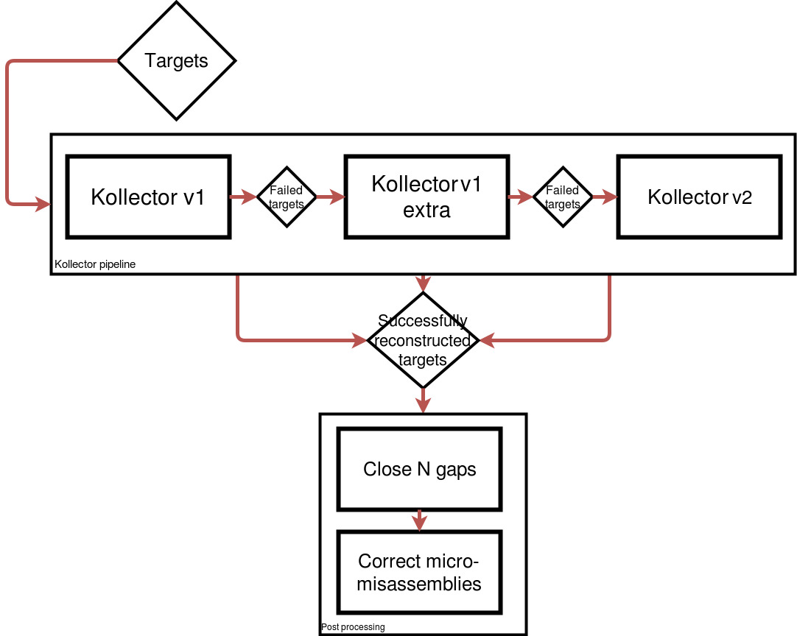

# Iterative run of Kollector

## Dependencies

- abyss2 - ```/home/shammond/src/abyss-2.0.1-build/k256/bin```     
- biobloomtools (develop) V1- ```/home/kgagalova/bin/biobloom_develop2working/bin```
- biobloomtools (develop) V2- ```/home/kgagalova/bin/biobloom_develop2/bin```
- kollector (develop) V1- ```/home/kgagalova/src/kollector_develop```     
- kollector (develop) V2- ```/home/kgagalova/src/kollector_newbiobloom``` 
- samtools     
- gmap   
- shufl - in *coreutils*, sometimes missing    

## Features - kollector_multiple V1

- Decrease *r* each iteration (0.95, 0.9, 0.85, 0.8, 0.75), keep *s* constant (0.8)

- Shaffle pet reads each iteration when creating BBF

- Always use miseq reads first when creating BBF       

## Features - kollector_multiple_extra V1

- Keap *r* and *s* constant at every iteration but lower than in kolector_multiple V1 (r=0.7, s=0.75) 

- Shaffle pet reads each iteration when creating BBF

- Always use miseq reads first when creating BBF


## features - kollector_multiple_merg V2

- Keep *r* and *s* constant in each iteration (r=0.9, s=0.75)

- Use improved version of BBT with itetartive filter

- Increase iterations of iterative filter at each step

- Use merged reads for scaffolding

- Shaffle pet reads each iteration when creating BBF

- Re iterate partially reconstructed targets in the next iteration (targets with coverage > 80% but < 90%)     

To be run as ```./LoopTargets``` in the same folder as the scripts (qsub in RunKollectorMultiple)


