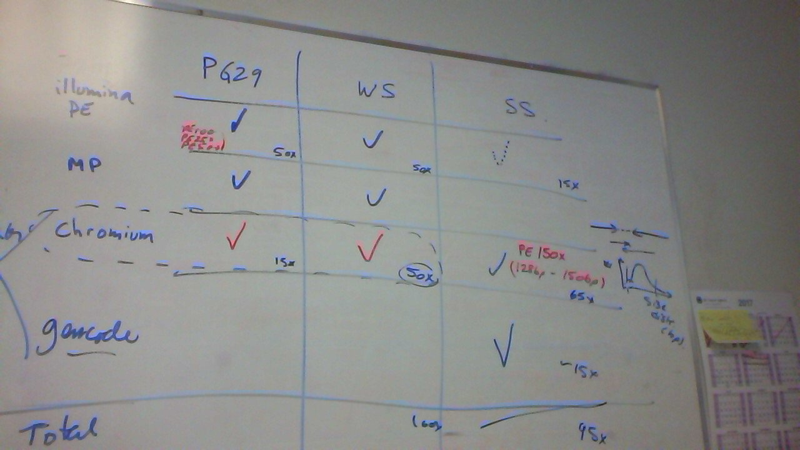

# Documentation about spruce resources

## Genetic map - *P.glauca*

data - LM3-work-version-Feb2014_Jean_to_Inanc.txt

Relative paper: 
- Pavy, N., M. Lamothe, B. Pelgas, F. Gagnon, I. Birol, J. Bohlmann, J. Mackay, N. Isabel & J. Bousquet. 2017. A high resolution reference genetic map positioning 8.8K genes for the conifer white spruce: structural genomics implications and correspondence with physical distance. 
Previous papers (genetic map):
- Pavy N, Pelgas B, Laroche J, Rigault P, Isabel N, Bousquet J 2012. Spruce gene map infers ancient plant genome reshuffling and subsequent slow evolution in the gymnosperm lineage leading to extant conifers
- Pelgas B., Bousquet J, Meirmans P, Ritland K, Isabel N 2011. QTL mapping in white spruce: gene maps and genomic regions underlying adaptive traits across pedigrees, years and environments Betty Pelgas1,2*, Jean Bousquet2, Patrick G Meirmans1,3, Kermit Ritland4, Nathalie Isabel1,2
Related paper - SNPs: 
- Pavy N, Gagnon F, Rigault P, Blais S, Deschênes A, Boyle B, Pelgas B, Deslauriers M, Clément S, Lavigne P, Lamothe M, Cooke JE, Jaramillo-Correa JP, Beaulieu J, Isabel N, Mackay J, Bousquet J. 2013. Development of high-density SNP genotyping arrays for white spruce (Picea glauca) and transferability to subtropical and nordic congeners

The map is build with **8793** SNPs from as many transcribed genes. The SNPs were selected from previous study (Pavy et al., 2013) because being unique to gene.          
A mapping pedegree was created from 1976 full-sib progeny derived from unrelated spruce individuals. The output is 12 Linkage Groups; composite map length is 1895 cM, whereas framework female and male maps were 2097 and 1696 cM.          

All the genes from the genetic map are found in GCAT.     

## cDNA GCAT - *P.glauca*

data - GCAT_WS-3.3.cluseq.fa (download from GCAT database or NCBI or public [ftp Arbore](ftp://ftp.gydle.com/pub/arborea/))

Relative paper: Rigault P, Boyle B, Lepage P, Cooke JE, Bousquet J, MacKay JJ. 2011 A white spruce gene catalog for conifer genome analyses.
Previous papers (used for GCAT): 
- Quebec team: Pavy, Nathalie, Charles Paule, Lee Parsons, John A. Crow, Marie-Josee Morency, Janice Cooke, James E. Johnson et al. "Generation, annotation, analysis and database integration of 16,500 white spruce EST clusters." BMC genomics 6, no. 1 (2005): 144.
- Vancouver team: Ralph, Steven G., Hye JE Chun, Natalia Kolosova, Dawn Cooper, Claire Oddy, Carol E. Ritland, Robert Kirkpatrick et al. "A conifer genomics resource of 200,000 spruce (Picea spp.) ESTs and 6,464 high-quality, sequence-finished full-length cDNAs for Sitka spruce (Picea sitchensis)." BMC genomics 9, no. 1 (2008): 484.

The gene catalog was developed by using EST data from 42 cDNA libraries. A total of 146,616 P. glauca high-quality ESTs were produced and analyzed together with 125,556 previously described ESTs from the Arborea (www.arborea.ulaval.ca; Pavy et al., 2005) and Treenomix (www.treenomix.ca; Ralph et al., 2008) research programs. In total, these 272,172 ESTs represent 201,405 distinct cDNA clones.     
The sequences oriented and assembled into higher quality sequences. In order to represent clusters by their most informative sequence, the most informative 5' cDNA was identified in each cluster and sought to obtain the FLIC (Full length insert cDNA) sequence of such clones through directed and internal sequencing steps. The resulting gene catalog is a grouping of cDNA clone sequences into **27,720** unique cDNA clusters, each estimated to represent a distinct gene. For each cluster, a representative clone is selected (usually the longest and most complete cDNA) to represent a gene. Thus, cluster sequences are nothing else than the clone sequence of their representative clones.
 
## Capture sequences - *P.galuca* 

data - GCAT_GS_PG29_Capture_Contigs.fa (to download from GCAT database)

No related paper

reference person: John MacKay

Oligonucleotide sets from Nimblegen (arrays solution) targeting 23,864 genes from GCAT representing approx 25.5 Mbases. Sequencing GS-FLX (454) follows: 3 296 903 reads analyzed.     
The results give a higher coverage of the genomic regions (30X) and a single contig assembly.     

## Reads spruce

### Q903

Chromium - 5 libraries

|        Sample        |     Lib     | Lib simple |
|:--------------------:|:-----------:|:----------:|
| E00132-1..2-SI-GA-E3 | HYN5VCCXX:4 |      1     |
|     E00455-A64450    | H352FALXX:1 |      2     |
|     E00455-A64451    | H352FALXX:2 |      2     |
|     E00455-A64452    | H352FALXX:3 |      2     |
|     E00455-A64453    | H352FALXX:4 |      2     |
|     E00457-A64450    | H33W3ALXX:4 |      3     |
|     E00457-A64451    | H33W3ALXX:5 |      3     |
|     E00457-A64452    | H33W3ALXX:6 |      3     |
|     E00457-A64453    | H33W3ALXX:7 |      3     |
|   E00458-SI-GA-E3    | HYNCTCCXX:8 |      4     |
|     E00459-E00132    | H33YVALXX:3 |      5     |
