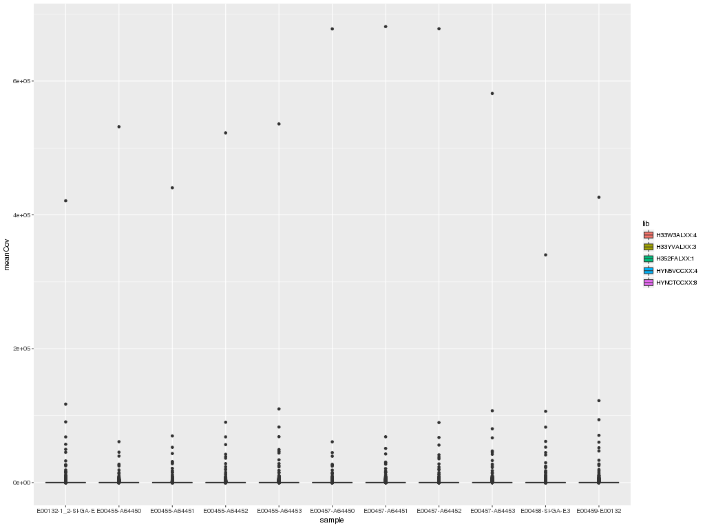
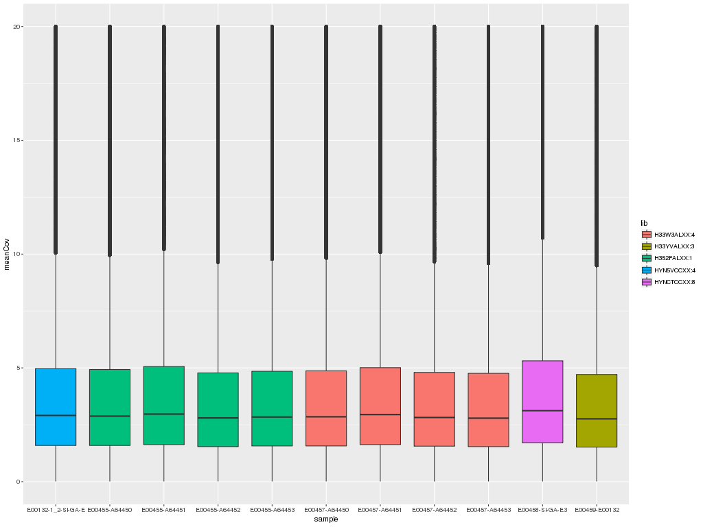
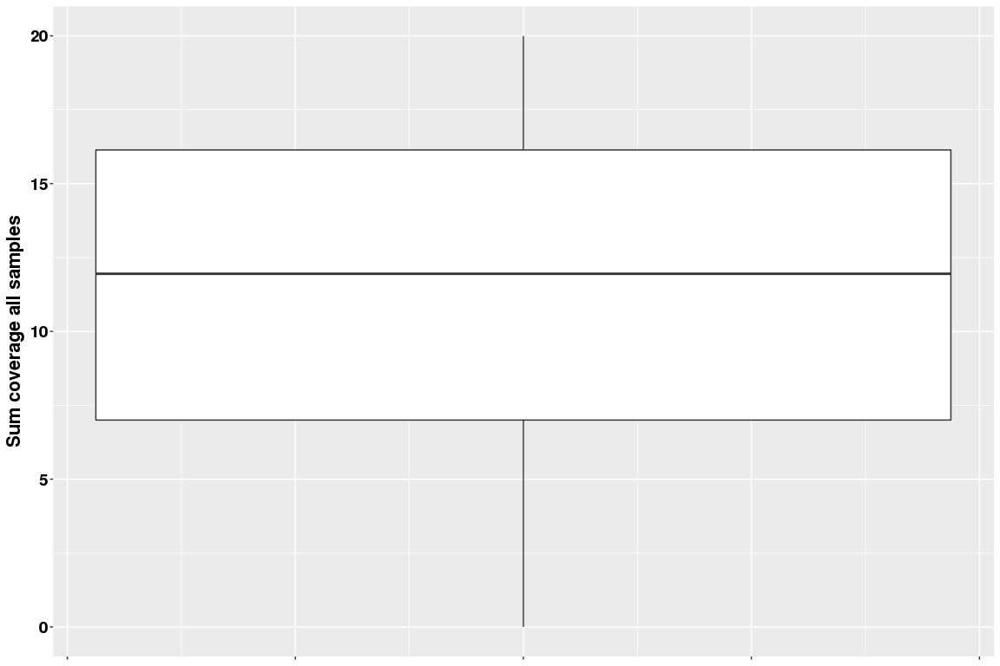
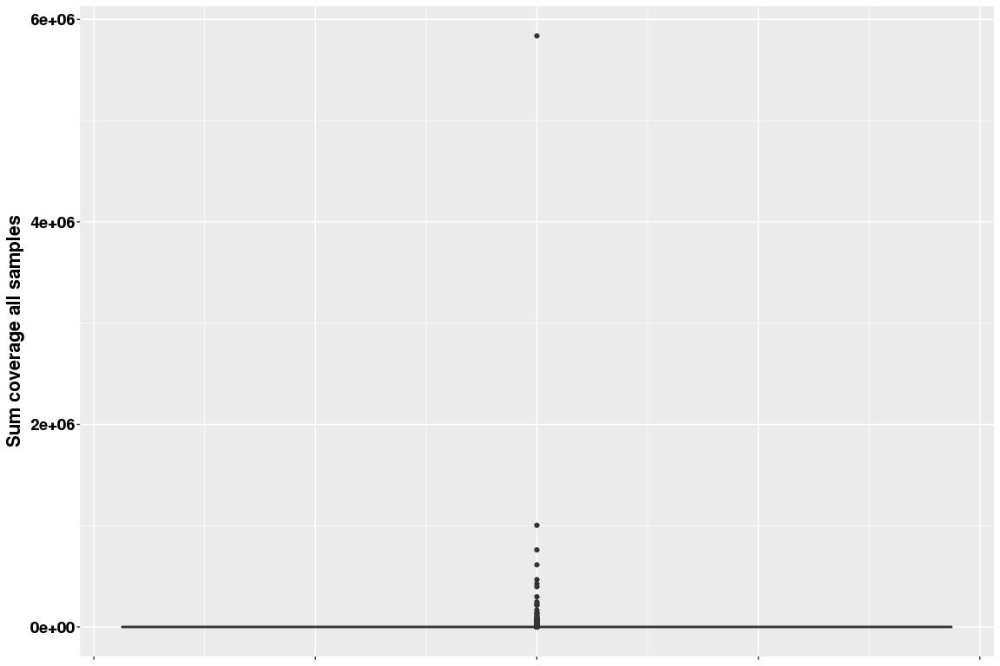
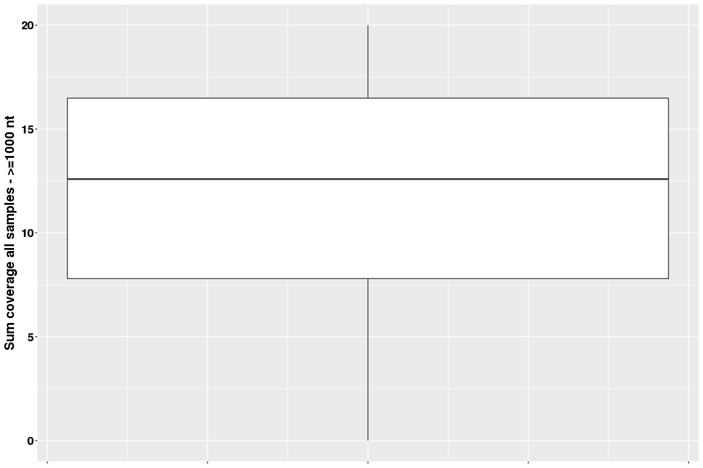
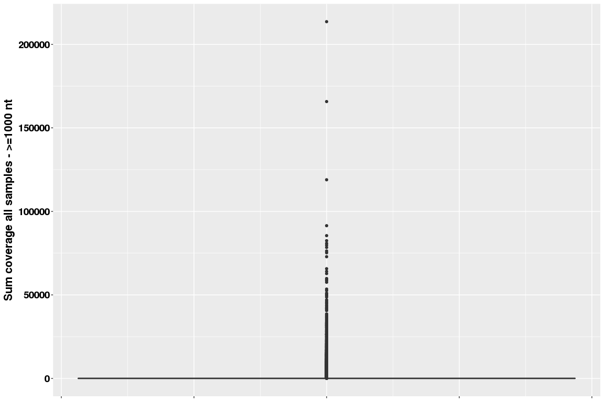

# Coverage Chromium reads on PG29v4 assembly

### Kristina Gagalova - PhD student

## PG29v4 genome assembly

### Abyss-fac stats for 3 genome assemblies - spruce

|n  |n:500	|L50	|min	|N80	|N50	|N20	|E-size	|max	|sum	|name	|
|:-------:|:-------:|:-----:|:---:|:---:|:-----:|:-----:|:-----:|:-------:|:-------:|:-------------:|
|58.51e6	|4319783	|165773	|500	|3094	|19935	|120393	|69093	|1347868	|22.42e9	|ws77111sealed1.fa|
|70.17e6	|4178533	|121847	|500	|2836	|34405	|120444	|70925	|1446508	|20.78e9	|PG29_V3.fa	|
|**67.25e6**|**3057935**|**103840**|**500**|**5241**|**43530**|**133860**|**79575**|**1448480**|**20.65e9**|**PG29_V4.fa**|

## Sitka Chromium reads aligned against PG29v4

- Estimated coverage: 50X
- 5 libraries

Default BWA alignment - performed by Rene and Lauren. 

## Genome coverage estmate

Reference [here](http://bedtools.readthedocs.io/en/latest/content/tools/genomecov.html)

```
bedtools genomecov -ibam SpruceAlignment.bam -bga > SpruceAlignment.txt
```

Output is in BEDGRAPH format (example below)

```
#contig   start stop  reads
chr1  0       554304  0
chr1  554304  554309  5
chr1  554309  554313  6
chr1  554313  554314  1
chr1  554314  554315  0
chr1  554315  554316  6
chr1  554316  554317  5
chr1  554317  554318  1
chr1  554318  554319  2
chr1  554319  554321  6
```

The average coverage per contig is calculated as ```((stop - start) * reads ) / length_contig```

## Plot mean coverage

```{r data_load}
library(reshape)
library( dplyr )
library( ggplot2 )
library( tidyr )
library( data.table )
library(plyr)

dataPath="/projects/btl/kgagalova/CoverageQ903"
allFiles <- list.files( path = dataPath, pattern = "Coord.txt", full.names = TRUE )

l <- lapply( allFiles, function( fn ){
  d <- read.table( fn, header = F );
  d$fileName <- fn;
  d
  } );

d <- bind_rows( l );
dim(d)
##[1] 33648197        4

sampl = c("E00132-1_2-SI-GA-E","E00455-A64450","E00455-A64451","E00455-A64452","E00455-A64453","E00457-A64450","E00457-A64451","E00457-A64452","E00457-A64453","E00458-SI-GA-E3","E00459-E00132")
d$sample = as.factor(rep(sampl,each=3058927))

d$lib = as.factor(rep(c("HYN5VCCXX:4","H352FALXX:1","H33W3ALXX:4","HYNCTCCXX:8","H33YVALXX:3"),c(3058927,3058927*4,3058927*4,3058927,3058927)))

nams=c("contig","len","meanCov","file","sample","lib")
colnames(d) = nams

head(d)
##   contig  len meanCov                                                                                      file
##1      1 1191    2.56 /projects/btl/kgagalova/CoverageQ903/MeanCovE00132-1_2-SI-GA-E3-ontoPG29v4sortedCoord.txt
##2      2  555    1.70 /projects/btl/kgagalova/CoverageQ903/MeanCovE00132-1_2-SI-GA-E3-ontoPG29v4sortedCoord.txt
##3      3  555    5.34 /projects/btl/kgagalova/CoverageQ903/MeanCovE00132-1_2-SI-GA-E3-ontoPG29v4sortedCoord.txt
##4      4  827    2.66 /projects/btl/kgagalova/CoverageQ903/MeanCovE00132-1_2-SI-GA-E3-ontoPG29v4sortedCoord.txt
##5      6  675    2.27 /projects/btl/kgagalova/CoverageQ903/MeanCovE00132-1_2-SI-GA-E3-ontoPG29v4sortedCoord.txt
##6      7  627   17.38 /projects/btl/kgagalova/CoverageQ903/MeanCovE00132-1_2-SI-GA-E3-ontoPG29v4sortedCoord.txt
              sample         lib
##1 E00132-1_2-SI-GA-E HYN5VCCXX:4
##2 E00132-1_2-SI-GA-E HYN5VCCXX:4
##3 E00132-1_2-SI-GA-E HYN5VCCXX:4
##4 E00132-1_2-SI-GA-E HYN5VCCXX:4
##5 E00132-1_2-SI-GA-E HYN5VCCXX:4
##6 E00132-1_2-SI-GA-E HYN5VCCXX:4

#check how many are zero's
d_zero = subset(d,d$meanCov==0)
table(d_zero$sample)
##E00132-1_2-SI-GA-E      E00455-A64450      E00455-A64451      E00455-A64452      E00455-A64453      E00457-A64450 
##             25295              25684              25060              26969              25741              24906 
##     E00457-A64451      E00457-A64452      E00457-A64453    E00458-SI-GA-E3      E00459-E00132 
##             24021              25201              25837              23433              25567
```
## Plot the mean coverage per sample, highligh library

```{r boxplot}
d_cov = subset(d,d$meanCov!=0)[,c("contig","len","meanCov","sample","lib")]
ddply(d_cov, .(sample), summarize, "mean"= mean(meanCov), "median" = median(meanCov), "sd" = sd(meanCov), "mad" = mad(meanCov))
##              sample     mean median       sd      mad
##1  E00132-1_2-SI-GA-E 7.806336   3.03 273.0131 2.461116
##2       E00455-A64450 7.277753   2.99 314.4668 2.416638
##3       E00455-A64451 7.543092   3.09 266.4068 2.490768
##4       E00455-A64452 7.424634   2.90 316.9821 2.342508
##5       E00455-A64453 7.756886   2.95 330.6018 2.386986
##6       E00457-A64450 7.224507   2.96 396.2068 2.386986
##7       E00457-A64451 7.535487   3.06 399.5682 2.461116
##8       E00457-A64452 7.504897   2.92 402.2474 2.357334
##9       E00457-A64453 7.621845   2.89 354.0429 2.327682
##10    E00458-SI-GA-E3 8.123166   3.26 228.0246 2.653854
##11      E00459-E00132 7.535025   2.86 277.6736 2.312856


#write.table(d_cov,"/projects/btl/kgagalova/CoverageQ903/fill_table.txt",quote=F,row.names=F)
#ggplot(d, aes(x=sample, y=meanCov, fill=lib)) +
#  geom_boxplot()
#ggplot(d, aes(x=sample, y=meanCov, fill=lib)) +
#  geom_boxplot() +
#  ylim(0, 20)
```




## Upload files in long format and sorted

```{r}
allFilesLong <- list.files( path = dataPath, pattern = "CoordSort.txt", full.names = TRUE )
l2 <- lapply( allFilesLong, function( fn ){
  d <- read.table( fn, header = F );
  d
  } );
d2 <- bind_cols( l2 );
dim(d2)
##[1] 3058927      33

ToKeep = c(1,2,3,6,9,12,15,18,21,24,27,30,33)
d2_cov = d2[,ToKeep]
colnames(d2_cov) = c("contig","len", sampl)
head(d2_cov)
##  contig  len E00132-1_2-SI-GA-E E00455-A64450 E00455-A64451 E00455-A64452 E00455-A64453 E00457-A64450 E00457-A64451
##1      1 1191               2.56          2.91          1.67          1.18          2.54          1.89          2.38
##2     10 1154               5.15          5.19         10.75          5.79          9.30          4.84          5.87
##3    100  654               2.83          1.81          3.05          2.40          2.80          2.61          1.56
##4   1000  505               0.18          1.65          0.60          0.10          1.24          0.62          1.14
##5  10000  658               5.95          0.77          6.15          4.31          6.31          1.83          3.97
##6 100000  553               0.08          0.29          0.00          0.46          0.22          0.21          0.09
##  E00457-A64452 E00457-A64453 E00458-SI-GA-E3 E00459-E00132
##1          2.03          2.67           1.86          1.40
##2          7.47          7.95           7.57          5.47
##3          2.05          2.35           1.56          0.72
##4          0.70          1.11           0.17          0.33
##5          4.56          3.59           7.22          5.62
##6          0.27          0.06           0.00          0.05

#sum average coverage: cumlative coverage for all the libraries/samples
d2_cov$total = apply(d2_cov[,c(3:13)],1,sum)
```

## Boxplot for cumulative coverage - all libraries/samples

```{r boxplot_all}
#number of contigs with 0 coverage after cumulative
sum(d2_cov$total == 0)
## [1] 1345

####Plot average coverage cumulative - range 0-20
ggplot(d2_cov, aes(x=1, y=total)) +
  geom_boxplot() +
  ylim(0, 20) +
  xlab("") +
  ylab("Sum coverage all samples") +
  theme(axis.title.x = element_blank(),
        axis.title.y = element_text(face='bold',size=16,vjust=1),
        axis.text.x = element_blank(),
        axis.text.y = element_text(face='bold',size=14,color='black'))
```



```
####Plot average coverage cumulative
ggplot(d2_cov, aes(x=1, y=total)) +
  geom_boxplot() + 
  xlab("") +
  ylab("Sum coverage all samples") +
  theme(axis.title.x = element_blank(),
        axis.title.y = element_text(face='bold',size=16,vjust=1),
        axis.text.x = element_blank(),
        axis.text.y = element_text(face='bold',size=14,color='black'))
```


```
#########################################################################
###PLOT only for the contigs that are >= 1000
d2_cov1000 = subset(d2_cov,d2_cov$len >=1000)

####Plot average coverage cumulative - range 0-20
ggplot(d2_cov1000, aes(x=1, y=total)) +
  geom_boxplot() +
  ylim(0, 20) +
  xlab("") +
  ylab("Sum coverage all samples - >=1000 nt") +
  theme(axis.title.x = element_blank(),
        axis.title.y = element_text(face='bold',size=16,vjust=1),
        axis.text.x = element_blank(),
        axis.text.y = element_text(face='bold',size=14,color='black'))
```



```
####Plot average coverage cumulative
ggplot(d2_cov1000, aes(x=1, y=total)) +
  geom_boxplot() + 
  xlab("") +
  ylab("Sum coverage all samples - >=1000 nt") +
  theme(axis.title.x = element_blank(),
        axis.title.y = element_text(face='bold',size=16,vjust=1),
        axis.text.x = element_blank(),
        axis.text.y = element_text(face='bold',size=14,color='black'))
```



## Summary stats sum all coverage 

```{r stats}
#all contigs
summary(d2_cov$total)
##    Min. 1st Qu.  Median    Mean 3rd Qu.    Max. 
##      0      19      33      83      57 5837000 


#contigs >=1000
summary(d2_cov1000$total)
##      Min.   1st Qu.    Median      Mean   3rd Qu.      Max. 
##     0.00     19.33     32.59     67.33     54.32 213600.00 
```
