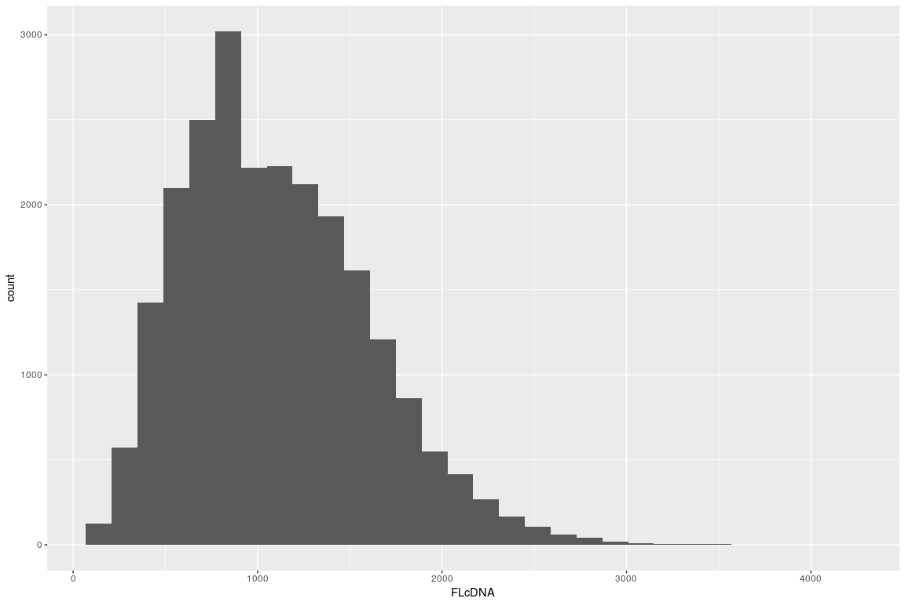
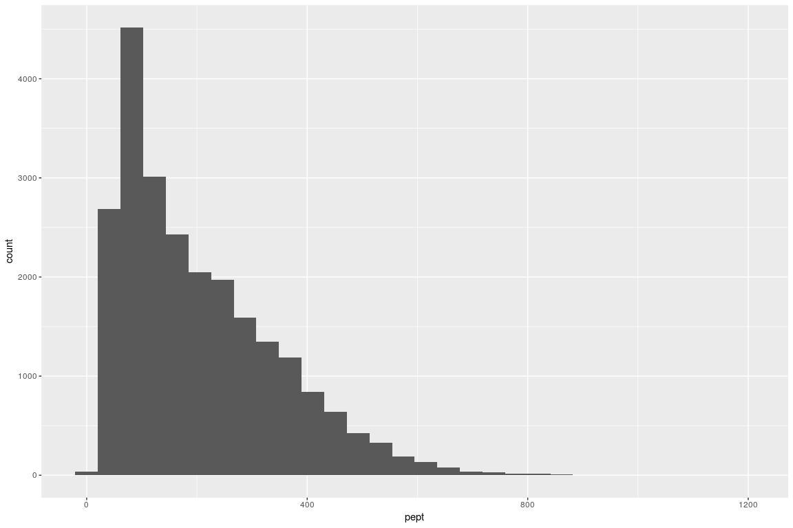
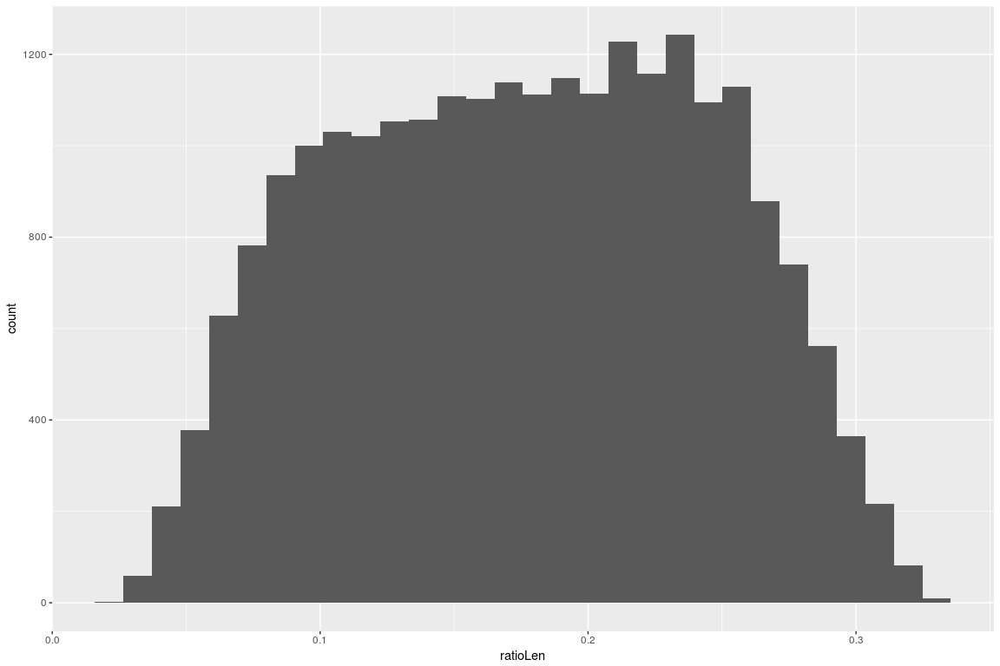
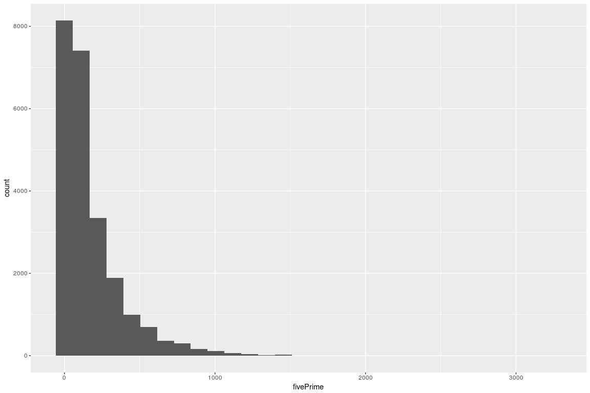
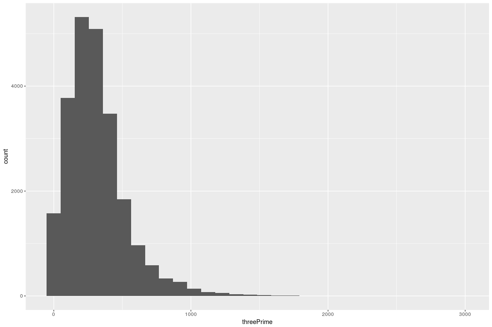
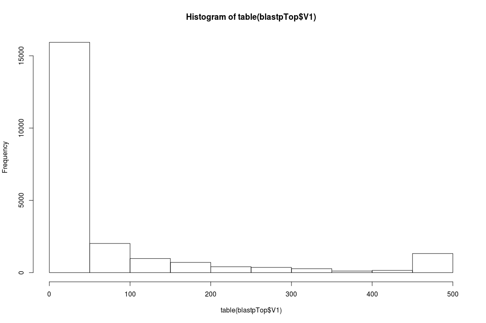
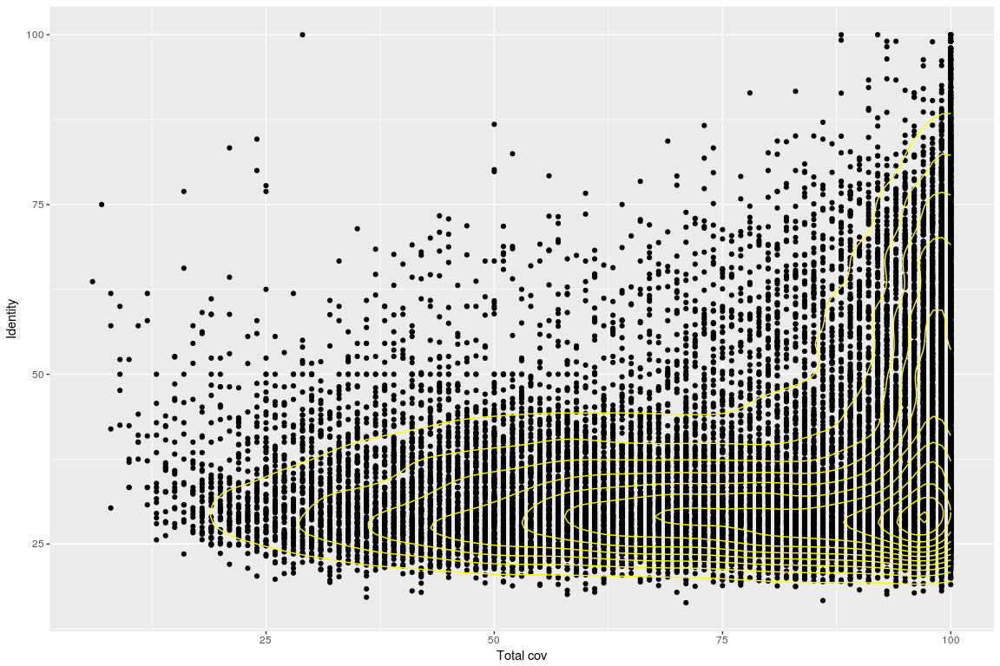

Check GCAT peptides translation and more
================

Load the dataset and preprocess
-------------------------------

``` r
library(ggplot2)
library(dplyr)

lenPept <- read.delim("/projects/btl/kgagalova/PHD_projects2/SpruceUp/SpruceResourcesComp/data/GCATpeptidesORF/AllPeptidesGCAT.len", header=FALSE)
lenPept$V1 = as.character(lenPept$V1)

lenPept$start = as.numeric(sapply(strsplit(sapply(strsplit(lenPept$V1,"_"), "[[", 2),":"),"[[",2))
lenPept$stop = as.numeric(sapply(strsplit(sapply(strsplit(lenPept$V1,"_"), "[[", 2),":"),"[[",3))

#enter strand
strand = ifelse(lenPept$start < lenPept$stop, "+", "-")

lenPept$strand = strand
lenPept[lenPept$strand == "-", c("start", "stop")] <- lenPept[lenPept$strand == "-", c("stop", "start")]

lenPept$ratioLen = (lenPept$V3 / lenPept$V2)

#enter three and five prime regions len
lenPept$fivePrime = lenPept$start
lenPept$threePrime = (lenPept$V2 - lenPept$stop)

colnames(lenPept)[c(1:3)] = c("name","FLcDNA","pept")
```

### Plot the distributions

``` r
#simple plot of the distributions

ggplot(lenPept, aes(FLcDNA)) +
  geom_histogram()
```



``` r
summary(lenPept$FLcDNA)
```

    ##    Min. 1st Qu.  Median    Mean 3rd Qu.    Max. 
    ##     102     723    1039    1104    1426    4161

``` r
ggplot(lenPept, aes(pept)) +
  geom_histogram()
```



``` r
summary(lenPept$pept)
```

    ##    Min. 1st Qu.  Median    Mean 3rd Qu.    Max. 
    ##    10.0    88.0   169.0   205.1   290.0  1200.0

``` r
ggplot(lenPept, aes(ratioLen)) +
  geom_histogram()
```



``` r
summary(lenPept$ratioLen)
```

    ##    Min. 1st Qu.  Median    Mean 3rd Qu.    Max. 
    ## 0.02019 0.12095 0.17873 0.17681 0.23260 0.32898

``` r
#FLcDNA 
ggplot(lenPept, aes(fivePrime)) +
  geom_histogram()
```



``` r
summary(lenPept$fivePrime)
```

    ##    Min. 1st Qu.  Median    Mean 3rd Qu.    Max. 
    ##     0.0    37.0    96.0   173.2   229.0  3243.0

``` r
ggplot(lenPept, aes(threePrime)) +
  geom_histogram()
```



``` r
summary(lenPept$threePrime)
```

    ##    Min. 1st Qu.  Median    Mean 3rd Qu.    Max. 
    ##       1     166     275     313     408    2969

### BLASTp results

I have blasted the ORFfinder peptides to the Swiss prot data base, excluding bacteria, viruses and archea. Below the results for coverage and identity.

``` r
library(dplyr)

blastp <- read.delim("/projects/btl/kgagalova/PHD_projects2/SpruceUp/SpruceResourcesComp/data/GCATpeptidesORF/gcat_complete.allvsall.tsv", header=FALSE)
blastpTop = blastp %>% group_by(V1,V2) %>% slice(which.max(V13))

hist(table(blastpTop$V1))
```



``` r
summary(as.numeric(unname(table(blastpTop$V1))))
```

    ##    Min. 1st Qu.  Median    Mean 3rd Qu.    Max. 
    ##    1.00    4.00   13.00   72.19   63.00  500.00

``` r
blastpTopUniq = blastpTop %>% group_by(V1) %>% slice(which.max(V13))

ggplot(blastpTopUniq, aes(x=V13, y=V3)) +
  geom_point() + 
  xlab("Total cov") +
  ylab("Identity") +
  geom_density2d(colour="yellow")
```



``` r
#total aligned
length(unique(blastpTopUniq$V1))
```

    ## [1] 22244

``` r
#GCAT with more than 50% coverage
nrow(subset(blastpTopUniq,blastpTopUniq$V13 > 50))
```

    ## [1] 18803

``` r
#GCAT with more than 75% coverage
nrow(subset(blastpTopUniq,blastpTopUniq$V13 > 75))
```

    ## [1] 13190

``` r
#GCAT with more than 80% coverage
nrow(subset(blastpTopUniq,blastpTopUniq$V13 > 80))
```

    ## [1] 11827

``` r
#GCAT with more than 90% coverage
nrow(subset(blastpTopUniq,blastpTopUniq$V13 > 90))
```

    ## [1] 8702

``` r
#GCAT with more than 95% coverage
nrow(subset(blastpTopUniq,blastpTopUniq$V13 > 95))
```

    ## [1] 6507
