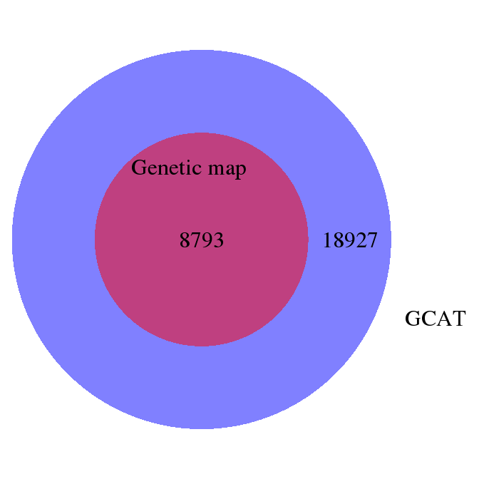

Compare resources - spruce
================

Overlapping genes
-----------------

Get the genes that are found in the both the genetic map and the GCAT data set.

Load data set
-------------

``` r
library(Biostrings)
```

    ## Loading required package: BiocGenerics

    ## Loading required package: parallel

    ## 
    ## Attaching package: 'BiocGenerics'

    ## The following objects are masked from 'package:parallel':
    ## 
    ##     clusterApply, clusterApplyLB, clusterCall, clusterEvalQ,
    ##     clusterExport, clusterMap, parApply, parCapply, parLapply,
    ##     parLapplyLB, parRapply, parSapply, parSapplyLB

    ## The following objects are masked from 'package:stats':
    ## 
    ##     IQR, mad, xtabs

    ## The following objects are masked from 'package:base':
    ## 
    ##     anyDuplicated, append, as.data.frame, cbind, colnames,
    ##     do.call, duplicated, eval, evalq, Filter, Find, get, grep,
    ##     grepl, intersect, is.unsorted, lapply, lengths, Map, mapply,
    ##     match, mget, order, paste, pmax, pmax.int, pmin, pmin.int,
    ##     Position, rank, rbind, Reduce, rownames, sapply, setdiff,
    ##     sort, table, tapply, union, unique, unsplit, which, which.max,
    ##     which.min

    ## Loading required package: S4Vectors

    ## Loading required package: stats4

    ## 
    ## Attaching package: 'S4Vectors'

    ## The following objects are masked from 'package:base':
    ## 
    ##     colMeans, colSums, expand.grid, rowMeans, rowSums

    ## Loading required package: IRanges

    ## Loading required package: XVector

``` r
library(VennDiagram)
```

    ## Loading required package: grid

    ## Loading required package: futile.logger

``` r
dataPath="/projects/btl/kgagalova/comapre_resources"

fa_files <- list.files( path = dataPath, pattern = ".fa", full.names = TRUE )
gen_map <- list.files( path = dataPath, pattern = ".txt", full.names = TRUE)

seqs <- sapply(fa_files, readDNAStringSet)
seqs_s <- sapply(sapply(sapply(seqs, names), strsplit,"[ \t]+"), function(x) { sapply(x, "[",2)}) #get names of the clusters
names(seqs_s) = c("GCAT", "mapped")
genm <- read.table(gen_map, header =T)
```

Genetic map vs cDNA GCAT
------------------------



Conclusions
-----------

-   The genetic map was build using a subset of genes from GCAT.
