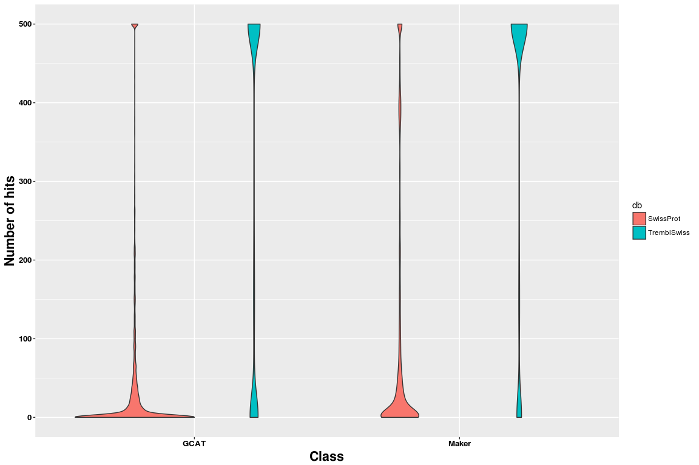
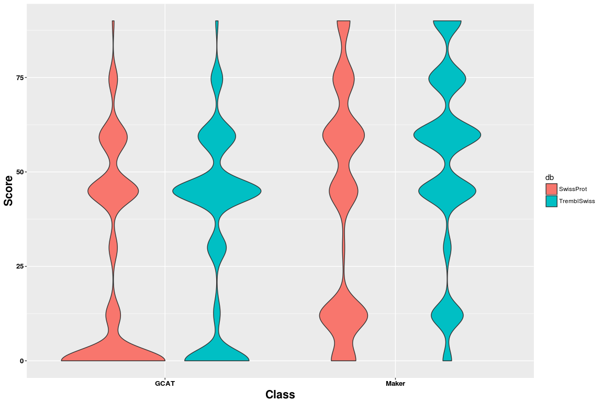
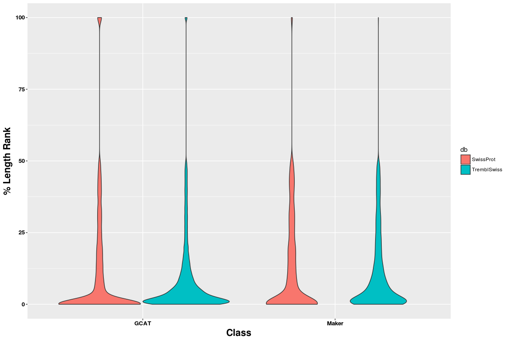
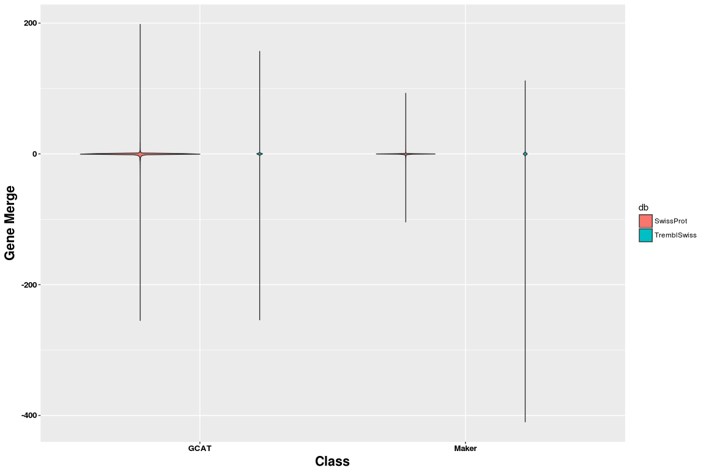
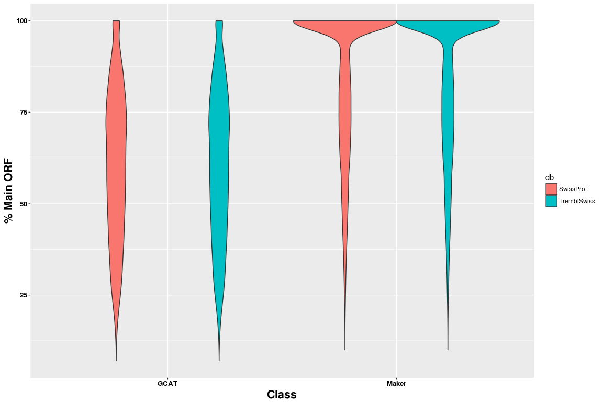
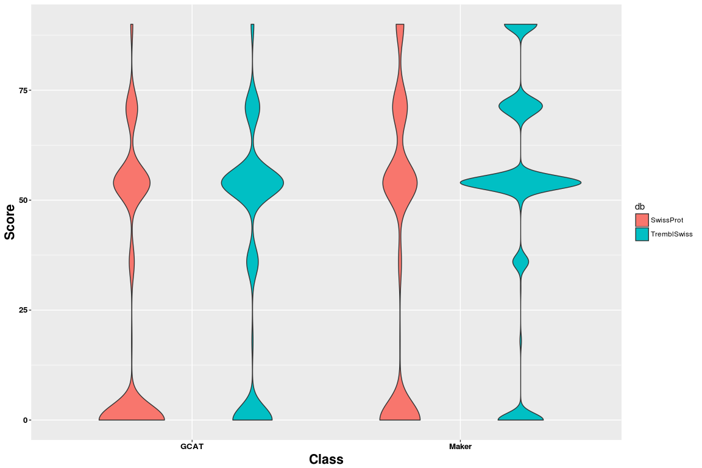
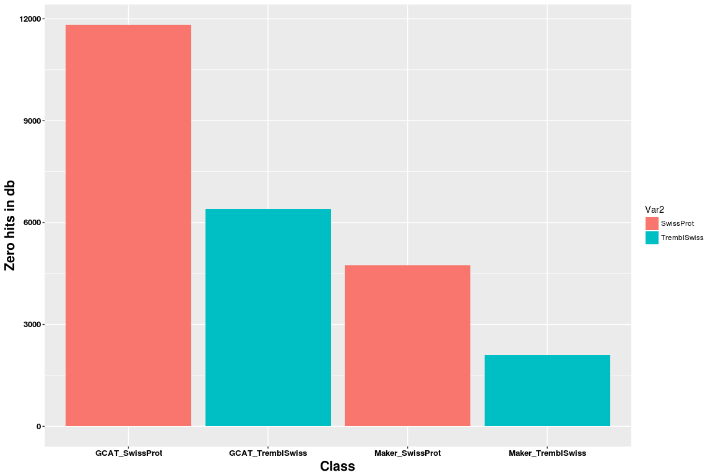

GeneValidator: GCAT genes VS Maker high confidence genes
================

Compare GeneValidator output
----------------------------

### Load data set with default score estimation in GeneValidator

Load the data sets, for the default runs of GeneValdator

``` r
library( dplyr )
library( ggplot2 )
library( tidyr )
library( data.table )
library(plyr)

dataPath=c("/projects/btl/kgagalova/PHD_projects2/SpruceUp/SpruceResourcesComp/data/GeneValidatorGCATvsMaker/TremblSwiss/DeafultScore", "/projects/btl/kgagalova/PHD_projects2/SpruceUp/SpruceResourcesComp/data/GeneValidatorGCATvsMaker/SwissProt/DeafultScore")

allFiles <- list.files( path = dataPath, pattern = "Tab", full.names = TRUE )

l <- lapply( allFiles, function( fn ){
  d <- read.table( fn, header = F, sep="\t" )
  d$fileName <- fn;
  d
  } );

allGeneVal <- bind_rows( l );

dim(allGeneVal)
```

    ## [1] 88466    12

``` r
allGeneVal$dataset = gsub("Tab_","",gsub("\\.out","",sapply(strsplit(allGeneVal$fileNam,"/"), "[[", 12)))
allGeneVal$type = sapply(strsplit(allGeneVal$dataset,"_"), "[[", 1)
allGeneVal$type[allGeneVal$type=="high"] <- "Maker" 
allGeneVal$db = sapply(strsplit(allGeneVal$fileNam,"/"), "[[", 10)

colNames=c("No","Score","Identifier","No_Hits","LengthCluster","LengthRank","GeneMerge","Duplication","ReadingFrame","MainORF","MissingExtraSequences","fileName","dataset","type","db")

colnames(allGeneVal) = colNames

#polish the results
#LenRank
allGeneVal$LengthRankPolished = sapply(strsplit(allGeneVal$LengthRank,"%"), "[[", 1)
allGeneVal$LengthRankPolished[allGeneVal$LengthRankPolished == "Notenoughevidence"] <- NA
allGeneVal$LengthRankPolished = as.numeric(allGeneVal$LengthRankPolished)
#GeneMerge
allGeneVal$GeneMerge[allGeneVal$GeneMerge == "Notenoughevidence"] <- NA
allGeneVal$GeneMerge = as.numeric(allGeneVal$GeneMerge)
#GeneDuplication
allGeneVal$Duplication[allGeneVal$Duplication == "Notenoughevidence"] <- NA

#MainOrf
allGeneVal$MainORFPolished = sapply(strsplit(allGeneVal$MainORF,"%"), "[[", 1)
allGeneVal$MainORFPolished  = as.numeric(allGeneVal$MainORFPolished)

allGeneVal$class = paste(allGeneVal$dataset,allGeneVal$db,sep="_")
```

Including Plots
---------------

``` r
ggplot(allGeneVal, aes(x=type, y=No_Hits, fill=db)) +
  geom_violin() + 
  xlab("Class") +
  ylab("Number of hits") +
  theme(axis.title.x = element_text(face='bold',size=16,hjust=0.5),
          axis.title.y = element_text(face='bold',size=16,vjust=1),
          axis.text.x = element_text(face='bold',size=10,color='black'),
          axis.text.y = element_text(face='bold',size=10,color='black'))
```



``` r
ggplot(allGeneVal, aes(x=type, y=Score, fill=db)) +
  geom_violin() + 
  xlab("Class") +
  ylab("Score") +
  theme(axis.title.x = element_text(face='bold',size=16,hjust=0.5),
          axis.title.y = element_text(face='bold',size=16,vjust=1),
          axis.text.x = element_text(face='bold',size=10,color='black'),
          axis.text.y = element_text(face='bold',size=10,color='black'))
```



``` r
ggplot(allGeneVal, aes(x=type, y=LengthRankPolished, fill=db)) +
  geom_violin() + 
  xlab("Class") +
  ylab("% Length Rank") +
  theme(axis.title.x = element_text(face='bold',size=16,hjust=0.5),
          axis.title.y = element_text(face='bold',size=16,vjust=1),
          axis.text.x = element_text(face='bold',size=10,color='black'),
          axis.text.y = element_text(face='bold',size=10,color='black'))
```



``` r
ggplot(allGeneVal, aes(x=type, y=GeneMerge, fill=db)) +
  geom_violin() + 
  xlab("Class") +
  ylab("Gene Merge") +
  theme(axis.title.x = element_text(face='bold',size=16,hjust=0.5),
          axis.title.y = element_text(face='bold',size=16,vjust=1),
          axis.text.x = element_text(face='bold',size=10,color='black'),
          axis.text.y = element_text(face='bold',size=10,color='black'))
```



``` r
ggplot(allGeneVal, aes(x=type, y=MainORFPolished, fill=db)) +
  geom_violin() + 
  xlab("Class") +
  ylab("% Main ORF") +
  theme(axis.title.x = element_text(face='bold',size=16,hjust=0.5),
          axis.title.y = element_text(face='bold',size=16,vjust=1),
          axis.text.x = element_text(face='bold',size=10,color='black'),
          axis.text.y = element_text(face='bold',size=10,color='black'))
```



### Load data set where the ORF score is excluded from GeneValidator scoring

``` r
dataPath2=c("/projects/btl/kgagalova/PHD_projects2/SpruceUp/SpruceResourcesComp/data/GeneValidatorGCATvsMaker/TremblSwiss/ExcludeORFScore", "/projects/btl/kgagalova/PHD_projects2/SpruceUp/SpruceResourcesComp/data/GeneValidatorGCATvsMaker/SwissProt/ExcludeORFScore")

allFiles2 <- list.files( path = dataPath2, pattern = "Tab", full.names = TRUE )

l2 <- lapply( allFiles2, function( fn ){
  d <- read.table( fn, header = F, sep="\t" )
  d$fileName <- fn;
  d
  } );

allGeneVal2 <- bind_rows( l2 );

dim(allGeneVal2)
```

    ## [1] 88466    11

``` r
allGeneVal2$dataset = gsub("Tab_","",gsub("\\.out","",sapply(strsplit(allGeneVal$fileNam,"/"), "[[", 12)))
allGeneVal2$type = sapply(strsplit(allGeneVal2$dataset,"_"), "[[", 1)
allGeneVal2$type[allGeneVal2$type=="high"] <- "Maker" 
allGeneVal2$db = sapply(strsplit(allGeneVal2$fileNam,"/"), "[[", 10)

colNames2=c("No","Score","Identifier","No_Hits","LengthCluster","LengthRank","GeneMerge","Duplication","ReadingFrame","MissingExtraSequences","fileName","dataset","type","db")

colnames(allGeneVal2) = colNames2

#polish the results
#LenRank
allGeneVal2$LengthRankPolished = sapply(strsplit(allGeneVal2$LengthRank,"%"), "[[", 1)
allGeneVal2$LengthRankPolished[allGeneVal2$LengthRankPolished == "Notenoughevidence"] <- NA
allGeneVal2$LengthRankPolished = as.numeric(allGeneVal2$LengthRankPolished)
#GeneMerge
allGeneVal2$GeneMerge[allGeneVal2$GeneMerge == "Notenoughevidence"] <- NA
allGeneVal2$GeneMerge = as.numeric(allGeneVal2$GeneMerge)
#GeneDuplication
allGeneVal2$Duplication[allGeneVal2$Duplication == "Notenoughevidence"] <- NA
```

### Include total score 2, for excluded ORF score

``` r
ggplot(allGeneVal2, aes(x=type, y=Score, fill=db)) +
  geom_violin() + 
  xlab("Class") +
  ylab("Score") +
  theme(axis.title.x = element_text(face='bold',size=16,hjust=0.5),
          axis.title.y = element_text(face='bold',size=16,vjust=1),
          axis.text.x = element_text(face='bold',size=10,color='black'),
          axis.text.y = element_text(face='bold',size=10,color='black'))
```



Estimate the number of missing hits per class

``` r
allGeneValNoHits=allGeneVal2[,c("No_Hits","type","db")]
allGeneValNoHits1 = subset(allGeneValNoHits, allGeneValNoHits$No_Hits == 0)
allGeneValNoHits1 = as.data.frame(table(allGeneValNoHits1$type,allGeneValNoHits1$db))
allGeneValNoHits1$class = paste(allGeneValNoHits1$Var1,allGeneValNoHits1$Var2,sep="_")
#db = c("SprotOnly", "TremblSprot","SprotOnly", "TremblSprot")
#cbind(allGeneValNoHits1,db)
#plot
ggplot(data=allGeneValNoHits1, aes(x=class,y=Freq, fill = Var2)) +
  geom_bar(stat="identity") + 
  xlab("Class") +
  ylab("Zero hits in db") +
  theme(axis.title.x = element_text(face='bold',size=16,hjust=0.5),
          axis.title.y = element_text(face='bold',size=16,vjust=1),
          axis.text.x = element_text(face='bold',size=10,color='black'),
          axis.text.y = element_text(face='bold',size=10,color='black'))
```



``` r
allGeneVal2$class2 = paste(allGeneVal2$type,allGeneVal2$db,sep="_")
table(subset(allGeneVal2,allGeneVal2$Score >=90)$class2)
```

    ## 
    ##    GCAT_SwissProt  GCAT_TremblSwiss   Maker_SwissProt Maker_TremblSwiss 
    ##               471               577              1251              1971
