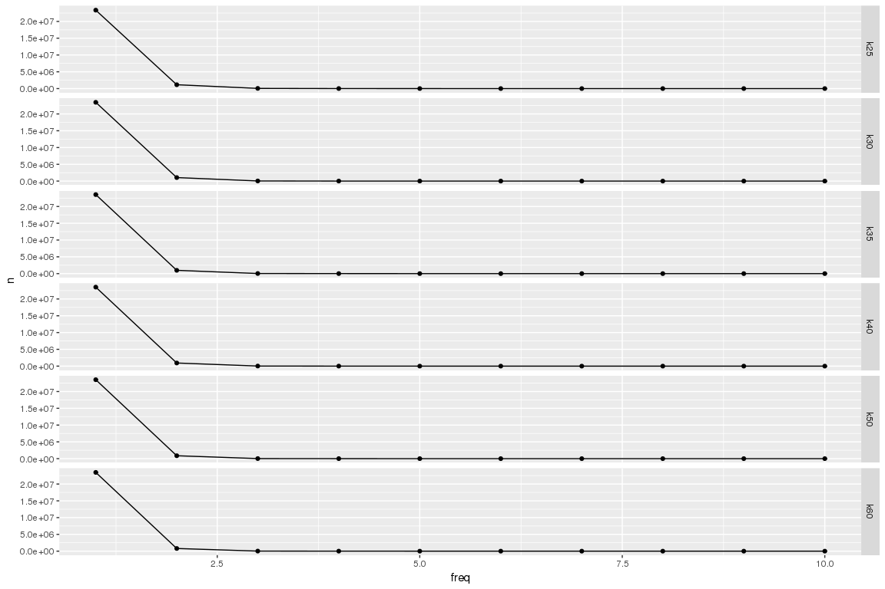
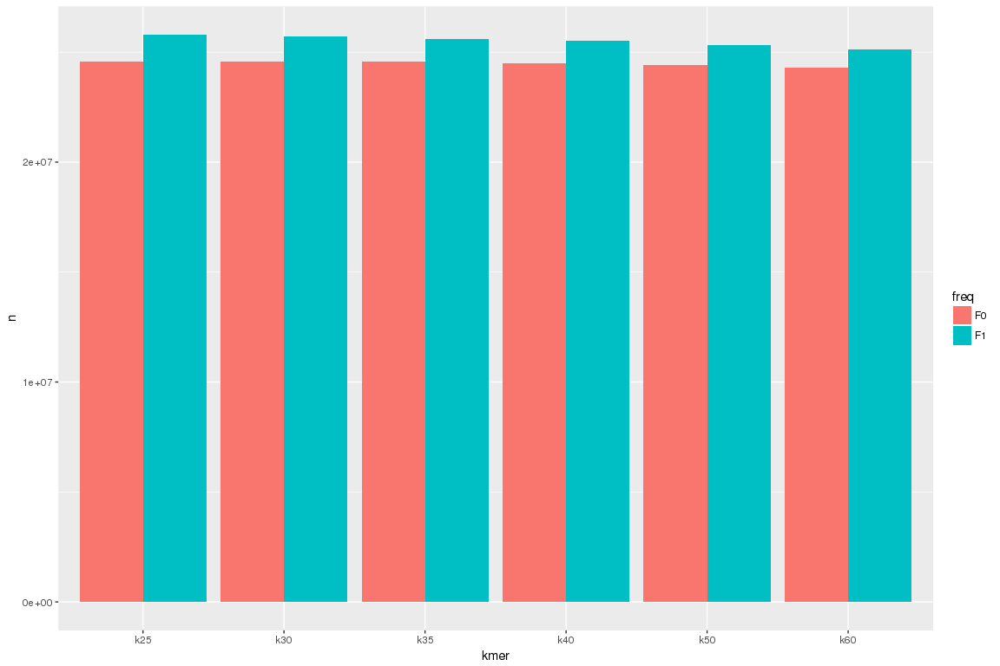

Kmer content in targets set - ntCard
================

``` r
library(reshape)
library( dplyr )
library( ggplot2 )
library( tidyr )
library( data.table )
library(plyr)

dataPath="/projects/btl/kgagalova/RepeatFilterDSK/ntCard/TargetSetKollector"
allFiles <- list.files( path = dataPath, pattern = ".hist", full.names = TRUE )

l <- lapply( allFiles, function( fn ){
  d <- read.table( fn, header = F );
  d$fileName <- fn;
  d
  } );

d <- bind_rows( l );
dim(d)
```

    ## [1] 396   3

``` r
d$kmer = sapply(strsplit(sapply(strsplit(sapply(strsplit(d$fileName,"/"),tail,1),"\\."),"[[",1),"_"),"[[",2)
nams = c("freq","n")
colnames(d)[c(1,2)] = nams
d$freq = as.character(d$freq)

#reobe F0 and F1
d1 = d[- grep("F[01]", d$freq),]
d1$freq = rep(1:64,6)
#replace zeroes wuth NA
#d1[, c(2)][d1[, 2]==0] <- "NA"


d_all = d[ grep("F[01]", d$freq),]
```

Plot the distribution of kmers in the target data set
-----------------------------------------------------

``` r
ggplot(data=d1, aes(x=freq, y=n)) +
    geom_line() + 
    geom_point() +
    xlim(1,10) + 
    facet_grid( kmer ~ .  )
```



``` r
#F0 and F1
ggplot(d_all,aes(kmer,n,fill=freq))+
     geom_bar(stat="identity",position="dodge")
```


