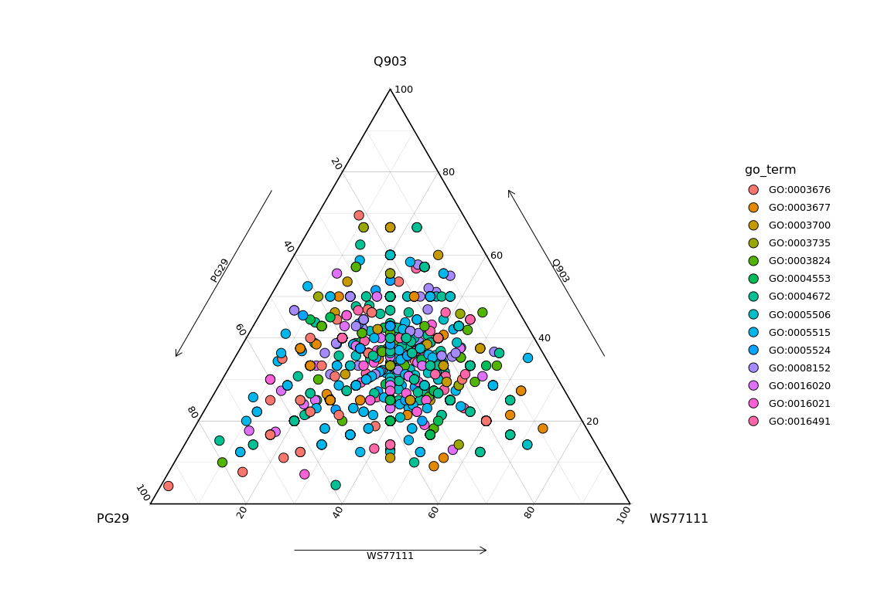
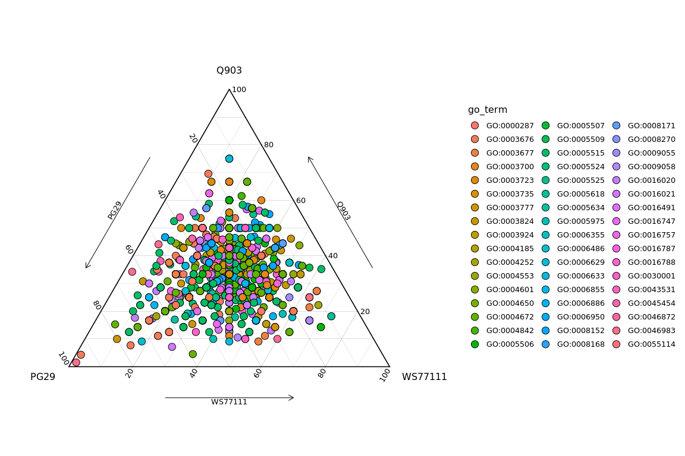
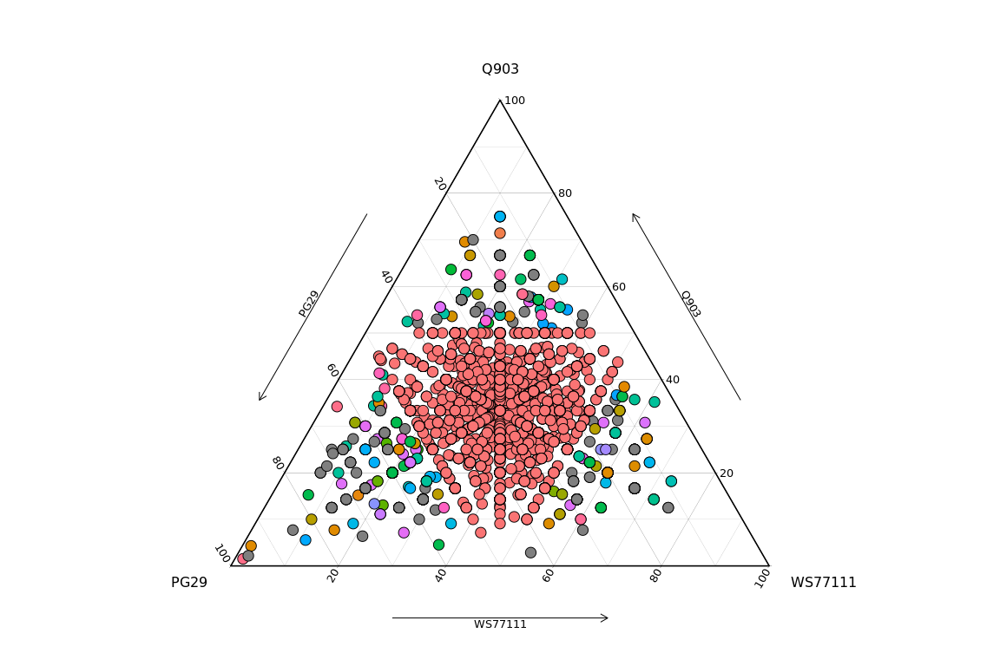
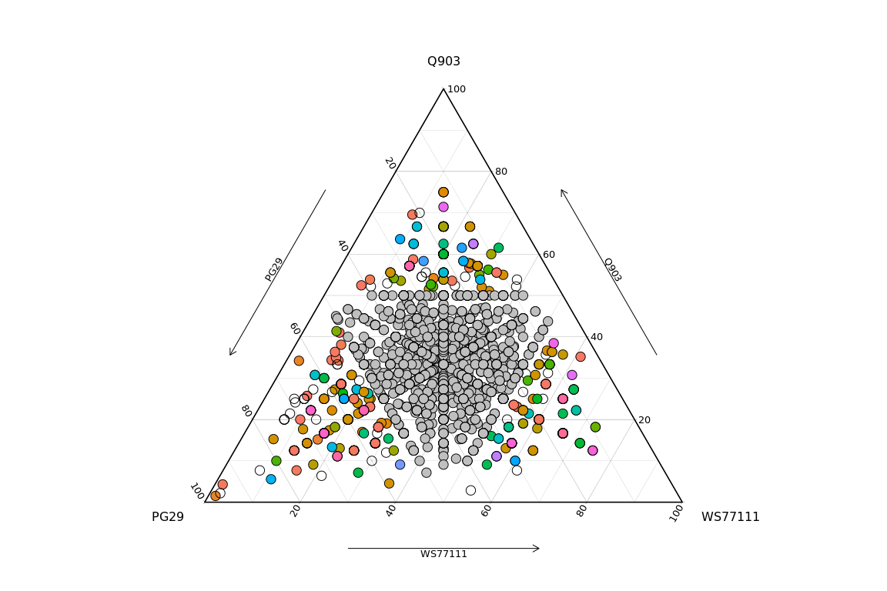
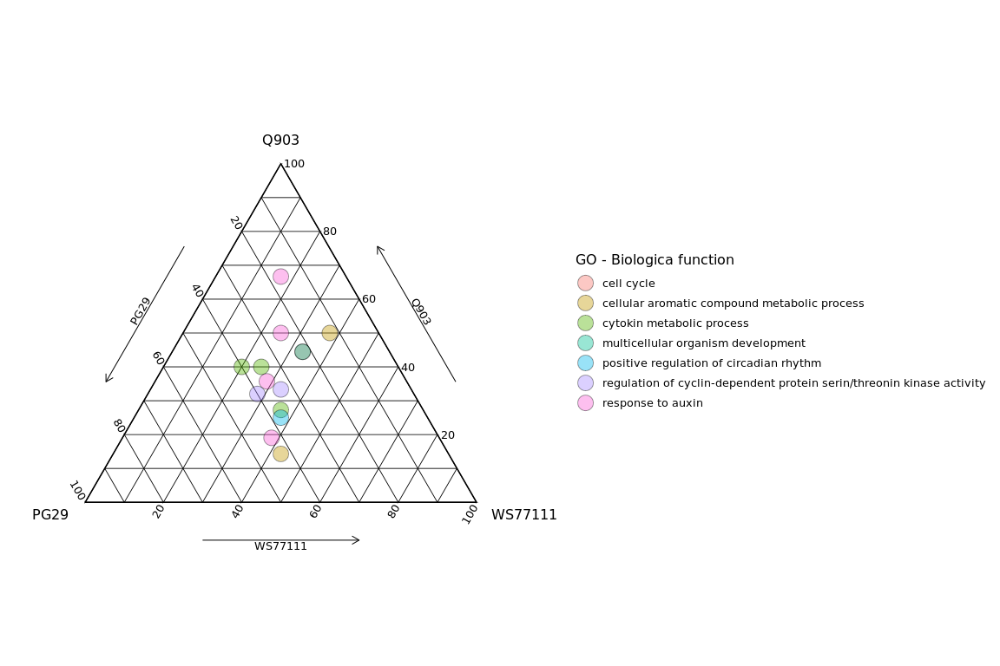

Gene families
================

Load the number of genes per ortogroup
--------------------------------------

``` r
og <- read.delim("/projects/spruceup_scratch/dev/SprucePaper2018/GeneFamilies/WSvsPG29vsQ903vsRefspecies_selAED/Species/OrthoFinder/Results_Out_PG29_WS_Q903_6species/Orthogroups/Orthogroups.GeneCountPG29_WS77111_Q903.tsv")
og$total = apply(og[,c(2,3,4)], 1, sum)
og$PG29_frac = og$PG29 / og$total
og$Q903_frac = og$Q903 / og$total
og$WS77111_frac = og$WS77111 / og$total
```

Check differences
-----------------

``` r
#WS_delta = data.frame(og$OG,og$WS77111_frac - og$PG29_frac,og$WS77111_frac - og$Q903_frac)
#Q903_delta = data.frame(og$OG,og$Q903_frac - og$PG29_frac,og$Q903_frac - og$WS77111_frac)
#PG29_delta = data.frame(og$OG,og$PG29_frac - og$Q903_frac,og$PG29_frac - og$WS77111_frac)

#TH = 0.05
#init_vec = rep(NA,nrow(PG29_delta))
#init_vec[which(WS_delta$og.WS77111_frac...og.PG29_frac > TH & WS_delta$og.WS77111_frac...og.Q903_frac > TH)] = "WS77111"
#init_vec[which(Q903_delta$og.Q903_frac...og.PG29_frac > TH & Q903_delta$og.Q903_frac...og.WS77111_frac > TH)] = "Q903"
#init_vec[which(PG29_delta$og.PG29_frac...og.WS77111_frac > TH & PG29_delta$og.PG29_frac...og.Q903_frac > TH)] = "PG29"
#og$delta5percent = as.factor(init_vec)

#TH = 0.1
#init_vec = rep(NA,nrow(PG29_delta))
#init_vec[which(WS_delta$og.WS77111_frac...og.PG29_frac > TH & WS_delta$og.WS77111_frac...og.Q903_frac > TH)] = "WS77111"
#init_vec[which(Q903_delta$og.Q903_frac...og.PG29_frac > TH & Q903_delta$og.Q903_frac...og.WS77111_frac > TH)] = "Q903"
#init_vec[which(PG29_delta$og.PG29_frac...og.WS77111_frac > TH & PG29_delta$og.PG29_frac...og.Q903_frac > TH)] = "PG29"
#og$delta10percent = as.factor(init_vec)
```

Import go terms
---------------

``` r
library( dplyr )
library( ggplot2 )
library( tidyr )
library( data.table )

dataPath="/projects/spruceup_scratch/dev/SprucePaper2018/GeneFamilies/WSvsPG29vsQ903vsRefspecies_selAED/Species/OrthoFinder/Results_Out_PG29_WS_Q903_6species/Orthogroups/ExtractGenes"
allFiles <- list.files( path = dataPath, pattern = "og_longInterproscan_go.tsv", full.names = TRUE )

l <- lapply( allFiles, function( fn ){
  d <- read.table( fn, header = F );
  d$fileName <- fn;
  d
  } );

d <- bind_rows( l );
dim(d)
```

    ## [1] 35050     4

``` r
colnames(d)[1:3] = c("gene","OG","go_terms")

d$species = as.factor(gsub("og_longInterproscan_go.tsv","",sapply(strsplit(d$fileName,"/"),"[[",13)))

#PG29ten_perc = merge(subset(og,og$delta10percent == "PG29"), d, by.x=c("OG","delta10percent"), by.y=c("OG","species"))
#WS77111ten_perc = merge(subset(og,og$delta10percent == "WS77111"), d, by.x=c("OG","delta10percent"), by.y=c("OG","species"))
#Q903ten_perc = merge(subset(og,og$delta10percent == "Q903"), d, by.x=c("OG","delta10percent"), by.y=c("OG","species"))

#freq_PG29 = as.data.frame(table(PG29ten_perc$go_terms,PG29ten_perc$OG))
#freq_PG29 = subset(freq_PG29,freq_PG29$Freq > 0)
#freq_PG29 = freq_PG29[with(freq_PG29, order(Var2, -Freq)), ]
#freq_PG29$Freq = as.numeric(freq_PG29$Freq)
#freq_PG29 = freq_PG29[!duplicated(freq_PG29$Var2),]
#write.table(as.data.frame(sapply(strsplit(as.character(freq_PG29$Var1),"\\|"),"[[",1)),"PG29goterms10perc.txt",row.names = F,quote=F,col.names = F)
#freq_PG29 = aggregate(freq_PG29$Freq, by = list(freq_PG29$Var2), max)
#tapply(PG29ten_perc$go_terms,PG29ten_perc$OG, summary)

#freq_WS77111 = as.data.frame(table(WS77111ten_perc$go_terms,WS77111ten_perc$OG))
#freq_WS77111 = subset(freq_WS77111,freq_WS77111$Freq > 0)
#freq_WS77111 = freq_WS77111[with(freq_WS77111, order(Var2, -Freq)), ]
#freq_WS77111$Freq = as.numeric(freq_WS77111$Freq)
#freq_WS77111 = freq_WS77111[!duplicated(freq_WS77111$Var2),]
#write.table(as.data.frame(sapply(strsplit(as.character(freq_WS77111$Var1),"\\|"),"[[",1)),"WS77111goterms10perc.txt",row.names = F,quote=F,col.names = F)

#freq_Q903 = as.data.frame(table(Q903ten_perc$go_terms,Q903ten_perc$OG))
#freq_Q903 = subset(freq_Q903,freq_Q903$Freq > 0)
#freq_Q903 = freq_Q903[with(freq_Q903, order(Var2, -Freq)), ]
#freq_Q903$Freq = as.numeric(freq_Q903$Freq)
#freq_Q903 = freq_Q903[!duplicated(freq_Q903$Var2),]
#write.table(as.data.frame(sapply(strsplit(as.character(freq_Q903$Var1),"\\|"),"[[",1)),"Q903goterms10perc.txt",row.names = F,quote=F,col.names = F)
```

``` r
library(ggtern)
#All_ten_perc = rbind(PG29ten_perc,WS77111ten_perc,Q903ten_perc)
#All_ten_perc = All_ten_perc[,c("OG","PG29","Q903","WS77111","go_terms")] 
#All_ten_perc$go_terms = sapply(strsplit(as.character(All_ten_perc$go_terms),"\\|"),"[[",1)

#selGO = c("GO:003001","GO:0016579","GO0045454","GO:0006801","GO:0006355","GO:0006952","GO:0006950")
#All_ten_percSelGO = unique(All_ten_perc[All_ten_perc$go_terms %in% selGO,])

#All_ten_percSelGOAllClades = merge(All_ten_percSelGO,og,by="OG",all.y=T)
#All_ten_percSelGOAllClades = All_ten_percSelGOAllClades[,c("OG","PG29.y","WS77111.y","Q903.y","go_terms")]

d$go_terms1 = sapply(strsplit(as.character(d$go_terms),"\\|"),"[[",1)
freq_all = as.data.frame(table(d$go_terms1,d$OG))
freq_all = subset(freq_all,freq_all$Freq != 0)
freq_all = freq_all[with(freq_all, order(Var2, -Freq)), ]
freq_all$Freq = as.numeric(freq_all$Freq)
freq_all = freq_all[!duplicated(freq_all$Var2),]

og_go = merge(og[,c("OG","PG29","Q903","WS77111")],freq_all[,c("Var1","Var2")],by.x = "OG",by.y = "Var2",all.x = T)
colnames(og_go)[5] = "go_term"
og_go$go_term = as.character(og_go$go_term)
Freq_go_terms = as.data.frame(table(og_go$go_term))
Freq_go_terms = Freq_go_terms[rev(order(Freq_go_terms$Freq)),]
sum(!is.na(og_go$go_term))
```

    ## [1] 2940

``` r
Freq_go_terms_10 = subset(Freq_go_terms, Freq_go_terms$Freq >= 10)
og_go_10 = og_go[og_go$go_term %in%  as.character(Freq_go_terms_10$Var1),]

Freq_go_terms_30 = subset(Freq_go_terms, Freq_go_terms$Freq >= 30)
og_go_30 = og_go[og_go$go_term %in%  as.character(Freq_go_terms_30$go_term),]

Freq_go_terms_50 = subset(Freq_go_terms, Freq_go_terms$Freq >= 50)
og_go_50 = og_go[og_go$go_term %in%  as.character(Freq_go_terms_50$Var1),]

Freq_go_terms_100 = subset(Freq_go_terms, Freq_go_terms$Freq >= 100)
og_go_100 = og_go[og_go$go_term %in%  as.character(Freq_go_terms_100$Var1),]

ggtern(og_go, aes(PG29,Q903,WS77111,fill = go_term)) + 
  geom_point(shape=21,size=4,show.legend = FALSE) + 
  theme(legend.position="none") + 
  theme_linedraw() +
  theme_showarrows()
```


``` r
ggtern(og_go_50, aes(PG29,Q903,WS77111,fill = go_term)) + 
  geom_point(shape=21,size=4) + 
  #theme_legend_position("none") + 
  theme(legend.position="none") + 
  theme_linedraw() +
  theme_showarrows()
```



``` r
ggtern(og_go_10, aes(PG29,Q903,WS77111,fill = go_term)) + 
  geom_point(shape=21,size=4) + 
  theme(legend.position="none") + 
  theme_linedraw() +
  theme_showarrows()
```



``` r
###color the dots with lower fraction to gray
to_keep_ogFrac50 = c(which(og$PG29_frac > 0.5),which(og$Q903_frac>0.5),which(og$WS77111_frac>0.5))
mock_elem = 1:nrow(og_go)
to_NA = mock_elem [! mock_elem %in% to_keep_ogFrac50]
og_go$go_term_frac50 = og_go$go_term
og_go[to_NA,"go_term_frac50"] = "NS"

ggtern(og_go, aes(PG29,Q903,WS77111,fill = go_term_frac50)) + 
  geom_point(shape=21,size=4,show.legend = FALSE) + 
  theme(legend.position="none") + 
  theme_linedraw() +
  theme_showarrows()
```



``` r
to_keep_ogFrac40 = c(which(og$PG29_frac > 0.45),which(og$Q903_frac>0.45),which(og$WS77111_frac>0.45))
mock_elem = 1:nrow(og_go)
to_NA = mock_elem [! mock_elem %in% to_keep_ogFrac40]
og_go$go_term_frac40 = og_go$go_term
og_go[to_NA,"go_term_frac40"] = "NS"

to_keep_ogFrac60 = c(which(og$PG29_frac > 0.6),which(og$Q903_frac>0.6),which(og$WS77111_frac>0.6))
mock_elem = 1:nrow(og_go)
to_NA = mock_elem [! mock_elem %in% to_keep_ogFrac60]
og_go$go_term_frac60 = og_go$go_term
og_go[to_NA,"go_term_frac60"] = "NS"

library(scales)
paletteFrac50 = hue_pal()(127)
paletteFrac50[1] = "gray75"
names(paletteFrac50) = unique(as.factor(og_go$go_term_frac50))

ggtern(og_go, aes(PG29,Q903,WS77111,fill = go_term_frac50)) + 
  geom_point(shape=21,size=4,show.legend = FALSE) + 
  theme(legend.position="none") + 
  theme_linedraw() +
  theme_showarrows() +
  scale_fill_manual(values = paletteFrac50)
```



``` r
#dev ids
dev_ids = c("GO:0006725","GO:0009690","GO:0007275","GO:0000079","GO:0007049","GO:0009733","GO:0042753")
dev_ids_nams = c("cellular aromatic compound metabolic process", "cytokin metabolic process","multicellular organism development","regulation of cyclin-dependent protein serin/threonin kinase activity","cell cycle","response to auxin","positive regulation of circadian rhythm")
#names(dev_ids) = dev_ids_nams
dev_idsNams = as.data.frame(cbind(dev_ids,dev_ids_nams))

mock_ids = og_go$go_term
mock_ids[!og_go$go_term %in% dev_ids] = NA

og_go$go_termDevIds = mock_ids 

og_goDevIds = og_go[which(!is.na(og_go$go_termDevIds)),]
og_goDevIds = merge(og_go,dev_idsNams,by.x="go_termDevIds",by.y="dev_ids")

ggtern(og_goDevIds, aes(PG29,Q903,WS77111,fill = dev_ids_nams )) + 
  #geom_point(shape=21,size=4,alpha=0.8,show.legend = FALSE) + 
  geom_point(shape=21,size=6,alpha=0.4) + 
  #theme(legend.position="none") + 
  theme_linedraw(base_size = 12) +
  labs(fill='GO - Biologica function') + 
  theme_showarrows() +  
  theme(panel.grid.minor = element_line(size = 0.3), panel.grid.major = element_line(size = 0.3)) #+
```



``` r
  #scale_fill_manual(values = paletteDevIds)

#stress
dev_ids = c("GO:0006725","GO:0009690","GO:0007275","GO:0000079","GO:0007049","GO:0009733")
dev_ids_nams = c("cellular aromatic compound metabolic process", "cytokin metabolic process","multicellular organism development","regulation of cyclin-dependent protein serin/threonin kinase activity","cell cycle","response to auxin")
```
